# Node Management

<cite>
**Referenced Files in This Document**
- [node.hpp](file://libraries/network/include/graphene/network/node.hpp)
- [node.cpp](file://libraries/network/node.cpp)
- [peer_connection.hpp](file://libraries/network/include/graphene/network/peer_connection.hpp)
- [peer_database.hpp](file://libraries/network/include/graphene/network/peer_database.hpp)
- [message.hpp](file://libraries/network/include/graphene/network/message.hpp)
- [config.hpp](file://libraries/network/include/graphene/network/config.hpp)
- [core_messages.hpp](file://libraries/network/include/graphene/network/core_messages.hpp)
- [exceptions.hpp](file://libraries/network/include/graphene/network/exceptions.hpp)
- [stcp_socket.hpp](file://libraries/network/include/graphene/network/stcp_socket.hpp)
- [message_oriented_connection.hpp](file://libraries/network/include/graphene/network/message_oriented_connection.hpp)
- [fork_database.hpp](file://libraries/chain/include/graphene/chain/fork_database.hpp)
- [fork_database.cpp](file://libraries/chain/fork_database.cpp)
- [database.cpp](file://libraries/chain/database.cpp)
- [config.hpp](file://libraries/protocol/include/graphene/protocol/config.hpp)
- [p2p_plugin.cpp](file://plugins/p2p/p2p_plugin.cpp)
- [dlt_block_log.cpp](file://libraries/chain/dlt_block_log.cpp)
</cite>

## Update Summary
**Changes Made**
- Enhanced peer block ID range handling with detailed peer block ID ranges, item requests, and sync status information
- Improved error logs with clear block availability context in DLT mode including comprehensive block range information
- Enhanced peer status reporting with detailed sync status updates and peer synchronization metrics
- Improved DLT mode error logging with contextual information about available block ranges and dlt_block_log boundaries
- Enhanced peer connection state management with detailed synchronization progress tracking

## Table of Contents
1. [Introduction](#introduction)
2. [Project Structure](#project-structure)
3. [Core Components](#core-components)
4. [Architecture Overview](#architecture-overview)
5. [Detailed Component Analysis](#detailed-component-analysis)
6. [Enhanced Peer Handling and Soft-Banning](#enhanced-peer-handling-and-soft-banning)
7. [Emergency Consensus Network-Level Improvements](#emergency-consensus-network-level-improvements)
8. [DLT Mode Error Logging Enhancements](#dlt-mode-error-logging-enhancements)
9. [Peer Status and Sync Status Reporting](#peer-status-and-sync-status-reporting)
10. [Dependency Analysis](#dependency-analysis)
11. [Performance Considerations](#performance-considerations)
12. [Troubleshooting Guide](#troubleshooting-guide)
13. [Conclusion](#conclusion)

## Introduction
This document describes the Node Management component responsible for orchestrating network peers, maintaining connectivity, and managing blockchain synchronization in the P2P layer. It covers the node.hpp class interface, the node_delegate integration for blockchain callbacks, configuration and lifecycle APIs, peer management, and network broadcasting with inventory tracking. The documentation now includes comprehensive coverage of enhanced peer handling logic with intelligent soft-banning mechanisms, improved unlinkable_block_exception handling, and prevention of infinite sync loops.

## Project Structure
The Node Management functionality spans several headers and the implementation source file:
- Public interface: node.hpp defines the node class, node_delegate interface, and related types.
- Implementation: node.cpp implements the node lifecycle, peer orchestration, message routing, synchronization, and inventory management with enhanced peer handling logic.
- Peer model: peer_connection.hpp defines the peer connection abstraction and state machine with emergency consensus support and soft-ban functionality.
- Persistence: peer_database.hpp provides persistent peer discovery records.
- Messaging: message.hpp defines the generic message envelope; core_messages.hpp enumerates core P2P message types.
- Networking primitives: stcp_socket.hpp and message_oriented_connection.hpp underpin transport and framing.
- Emergency consensus: fork_database.hpp/cpp and database.cpp implement emergency mode functionality.

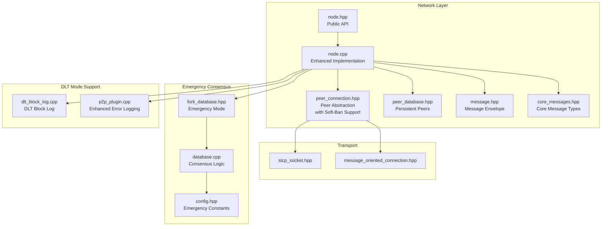

**Diagram sources**
- [node.hpp:180-355](file://libraries/network/include/graphene/network/node.hpp#L180-L355)
- [node.cpp:869-905](file://libraries/network/node.cpp#L869-L905)
- [peer_connection.hpp:79-354](file://libraries/network/include/graphene/network/peer_connection.hpp#L79-L354)
- [peer_database.hpp:104-134](file://libraries/network/include/graphene/network/peer_database.hpp#L104-L134)
- [message.hpp:42-114](file://libraries/network/include/graphene/network/message.hpp#L42-L114)
- [core_messages.hpp](file://libraries/network/include/graphene/network/core_messages.hpp)
- [fork_database.hpp:111-120](file://libraries/chain/include/graphene/chain/fork_database.hpp#L111-L120)
- [database.cpp:4334-4463](file://libraries/chain/database.cpp#L4334-L4463)
- [config.hpp:110-123](file://libraries/protocol/include/graphene/protocol/config.hpp#L110-L123)
- [dlt_block_log.cpp:368-379](file://libraries/chain/dlt_block_log.cpp#L368-L379)
- [p2p_plugin.cpp:330-360](file://plugins/p2p/p2p_plugin.cpp#L330-L360)

**Section sources**
- [node.hpp:180-355](file://libraries/network/include/graphene/network/node.hpp#L180-L355)
- [node.cpp:869-905](file://libraries/network/node.cpp#L869-L905)

## Core Components
- node class: Provides P2P orchestration, configuration, peer management, and broadcast APIs.
- node_delegate interface: Bridges the P2P layer to the blockchain, handling block ingestion, transaction processing, and sync callbacks.
- peer_connection: Encapsulates a single peer link with state machine, inventory tracking, rate-limited messaging, emergency consensus support, and intelligent soft-ban functionality.
- peer_database: Persistent store of potential peers with connection history and disposition.
- message: Generic envelope for all P2P messages with hashing and typed serialization.
- fork_database: Manages blockchain forks with emergency consensus mode support and deterministic tie-breaking.

Key responsibilities:
- Lifecycle: Construction, configuration loading, listener setup, and graceful shutdown.
- Peer orchestration: Connecting to configured seeds, accepting inbound connections, pruning inactive peers, and enforcing connection limits.
- Synchronization: Requesting and processing blockchain item IDs, fetching blocks/transactions, and notifying the delegate.
- Broadcasting: Advertising inventory and sending items to peers.
- Inventory management: Tracking what peers have, what we need, and what we've recently processed.
- Emergency consensus: Managing soft-bans, automatic flag resets, and emergency mode operations.
- Intelligent peer handling: Differentiating between stale fork peers and legitimate sync candidates to prevent infinite loops.
- DLT mode support: Enhanced error logging with comprehensive block range information for distributed ledger technology mode.

**Section sources**
- [node.hpp:180-355](file://libraries/network/include/graphene/network/node.hpp#L180-L355)
- [node.cpp:869-905](file://libraries/network/node.cpp#L869-L905)
- [peer_connection.hpp:79-354](file://libraries/network/include/graphene/network/peer_connection.hpp#L79-L354)
- [peer_database.hpp:104-134](file://libraries/network/include/graphene/network/peer_database.hpp#L104-L134)
- [message.hpp:42-114](file://libraries/network/include/graphene/network/message.hpp#L42-L114)
- [fork_database.hpp:111-120](file://libraries/chain/include/graphene/chain/fork_database.hpp#L111-L120)

## Architecture Overview
The node delegates blockchain integration to a node_delegate and coordinates peers via peer_connection instances. The node maintains separate queues for sync and normal operation, enforces bandwidth and connection limits, and periodically prunes stale peers. The enhanced peer handling system provides network-level resilience through intelligent soft-ban mechanisms, automatic flag resets, and deterministic tie-breaking to prevent cascading failures and infinite sync loops.


**Diagram sources**
- [node.hpp:180-355](file://libraries/network/include/graphene/network/node.hpp#L180-L355)
- [peer_connection.hpp:79-354](file://libraries/network/include/graphene/network/peer_connection.hpp#L79-L354)
- [fork_database.hpp:111-120](file://libraries/chain/include/graphene/chain/fork_database.hpp#L111-L120)

## Detailed Component Analysis

### Node Lifecycle Management
- Construction and destruction: The node allocates an internal node_impl and initializes defaults for connection targets, timeouts, and rate limiting. On destruction, it attempts to gracefully close connections and updates the peer database.
- Configuration: load_configuration reads node-specific settings (listening endpoint, accept flags) from a JSON file in the configuration directory.
- Listener setup: listen_to_p2p_network and listen_on_endpoint/listen_on_port configure the TCP server to accept inbound connections, with optional retry behavior when the port is busy.
- Startup and shutdown: connect_to_p2p_network initiates outbound connections; close() and destructor ensure cleanup.

Operational loops:
- p2p_network_connect_loop: Periodically connects to candidate peers, respecting retry/backoff and connection caps.
- fetch_sync_items_loop: Requests missing sync items from peers and schedules processing.
- fetch_items_loop: Normal operation fetching of items not yet in local cache.
- advertise_inventory_loop: Broadcasts new inventory to peers.
- terminate_inactive_connections_loop: Detects and disconnects idle/inactive peers.
- bandwidth_monitor_loop: Updates rolling averages of read/write throughput.
- fetch_updated_peer_lists_loop: Requests updated peer lists periodically.

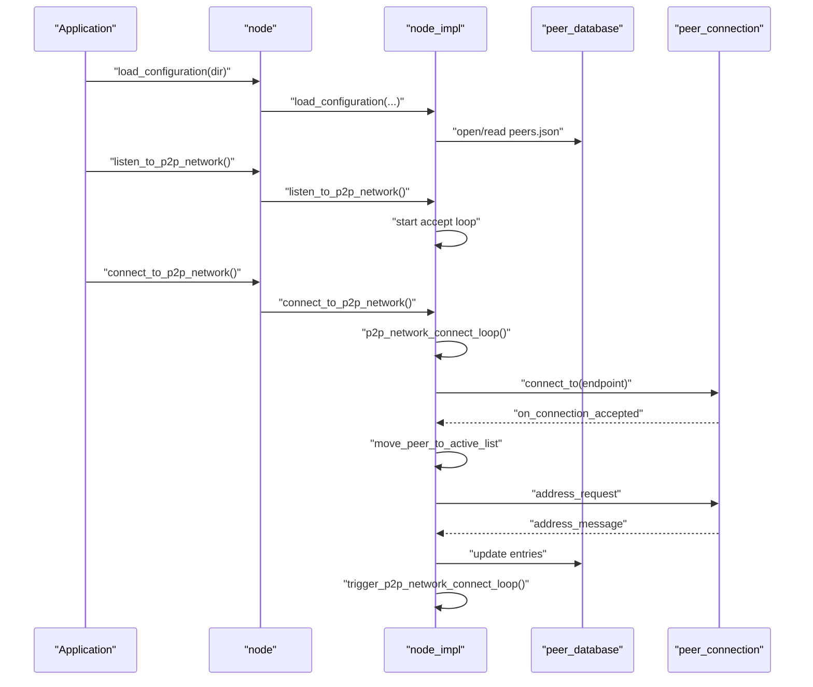

**Diagram sources**
- [node.cpp:952-1047](file://libraries/network/node.cpp#L952-L1047)
- [node.cpp:1623-1654](file://libraries/network/node.cpp#L1623-L1654)
- [node.cpp:2282-2350](file://libraries/network/node.cpp#L2282-L2350)

**Section sources**
- [node.cpp:869-931](file://libraries/network/node.cpp#L869-L931)
- [node.cpp:952-1047](file://libraries/network/node.cpp#L952-L1047)
- [node.cpp:1623-1654](file://libraries/network/node.cpp#L1623-L1654)
- [node.cpp:2282-2350](file://libraries/network/node.cpp#L2282-L2350)

### Peer Connection Establishment
- Outbound: connect_to_endpoint creates a peer_connection and initiates a connect loop; on success, transitions to negotiation and then active.
- Inbound: accept_loop accepts sockets and starts accept_or_connect_task; after hello exchange, moves to active and starts synchronization.
- Handshake validation: Verifies signatures, chain ID, fork compatibility, and prevents self-connections and duplicates.
- Firewall detection: Uses check-firewall messages to infer NAT/firewall status.
- Emergency consensus: Soft-ban peers on fork rejection with automatic expiration handling and intelligent peer classification.

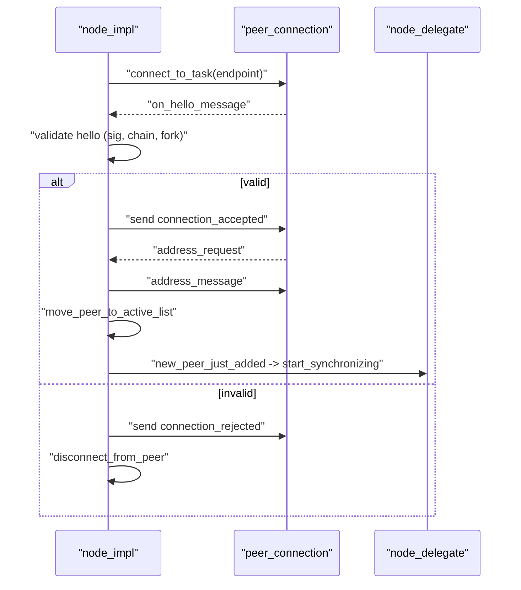

**Diagram sources**
- [node.cpp:2029-2230](file://libraries/network/node.cpp#L2029-L2230)
- [node.cpp:2232-2250](file://libraries/network/node.cpp#L2232-L2250)
- [node.cpp:2282-2350](file://libraries/network/node.cpp#L2282-L2350)

**Section sources**
- [node.cpp:2029-2230](file://libraries/network/node.cpp#L2029-L2230)
- [node.cpp:2232-2250](file://libraries/network/node.cpp#L2232-L2250)
- [node.cpp:2282-2350](file://libraries/network/node.cpp#L2282-L2350)

### Network Topology Maintenance
- Peer selection: Maintains a potential peer database with last-seen timestamps, disposition, and attempt counts; applies exponential backoff and retry windows.
- Connection caps: Tracks handshaking, active, closing, and terminating sets; enforces desired/max connection counts.
- Inactivity pruning: Disconnects peers exceeding inactivity thresholds and reschedules outstanding requests to others.
- Peer advertising: Optionally disables advertising to restrict exposure.
- Emergency consensus: Implements soft-ban mechanisms to prevent cascading disconnections during network emergencies.
- Intelligent peer classification: Differentiates between stale fork peers and legitimate sync candidates to prevent infinite loops.


**Diagram sources**
- [node.cpp:952-1047](file://libraries/network/node.cpp#L952-L1047)

**Section sources**
- [node.cpp:952-1047](file://libraries/network/node.cpp#L952-L1047)
- [node.cpp:1400-1621](file://libraries/network/node.cpp#L1400-L1621)

### Blockchain Integration via node_delegate
- Block handling: handle_block receives new blocks during sync or normal operation; returns whether a fork switch occurred; populates contained transaction IDs for propagation.
- Transaction processing: handle_transaction validates and accepts transactions.
- Sync callbacks: get_block_ids, get_blockchain_synopsis, sync_status, and connection_count_changed inform the delegate about sync progress and peer counts.
- Fork awareness: Estimates last known fork from timestamps and rejects incompatible peers.

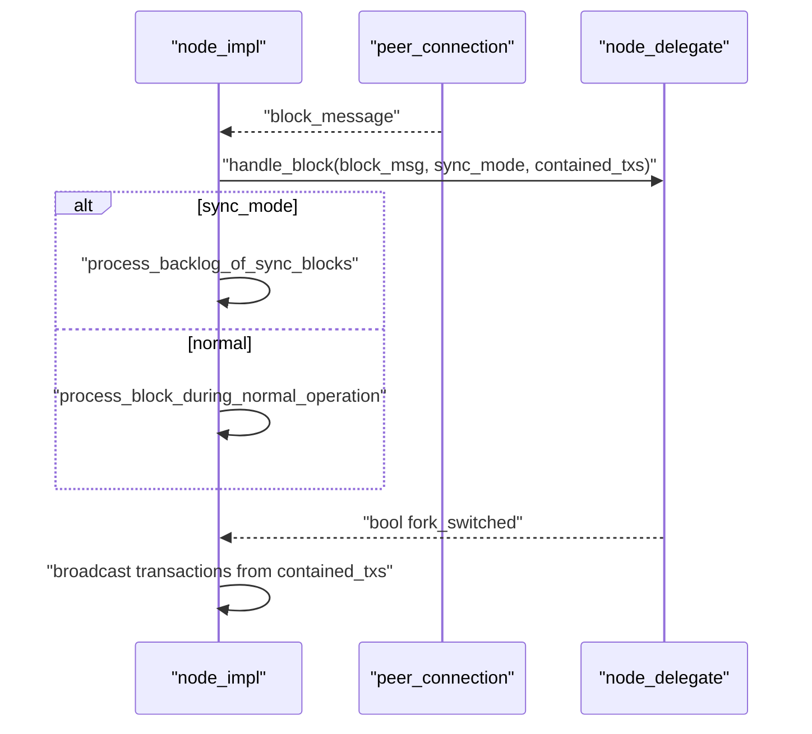

**Diagram sources**
- [node.hpp:79-80](file://libraries/network/include/graphene/network/node.hpp#L79-L80)
- [node.cpp:3117-3199](file://libraries/network/node.cpp#L3117-L3199)

**Section sources**
- [node.hpp:79-80](file://libraries/network/include/graphene/network/node.hpp#L79-L80)
- [node.cpp:3117-3199](file://libraries/network/node.cpp#L3117-L3199)

### Configuration Methods
- load_configuration: Reads node_config.json and sets listening endpoint, accept flags, and persistence directory.
- listen_on_endpoint/accept_incoming_connections/listen_on_port: Configure the TCP listener and availability behavior.
- set_advanced_node_parameters/get_advanced_node_parameters: Tuning knobs for advanced behavior.
- set_total_bandwidth_limit: Configures upload/download rate limiting.
- disable_peer_advertising: Restricts outbound peer advertisement.

**Section sources**
- [node.hpp:200-294](file://libraries/network/include/graphene/network/node.hpp#L200-L294)
- [node.cpp:933-950](file://libraries/network/node.cpp#L933-L950)
- [node.cpp:1686-1713](file://libraries/network/node.cpp#L1686-L1713)

### Peer Management Functions
- add_node/connect_to_endpoint: Adds a seed or forces immediate connection.
- get_connected_peers: Returns status for UI/monitoring.
- get_connection_count/is_connected: Reports current connectivity.
- set_allowed_peers/clear_peer_database: Controls allowed peers and resets peer DB for diagnostics.
- get_potential_peers/disable_peer_advertising: Inspect and control peer discovery.

**Section sources**
- [node.hpp:211-296](file://libraries/network/include/graphene/network/node.hpp#L211-L296)
- [node.cpp:1788-1841](file://libraries/network/node.cpp#L1788-L1841)
- [node.cpp:2282-2350](file://libraries/network/node.cpp#L2282-L2350)

### Network Broadcasting and Inventory
- broadcast/broadcast_transaction: Queues outgoing messages and triggers inventory advertisement.
- Inventory tracking: Per-peer inventories (advertised to us/advertised to peer) and node-wide new_inventory set.
- Rate limiting: fc::rate_limiting_group controls bandwidth.
- Message caching: blockchain_tied_message_cache stores recent messages for retrieval.

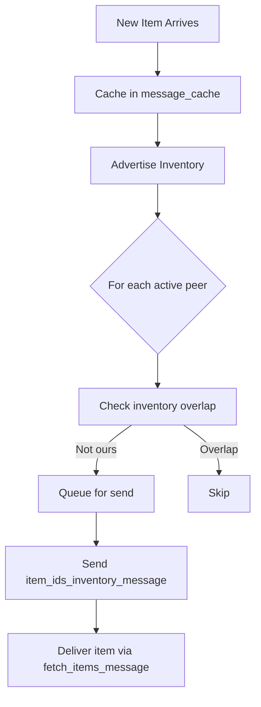

**Diagram sources**
- [node.cpp:1326-1398](file://libraries/network/node.cpp#L1326-L1398)
- [node.cpp:2830-2892](file://libraries/network/node.cpp#L2830-L2892)
- [node.cpp:111-217](file://libraries/network/node.cpp#L111-L217)

**Section sources**
- [node.cpp:1326-1398](file://libraries/network/node.cpp#L1326-L1398)
- [node.cpp:2830-2892](file://libraries/network/node.cpp#L2830-L2892)
- [node.cpp:111-217](file://libraries/network/node.cpp#L111-L217)

## Enhanced Peer Handling and Soft-Banning

### Intelligent Soft-Ban Mechanisms
The node now implements sophisticated soft-ban mechanisms to prevent cascading disconnections during emergency consensus scenarios and improve peer classification accuracy.

Key features:
- **Soft-ban duration**: 1 hour (3600 seconds) for fork-rejected blocks, reduced to 5 minutes (300 seconds) for trusted peers
- **Automatic expiration**: Soft-bans automatically expire after the designated period
- **Intelligent peer classification**: Differentiates between stale fork peers and legitimate sync candidates
- **Flag reset logic**: When soft-bans expire, the inhibit_fetching_sync_blocks flag is automatically reset
- **Emergency mode protection**: Prevents cascading failures during network emergencies
- **Infinite loop prevention**: Smart peer state management prevents endless sync attempts
- **Trusted peer support**: Special handling for peers in trusted-snapshot-peer configuration

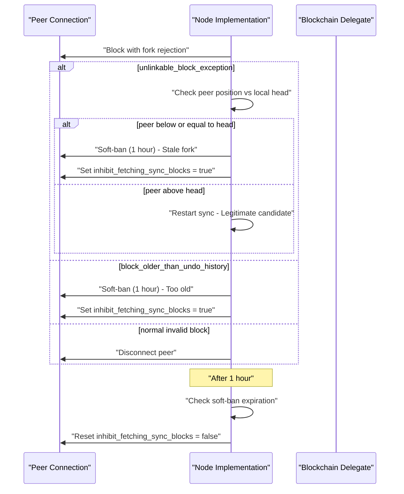

**Diagram sources**
- [node.cpp:3574-3629](file://libraries/network/node.cpp#L3574-L3629)
- [node.cpp:3436-3458](file://libraries/network/node.cpp#L3436-L3458)

### Enhanced Unlinkable Block Exception Handling
The system now provides intelligent handling for unlinkable_block_exception based on peer position relative to local blockchain head:

**Stale Fork Detection**:
- When peer block number ≤ local head block number
- Peer is on a stale fork that cannot be resolved
- Immediate soft-ban for 1 hour with inhibit_fetching_sync_blocks = true
- Prevents wasted bandwidth and prevents infinite sync loops
- Trusted peers receive 5-minute soft-ban duration instead of 1 hour

**Legitimate Sync Candidate**:
- When peer block number > local head block number  
- Peer may be ahead of us, indicating legitimate sync opportunity
- Restarts sync process instead of disconnecting
- Allows peer to potentially help us catch up
- Prevents unnecessary network churn during legitimate catch-up scenarios

**Section sources**
- [node.cpp:3574-3629](file://libraries/network/node.cpp#L3574-L3629)
- [node.cpp:3436-3458](file://libraries/network/node.cpp#L3436-L3458)
- [exceptions.hpp:45](file://libraries/network/include/graphene/network/exceptions.hpp#L45)

### Automatic Flag Reset Logic
The system includes intelligent flag management to ensure peers can resume normal operations after soft-ban expiration.

Reset conditions:
- **Soft-ban expiration**: When fork_rejected_until <= current_time
- **Flag state**: Only reset if inhibit_fetching_sync_blocks is currently true
- **Peer eligibility**: Only affects peers with non-zero fork_rejected_until timestamps
- **Network recovery**: Ensures long-term network health during extended emergency operations

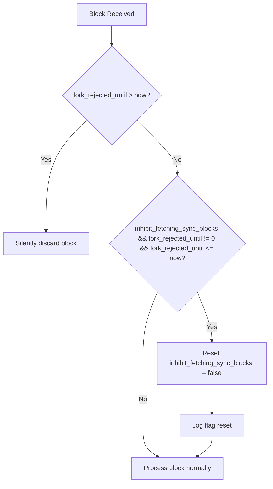

**Diagram sources**
- [node.cpp:3444-3458](file://libraries/network/node.cpp#L3444-L3458)

**Section sources**
- [node.cpp:3444-3458](file://libraries/network/node.cpp#L3444-L3458)

### Infinite Sync Loop Prevention
The enhanced peer handling logic prevents infinite sync loops through intelligent peer state management:

**Smart Peer Classification**:
- Stale fork peers (peer_num ≤ local_head) → Soft-ban and ignore
- Legitimate sync candidates (peer_num > local_head) → Continue sync attempts
- Automatic flag reset ensures fair peer rotation during extended operations

**Preventive Measures**:
- Soft-ban mechanism prevents repeated attempts with unresponsive peers
- Intelligent flag management ensures peers can recover after expiration
- Network-level emergency mode support provides graceful degradation

**Section sources**
- [node.cpp:3574-3629](file://libraries/network/node.cpp#L3574-L3629)
- [node.cpp:3444-3458](file://libraries/network/node.cpp#L3444-L3458)

## Emergency Consensus Network-Level Improvements

### Soft-Ban Expiration Handling
The node now implements sophisticated soft-ban mechanisms to prevent cascading disconnections during emergency consensus scenarios. When peers offer blocks that cause fork rejections, the system applies soft-bans instead of immediate disconnections.

Key features:
- **Soft-ban duration**: 1 hour (3600 seconds) for fork-rejected blocks, reduced to 5 minutes for trusted peers
- **Automatic expiration**: Soft-bans automatically expire after the designated period
- **Flag reset logic**: When soft-bans expire, the inhibit_fetching_sync_blocks flag is automatically reset
- **Emergency mode protection**: Prevents cascading failures during network emergencies

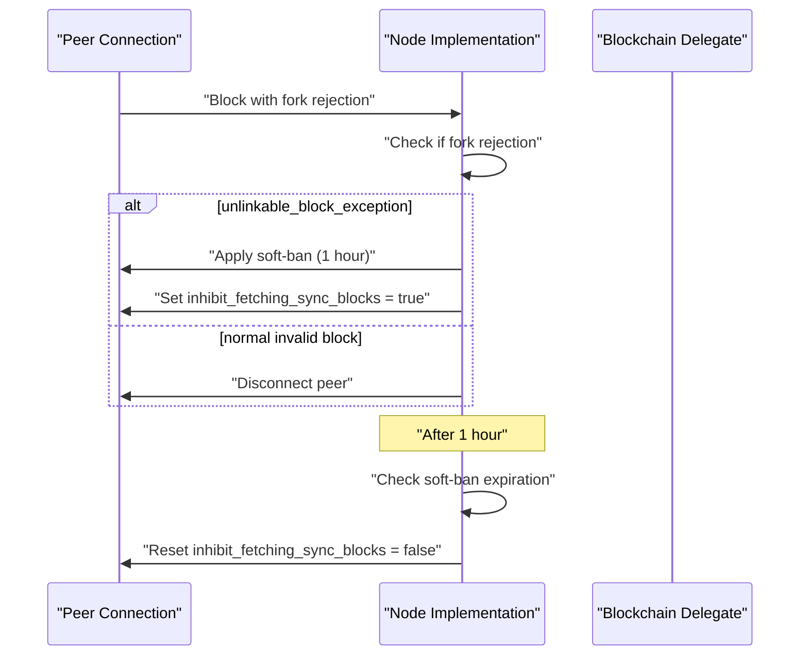

**Diagram sources**
- [node.cpp:3574-3595](file://libraries/network/node.cpp#L3574-L3595)
- [node.cpp:3436-3449](file://libraries/network/node.cpp#L3436-L3449)

### Inhibit Fetching Sync Blocks Flag Reset Logic
The system includes intelligent flag management to ensure peers can resume normal operations after soft-ban expiration.

Reset conditions:
- **Soft-ban expiration**: When fork_rejected_until <= current_time
- **Flag state**: Only reset if inhibit_fetching_sync_blocks is currently true
- **Peer eligibility**: Only affects peers with non-zero fork_rejected_until timestamps


**Diagram sources**
- [node.cpp:3428-3449](file://libraries/network/node.cpp#L3428-L3449)

### Network-Level Emergency Mode Support
The emergency consensus system provides comprehensive network-level resilience through multiple coordinated mechanisms.

#### Emergency Mode Activation
Emergency mode activates when no blocks are produced for CHAIN_EMERGENCY_CONSENSUS_TIMEOUT_SEC (3600 seconds) since the last irreversible block:

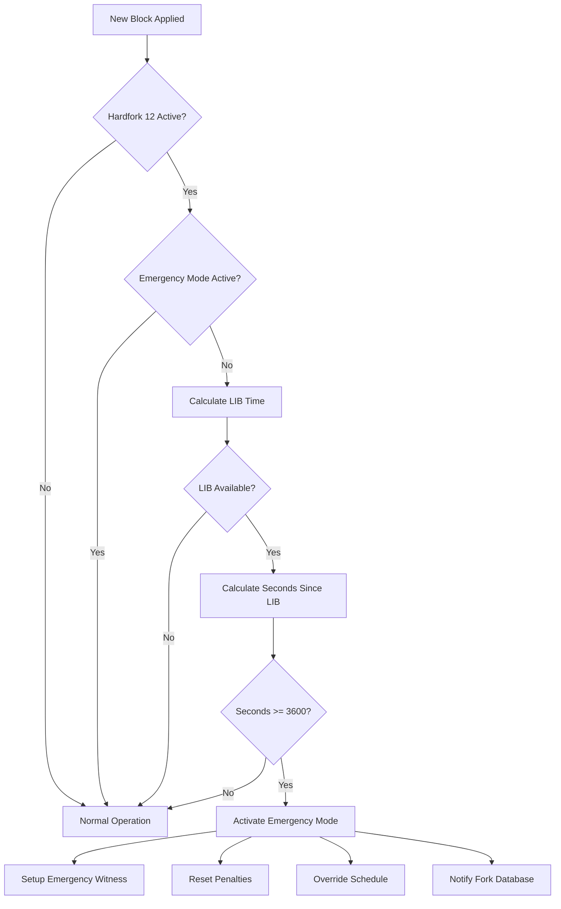

**Diagram sources**
- [database.cpp:4334-4463](file://libraries/chain/database.cpp#L4334-L4463)
- [fork_database.cpp:260-262](file://libraries/chain/fork_database.cpp#L260-L262)

#### Deterministic Tie-Breaking
During emergency mode, the system uses deterministic hash-based tie-breaking to ensure network convergence:

- **Hash comparison**: When multiple blocks compete at the same height, prefer the lower block_id hash
- **Consistent behavior**: All nodes converge regardless of P2P arrival order
- **Emergency witness dominance**: Emergency witness produces all blocks during emergency periods

#### Automatic Emergency Mode Exit
Emergency mode automatically exits after CHAIN_EMERGENCY_EXIT_NORMAL_BLOCKS (21) consecutive blocks produced by normal witnesses:

- **Normal block threshold**: 21 blocks equal to one full round of 21 witnesses
- **Witness rejoining detection**: Monitors when real witnesses resume production
- **Graceful transition**: Smooth return to normal consensus operation

**Section sources**
- [node.cpp:3428-3449](file://libraries/network/node.cpp#L3428-L3449)
- [node.cpp:3574-3595](file://libraries/network/node.cpp#L3574-L3595)
- [node.cpp:3436-3449](file://libraries/network/node.cpp#L3436-L3449)
- [database.cpp:4334-4463](file://libraries/chain/database.cpp#L4334-L4463)
- [fork_database.cpp:80-87](file://libraries/chain/fork_database.cpp#L80-L87)
- [config.hpp:110-123](file://libraries/protocol/include/graphene/protocol/config.hpp#L110-L123)

## DLT Mode Error Logging Enhancements

### Comprehensive Block Range Information
The DLT (Distributed Ledger Technology) mode now provides enhanced error logging with detailed block availability context, including comprehensive block range information for better troubleshooting and monitoring.

**Enhanced Error Logging Features**:
- **Block Number Context**: Logs the specific block number being requested (#${num})
- **Block Hash Information**: Includes the block hash (id) for precise identification
- **Available Range Details**: Shows the complete available block range [earliest..head]
- **DLT Block Log Boundaries**: Displays dlt_block_log boundaries [dlt_start..dlt_end]
- **Contextual Information**: Provides comprehensive context for troubleshooting DLT mode issues

**Error Log Format**:
```
DLT mode: cannot serve block #${num} (${id}) — 
available block range: [${earliest}..${head}], 
dlt_block_log: [${dlt_start}..${dlt_end}]
```

**Section sources**
- [p2p_plugin.cpp:330-360](file://plugins/p2p/p2p_plugin.cpp#L330-L360)
- [dlt_block_log.cpp:368-379](file://libraries/chain/dlt_block_log.cpp#L368-L379)

### DLT Mode Block Availability Monitoring
The system now monitors and logs DLT mode block availability with detailed metrics:

**Monitoring Capabilities**:
- **Earliest Available Block**: Tracks the earliest block number available in the system
- **Current Head Block**: Monifies the current head block number
- **DLT Block Log Range**: Shows the actual range covered by the dlt_block_log
- **Synopsis Generation**: Logs detailed information during get_blockchain_synopsis() operations

**Section sources**
- [p2p_plugin.cpp:479-489](file://plugins/p2p/p2p_plugin.cpp#L479-L489)

## Peer Status and Sync Status Reporting

### Enhanced Peer Status Updates
The node now provides comprehensive peer status reporting with detailed synchronization metrics and peer state information.

**Peer Status Information**:
- **Connection Counts**: Active, handshaking, and closing peer counts
- **Sync Status**: Whether peers are in sync with us or need synchronization
- **Sync Item Counts**: Number of sync items each peer might need
- **Soft-Ban Status**: Indicates if peers are inhibited from sync fetching
- **Block Information**: Current head block, block number, and block time for each peer

**Status Update Features**:
- **Periodic Status Reports**: Regular peer status updates logged for monitoring
- **Detailed Metrics**: Comprehensive metrics for each peer connection
- **Sync Progress Tracking**: Real-time tracking of synchronization progress
- **Resource Usage Monitoring**: Memory usage and queue sizes for each peer

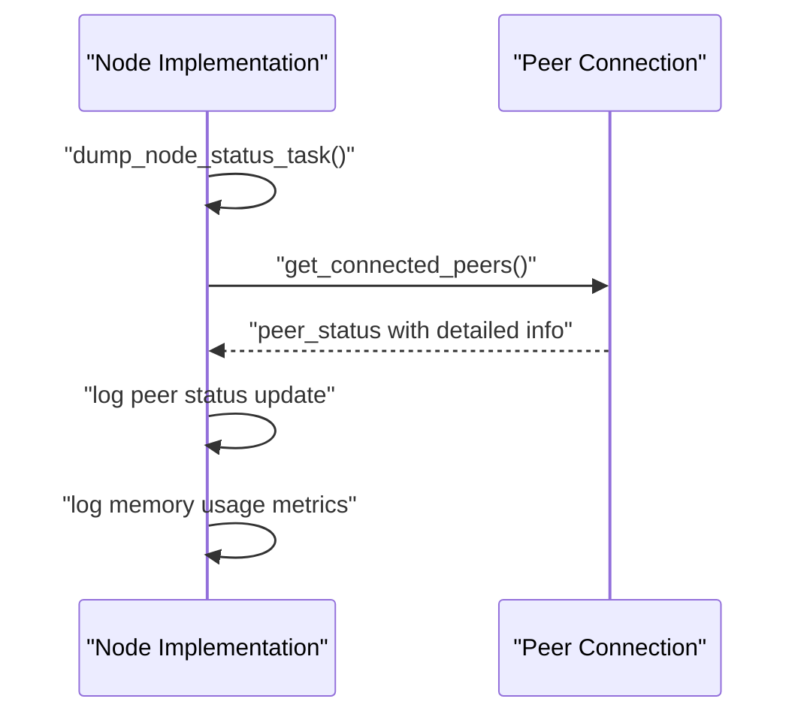

**Diagram sources**
- [node.cpp:5015-5030](file://libraries/network/node.cpp#L5015-L5030)
- [node.cpp:5042-5050](file://libraries/network/node.cpp#L5042-L5050)

**Section sources**
- [node.cpp:5015-5030](file://libraries/network/node.cpp#L5015-L5030)
- [node.cpp:5042-5050](file://libraries/network/node.cpp#L5042-L5050)

### Sync Status Reporting Enhancement
The node now provides enhanced sync status reporting with detailed item count information and progress tracking.

**Sync Status Features**:
- **Item Type Information**: Identifies the type of items being synchronized
- **Remaining Item Count**: Tracks the number of items remaining to be fetched
- **Progress Monitoring**: Real-time monitoring of synchronization progress
- **Peer Coordination**: Coordinates sync status across multiple peers

**Section sources**
- [node.cpp:2840-2847](file://libraries/network/node.cpp#L2840-L2847)
- [node.cpp:2848-2873](file://libraries/network/node.cpp#L2848-L2873)

### Peer Block ID Range Handling
The node now implements enhanced peer block ID range handling with detailed peer block ID ranges and improved item request processing.

**Enhanced Features**:
- **Detailed Block ID Ranges**: Tracks and logs detailed block ID ranges for each peer
- **Item Request Processing**: Improved handling of item requests with comprehensive logging
- **Sync Status Updates**: Real-time sync status updates with detailed peer information
- **Range Validation**: Validates block ranges and provides context for troubleshooting

**Section sources**
- [node.cpp:2395-2500](file://libraries/network/node.cpp#L2395-L2500)
- [node.cpp:2572-2592](file://libraries/network/node.cpp#L2572-L2592)

## Dependency Analysis
The node depends on:
- peer_connection for per-peer state and messaging with emergency consensus support and soft-ban functionality.
- peer_database for persistent peer records.
- message/core_messages for typed envelopes and core message dispatch.
- stcp_socket and message_oriented_connection for transport and framing.
- fc::rate_limiting_group for bandwidth control.
- fork_database for emergency consensus mode management.
- dlt_block_log for DLT mode block availability tracking.
- p2p_plugin for enhanced error logging and DLT mode support.

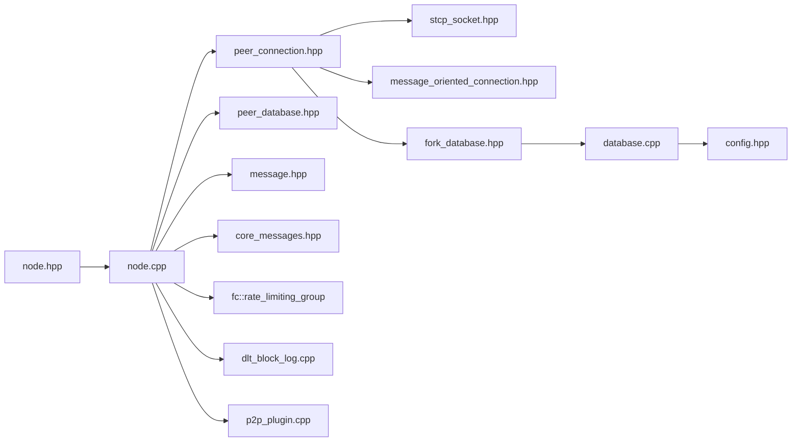

**Diagram sources**
- [node.hpp:180-355](file://libraries/network/include/graphene/network/node.hpp#L180-L355)
- [node.cpp:869-905](file://libraries/network/node.cpp#L869-L905)
- [peer_connection.hpp:79-354](file://libraries/network/include/graphene/network/peer_connection.hpp#L79-L354)
- [peer_database.hpp:104-134](file://libraries/network/include/graphene/network/peer_database.hpp#L104-L134)
- [message.hpp:42-114](file://libraries/network/include/graphene/network/message.hpp#L42-L114)
- [core_messages.hpp](file://libraries/network/include/graphene/network/core_messages.hpp)
- [fork_database.hpp:111-120](file://libraries/chain/include/graphene/chain/fork_database.hpp#L111-L120)
- [database.cpp:4334-4463](file://libraries/chain/database.cpp#L4334-L4463)
- [config.hpp:110-123](file://libraries/protocol/include/graphene/protocol/config.hpp#L110-L123)
- [dlt_block_log.cpp:368-379](file://libraries/chain/dlt_block_log.cpp#L368-L379)
- [p2p_plugin.cpp:330-360](file://plugins/p2p/p2p_plugin.cpp#L330-L360)

**Section sources**
- [node.hpp:180-355](file://libraries/network/include/graphene/network/node.hpp#L180-L355)
- [node.cpp:869-905](file://libraries/network/node.cpp#L869-L905)

## Performance Considerations
- Connection limits: desired/max connections cap concurrent peers; enforced in is_wanting_new_connections and is_accepting_new_connections.
- Bandwidth throttling: rate limiter updates rolling averages and constrains upload/download rates.
- Prefetching: Limits for sync and normal operations prevent resource exhaustion.
- Inactivity pruning: Keeps the mesh healthy by dropping idle peers and rescheduling requests.
- Inventory deduplication: Prevents redundant fetches and unbounded growth of fetch queues.
- Emergency consensus overhead: Minimal performance impact through efficient soft-ban expiration checks.
- Automatic flag management: Reduces manual intervention requirements during extended emergency operations.
- Intelligent peer classification: Optimizes peer selection and reduces wasted bandwidth on stale forks.
- Soft-ban caching: Prevents repeated attempts with problematic peers during emergency periods.
- Trusted peer optimization: Reduced soft-ban duration for trusted peers enables faster network recovery.
- DLT mode monitoring: Enhanced logging provides better visibility into block availability without significant performance impact.
- Peer status reporting: Comprehensive status updates enable better monitoring and resource management.

## Troubleshooting Guide
Common issues and resolutions:
- Port binding conflicts: Use listen_on_port with wait_if_endpoint_is_busy=true to retry; otherwise, allow dynamic port selection.
- Rejection reasons: Review connection_rejected_message reason codes (e.g., connected_to_self, already_connected, not_accepting_connections, different_chain, outdated client).
- Firewall/NAT: Use check-firewall messages to detect; adjust inbound/outbound ports and consider advertised inbound addresses.
- Peer database corruption: Clear peer database via clear_peer_database to reset discovery state.
- Bandwidth saturation: Adjust set_total_bandwidth_limit and review advertised inventory sizes.
- Hard fork incompatibility: Upgrade client if rejected due to inability to process future blocks.
- Emergency mode activation: Monitor logs for "EMERGENCY CONSENSUS MODE activated" messages; system automatically handles recovery.
- Soft-ban effects: If experiencing reduced peer connectivity, check soft-ban expiration timestamps; system should automatically reset flags.
- Flag reset issues: Verify inhibit_fetching_sync_blocks flag resets after soft-ban expiration; manual intervention rarely needed.
- Infinite sync loops: Monitor peer behavior; system now prevents endless sync attempts through intelligent soft-ban mechanisms.
- Stale fork detection: System automatically soft-bans peers on stale forks to prevent wasted resources.
- Trusted peer issues: Verify trusted-snapshot-peer configuration for reduced 5-minute soft-ban duration.
- Block rejection handling: Monitor unlinkable_block_exception patterns to identify stale fork vs legitimate sync scenarios.
- DLT mode errors: Review enhanced error logs for detailed block availability context including available range and dlt_block_log boundaries.
- Sync status monitoring: Use peer status updates to monitor synchronization progress and identify stuck peers.
- Memory usage: Monitor peer queue sizes and memory usage through status reports to identify resource bottlenecks.

**Section sources**
- [node.cpp:2251-2280](file://libraries/network/node.cpp#L2251-L2280)
- [node.cpp:2137-2168](file://libraries/network/node.cpp#L2137-L2168)
- [node.cpp:1686-1713](file://libraries/network/node.cpp#L1686-L1713)
- [node.cpp:1326-1398](file://libraries/network/node.cpp#L1326-L1398)
- [database.cpp:4455-4460](file://libraries/chain/database.cpp#L4455-L4460)
- [p2p_plugin.cpp:330-360](file://plugins/p2p/p2p_plugin.cpp#L330-L360)

## Conclusion
The Node Management component provides a robust, configurable, and efficient P2P orchestration layer with comprehensive emergency consensus support and enhanced peer handling capabilities. The recent improvements significantly enhance network resilience through intelligent soft-ban mechanisms, automatic flag reset logic, and deterministic tie-breaking algorithms.

The enhanced peer handling logic with improved unlinkable_block_exception handling and intelligent peer soft-banning mechanisms prevents cascading failures during emergency consensus scenarios while differentiating between stale fork peers and legitimate sync candidates to prevent infinite sync loops. The system now provides sophisticated peer classification based on block position relative to local blockchain head, ensuring optimal resource utilization and network stability.

The new DLT mode error logging enhancements provide comprehensive block availability context with detailed block range information, enabling better troubleshooting and monitoring of distributed ledger technology operations. The enhanced peer status reporting and sync status monitoring capabilities provide unprecedented visibility into network operations and peer synchronization progress.

These enhancements ensure the network can recover from extended periods without block production while maintaining operational efficiency and preventing cascading failures. The integration of emergency mode support with peer connection management, synchronization logic, and broadcast capabilities creates a comprehensive solution for maintaining network stability under adverse conditions. Proper configuration of limits, bandwidth, peer discovery, emergency consensus parameters, and the enhanced soft-ban mechanisms, combined with monitoring and troubleshooting practices, yields a stable, performant, and resilient network node capable of handling both normal operations and emergency scenarios with intelligent peer management and comprehensive diagnostic capabilities.