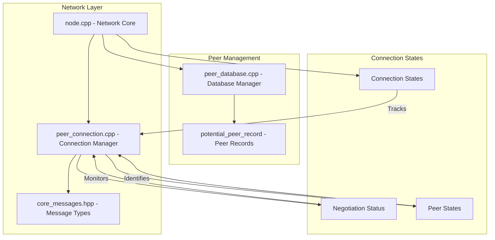
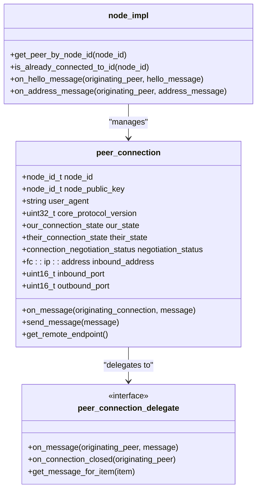
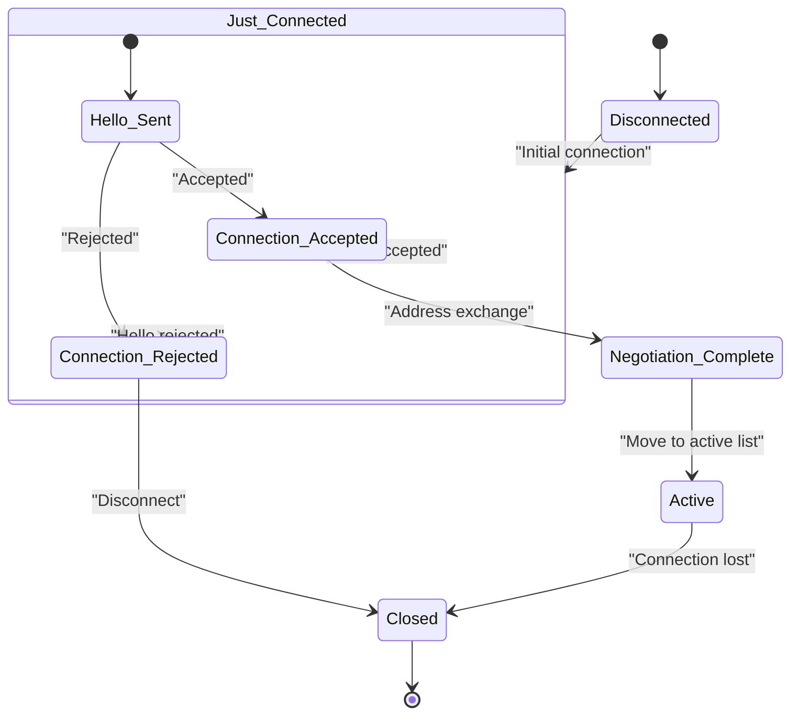
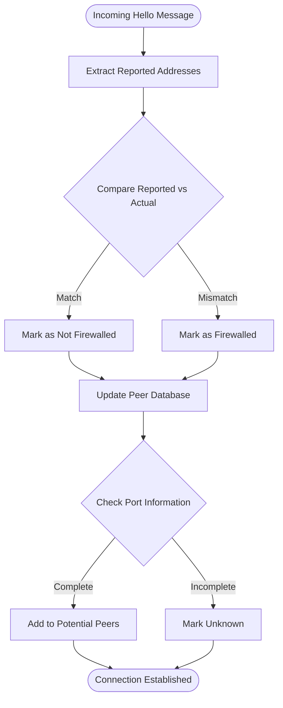
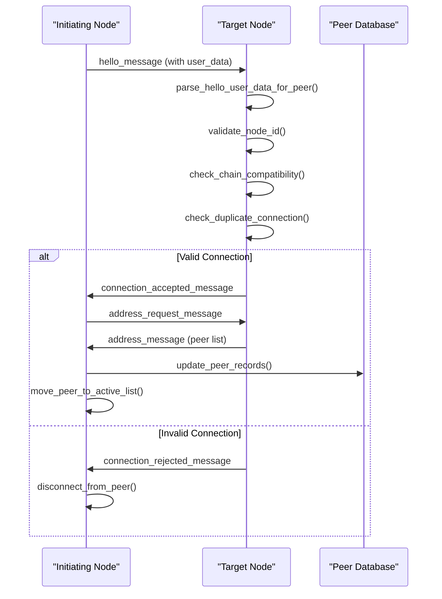
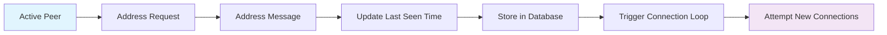
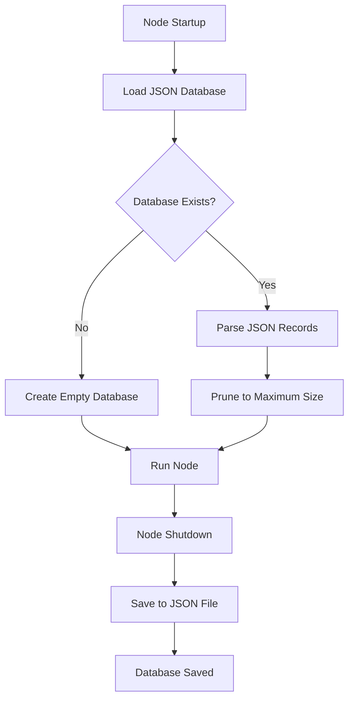
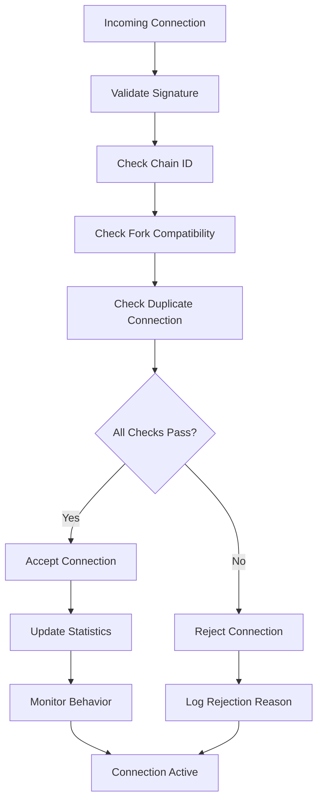
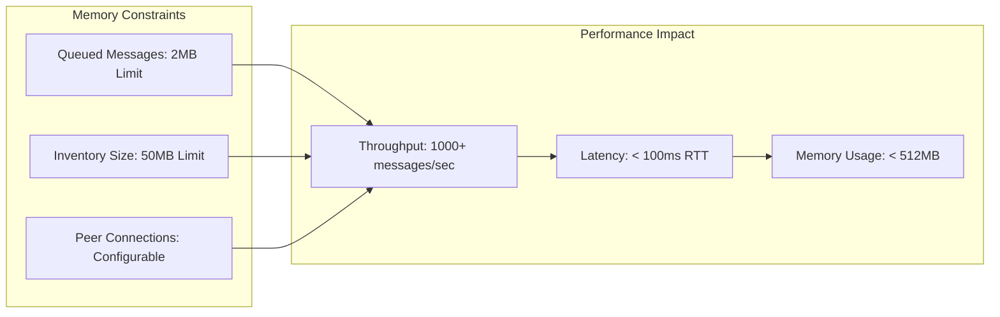

# Originating Peer Tracking

<cite>
**Referenced Files in This Document**
- [node.cpp](file://libraries/network/node.cpp)
- [peer_connection.hpp](file://libraries/network/include/graphene/network/peer_connection.hpp)
- [peer_connection.cpp](file://libraries/network/peer_connection.cpp)
- [peer_database.hpp](file://libraries/network/include/graphene/network/peer_database.hpp)
- [peer_database.cpp](file://libraries/network/peer_database.cpp)
- [core_messages.hpp](file://libraries/network/include/graphene/network/core_messages.hpp)
</cite>

## Table of Contents
1. [Introduction](#introduction)
2. [System Architecture](#system-architecture)
3. [Core Components](#core-components)
4. [Originating Peer Tracking Mechanism](#originating-peer-tracking-mechanism)
5. [Message Flow Analysis](#message-flow-analysis)
6. [Peer Database Management](#peer-database-management)
7. [Security and Validation](#security-and-validation)
8. [Performance Considerations](#performance-considerations)
9. [Troubleshooting Guide](#troubleshooting-guide)
10. [Conclusion](#conclusion)

## Introduction

Originating Peer Tracking is a critical component of the VIZ blockchain's peer-to-peer networking infrastructure. This system enables the network to maintain accurate records of peer connections, track connection states, and manage peer relationships effectively. The mechanism ensures that nodes can identify the source of incoming messages, maintain connection integrity, and prevent duplicate connections while optimizing network topology.

The system operates through a sophisticated combination of peer connection management, database persistence, and message routing mechanisms. It tracks peer identities, connection states, and behavioral patterns to create an efficient and secure peer-to-peer network.

## System Architecture

The Originating Peer Tracking system is built around several interconnected components that work together to maintain peer connection integrity and track message origins:



**Diagram sources**
- [node.cpp:112-5989](file://libraries/network/node.cpp#L112-L5989)
- [peer_connection.cpp:1-484](file://libraries/network/peer_connection.cpp#L1-L484)
- [peer_database.cpp:1-262](file://libraries/network/peer_database.cpp#L1-L262)

The architecture consists of three primary layers:

1. **Network Core Layer**: Handles message routing, peer negotiation, and connection management
2. **Peer Management Layer**: Maintains persistent peer records and connection history
3. **State Management Layer**: Tracks connection states, negotiation progress, and peer identification

## Core Components

### Peer Connection Management

The peer connection system manages individual peer relationships and maintains detailed state information:



**Diagram sources**
- [peer_connection.hpp:79-363](file://libraries/network/include/graphene/network/peer_connection.hpp#L79-L363)
- [node.cpp:1881-1893](file://libraries/network/node.cpp#L1881-L1893)

### Message Type System

The system defines comprehensive message types for peer communication:

| Message Type | Purpose | Origin |
|--------------|---------|--------|
| hello_message | Initial peer handshake | Both directions |
| connection_accepted | Accept connection request | Initiator receives |
| connection_rejected | Reject connection request | Initiator receives |
| address_request | Request peer addresses | Both directions |
| address_message | Provide peer addresses | Both directions |
| blockchain_item_ids_inventory | Provide blockchain item IDs | Both directions |

**Section sources**
- [core_messages.hpp:72-95](file://libraries/network/include/graphene/network/core_messages.hpp#L72-L95)
- [core_messages.hpp:233-265](file://libraries/network/include/graphene/network/core_messages.hpp#L233-L265)

### Peer Database Structure

The peer database maintains persistent records of potential peers:

```mermaid
erDiagram
POTENTIAL_PEER_RECORD {
fc::ip::endpoint endpoint PK
fc::time_point_sec last_seen_time
enum last_connection_disposition
fc::time_point_sec last_connection_attempt_time
uint32 number_of_successful_connection_attempts
uint32 number_of_failed_connection_attempts
optional exception last_error
}
PEER_CONNECTION {
node_id_t node_id PK
node_id_t node_public_key
fc::ip::endpoint remote_endpoint
enum connection_direction
enum firewalled_state
microseconds round_trip_delay
time_point connection_initiation_time
}
POTENTIAL_PEER_RECORD ||--o{ PEER_CONNECTION : "tracks"
```

**Diagram sources**
- [peer_database.hpp:47-71](file://libraries/network/include/graphene/network/peer_database.hpp#L47-L71)
- [peer_connection.hpp:200-225](file://libraries/network/include/graphene/network/peer_connection.hpp#L200-L225)

**Section sources**
- [peer_database.hpp:39-71](file://libraries/network/include/graphene/network/peer_database.hpp#L39-L71)
- [peer_database.cpp:41-82](file://libraries/network/peer_database.cpp#L41-L82)

## Originating Peer Tracking Mechanism

### Connection State Management

The system maintains detailed connection state information to track peer origins and connection progress:



**Diagram sources**
- [peer_connection.hpp:82-106](file://libraries/network/include/graphene/network/peer_connection.hpp#L82-L106)
- [node.cpp:2102-2303](file://libraries/network/node.cpp#L2102-L2303)

### Peer Identity Resolution

The system resolves peer identities through multiple validation mechanisms:

1. **Node ID Extraction**: Extracts node ID from hello message user_data
2. **Signature Verification**: Validates shared secret signatures
3. **Chain ID Validation**: Ensures compatibility with network chain
4. **Duplicate Detection**: Prevents multiple connections to same peer

**Section sources**
- [node.cpp:2102-2230](file://libraries/network/node.cpp#L2102-L2230)
- [peer_connection.hpp:200-218](file://libraries/network/include/graphene/network/peer_connection.hpp#L200-L218)

### Firewall Detection and Address Validation

The system implements sophisticated firewall detection mechanisms:



**Diagram sources**
- [node.cpp:2247-2268](file://libraries/network/node.cpp#L2247-L2268)
- [peer_database.cpp:160-166](file://libraries/network/peer_database.cpp#L160-L166)

**Section sources**
- [node.cpp:2247-2268](file://libraries/network/node.cpp#L2247-L2268)
- [peer_database.cpp:151-158](file://libraries/network/peer_database.cpp#L151-L158)

## Message Flow Analysis

### Handshake Process

The peer handshake process follows a structured sequence for establishing connections:



**Diagram sources**
- [node.cpp:2102-2303](file://libraries/network/node.cpp#L2102-L2303)
- [node.cpp:2355-2423](file://libraries/network/node.cpp#L2355-L2423)

### Address Exchange Protocol

The address exchange mechanism enables peer discovery and network expansion:



**Diagram sources**
- [node.cpp:2355-2378](file://libraries/network/node.cpp#L2355-L2378)
- [node.cpp:2380-2423](file://libraries/network/node.cpp#L2380-L2423)

**Section sources**
- [node.cpp:2355-2423](file://libraries/network/node.cpp#L2355-L2423)

## Peer Database Management

### Database Operations

The peer database provides comprehensive operations for managing peer records:

| Operation | Description | Implementation |
|-----------|-------------|----------------|
| lookup_or_create_entry | Find existing or create new peer record | [peer_database.cpp:160-166](file://libraries/network/peer_database.cpp#L160-L166) |
| update_entry | Update peer connection statistics | [peer_database.cpp:151-158](file://libraries/network/peer_database.cpp#L151-L158) |
| lookup_entry_for_endpoint | Retrieve specific peer record | [peer_database.cpp:168-174](file://libraries/network/peer_database.cpp#L168-L174) |
| begin/end iterators | Iterate through peer records | [peer_database.cpp:176-182](file://libraries/network/peer_database.cpp#L176-L182) |

### Record Persistence

The database maintains peer records with automatic persistence:



**Diagram sources**
- [peer_database.cpp:100-138](file://libraries/network/peer_database.cpp#L100-L138)

**Section sources**
- [peer_database.cpp:100-138](file://libraries/network/peer_database.cpp#L100-L138)
- [peer_database.hpp:104-134](file://libraries/network/include/graphene/network/peer_database.hpp#L104-L134)

## Security and Validation

### Connection Validation

The system implements multiple layers of connection validation:

1. **Signature Validation**: Verifies shared secret signatures using ECC
2. **Chain Compatibility**: Ensures peers operate on compatible blockchain networks
3. **Fork Compatibility**: Validates peer compatibility with network hard forks
4. **Duplicate Prevention**: Detects and prevents multiple connections to same peer

### Security Measures



**Diagram sources**
- [node.cpp:2114-2209](file://libraries/network/node.cpp#L2114-L2209)

**Section sources**
- [node.cpp:2114-2209](file://libraries/network/node.cpp#L2114-L2209)
- [peer_connection.cpp:244-253](file://libraries/network/peer_connection.cpp#L244-L253)

## Performance Considerations

### Connection Limits

The system enforces connection limits to maintain optimal performance:

- **Maximum Connections**: Configurable limit on active peer connections
- **Queued Message Limits**: Prevents memory exhaustion from excessive message queuing
- **Inventory Management**: Controls advertisement of blockchain items to prevent flooding

### Memory Management



**Section sources**
- [peer_connection.cpp:314-335](file://libraries/network/peer_connection.cpp#L314-L335)
- [peer_connection.cpp:451-468](file://libraries/network/peer_connection.cpp#L451-L468)

## Troubleshooting Guide

### Common Connection Issues

| Issue | Symptoms | Solution |
|-------|----------|----------|
| Connection Rejected | Immediate disconnection after hello | Check chain ID compatibility and node ID validation |
| Duplicate Connection | Rejection with "already connected" | Verify peer ID uniqueness and connection state |
| Firewall Detection Failure | Incorrect firewalled state | Check port information and NAT traversal |
| Database Corruption | JSON parsing errors on startup | Clear peer database file and restart |

### Debugging Tools

The system provides comprehensive logging and debugging capabilities:

- **Verbose Logging**: Enable detailed P2P logging for connection issues
- **Connection State Monitoring**: Track peer connection states and transitions
- **Message Flow Tracing**: Monitor message sequences and timing
- **Database Inspection**: Query peer database for connection history

**Section sources**
- [node.cpp:1895-1933](file://libraries/network/node.cpp#L1895-L1933)
- [peer_connection.cpp:109-155](file://libraries/network/peer_connection.cpp#L109-L155)

## Conclusion

The Originating Peer Tracking system represents a sophisticated approach to peer-to-peer network management in blockchain systems. Through its comprehensive state tracking, validation mechanisms, and persistent database management, it ensures reliable peer connections while maintaining network security and performance.

Key strengths of the system include:

- **Robust Identity Management**: Multi-layered peer identity verification prevents malicious connections
- **Comprehensive State Tracking**: Detailed connection state management enables precise origin tracking
- **Persistent Database**: Reliable peer record storage supports network discovery and maintenance
- **Security Validation**: Multiple validation layers protect against various attack vectors
- **Performance Optimization**: Connection limits and memory management ensure system stability

The system's modular design allows for easy extension and modification while maintaining backward compatibility with existing network protocols. Its comprehensive logging and debugging capabilities facilitate troubleshooting and system monitoring.

Future enhancements could include advanced peer reputation systems, improved NAT traversal mechanisms, and enhanced security measures for emerging threats. The current architecture provides a solid foundation for these improvements while maintaining the system's reliability and performance characteristics.