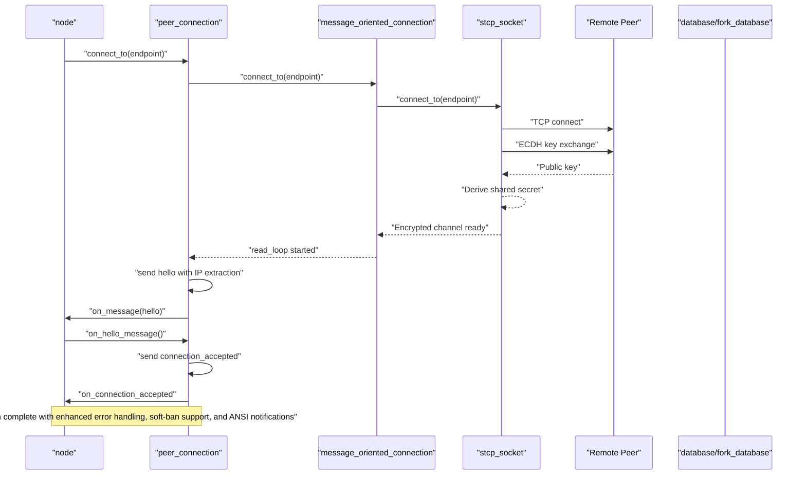
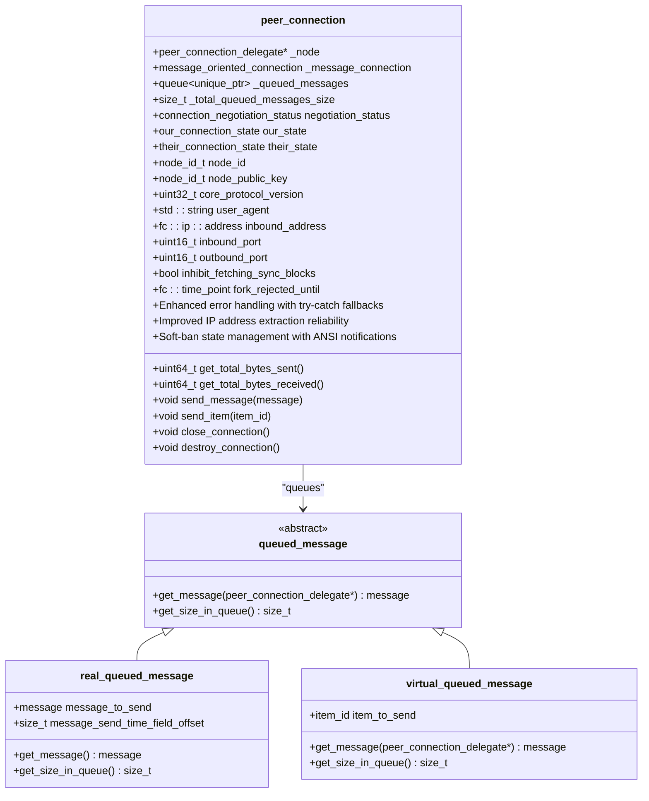
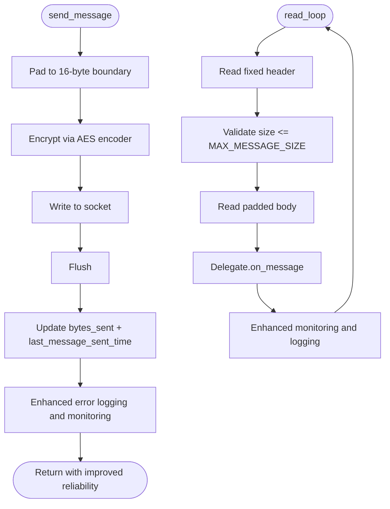
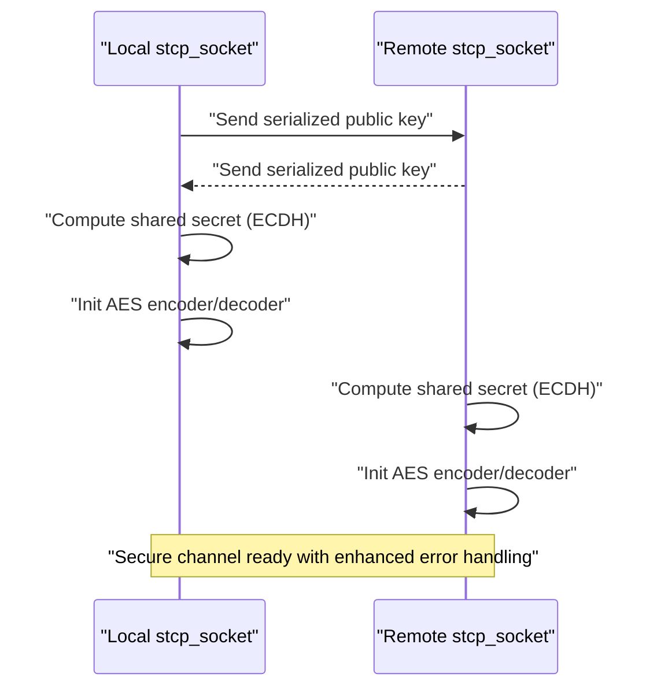
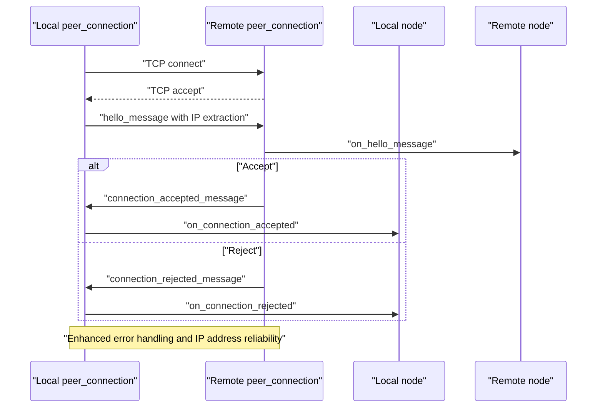
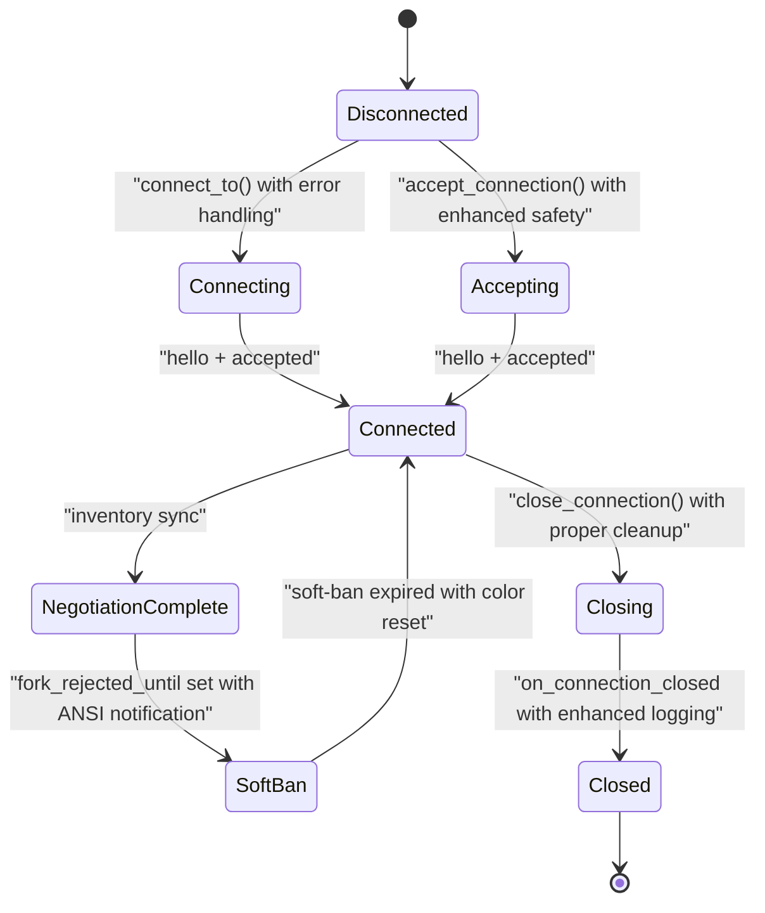
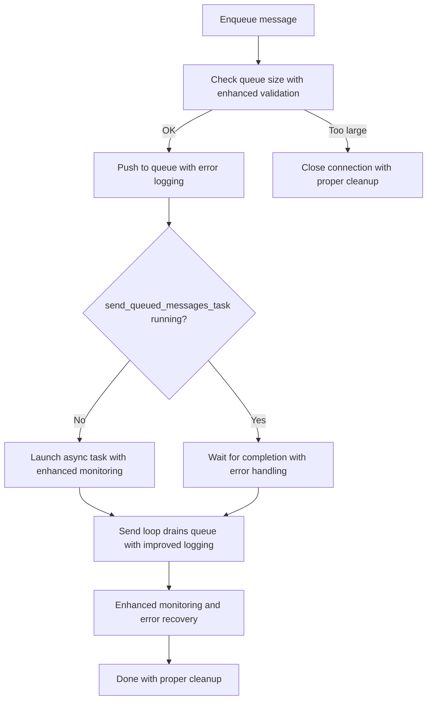
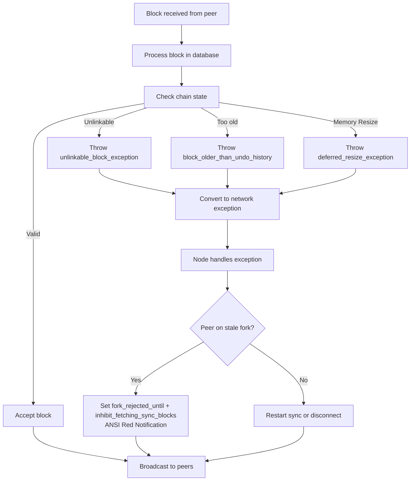
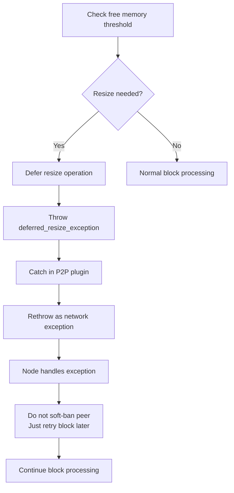
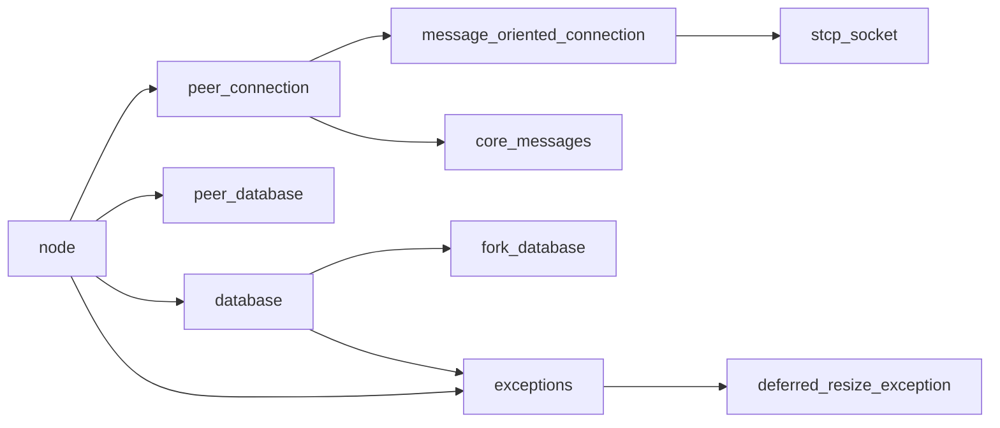

# Peer Connection Management

<cite>
**Referenced Files in This Document**
- [peer_connection.hpp](file://libraries/network/include/graphene/network/peer_connection.hpp)
- [peer_connection.cpp](file://libraries/network/peer_connection.cpp)
- [node.hpp](file://libraries/network/include/graphene/network/node.hpp)
- [node.cpp](file://libraries/network/node.cpp)
- [message_oriented_connection.hpp](file://libraries/network/include/graphene/network/message_oriented_connection.hpp)
- [message_oriented_connection.cpp](file://libraries/network/message_oriented_connection.cpp)
- [stcp_socket.hpp](file://libraries/network/include/graphene/network/stcp_socket.hpp)
- [stcp_socket.cpp](file://libraries/network/stcp_socket.cpp)
- [core_messages.hpp](file://libraries/network/include/graphene/network/core_messages.hpp)
- [core_messages.cpp](file://libraries/network/core_messages.cpp)
- [config.hpp](file://libraries/network/include/graphene/network/config.hpp)
- [peer_database.hpp](file://libraries/network/include/graphene/network/peer_database.hpp)
- [peer_database.cpp](file://libraries/network/peer_database.cpp)
- [message.hpp](file://libraries/network/include/graphene/network/message.hpp)
- [exceptions.hpp](file://libraries/network/include/graphene/network/exceptions.hpp)
- [p2p_plugin.cpp](file://plugins/p2p/p2p_plugin.cpp)
- [database.cpp](file://libraries/chain/database.cpp)
- [fork_database.cpp](file://libraries/chain/fork_database.cpp)
- [database_exceptions.hpp](file://libraries/chain/include/graphene/chain/database_exceptions.hpp)
</cite>

## Update Summary
**Changes Made**
- Enhanced soft-ban system with ANSI color-coded ban notifications for improved visibility
- Improved peer state management with fork_rejected_until and inhibit_fetching_sync_blocks fields
- Comprehensive exception handling for memory resize operations with deferred_resize_exception
- Enhanced block processing with proper exception conversion and soft-ban enforcement
- ANSI color code definitions added for red and reset terminal formatting

## Table of Contents
1. [Introduction](#introduction)
2. [Project Structure](#project-structure)
3. [Core Components](#core-components)
4. [Architecture Overview](#architecture-overview)
5. [Detailed Component Analysis](#detailed-component-analysis)
6. [Dependency Analysis](#dependency-analysis)
7. [Performance Considerations](#performance-considerations)
8. [Troubleshooting Guide](#troubleshooting-guide)
9. [Conclusion](#conclusion)
10. [Appendices](#appendices)

## Introduction
This document provides comprehensive coverage of Peer Connection Management in the VIZ C++ node networking stack. It focuses on the peer_connection.hpp implementation for managing bidirectional peer communication channels, connection state tracking, and message routing. The document explains peer connection establishment protocols, authentication mechanisms, and handshake procedures. It covers connection lifecycle management including initiation, maintenance, graceful disconnection, and error recovery. It details peer state tracking, connection quality metrics, and peer reputation systems. Message queuing, priority handling, and connection multiplexing are documented along with practical examples and guidance on peer selection, balancing, and fault tolerance.

**Updated** Enhanced with improved P2P network reliability featuring soft-ban functionality with ANSI color-coded notifications, proper block processing with exception conversion, and strengthened connection lifecycle management with fork rejection mechanisms. The system now includes comprehensive exception handling for memory resize operations and enhanced peer state management.

## Project Structure
The peer connection management system is composed of several interconnected components:
- Peer-level abstraction: peer_connection encapsulates a single peer's state and messaging with enhanced error handling, soft-ban support, and improved peer state fields.
- Transport abstraction: message_oriented_connection wraps a secure transport socket and handles message framing with improved logging.
- Security: stcp_socket performs ECDH key exchange and AES encryption for secure communication.
- Protocol messages: core_messages defines the handshake and operational messages exchanged between peers with reliable IP address handling.
- Node orchestration: node coordinates peer connections, maintains peer databases, and manages lifecycle events with enhanced exception safety, soft-ban functionality, and ANSI color-coded notifications.
- Configuration: config.hpp centralizes tunable constants for timeouts, limits, and behavior.
- Chain integration: database and fork_database handle block validation with proper exception propagation for P2P layer consumption.
- **New** Memory management: database includes deferred_resize_exception handling for shared memory resize operations with comprehensive logging.

```mermaid
graph TB
subgraph "Peer Layer"
PC["peer_connection<br/>Bidirectional channel<br/>Enhanced Error Handling<br/>Soft-ban Support<br/>Improved State Fields"]
end
subgraph "Transport Layer"
MOC["message_oriented_connection<br/>Message framing<br/>Robust Logging"]
STCP["stcp_socket<br/>ECDH + AES"]
end
subgraph "Protocol Layer"
CM["core_messages<br/>Handshake & ops<br/>Reliable IP Extraction"]
MSG["message<br/>Header + payload"]
end
subgraph "Node Orchestration"
N["node<br/>Connection manager<br/>Exception Safety<br/>Soft-ban Logic<br/>ANSI Color Notifications"]
PD["peer_database<br/>Peer reputation<br/>Improved Recovery"]
END
subgraph "Chain Integration"
DB["database<br/>Block validation<br/>Exception propagation<br/>Memory resize handling"]
FD["fork_database<br/>Fork management<br/>Link handling"]
EX["exceptions<br/>Network exceptions<br/>Soft-ban types<br/>Memory resize exceptions"]
END
PC --> MOC
MOC --> STCP
PC --> CM
CM --> MSG
N --> PC
N --> PD
N --> DB
DB --> FD
DB --> EX
N --> EX
```

**Diagram sources**
- [peer_connection.hpp:79-351](file://libraries/network/include/graphene/network/peer_connection.hpp#L79-L351)
- [message_oriented_connection.hpp:45-79](file://libraries/network/include/graphene/network/message_oriented_connection.hpp#L45-L79)
- [stcp_socket.hpp:37-93](file://libraries/network/include/graphene/network/stcp_socket.hpp#L37-L93)
- [core_messages.hpp:72-95](file://libraries/network/include/graphene/network/core_messages.hpp#L72-L95)
- [message.hpp:42-106](file://libraries/network/include/graphene/network/message.hpp#L42-L106)
- [node.hpp:190-304](file://libraries/network/include/graphene/network/node.hpp#L190-L304)
- [peer_database.hpp:104-134](file://libraries/network/include/graphene/network/peer_database.hpp#L104-L134)
- [database.cpp:1215-1246](file://libraries/chain/database.cpp#L1215-L1246)
- [fork_database.cpp:34-46](file://libraries/chain/fork_database.cpp#L34-L46)
- [exceptions.hpp:33-45](file://libraries/network/include/graphene/network/exceptions.hpp#L33-L45)

**Section sources**
- [peer_connection.hpp:1-383](file://libraries/network/include/graphene/network/peer_connection.hpp#L1-L383)
- [message_oriented_connection.hpp:1-85](file://libraries/network/include/graphene/network/message_oriented_connection.hpp#L1-L85)
- [stcp_socket.hpp:1-99](file://libraries/network/include/graphene/network/stcp_socket.hpp#L1-L99)
- [core_messages.hpp:1-573](file://libraries/network/include/graphene/network/core_messages.hpp#L1-L573)
- [node.hpp:1-355](file://libraries/network/include/graphene/network/node.hpp#L1-L355)
- [peer_database.hpp:1-141](file://libraries/network/include/graphene/network/peer_database.hpp#L1-L141)
- [message.hpp:1-114](file://libraries/network/include/graphene/network/message.hpp#L1-L114)
- [database.cpp:1-6389](file://libraries/chain/database.cpp#L1-L6389)
- [fork_database.cpp:1-271](file://libraries/chain/fork_database.cpp#L1-L271)
- [exceptions.hpp:1-49](file://libraries/network/include/graphene/network/exceptions.hpp#L1-L49)

## Core Components
- peer_connection: Manages a single peer's connection state, queues outgoing messages, tracks inventory, and exposes metrics with enhanced error handling and IP address extraction reliability. It delegates message delivery to message_oriented_connection and integrates with node-level callbacks. **Enhanced** with fork_rejected_until and inhibit_fetching_sync_blocks fields for soft-ban functionality and improved peer state management.
- message_oriented_connection: Provides a message-oriented API over a secure socket, handling read/write loops, padding, and error propagation with improved logging mechanisms.
- stcp_socket: Implements ECDH key exchange and AES encryption for secure transport.
- core_messages: Defines the protocol messages used during handshake and runtime operations with reliable IP address handling and enhanced error reporting.
- node: Orchestrates peer connections, manages peer databases, and coordinates synchronization and broadcasting with better exception safety, soft-ban logic, fork rejection handling, and ANSI color-coded notification support.
- peer_database: Tracks potential peers, connection attempts, and outcomes for peer selection and reputation with improved error handling.
- **New** database: Handles block validation with proper exception propagation, converting chain exceptions to network exceptions for P2P layer consumption, and includes comprehensive memory resize exception handling.
- **New** fork_database: Manages fork relationships and block linking with proper exception handling for unlinkable blocks.
- **New** database_exceptions: Defines deferred_resize_exception for handling shared memory resize operations during block processing.

Key responsibilities:
- Handshake and authentication: ECDH key exchange via stcp_socket, hello/connection_accepted messages via core_messages with reliable IP address extraction.
- Lifecycle management: Connect, accept, close, destroy, and cleanup with enhanced error recovery and exception safety, including soft-ban mechanisms with ANSI color-coded notifications.
- Message routing: Queueing, priority, and multiplexing across peers with improved logging and monitoring.
- Metrics and reputation: Connection times, bytes sent/received, inventory lists, and peer selection with robust error handling.
- **Enhanced** Block processing: Proper handling of blocks returned as false by chain, conversion of unlinkable_block_exception to network exceptions, soft-ban functionality for peer management, and comprehensive memory resize exception handling.
- **Enhanced** Peer state management: fork_rejected_until timestamp tracking, inhibit_fetching_sync_blocks flag management, and automatic soft-ban expiration handling.

**Section sources**
- [peer_connection.hpp:79-351](file://libraries/network/include/graphene/network/peer_connection.hpp#L79-L351)
- [peer_connection.cpp:68-162](file://libraries/network/peer_connection.cpp#L68-L162)
- [message_oriented_connection.cpp:128-140](file://libraries/network/message_oriented_connection.cpp#L128-L140)
- [stcp_socket.cpp:49-72](file://libraries/network/stcp_socket.cpp#L49-L72)
- [core_messages.hpp:233-306](file://libraries/network/include/graphene/network/core_messages.hpp#L233-L306)
- [node.cpp:424-799](file://libraries/network/node.cpp#L424-L799)
- [peer_database.cpp:100-174](file://libraries/network/peer_database.cpp#L100-L174)
- [database.cpp:1215-1246](file://libraries/chain/database.cpp#L1215-L1246)
- [fork_database.cpp:34-46](file://libraries/chain/fork_database.cpp#L34-L46)
- [database_exceptions.hpp:86-86](file://libraries/chain/include/graphene/chain/database_exceptions.hpp#L86-L86)

## Architecture Overview
The peer connection architecture follows a layered design with enhanced error handling, soft-ban functionality, and ANSI color-coded notifications:
- Application (node) controls peer lifecycle and delegates message processing to the node delegate with improved exception safety, soft-ban logic, and enhanced notification capabilities.
- Peer (peer_connection) holds per-peer state and queues messages with robust error handling mechanisms, including soft-ban state tracking and improved peer state fields.
- Transport (message_oriented_connection) frames messages and manages the read/write loop with enhanced logging.
- Security (stcp_socket) negotiates keys and encrypts traffic.
- Protocol (core_messages) defines the message types and semantics with reliable IP address extraction.
- **Enhanced** Chain integration (database/fork_database) validates blocks and propagates exceptions to the P2P layer for proper peer management, including comprehensive memory resize exception handling.



**Diagram sources**
- [peer_connection.cpp:208-242](file://libraries/network/peer_connection.cpp#L208-L242)
- [message_oriented_connection.cpp:135-140](file://libraries/network/message_oriented_connection.cpp#L135-L140)
- [stcp_socket.cpp:69-72](file://libraries/network/stcp_socket.cpp#L69-L72)
- [core_messages.hpp:233-272](file://libraries/network/include/graphene/network/core_messages.hpp#L233-L272)
- [node.cpp:662-718](file://libraries/network/node.cpp#L662-L718)

## Detailed Component Analysis

### peer_connection: Enhanced Bidirectional Channel and State Machine
peer_connection encapsulates:
- Connection states: our_connection_state, their_connection_state, and connection_negotiation_status with improved error handling.
- Message queueing: real_queued_message and virtual_queued_message for immediate and deferred message generation with enhanced logging.
- Inventory tracking: sets for advertised and requested items, sync state, and throttling with robust error recovery.
- Metrics: bytes sent/received, last message timestamps, connection durations, and shared secret exposure with improved monitoring.
- **Enhanced** Soft-ban state: fork_rejected_until timestamp and inhibit_fetching_sync_blocks flag for peer management during emergency scenarios.



**Diagram sources**
- [peer_connection.hpp:79-351](file://libraries/network/include/graphene/network/peer_connection.hpp#L79-L351)
- [peer_connection.cpp:41-66](file://libraries/network/peer_connection.cpp#L41-L66)

Key behaviors:
- Outgoing message pipeline: send_message enqueues a real_queued_message with enhanced error handling; send_item enqueues a virtual_queued_message; send_queueable_message validates queue size and triggers send_queued_messages_task with improved logging.
- Inbound message pipeline: on_message delegates to node delegate with robust error recovery; on_connection_closed transitions negotiation_status and notifies node with proper exception handling.
- Lifecycle: accept_connection and connect_to manage transport setup with enhanced error handling; close_connection and destroy_connection coordinate teardown with improved exception safety.
- **Enhanced** Soft-ban management: fork_rejected_until tracks soft-ban expiration; inhibit_fetching_sync_blocks prevents sync operations during ban period; ANSI color-coded notifications for ban events.

**Section sources**
- [peer_connection.hpp:79-351](file://libraries/network/include/graphene/network/peer_connection.hpp#L79-L351)
- [peer_connection.cpp:244-338](file://libraries/network/peer_connection.cpp#L244-L338)
- [peer_connection.hpp:240-278](file://libraries/network/include/graphene/network/peer_connection.hpp#L240-L278)

### message_oriented_connection: Enhanced Message Framing and Transport Loop
message_oriented_connection:
- Wraps stcp_socket for secure transport with improved error handling.
- Implements read_loop to decode messages, enforce size limits, and dispatch to delegate with enhanced logging.
- Provides send_message with padding to 16-byte boundaries and flush behavior with robust error recovery.
- Exposes connection metrics and shared secret access with improved monitoring capabilities.



**Diagram sources**
- [message_oriented_connection.cpp:237-283](file://libraries/network/message_oriented_connection.cpp#L237-L283)
- [message_oriented_connection.cpp:148-235](file://libraries/network/message_oriented_connection.cpp#L148-L235)

**Section sources**
- [message_oriented_connection.hpp:45-79](file://libraries/network/include/graphene/network/message_oriented_connection.hpp#L45-L79)
- [message_oriented_connection.cpp:128-140](file://libraries/network/message_oriented_connection.cpp#L128-L140)
- [message_oriented_connection.cpp:237-283](file://libraries/network/message_oriented_connection.cpp#L237-L283)
- [message_oriented_connection.cpp:148-235](file://libraries/network/message_oriented_connection.cpp#L148-L235)

### stcp_socket: Secure Transport with ECDH and AES
stcp_socket:
- Performs ECDH key exchange on connect/accept with enhanced error handling.
- Derives shared secret and initializes AES encoder/decoder with improved reliability.
- Reads/writes in 16-byte increments for AES compatibility with robust error recovery.
- Exposes get_shared_secret for upper layers with enhanced monitoring capabilities.



**Diagram sources**
- [stcp_socket.cpp:49-72](file://libraries/network/stcp_socket.cpp#L49-L72)
- [stcp_socket.cpp:132-177](file://libraries/network/stcp_socket.cpp#L132-L177)

**Section sources**
- [stcp_socket.hpp:37-93](file://libraries/network/include/graphene/network/stcp_socket.hpp#L37-L93)
- [stcp_socket.cpp:49-72](file://libraries/network/stcp_socket.cpp#L49-L72)
- [stcp_socket.cpp:132-177](file://libraries/network/stcp_socket.cpp#L132-L177)

### Handshake and Authentication Protocols
Handshake flow with enhanced IP address extraction:
- ECDH key exchange via stcp_socket during connect/accept with improved error handling.
- Hello message exchange with user agent, protocol version, ports, and node identifiers with reliable IP address extraction.
- Connection accepted or rejected messages finalize negotiation with enhanced logging and monitoring.



**Diagram sources**
- [core_messages.hpp:233-306](file://libraries/network/include/graphene/network/core_messages.hpp#L233-L306)
- [node.cpp:662-718](file://libraries/network/node.cpp#L662-L718)
- [peer_connection.cpp:208-242](file://libraries/network/peer_connection.cpp#L208-L242)

**Section sources**
- [core_messages.hpp:233-306](file://libraries/network/include/graphene/network/core_messages.hpp#L233-L306)
- [node.cpp:662-718](file://libraries/network/node.cpp#L662-L718)
- [peer_connection.cpp:208-242](file://libraries/network/peer_connection.cpp#L208-L242)

### Connection Lifecycle Management
Lifecycle stages with enhanced error handling, soft-ban functionality, and ANSI color-coded notifications:
- Initiation: connect_to for outbound, accept_connection for inbound with improved exception safety.
- Negotiation: hello/connection_accepted or connection_rejected with enhanced logging and monitoring.
- Operation: message exchange, inventory advertisement, sync with robust error recovery mechanisms, soft-ban enforcement, and ANSI color-coded notifications.
- Maintenance: keep-alive via time requests, bandwidth monitoring with improved reliability, soft-ban expiration checking with color-coded logging.
- Graceful disconnection: closing_connection message, close_connection, destroy_connection with enhanced error handling.
- Error recovery: queue overflow closes connection with proper cleanup, peer database updates with improved logging, retry timers with better exception safety.
- **Enhanced** Soft-ban management: fork_rejected_until timestamp enforcement, inhibit_fetching_sync_blocks flag management, automatic soft-ban expiration handling, and ANSI color-coded ban notifications.



**Diagram sources**
- [peer_connection.hpp:82-106](file://libraries/network/include/graphene/network/peer_connection.hpp#L82-L106)
- [peer_connection.cpp:356-369](file://libraries/network/peer_connection.cpp#L356-L369)
- [node.cpp:718-740](file://libraries/network/node.cpp#L718-L740)

**Section sources**
- [peer_connection.cpp:169-242](file://libraries/network/peer_connection.cpp#L169-L242)
- [peer_connection.cpp:356-369](file://libraries/network/peer_connection.cpp#L356-L369)
- [node.cpp:718-740](file://libraries/network/node.cpp#L718-L740)

### Message Queuing, Priority, and Multiplexing
- Queuing: real_queued_message stores full messages with enhanced error handling; virtual_queued_message defers generation via node delegate with improved logging.
- Limits: GRAPHENE_NET_MAXIMUM_QUEUED_MESSAGES_IN_BYTES prevents memory pressure with better exception safety; exceeding triggers closure with proper cleanup.
- Priority: During sync, prioritized_item_id sorts blocks before transactions with enhanced monitoring; during normal operation, FIFO per peer with throttling and improved error recovery.
- Multiplexing: Multiple peer_connection instances share node delegate with enhanced error handling; each peer has independent queues and state with improved reliability.



**Diagram sources**
- [peer_connection.cpp:310-338](file://libraries/network/peer_connection.cpp#L310-L338)
- [peer_connection.cpp:255-308](file://libraries/network/peer_connection.cpp#L255-L308)
- [config.hpp:58-58](file://libraries/network/include/graphene/network/config.hpp#L58-L58)

**Section sources**
- [peer_connection.cpp:310-338](file://libraries/network/peer_connection.cpp#L310-L338)
- [peer_connection.cpp:255-308](file://libraries/network/peer_connection.cpp#L255-L308)
- [config.hpp:58-58](file://libraries/network/include/graphene/network/config.hpp#L58-L58)

### Peer State Tracking, Metrics, and Reputation
Peer state tracking with enhanced error handling, soft-ban support, and ANSI color-coded notifications:
- Connection states: negotiated status, direction, firewalled state, clock offset, round-trip delay with improved monitoring and logging.
- Inventory: advertised to peer, advertised to us, requested, sync state, throttling windows with robust error recovery mechanisms.
- Metrics: bytes sent/received, last message times, connection duration, termination time with enhanced logging and monitoring.
- **Enhanced** Soft-ban state: fork_rejected_until timestamp tracks soft-ban expiration; inhibit_fetching_sync_blocks prevents sync operations during ban period.

Reputation and selection with improved reliability:
- peer_database tracks endpoints, last seen, disposition, and attempt counts with enhanced error handling.
- node selects peers based on desired/max connections, retry timeouts, and peer database entries with better exception safety.
- Enhanced logging and monitoring throughout the peer selection and balancing process with ANSI color-coded notifications.
- **Enhanced** Soft-ban enforcement: Automatic soft-ban detection and enforcement during block processing with color-coded logging.

**Section sources**
- [peer_connection.hpp:175-279](file://libraries/network/include/graphene/network/peer_connection.hpp#L175-L279)
- [peer_connection.cpp:428-480](file://libraries/network/peer_connection.cpp#L428-L480)
- [peer_database.hpp:47-71](file://libraries/network/include/graphene/network/peer_database.hpp#L47-L71)
- [peer_database.cpp:100-174](file://libraries/network/peer_database.cpp#L100-L174)
- [node.cpp:518-526](file://libraries/network/node.cpp#L518-L526)

### Enhanced Block Processing and Soft-Ban Functionality
**New** Enhanced block processing with proper exception handling, soft-ban mechanisms, and ANSI color-coded notifications:
- Database layer converts chain exceptions to network exceptions for P2P consumption, including deferred_resize_exception for memory resize operations.
- Fork database handles unlinkable blocks with proper exception propagation.
- Node layer implements soft-ban functionality for peer management during emergency scenarios with ANSI color-coded notifications.
- P2P plugin converts chain exceptions to network exceptions for consistent handling.
- ANSI color codes (CLOG_RED, CLOG_RESET) provide visual emphasis for ban notifications in terminal output.



**Diagram sources**
- [database.cpp:1215-1246](file://libraries/chain/database.cpp#L1215-L1246)
- [fork_database.cpp:34-46](file://libraries/chain/fork_database.cpp#L34-L46)
- [node.cpp:3598-3626](file://libraries/network/node.cpp#L3598-L3626)
- [p2p_plugin.cpp:172-182](file://plugins/p2p/p2p_plugin.cpp#L172-L182)

**Section sources**
- [database.cpp:1215-1246](file://libraries/chain/database.cpp#L1215-L1246)
- [fork_database.cpp:34-46](file://libraries/chain/fork_database.cpp#L34-L46)
- [node.cpp:3598-3626](file://libraries/network/node.cpp#L3598-L3626)
- [p2p_plugin.cpp:172-182](file://plugins/p2p/p2p_plugin.cpp#L172-L182)

### Enhanced Memory Management and Exception Handling
**New** Comprehensive exception handling for memory resize operations:
- deferred_resize_exception thrown when shared memory resize is deferred during block processing.
- Database layer handles deferred resize operations with comprehensive logging and memory usage monitoring.
- P2P plugin catches deferred_resize_exception and rethrows as network exception for consistent handling.
- Node layer implements proper exception handling for deferred resize operations during block processing.



**Diagram sources**
- [database.cpp:560-665](file://libraries/chain/database.cpp#L560-L665)
- [p2p_plugin.cpp:170-181](file://plugins/p2p/p2p_plugin.cpp#L170-L181)
- [node.cpp:3616-3622](file://libraries/network/node.cpp#L3616-L3622)

**Section sources**
- [database.cpp:560-665](file://libraries/chain/database.cpp#L560-L665)
- [p2p_plugin.cpp:170-181](file://plugins/p2p/p2p_plugin.cpp#L170-L181)
- [node.cpp:3616-3622](file://libraries/network/node.cpp#L3616-L3622)

### Examples and Patterns
- Peer connection setup with enhanced error handling:
  - Outbound: peer_connection::connect_to(endpoint) -> message_oriented_connection::connect_to -> stcp_socket::connect_to -> ECDH -> hello -> connection_accepted with improved logging.
  - Inbound: accept_connection -> ECDH -> hello -> connection_accepted with enhanced error recovery.
- Message exchange with robust monitoring:
  - send_message queues a real message with enhanced error handling; send_item queues a virtual message; send_queued_messages_task sends them with improved logging.
- Connection monitoring with enhanced reliability:
  - get_total_bytes_sent/get_total_bytes_received, last_message_sent_time/last_message_received, get_connection_time/get_connection_terminated_time with improved error recovery.
- Peer selection and balancing with better exception safety:
  - node maintains desired/max connections, peer database, and retry timers; balances by selecting candidates from peer_database and initiating connect_to with enhanced error handling.
- **Enhanced** Soft-ban management:
  - Automatic soft-ban detection for peers sending unlinkable blocks; fork_rejected_until timestamp enforcement; inhibit_fetching_sync_blocks flag management; automatic soft-ban expiration handling; ANSI color-coded ban notifications.
- **Enhanced** Memory resize exception handling:
  - Deferred shared memory resize operations during block processing; proper exception propagation through P2P layer; no peer penalization for transient memory resize operations.

**Section sources**
- [peer_connection.cpp:208-242](file://libraries/network/peer_connection.cpp#L208-L242)
- [peer_connection.cpp:340-354](file://libraries/network/peer_connection.cpp#L340-L354)
- [peer_connection.cpp:371-399](file://libraries/network/peer_connection.cpp#L371-L399)
- [node.cpp:518-526](file://libraries/network/node.cpp#L518-L526)
- [peer_database.cpp:100-174](file://libraries/network/peer_database.cpp#L100-L174)

## Dependency Analysis
The peer connection subsystem exhibits clear layering and low coupling with enhanced error handling, soft-ban functionality, and ANSI color-coded notifications:
- peer_connection depends on message_oriented_connection and node delegate with improved exception safety.
- message_oriented_connection depends on stcp_socket and delegates to peer_connection with enhanced logging.
- stcp_socket depends on fc crypto primitives and tcp socket with robust error recovery.
- node orchestrates peer_connection instances and peer_database with better exception handling, soft-ban logic, and ANSI notification support.
- core_messages defines protocol contracts used across layers with reliable IP address handling.
- **Enhanced** database and fork_database depend on chain exceptions and propagate network exceptions to P2P layer.
- **Enhanced** p2p_plugin converts chain exceptions to network exceptions for consistent handling.
- **Enhanced** database_exceptions defines deferred_resize_exception for memory resize operations.



**Diagram sources**
- [peer_connection.hpp:79-351](file://libraries/network/include/graphene/network/peer_connection.hpp#L79-L351)
- [message_oriented_connection.hpp:45-79](file://libraries/network/include/graphene/network/message_oriented_connection.hpp#L45-L79)
- [stcp_socket.hpp:37-93](file://libraries/network/include/graphene/network/stcp_socket.hpp#L37-L93)
- [core_messages.hpp:72-95](file://libraries/network/include/graphene/network/core_messages.hpp#L72-L95)
- [node.hpp:190-304](file://libraries/network/include/graphene/network/node.hpp#L190-L304)
- [peer_database.hpp:104-134](file://libraries/network/include/graphene/network/peer_database.hpp#L104-L134)
- [message.hpp:42-106](file://libraries/network/include/graphene/network/message.hpp#L42-L106)
- [database.cpp:1215-1246](file://libraries/chain/database.cpp#L1215-L1246)
- [fork_database.cpp:34-46](file://libraries/chain/fork_database.cpp#L34-L46)
- [exceptions.hpp:33-45](file://libraries/network/include/graphene/network/exceptions.hpp#L33-L45)

**Section sources**
- [peer_connection.hpp:26-45](file://libraries/network/include/graphene/network/peer_connection.hpp#L26-L45)
- [message_oriented_connection.hpp:26-28](file://libraries/network/include/graphene/network/message_oriented_connection.hpp#L26-L28)
- [stcp_socket.hpp:26-28](file://libraries/network/include/graphene/network/stcp_socket.hpp#L26-L28)
- [core_messages.hpp:26-35](file://libraries/network/include/graphene/network/core_messages.hpp#L26-L35)
- [node.hpp:26-31](file://libraries/network/include/graphene/network/node.hpp#L26-L31)
- [peer_database.hpp:26-35](file://libraries/network/include/graphene/network/peer_database.hpp#L26-L35)
- [message.hpp:26-31](file://libraries/network/include/graphene/network/message.hpp#L26-L31)
- [database.cpp:1215-1246](file://libraries/chain/database.cpp#L1215-L1246)
- [fork_database.cpp:34-46](file://libraries/chain/fork_database.cpp#L34-L46)
- [exceptions.hpp:33-45](file://libraries/network/include/graphene/network/exceptions.hpp#L33-L45)

## Performance Considerations
- Message sizing: MAX_MESSAGE_SIZE caps payload; padding to 16 bytes ensures AES compatibility with enhanced error handling.
- Queue limits: GRAPHENE_NET_MAXIMUM_QUEUED_MESSAGES_IN_BYTES prevents memory growth under heavy load with better exception safety.
- Throttling: Inventory lists and transaction fetching inhibition mitigate flooding with improved monitoring.
- Bandwidth monitoring: node tracks read/write rates and applies rate limiting groups with enhanced logging.
- Sync optimization: interleaved prefetching and prioritization reduce sync time with robust error recovery mechanisms.
- Enhanced error handling: Comprehensive try-catch fallbacks throughout peer statistics logging ensure more robust operation of the P2P network layer.
- **Enhanced** Soft-ban optimization: Automatic soft-ban enforcement prevents cascading disconnections during emergency scenarios, improving network stability.
- **Enhanced** Block processing efficiency: Proper exception handling reduces unnecessary reprocessing and improves overall network performance.
- **Enhanced** Memory management: Deferred resize operations prevent blocking during shared memory expansion, improving system responsiveness.
- **Enhanced** Notification performance: ANSI color-coded logging provides visual emphasis without impacting performance significantly.

## Troubleshooting Guide
Common issues and remedies with enhanced error handling, soft-ban functionality, and ANSI color-coded notifications:
- Connection refused or rejected: Review rejection reasons in connection_rejected_message with improved logging; check protocol version, chain ID, and node policies with better error reporting.
- Handshake failures: Verify ECDH key exchange succeeded with enhanced error handling; inspect stcp_socket logs with improved monitoring; ensure endpoints are reachable with robust error recovery.
- Queue overflow: Monitor queue size with enhanced logging; adjust rate or reduce message sizes; consider disconnecting misbehaving peers with proper cleanup.
- Idle peers: Use inactivity timeouts with improved exception safety; terminate inactive connections; rebalance peers with better error handling.
- Peer reputation: Inspect peer_database entries with enhanced logging; prune failed peers; respect retry delays with improved error recovery mechanisms.
- IP address extraction issues: Enhanced safe static_cast operations with try-catch fallback mechanisms ensure reliable IP address extraction throughout peer information handling.
- **Enhanced** Soft-ban issues: Check fork_rejected_until timestamps and inhibit_fetching_sync_blocks flags; verify automatic soft-ban expiration handling; monitor soft-ban effectiveness; review ANSI color-coded ban notifications for quick identification.
- **Enhanced** Block processing errors: Review unlinkable_block_exception handling and soft-ban enforcement; verify proper exception conversion from chain to network exceptions; check memory resize exception handling.
- **Enhanced** Memory resize issues: Monitor deferred_resize_exception occurrences; verify proper exception propagation through P2P layer; ensure no peer penalization for transient memory resize operations.
- **Enhanced** Notification visibility: Verify ANSI color codes are properly displayed in terminal; check CLOG_RED and CLOG_RESET definitions for proper formatting.

**Section sources**
- [core_messages.hpp:285-306](file://libraries/network/include/graphene/network/core_messages.hpp#L285-L306)
- [config.hpp:48-50](file://libraries/network/include/graphene/network/config.hpp#L48-L50)
- [peer_database.cpp:100-174](file://libraries/network/peer_database.cpp#L100-L174)
- [peer_connection.cpp:314-325](file://libraries/network/peer_connection.cpp#L314-L325)
- [node.cpp:3448-3470](file://libraries/network/node.cpp#L3448-L3470)

## Conclusion
Peer Connection Management in this codebase provides a robust, layered architecture for secure, multiplexed peer communication with enhanced error handling, reliability, and soft-ban functionality. It supports comprehensive lifecycle management, strict authentication via ECDH/AES, and sophisticated message queuing with priority and throttling. The node orchestrates peers, maintains reputation, and optimizes selection and balancing with improved exception safety. Enhanced peer information handling with reliable IP address extraction using safe static_cast operations with try-catch fallback mechanisms, combined with improved error handling and performance optimizations throughout peer statistics logging, ensures more robust operation of the P2P network layer.

**Enhanced** The system now includes sophisticated soft-ban functionality with ANSI color-coded notifications for improved visibility, proper exception conversion between chain and network layers, and improved fork rejection mechanisms. The addition of comprehensive memory resize exception handling ensures system stability during shared memory expansion operations. These enhancements provide superior error recovery, monitoring capabilities, network stability during emergency consensus scenarios, and improved operational visibility through color-coded terminal notifications. Together, these components deliver reliable peer-to-peer connectivity suitable for blockchain synchronization and transaction propagation with superior error recovery, soft-ban management, enhanced network reliability, and improved operational observability.

## Appendices

### Configuration Constants
Important tunables affecting peer connection behavior:
- GRAPHENE_NET_PROTOCOL_VERSION: Protocol version for compatibility.
- MAX_MESSAGE_SIZE: Maximum message size in bytes.
- GRAPHENE_NET_MAXIMUM_QUEUED_MESSAGES_IN_BYTES: Queue size cap with enhanced error handling.
- GRAPHENE_NET_DEFAULT_DESIRED_CONNECTIONS / GRAPHENE_NET_DEFAULT_MAX_CONNECTIONS: Target and hard limits.
- GRAPHENE_NET_PEER_HANDSHAKE_INACTIVITY_TIMEOUT / GRAPHENE_NET_PEER_DISCONNECT_TIMEOUT: Timeout thresholds with improved exception safety.

**Section sources**
- [config.hpp:26-106](file://libraries/network/include/graphene/network/config.hpp#L26-L106)

### Network Exception Types
**New** Enhanced exception types for improved error handling:
- unlinkable_block_exception: Used for blocks from dead forks with parents not in fork database.
- block_older_than_undo_history: Used for blocks too old for fork database processing.
- peer_is_on_an_unreachable_fork: Used when peers are on incompatible forks.
- **New** deferred_resize_exception: Used for shared memory resize operations during block processing, indicating transient memory expansion requiring block retry.
- Enhanced error propagation: Chain exceptions converted to network exceptions for consistent P2P layer handling.

**Section sources**
- [exceptions.hpp:33-45](file://libraries/network/include/graphene/network/exceptions.hpp#L33-L45)
- [p2p_plugin.cpp:172-182](file://plugins/p2p/p2p_plugin.cpp#L172-L182)
- [database.cpp:1239-1241](file://libraries/chain/database.cpp#L1239-L1241)
- [database_exceptions.hpp:86-86](file://libraries/chain/include/graphene/chain/database_exceptions.hpp#L86-L86)

### ANSI Color Code Definitions
**New** Terminal formatting support for enhanced notifications:
- CLOG_RED: ANSI escape sequence for red text formatting.
- CLOG_RESET: ANSI escape sequence to reset terminal formatting.
- Used extensively in soft-ban notifications and other important system messages for improved visual emphasis.

**Section sources**
- [node.cpp:79-81](file://libraries/network/node.cpp#L79-L81)
- [node.cpp:3278-3281](file://libraries/network/node.cpp#L3278-L3281)
- [node.cpp:3633-3636](file://libraries/network/node.cpp#L3633-L3636)
- [node.cpp:3653-3656](file://libraries/network/node.cpp#L3653-L3656)
- [node.cpp:3671-3674](file://libraries/network/node.cpp#L3671-L3674)