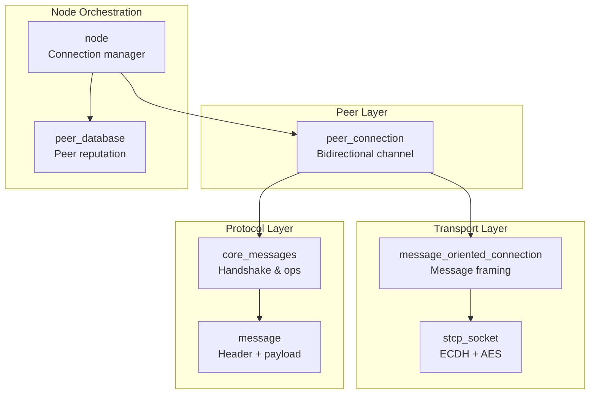
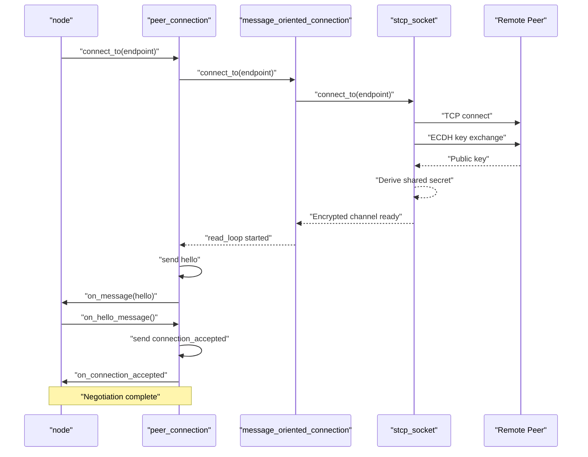
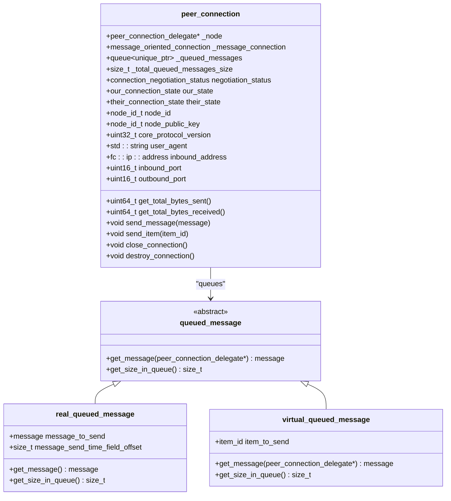
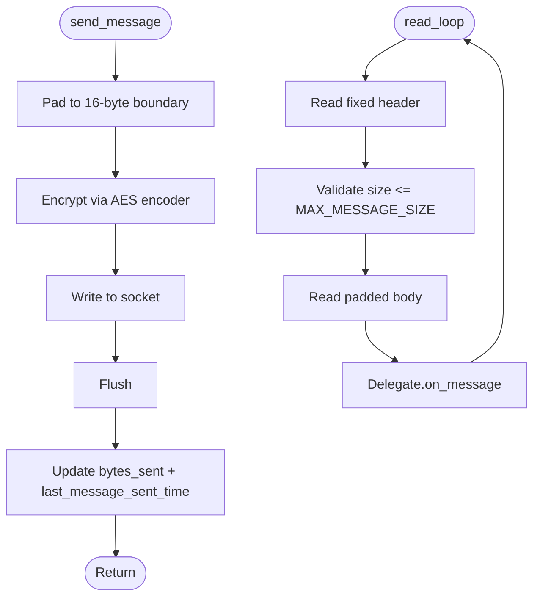
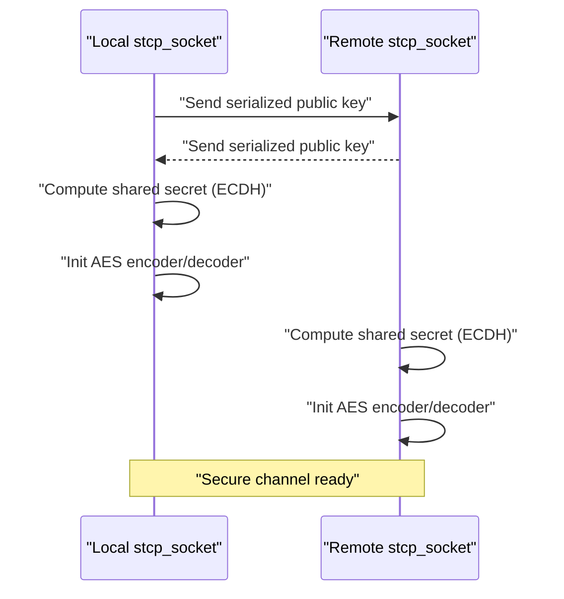
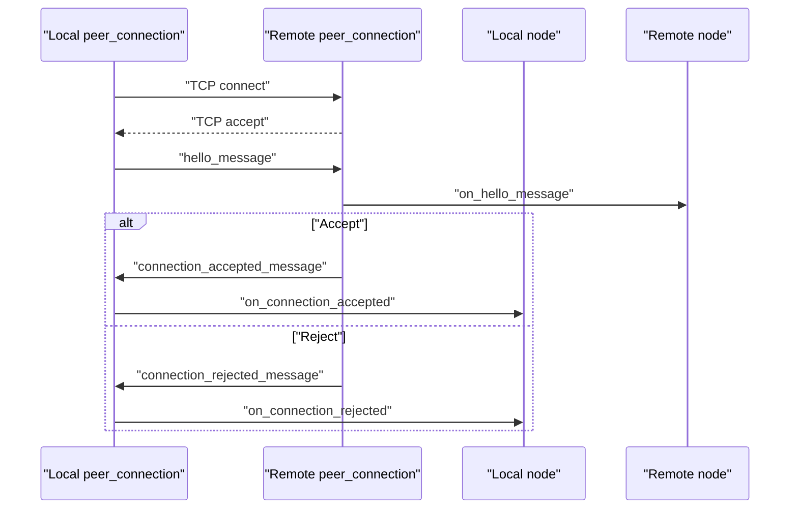
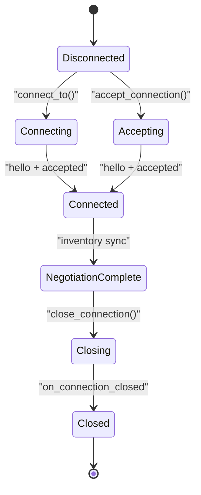
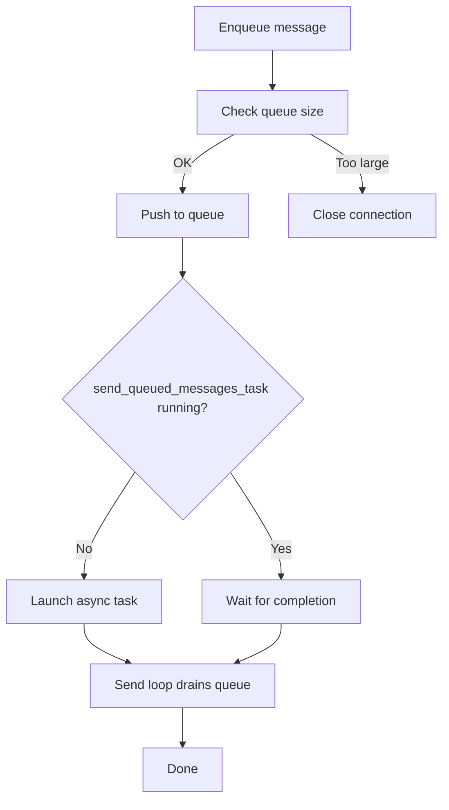
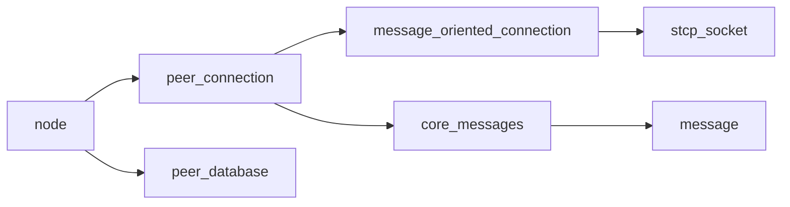

# Peer Connection Management

<cite>
**Referenced Files in This Document**
- [peer_connection.hpp](file://libraries/network/include/graphene/network/peer_connection.hpp)
- [peer_connection.cpp](file://libraries/network/peer_connection.cpp)
- [node.hpp](file://libraries/network/include/graphene/network/node.hpp)
- [node.cpp](file://libraries/network/node.cpp)
- [message_oriented_connection.hpp](file://libraries/network/include/graphene/network/message_oriented_connection.hpp)
- [message_oriented_connection.cpp](file://libraries/network/message_oriented_connection.cpp)
- [stcp_socket.hpp](file://libraries/network/include/graphene/network/stcp_socket.hpp)
- [stcp_socket.cpp](file://libraries/network/stcp_socket.cpp)
- [core_messages.hpp](file://libraries/network/include/graphene/network/core_messages.hpp)
- [core_messages.cpp](file://libraries/network/core_messages.cpp)
- [config.hpp](file://libraries/network/include/graphene/network/config.hpp)
- [peer_database.hpp](file://libraries/network/include/graphene/network/peer_database.hpp)
- [peer_database.cpp](file://libraries/network/peer_database.cpp)
- [message.hpp](file://libraries/network/include/graphene/network/message.hpp)
</cite>

## Table of Contents
1. [Introduction](#introduction)
2. [Project Structure](#project-structure)
3. [Core Components](#core-components)
4. [Architecture Overview](#architecture-overview)
5. [Detailed Component Analysis](#detailed-component-analysis)
6. [Dependency Analysis](#dependency-analysis)
7. [Performance Considerations](#performance-considerations)
8. [Troubleshooting Guide](#troubleshooting-guide)
9. [Conclusion](#conclusion)
10. [Appendices](#appendices)

## Introduction
This document provides comprehensive coverage of Peer Connection Management in the VIZ C++ node networking stack. It focuses on the peer_connection.hpp implementation for managing bidirectional peer communication channels, connection state tracking, and message routing. The document explains peer connection establishment protocols, authentication mechanisms, and handshake procedures. It covers connection lifecycle management including initiation, maintenance, graceful disconnection, and error recovery. It details peer state tracking, connection quality metrics, and peer reputation systems. Message queuing, priority handling, and connection multiplexing are documented along with practical examples and guidance on peer selection, balancing, and fault tolerance.

## Project Structure
The peer connection management system is composed of several interconnected components:
- Peer-level abstraction: peer_connection encapsulates a single peer’s state and messaging.
- Transport abstraction: message_oriented_connection wraps a secure transport socket and handles message framing.
- Security: stcp_socket performs ECDH key exchange and AES encryption for secure communication.
- Protocol messages: core_messages defines the handshake and operational messages exchanged between peers.
- Node orchestration: node coordinates peer connections, maintains peer databases, and manages lifecycle events.
- Configuration: config.hpp centralizes tunable constants for timeouts, limits, and behavior.

**Diagram sources**
- [peer_connection.hpp](file://libraries/network/include/graphene/network/peer_connection.hpp#L79-L351)
- [message_oriented_connection.hpp](file://libraries/network/include/graphene/network/message_oriented_connection.hpp#L45-L79)
- [stcp_socket.hpp](file://libraries/network/include/graphene/network/stcp_socket.hpp#L37-L93)
- [core_messages.hpp](file://libraries/network/include/graphene/network/core_messages.hpp#L72-L95)
- [message.hpp](file://libraries/network/include/graphene/network/message.hpp#L42-L106)
- [node.hpp](file://libraries/network/include/graphene/network/node.hpp#L190-L304)
- [peer_database.hpp](file://libraries/network/include/graphene/network/peer_database.hpp#L104-L134)

**Section sources**
- [peer_connection.hpp](file://libraries/network/include/graphene/network/peer_connection.hpp#L1-L380)
- [message_oriented_connection.hpp](file://libraries/network/include/graphene/network/message_oriented_connection.hpp#L1-L85)
- [stcp_socket.hpp](file://libraries/network/include/graphene/network/stcp_socket.hpp#L1-L99)
- [core_messages.hpp](file://libraries/network/include/graphene/network/core_messages.hpp#L1-L573)
- [node.hpp](file://libraries/network/include/graphene/network/node.hpp#L1-L355)
- [peer_database.hpp](file://libraries/network/include/graphene/network/peer_database.hpp#L1-L141)
- [message.hpp](file://libraries/network/include/graphene/network/message.hpp#L1-L114)

## Core Components
- peer_connection: Manages a single peer’s connection state, queues outgoing messages, tracks inventory, and exposes metrics. It delegates message delivery to message_oriented_connection and integrates with node-level callbacks.
- message_oriented_connection: Provides a message-oriented API over a secure socket, handling read/write loops, padding, and error propagation.
- stcp_socket: Implements ECDH key exchange and AES encryption for secure transport.
- core_messages: Defines the protocol messages used during handshake and runtime operations.
- node: Orchestrates peer connections, manages peer databases, and coordinates synchronization and broadcasting.
- peer_database: Tracks potential peers, connection attempts, and outcomes for peer selection and reputation.

Key responsibilities:
- Handshake and authentication: ECDH key exchange via stcp_socket, hello/connection_accepted messages via core_messages.
- Lifecycle management: Connect, accept, close, destroy, and cleanup.
- Message routing: Queueing, priority, and multiplexing across peers.
- Metrics and reputation: Connection times, bytes sent/received, inventory lists, and peer selection.

**Section sources**
- [peer_connection.hpp](file://libraries/network/include/graphene/network/peer_connection.hpp#L79-L351)
- [peer_connection.cpp](file://libraries/network/peer_connection.cpp#L68-L162)
- [message_oriented_connection.cpp](file://libraries/network/message_oriented_connection.cpp#L128-L140)
- [stcp_socket.cpp](file://libraries/network/stcp_socket.cpp#L49-L72)
- [core_messages.hpp](file://libraries/network/include/graphene/network/core_messages.hpp#L233-L306)
- [node.cpp](file://libraries/network/node.cpp#L424-L799)
- [peer_database.cpp](file://libraries/network/peer_database.cpp#L100-L174)

## Architecture Overview
The peer connection architecture follows a layered design:
- Application (node) controls peer lifecycle and delegates message processing to the node delegate.
- Peer (peer_connection) holds per-peer state and queues messages.
- Transport (message_oriented_connection) frames messages and manages the read/write loop.
- Security (stcp_socket) negotiates keys and encrypts traffic.
- Protocol (core_messages) defines the message types and semantics.

**Diagram sources**
- [peer_connection.cpp](file://libraries/network/peer_connection.cpp#L208-L242)
- [message_oriented_connection.cpp](file://libraries/network/message_oriented_connection.cpp#L135-L140)
- [stcp_socket.cpp](file://libraries/network/stcp_socket.cpp#L69-L72)
- [core_messages.hpp](file://libraries/network/include/graphene/network/core_messages.hpp#L233-L272)
- [node.cpp](file://libraries/network/node.cpp#L662-L718)

## Detailed Component Analysis

### peer_connection: Bidirectional Channel and State Machine
peer_connection encapsulates:
- Connection states: our_connection_state, their_connection_state, and connection_negotiation_status.
- Message queueing: real_queued_message and virtual_queued_message for immediate and deferred message generation.
- Inventory tracking: sets for advertised and requested items, sync state, and throttling.
- Metrics: bytes sent/received, last message timestamps, connection durations, and shared secret exposure.

**Diagram sources**
- [peer_connection.hpp](file://libraries/network/include/graphene/network/peer_connection.hpp#L79-L351)
- [peer_connection.cpp](file://libraries/network/peer_connection.cpp#L41-L66)

Key behaviors:
- Outgoing message pipeline: send_message enqueues a real_queued_message; send_item enqueues a virtual_queued_message; send_queueable_message validates queue size and triggers send_queued_messages_task.
- Inbound message pipeline: on_message delegates to node delegate; on_connection_closed transitions negotiation_status and notifies node.
- Lifecycle: accept_connection and connect_to manage transport setup; close_connection and destroy_connection coordinate teardown.

**Section sources**
- [peer_connection.hpp](file://libraries/network/include/graphene/network/peer_connection.hpp#L79-L351)
- [peer_connection.cpp](file://libraries/network/peer_connection.cpp#L244-L338)

### message_oriented_connection: Message Framing and Transport Loop
message_oriented_connection:
- Wraps stcp_socket for secure transport.
- Implements read_loop to decode messages, enforce size limits, and dispatch to delegate.
- Provides send_message with padding to 16-byte boundaries and flush behavior.
- Exposes connection metrics and shared secret access.

**Diagram sources**
- [message_oriented_connection.cpp](file://libraries/network/message_oriented_connection.cpp#L237-L283)
- [message_oriented_connection.cpp](file://libraries/network/message_oriented_connection.cpp#L148-L235)

**Section sources**
- [message_oriented_connection.hpp](file://libraries/network/include/graphene/network/message_oriented_connection.hpp#L45-L79)
- [message_oriented_connection.cpp](file://libraries/network/message_oriented_connection.cpp#L128-L140)
- [message_oriented_connection.cpp](file://libraries/network/message_oriented_connection.cpp#L237-L283)
- [message_oriented_connection.cpp](file://libraries/network/message_oriented_connection.cpp#L148-L235)

### stcp_socket: Secure Transport with ECDH and AES
stcp_socket:
- Performs ECDH key exchange on connect/accept.
- Derives shared secret and initializes AES encoder/decoder.
- Reads/writes in 16-byte increments for AES compatibility.
- Exposes get_shared_secret for upper layers.

**Diagram sources**
- [stcp_socket.cpp](file://libraries/network/stcp_socket.cpp#L49-L72)
- [stcp_socket.cpp](file://libraries/network/stcp_socket.cpp#L132-L177)

**Section sources**
- [stcp_socket.hpp](file://libraries/network/include/graphene/network/stcp_socket.hpp#L37-L93)
- [stcp_socket.cpp](file://libraries/network/stcp_socket.cpp#L49-L72)
- [stcp_socket.cpp](file://libraries/network/stcp_socket.cpp#L132-L177)

### Handshake and Authentication Protocols
Handshake flow:
- ECDH key exchange via stcp_socket during connect/accept.
- Hello message exchange with user agent, protocol version, ports, and node identifiers.
- Connection accepted or rejected messages finalize negotiation.

**Diagram sources**
- [core_messages.hpp](file://libraries/network/include/graphene/network/core_messages.hpp#L233-L306)
- [node.cpp](file://libraries/network/node.cpp#L662-L718)
- [peer_connection.cpp](file://libraries/network/peer_connection.cpp#L208-L242)

**Section sources**
- [core_messages.hpp](file://libraries/network/include/graphene/network/core_messages.hpp#L233-L306)
- [node.cpp](file://libraries/network/node.cpp#L662-L718)
- [peer_connection.cpp](file://libraries/network/peer_connection.cpp#L208-L242)

### Connection Lifecycle Management
Lifecycle stages:
- Initiation: connect_to for outbound, accept_connection for inbound.
- Negotiation: hello/connection_accepted or connection_rejected.
- Operation: message exchange, inventory advertisement, sync.
- Maintenance: keep-alive via time requests, bandwidth monitoring.
- Graceful disconnection: closing_connection message, close_connection, destroy_connection.
- Error recovery: queue overflow closes connection, peer database updates, retry timers.

**Diagram sources**
- [peer_connection.hpp](file://libraries/network/include/graphene/network/peer_connection.hpp#L82-L106)
- [peer_connection.cpp](file://libraries/network/peer_connection.cpp#L356-L369)
- [node.cpp](file://libraries/network/node.cpp#L718-L740)

**Section sources**
- [peer_connection.cpp](file://libraries/network/peer_connection.cpp#L169-L242)
- [peer_connection.cpp](file://libraries/network/peer_connection.cpp#L356-L369)
- [node.cpp](file://libraries/network/node.cpp#L718-L740)

### Message Queuing, Priority, and Multiplexing
- Queuing: real_queued_message stores full messages; virtual_queued_message defers generation via node delegate.
- Limits: GRAPHENE_NET_MAXIMUM_QUEUED_MESSAGES_IN_BYTES prevents memory pressure; exceeding triggers closure.
- Priority: During sync, prioritized_item_id sorts blocks before transactions; during normal operation, FIFO per peer with throttling.
- Multiplexing: Multiple peer_connection instances share node delegate; each peer has independent queues and state.

**Diagram sources**
- [peer_connection.cpp](file://libraries/network/peer_connection.cpp#L310-L338)
- [peer_connection.cpp](file://libraries/network/peer_connection.cpp#L255-L308)
- [config.hpp](file://libraries/network/include/graphene/network/config.hpp#L58-L58)

**Section sources**
- [peer_connection.cpp](file://libraries/network/peer_connection.cpp#L310-L338)
- [peer_connection.cpp](file://libraries/network/peer_connection.cpp#L255-L308)
- [config.hpp](file://libraries/network/include/graphene/network/config.hpp#L58-L58)

### Peer State Tracking, Metrics, and Reputation
Peer state tracking:
- Connection states: negotiated status, direction, firewalled state, clock offset, round-trip delay.
- Inventory: advertised to peer, advertised to us, requested, sync state, throttling windows.
- Metrics: bytes sent/received, last message times, connection duration, termination time.

Reputation and selection:
- peer_database tracks endpoints, last seen, disposition, and attempt counts.
- node selects peers based on desired/max connections, retry timeouts, and peer database entries.

**Section sources**
- [peer_connection.hpp](file://libraries/network/include/graphene/network/peer_connection.hpp#L175-L279)
- [peer_connection.cpp](file://libraries/network/peer_connection.cpp#L428-L480)
- [peer_database.hpp](file://libraries/network/include/graphene/network/peer_database.hpp#L47-L71)
- [peer_database.cpp](file://libraries/network/peer_database.cpp#L100-L174)
- [node.cpp](file://libraries/network/node.cpp#L518-L526)

### Examples and Patterns
- Peer connection setup:
  - Outbound: peer_connection::connect_to(endpoint) -> message_oriented_connection::connect_to -> stcp_socket::connect_to -> ECDH -> hello -> connection_accepted.
  - Inbound: accept_connection -> ECDH -> hello -> connection_accepted.
- Message exchange:
  - send_message queues a real message; send_item queues a virtual message; send_queued_messages_task sends them.
- Connection monitoring:
  - get_total_bytes_sent/get_total_bytes_received, last_message_sent_time/last_message_received, get_connection_time/get_connection_terminated_time.
- Peer selection and balancing:
  - node maintains desired/max connections, peer database, and retry timers; balances by selecting candidates from peer_database and initiating connect_to.

**Section sources**
- [peer_connection.cpp](file://libraries/network/peer_connection.cpp#L208-L242)
- [peer_connection.cpp](file://libraries/network/peer_connection.cpp#L340-L354)
- [peer_connection.cpp](file://libraries/network/peer_connection.cpp#L371-L399)
- [node.cpp](file://libraries/network/node.cpp#L518-L526)
- [peer_database.cpp](file://libraries/network/peer_database.cpp#L100-L174)

## Dependency Analysis
The peer connection subsystem exhibits clear layering and low coupling:
- peer_connection depends on message_oriented_connection and node delegate.
- message_oriented_connection depends on stcp_socket and delegates to peer_connection.
- stcp_socket depends on fc crypto primitives and tcp socket.
- node orchestrates peer_connection instances and peer_database.
- core_messages defines protocol contracts used across layers.

**Diagram sources**
- [peer_connection.hpp](file://libraries/network/include/graphene/network/peer_connection.hpp#L79-L351)
- [message_oriented_connection.hpp](file://libraries/network/include/graphene/network/message_oriented_connection.hpp#L45-L79)
- [stcp_socket.hpp](file://libraries/network/include/graphene/network/stcp_socket.hpp#L37-L93)
- [core_messages.hpp](file://libraries/network/include/graphene/network/core_messages.hpp#L72-L95)
- [node.hpp](file://libraries/network/include/graphene/network/node.hpp#L190-L304)
- [peer_database.hpp](file://libraries/network/include/graphene/network/peer_database.hpp#L104-L134)
- [message.hpp](file://libraries/network/include/graphene/network/message.hpp#L42-L106)

**Section sources**
- [peer_connection.hpp](file://libraries/network/include/graphene/network/peer_connection.hpp#L26-L45)
- [message_oriented_connection.hpp](file://libraries/network/include/graphene/network/message_oriented_connection.hpp#L26-L28)
- [stcp_socket.hpp](file://libraries/network/include/graphene/network/stcp_socket.hpp#L26-L28)
- [core_messages.hpp](file://libraries/network/include/graphene/network/core_messages.hpp#L26-L35)
- [node.hpp](file://libraries/network/include/graphene/network/node.hpp#L26-L31)
- [peer_database.hpp](file://libraries/network/include/graphene/network/peer_database.hpp#L26-L35)
- [message.hpp](file://libraries/network/include/graphene/network/message.hpp#L26-L31)

## Performance Considerations
- Message sizing: MAX_MESSAGE_SIZE caps payload; padding to 16 bytes ensures AES compatibility.
- Queue limits: GRAPHENE_NET_MAXIMUM_QUEUED_MESSAGES_IN_BYTES prevents memory growth under heavy load.
- Throttling: Inventory lists and transaction fetching inhibition mitigate flooding.
- Bandwidth monitoring: node tracks read/write rates and applies rate limiting groups.
- Sync optimization: interleaved prefetching and prioritization reduce sync time.

[No sources needed since this section provides general guidance]

## Troubleshooting Guide
Common issues and remedies:
- Connection refused or rejected: Review rejection reasons in connection_rejected_message; check protocol version, chain ID, and node policies.
- Handshake failures: Verify ECDH key exchange succeeded; inspect stcp_socket logs; ensure endpoints are reachable.
- Queue overflow: Monitor queue size; adjust rate or reduce message sizes; consider disconnecting misbehaving peers.
- Idle peers: Use inactivity timeouts; terminate inactive connections; rebalance peers.
- Peer reputation: Inspect peer_database entries; prune failed peers; respect retry delays.

**Section sources**
- [core_messages.hpp](file://libraries/network/include/graphene/network/core_messages.hpp#L285-L306)
- [config.hpp](file://libraries/network/include/graphene/network/config.hpp#L48-L50)
- [peer_database.cpp](file://libraries/network/peer_database.cpp#L100-L174)
- [peer_connection.cpp](file://libraries/network/peer_connection.cpp#L314-L325)

## Conclusion
Peer Connection Management in this codebase provides a robust, layered architecture for secure, multiplexed peer communication. It supports comprehensive lifecycle management, strict authentication via ECDH/AES, and sophisticated message queuing with priority and throttling. The node orchestrates peers, maintains reputation, and optimizes selection and balancing. Together, these components deliver reliable peer-to-peer connectivity suitable for blockchain synchronization and transaction propagation.

[No sources needed since this section summarizes without analyzing specific files]

## Appendices

### Configuration Constants
Important tunables affecting peer connection behavior:
- GRAPHENE_NET_PROTOCOL_VERSION: Protocol version for compatibility.
- MAX_MESSAGE_SIZE: Maximum message size in bytes.
- GRAPHENE_NET_MAXIMUM_QUEUED_MESSAGES_IN_BYTES: Queue size cap.
- GRAPHENE_NET_DEFAULT_DESIRED_CONNECTIONS / GRAPHENE_NET_DEFAULT_MAX_CONNECTIONS: Target and hard limits.
- GRAPHENE_NET_PEER_HANDSHAKE_INACTIVITY_TIMEOUT / GRAPHENE_NET_PEER_DISCONNECT_TIMEOUT: Timeout thresholds.

**Section sources**
- [config.hpp](file://libraries/network/include/graphene/network/config.hpp#L26-L106)