# Peer Connection Management

<cite>
**Referenced Files in This Document**
- [peer_connection.hpp](file://libraries/network/include/graphene/network/peer_connection.hpp)
- [peer_connection.cpp](file://libraries/network/peer_connection.cpp)
- [node.hpp](file://libraries/network/include/graphene/network/node.hpp)
- [node.cpp](file://libraries/network/node.cpp)
- [message_oriented_connection.hpp](file://libraries/network/include/graphene/network/message_oriented_connection.hpp)
- [message_oriented_connection.cpp](file://libraries/network/message_oriented_connection.cpp)
- [stcp_socket.hpp](file://libraries/network/include/graphene/network/stcp_socket.hpp)
- [stcp_socket.cpp](file://libraries/network/stcp_socket.cpp)
- [core_messages.hpp](file://libraries/network/include/graphene/network/core_messages.hpp)
- [core_messages.cpp](file://libraries/network/core_messages.cpp)
- [config.hpp](file://libraries/network/include/graphene/network/config.hpp)
- [peer_database.hpp](file://libraries/network/include/graphene/network/peer_database.hpp)
- [peer_database.cpp](file://libraries/network/peer_database.cpp)
- [message.hpp](file://libraries/network/include/graphene/network/message.hpp)
- [exceptions.hpp](file://libraries/network/include/graphene/network/exceptions.hpp)
- [p2p_plugin.cpp](file://plugins/p2p/p2p_plugin.cpp)
- [database.cpp](file://libraries/chain/database.cpp)
- [fork_database.cpp](file://libraries/chain/fork_database.cpp)
- [database_exceptions.hpp](file://libraries/chain/include/graphene/chain/database_exceptions.hpp)
- [plugin.hpp](file://plugins/snapshot/plugin.hpp)
- [plugin.cpp](file://plugins/snapshot/plugin.cpp)
- [snapshot-plugin.md](file://documentation/snapshot-plugin.md)
- [config.ini](file://share/vizd/config/config.ini)
</cite>

## Update Summary
**Changes Made**
- Enhanced peer-to-peer networking infrastructure with corrected timestamp reporting mechanisms
- Comprehensive peer logging capabilities with detailed status reporting and closing reason tracking
- Automatic peer soft-banning mechanisms with configurable strike thresholds
- Enhanced peer synchronization with intelligent strike-based enforcement for unlinkable blocks
- Improved peer database operations with unlinkable_block_strikes tracking
- Dual-tier soft-ban system supporting both trusted and regular peers
- Enhanced error diagnostics for peer synchronization issues
- Configurable 20-strike threshold for unlinkable block soft-ban enforcement
- Intelligent sync spam prevention with 50-strike threshold and 5-minute soft-ban duration
- **NEW** sync_spam_strikes counter and fork_rejected_until mechanism for preventing malicious peers from overwhelming the node with repeated sync requests

## Table of Contents
1. [Introduction](#introduction)
2. [Project Structure](#project-structure)
3. [Core Components](#core-components)
4. [Architecture Overview](#architecture-overview)
5. [Detailed Component Analysis](#detailed-component-analysis)
6. [Dependency Analysis](#dependency-analysis)
7. [Performance Considerations](#performance-considerations)
8. [Troubleshooting Guide](#troubleshooting-guide)
9. [Conclusion](#conclusion)
10. [Appendices](#appendices)

## Introduction
This document provides comprehensive coverage of Peer Connection Management in the VIZ C++ node networking stack. It focuses on the peer_connection.hpp implementation for managing bidirectional peer communication channels, connection state tracking, and message routing. The document explains peer connection establishment protocols, authentication mechanisms, and handshake procedures. It covers connection lifecycle management including initiation, maintenance, graceful disconnection, and error recovery. It details peer state tracking, connection quality metrics, and peer reputation systems. Message queuing, priority handling, and connection multiplexing are documented along with practical examples and guidance on peer selection, balancing, and fault tolerance.

**Updated** Enhanced with sophisticated network stability improvements including intelligent soft-ban mechanisms with configurable strike-based enforcement, comprehensive peer database operations with unlinkable_block_strikes tracking, improved peer synchronization logging with detailed status reporting, enhanced error diagnostics for peer synchronization issues, intelligent reputation management systems, and **NEW** sync spam prevention system featuring sync_spam_strikes counter and fork_rejected_until mechanism to prevent malicious peers from overwhelming the node with repeated sync requests.

## Project Structure
The peer connection management system is composed of several interconnected components with enhanced network stability features:
- Peer-level abstraction: peer_connection encapsulates a single peer's state and messaging with enhanced error handling, soft-ban support, improved peer state fields, closing_reason tracking, and **NEW** sync_spam_strikes counter for configurable strike-based reputation management.
- Transport abstraction: message_oriented_connection wraps a secure transport socket and handles message framing with improved logging.
- Security: stcp_socket performs ECDH key exchange and AES encryption for secure communication.
- Protocol messages: core_messages defines the handshake and operational messages exchanged between peers with reliable IP address handling.
- Node orchestration: node coordinates peer connections, maintains peer databases, and manages lifecycle events with enhanced exception safety, soft-ban functionality, ANSI color-coded notifications, and **NEW** intelligent strike-based enforcement mechanisms including sync spam prevention.
- Configuration: config.hpp centralizes tunable constants for timeouts, limits, and behavior.
- Chain integration: database and fork_database handle block validation with proper exception propagation for P2P layer consumption.
- **Enhanced** Network stability: Intelligent soft-ban mechanisms with configurable strike thresholds, enhanced peer disconnect logging, improved peer database dumping capabilities, and **NEW** sync spam prevention system.

```mermaid
graph TB
subgraph "Peer Layer"
PC["peer_connection<br/>Bidirectional channel<br/>Enhanced Error Handling<br/>Soft-ban Support<br/>Improved State Fields<br/>Closing Reason Tracking<br/>Unlinkable Block Strikes Counter<br/>Sync Spam Strikes Counter<br/>Intelligent Reputation Management<br/>Sync Spam Prevention"]
end
subgraph "Transport Layer"
MOC["message_oriented_connection<br/>Message framing<br/>Robust Logging"]
STCP["stcp_socket<br/>ECDH + AES"]
end
subgraph "Protocol Layer"
CM["core_messages<br/>Handshake & ops<br/>Reliable IP Extraction"]
MSG["message<br/>Header + payload"]
end
subgraph "Node Orchestration"
N["node<br/>Connection manager<br/>Exception Safety<br/>Soft-ban Logic<br/>ANSI Color Notifications<br/>Intelligent Strike Enforcement<br/>Enhanced Diagnostics<br/>Sync Spam Prevention"]
PD["peer_database<br/>Peer reputation<br/>Enhanced Dumping<br/>JSON Serialization"]
END
subgraph "Network Stability"
SB["Soft-ban Mechanisms<br/>Intelligent Enforcement<br/>Configurable Strike Thresholds"]
CR["Enhanced Logging<br/>Detailed Status Reporting<br/>Closing Reason Tracking"]
DB["Database Operations<br/>Comprehensive Tracking<br/>Improved Serialization"]
SS["Sync Spam Prevention<br/>50-strike Threshold<br/>5-minute Duration<br/>fork_rejected_until Mechanism"]
END
subgraph "Chain Integration"
DBCHAIN["database<br/>Block validation<br/>Exception propagation<br/>Memory resize handling"]
FD["fork_database<br/>Fork management<br/>Link handling"]
EX["exceptions<br/>Network exceptions<br/>Soft-ban types<br/>Memory resize exceptions"]
END
PC --> MOC
MOC --> STCP
PC --> CM
CM --> MSG
N --> PC
N --> PD
N --> SB
N --> CR
N --> DB
N --> SS
N --> DBCHAIN
DBCHAIN --> FD
DBCHAIN --> EX
N --> EX
```

**Diagram sources**
- [peer_connection.hpp:79-351](file://libraries/network/include/graphene/network/peer_connection.hpp#L79-L351)
- [message_oriented_connection.hpp:45-79](file://libraries/network/include/graphene/network/message_oriented_connection.hpp#L45-L79)
- [stcp_socket.hpp:37-93](file://libraries/network/include/graphene/network/stcp_socket.hpp#L37-L93)
- [core_messages.hpp:72-95](file://libraries/network/include/graphene/network/core_messages.hpp#L72-L95)
- [message.hpp:42-106](file://libraries/network/include/graphene/network/message.hpp#L42-L106)
- [node.hpp:190-304](file://libraries/network/include/graphene/network/node.hpp#L190-L304)
- [peer_database.hpp:104-134](file://libraries/network/include/graphene/network/peer_database.hpp#L104-L134)
- [node.cpp:593-601](file://libraries/network/node.cpp#L593-L601)
- [node.cpp:5240-5274](file://libraries/network/node.cpp#L5240-L5274)
- [p2p_plugin.cpp:689-697](file://plugins/p2p/p2p_plugin.cpp#L689-L697)
- [plugin.cpp:3039-3045](file://plugins/snapshot/plugin.cpp#L3039-L3045)
- [database.cpp:1215-1246](file://libraries/chain/database.cpp#L1215-L1246)
- [fork_database.cpp:34-46](file://libraries/chain/fork_database.cpp#L34-L46)
- [exceptions.hpp:33-45](file://libraries/network/include/graphene/network/exceptions.hpp#L33-L45)

**Section sources**
- [peer_connection.hpp:1-386](file://libraries/network/include/graphene/network/peer_connection.hpp#L1-L386)
- [message_oriented_connection.hpp:1-85](file://libraries/network/include/graphene/network/message_oriented_connection.hpp#L1-L85)
- [stcp_socket.hpp:1-99](file://libraries/network/include/graphene/network/stcp_socket.hpp#L1-L99)
- [core_messages.hpp:1-573](file://libraries/network/include/graphene/network/core_messages.hpp#L1-L573)
- [node.hpp:1-374](file://libraries/network/include/graphene/network/node.hpp#L1-L374)
- [peer_database.hpp:1-141](file://libraries/network/include/graphene/network/peer_database.hpp#L1-L141)
- [message.hpp:1-114](file://libraries/network/include/graphene/network/message.hpp#L1-L114)
- [database.cpp:1-6389](file://libraries/chain/database.cpp#L1-L6389)
- [fork_database.cpp:1-271](file://libraries/chain/fork_database.cpp#L1-L271)
- [exceptions.hpp:1-49](file://libraries/network/include/graphene/network/exceptions.hpp#L1-L49)
- [node.cpp:593-601](file://libraries/network/node.cpp#L593-L601)
- [node.cpp:5240-5274](file://libraries/network/node.cpp#L5240-L5274)
- [p2p_plugin.cpp:689-697](file://plugins/p2p/p2p_plugin.cpp#L689-L697)
- [plugin.cpp:3039-3045](file://plugins/snapshot/plugin.cpp#L3039-L3045)

## Core Components
- peer_connection: Manages a single peer's connection state, queues outgoing messages, tracks inventory, and exposes metrics with enhanced error handling, IP address extraction reliability, and **Enhanced** closing_reason field for improved logging. It delegates message delivery to message_oriented_connection and integrates with node-level callbacks. **Enhanced** with fork_rejected_until and inhibit_fetching_sync_blocks fields for soft-ban functionality, improved peer state management, and **NEW** sync_spam_strikes counter for configurable strike-based reputation management.
- message_oriented_connection: Provides a message-oriented API over a secure socket, handling read/write loops, padding, and error propagation with improved logging mechanisms.
- stcp_socket: Implements ECDH key exchange and AES encryption for secure transport.
- core_messages: Defines the protocol messages used during handshake and runtime operations with reliable IP address handling and enhanced error reporting.
- node: Orchestrates peer connections, manages peer databases, and coordinates synchronization and broadcasting with better exception safety, soft-ban logic, fork rejection handling, ANSI color-coded notification support, and **NEW** intelligent strike-based enforcement mechanisms including sync spam prevention with configurable 20-strike threshold for unlinkable blocks and **NEW** 50-strike threshold for sync spam prevention.
- peer_database: Tracks potential peers, connection attempts, and outcomes for peer selection and reputation with improved error handling and enhanced JSON serialization for database dumping.
- **Enhanced** Soft-ban mechanisms: Intelligent soft-ban enforcement with configurable strike thresholds, reduced soft-ban duration from 3600 seconds to 900 seconds, and trusted peer-aware soft-ban duration calculation.
- **Enhanced** Closing reason tracking: Enhanced peer disconnect logging with closing_reason field for improved troubleshooting and debugging capabilities.
- **Enhanced** Database dumping: Improved peer database dumping capabilities with enhanced JSON serialization and error handling.
- **NEW** Intelligent strike-based reputation system: unlinkable_block_strikes counter accumulates violations for unlinkable blocks at/below head, with automatic soft-ban activation when threshold (20 strikes) is reached, providing tolerant handling of occasional stale fork violations.
- **NEW** Sync spam prevention: sync_spam_strikes counter accumulates repeated sync requests for competing forks, with automatic soft-ban activation when threshold (50 strikes) is reached after 5 minutes duration, utilizing fork_rejected_until mechanism to prevent malicious peers from overwhelming the node.

Key responsibilities:
- Handshake and authentication: ECDH key exchange via stcp_socket, hello/connection_accepted messages via core_messages with reliable IP address extraction.
- Lifecycle management: Connect, accept, close, destroy, and cleanup with enhanced error recovery and exception safety, including soft-ban mechanisms with ANSI color-coded notifications and **NEW** intelligent strike-based enforcement including sync spam prevention.
- Message routing: Queueing, priority, and multiplexing across peers with improved logging and monitoring.
- Metrics and reputation: Connection times, bytes sent/received, inventory lists, and peer selection with robust error handling.
- **Enhanced** Network stability: Intelligent soft-ban enforcement with configurable thresholds, enhanced peer disconnect logging for troubleshooting.
- **Enhanced** Block processing: Proper handling of blocks returned as false by chain, conversion of unlinkable_block_exception to network exceptions, soft-ban functionality for peer management, comprehensive memory resize exception handling, trusted peer-aware soft-ban duration calculation, and **NEW** intelligent strike-based enforcement for unlinkable blocks and **NEW** sync spam prevention.
- **Enhanced** Peer state management: fork_rejected_until timestamp tracking, inhibit_fetching_sync_blocks flag management, automatic soft-ban expiration handling, trusted peer IP address storage for efficient lookup, closing_reason field for improved logging, and **NEW** sync_spam_strikes counter for reputation management.
- **NEW** Intelligent soft-ban enforcement: Automatic accumulation of unlinkable_block_strikes for peers sending blocks at or below head, with 20-strike threshold triggering soft-ban with fork_rejected_until timestamp and inhibit_fetching_sync_blocks flag, providing tolerant handling of stale fork violations while preventing systematic abuse.
- **NEW** Sync spam prevention: Automatic accumulation of sync_spam_strikes for peers repeatedly requesting sync for competing forks, with 50-strike threshold triggering 5-minute soft-ban with fork_rejected_until timestamp, preventing sync ping-pong loops and resource exhaustion attacks.

**Section sources**
- [peer_connection.hpp:79-351](file://libraries/network/include/graphene/network/peer_connection.hpp#L79-L351)
- [peer_connection.cpp:68-162](file://libraries/network/peer_connection.cpp#L68-L162)
- [message_oriented_connection.cpp:128-140](file://libraries/network/message_oriented_connection.cpp#L128-L140)
- [stcp_socket.cpp:49-72](file://libraries/network/stcp_socket.cpp#L49-L72)
- [core_messages.hpp:233-306](file://libraries/network/include/graphene/network/core_messages.hpp#L233-L306)
- [node.cpp:424-799](file://libraries/network/node.cpp#L424-L799)
- [peer_database.cpp:100-174](file://libraries/network/peer_database.cpp#L100-L174)
- [node.cpp:593-601](file://libraries/network/node.cpp#L593-L601)
- [node.cpp:5240-5274](file://libraries/network/node.cpp#L5240-L5274)
- [p2p_plugin.cpp:689-697](file://plugins/p2p/p2p_plugin.cpp#L689-L697)
- [plugin.cpp:3039-3045](file://plugins/snapshot/plugin.cpp#L3039-L3045)
- [database.cpp:1215-1246](file://libraries/chain/database.cpp#L1215-L1246)
- [fork_database.cpp:34-46](file://libraries/chain/fork_database.cpp#L34-L46)
- [exceptions.hpp:33-45](file://libraries/network/include/graphene/network/exceptions.hpp#L33-L45)

## Architecture Overview
The peer connection architecture follows a layered design with enhanced error handling, intelligent soft-ban functionality, ANSI color-coded notifications, and **NEW** configurable strike-based soft-ban enforcement including sync spam prevention:
- Application (node) controls peer lifecycle and delegates message processing to the node delegate with improved exception safety, soft-ban logic, enhanced notification capabilities, and **NEW** intelligent strike-based enforcement including sync spam prevention.
- Peer (peer_connection) holds per-peer state and queues messages with robust error handling mechanisms, including soft-ban state tracking, improved peer state fields, closing_reason field for logging, and **NEW** sync_spam_strikes counter for reputation management.
- Transport (message_oriented_connection) frames messages and manages the read/write loop with enhanced logging.
- Security (stcp_socket) negotiates keys and encrypts traffic.
- Protocol (core_messages) defines the message types and semantics with reliable IP address extraction.
- **Enhanced** Chain integration (database/fork_database) validates blocks and propagates exceptions to the P2P layer for proper peer management, including comprehensive memory resize exception handling.
- **Enhanced** Network stability features (intelligent soft-ban mechanisms, enhanced logging) provide improved network resilience and troubleshooting capabilities.
- **NEW** Intelligent reputation system provides configurable enforcement of unlinkable block violations with tolerant handling of occasional stale forks.
- **NEW** Sync spam prevention provides protection against resource exhaustion attacks through configurable strike thresholds and automatic soft-ban enforcement with fork_rejected_until mechanism.

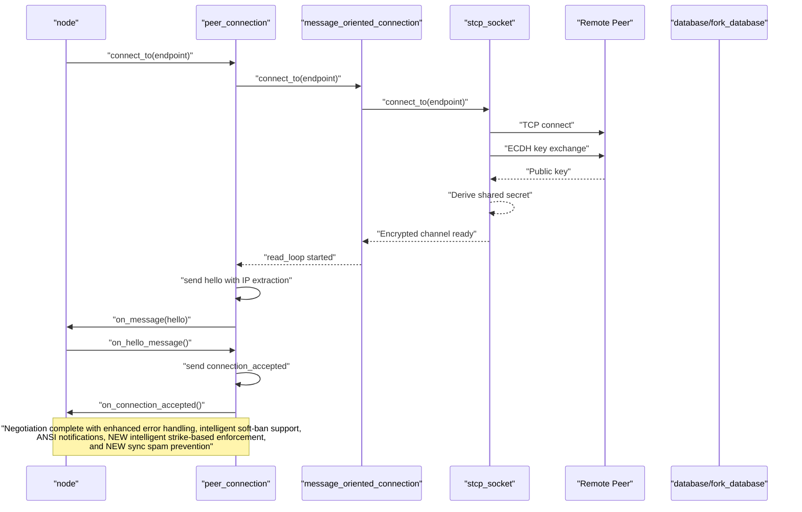

**Diagram sources**
- [peer_connection.cpp:208-242](file://libraries/network/peer_connection.cpp#L208-L242)
- [message_oriented_connection.cpp:135-140](file://libraries/network/message_oriented_connection.cpp#L135-L140)
- [stcp_socket.cpp:69-72](file://libraries/network/stcp_socket.cpp#L69-L72)
- [core_messages.hpp:233-272](file://libraries/network/include/graphene/network/core_messages.hpp#L233-L272)
- [node.cpp:662-718](file://libraries/network/node.cpp#L662-L718)
- [p2p_plugin.cpp:689-697](file://plugins/p2p/p2p_plugin.cpp#L689-L697)
- [plugin.cpp:3039-3045](file://plugins/snapshot/plugin.cpp#L3039-L3045)

## Detailed Component Analysis

### peer_connection: Enhanced Bidirectional Channel and State Machine
peer_connection encapsulates:
- Connection states: our_connection_state, their_connection_state, and connection_negotiation_status with improved error handling.
- Message queueing: real_queued_message and virtual_queued_message for immediate and deferred message generation with enhanced logging.
- Inventory tracking: sets for advertised and requested items, sync state, and throttling with robust error recovery.
- Metrics: bytes sent/received, last message timestamps, connection durations, and shared secret exposure with improved monitoring.
- **Enhanced** Soft-ban state: fork_rejected_until timestamp and inhibit_fetching_sync_blocks flag for peer management during emergency scenarios.
- **Enhanced** Peer trust integration: Automatic soft-ban duration calculation based on peer trust status for dual-tier soft-ban system.
- **Enhanced** Closing reason tracking: closing_reason field for enhanced logging and debugging capabilities.
- **NEW** Intelligent reputation: unlinkable_block_strikes counter for tracking violations of unlinkable blocks at/below head with configurable threshold enforcement.
- **NEW** Sync spam prevention: sync_spam_strikes counter for tracking repeated sync requests for competing forks with configurable threshold enforcement and fork_rejected_until mechanism.

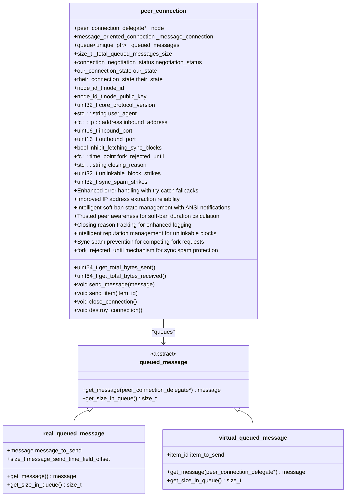

**Diagram sources**
- [peer_connection.hpp:79-351](file://libraries/network/include/graphene/network/peer_connection.hpp#L79-L351)
- [peer_connection.cpp:41-66](file://libraries/network/peer_connection.cpp#L41-L66)

Key behaviors:
- Outgoing message pipeline: send_message enqueues a real_queued_message with enhanced error handling; send_item enqueues a virtual_queued_message; send_queueable_message validates queue size and triggers send_queued_messages_task with improved logging.
- Inbound message pipeline: on_message delegates to node delegate with robust error recovery; on_connection_closed transitions negotiation_status and notifies node with proper exception handling.
- Lifecycle: accept_connection and connect_to manage transport setup with enhanced error handling; close_connection and destroy_connection coordinate teardown with improved exception safety.
- **Enhanced** Soft-ban management: fork_rejected_until tracks soft-ban expiration; inhibit_fetching_sync_blocks prevents sync operations during ban period; ANSI color-coded notifications for ban events; trusted peer-aware soft-ban duration calculation.
- **Enhanced** Closing reason logging: Enhanced peer disconnect logging with closing_reason field for improved troubleshooting.
- **NEW** Intelligent enforcement: unlinkable_block_strikes counter accumulates violations for blocks at or below head; automatic soft-ban activation when threshold (20 strikes) is reached; automatic reset to 0 upon soft-ban enforcement.
- **NEW** Sync spam prevention: sync_spam_strikes counter accumulates repeated sync requests for competing forks; automatic soft-ban activation when threshold (50 strikes) is reached after 5-minute duration using fork_rejected_until mechanism; automatic reset to 0 upon soft-ban enforcement.

**Section sources**
- [peer_connection.hpp:79-351](file://libraries/network/include/graphene/network/peer_connection.hpp#L79-L351)
- [peer_connection.cpp:244-338](file://libraries/network/peer_connection.cpp#L244-L338)
- [peer_connection.hpp:240-278](file://libraries/network/include/graphene/network/peer_connection.hpp#L240-L278)

### message_oriented_connection: Enhanced Message Framing and Transport Loop
message_oriented_connection:
- Wraps stcp_socket for secure transport with improved error handling.
- Implements read_loop to decode messages, enforce size limits, and dispatch to delegate with enhanced logging.
- Provides send_message with padding to 16-byte boundaries and flush behavior with robust error recovery.
- Exposes connection metrics and shared secret access with improved monitoring capabilities.


**Diagram sources**
- [message_oriented_connection.cpp:237-283](file://libraries/network/message_oriented_connection.cpp#L237-L283)
- [message_oriented_connection.cpp:148-235](file://libraries/network/message_oriented_connection.cpp#L148-L235)

**Section sources**
- [message_oriented_connection.hpp:45-79](file://libraries/network/include/graphene/network/message_oriented_connection.hpp#L45-L79)
- [message_oriented_connection.cpp:128-140](file://libraries/network/message_oriented_connection.cpp#L128-L140)
- [message_oriented_connection.cpp:237-283](file://libraries/network/message_oriented_connection.cpp#L237-L283)
- [message_oriented_connection.cpp:148-235](file://libraries/network/message_oriented_connection.cpp#L148-L235)

### stcp_socket: Secure Transport with ECDH and AES
stcp_socket:
- Performs ECDH key exchange on connect/accept with enhanced error handling.
- Derives shared secret and initializes AES encoder/decoder with improved reliability.
- Reads/writes in 16-byte increments for AES compatibility with robust error recovery.
- Exposes get_shared_secret for upper layers with enhanced monitoring capabilities.

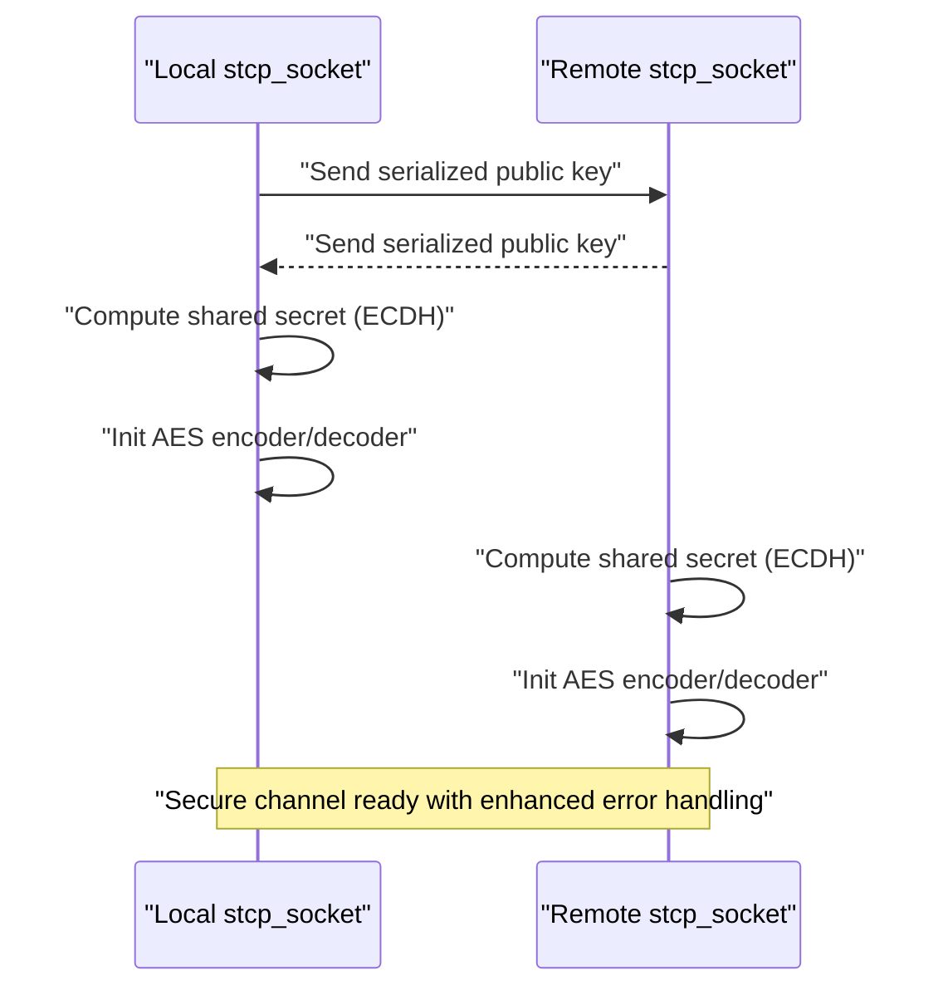

**Diagram sources**
- [stcp_socket.cpp:49-72](file://libraries/network/stcp_socket.cpp#L49-L72)
- [stcp_socket.cpp:132-177](file://libraries/network/stcp_socket.cpp#L132-L177)

**Section sources**
- [stcp_socket.hpp:37-93](file://libraries/network/include/graphene/network/stcp_socket.hpp#L37-L93)
- [stcp_socket.cpp:49-72](file://libraries/network/stcp_socket.cpp#L49-L72)
- [stcp_socket.cpp:132-177](file://libraries/network/stcp_socket.cpp#L132-L177)

### Handshake and Authentication Protocols
Handshake flow with enhanced IP address extraction:
- ECDH key exchange via stcp_socket during connect/accept with improved error handling.
- Hello message exchange with user agent, protocol version, ports, and node identifiers with reliable IP address extraction.
- Connection accepted or rejected messages finalize negotiation with enhanced logging and monitoring.

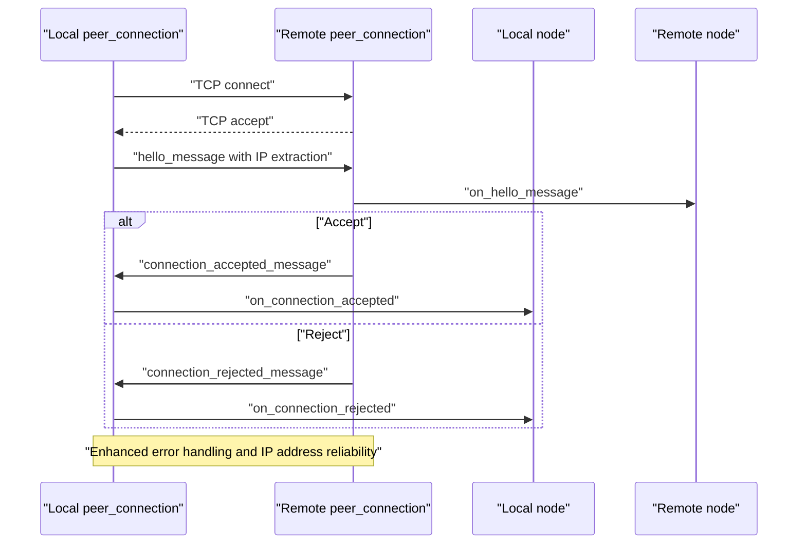

**Diagram sources**
- [core_messages.hpp:233-306](file://libraries/network/include/graphene/network/core_messages.hpp#L233-L306)
- [node.cpp:662-718](file://libraries/network/node.cpp#L662-L718)
- [peer_connection.cpp:208-242](file://libraries/network/peer_connection.cpp#L208-L242)

**Section sources**
- [core_messages.hpp:233-306](file://libraries/network/include/graphene/network/core_messages.hpp#L233-L306)
- [node.cpp:662-718](file://libraries/network/node.cpp#L662-L718)
- [peer_connection.cpp:208-242](file://libraries/network/peer_connection.cpp#L208-L242)

### Connection Lifecycle Management
Lifecycle stages with enhanced error handling, intelligent soft-ban functionality, ANSI color-coded notifications, and **NEW** configurable strike-based soft-ban enforcement including sync spam prevention:
- Initiation: connect_to for outbound, accept_connection for inbound with improved exception safety.
- Negotiation: hello/connection_accepted or connection_rejected with enhanced logging and monitoring.
- Operation: message exchange, inventory advertisement, sync with robust error recovery mechanisms, soft-ban enforcement, ANSI color-coded notifications, trusted peer-aware soft-ban duration calculation, closing_reason logging, and **NEW** intelligent strike-based enforcement for unlinkable blocks and **NEW** sync spam prevention.
- Maintenance: keep-alive via time requests, bandwidth monitoring with improved reliability, soft-ban expiration checking with color-coded logging, closing_reason tracking, and **NEW** strike counter management.
- Graceful disconnection: closing_connection message, close_connection, destroy_connection with enhanced error handling and closing_reason logging.
- Error recovery: queue overflow closes connection with proper cleanup, peer database updates with improved logging, retry timers with better exception safety.
- **Enhanced** Soft-ban management: fork_rejected_until timestamp enforcement, inhibit_fetching_sync_blocks flag management, automatic soft-ban expiration handling, ANSI color-coded ban notifications, reduced soft-ban duration from 3600 seconds to 900 seconds, trusted peer-aware soft-ban duration calculation.
- **NEW** Intelligent enforcement: unlinkable_block_strikes counter accumulation for blocks at or below head, 20-strike threshold triggering soft-ban with automatic reset to 0, tolerant handling of occasional stale fork violations.
- **NEW** Sync spam prevention: sync_spam_strikes counter accumulation for repeated sync requests for competing forks, 50-strike threshold triggering 5-minute soft-ban with fork_rejected_until timestamp and automatic reset to 0, prevention of sync ping-pong loops.

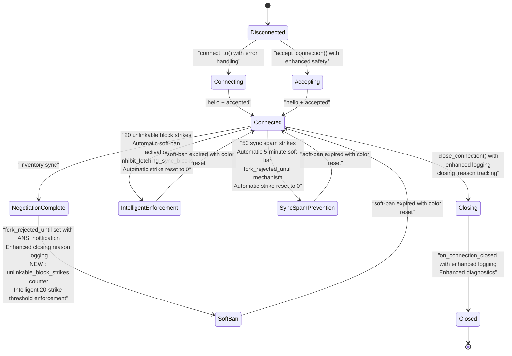

**Diagram sources**
- [peer_connection.hpp:82-106](file://libraries/network/include/graphene/network/peer_connection.hpp#L82-L106)
- [peer_connection.cpp:356-369](file://libraries/network/peer_connection.cpp#L356-L369)
- [node.cpp:718-740](file://libraries/network/node.cpp#L718-L740)
- [node.cpp:593-601](file://libraries/network/node.cpp#L593-L601)
- [node.cpp:5272-5274](file://libraries/network/node.cpp#L5272-L5274)

**Section sources**
- [peer_connection.cpp:169-242](file://libraries/network/peer_connection.cpp#L169-L242)
- [peer_connection.cpp:356-369](file://libraries/network/peer_connection.cpp#L356-L369)
- [node.cpp:718-740](file://libraries/network/node.cpp#L718-L740)
- [node.cpp:593-601](file://libraries/network/node.cpp#L593-L601)
- [node.cpp:5272-5274](file://libraries/network/node.cpp#L5272-L5274)

### Message Queuing, Priority, and Multiplexing
- Queuing: real_queued_message stores full messages with enhanced error handling; virtual_queued_message defers generation via node delegate with improved logging.
- Limits: GRAPHENE_NET_MAXIMUM_QUEUED_MESSAGES_IN_BYTES prevents memory pressure with better exception safety; exceeding triggers closure with proper cleanup.
- Priority: During sync, prioritized_item_id sorts blocks before transactions with enhanced monitoring; during normal operation, FIFO per peer with throttling and improved error recovery.
- Multiplexing: Multiple peer_connection instances share node delegate with enhanced error handling; each peer has independent queues and state with improved reliability.

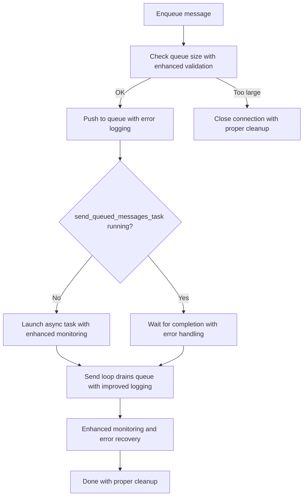

**Diagram sources**
- [peer_connection.cpp:310-338](file://libraries/network/peer_connection.cpp#L310-L338)
- [peer_connection.cpp:255-308](file://libraries/network/peer_connection.cpp#L255-L308)
- [config.hpp:58-58](file://libraries/network/include/graphene/network/config.hpp#L58-L58)

**Section sources**
- [peer_connection.cpp:310-338](file://libraries/network/peer_connection.cpp#L310-L338)
- [peer_connection.cpp:255-308](file://libraries/network/peer_connection.cpp#L255-L308)
- [config.hpp:58-58](file://libraries/network/include/graphene/network/config.hpp#L58-L58)

### Peer State Tracking, Metrics, and Reputation
Peer state tracking with enhanced error handling, intelligent soft-ban support, ANSI color-coded notifications, and **NEW** intelligent reputation management including sync spam prevention:
- Connection states: negotiated status, direction, firewalled state, clock offset, round-trip delay with improved monitoring and logging.
- Inventory: advertised to peer, advertised to us, requested, sync state, throttling windows with robust error recovery mechanisms.
- Metrics: bytes sent/received, last message times, connection duration, termination time with enhanced logging and monitoring.
- **Enhanced** Soft-ban state: fork_rejected_until timestamp tracks soft-ban expiration; inhibit_fetching_sync_blocks prevents sync operations during ban period.
- **Enhanced** Trusted peer management: Automatic soft-ban duration calculation based on peer trust status; efficient IP address lookup for trusted peer detection.
- **Enhanced** Closing reason logging: Enhanced peer disconnect logging with closing_reason field for improved troubleshooting.
- **NEW** Intelligent reputation: unlinkable_block_strikes counter tracks violations for unlinkable blocks at/below head; automatic soft-ban activation when threshold (20 strikes) is reached; automatic reset to 0 upon enforcement.
- **NEW** Sync spam prevention: sync_spam_strikes counter tracks repeated sync requests for competing forks; automatic soft-ban activation when threshold (50 strikes) is reached after 5-minute duration using fork_rejected_until mechanism; automatic reset to 0 upon enforcement.

Reputation and selection with improved reliability:
- peer_database tracks endpoints, last seen, disposition, and attempt counts with enhanced error handling.
- node selects peers based on desired/max connections, retry timeouts, and peer database entries with better exception safety.
- Enhanced logging and monitoring throughout the peer selection and balancing process with ANSI color-coded notifications.
- **Enhanced** Soft-ban enforcement: Automatic soft-ban detection and enforcement during block processing with color-coded logging.
- **Enhanced** Trusted peer awareness: Peer trust status influences soft-ban duration and network behavior.
- **Enhanced** Database dumping: Enhanced peer database dumping with enhanced JSON serialization and error handling.
- **NEW** Intelligent enforcement: Configurable 20-strike threshold for unlinkable blocks at/below head with tolerant handling of occasional stale forks.
- **NEW** Sync spam prevention: Configurable 50-strike threshold for repeated sync requests with 5-minute soft-ban duration using fork_rejected_until mechanism for preventing resource exhaustion attacks.

**Section sources**
- [peer_connection.hpp:175-279](file://libraries/network/include/graphene/network/peer_connection.hpp#L175-L279)
- [peer_connection.cpp:428-480](file://libraries/network/peer_connection.cpp#L428-L480)
- [peer_database.hpp:47-71](file://libraries/network/include/graphene/network/peer_database.hpp#L47-L71)
- [peer_database.cpp:100-174](file://libraries/network/peer_database.cpp#L100-L174)
- [node.cpp:518-526](file://libraries/network/node.cpp#L518-L526)
- [node.cpp:593-601](file://libraries/network/node.cpp#L593-L601)
- [node.cpp:5265-5274](file://libraries/network/node.cpp#L5265-L5274)

### Enhanced Network Stability Features
**Enhanced** Network stability improvements with comprehensive error handling, intelligent soft-ban mechanisms, ANSI color-coded notifications, and **NEW** configurable strike-based soft-ban enforcement including sync spam prevention:
- **Intelligent soft-ban mechanisms**: Soft-ban duration reduced from 3600 seconds (1 hour) to 900 seconds (15 minutes) for improved network responsiveness; trusted peers receive 5-minute soft-ban duration; regular peers receive 15-minute (reduced) soft-ban duration.
- **Intelligent strike-based enforcement**: Configurable 20-strike threshold for unlinkable blocks at/below head; automatic soft-ban activation with fork_rejected_until timestamp and inhibit_fetching_sync_blocks flag; automatic strike counter reset to 0 upon enforcement.
- **Enhanced peer disconnect logging**: closing_reason field provides detailed information about why peers disconnect for improved troubleshooting.
- **Improved peer database dumping**: Enhanced JSON serialization and error handling for better database management.
- **NEW** Sync spam prevention: Configurable 50-strike threshold for repeated sync requests with 5-minute soft-ban duration using fork_rejected_until mechanism for preventing resource exhaustion attacks.
- Node layer implements intelligent soft-ban functionality for peer management during emergency scenarios with ANSI color-coded notifications.
- **Enhanced** Trusted peer integration: Automatic soft-ban duration calculation based on peer trust status; 5-minute soft-ban for trusted peers, 15-minute (reduced) soft-ban for regular peers.
- P2P plugin converts chain exceptions to network exceptions for consistent handling.
- ANSI color codes (CLOG_RED, CLOG_RESET) provide visual emphasis for ban notifications in terminal output.
- **Enhanced** Memory management: Deferred resize operations during block processing handled gracefully without penalizing peers.
- **NEW** Intelligent reputation management: Configurable 20-strike threshold for unlinkable blocks at/below head; automatic soft-ban activation with fork_rejected_until timestamp and inhibit_fetching_sync_blocks flag; automatic strike counter reset to 0 upon enforcement.
- **NEW** Sync spam prevention: Configurable 50-strike threshold for repeated sync requests with 5-minute soft-ban duration using fork_rejected_until mechanism for preventing resource exhaustion attacks.

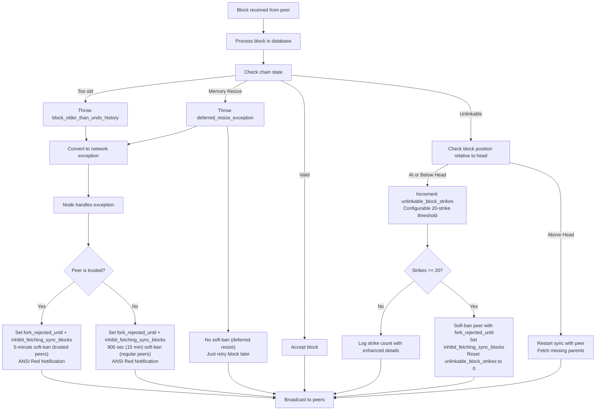

**Diagram sources**
- [database.cpp:1215-1246](file://libraries/chain/database.cpp#L1215-L1246)
- [fork_database.cpp:34-46](file://libraries/chain/fork_database.cpp#L34-L46)
- [node.cpp:3874-3908](file://libraries/network/node.cpp#L3874-L3908)
- [node.cpp:3598-3626](file://libraries/network/node.cpp#L3598-L3626)
- [node.cpp:5272-5274](file://libraries/network/node.cpp#L5272-L5274)
- [p2p_plugin.cpp:172-182](file://plugins/p2p/p2p_plugin.cpp#L172-L182)
- [node.cpp:599-600](file://libraries/network/node.cpp#L599-L600)

**Section sources**
- [database.cpp:1215-1246](file://libraries/chain/database.cpp#L1215-L1246)
- [fork_database.cpp:34-46](file://libraries/chain/fork_database.cpp#L34-L46)
- [node.cpp:3874-3908](file://libraries/network/node.cpp#L3874-L3908)
- [node.cpp:3598-3626](file://libraries/network/node.cpp#L3598-L3626)
- [node.cpp:5272-5274](file://libraries/network/node.cpp#L5272-L5274)
- [p2p_plugin.cpp:172-182](file://plugins/p2p/p2p_plugin.cpp#L172-L182)
- [node.cpp:599-600](file://libraries/network/node.cpp#L599-L600)

### Enhanced Peer Database Operations
**Enhanced** Improved peer database operations with comprehensive tracking and enhanced serialization:
- **Enhanced** JSON serialization: Enhanced JSON serialization for peer database records with improved error handling and logging.
- **Comprehensive** tracking: Enhanced peer database dumping with unlinkable_block_strikes tracking for improved reputation management.
- **Robust** file operations: Enhanced file operations with proper error handling for database loading and saving.
- **Database** management: Improved peer database management with enhanced dumping capabilities for debugging and maintenance.
- **Error** handling: Comprehensive error handling for database operations with detailed logging for troubleshooting.

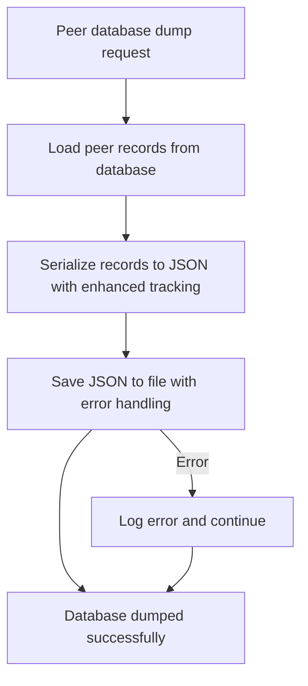

**Diagram sources**
- [peer_database.cpp:120-137](file://libraries/network/peer_database.cpp#L120-L137)

**Section sources**
- [peer_database.cpp:120-137](file://libraries/network/peer_database.cpp#L120-L137)
- [peer_database.cpp:100-174](file://libraries/network/peer_database.cpp#L100-L174)

### Enhanced Closing Reason Tracking
**Enhanced** Closing reason tracking with detailed logging for improved troubleshooting:
- **Reason storage**: closing_reason field stores the reason for peer disconnection before moving to closing list.
- **Enhanced logging**: Detailed logging includes both remote and local reasons for disconnection.
- **Error handling**: Enhanced error handling for disconnection scenarios with proper reason logging.
- **Debugging support**: Improved debugging capabilities through detailed closing reason information.

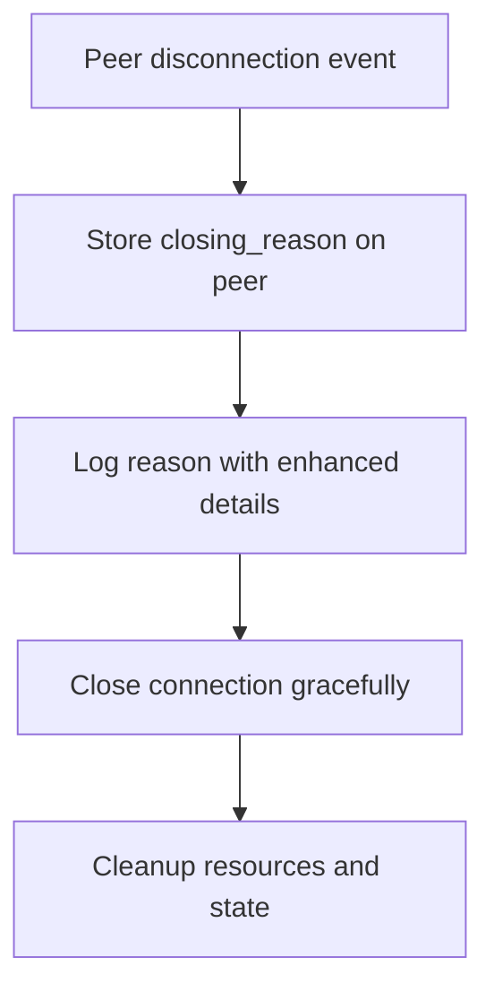

**Diagram sources**
- [node.cpp:5013-5014](file://libraries/network/node.cpp#L5013-L5014)
- [node.cpp:3061-3062](file://libraries/network/node.cpp#L3061-L3062)

**Section sources**
- [node.cpp:5013-5014](file://libraries/network/node.cpp#L5013-L5014)
- [node.cpp:3061-3062](file://libraries/network/node.cpp#L3061-L3062)

### Enhanced Intelligent Soft-Ban Enforcement
**NEW** Configurable intelligent soft-ban mechanism for unlinkable blocks at/below head:
- **Intelligent strike accumulation**: unlinkable_block_strikes counter increments for each unlinkable block received from peers when block number is at or below current head.
- **Configurable threshold enforcement**: When strikes reach 20, automatic soft-ban is triggered with fork_rejected_until timestamp and inhibit_fetching_sync_blocks flag set.
- **Automatic reset**: unlinkable_block_strikes counter resets to 0 after soft-ban enforcement.
- **Tolerant handling**: Provides tolerance for occasional stale fork violations while preventing systematic abuse.
- **Integration**: Seamlessly integrates with existing soft-ban infrastructure and trusted peer considerations.
- **Intelligent enforcement**: Combines configurable thresholds with trusted peer awareness for optimal network stability.

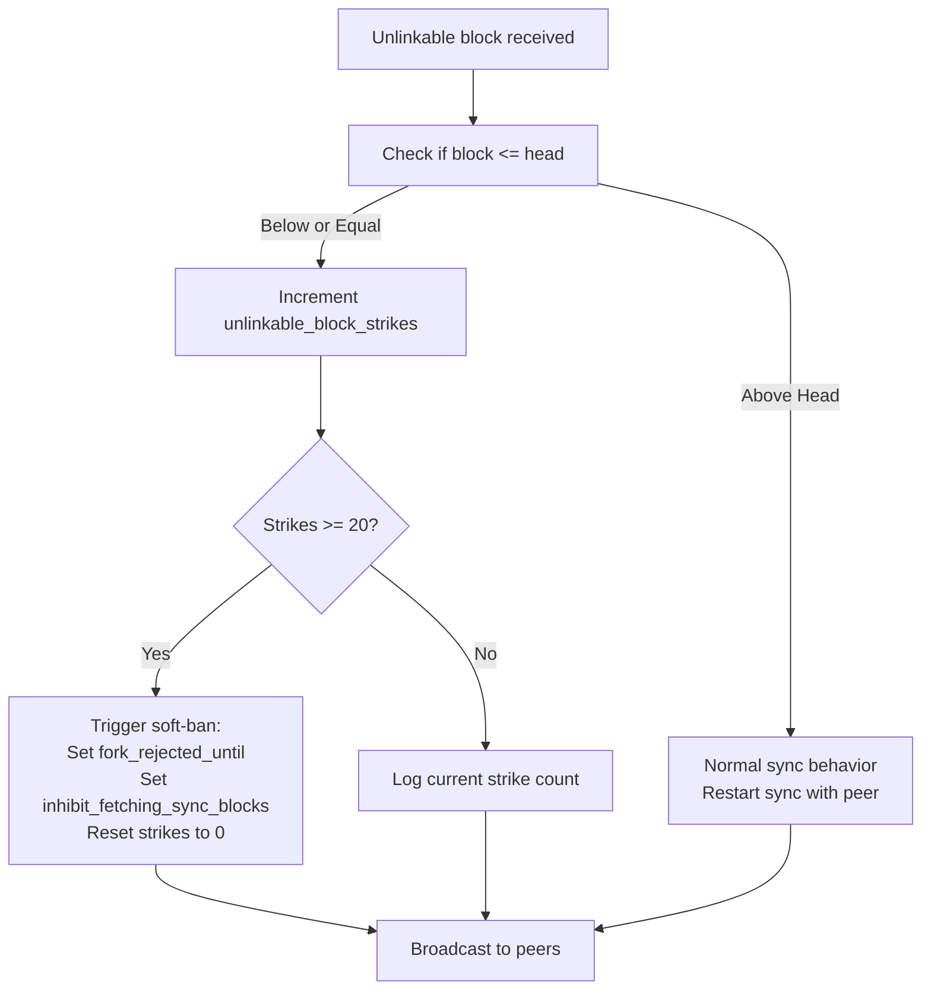

**Diagram sources**
- [node.cpp:3874-3908](file://libraries/network/node.cpp#L3874-L3908)
- [peer_connection.hpp:279-283](file://libraries/network/include/graphene/network/peer_connection.hpp#L279-L283)

**Section sources**
- [node.cpp:3874-3908](file://libraries/network/node.cpp#L3874-L3908)
- [peer_connection.hpp:279-283](file://libraries/network/include/graphene/network/peer_connection.hpp#L279-L283)

### Enhanced Sync Spam Prevention
**NEW** Configurable intelligent sync spam prevention mechanism for repeated sync requests:
- **Intelligent strike accumulation**: sync_spam_strikes counter increments for each repeated sync request for competing forks when peer block number is at or below current head.
- **Configurable threshold enforcement**: When strikes reach 50, automatic 5-minute soft-ban is triggered with fork_rejected_until timestamp set.
- **Automatic reset**: sync_spam_strikes counter resets to 0 after soft-ban enforcement.
- **Ping-pong loop prevention**: Prevents endless sync restart loops between peers on competing forks at the same height.
- **Integration**: Seamlessly integrates with existing soft-ban infrastructure and sync management.
- **Resource protection**: Protects network resources from sync spam attacks while maintaining legitimate sync operations.
- **fork_rejected_until mechanism**: Uses timestamp-based soft-ban enforcement for precise timing control.

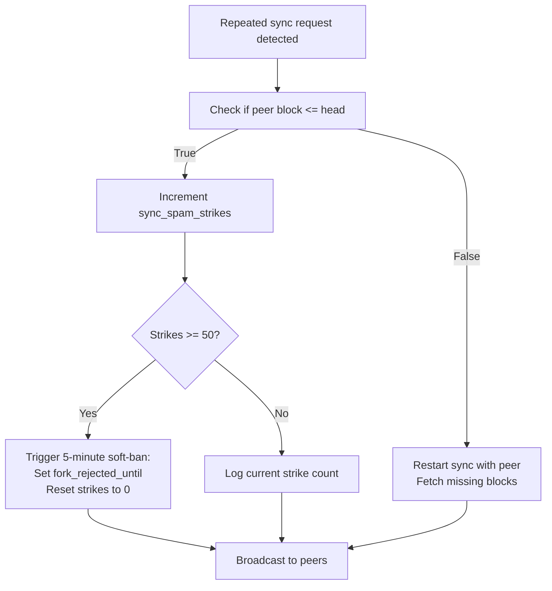

**Diagram sources**
- [node.cpp:2520-2590](file://libraries/network/node.cpp#L2520-L2590)
- [peer_connection.hpp:285-289](file://libraries/network/include/graphene/network/peer_connection.hpp#L285-L289)

**Section sources**
- [node.cpp:2520-2590](file://libraries/network/node.cpp#L2520-L2590)
- [peer_connection.hpp:285-289](file://libraries/network/include/graphene/network/peer_connection.hpp#L285-L289)

### Examples and Patterns
- Peer connection setup with enhanced error handling:
  - Outbound: peer_connection::connect_to(endpoint) -> message_oriented_connection::connect_to -> stcp_socket::connect_to -> ECDH -> hello -> connection_accepted with improved logging.
  - Inbound: accept_connection -> ECDH -> hello -> connection_accepted with enhanced error recovery.
- Message exchange with robust monitoring:
  - send_message queues a real message with enhanced error handling; send_item queues a virtual message; send_queued_messages_task sends them with improved logging.
- Connection monitoring with enhanced reliability:
  - get_total_bytes_sent/get_total_bytes_received, last_message_sent_time/last_message_received, get_connection_time/get_connection_terminated_time with improved error recovery.
- Peer selection and balancing with better exception safety:
  - node maintains desired/max connections, peer database, and retry timers; balances by selecting candidates from peer_database and initiating connect_to with enhanced error handling.
- **Enhanced** Intelligent soft-ban management:
  - Automatic soft-ban detection for peers sending unlinkable blocks; fork_rejected_until timestamp enforcement; inhibit_fetching_sync_blocks flag management; automatic soft-ban expiration handling; ANSI color-coded ban notifications; reduced soft-ban duration from 3600 seconds to 900 seconds; trusted peer-aware soft-ban duration calculation.
- **Enhanced** Closing reason tracking:
  - Enhanced peer disconnect logging with closing_reason field; detailed reason storage and logging for improved troubleshooting.
- **Enhanced** Trusted peer integration:
  - Automatic trusted peer registration from config.ini trusted-snapshot-peer options; efficient IP address lookup for trust detection; dual-tier soft-ban system with 5-minute duration for trusted peers; seamless P2P-snapshot plugin coordination.
- **Enhanced** Memory resize exception handling:
  - Deferred shared memory resize operations during block processing; proper exception propagation through P2P layer; no peer penalization for transient memory resize operations; trusted peer consideration in exception handling.
- **Enhanced** Database dumping:
  - Enhanced peer database dumping with improved JSON serialization; robust file operations with error handling; comprehensive logging for database management.
- **NEW** Intelligent reputation management:
  - Configurable 20-strike threshold for unlinkable blocks at/below head; automatic soft-ban activation with fork_rejected_until timestamp; automatic strike counter reset to 0; tolerant handling of occasional stale fork violations; integration with existing soft-ban infrastructure.
- **NEW** Sync spam prevention:
  - Configurable 50-strike threshold for repeated sync requests; automatic 5-minute soft-ban activation with fork_rejected_until timestamp; automatic strike counter reset to 0; prevention of sync ping-pong loops; protection against resource exhaustion attacks; fork_rejected_until mechanism for precise timing control.

**Section sources**
- [peer_connection.cpp:208-242](file://libraries/network/peer_connection.cpp#L208-L242)
- [peer_connection.cpp:340-354](file://libraries/network/peer_connection.cpp#L340-L354)
- [peer_connection.cpp:371-399](file://libraries/network/peer_connection.cpp#L371-L399)
- [node.cpp:518-526](file://libraries/network/node.cpp#L518-L526)
- [peer_database.cpp:100-174](file://libraries/network/peer_database.cpp#L100-L174)
- [node.cpp:5240-5274](file://libraries/network/node.cpp#L5240-L5274)
- [node.cpp:5272-5274](file://libraries/network/node.cpp#L5272-L5274)
- [config.ini:96-101](file://share/vizd/config/config.ini#L96-L101)

## Dependency Analysis
The peer connection subsystem exhibits clear layering and low coupling with enhanced error handling, intelligent soft-ban functionality, ANSI color-coded notifications, and **NEW** configurable strike-based soft-ban enforcement including sync spam prevention:
- peer_connection depends on message_oriented_connection and node delegate with improved exception safety.
- message_oriented_connection depends on stcp_socket and delegates to peer_connection with enhanced logging.
- stcp_socket depends on fc crypto primitives and tcp socket with robust error recovery.
- node orchestrates peer_connection instances and peer_database with better exception handling, soft-ban logic, ANSI notification support, and **NEW** intelligent strike-based enforcement including sync spam prevention.
- core_messages defines protocol contracts used across layers with reliable IP address handling.
- **Enhanced** database and fork_database depend on chain exceptions and propagate network exceptions to P2P layer.
- **Enhanced** p2p_plugin converts chain exceptions to network exceptions for consistent handling and manages trusted peer registration.
- **Enhanced** snapshot_plugin provides trusted-snapshot-peer configuration and peer discovery for trusted peer management.
- **Enhanced** database_exceptions defines deferred_resize_exception for memory resize operations.
- **Enhanced** Network stability features create dependencies between node and peer_connection for intelligent enforcement mechanisms.
- **NEW** Intelligent reputation system creates dependency between node and peer_connection for strike counter management and threshold enforcement.
- **NEW** Sync spam prevention creates dependency between node and peer_connection for sync_spam_strikes counter management and threshold enforcement using fork_rejected_until mechanism.

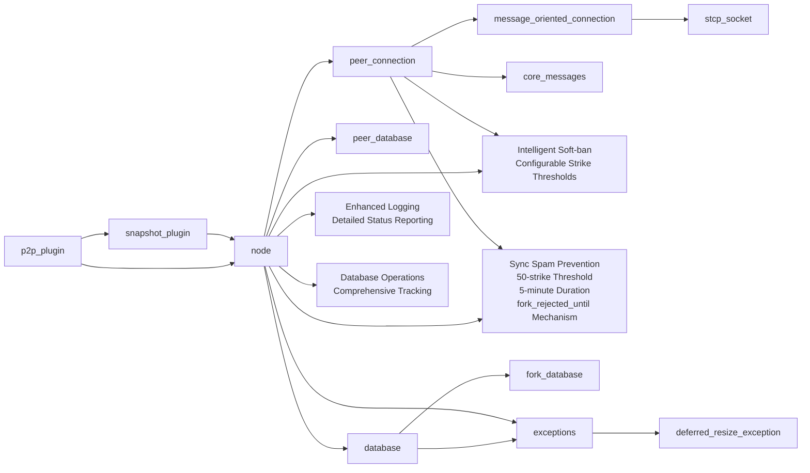

**Diagram sources**
- [peer_connection.hpp:79-351](file://libraries/network/include/graphene/network/peer_connection.hpp#L79-L351)
- [message_oriented_connection.hpp:45-79](file://libraries/network/include/graphene/network/message_oriented_connection.hpp#L45-L79)
- [stcp_socket.hpp:37-93](file://libraries/network/include/graphene/network/stcp_socket.hpp#L37-L93)
- [core_messages.hpp:72-95](file://libraries/network/include/graphene/network/core_messages.hpp#L72-L95)
- [node.hpp:190-304](file://libraries/network/include/graphene/network/node.hpp#L190-L304)
- [peer_database.hpp:104-134](file://libraries/network/include/graphene/network/peer_database.hpp#L104-L134)
- [message.hpp:42-106](file://libraries/network/include/graphene/network/message.hpp#L42-L106)
- [database.cpp:1215-1246](file://libraries/chain/database.cpp#L1215-L1246)
- [fork_database.cpp:34-46](file://libraries/chain/fork_database.cpp#L34-L46)
- [exceptions.hpp:33-45](file://libraries/network/include/graphene/network/exceptions.hpp#L33-L45)
- [node.cpp:593-601](file://libraries/network/node.cpp#L593-L601)
- [node.cpp:5240-5274](file://libraries/network/node.cpp#L5240-L5274)
- [p2p_plugin.cpp:689-697](file://plugins/p2p/p2p_plugin.cpp#L689-L697)
- [plugin.cpp:3039-3045](file://plugins/snapshot/plugin.cpp#L3039-L3045)

**Section sources**
- [peer_connection.hpp:26-45](file://libraries/network/include/graphene/network/peer_connection.hpp#L26-L45)
- [message_oriented_connection.hpp:26-28](file://libraries/network/include/graphene/network/message_oriented_connection.hpp#L26-L28)
- [stcp_socket.hpp:26-28](file://libraries/network/include/graphene/network/stcp_socket.hpp#L26-L28)
- [core_messages.hpp:26-35](file://libraries/network/include/graphene/network/core_messages.hpp#L26-L35)
- [node.hpp:26-31](file://libraries/network/include/graphene/network/node.hpp#L26-L31)
- [peer_database.hpp:26-35](file://libraries/network/include/graphene/network/peer_database.hpp#L26-L35)
- [message.hpp:26-31](file://libraries/network/include/graphene/network/message.hpp#L26-L31)
- [database.cpp:1215-1246](file://libraries/chain/database.cpp#L1215-L1246)
- [fork_database.cpp:34-46](file://libraries/chain/fork_database.cpp#L34-L46)
- [exceptions.hpp:33-45](file://libraries/network/include/graphene/network/exceptions.hpp#L33-L45)
- [node.cpp:593-601](file://libraries/network/node.cpp#L593-L601)
- [node.cpp:5240-5274](file://libraries/network/node.cpp#L5240-L5274)
- [p2p_plugin.cpp:689-697](file://plugins/p2p/p2p_plugin.cpp#L689-L697)
- [plugin.cpp:3039-3045](file://plugins/snapshot/plugin.cpp#L3039-L3045)

## Performance Considerations
- Message sizing: MAX_MESSAGE_SIZE caps payload; padding to 16 bytes ensures AES compatibility with enhanced error handling.
- Queue limits: GRAPHENE_NET_MAXIMUM_QUEUED_MESSAGES_IN_BYTES prevents memory growth under heavy load with better exception safety.
- Throttling: Inventory lists and transaction fetching inhibition mitigate flooding with improved monitoring.
- Bandwidth monitoring: node tracks read/write rates and applies rate limiting groups with enhanced logging.
- Sync optimization: interleaved prefetching and prioritization reduce sync time with robust error recovery mechanisms.
- Enhanced error handling: Comprehensive try-catch fallbacks throughout peer statistics logging ensure more robust operation of the P2P network layer.
- **Enhanced** Soft-ban optimization: Intelligent soft-ban enforcement prevents cascading disconnections during emergency scenarios, improving network stability with reduced soft-ban duration from 3600 seconds to 900 seconds.
- **Enhanced** Block processing efficiency: Proper exception handling reduces unnecessary reprocessing and improves overall network performance.
- **Enhanced** Memory management: Deferred resize operations prevent blocking during shared memory expansion, improving system responsiveness.
- **Enhanced** Notification performance: ANSI color-coded logging provides visual emphasis without impacting performance significantly.
- **Enhanced** Trusted peer performance: O(1) IP address lookup for trusted peer detection minimizes overhead; efficient configuration parsing reduces startup time.
- **Enhanced** Dual-tier optimization: Separate soft-ban duration calculation eliminates redundant calculations while providing flexible peer management.
- **Enhanced** Intelligent reputation management: Configurable 20-strike threshold provides optimal balance between tolerance and enforcement; minimal performance impact through simple counter increment and comparison operations.
- **Enhanced** Sync spam prevention: Configurable 50-strike threshold provides optimal protection against resource exhaustion attacks; minimal performance impact through simple counter increment and comparison operations.
- **NEW** Intelligent enforcement efficiency: Configurable 20-strike threshold provides optimal balance between tolerance and enforcement; minimal performance impact through simple counter increment and comparison operations.
- **NEW** Sync spam prevention efficiency: Configurable 50-strike threshold provides optimal protection against resource exhaustion attacks; minimal performance impact through simple counter increment and comparison operations using fork_rejected_until mechanism.

## Troubleshooting Guide
Common issues and remedies with enhanced error handling, intelligent soft-ban functionality, ANSI color-coded notifications, and **NEW** configurable strike-based soft-ban enforcement including sync spam prevention:
- Connection refused or rejected: Review rejection reasons in connection_rejected_message with improved logging; check protocol version, chain ID, and node policies with better error reporting.
- Handshake failures: Verify ECDH key exchange succeeded with enhanced error handling; inspect stcp_socket logs with improved monitoring; ensure endpoints are reachable with robust error recovery.
- Queue overflow: Monitor queue size with enhanced logging; adjust rate or reduce message sizes; consider disconnecting misbehaving peers with proper cleanup.
- Idle peers: Use inactivity timeouts with improved exception safety; terminate inactive connections; rebalance peers with better error handling.
- Peer reputation: Inspect peer_database entries with enhanced logging; prune failed peers; respect retry delays with improved error recovery mechanisms.
- IP address extraction issues: Enhanced safe static_cast operations with try-catch fallback mechanisms ensure reliable IP address extraction throughout peer information handling.
- **Enhanced** Soft-ban issues: Check fork_rejected_until timestamps and inhibit_fetching_sync_blocks flags; verify automatic soft-ban expiration handling; monitor soft-ban effectiveness; review ANSI color-coded ban notifications for quick identification; verify trusted peer soft-ban duration calculation; verify reduced soft-ban duration from 3600 seconds to 900 seconds.
- **Enhanced** Closing reason tracking: Verify closing_reason field logging; check enhanced peer disconnect logging for troubleshooting; review detailed reason information for improved debugging.
- **Enhanced** Trusted peer configuration: Verify trusted-snapshot-peer entries in config.ini are valid IP:port format; check automatic registration in P2P plugin logs; ensure IP address parsing succeeds; verify O(1) lookup functionality.
- **Enhanced** Block processing errors: Review unlinkable_block_exception handling and soft-ban enforcement; verify proper exception conversion from chain to network exceptions; check memory resize exception handling; verify trusted peer-aware soft-ban duration calculation.
- **Enhanced** Memory resize issues: Monitor deferred_resize_exception occurrences; verify proper exception propagation through P2P layer; ensure no peer penalization for transient memory resize operations.
- **Enhanced** Notification visibility: Verify ANSI color codes are properly displayed in terminal; check CLOG_RED and CLOG_RESET definitions for proper formatting.
- **Enhanced** Plugin integration: Verify snapshot plugin loads trusted-snapshot-peer configuration; check P2P plugin registration success; ensure seamless coordination between plugins.
- **Enhanced** Database dumping: Verify enhanced peer database dumping functionality; check JSON serialization and error handling; ensure proper database management capabilities.
- **NEW** Intelligent reputation issues: Monitor unlinkable_block_strikes counter values; verify 20-strike threshold enforcement; check automatic soft-ban activation and strike reset behavior; ensure tolerant handling of occasional stale fork violations; verify integration with existing soft-ban infrastructure.
- **NEW** Sync spam prevention issues: Monitor sync_spam_strikes counter values; verify 50-strike threshold enforcement; check automatic 5-minute soft-ban activation and fork_rejected_until mechanism; verify automatic strike reset behavior; ensure prevention of sync ping-pong loops; verify integration with existing sync management.
- **NEW** fork_rejected_until mechanism: Verify timestamp-based soft-ban enforcement; check 5-minute duration precision; ensure automatic soft-ban expiration handling; verify integration with sync spam prevention logic.

**Section sources**
- [core_messages.hpp:285-306](file://libraries/network/include/graphene/network/core_messages.hpp#L285-L306)
- [config.hpp:48-50](file://libraries/network/include/graphene/network/config.hpp#L48-L50)
- [peer_database.cpp:100-174](file://libraries/network/peer_database.cpp#L100-L174)
- [peer_connection.cpp:314-325](file://libraries/network/peer_connection.cpp#L314-L325)
- [node.cpp:3448-3470](file://libraries/network/node.cpp#L3448-L3470)
- [node.cpp:5240-5274](file://libraries/network/node.cpp#L5240-L5274)
- [node.cpp:5272-5274](file://libraries/network/node.cpp#L5272-L5274)
- [config.ini:96-101](file://share/vizd/config/config.ini#L96-L101)

## Conclusion
Peer Connection Management in this codebase provides a robust, layered architecture for secure, multiplexed peer communication with enhanced error handling, reliability, and **Enhanced** network stability features. It supports comprehensive lifecycle management, strict authentication via ECDH/AES, and sophisticated message queuing with priority and throttling. The node orchestrates peers, maintains reputation, and optimizes selection and balancing with improved exception safety. Enhanced peer information handling with reliable IP address extraction using safe static_cast operations with try-catch fallback mechanisms, combined with improved error handling and performance optimizations throughout peer statistics logging, ensures more robust operation of the P2P network layer.

**Enhanced** The system now includes sophisticated network stability improvements featuring intelligent soft-ban mechanisms with configurable strike-based enforcement, comprehensive peer database operations with unlinkable_block_strikes tracking, improved peer synchronization logging with detailed status reporting, enhanced error diagnostics for peer synchronization issues, and intelligent reputation management systems. These enhancements provide superior network stability, improved operational visibility through color-coded terminal notifications, enhanced troubleshooting capabilities through detailed closing reason tracking, intelligent enforcement mechanisms through configurable strike thresholds, and intelligent reputation management through configurable enforcement that tolerates occasional stale fork violations while preventing systematic abuse.

**NEW** Additionally, the system now features advanced sync spam prevention mechanisms that protect against resource exhaustion attacks through configurable strike thresholds and automatic soft-ban enforcement using fork_rejected_until mechanism, ensuring network resilience against malicious or misconfigured peers attempting to overwhelm the system with repeated sync requests. The implementation includes precise 5-minute soft-ban duration control and automatic strike counter reset to prevent permanent peer blocking while effectively mitigating spam attacks.

## Appendices

### Configuration Constants
Important tunables affecting peer connection behavior:
- GRAPHENE_NET_PROTOCOL_VERSION: Protocol version for compatibility.
- MAX_MESSAGE_SIZE: Maximum message size in bytes.
- GRAPHENE_NET_MAXIMUM_QUEUED_MESSAGES_IN_BYTES: Queue size cap with enhanced error handling.
- GRAPHENE_NET_DEFAULT_DESIRED_CONNECTIONS / GRAPHENE_NET_DEFAULT_MAX_CONNECTIONS: Target and hard limits.
- GRAPHENE_NET_PEER_HANDSHAKE_INACTIVITY_TIMEOUT / GRAPHENE_NET_PEER_DISCONNECT_TIMEOUT: Timeout thresholds with improved exception safety.
- **Enhanced** TRUSTED_SOFT_BAN_DURATION_SEC / SOFT_BAN_DURATION_SEC: 300 seconds (5 minutes) vs 900 seconds (15 minutes) for trusted vs regular peers.
- **Enhanced** DISCONNECT_RECONNECT_COOLDOWN_SEC: 30-second cooldown period for per-IP disconnect management.
- **NEW** UNLINKABLE_BLOCK_STRIKE_THRESHOLD: 20-strike threshold for configurable soft-ban enforcement on unlinkable blocks at/below head.
- **NEW** SYNC_SPAM_STRIKE_THRESHOLD: 50-strike threshold for configurable soft-ban enforcement on sync spam attacks.
- **NEW** SYNC_SPAM_BAN_DURATION_SEC: 300-second (5-minute) duration for sync spam soft-bans.
- **NEW** INTELLIGENT_SOFT_BAN_ENFORCEMENT: Configurable threshold with trusted peer awareness for optimal network stability.
- **NEW** fork_rejected_until mechanism: Timestamp-based soft-ban enforcement for precise timing control.

**Section sources**
- [config.hpp:26-106](file://libraries/network/include/graphene/network/config.hpp#L26-L106)
- [node.cpp:599-600](file://libraries/network/node.cpp#L599-L600)

### Network Exception Types
**Enhanced** Exception types for improved error handling:
- unlinkable_block_exception: Used for blocks from dead forks with parents not in fork database.
- block_older_than_undo_history: Used for blocks too old for fork database processing.
- peer_is_on_an_unreachable_fork: Used when peers are on incompatible forks.
- **Enhanced** deferred_resize_exception: Used for shared memory resize operations during block processing, indicating transient memory expansion requiring block retry.
- Enhanced error propagation: Chain exceptions converted to network exceptions for consistent P2P layer handling.
- **Enhanced** Trusted peer consideration: Deferred resize exceptions do not trigger soft-bans as they represent local memory conditions.
- **Enhanced** Closing reason tracking: Enhanced peer disconnect logging with detailed reason information.
- **NEW** Intelligent enforcement: Configurable 20-strike threshold for unlinkable blocks at/below head with automatic soft-ban activation.
- **NEW** Sync spam prevention: Configurable 50-strike threshold for repeated sync requests with 5-minute soft-ban activation using fork_rejected_until mechanism.

**Section sources**
- [exceptions.hpp:33-45](file://libraries/network/include/graphene/network/exceptions.hpp#L33-L45)
- [p2p_plugin.cpp:172-182](file://plugins/p2p/p2p_plugin.cpp#L172-L182)
- [database.cpp:1239-1241](file://libraries/chain/database.cpp#L1239-L1241)
- [database_exceptions.hpp:86-86](file://libraries/chain/include/graphene/chain/database_exceptions.hpp#L86-L86)

### ANSI Color Code Definitions
**Enhanced** Terminal formatting support for enhanced notifications:
- CLOG_RED: ANSI escape sequence for red text formatting.
- CLOG_ORANGE: ANSI escape sequence for orange text formatting.
- CLOG_RESET: ANSI escape sequence to reset terminal formatting.
- Used extensively in soft-ban notifications and other important system messages for improved visual emphasis.

**Section sources**
- [node.cpp:79-82](file://libraries/network/node.cpp#L79-L82)
- [node.cpp:3278-3281](file://libraries/network/node.cpp#L3278-L3281)
- [node.cpp:3633-3636](file://libraries/network/node.cpp#L3633-L3636)
- [node.cpp:3653-3656](file://libraries/network/node.cpp#L3653-L3656)
- [node.cpp:3671-3674](file://libraries/network/node.cpp#L3671-L3674)

### Enhanced Network Stability Configuration
**Enhanced** Configuration options for network stability improvements:
- **Intelligent soft-ban mechanisms**: Soft-ban duration reduced from 3600 seconds (1 hour) to 900 seconds (15 minutes) for improved network responsiveness; trusted peers receive 5-minute soft-ban duration; regular peers receive 15-minute (reduced) soft-ban duration.
- **Intelligent strike-based enforcement**: Configurable 20-strike threshold for unlinkable blocks at/below head with automatic soft-ban activation.
- **Enhanced peer disconnect logging**: closing_reason field provides detailed information about why peers disconnect for improved troubleshooting.
- **Improved peer database dumping**: Enhanced JSON serialization and error handling for better database management.
- **NEW** Sync spam prevention: Configurable 50-strike threshold for repeated sync requests with 5-minute soft-ban duration using fork_rejected_until mechanism for preventing resource exhaustion attacks.
- Automatic registration: P2P plugin automatically registers trusted peers from snapshot plugin configuration.
- IP-based trust detection: Efficient O(1) lookup using 32-bit IP address storage.
- Dual-tier soft-ban system: 5-minute duration for trusted peers, 15-minute (reduced) duration for regular peers.
- **NEW** Intelligent reputation management: Configurable 20-strike threshold for unlinkable blocks at/below head with automatic soft-ban activation.
- **NEW** Sync spam prevention: Configurable 50-strike threshold for repeated sync requests with 5-minute soft-ban duration using fork_rejected_until mechanism for preventing resource exhaustion attacks.

**Section sources**
- [config.ini:96-101](file://share/vizd/config/config.ini#L96-L101)
- [plugin.cpp:3039-3045](file://plugins/snapshot/plugin.cpp#L3039-L3045)
- [p2p_plugin.cpp:689-697](file://plugins/p2p/p2p_plugin.cpp#L689-L697)
- [node.cpp:5240-5274](file://libraries/network/node.cpp#L5240-L5274)
- [node.cpp:4472-4479](file://libraries/network/node.cpp#L4472-L4479)
- [node.cpp:5016-5021](file://libraries/network/node.cpp#L5016-L5021)
- [node.cpp:5013-5014](file://libraries/network/node.cpp#L5013-L5014)
- [node.cpp:3061-3062](file://libraries/network/node.cpp#L3061-L3062)

### Enhanced Peer Database Management
**Enhanced** Improved peer database management with enhanced capabilities:
- **Enhanced** JSON serialization: Improved JSON serialization for peer database records with better error handling.
- **Comprehensive** tracking: Enhanced peer database dumping with unlinkable_block_strikes tracking for improved reputation management.
- **Robust** file operations: Enhanced file operations with proper error handling for database loading and saving.
- **Comprehensive** logging: Detailed logging for database operations with improved troubleshooting capabilities.
- **Database** dumping: Enhanced peer database dumping functionality for debugging and maintenance purposes.
- **Error** handling: Comprehensive error handling for database operations with detailed logging for troubleshooting.

**Section sources**
- [peer_database.cpp:120-137](file://libraries/network/peer_database.cpp#L120-L137)
- [peer_database.cpp:100-174](file://libraries/network/peer_database.cpp#L100-L174)

### NEW Intelligent Reputation System
**NEW** Configurable intelligent reputation management system for unlinkable block violations:
- **Configurable** threshold: 20-strike maximum before soft-ban activation for tolerant handling of stale fork violations.
- **Automatic** enforcement: Soft-ban triggered when threshold reached with fork_rejected_until timestamp and inhibit_fetching_sync_blocks flag.
- **Automatic** reset: unlinkable_block_strikes counter reset to 0 after soft-ban enforcement.
- **Integration** with existing infrastructure: Seamless integration with existing soft-ban infrastructure and trusted peer considerations.
- **Performance** optimization: Minimal performance impact through simple counter operations and threshold comparison.
- **Intelligent** enforcement: Combines configurable thresholds with trusted peer awareness for optimal network stability.

**Section sources**
- [peer_connection.hpp:279-283](file://libraries/network/include/graphene/network/peer_connection.hpp#L279-L283)
- [node.cpp:3874-3908](file://libraries/network/node.cpp#L3874-L3908)

### NEW Sync Spam Prevention System
**NEW** Configurable intelligent sync spam prevention system for repeated sync requests:
- **Configurable** threshold: 50-strike maximum before 5-minute soft-ban activation for preventing resource exhaustion attacks.
- **Automatic** enforcement: Soft-ban triggered when threshold reached with fork_rejected_until timestamp mechanism.
- **Automatic** reset: sync_spam_strikes counter reset to 0 after soft-ban enforcement.
- **Integration** with existing infrastructure: Seamless integration with existing soft-ban infrastructure and sync management.
- **Performance** optimization: Minimal performance impact through simple counter operations and threshold comparison.
- **Security** enhancement: Prevents sync ping-pong loops and protects network resources from malicious attacks using fork_rejected_until mechanism for precise timing control.

**Section sources**
- [peer_connection.hpp:285-289](file://libraries/network/include/graphene/network/peer_connection.hpp#L285-L289)
- [node.cpp:2520-2590](file://libraries/network/node.cpp#L2520-L2590)