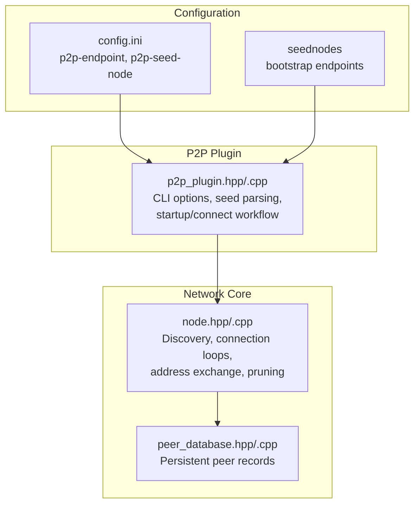
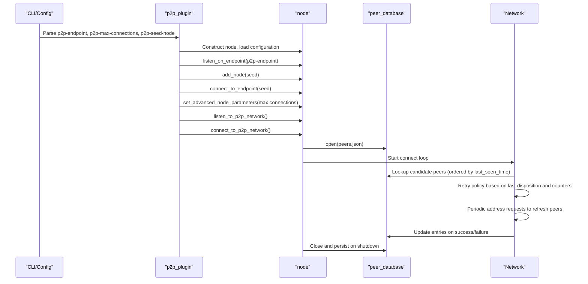
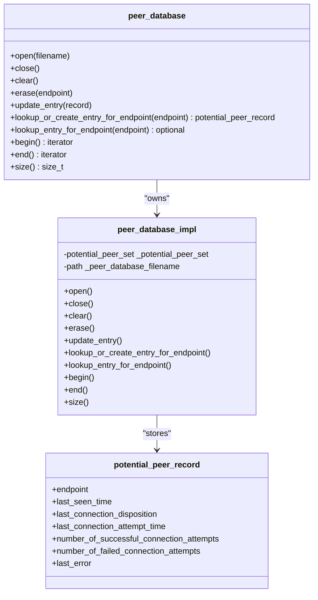
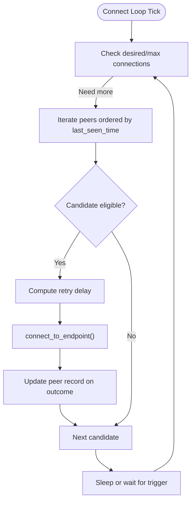
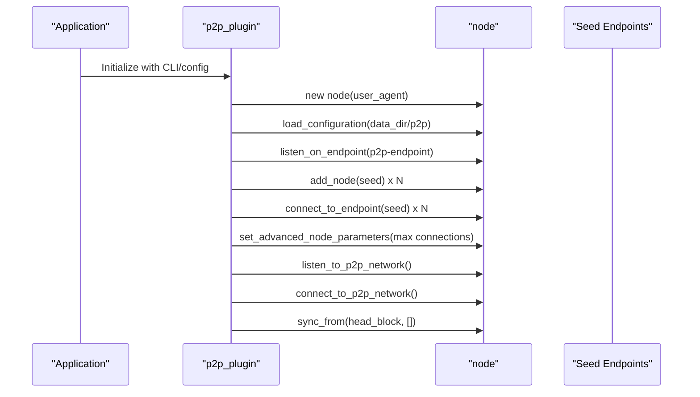
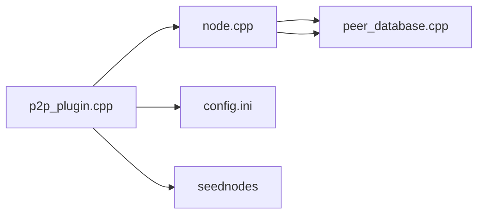

# Peer Database and Discovery

<cite>
**Referenced Files in This Document**
- [peer_database.hpp](file://libraries/network/include/graphene/network/peer_database.hpp)
- [peer_database.cpp](file://libraries/network/peer_database.cpp)
- [node.hpp](file://libraries/network/include/graphene/network/node.hpp)
- [node.cpp](file://libraries/network/node.cpp)
- [p2p_plugin.hpp](file://plugins/p2p/include/graphene/plugins/p2p/p2p_plugin.hpp)
- [p2p_plugin.cpp](file://plugins/p2p/p2p_plugin.cpp)
- [config.ini](file://share/vizd/config/config.ini)
- [seednodes](file://share/vizd/seednodes)
</cite>

## Table of Contents
1. [Introduction](#introduction)
2. [Project Structure](#project-structure)
3. [Core Components](#core-components)
4. [Architecture Overview](#architecture-overview)
5. [Detailed Component Analysis](#detailed-component-analysis)
6. [Dependency Analysis](#dependency-analysis)
7. [Performance Considerations](#performance-considerations)
8. [Troubleshooting Guide](#troubleshooting-guide)
9. [Conclusion](#conclusion)
10. [Appendices](#appendices)

## Introduction
This document explains the Peer Database and Discovery subsystem responsible for:
- Persistent storage of peer addresses and connection history
- Network topology maintenance and peer reputation tracking
- Peer discovery via seed nodes and address exchange
- Connection diversity and load balancing strategies
- Network partition recovery and pruning policies

It focuses on the peer_database implementation, the node’s discovery and connection orchestration, and the P2P plugin integration.

## Project Structure
The peer database and discovery logic spans three primary areas:
- Network core: peer_database and node infrastructure
- P2P plugin: CLI configuration, seed node handling, and lifecycle integration
- Configuration and seed files: runtime configuration and bootstrap peers

**Diagram sources**
- [peer_database.hpp](file://libraries/network/include/graphene/network/peer_database.hpp#L104-L134)
- [peer_database.cpp](file://libraries/network/peer_database.cpp#L41-L82)
- [node.hpp](file://libraries/network/include/graphene/network/node.hpp#L190-L304)
- [node.cpp](file://libraries/network/node.cpp#L952-L1047)
- [p2p_plugin.hpp](file://plugins/p2p/include/graphene/plugins/p2p/p2p_plugin.hpp#L18-L52)
- [p2p_plugin.cpp](file://plugins/p2p/p2p_plugin.cpp#L467-L566)
- [config.ini](file://share/vizd/config/config.ini#L1-L10)
- [seednodes](file://share/vizd/seednodes#L1-L6)

**Section sources**
- [peer_database.hpp](file://libraries/network/include/graphene/network/peer_database.hpp#L1-L141)
- [peer_database.cpp](file://libraries/network/peer_database.cpp#L1-L262)
- [node.hpp](file://libraries/network/include/graphene/network/node.hpp#L1-L355)
- [node.cpp](file://libraries/network/node.cpp#L952-L1047)
- [p2p_plugin.hpp](file://plugins/p2p/include/graphene/plugins/p2p/p2p_plugin.hpp#L1-L57)
- [p2p_plugin.cpp](file://plugins/p2p/p2p_plugin.cpp#L467-L566)
- [config.ini](file://share/vizd/config/config.ini#L1-L10)
- [seednodes](file://share/vizd/seednodes#L1-L6)

## Core Components
- Peer Database
  - Stores potential peer records with endpoint, timestamps, connection disposition, counters, and last error
  - Provides CRUD-like operations: open/close, clear, erase, update_entry, lookup_or_create_entry_for_endpoint, lookup_entry_for_endpoint, iterators
  - Maintains a multi-index container keyed by endpoint and ordered by last_seen_time
- Node Discovery and Maintenance
  - Connect loop selects peers based on retry timeouts and last disposition
  - Periodic address requests refresh peer lists
  - Inactivity watchdog disconnects idle peers
  - Prunes stale entries and maintains database size limits
- P2P Plugin Integration
  - Parses CLI options for p2p-endpoint, p2p-max-connections, p2p-seed-node
  - Seeds initial connections and starts node listeners

**Section sources**
- [peer_database.hpp](file://libraries/network/include/graphene/network/peer_database.hpp#L39-L134)
- [peer_database.cpp](file://libraries/network/peer_database.cpp#L41-L186)
- [node.cpp](file://libraries/network/node.cpp#L952-L1047)
- [node.cpp](file://libraries/network/node.cpp#L1623-L1654)
- [node.cpp](file://libraries/network/node.cpp#L1400-L1621)
- [p2p_plugin.cpp](file://plugins/p2p/p2p_plugin.cpp#L467-L566)

## Architecture Overview
The peer database underpins the node’s discovery and maintenance routines. The P2P plugin initializes the node, injects seed endpoints, and exposes configuration options.

**Diagram sources**
- [p2p_plugin.cpp](file://plugins/p2p/p2p_plugin.cpp#L467-L566)
- [node.cpp](file://libraries/network/node.cpp#L952-L1047)
- [node.cpp](file://libraries/network/node.cpp#L1623-L1654)
- [peer_database.cpp](file://libraries/network/peer_database.cpp#L100-L138)

## Detailed Component Analysis

### Peer Database: Data Model and Operations
- Data model
  - potential_peer_record fields: endpoint, last_seen_time, last_connection_disposition, last_connection_attempt_time, number_of_successful_connection_attempts, number_of_failed_connection_attempts, last_error
  - Indexes: hashed endpoint for O(1) lookup; ordered last_seen_time for traversal
- Operations
  - open(filename): loads JSON array of records; prunes to a maximum size
  - close(): persists records to JSON
  - update_entry(): insert or replace record by endpoint
  - lookup_or_create_entry_for_endpoint(): return existing or new record
  - lookup_entry_for_endpoint(): optional lookup
  - begin()/end(): iterator over last_seen_time index
  - size(): count of records

**Diagram sources**
- [peer_database.hpp](file://libraries/network/include/graphene/network/peer_database.hpp#L39-L134)
- [peer_database.cpp](file://libraries/network/peer_database.cpp#L41-L82)

**Section sources**
- [peer_database.hpp](file://libraries/network/include/graphene/network/peer_database.hpp#L39-L134)
- [peer_database.cpp](file://libraries/network/peer_database.cpp#L100-L186)

### Peer Discovery and Connection Management
- Connect loop
  - Iterates peers ordered by last_seen_time
  - Applies retry policy based on last disposition and failed attempt counts
  - Initiates connections when needed and updates records on outcomes
- Address exchange
  - Periodically sends address_request_message and processes address_message to refresh peer lists
  - Merges received addresses into the peer database
- Inactivity and pruning
  - Disconnects inactive peers and sends keep-alives
  - Prunes failed items cache periodically
  - Database size capped at startup

**Diagram sources**
- [node.cpp](file://libraries/network/node.cpp#L952-L1047)

**Section sources**
- [node.cpp](file://libraries/network/node.cpp#L952-L1047)
- [node.cpp](file://libraries/network/node.cpp#L1623-L1654)
- [node.cpp](file://libraries/network/node.cpp#L1400-L1621)

### P2P Plugin Initialization and Seed Configuration
- CLI options
  - p2p-endpoint: local listen endpoint
  - p2p-max-connections: maximum connections
  - p2p-seed-node: bootstrap peers (supports multiple)
- Startup workflow
  - Creates node, loads configuration directory
  - Listens on endpoint, adds seeds, connects immediately
  - Sets advanced parameters and starts network listeners
  - Syncs from current head block

**Diagram sources**
- [p2p_plugin.cpp](file://plugins/p2p/p2p_plugin.cpp#L467-L566)

**Section sources**
- [p2p_plugin.hpp](file://plugins/p2p/include/graphene/plugins/p2p/p2p_plugin.hpp#L467-L566)
- [p2p_plugin.cpp](file://plugins/p2p/p2p_plugin.cpp#L467-L566)
- [config.ini](file://share/vizd/config/config.ini#L1-L10)
- [seednodes](file://share/vizd/seednodes#L1-L6)

### Peer Address Validation and Reputation
- Validation
  - Rejects self-connections and duplicates
  - Validates chain_id and hard fork compatibility
  - Verifies hello signatures and user data
- Reputation
  - Tracks last_connection_disposition and attempt counters
  - Uses last_seen_time ordering to prioritize fresh peers
  - Records last_error on closure for diagnostics

**Section sources**
- [node.cpp](file://libraries/network/node.cpp#L2029-L2230)
- [node.cpp](file://libraries/network/node.cpp#L2251-L2280)
- [node.cpp](file://libraries/network/node.cpp#L3036-L3080)

### Network Topology Maintenance and Diversity
- Load balancing
  - Distributes item requests across peers based on idle status and pending requests
  - Limits per-peer request volume during normal operation
- Diversity
  - Periodic address requests from all active peers
  - Merge logic updates last_seen_time for freshness
  - Handshake and firewall detection influence inclusion decisions

**Section sources**
- [node.cpp](file://libraries/network/node.cpp#L1177-L1316)
- [node.cpp](file://libraries/network/node.cpp#L1844-L1860)
- [node.cpp](file://libraries/network/node.cpp#L2282-L2350)

### Peer Selection Strategies and Recovery
- Selection
  - Prefer peers with recent activity (last_seen_time)
  - Respect retry timeouts and disposition to avoid stuck peers
- Recovery
  - Re-trigger connect loop on new address information
  - Periodic keep-alives and inactivity watchdogs
  - Hard fork and chain_id checks to drop incompatible peers

**Section sources**
- [node.cpp](file://libraries/network/node.cpp#L952-L1047)
- [node.cpp](file://libraries/network/node.cpp#L1623-L1654)
- [node.cpp](file://libraries/network/node.cpp#L2029-L2230)

## Dependency Analysis
- peer_database depends on Boost.MultiIndex for composite indexing
- node integrates peer_database for discovery and persistence
- p2p_plugin orchestrates node lifecycle and seed injection
- Configuration and seed files feed the plugin and node

**Diagram sources**
- [p2p_plugin.cpp](file://plugins/p2p/p2p_plugin.cpp#L467-L566)
- [node.cpp](file://libraries/network/node.cpp#L952-L1047)
- [peer_database.cpp](file://libraries/network/peer_database.cpp#L41-L82)
- [config.ini](file://share/vizd/config/config.ini#L1-L10)
- [seednodes](file://share/vizd/seednodes#L1-L6)

**Section sources**
- [p2p_plugin.cpp](file://plugins/p2p/p2p_plugin.cpp#L467-L566)
- [node.cpp](file://libraries/network/node.cpp#L952-L1047)
- [peer_database.cpp](file://libraries/network/peer_database.cpp#L41-L82)

## Performance Considerations
- Database sizing
  - Startup prune to a fixed maximum ensures bounded memory and IO
- Indexing
  - Hashed endpoint index for fast updates/lookups
  - Ordered last_seen_time index for fair rotation and freshness
- Connection scheduling
  - Retry delays scale with failed attempts to reduce churn
- Request distribution
  - Per-peer caps and idle checks prevent hot-spotting and improve throughput

[No sources needed since this section provides general guidance]

## Troubleshooting Guide
- Peer database fails to load or corrupt
  - The loader logs and continues with a clean database; inspect logs for errors
- Frequent rejections or timeouts
  - Review last_connection_disposition and counters; adjust retry timeouts
- Stale peers overwhelming discovery
  - Verify last_seen_time updates on address exchange and pruning
- Inactivity disconnects
  - Confirm keep-alive messages and inactivity thresholds

**Section sources**
- [peer_database.cpp](file://libraries/network/peer_database.cpp#L114-L118)
- [node.cpp](file://libraries/network/node.cpp#L1623-L1654)
- [node.cpp](file://libraries/network/node.cpp#L1400-L1621)

## Conclusion
The peer database and discovery system combines a compact, indexed record store with robust connection orchestration. Together with the P2P plugin’s seed configuration, it provides resilient network bootstrapping, continuous topology refresh, and operational safeguards against stale or hostile peers.

[No sources needed since this section summarizes without analyzing specific files]

## Appendices

### Database Schema Notes
- File: peers.json (loaded at node startup; saved on shutdown)
- Fields: endpoint, last_seen_time, last_connection_disposition, last_connection_attempt_time, number_of_successful_connection_attempts, number_of_failed_connection_attempts, last_error
- Indexes: endpoint (hashed), last_seen_time (ordered)

**Section sources**
- [peer_database.hpp](file://libraries/network/include/graphene/network/peer_database.hpp#L39-L134)
- [peer_database.cpp](file://libraries/network/peer_database.cpp#L100-L138)

### Example Workflows

- Peer database initialization
  - Open: load peers.json; prune to maximum size
  - Close: persist records to peers.json

- Peer lookup operations
  - lookup_or_create_entry_for_endpoint(endpoint)
  - lookup_entry_for_endpoint(endpoint)
  - Iterate over begin()/end() ordered by last_seen_time

- Network discovery workflow
  - Periodic address_request_message
  - Merge received addresses into peer database
  - Trigger connect loop on new information

**Section sources**
- [peer_database.cpp](file://libraries/network/peer_database.cpp#L100-L138)
- [node.cpp](file://libraries/network/node.cpp#L1623-L1654)
- [node.cpp](file://libraries/network/node.cpp#L2307-L2350)

### Backup and Migration Guidance
- Backup
  - Copy peers.json from the node’s configuration directory before upgrades or restores
- Migration
  - Ensure schema compatibility; if fields change, maintain backward-compatible parsing and prune as needed
- Maintenance
  - Monitor prune behavior at startup and manual cleanup via clear() when debugging

**Section sources**
- [peer_database.cpp](file://libraries/network/peer_database.cpp#L100-L138)
- [node.hpp](file://libraries/network/include/graphene/network/node.hpp#L284-L288)