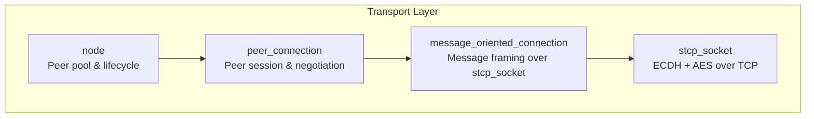
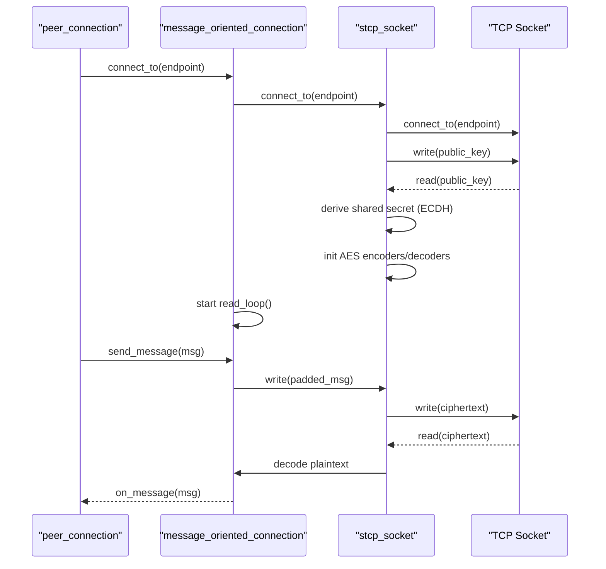
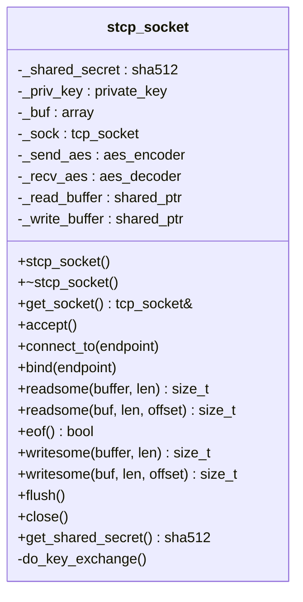
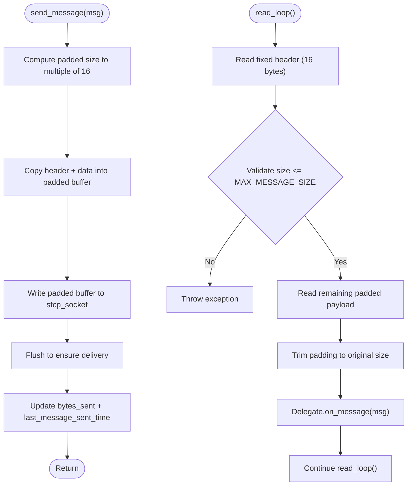
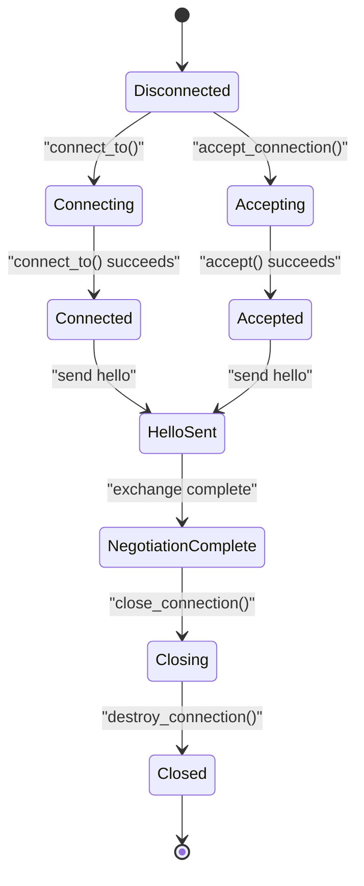
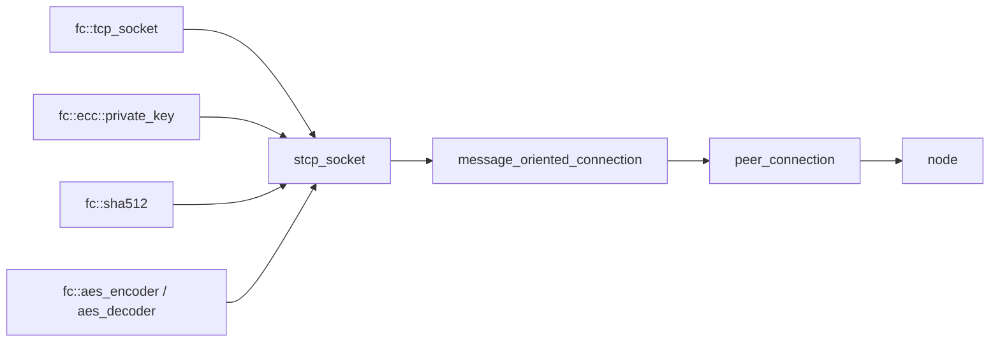

# Transport Layer and Sockets

<cite>
**Referenced Files in This Document**
- [stcp_socket.hpp](file://libraries/network/include/graphene/network/stcp_socket.hpp)
- [stcp_socket.cpp](file://libraries/network/stcp_socket.cpp)
- [message_oriented_connection.hpp](file://libraries/network/include/graphene/network/message_oriented_connection.hpp)
- [message_oriented_connection.cpp](file://libraries/network/message_oriented_connection.cpp)
- [peer_connection.hpp](file://libraries/network/include/graphene/network/peer_connection.hpp)
- [peer_connection.cpp](file://libraries/network/peer_connection.cpp)
- [node.cpp](file://libraries/network/node.cpp)
</cite>

## Table of Contents
1. [Introduction](#introduction)
2. [Project Structure](#project-structure)
3. [Core Components](#core-components)
4. [Architecture Overview](#architecture-overview)
5. [Detailed Component Analysis](#detailed-component-analysis)
6. [Dependency Analysis](#dependency-analysis)
7. [Performance Considerations](#performance-considerations)
8. [Troubleshooting Guide](#troubleshooting-guide)
9. [Conclusion](#conclusion)
10. [Appendices](#appendices)

## Introduction
This document explains the Transport Layer and Sockets implementation for secure TCP communication in the project. It focuses on the stcp_socket class that provides encrypted messaging over TCP using Elliptic Curve Diffie-Hellman (ECDH) key exchange and AES encryption. It covers secure connection establishment, shared secret derivation, buffered I/O, lifecycle management, and integration with higher-level components such as message-oriented connections and peer connections. It also documents configuration options, buffer management, performance characteristics, error handling, recovery, and operational guidance for debugging and tuning.

## Project Structure
The transport stack is organized into layered components:
- stcp_socket: Secure socket wrapper over TCP with ECDH key exchange and AES encryption.
- message_oriented_connection: Stream-based message framing over stcp_socket.
- peer_connection: Peer session manager that orchestrates handshake, negotiation, and message queuing.
- node: Top-level orchestrator managing peers, connection pools, and lifecycle.

**Diagram sources**
- [stcp_socket.hpp](file://libraries/network/include/graphene/network/stcp_socket.hpp#L37-L93)
- [message_oriented_connection.hpp](file://libraries/network/include/graphene/network/message_oriented_connection.hpp#L45-L79)
- [peer_connection.hpp](file://libraries/network/include/graphene/network/peer_connection.hpp#L79-L351)
- [node.cpp](file://libraries/network/node.cpp#L424-L837)

**Section sources**
- [stcp_socket.hpp](file://libraries/network/include/graphene/network/stcp_socket.hpp#L37-L93)
- [message_oriented_connection.hpp](file://libraries/network/include/graphene/network/message_oriented_connection.hpp#L45-L79)
- [peer_connection.hpp](file://libraries/network/include/graphene/network/peer_connection.hpp#L79-L351)
- [node.cpp](file://libraries/network/node.cpp#L424-L837)

## Core Components
- stcp_socket: Provides secure I/O over TCP with ECDH key exchange and AES encryption. It exposes read/write methods aligned to AES block sizes, maintains shared secrets, and integrates with fc::tcp_socket.
- message_oriented_connection: Wraps stcp_socket to deliver a stream of framed messages, handling padding, buffering, and read/write loops.
- peer_connection: Manages peer sessions, negotiates connection states, queues outgoing messages, and coordinates with message_oriented_connection.
- node: Maintains a pool of active peers, controls connection lifecycle, and enforces policies such as desired/max connections and timeouts.

Key responsibilities:
- stcp_socket: Key exchange, shared secret derivation, AES encoder/decoder initialization, buffered read/write with alignment to AES blocks, and socket lifecycle.
- message_oriented_connection: Message framing, padding to 16-byte boundaries, read loop, send loop, and connection metrics.
- peer_connection: Session state machine, message queuing, rate limiting, and graceful close.
- node: Peer discovery, connection orchestration, and termination policies.

**Section sources**
- [stcp_socket.hpp](file://libraries/network/include/graphene/network/stcp_socket.hpp#L37-L93)
- [stcp_socket.cpp](file://libraries/network/stcp_socket.cpp#L49-L192)
- [message_oriented_connection.hpp](file://libraries/network/include/graphene/network/message_oriented_connection.hpp#L45-L79)
- [message_oriented_connection.cpp](file://libraries/network/message_oriented_connection.cpp#L148-L235)
- [peer_connection.hpp](file://libraries/network/include/graphene/network/peer_connection.hpp#L79-L351)
- [peer_connection.cpp](file://libraries/network/peer_connection.cpp#L208-L242)
- [node.cpp](file://libraries/network/node.cpp#L424-L837)

## Architecture Overview
The secure transport pipeline:
- TCP socket is established.
- ECDH key exchange is performed to derive a shared secret.
- AES encoders/decoders are initialized from the shared secret.
- Messages are framed and padded to 16-byte boundaries for AES streaming mode.
- Read/write loops handle encrypted I/O and maintain throughput.

**Diagram sources**
- [stcp_socket.cpp](file://libraries/network/stcp_socket.cpp#L49-L72)
- [message_oriented_connection.cpp](file://libraries/network/message_oriented_connection.cpp#L135-L145)
- [message_oriented_connection.cpp](file://libraries/network/message_oriented_connection.cpp#L148-L235)
- [peer_connection.cpp](file://libraries/network/peer_connection.cpp#L208-L242)

## Detailed Component Analysis

### stcp_socket: Secure TCP Wrapper
Responsibilities:
- Establish TCP connection and perform ECDH key exchange.
- Derive shared secret and initialize AES encoder/decoder for bidirectional encryption.
- Provide read/write methods aligned to AES block size (16 bytes) with internal buffering.
- Expose shared secret for higher-level protocols and integrate with fc::tcp_socket.

Implementation highlights:
- Key exchange: Generates ephemeral EC private key, serializes public key, exchanges with peer, and computes shared secret.
- Encryption: Initializes AES encoders/decoders using derived shared secret for confidentiality.
- Read path: Ensures reads are aligned to 16-byte boundaries, buffers leftover data, and decrypts into caller’s buffer.
- Write path: Pads plaintext to 16-byte boundaries, encrypts, and writes ciphertext.
- Lifecycle: Connect/bind/accept/close with proper exception handling.

**Diagram sources**
- [stcp_socket.hpp](file://libraries/network/include/graphene/network/stcp_socket.hpp#L37-L93)

**Section sources**
- [stcp_socket.hpp](file://libraries/network/include/graphene/network/stcp_socket.hpp#L37-L93)
- [stcp_socket.cpp](file://libraries/network/stcp_socket.cpp#L49-L192)

### message_oriented_connection: Message Framing Over stcp_socket
Responsibilities:
- Frame messages with headers and pad to 16-byte boundaries.
- Manage read loop to receive complete messages and dispatch to delegate.
- Track connection metrics (bytes sent/received, timestamps).
- Provide access to underlying stcp_socket and shared secret.

Key behaviors:
- Padding: Rounds payload size to nearest 16-byte boundary to align with AES block size.
- Read loop: Reads fixed header, validates size, reads remainder, trims padding, and invokes delegate.
- Send loop: Copies message header and data into padded buffer, writes to stcp_socket, flushes.

**Diagram sources**
- [message_oriented_connection.cpp](file://libraries/network/message_oriented_connection.cpp#L237-L283)
- [message_oriented_connection.cpp](file://libraries/network/message_oriented_connection.cpp#L148-L235)

**Section sources**
- [message_oriented_connection.hpp](file://libraries/network/include/graphene/network/message_oriented_connection.hpp#L45-L79)
- [message_oriented_connection.cpp](file://libraries/network/message_oriented_connection.cpp#L148-L235)
- [message_oriented_connection.cpp](file://libraries/network/message_oriented_connection.cpp#L237-L283)

### peer_connection: Peer Session Management
Responsibilities:
- Orchestrate connection lifecycle: bind/connect, accept, negotiate, and close.
- Queue and send messages via message_oriented_connection.
- Track connection states, metrics, and peer identity.
- Integrate with node for peer pool management.

Notable behaviors:
- Connection states: Enumerated states for “our” and “their” sides, plus negotiation statuses.
- Outgoing connections: Initiates bind/connect, transitions negotiation status, and logs successful connection.
- Incoming connections: Accepts via message_oriented_connection, performs key exchange, and transitions states.
- Graceful close: Sets negotiation status, closes underlying connection, and schedules deletion.

**Diagram sources**
- [peer_connection.hpp](file://libraries/network/include/graphene/network/peer_connection.hpp#L82-L106)
- [peer_connection.cpp](file://libraries/network/peer_connection.cpp#L208-L242)
- [peer_connection.cpp](file://libraries/network/peer_connection.cpp#L356-L369)

**Section sources**
- [peer_connection.hpp](file://libraries/network/include/graphene/network/peer_connection.hpp#L79-L351)
- [peer_connection.cpp](file://libraries/network/peer_connection.cpp#L208-L242)
- [peer_connection.cpp](file://libraries/network/peer_connection.cpp#L356-L369)

### node: Peer Pool and Lifecycle Management
Responsibilities:
- Maintain sets of handshaking, active, closing, and terminating connections.
- Enforce connection limits, retry policies, and inactivity timeouts.
- Trigger connect loops, advertise inventory, and manage bandwidth.

Operational highlights:
- Connection limits: Desired and maximum connection counts influence connect loop behavior.
- Inactivity handling: Disconnects peers that exceed configured inactivity thresholds.
- Bandwidth monitoring: Tracks average read/write speeds and updates periodically.

**Section sources**
- [node.cpp](file://libraries/network/node.cpp#L424-L837)
- [node.cpp](file://libraries/network/node.cpp#L1400-L1599)

## Dependency Analysis
The transport stack composes tightly around fc::tcp_socket and fc crypto primitives:
- stcp_socket depends on fc::tcp_socket, fc::ecc::private_key, fc::sha512, fc::aes_encoder, fc::aes_decoder.
- message_oriented_connection depends on stcp_socket and message framing logic.
- peer_connection depends on message_oriented_connection and node for lifecycle.
- node orchestrates peer_connection instances and enforces policies.

**Diagram sources**
- [stcp_socket.hpp](file://libraries/network/include/graphene/network/stcp_socket.hpp#L26-L28)
- [stcp_socket.cpp](file://libraries/network/stcp_socket.cpp#L49-L66)
- [message_oriented_connection.hpp](file://libraries/network/include/graphene/network/message_oriented_connection.hpp#L26-L27)
- [peer_connection.hpp](file://libraries/network/include/graphene/network/peer_connection.hpp#L28-L29)
- [node.cpp](file://libraries/network/node.cpp#L527-L528)

**Section sources**
- [stcp_socket.hpp](file://libraries/network/include/graphene/network/stcp_socket.hpp#L26-L28)
- [stcp_socket.cpp](file://libraries/network/stcp_socket.cpp#L49-L66)
- [message_oriented_connection.hpp](file://libraries/network/include/graphene/network/message_oriented_connection.hpp#L26-L27)
- [peer_connection.hpp](file://libraries/network/include/graphene/network/peer_connection.hpp#L28-L29)
- [node.cpp](file://libraries/network/node.cpp#L527-L528)

## Performance Considerations
- Buffering: Internal buffers of fixed size (e.g., 4096 bytes) are reused for read/write to reduce allocations.
- Alignment: Read/write sizes are constrained to 16-byte multiples to satisfy AES block cipher requirements.
- Padding: Messages are padded to 16-byte boundaries; ensure message sizes are planned accordingly to minimize overhead.
- Throughput: The read loop reads fixed header size first, then remainder in chunks; batching messages can improve efficiency.
- Concurrency: Assertions guard single-threaded usage of read/write buffers; concurrent calls are not supported without modifications.

Recommendations:
- Tune message sizes to align with 16-byte boundaries to avoid extra padding overhead.
- Monitor bytes_sent/bytes_received metrics exposed by message_oriented_connection to track throughput.
- Adjust node-level connection limits and retry timeouts to balance connectivity and resource usage.

**Section sources**
- [stcp_socket.cpp](file://libraries/network/stcp_socket.cpp#L107-L121)
- [stcp_socket.cpp](file://libraries/network/stcp_socket.cpp#L156-L173)
- [message_oriented_connection.cpp](file://libraries/network/message_oriented_connection.cpp#L148-L235)
- [message_oriented_connection.cpp](file://libraries/network/message_oriented_connection.cpp#L237-L283)
- [node.cpp](file://libraries/network/node.cpp#L869-L902)

## Troubleshooting Guide
Common issues and remedies:
- Handshake failures: Verify ECDH key exchange completes; inspect exceptions thrown during connect/accept.
- Read/write errors: Ensure readsome/writesome are called with 16-byte aligned lengths; check for EOF conditions.
- Connection drops: Review inactivity timeout logic and peer closure reasons; confirm graceful close sequences.
- Resource leaks: Confirm destroy_connection cancels read loops and closes sockets; verify peer deletion tasks complete.

Operational tips:
- Enable logging around read_loop and send_message to capture exceptions and disconnections.
- Inspect shared secret availability via message_oriented_connection::get_shared_secret for debugging.
- Use node-level statistics and bandwidth monitors to diagnose performance regressions.

**Section sources**
- [message_oriented_connection.cpp](file://libraries/network/message_oriented_connection.cpp#L148-L235)
- [message_oriented_connection.cpp](file://libraries/network/message_oriented_connection.cpp#L285-L313)
- [peer_connection.cpp](file://libraries/network/peer_connection.cpp#L106-L157)
- [node.cpp](file://libraries/network/node.cpp#L1400-L1599)

## Conclusion
The transport layer integrates a robust secure socket abstraction with message-oriented framing to deliver encrypted, reliable peer-to-peer communication. stcp_socket encapsulates ECDH key exchange and AES encryption, while message_oriented_connection ensures proper message framing and buffered I/O. Together with peer_connection and node, the system provides lifecycle management, connection pooling, and operational resilience. Following the guidance herein will help you deploy, tune, and troubleshoot secure TCP communications effectively.

## Appendices

### Security Features and Best Practices
- Encryption: AES-based symmetric encryption initialized from ECDH-derived shared secret.
- Authentication: Public keys exchanged during handshake; shared secret confirms mutual participation.
- Integrity: AES streaming mode with padding; ensure message size validation and bounds checking.
- Best practices:
  - Keep shared secrets ephemeral and derive per-connection.
  - Validate message sizes against maximum allowed limits.
  - Use node-level policies to enforce connection limits and timeouts.
  - Log and monitor connection states and metrics for anomaly detection.

**Section sources**
- [stcp_socket.cpp](file://libraries/network/stcp_socket.cpp#L49-L66)
- [message_oriented_connection.cpp](file://libraries/network/message_oriented_connection.cpp#L168-L170)
- [node.cpp](file://libraries/network/node.cpp#L869-L902)