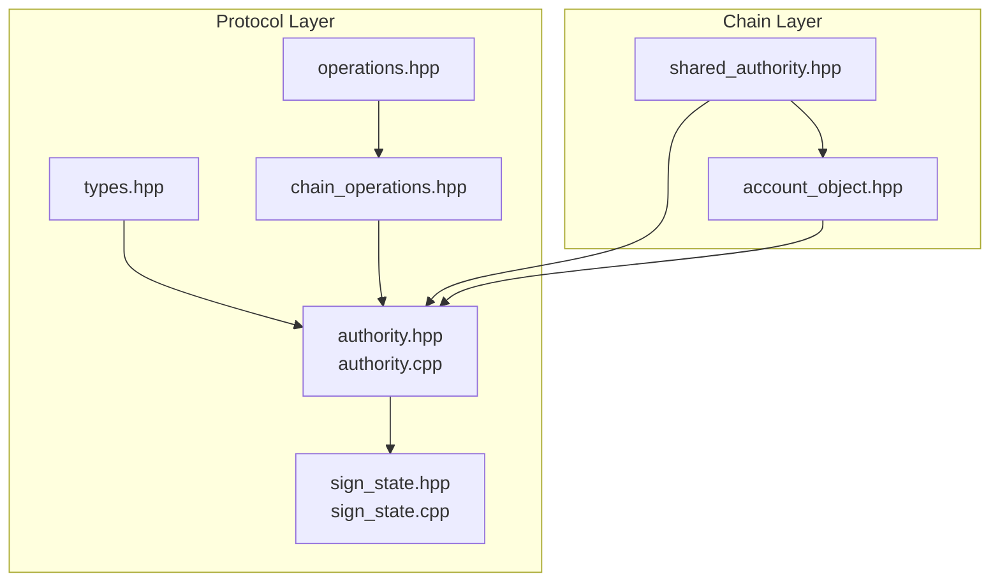
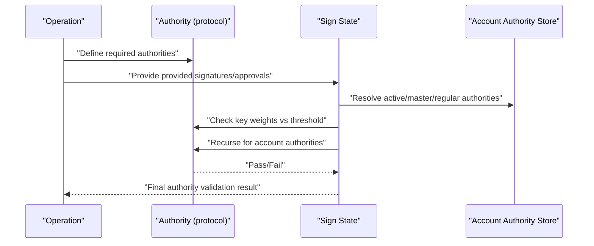
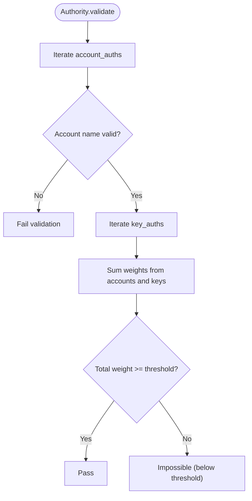
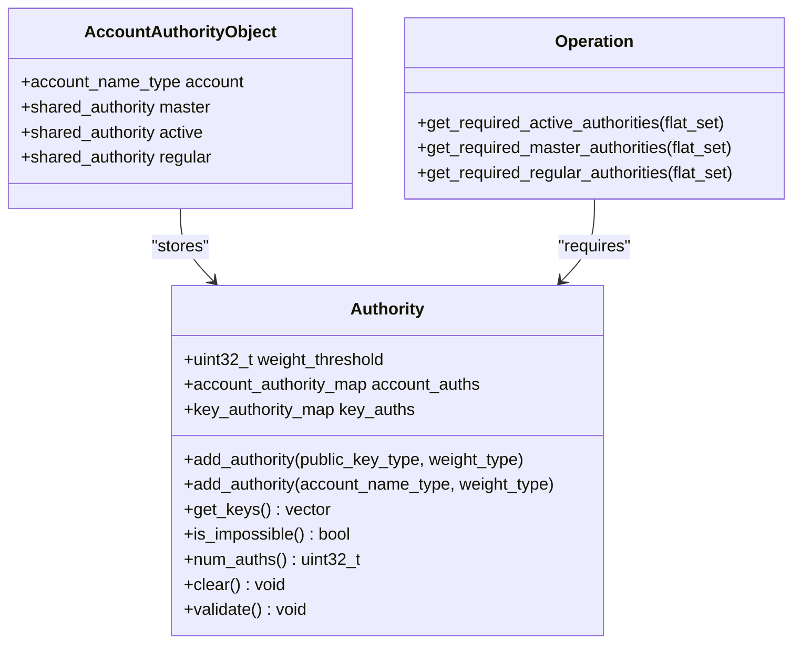
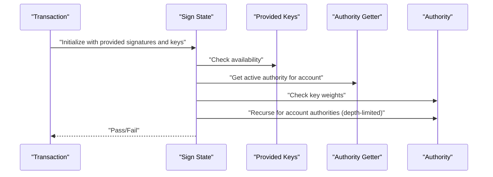
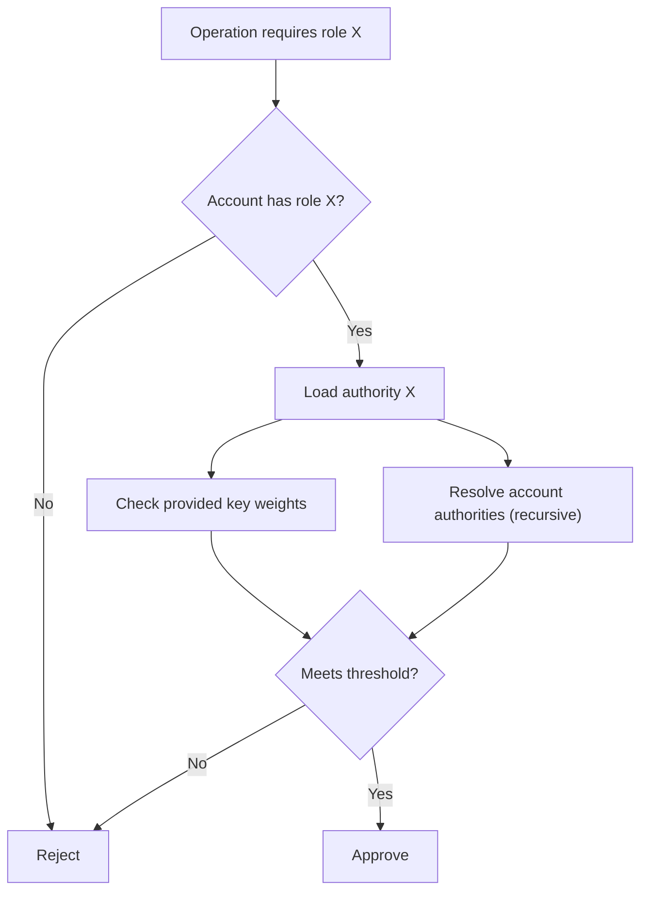
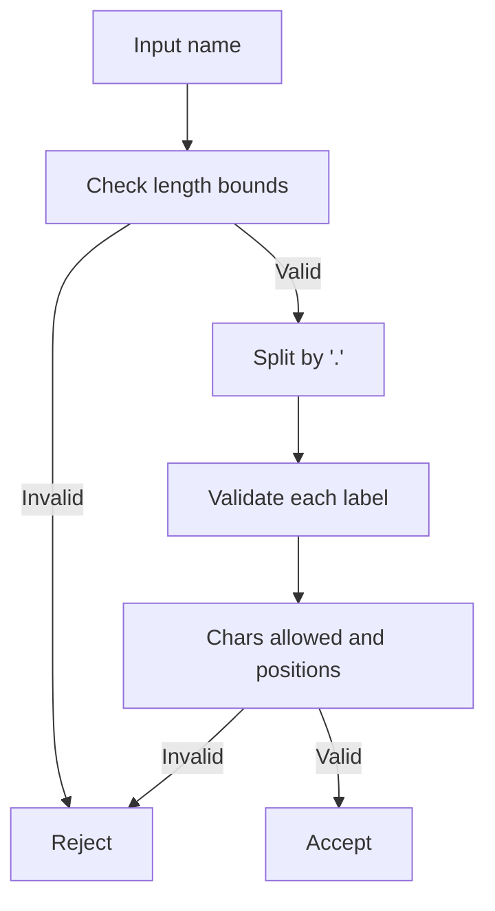
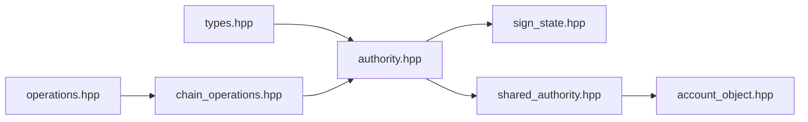

# Authority Management

<cite>
**Referenced Files in This Document**
- [authority.hpp](file://libraries/protocol/include/graphene/protocol/authority.hpp)
- [authority.cpp](file://libraries/protocol/authority.cpp)
- [sign_state.hpp](file://libraries/protocol/include/graphene/protocol/sign_state.hpp)
- [sign_state.cpp](file://libraries/protocol/sign_state.cpp)
- [types.hpp](file://libraries/protocol/include/graphene/protocol/types.hpp)
- [shared_authority.hpp](file://libraries/chain/include/graphene/chain/shared_authority.hpp)
- [account_object.hpp](file://libraries/chain/include/graphene/chain/account_object.hpp)
- [chain_operations.hpp](file://libraries/protocol/include/graphene/protocol/chain_operations.hpp)
- [operations.hpp](file://libraries/protocol/include/graphene/protocol/operations.hpp)
</cite>

## Table of Contents
1. [Introduction](#introduction)
2. [Project Structure](#project-structure)
3. [Core Components](#core-components)
4. [Architecture Overview](#architecture-overview)
5. [Detailed Component Analysis](#detailed-component-analysis)
6. [Dependency Analysis](#dependency-analysis)
7. [Performance Considerations](#performance-considerations)
8. [Troubleshooting Guide](#troubleshooting-guide)
9. [Conclusion](#conclusion)
10. [Appendices](#appendices)

## Introduction
This document explains the Authority Management subsystem responsible for permission systems and access control in the blockchain. It covers:
- Authority structures and thresholds
- Weight calculations and validation
- Multi-signature authority requirements
- Permission hierarchies (master, active, regular)
- Signature validation and authority checking during transaction processing via sign_state
- Authority inheritance patterns and delegation
- Relationship between authorities and operations requiring specific permissions

## Project Structure
The authority system spans protocol-level definitions and chain-level persistence and usage:
- Protocol-level authority definitions and helpers
- Transaction signing and authority checking
- Shared-memory compatible authority representation
- Account authority storage and hierarchical roles
- Operation definitions specifying which authorities are required

**Diagram sources**
- [authority.hpp](file://libraries/protocol/include/graphene/protocol/authority.hpp#L1-L115)
- [authority.cpp](file://libraries/protocol/authority.cpp#L1-L228)
- [sign_state.hpp](file://libraries/protocol/include/graphene/protocol/sign_state.hpp#L1-L45)
- [sign_state.cpp](file://libraries/protocol/sign_state.cpp#L1-L107)
- [types.hpp](file://libraries/protocol/include/graphene/protocol/types.hpp#L1-L235)
- [shared_authority.hpp](file://libraries/chain/include/graphene/chain/shared_authority.hpp#L1-L113)
- [account_object.hpp](file://libraries/chain/include/graphene/chain/account_object.hpp#L1-L565)
- [operations.hpp](file://libraries/protocol/include/graphene/protocol/operations.hpp#L1-L131)
- [chain_operations.hpp](file://libraries/protocol/include/graphene/protocol/chain_operations.hpp#L1-L200)

**Section sources**
- [authority.hpp](file://libraries/protocol/include/graphene/protocol/authority.hpp#L1-L115)
- [authority.cpp](file://libraries/protocol/authority.cpp#L1-L228)
- [sign_state.hpp](file://libraries/protocol/include/graphene/protocol/sign_state.hpp#L1-L45)
- [sign_state.cpp](file://libraries/protocol/sign_state.cpp#L1-L107)
- [types.hpp](file://libraries/protocol/include/graphene/protocol/types.hpp#L1-L235)
- [shared_authority.hpp](file://libraries/chain/include/graphene/chain/shared_authority.hpp#L1-L113)
- [account_object.hpp](file://libraries/chain/include/graphene/chain/account_object.hpp#L1-L565)
- [operations.hpp](file://libraries/protocol/include/graphene/protocol/operations.hpp#L1-L131)
- [chain_operations.hpp](file://libraries/protocol/include/graphene/protocol/chain_operations.hpp#L1-L200)

## Core Components
- Authority: A permission container combining weighted account and key authorities with a numeric threshold. Provides helpers to add authorities, compute weights, validate, and detect impossibilities.
- Sign State: Validates signatures and checks authority requirements against provided keys and approvals, recursively resolving nested authorities up to a configured depth.
- Types: Defines public key, account name, weight, and related types used by authorities.
- Shared Authority: A shared-memory-compatible variant of authority for persistent storage.
- Account Authority Object: Stores hierarchical authorities (master, active, regular) per account.
- Operations: Define which authorities are required for each operation (active/master/regular).

Key responsibilities:
- Build and validate authority structures
- Enforce threshold-based multi-signature checks
- Resolve nested authorities via delegation
- Integrate with transaction signing and evaluation

**Section sources**
- [authority.hpp](file://libraries/protocol/include/graphene/protocol/authority.hpp#L9-L57)
- [authority.cpp](file://libraries/protocol/authority.cpp#L7-L48)
- [sign_state.hpp](file://libraries/protocol/include/graphene/protocol/sign_state.hpp#L10-L42)
- [sign_state.cpp](file://libraries/protocol/sign_state.cpp#L6-L59)
- [types.hpp](file://libraries/protocol/include/graphene/protocol/types.hpp#L75-L147)
- [shared_authority.hpp](file://libraries/chain/include/graphene/chain/shared_authority.hpp#L20-L99)
- [account_object.hpp](file://libraries/chain/include/graphene/chain/account_object.hpp#L145-L165)
- [chain_operations.hpp](file://libraries/protocol/include/graphene/protocol/chain_operations.hpp#L11-L62)

## Architecture Overview
Authority management integrates at three layers:
- Protocol-level definitions and helpers
- Transaction signing/validation pipeline
- Chain-level persistence and retrieval

**Diagram sources**
- [chain_operations.hpp](file://libraries/protocol/include/graphene/protocol/chain_operations.hpp#L11-L62)
- [authority.hpp](file://libraries/protocol/include/graphene/protocol/authority.hpp#L9-L57)
- [sign_state.hpp](file://libraries/protocol/include/graphene/protocol/sign_state.hpp#L10-L42)
- [sign_state.cpp](file://libraries/protocol/sign_state.cpp#L19-L59)
- [account_object.hpp](file://libraries/chain/include/graphene/chain/account_object.hpp#L145-L165)

## Detailed Component Analysis

### Authority Structure and Threshold Validation
The authority structure holds:
- A numeric threshold
- Two maps: account authorities (name -> weight) and key authorities (public key -> weight)

Core behaviors:
- Add authorities for accounts and keys
- Compute total weight from included keys and accounts
- Detect impossible authorities (total weight below threshold)
- Validate account names
- Equality comparison

Weight calculation and threshold validation:
- Sum weights from included keys and accounts
- Compare sum against threshold to decide pass/fail
- Early exit when threshold is met

**Diagram sources**
- [authority.cpp](file://libraries/protocol/authority.cpp#L44-L48)
- [authority.cpp](file://libraries/protocol/authority.cpp#L24-L33)

**Section sources**
- [authority.hpp](file://libraries/protocol/include/graphene/protocol/authority.hpp#L9-L57)
- [authority.cpp](file://libraries/protocol/authority.cpp#L7-L48)

### Multi-Signature Authority Requirements and Hierarchies
Hierarchical authorities per account:
- Master: typically backup control, can set master or active
- Active: monetary operations, can set active or regular
- Regular: voting and regular actions

Operations specify which authorities are required:
- Some operations require active/master/regular
- Others require regular or none depending on payload

**Diagram sources**
- [authority.hpp](file://libraries/protocol/include/graphene/protocol/authority.hpp#L9-L57)
- [account_object.hpp](file://libraries/chain/include/graphene/chain/account_object.hpp#L145-L165)
- [chain_operations.hpp](file://libraries/protocol/include/graphene/protocol/chain_operations.hpp#L11-L62)

**Section sources**
- [shared_authority.hpp](file://libraries/chain/include/graphene/chain/shared_authority.hpp#L20-L99)
- [account_object.hpp](file://libraries/chain/include/graphene/chain/account_object.hpp#L145-L165)
- [chain_operations.hpp](file://libraries/protocol/include/graphene/protocol/chain_operations.hpp#L11-L62)

### Signature Validation and Authority Checking via Sign State
Sign state orchestrates:
- Determining whether a key has been signed or can be produced
- Resolving account authorities via callbacks
- Recursively validating nested authorities up to a maximum recursion depth
- Tracking used and unused signatures/approvals

Workflow:
- For each key authority, mark as signed if present in provided signatures or available keys
- For each account authority, resolve active authority and recurse if depth allows
- Accumulate weights and compare to threshold

**Diagram sources**
- [sign_state.hpp](file://libraries/protocol/include/graphene/protocol/sign_state.hpp#L10-L42)
- [sign_state.cpp](file://libraries/protocol/sign_state.cpp#L6-L59)

**Section sources**
- [sign_state.hpp](file://libraries/protocol/include/graphene/protocol/sign_state.hpp#L10-L42)
- [sign_state.cpp](file://libraries/protocol/sign_state.cpp#L6-L59)

### Authority Inheritance Patterns and Delegation
- Accounts maintain separate authorities for master, active, and regular roles
- Operations may require one or more of these roles
- Nested authority resolution occurs when an authority includes account names; sign_state resolves those accounts’ active authorities recursively up to a configured depth
- Shared authority enables persistent storage in shared memory

**Diagram sources**
- [chain_operations.hpp](file://libraries/protocol/include/graphene/protocol/chain_operations.hpp#L11-L62)
- [account_object.hpp](file://libraries/chain/include/graphene/chain/account_object.hpp#L145-L165)
- [sign_state.cpp](file://libraries/protocol/sign_state.cpp#L28-L59)

**Section sources**
- [shared_authority.hpp](file://libraries/chain/include/graphene/chain/shared_authority.hpp#L20-L99)
- [account_object.hpp](file://libraries/chain/include/graphene/chain/account_object.hpp#L145-L165)
- [sign_state.cpp](file://libraries/protocol/sign_state.cpp#L28-L59)

### Custom Authority Types and Name Validation
- Public key and account name types are defined with strict validation rules
- Account name validation enforces length, character sets, and domain-like naming rules
- Domain name validation supports hierarchical naming patterns

**Diagram sources**
- [authority.cpp](file://libraries/protocol/authority.cpp#L66-L218)
- [types.hpp](file://libraries/protocol/include/graphene/protocol/types.hpp#L75-L147)

**Section sources**
- [types.hpp](file://libraries/protocol/include/graphene/protocol/types.hpp#L75-L147)
- [authority.cpp](file://libraries/protocol/authority.cpp#L50-L218)

### Examples of Authority Configuration and Permission Scenarios
- Creating an account with master/active/regular authorities
- Updating an account’s authorities
- Performing a transfer requiring active/master authority depending on asset type
- Voting and content operations requiring regular authority

These examples demonstrate:
- How authorities are attached to operations
- How thresholds and weights influence pass/fail
- How recursive resolution works when authorities include account names

**Section sources**
- [chain_operations.hpp](file://libraries/protocol/include/graphene/protocol/chain_operations.hpp#L11-L62)
- [operations.hpp](file://libraries/protocol/include/graphene/protocol/operations.hpp#L13-L102)

## Dependency Analysis
Authority management depends on:
- Types for cryptographic keys, account names, and weights
- Shared authority for persistent storage
- Account authority objects for role storage
- Operations for declaring required authorities

**Diagram sources**
- [types.hpp](file://libraries/protocol/include/graphene/protocol/types.hpp#L75-L147)
- [authority.hpp](file://libraries/protocol/include/graphene/protocol/authority.hpp#L1-L115)
- [sign_state.hpp](file://libraries/protocol/include/graphene/protocol/sign_state.hpp#L1-L45)
- [shared_authority.hpp](file://libraries/chain/include/graphene/chain/shared_authority.hpp#L1-L113)
- [account_object.hpp](file://libraries/chain/include/graphene/chain/account_object.hpp#L1-L565)
- [operations.hpp](file://libraries/protocol/include/graphene/protocol/operations.hpp#L1-L131)
- [chain_operations.hpp](file://libraries/protocol/include/graphene/protocol/chain_operations.hpp#L1-L200)

**Section sources**
- [types.hpp](file://libraries/protocol/include/graphene/protocol/types.hpp#L75-L147)
- [authority.hpp](file://libraries/protocol/include/graphene/protocol/authority.hpp#L1-L115)
- [sign_state.hpp](file://libraries/protocol/include/graphene/protocol/sign_state.hpp#L1-L45)
- [shared_authority.hpp](file://libraries/chain/include/graphene/chain/shared_authority.hpp#L1-L113)
- [account_object.hpp](file://libraries/chain/include/graphene/chain/account_object.hpp#L1-L565)
- [operations.hpp](file://libraries/protocol/include/graphene/protocol/operations.hpp#L1-L131)
- [chain_operations.hpp](file://libraries/protocol/include/graphene/protocol/chain_operations.hpp#L1-L200)

## Performance Considerations
- Threshold short-circuit: weight accumulation stops once threshold is met
- Recursion depth limit prevents deep cycles and protects evaluation time
- Efficient maps and sets minimize lookup costs
- Shared authority reduces allocation overhead in persistent contexts

## Troubleshooting Guide
Common issues and resolutions:
- Impossible authority: total weight below threshold; adjust weights or reduce threshold
- Invalid account names: ensure names meet length and character constraints
- Missing signatures/approvals: ensure provided keys match authority keys and required approvals are recorded
- Excessive recursion: verify nested authorities do not exceed configured depth

**Section sources**
- [authority.cpp](file://libraries/protocol/authority.cpp#L24-L33)
- [authority.cpp](file://libraries/protocol/authority.cpp#L77-L218)
- [sign_state.cpp](file://libraries/protocol/sign_state.cpp#L41-L42)
- [sign_state.cpp](file://libraries/protocol/sign_state.cpp#L61-L91)

## Conclusion
Authority Management provides a robust, extensible framework for permission control:
- Clear separation of roles (master, active, regular)
- Threshold-based multi-signature enforcement
- Recursive authority resolution with depth limits
- Persistent storage support via shared authority
- Tight integration with operations and transaction signing

## Appendices
- Data model summary:
  - Authority: threshold, account_auths, key_auths
  - Account Authority Object: master, active, regular authorities
  - Sign State: provided signatures, approved by, recursion depth

**Section sources**
- [authority.hpp](file://libraries/protocol/include/graphene/protocol/authority.hpp#L9-L57)
- [account_object.hpp](file://libraries/chain/include/graphene/chain/account_object.hpp#L145-L165)
- [sign_state.hpp](file://libraries/protocol/include/graphene/protocol/sign_state.hpp#L10-L42)