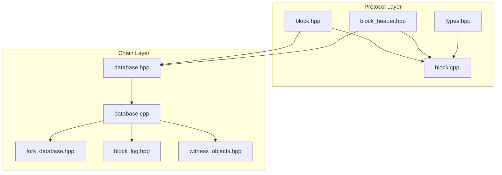
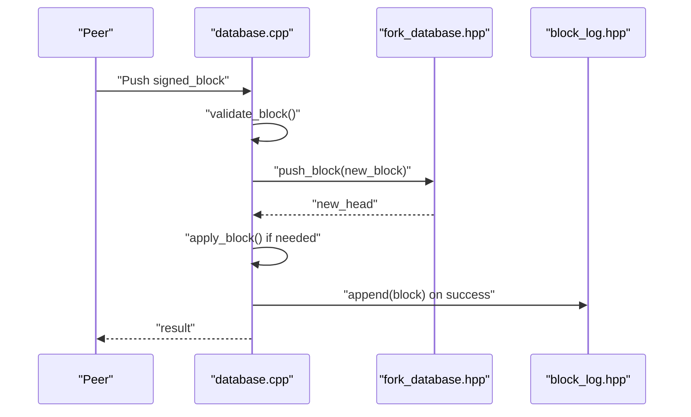
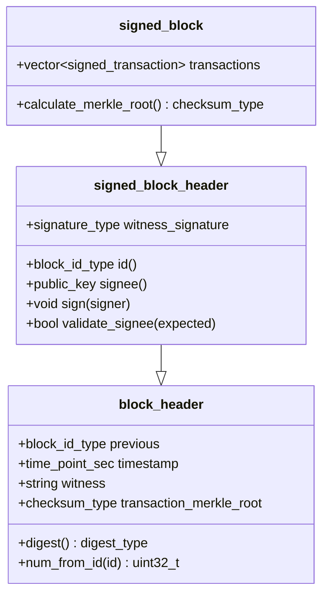
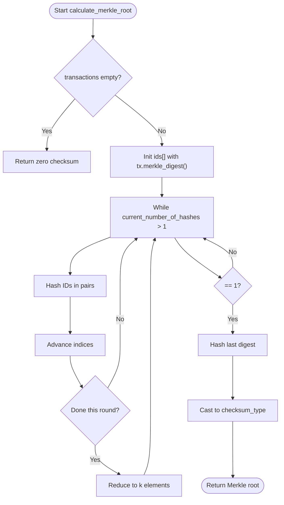
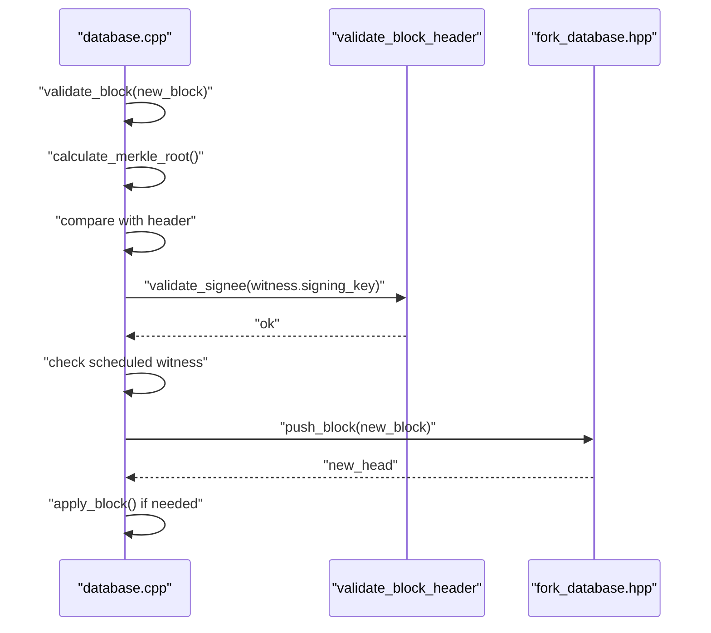
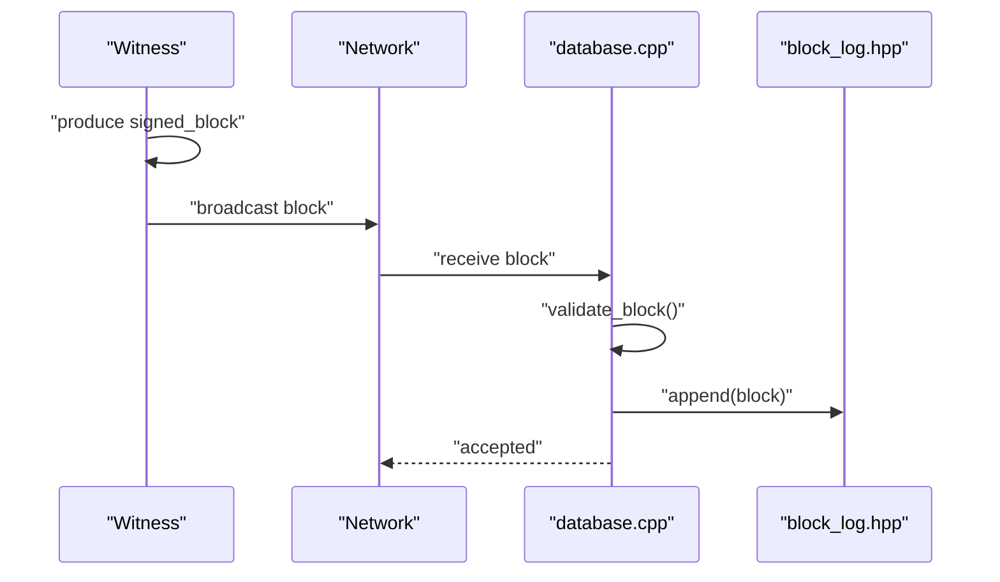
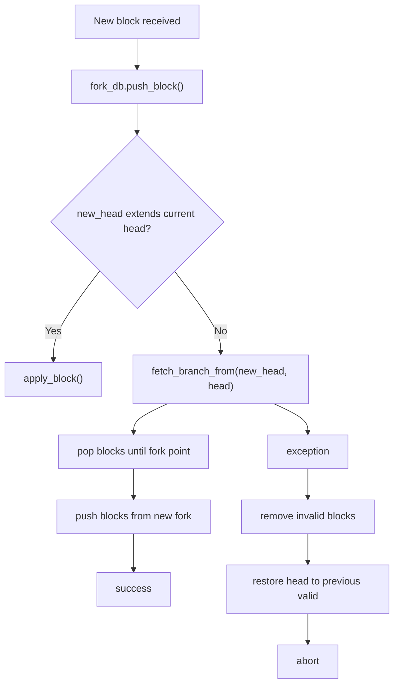
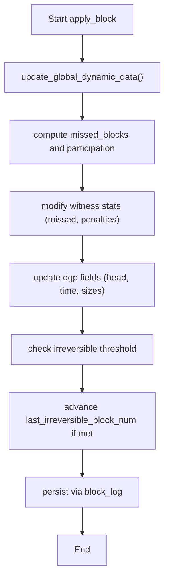
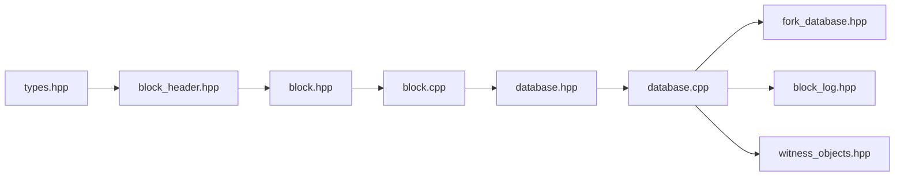

# Block Structures

<cite>
**Referenced Files in This Document**
- [block.hpp](file://libraries/protocol/include/graphene/protocol/block.hpp)
- [block_header.hpp](file://libraries/protocol/include/graphene/protocol/block_header.hpp)
- [block.cpp](file://libraries/protocol/block.cpp)
- [types.hpp](file://libraries/protocol/include/graphene/protocol/types.hpp)
- [fork_database.hpp](file://libraries/chain/include/graphene/chain/fork_database.hpp)
- [database.hpp](file://libraries/chain/include/graphene/chain/database.hpp)
- [database.cpp](file://libraries/chain/database.cpp)
- [block_log.hpp](file://libraries/chain/include/graphene/chain/block_log.hpp)
- [witness_objects.hpp](file://libraries/chain/include/graphene/chain/witness_objects.hpp)
</cite>

## Table of Contents
1. [Introduction](#introduction)
2. [Project Structure](#project-structure)
3. [Core Components](#core-components)
4. [Architecture Overview](#architecture-overview)
5. [Detailed Component Analysis](#detailed-component-analysis)
6. [Dependency Analysis](#dependency-analysis)
7. [Performance Considerations](#performance-considerations)
8. [Troubleshooting Guide](#troubleshooting-guide)
9. [Conclusion](#conclusion)
10. [Appendices](#appendices)

## Introduction
This document explains the blockchain block format and consensus mechanisms in the VIZ C++ node. It focuses on:
- Block header structure and metadata
- Transaction inclusion and Merkle root computation
- Witness signature validation and block hashing
- Validation rules for blocks (Merkle root, witness signature, fork resolution)
- Block production and propagation workflows
- Network synchronization and state progression

## Project Structure
The block-related logic spans protocol-level definitions and chain-level validation and persistence:
- Protocol-level block definitions and cryptographic helpers
- Chain-level validation, fork management, and block logging
- Witness scheduling and participation metrics

**Diagram sources**
- [block.hpp](file://libraries/protocol/include/graphene/protocol/block.hpp#L1-L19)
- [block_header.hpp](file://libraries/protocol/include/graphene/protocol/block_header.hpp#L1-L43)
- [block.cpp](file://libraries/protocol/block.cpp#L1-L68)
- [types.hpp](file://libraries/protocol/include/graphene/protocol/types.hpp#L105-L110)
- [database.hpp](file://libraries/chain/include/graphene/chain/database.hpp#L1-L200)
- [database.cpp](file://libraries/chain/database.cpp#L737-L929)
- [fork_database.hpp](file://libraries/chain/include/graphene/chain/fork_database.hpp#L1-L125)
- [block_log.hpp](file://libraries/chain/include/graphene/chain/block_log.hpp#L1-L75)
- [witness_objects.hpp](file://libraries/chain/include/graphene/chain/witness_objects.hpp#L1-L200)

**Section sources**
- [block.hpp](file://libraries/protocol/include/graphene/protocol/block.hpp#L1-L19)
- [block_header.hpp](file://libraries/protocol/include/graphene/protocol/block_header.hpp#L1-L43)
- [block.cpp](file://libraries/protocol/block.cpp#L1-L68)
- [types.hpp](file://libraries/protocol/include/graphene/protocol/types.hpp#L105-L110)
- [database.hpp](file://libraries/chain/include/graphene/chain/database.hpp#L1-L200)
- [database.cpp](file://libraries/chain/database.cpp#L737-L929)
- [fork_database.hpp](file://libraries/chain/include/graphene/chain/fork_database.hpp#L1-L125)
- [block_log.hpp](file://libraries/chain/include/graphene/chain/block_log.hpp#L1-L75)
- [witness_objects.hpp](file://libraries/chain/include/graphene/chain/witness_objects.hpp#L1-L200)

## Core Components
- Block header and signed header: define block metadata, hash computation, and witness signature validation.
- Signed block: extends the signed header with a transaction list and Merkle root calculation.
- Types: defines cryptographic primitives used by blocks and transactions.
- Fork database: manages unlinked and linked forks, head selection, and branch resolution.
- Database validation pipeline: validates block headers, Merkle roots, sizes, and witness scheduling; pushes blocks and updates state.
- Block log: persists blocks to disk for replay and synchronization.
- Witness objects: track scheduling eligibility, participation, and penalties.

**Section sources**
- [block_header.hpp](file://libraries/protocol/include/graphene/protocol/block_header.hpp#L8-L35)
- [block.hpp](file://libraries/protocol/include/graphene/protocol/block.hpp#L9-L13)
- [block.cpp](file://libraries/protocol/block.cpp#L6-L64)
- [types.hpp](file://libraries/protocol/include/graphene/protocol/types.hpp#L105-L110)
- [fork_database.hpp](file://libraries/chain/include/graphene/chain/fork_database.hpp#L53-L122)
- [database.cpp](file://libraries/chain/database.cpp#L737-L929)
- [block_log.hpp](file://libraries/chain/include/graphene/chain/block_log.hpp#L38-L71)
- [witness_objects.hpp](file://libraries/chain/include/graphene/chain/witness_objects.hpp#L27-L132)

## Architecture Overview
The block lifecycle integrates protocol definitions, validation, persistence, and consensus:
- Protocol layer defines block structures and cryptographic helpers.
- Chain layer validates incoming blocks against local state and schedules.
- Fork database resolves competing chains and selects the heaviest branch.
- Block log persists blocks and supports fast random access by number.
- Witness objects enforce scheduling and participation rules.

**Diagram sources**
- [database.cpp](file://libraries/chain/database.cpp#L800-L925)
- [fork_database.hpp](file://libraries/chain/include/graphene/chain/fork_database.hpp#L78-L91)
- [block_log.hpp](file://libraries/chain/include/graphene/chain/block_log.hpp#L50-L56)

## Detailed Component Analysis

### Block Header and Hashing
- The block header contains previous block identifier, timestamp, witness name, and the transaction Merkle root.
- The signed block header adds the witness signature and exposes signing and validation helpers.
- The block ID is derived from a compact hash with the block number embedded.

**Diagram sources**
- [block_header.hpp](file://libraries/protocol/include/graphene/protocol/block_header.hpp#L8-L35)
- [block.hpp](file://libraries/protocol/include/graphene/protocol/block.hpp#L9-L13)
- [block.cpp](file://libraries/protocol/block.cpp#L6-L33)

**Section sources**
- [block_header.hpp](file://libraries/protocol/include/graphene/protocol/block_header.hpp#L8-L35)
- [block.hpp](file://libraries/protocol/include/graphene/protocol/block.hpp#L9-L13)
- [block.cpp](file://libraries/protocol/block.cpp#L6-L33)

### Merkle Root Computation
- The Merkle root is computed from transaction digests using a standard binary hash tree.
- The computation is exposed by the signed block and compared against the header’s Merkle root during validation.

**Diagram sources**
- [block.cpp](file://libraries/protocol/block.cpp#L35-L64)

**Section sources**
- [block.cpp](file://libraries/protocol/block.cpp#L35-L64)

### Block Validation Rules
- Merkle root verification: The computed Merkle root must match the header’s field.
- Block size check: Enforced against dynamic global properties.
- Witness signature validation: The witness signature must be recoverable to the expected signing key.
- Witness scheduling: The block must be produced by the scheduled witness for the slot derived from the timestamp.
- Fork resolution: If the new block does not extend the current head, the fork database chooses the heaviest chain and replays or undoes blocks as needed.

**Diagram sources**
- [database.cpp](file://libraries/chain/database.cpp#L737-L792)
- [database.cpp](file://libraries/chain/database.cpp#L3724-L3747)
- [fork_database.hpp](file://libraries/chain/include/graphene/chain/fork_database.hpp#L78-L91)

**Section sources**
- [database.cpp](file://libraries/chain/database.cpp#L737-L792)
- [database.cpp](file://libraries/chain/database.cpp#L3724-L3747)
- [fork_database.hpp](file://libraries/chain/include/graphene/chain/fork_database.hpp#L78-L91)

### Block Production and Propagation
- Block production is governed by witness scheduling and participation. The witness that produces a block is determined by the slot derived from the block timestamp and the witness schedule.
- Propagation occurs when peers receive blocks and validate them before pushing to their chain.
- Persistence is handled by the block log, which stores blocks in an append-only manner and supports random access by block number.

**Diagram sources**
- [witness_objects.hpp](file://libraries/chain/include/graphene/chain/witness_objects.hpp#L27-L132)
- [database.cpp](file://libraries/chain/database.cpp#L737-L929)
- [block_log.hpp](file://libraries/chain/include/graphene/chain/block_log.hpp#L50-L56)

**Section sources**
- [witness_objects.hpp](file://libraries/chain/include/graphene/chain/witness_objects.hpp#L27-L132)
- [database.cpp](file://libraries/chain/database.cpp#L737-L929)
- [block_log.hpp](file://libraries/chain/include/graphene/chain/block_log.hpp#L50-L56)

### Fork Resolution Criteria
- The fork database maintains linked forks and selects the head based on the longest chain.
- When a new block does not extend the current head, the system computes branches from the new head and current head, pops blocks from the current chain until the fork point, and replays blocks from the new branch.
- Invalid blocks are removed and the head restored to the previous valid state.

**Diagram sources**
- [fork_database.hpp](file://libraries/chain/include/graphene/chain/fork_database.hpp#L78-L91)
- [database.cpp](file://libraries/chain/database.cpp#L847-L925)

**Section sources**
- [fork_database.hpp](file://libraries/chain/include/graphene/chain/fork_database.hpp#L78-L91)
- [database.cpp](file://libraries/chain/database.cpp#L847-L925)

### Relationship Between Blocks and Blockchain State Progression
- Dynamic global properties are updated per block, including head block number/id, timestamp, participation metrics, and reserve ratios.
- Witness participation and penalties are tracked; missed blocks increment counters and can lead to penalties and potential shutdown of inactive witnesses.
- The irreversible block number advances when sufficient witness validations reach consensus thresholds.

**Diagram sources**
- [database.cpp](file://libraries/chain/database.cpp#L3759-L3873)
- [database.cpp](file://libraries/chain/database.cpp#L3875-L3899)

**Section sources**
- [database.cpp](file://libraries/chain/database.cpp#L3759-L3873)
- [database.cpp](file://libraries/chain/database.cpp#L3875-L3899)

## Dependency Analysis
- Protocol definitions depend on cryptographic types and reflection macros.
- Chain validation depends on protocol structures, fork database, and block log.
- Witness objects provide scheduling and participation data used by validation.

**Diagram sources**
- [types.hpp](file://libraries/protocol/include/graphene/protocol/types.hpp#L105-L110)
- [block_header.hpp](file://libraries/protocol/include/graphene/protocol/block_header.hpp#L1-L43)
- [block.hpp](file://libraries/protocol/include/graphene/protocol/block.hpp#L1-L19)
- [block.cpp](file://libraries/protocol/block.cpp#L1-L68)
- [database.hpp](file://libraries/chain/include/graphene/chain/database.hpp#L1-L200)
- [database.cpp](file://libraries/chain/database.cpp#L737-L929)
- [fork_database.hpp](file://libraries/chain/include/graphene/chain/fork_database.hpp#L1-L125)
- [block_log.hpp](file://libraries/chain/include/graphene/chain/block_log.hpp#L1-L75)
- [witness_objects.hpp](file://libraries/chain/include/graphene/chain/witness_objects.hpp#L1-L200)

**Section sources**
- [types.hpp](file://libraries/protocol/include/graphene/protocol/types.hpp#L105-L110)
- [block_header.hpp](file://libraries/protocol/include/graphene/protocol/block_header.hpp#L1-L43)
- [block.hpp](file://libraries/protocol/include/graphene/protocol/block.hpp#L1-L19)
- [block.cpp](file://libraries/protocol/block.cpp#L1-L68)
- [database.hpp](file://libraries/chain/include/graphene/chain/database.hpp#L1-L200)
- [database.cpp](file://libraries/chain/database.cpp#L737-L929)
- [fork_database.hpp](file://libraries/chain/include/graphene/chain/fork_database.hpp#L1-L125)
- [block_log.hpp](file://libraries/chain/include/graphene/chain/block_log.hpp#L1-L75)
- [witness_objects.hpp](file://libraries/chain/include/graphene/chain/witness_objects.hpp#L1-L200)

## Performance Considerations
- Merkle root computation is O(n log n) for n transactions due to the binary hash tree.
- Fork resolution involves popping and pushing blocks; keep the maximum reordering window reasonable to avoid excessive memory and CPU usage.
- Block size checks prevent oversized blocks from consuming resources.
- Witness participation metrics and penalties help maintain network health and reduce spam.

[No sources needed since this section provides general guidance]

## Troubleshooting Guide
Common validation failures and remedies:
- Merkle mismatch: Verify transaction ordering and ensure the Merkle root is recomputed consistently.
- Witness signature mismatch: Confirm the witness signing key matches the expected key and that the digest used for signing is correct.
- Incorrect witness scheduling: Ensure the block timestamp yields the correct slot and that the scheduled witness matches the block producer.
- Fork conflicts: Investigate why the new block did not extend the current head; check timestamps, witness assignments, and fork database logs.
- Disk or memory errors during block push: The system attempts to resize shared memory on allocation failure; ensure adequate disk space and memory.

**Section sources**
- [database.cpp](file://libraries/chain/database.cpp#L757-L792)
- [database.cpp](file://libraries/chain/database.cpp#L3724-L3747)
- [database.cpp](file://libraries/chain/database.cpp#L847-L925)

## Conclusion
Blocks in the VIZ node are defined by a clear protocol structure, validated rigorously by the chain layer, and persisted for resilience. Consensus relies on deterministic witness scheduling, strict signature validation, and robust fork resolution. Understanding these components enables reliable block construction, validation, propagation, and synchronization across the network.

[No sources needed since this section summarizes without analyzing specific files]

## Appendices

### Example Workflows
- Constructing a block: Build a signed block with transactions, compute the Merkle root, populate the header fields, and sign with the witness key.
- Validating a block: Compute the Merkle root, compare against the header; verify the witness signature; confirm the scheduled witness; enforce block size limits.
- Resolving a fork: Use the fork database to select the heaviest chain; if necessary, pop blocks from the current chain and push blocks from the new fork.

[No sources needed since this section provides general guidance]