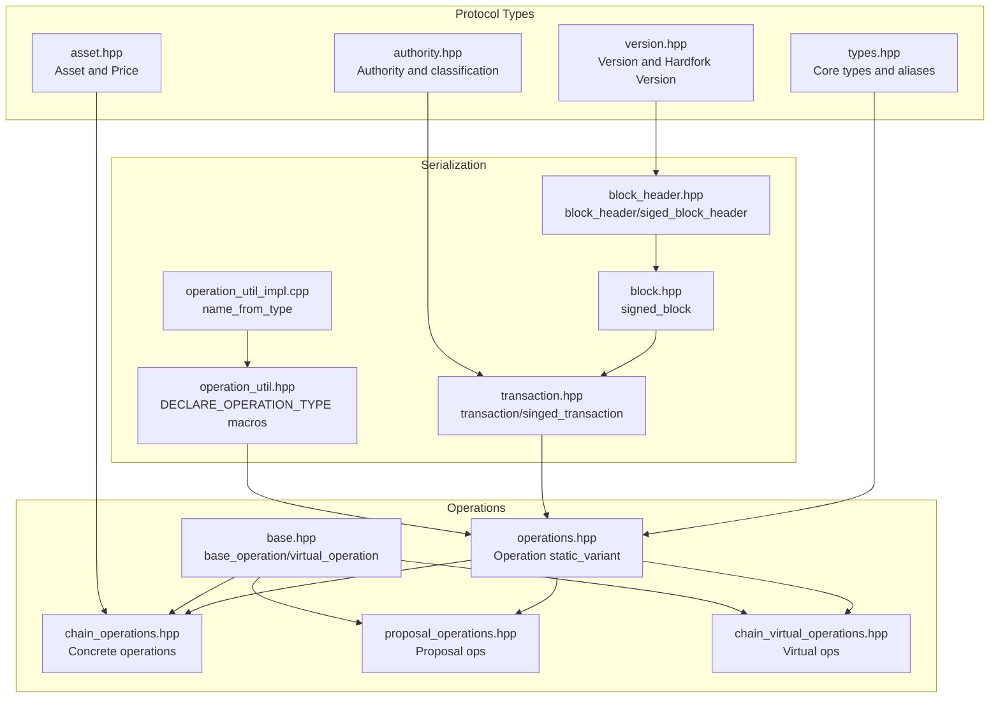
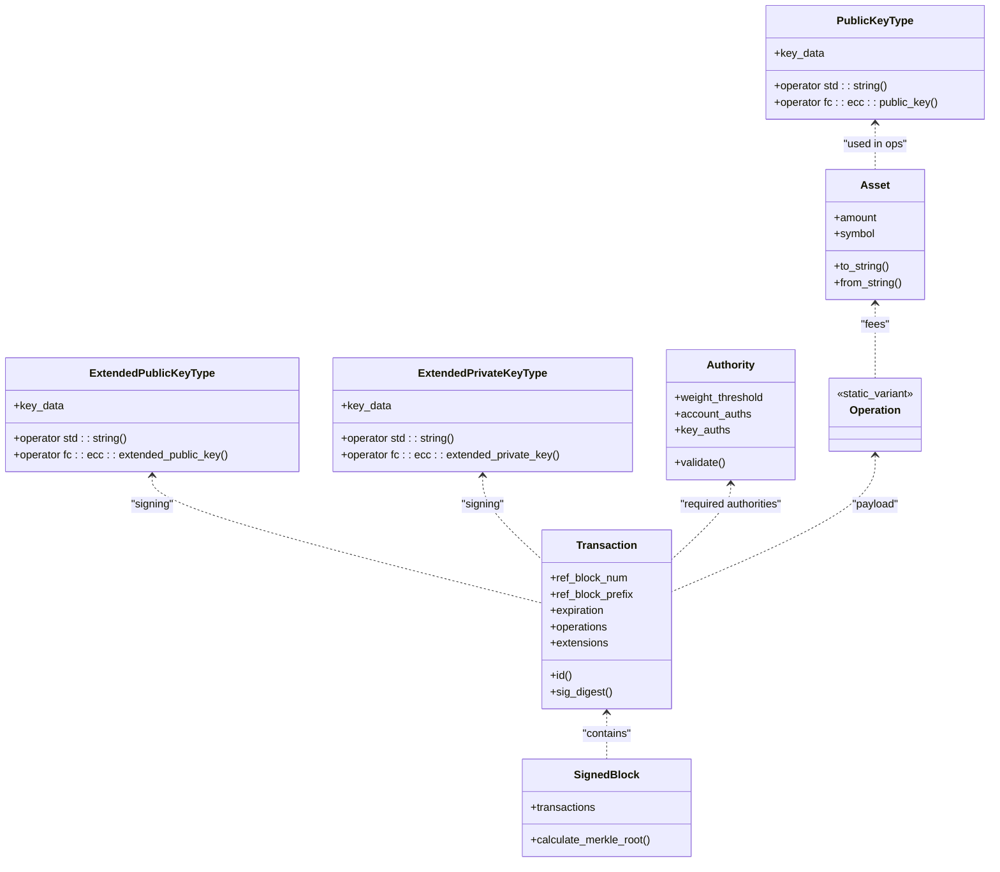
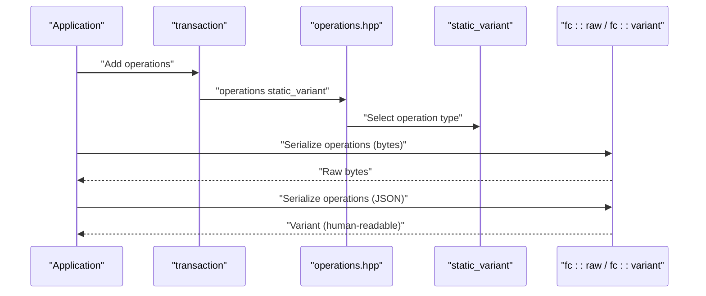
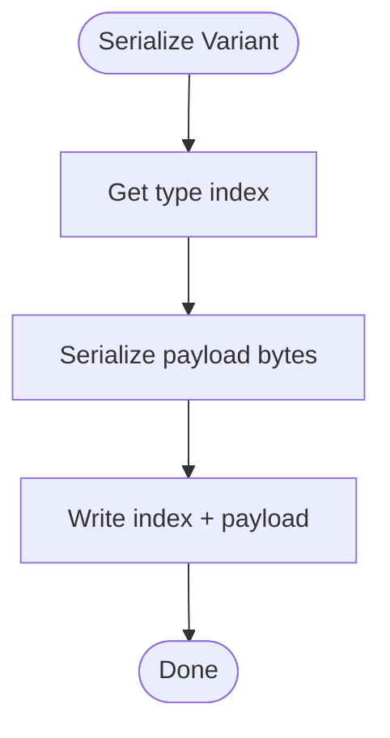
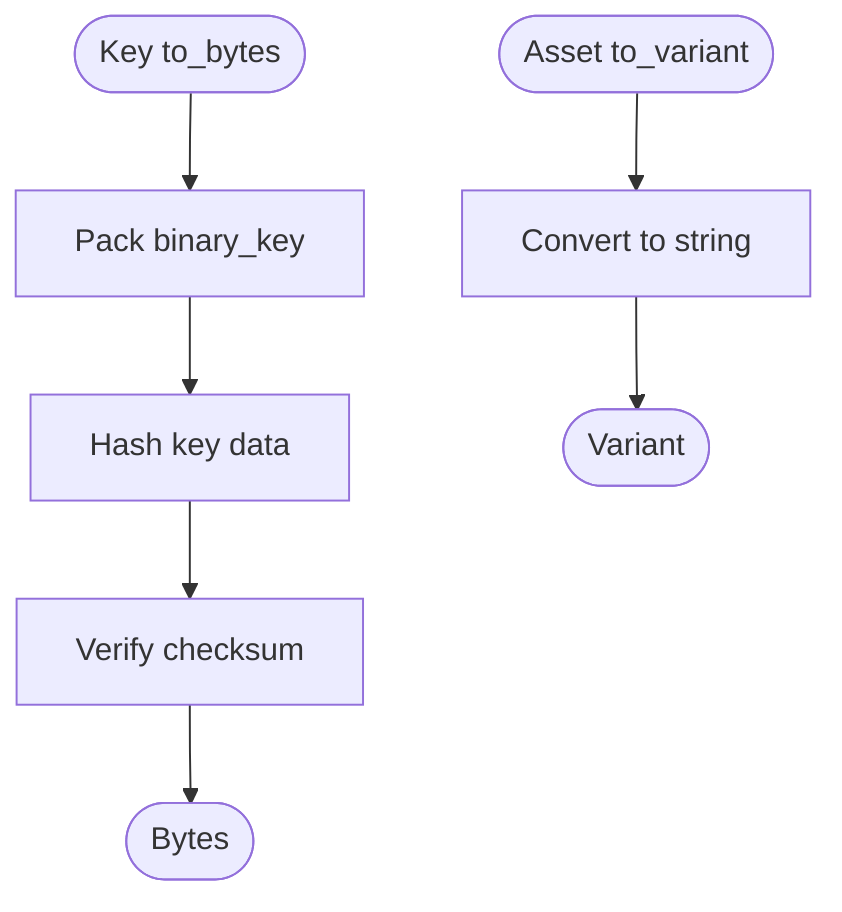
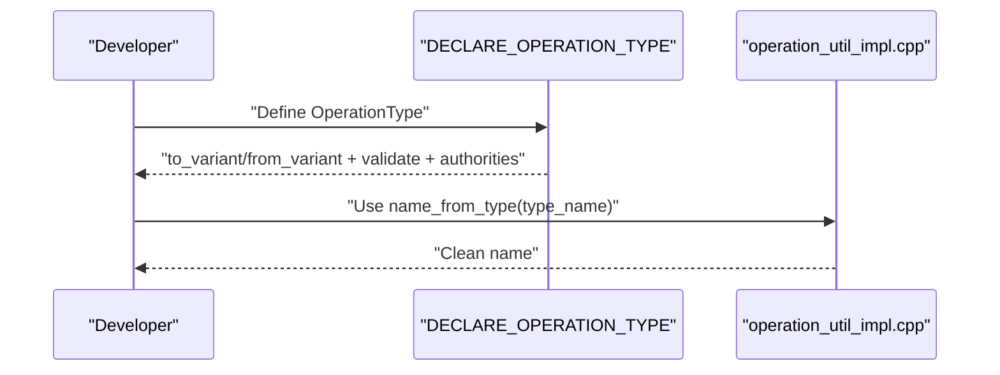
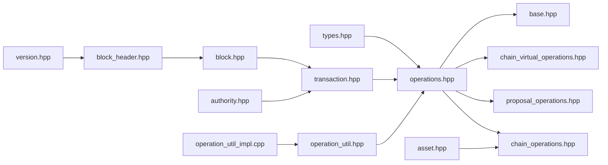

# Data Types and Serialization

<cite>
**Referenced Files in This Document**
- [types.hpp](file://libraries/protocol/include/graphene/protocol/types.hpp)
- [types.cpp](file://libraries/protocol/types.cpp)
- [operation_util.hpp](file://libraries/protocol/include/graphene/protocol/operation_util.hpp)
- [operation_util_impl.cpp](file://libraries/protocol/operation_util_impl.cpp)
- [operations.hpp](file://libraries/protocol/include/graphene/protocol/operations.hpp)
- [transaction.hpp](file://libraries/protocol/include/graphene/protocol/transaction.hpp)
- [block.hpp](file://libraries/protocol/include/graphene/protocol/block.hpp)
- [block_header.hpp](file://libraries/protocol/include/graphene/protocol/block_header.hpp)
- [base.hpp](file://libraries/protocol/include/graphene/protocol/base.hpp)
- [asset.hpp](file://libraries/protocol/include/graphene/protocol/asset.hpp)
- [authority.hpp](file://libraries/protocol/include/graphene/protocol/authority.hpp)
- [chain_operations.hpp](file://libraries/protocol/include/graphene/protocol/chain_operations.hpp)
- [proposal_operations.hpp](file://libraries/protocol/include/graphene/protocol/proposal_operations.hpp)
- [chain_virtual_operations.hpp](file://libraries/protocol/include/graphene/protocol/chain_virtual_operations.hpp)
- [version.hpp](file://libraries/protocol/include/graphene/protocol/version.hpp)
</cite>

## Table of Contents
1. [Introduction](#introduction)
2. [Project Structure](#project-structure)
3. [Core Components](#core-components)
4. [Architecture Overview](#architecture-overview)
5. [Detailed Component Analysis](#detailed-component-analysis)
6. [Dependency Analysis](#dependency-analysis)
7. [Performance Considerations](#performance-considerations)
8. [Troubleshooting Guide](#troubleshooting-guide)
9. [Conclusion](#conclusion)

## Introduction
This document explains the blockchain data types and serialization mechanisms used by the protocol layer. It focuses on:
- Basic and specialized blockchain types (keys, identifiers, amounts, authorities)
- Smart contract-like operation types and their variants
- Serialization/deserialization for operations, transactions, and blocks
- Utilities for operation introspection and helper functions
- Variant serialization, enum handling, and custom type serialization patterns
- Examples of usage and protocol versioning implications

## Project Structure
The relevant data types and serialization logic live primarily under the protocol library’s include and implementation files. The most important areas are:
- Core types and cryptographic keys
- Operations and their static variants
- Transactions and blocks
- Asset and authority types
- Versioning and extension types

**Diagram sources**
- [types.hpp](file://libraries/protocol/include/graphene/protocol/types.hpp#L34-L209)
- [asset.hpp](file://libraries/protocol/include/graphene/protocol/asset.hpp#L10-L181)
- [authority.hpp](file://libraries/protocol/include/graphene/protocol/authority.hpp#L1-L115)
- [version.hpp](file://libraries/protocol/include/graphene/protocol/version.hpp#L14-L156)
- [operations.hpp](file://libraries/protocol/include/graphene/protocol/operations.hpp#L8-L131)
- [chain_operations.hpp](file://libraries/protocol/include/graphene/protocol/chain_operations.hpp#L9-L1189)
- [proposal_operations.hpp](file://libraries/protocol/include/graphene/protocol/proposal_operations.hpp#L48-L129)
- [chain_virtual_operations.hpp](file://libraries/protocol/include/graphene/protocol/chain_virtual_operations.hpp#L11-L329)
- [base.hpp](file://libraries/protocol/include/graphene/protocol/base.hpp#L12-L62)
- [transaction.hpp](file://libraries/protocol/include/graphene/protocol/transaction.hpp#L12-L136)
- [block.hpp](file://libraries/protocol/include/graphene/protocol/block.hpp#L9-L19)
- [block_header.hpp](file://libraries/protocol/include/graphene/protocol/block_header.hpp#L8-L43)
- [operation_util.hpp](file://libraries/protocol/include/graphene/protocol/operation_util.hpp#L16-L34)
- [operation_util_impl.cpp](file://libraries/protocol/operation_util_impl.cpp#L5-L11)

**Section sources**
- [types.hpp](file://libraries/protocol/include/graphene/protocol/types.hpp#L34-L209)
- [operations.hpp](file://libraries/protocol/include/graphene/protocol/operations.hpp#L8-L131)
- [transaction.hpp](file://libraries/protocol/include/graphene/protocol/transaction.hpp#L12-L136)
- [block.hpp](file://libraries/protocol/include/graphene/protocol/block.hpp#L9-L19)
- [block_header.hpp](file://libraries/protocol/include/graphene/protocol/block_header.hpp#L8-L43)
- [base.hpp](file://libraries/protocol/include/graphene/protocol/base.hpp#L12-L62)
- [asset.hpp](file://libraries/protocol/include/graphene/protocol/asset.hpp#L10-L181)
- [authority.hpp](file://libraries/protocol/include/graphene/protocol/authority.hpp#L9-L115)
- [chain_operations.hpp](file://libraries/protocol/include/graphene/protocol/chain_operations.hpp#L11-L1189)
- [proposal_operations.hpp](file://libraries/protocol/include/graphene/protocol/proposal_operations.hpp#L48-L129)
- [chain_virtual_operations.hpp](file://libraries/protocol/include/graphene/protocol/chain_virtual_operations.hpp#L11-L329)
- [version.hpp](file://libraries/protocol/include/graphene/protocol/version.hpp#L14-L156)
- [operation_util.hpp](file://libraries/protocol/include/graphene/protocol/operation_util.hpp#L16-L34)
- [operation_util_impl.cpp](file://libraries/protocol/operation_util_impl.cpp#L5-L11)

## Core Components
- Basic types and aliases: identifiers, hashes, time, safe integers, and reflection-friendly containers
- Cryptographic keys: public, extended public/private keys with Base58-pack/unpack serialization
- Asset and price: token representation with string conversions and arithmetic
- Authority: weighted multi-signature structures with classification and validation
- Operations: static_variant of all operations and virtual operations
- Transaction and Block: container structures with digest, signing, and Merkle roots

Key responsibilities:
- Provide compact, deterministic serialization via fc::raw and fc::reflector
- Support runtime polymorphism via static_variant for operations
- Encode cryptographic material in a standardized way for hashing and signing

**Section sources**
- [types.hpp](file://libraries/protocol/include/graphene/protocol/types.hpp#L36-L209)
- [types.cpp](file://libraries/protocol/types.cpp#L13-L178)
- [asset.hpp](file://libraries/protocol/include/graphene/protocol/asset.hpp#L14-L181)
- [authority.hpp](file://libraries/protocol/include/graphene/protocol/authority.hpp#L9-L115)
- [operations.hpp](file://libraries/protocol/include/graphene/protocol/operations.hpp#L13-L131)
- [transaction.hpp](file://libraries/protocol/include/graphene/protocol/transaction.hpp#L12-L136)
- [block.hpp](file://libraries/protocol/include/graphene/protocol/block.hpp#L9-L19)
- [block_header.hpp](file://libraries/protocol/include/graphene/protocol/block_header.hpp#L8-L43)

## Architecture Overview
The serialization architecture centers on fc reflection and raw packing:
- Types are reflected with FC_REFLECT/FC_REFLECT_TYPENAME for deterministic field ordering
- Static variants (operation, versioned chain properties) serialize discriminant + payload
- Enumerations are handled via FC_REFLECT_ENUM or fc::enum_type
- Custom types (keys, asset) provide to_variant/from_variant for human-readable formats and pack/unpack for binary

**Diagram sources**
- [types.hpp](file://libraries/protocol/include/graphene/protocol/types.hpp#L113-L207)
- [types.cpp](file://libraries/protocol/types.cpp#L13-L178)
- [asset.hpp](file://libraries/protocol/include/graphene/protocol/asset.hpp#L14-L181)
- [authority.hpp](file://libraries/protocol/include/graphene/protocol/authority.hpp#L9-L115)
- [operations.hpp](file://libraries/protocol/include/graphene/protocol/operations.hpp#L13-L102)
- [transaction.hpp](file://libraries/protocol/include/graphene/protocol/transaction.hpp#L12-L101)
- [block.hpp](file://libraries/protocol/include/graphene/protocol/block.hpp#L9-L19)

## Detailed Component Analysis

### Basic Data Types and Keys
- Aliases: chain_id_type, block_id_type, transaction_id_type, digest_type, signature_type, share_type, weight_type
- Public keys and extended keys: encapsulate ECC data with binary_key for pack/unpack and Base58 string conversion
- String comparisons and ordering: string_less supports std::string and fc::fixed_string

Serialization highlights:
- Binary form uses fc::raw::pack/unpack of binary_key structs
- Human-readable form uses Base58 with a chain-specific address prefix
- Reflection-based serialization via FC_REFLECT for key structs

Usage examples (conceptual):
- Convert a public key to a string for display or storage
- Pack a key into bytes for inclusion in transactions or blocks
- Unpack bytes back into a key for signature verification

**Section sources**
- [types.hpp](file://libraries/protocol/include/graphene/protocol/types.hpp#L75-L207)
- [types.cpp](file://libraries/protocol/types.cpp#L13-L178)
- [types.cpp](file://libraries/protocol/types.cpp#L183-L206)

### Asset and Price Types
- Asset stores amount and symbol; provides arithmetic, comparison, and string conversions
- Price pairs base and quote assets; includes normalization helpers and validation

Serialization highlights:
- FC_REFLECT for asset and price
- to_variant/from_variant convert to/from human-readable strings

Usage examples (conceptual):
- Serialize an asset to JSON for APIs
- Deserialize a string into an asset for validation and arithmetic

**Section sources**
- [asset.hpp](file://libraries/protocol/include/graphene/protocol/asset.hpp#L14-L181)

### Authority and Classification
- Authority aggregates thresholds and maps of accounts/keys with weights
- Classification enumerates master, active, key, regular for operation authority derivation
- Validation ensures satisfiability and structural correctness

Serialization highlights:
- FC_REFLECT for authority and its internal maps
- FC_REFLECT_ENUM for classification

Usage examples (conceptual):
- Build an authority requiring multiple signatures
- Extract required authorities from an operation

**Section sources**
- [authority.hpp](file://libraries/protocol/include/graphene/protocol/authority.hpp#L9-L115)

### Operations and Variants
- operation is a static_variant over all concrete operations and virtual operations
- is_virtual_operation/is_data_operation classify variants
- operation_wrapper resolves circular dependencies for proposals

Serialization highlights:
- FC_REFLECT_TYPENAME for operation and wrapper
- DECLARE_OPERATION_TYPE macro generates to_variant/from_variant and validation/authority extraction stubs

Usage examples (conceptual):
- Serialize an operation to bytes for signing
- Deserialize bytes into the appropriate operation variant
- Validate an operation before applying

**Section sources**
- [operations.hpp](file://libraries/protocol/include/graphene/protocol/operations.hpp#L13-L131)
- [operation_util.hpp](file://libraries/protocol/include/graphene/protocol/operation_util.hpp#L16-L34)

### Operation Utilities and Helpers
- DECLARE_OPERATION_TYPE macro defines to_variant, from_variant, operation_validate, and operation_get_required_authorities
- name_from_type extracts a concise name from a fully qualified type name

Usage examples (conceptual):
- Implement to_variant/from_variant for a new operation type
- Use operation_get_required_authorities to compute signers for a transaction

**Section sources**
- [operation_util.hpp](file://libraries/protocol/include/graphene/protocol/operation_util.hpp#L16-L34)
- [operation_util_impl.cpp](file://libraries/protocol/operation_util_impl.cpp#L5-L11)

### Transactions and Blocks
- transaction: container with expiration, reference block fields, operations, and extensions
- signed_transaction: extends transaction with signatures and authority helpers
- annotated_signed_transaction: attaches block and transaction indices
- block_header/sigend_block_header: header with digest/signature; signed_block contains transactions and computes Merkle root

Serialization highlights:
- FC_REFLECT for all structures
- visit pattern on operations for visitor-based processing
- Merkle root computation for block integrity

Usage examples (conceptual):
- Build a transaction, add operations, compute digest, sign, and broadcast
- Verify signatures and required authorities for a signed transaction
- Serialize a block for persistence or P2P propagation

**Section sources**
- [transaction.hpp](file://libraries/protocol/include/graphene/protocol/transaction.hpp#L12-L136)
- [block_header.hpp](file://libraries/protocol/include/graphene/protocol/block_header.hpp#L8-L43)
- [block.hpp](file://libraries/protocol/include/graphene/protocol/block.hpp#L9-L19)

### Virtual Operations and Base Types
- base_operation/virtual_operation define the hierarchy; virtual operations are non-executed events
- block_header_extensions/future_extensions are static variants for extensibility

Usage examples (conceptual):
- Emit virtual operations during evaluation to notify APIs and observers
- Extend block headers with versioning or hardfork votes

**Section sources**
- [base.hpp](file://libraries/protocol/include/graphene/protocol/base.hpp#L12-L62)

### Concrete Operations and Extensions
- chain_operations.hpp: account creation/update, transfers, vesting, witnesses, escrow, chain properties, invites, subscriptions, sales, awards, bids
- proposal_operations.hpp: proposal lifecycle operations
- chain_virtual_operations.hpp: reward payouts, hardfork triggers, committee actions, witness rewards, subscription actions, sales, and auction events

Serialization highlights:
- FC_REFLECT for each operation struct
- Extensions fields for future extensibility

Usage examples (conceptual):
- Construct a transfer operation with fee, amount, memo
- Create a proposal with multiple wrapped operations and expiration

**Section sources**
- [chain_operations.hpp](file://libraries/protocol/include/graphene/protocol/chain_operations.hpp#L11-L1189)
- [proposal_operations.hpp](file://libraries/protocol/include/graphene/protocol/proposal_operations.hpp#L48-L129)
- [chain_virtual_operations.hpp](file://libraries/protocol/include/graphene/protocol/chain_virtual_operations.hpp#L11-L329)

### Versioning and Protocol Evolution
- version and hardfork_version represent semantic versioning
- hardfork_version_vote carries voting for hardfork activation
- block_header_extensions includes version reporting and hardfork votes

Serialization highlights:
- FC_REFLECT for version types
- to_variant/from_variant for human-readable version strings

Usage examples (conceptual):
- Report current node version in block headers
- Vote for a hardfork version and record timestamp

**Section sources**
- [version.hpp](file://libraries/protocol/include/graphene/protocol/version.hpp#L14-L156)
- [base.hpp](file://libraries/protocol/include/graphene/protocol/base.hpp#L43-L54)
- [block_header.hpp](file://libraries/protocol/include/graphene/protocol/block_header.hpp#L25-L35)

## Architecture Overview

**Diagram sources**
- [operations.hpp](file://libraries/protocol/include/graphene/protocol/operations.hpp#L13-L102)
- [transaction.hpp](file://libraries/protocol/include/graphene/protocol/transaction.hpp#L18-L49)

## Detailed Component Analysis

### Variant Serialization and Enum Handling
- static_variant serializes the index of the contained type followed by the serialized payload
- enums are reflected via FC_REFLECT_ENUM or fc::enum_type
- Custom types provide to_variant/from_variant for JSON-friendly formats

**Diagram sources**
- [operations.hpp](file://libraries/protocol/include/graphene/protocol/operations.hpp#L13-L102)
- [authority.hpp](file://libraries/protocol/include/graphene/protocol/authority.hpp#L114-L115)
- [version.hpp](file://libraries/protocol/include/graphene/protocol/version.hpp#L152-L156)

**Section sources**
- [operations.hpp](file://libraries/protocol/include/graphene/protocol/operations.hpp#L13-L102)
- [authority.hpp](file://libraries/protocol/include/graphene/protocol/authority.hpp#L114-L115)
- [version.hpp](file://libraries/protocol/include/graphene/protocol/version.hpp#L152-L156)

### Custom Type Serialization Patterns
- Keys: pack/unpack binary_key, encode/decode Base58 with chain prefix
- Asset: string-based to/from variant for JSON compatibility
- Authorities: reflection-based serialization with weighted maps

**Diagram sources**
- [types.cpp](file://libraries/protocol/types.cpp#L51-L57)
- [types.cpp](file://libraries/protocol/types.cpp#L104-L110)
- [asset.hpp](file://libraries/protocol/include/graphene/protocol/asset.hpp#L170-L177)

**Section sources**
- [types.cpp](file://libraries/protocol/types.cpp#L13-L178)
- [asset.hpp](file://libraries/protocol/include/graphene/protocol/asset.hpp#L170-L177)

### Operation Utilities and Helper Functions
- DECLARE_OPERATION_TYPE macro centralizes the generation of serialization and validation hooks
- name_from_type helps derive operation names from type names for logging or UI

**Diagram sources**
- [operation_util.hpp](file://libraries/protocol/include/graphene/protocol/operation_util.hpp#L16-L34)
- [operation_util_impl.cpp](file://libraries/protocol/operation_util_impl.cpp#L5-L11)

**Section sources**
- [operation_util.hpp](file://libraries/protocol/include/graphene/protocol/operation_util.hpp#L16-L34)
- [operation_util_impl.cpp](file://libraries/protocol/operation_util_impl.cpp#L5-L11)

### Data Type Usage Scenarios
- Signing a transaction: compute sig_digest(chain_id), sign with private key, append signature
- Deserializing a block: unpack signed_block, iterate transactions, verify signatures and Merkle roots
- Validating an operation: call operation_validate and extract required authorities for permission checks

**Section sources**
- [transaction.hpp](file://libraries/protocol/include/graphene/protocol/transaction.hpp#L27-L101)
- [block.hpp](file://libraries/protocol/include/graphene/protocol/block.hpp#L9-L19)

### Relationship Between Data Types and Protocol Versioning
- version and hardfork_version provide structured versioning
- block_header_extensions carry version reporting and hardfork votes
- Static variants (operation, versioned chain properties) evolve by adding new alternatives without breaking existing encodings

**Section sources**
- [version.hpp](file://libraries/protocol/include/graphene/protocol/version.hpp#L14-L156)
- [base.hpp](file://libraries/protocol/include/graphene/protocol/base.hpp#L43-L54)
- [chain_operations.hpp](file://libraries/protocol/include/graphene/protocol/chain_operations.hpp#L635-L640)

## Dependency Analysis

**Diagram sources**
- [types.hpp](file://libraries/protocol/include/graphene/protocol/types.hpp#L34-L209)
- [operations.hpp](file://libraries/protocol/include/graphene/protocol/operations.hpp#L8-L131)
- [chain_operations.hpp](file://libraries/protocol/include/graphene/protocol/chain_operations.hpp#L9-L1189)
- [proposal_operations.hpp](file://libraries/protocol/include/graphene/protocol/proposal_operations.hpp#L48-L129)
- [chain_virtual_operations.hpp](file://libraries/protocol/include/graphene/protocol/chain_virtual_operations.hpp#L11-L329)
- [base.hpp](file://libraries/protocol/include/graphene/protocol/base.hpp#L12-L62)
- [transaction.hpp](file://libraries/protocol/include/graphene/protocol/transaction.hpp#L12-L136)
- [block.hpp](file://libraries/protocol/include/graphene/protocol/block.hpp#L9-L19)
- [block_header.hpp](file://libraries/protocol/include/graphene/protocol/block_header.hpp#L8-L43)
- [asset.hpp](file://libraries/protocol/include/graphene/protocol/asset.hpp#L10-L181)
- [authority.hpp](file://libraries/protocol/include/graphene/protocol/authority.hpp#L9-L115)
- [version.hpp](file://libraries/protocol/include/graphene/protocol/version.hpp#L14-L156)
- [operation_util.hpp](file://libraries/protocol/include/graphene/protocol/operation_util.hpp#L16-L34)
- [operation_util_impl.cpp](file://libraries/protocol/operation_util_impl.cpp#L5-L11)

**Section sources**
- [types.hpp](file://libraries/protocol/include/graphene/protocol/types.hpp#L34-L209)
- [operations.hpp](file://libraries/protocol/include/graphene/protocol/operations.hpp#L8-L131)
- [transaction.hpp](file://libraries/protocol/include/graphene/protocol/transaction.hpp#L12-L136)
- [block.hpp](file://libraries/protocol/include/graphene/protocol/block.hpp#L9-L19)
- [block_header.hpp](file://libraries/protocol/include/graphene/protocol/block_header.hpp#L8-L43)
- [base.hpp](file://libraries/protocol/include/graphene/protocol/base.hpp#L12-L62)
- [asset.hpp](file://libraries/protocol/include/graphene/protocol/asset.hpp#L10-L181)
- [authority.hpp](file://libraries/protocol/include/graphene/protocol/authority.hpp#L9-L115)
- [chain_operations.hpp](file://libraries/protocol/include/graphene/protocol/chain_operations.hpp#L9-L1189)
- [proposal_operations.hpp](file://libraries/protocol/include/graphene/protocol/proposal_operations.hpp#L48-L129)
- [chain_virtual_operations.hpp](file://libraries/protocol/include/graphene/protocol/chain_virtual_operations.hpp#L11-L329)
- [version.hpp](file://libraries/protocol/include/graphene/protocol/version.hpp#L14-L156)
- [operation_util.hpp](file://libraries/protocol/include/graphene/protocol/operation_util.hpp#L16-L34)
- [operation_util_impl.cpp](file://libraries/protocol/operation_util_impl.cpp#L5-L11)

## Performance Considerations
- Prefer fc::raw serialization for compact binary storage and deterministic hashing
- Use fc::variant for human-readable interchange; avoid in hot paths
- Keep operation payloads minimal; leverage extensions for optional data
- Static variants enable efficient dispatch without virtual calls
- Avoid repeated pack/unpack cycles; cache digests when possible

## Troubleshooting Guide
Common issues and remedies:
- Key deserialization failures: verify Base58 prefix and checksum match
- Asset parsing errors: ensure symbol and precision align with chain configuration
- Authority validation failures: confirm thresholds and weights satisfy required sets
- Operation variant mismatches: ensure the correct type is selected during deserialization
- Signature verification failures: recompute sig_digest with the correct chain_id and reference block

**Section sources**
- [types.cpp](file://libraries/protocol/types.cpp#L24-L39)
- [types.cpp](file://libraries/protocol/types.cpp#L84-L97)
- [types.cpp](file://libraries/protocol/types.cpp#L137-L150)
- [asset.hpp](file://libraries/protocol/include/graphene/protocol/asset.hpp#L170-L177)
- [authority.hpp](file://libraries/protocol/include/graphene/protocol/authority.hpp#L49-L49)
- [transaction.hpp](file://libraries/protocol/include/graphene/protocol/transaction.hpp#L27-L101)

## Conclusion
The protocol layer provides a robust, extensible foundation for blockchain data types and serialization. By combining fc reflection, static variants, and custom serializers, it achieves deterministic encoding, clear versioning, and flexible evolution. Developers can extend operations and types while maintaining backward compatibility and efficient serialization for production-grade nodes and applications.