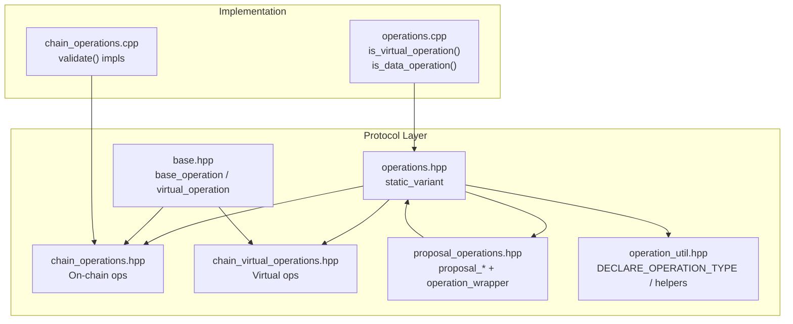
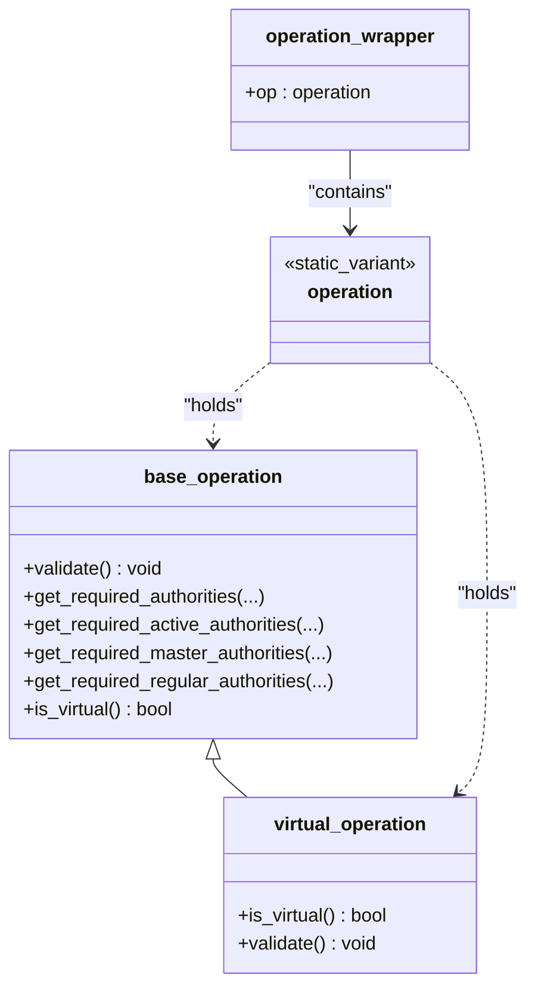
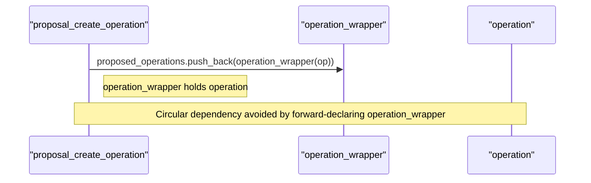
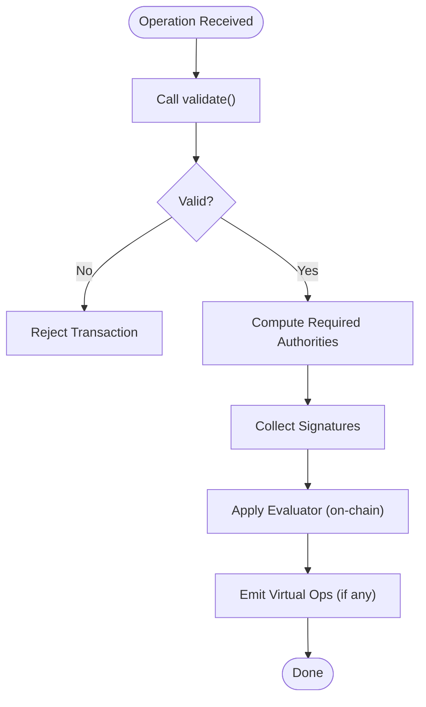
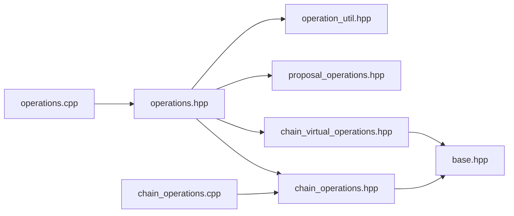

# Operations Definition

<cite>
**Referenced Files in This Document**
- [operations.hpp](file://libraries/protocol/include/graphene/protocol/operations.hpp)
- [operation_util.hpp](file://libraries/protocol/include/graphene/protocol/operation_util.hpp)
- [operations.cpp](file://libraries/protocol/operations.cpp)
- [chain_operations.hpp](file://libraries/protocol/include/graphene/protocol/chain_operations.hpp)
- [chain_operations.cpp](file://libraries/protocol/chain_operations.cpp)
- [proposal_operations.hpp](file://libraries/protocol/include/graphene/protocol/proposal_operations.hpp)
- [chain_virtual_operations.hpp](file://libraries/protocol/include/graphene/protocol/chain_virtual_operations.hpp)
- [base.hpp](file://libraries/protocol/include/graphene/protocol/base.hpp)
- [invite_objects.hpp](file://libraries/chain/include/graphene/chain/invite_objects.hpp)
- [paid_subscription_objects.hpp](file://libraries/chain/include/graphene/chain/paid_subscription_objects.hpp)
- [1.hf](file://libraries/chain/hardfork.d/1.hf)
- [10.hf](file://libraries/chain/hardfork.d/10.hf)
- [11.hf](file://libraries/chain/hardfork.d/11.hf)
</cite>

## Table of Contents
1. [Introduction](#introduction)
2. [Project Structure](#project-structure)
3. [Core Components](#core-components)
4. [Architecture Overview](#architecture-overview)
5. [Detailed Component Analysis](#detailed-component-analysis)
6. [Dependency Analysis](#dependency-analysis)
7. [Performance Considerations](#performance-considerations)
8. [Troubleshooting Guide](#troubleshooting-guide)
9. [Conclusion](#conclusion)
10. [Appendices](#appendices)

## Introduction
This document describes the Operations Definition system in the VIZ blockchain protocol. It focuses on the static_variant-based operation type registry, the operation_wrapper mechanism, and the hierarchical categorization of operations into on-chain and virtual categories. It also documents validation and serialization hooks, deprecated operations and their replacements, operation ordering and hardfork implications, and practical examples of operation creation, validation, and serialization.

## Project Structure
The operation system spans several protocol headers and a small implementation module:
- The central operation registry is defined as a static_variant in operations.hpp.
- Operation structs are declared in chain_operations.hpp and chain_virtual_operations.hpp.
- Validation and authority extraction are defined in operation_util.hpp and implemented in operations.cpp.
- Operation-specific validation logic is implemented in chain_operations.cpp.
- Proposal operations introduce operation_wrapper to resolve circular dependencies.
- Specialized operation families (invites, paid subscriptions) are defined alongside their domain objects.

**Diagram sources**
- [operations.hpp](file://libraries/protocol/include/graphene/protocol/operations.hpp#L10-L102)
- [base.hpp](file://libraries/protocol/include/graphene/protocol/base.hpp#L12-L41)
- [chain_operations.hpp](file://libraries/protocol/include/graphene/protocol/chain_operations.hpp#L11-L112)
- [chain_virtual_operations.hpp](file://libraries/protocol/include/graphene/protocol/chain_virtual_operations.hpp#L11-L304)
- [proposal_operations.hpp](file://libraries/protocol/include/graphene/protocol/proposal_operations.hpp#L37-L128)
- [operation_util.hpp](file://libraries/protocol/include/graphene/protocol/operation_util.hpp#L16-L34)
- [chain_operations.cpp](file://libraries/protocol/chain_operations.cpp#L39-L447)
- [operations.cpp](file://libraries/protocol/operations.cpp#L8-L57)

**Section sources**
- [operations.hpp](file://libraries/protocol/include/graphene/protocol/operations.hpp#L10-L102)
- [base.hpp](file://libraries/protocol/include/graphene/protocol/base.hpp#L12-L41)
- [operation_util.hpp](file://libraries/protocol/include/graphene/protocol/operation_util.hpp#L16-L34)

## Core Components
- Static variant operation registry: A single type alias that aggregates all on-chain and virtual operations in a deterministic order.
- Base operation types: base_operation and virtual_operation define common behavior and virtual-only validation semantics.
- Operation wrapper: operation_wrapper is a thin container used to break circular definitions in proposals.
- Validation and authority helpers: Macros and functions to serialize/deserialize operations and compute required authorities.
- Operation families: Account, asset/vesting, content/vote, governance (proposals), virtual rewards, and specialized operations (committee, invites, paid subscriptions).

Key responsibilities:
- Registry ordering controls hardfork sensitivity.
- Each operation defines validate() and required authority methods.
- Virtual operations are emitted by evaluators and not included in transactions.

**Section sources**
- [operations.hpp](file://libraries/protocol/include/graphene/protocol/operations.hpp#L10-L102)
- [base.hpp](file://libraries/protocol/include/graphene/protocol/base.hpp#L12-L41)
- [proposal_operations.hpp](file://libraries/protocol/include/graphene/protocol/proposal_operations.hpp#L37-L62)
- [operation_util.hpp](file://libraries/protocol/include/graphene/protocol/operation_util.hpp#L16-L34)

## Architecture Overview
The operation architecture centers on a static_variant that enumerates all operations. Evaluators apply on-chain operations and emit virtual operations. Serialization is handled via the DECLARE_OPERATION_TYPE macro and fc::variant converters.

**Diagram sources**
- [base.hpp](file://libraries/protocol/include/graphene/protocol/base.hpp#L12-L41)
- [operations.hpp](file://libraries/protocol/include/graphene/protocol/operations.hpp#L13-L102)
- [proposal_operations.hpp](file://libraries/protocol/include/graphene/protocol/proposal_operations.hpp#L37-L53)

## Detailed Component Analysis

### Static Variant Operation Registry
- The operation type is a static_variant that lists all on-chain operations followed by virtual operations. The comment explicitly warns that reordering prior to virtual operations triggers a hardfork.
- Categories include:
  - Account operations: transfer, transfer_to_vesting, withdraw_vesting, account_update, account_create, account_metadata, account-related authorities and recovery.
  - Asset/vesting operations: vesting transfers, withdrawals, delegation, and withdrawal routing.
  - Content/vote operations: content, delete_content, vote (both marked deprecated in the registry).
  - Governance operations: proposals (create, update, delete), chain property updates, versioned chain properties.
  - Virtual reward operations: author_reward, curation_reward, content_reward, fill_vesting_withdraw, shutdown_witness, hardfork, content_payout_update, content_benefactor_reward, return_vesting_delegation.
  - Committee operations: worker requests, cancellations, votes, payouts/payments.
  - Invite operations: create_invite, claim_invite_balance, invite_registration, use_invite_balance.
  - Award operations: award, receive_award, benefactor_award.
  - Paid subscription operations: set_paid_subscription, paid_subscribe, paid_subscription_action, cancel_paid_subscription.
  - Account sales operations: set_account_price, set_subaccount_price, buy_account, account_sale.
  - Escrow and related: escrow_transfer, escrow_dispute, escrow_release, escrow_approve, expire_escrow_ratification.
  - HF11 operations: fixed_award, target_account_sale, bid, outbid.

Serialization and reflection:
- The registry exposes FC_REFLECT_TYPENAME and FC_REFLECT for operation_wrapper, enabling fc::variant conversions.

**Section sources**
- [operations.hpp](file://libraries/protocol/include/graphene/protocol/operations.hpp#L10-L102)
- [operations.hpp](file://libraries/protocol/include/graphene/protocol/operations.hpp#L115-L131)

### Operation Wrapper and Circular Dependencies
- operation_wrapper is a minimal struct containing a single operation field. It is used inside proposal operations to avoid circular definitions between operation and proposal_create_operation.
- The proposal family declares operation_wrapper before defining proposal operations, ensuring the static_variant can reference it.

**Diagram sources**
- [proposal_operations.hpp](file://libraries/protocol/include/graphene/protocol/proposal_operations.hpp#L37-L53)
- [proposal_operations.hpp](file://libraries/protocol/include/graphene/protocol/proposal_operations.hpp#L48-L62)

**Section sources**
- [proposal_operations.hpp](file://libraries/protocol/include/graphene/protocol/proposal_operations.hpp#L37-L62)

### Base Operation Types and Virtual Operations
- base_operation provides default no-op implementations for validation and authority extraction, plus is_virtual() returning false.
- virtual_operation inherits from base_operation and overrides is_virtual() to return true and enforces that virtual operations cannot be validated as on-chain operations.
- Virtual operations are emitted by evaluators and processed separately from transaction operations.

**Section sources**
- [base.hpp](file://libraries/protocol/include/graphene/protocol/base.hpp#L12-L41)

### Operation Validation and Authority Extraction
- Validation: Each operation implements validate(). The implementation performs domain-specific checks (e.g., account name validity, UTF-8, JSON, symbol types, amounts).
- Authority extraction: Each operation optionally implements get_required_*_authorities(...) to declare which accounts/keys must authorize the operation.
- Utility macros: DECLARE_OPERATION_TYPE declares to_variant/from_variant and operation_validate/operation_get_required_authorities for the operation type.

**Diagram sources**
- [operation_util.hpp](file://libraries/protocol/include/graphene/protocol/operation_util.hpp#L16-L34)
- [chain_operations.cpp](file://libraries/protocol/chain_operations.cpp#L39-L447)

**Section sources**
- [operation_util.hpp](file://libraries/protocol/include/graphene/protocol/operation_util.hpp#L16-L34)
- [chain_operations.cpp](file://libraries/protocol/chain_operations.cpp#L39-L447)

### Deprecated Operations and Replacements
- The registry marks vote_operation and content_operation as deprecated. These remain present in the static_variant for backward compatibility.
- Evaluators and APIs should route legacy votes and content creation to newer equivalents or deprecation pathways as per network policy.

**Section sources**
- [operations.hpp](file://libraries/protocol/include/graphene/protocol/operations.hpp#L14-L15)

### Operation Families and Hierarchical Organization
- Account operations: account_create, account_update, account_metadata, authorities and recovery operations.
- Asset/Vesting operations: transfer, transfer_to_vesting, withdraw_vesting, set_withdraw_vesting_route, delegate_vesting_shares.
- Content/Vote operations: content, delete_content, vote (deprecated).
- Governance: proposal_create, proposal_update, proposal_delete; chain_properties_update, versioned_chain_properties_update; witness_update, account_witness_vote, account_witness_proxy.
- Virtual reward operations: author_reward, curation_reward, content_reward, fill_vesting_withdraw, hardfork, content_payout_update, content_benefactor_reward, return_vesting_delegation.
- Committee operations: committee_worker_create_request, committee_worker_cancel_request, committee_vote_request, committee_cancel_request, committee_approve_request, committee_payout_request, committee_pay_request.
- Invite operations: create_invite, claim_invite_balance, invite_registration, use_invite_balance.
- Award operations: award, receive_award, benefactor_award.
- Paid subscription operations: set_paid_subscription, paid_subscribe, paid_subscription_action, cancel_paid_subscription.
- Account sales operations: set_account_price, set_subaccount_price, buy_account, account_sale.
- Escrow operations: escrow_transfer, escrow_dispute, escrow_release, escrow_approve, expire_escrow_ratification.
- HF11 operations: fixed_award, target_account_sale, bid, outbid.

These families are organized as separate headers and are aggregated into the single operation static_variant.

**Section sources**
- [operations.hpp](file://libraries/protocol/include/graphene/protocol/operations.hpp#L13-L102)
- [chain_operations.hpp](file://libraries/protocol/include/graphene/protocol/chain_operations.hpp#L11-L112)
- [chain_virtual_operations.hpp](file://libraries/protocol/include/graphene/protocol/chain_virtual_operations.hpp#L11-L304)
- [invite_objects.hpp](file://libraries/chain/include/graphene/chain/invite_objects.hpp#L14-L38)
- [paid_subscription_objects.hpp](file://libraries/chain/include/graphene/chain/paid_subscription_objects.hpp#L15-L33)

### Examples: Creation, Validation, and Serialization
- Creation: Instantiate an operation struct with required fields (e.g., account names, amounts, metadata). Populate extensions if applicable.
- Validation: Call validate() on the operation struct. This performs domain checks (names, UTF-8, JSON, symbol types, amounts).
- Serialization: Use fc::to_variant and fc::from_variant to convert between binary and human-readable forms. The DECLARE_OPERATION_TYPE macro ensures these functions are available for the operation type.

Note: The repository does not include example client code; consult the macro declarations and fc::variant usage in the protocol headers for integration points.

**Section sources**
- [operation_util.hpp](file://libraries/protocol/include/graphene/protocol/operation_util.hpp#L16-L34)
- [chain_operations.cpp](file://libraries/protocol/chain_operations.cpp#L39-L447)

## Dependency Analysis
- The operation registry depends on:
  - chain_operations.hpp for on-chain operation structs.
  - chain_virtual_operations.hpp for virtual operation structs.
  - proposal_operations.hpp for proposal operations and operation_wrapper.
  - base.hpp for base_operation and virtual_operation.
- Implementation dependencies:
  - operations.cpp implements is_virtual_operation and is_data_operation using static_variant visitors.
  - chain_operations.cpp implements validate() for each operation struct.

**Diagram sources**
- [operations.hpp](file://libraries/protocol/include/graphene/protocol/operations.hpp#L3-L6)
- [operations.cpp](file://libraries/protocol/operations.cpp#L1-L57)
- [chain_operations.cpp](file://libraries/protocol/chain_operations.cpp#L1-L448)

**Section sources**
- [operations.hpp](file://libraries/protocol/include/graphene/protocol/operations.hpp#L3-L6)
- [operations.cpp](file://libraries/protocol/operations.cpp#L1-L57)
- [chain_operations.cpp](file://libraries/protocol/chain_operations.cpp#L1-L448)

## Performance Considerations
- static_variant dispatch is efficient for operation handling; keep the variant compact and avoid excessive nesting.
- Validation functions should short-circuit on failure and minimize allocations.
- Virtual operations are computed during evaluation and do not increase transaction size; they are processed separately.

## Troubleshooting Guide
Common issues and remedies:
- Validation failures: Review operation.validate() constraints (account names, UTF-8, JSON, symbol types, amounts). Fix malformed inputs or incorrect asset symbols.
- Missing authorities: Ensure get_required_*_authorities(...) returns the correct set of accounts/keys. Verify multisig thresholds and key weights.
- Serialization errors: Confirm fc::to_variant and fc::from_variant are used consistently with the operation type. Check that the operation_wrapper is used for proposals.
- Hardfork ordering: Do not reorder operations before the virtual operations in the static_variant. Introduce new operations at the end of the appropriate category to avoid breaking changes.

**Section sources**
- [operation_util.hpp](file://libraries/protocol/include/graphene/protocol/operation_util.hpp#L16-L34)
- [operations.cpp](file://libraries/protocol/operations.cpp#L8-L57)
- [chain_operations.cpp](file://libraries/protocol/chain_operations.cpp#L39-L447)

## Conclusion
The VIZ operation system is a robust, extensible framework built on a static_variant registry. It cleanly separates on-chain and virtual operations, supports flexible authority and validation semantics, and provides clear hooks for serialization and introspection. Careful adherence to ordering and deprecation policies ensures safe evolution across hardforks.

## Appendices

### Operation Ordering and Hardfork Implications
- The registry comment explicitly warns that changing the order of operations before virtual operations constitutes a hardfork.
- Hardfork markers in the codebase indicate activation points for protocol changes.

**Section sources**
- [operations.hpp](file://libraries/protocol/include/graphene/protocol/operations.hpp#L10-L12)
- [1.hf](file://libraries/chain/hardfork.d/1.hf#L1-L7)
- [10.hf](file://libraries/chain/hardfork.d/10.hf#L1-L7)
- [11.hf](file://libraries/chain/hardfork.d/11.hf#L1-L7)