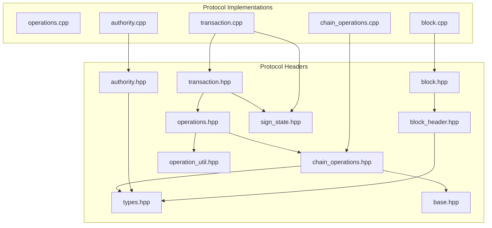
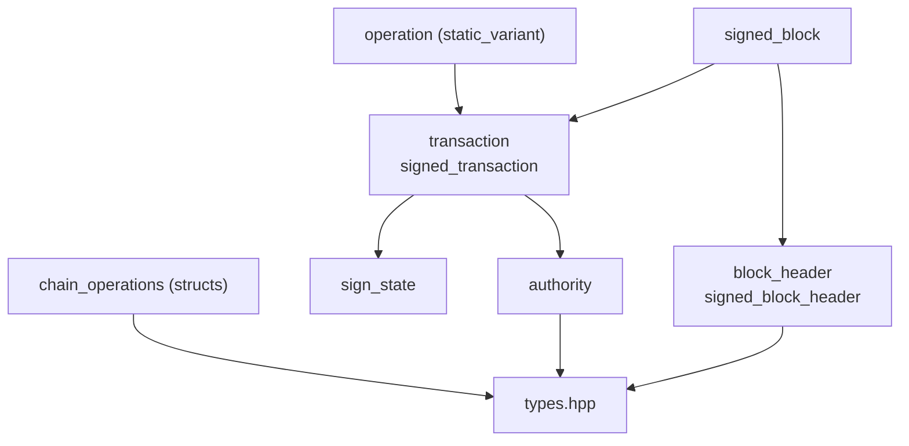
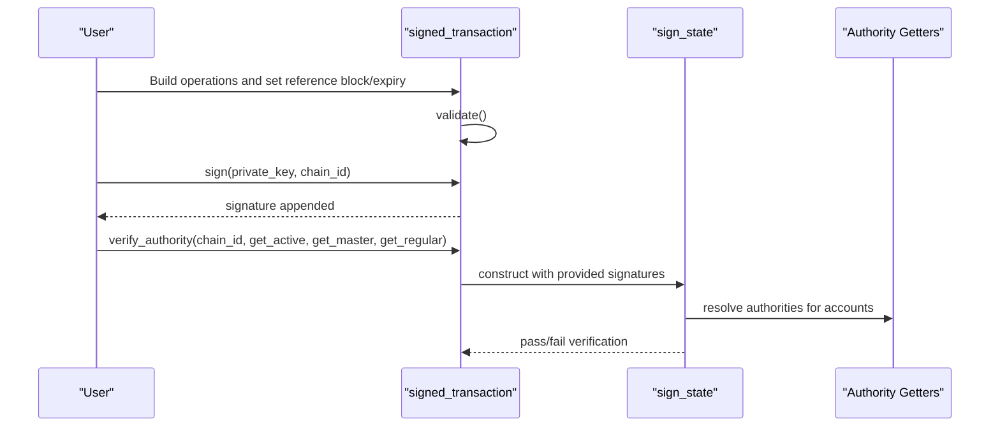
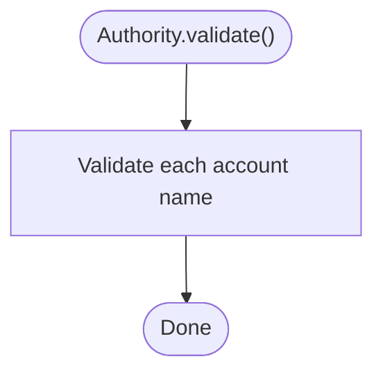
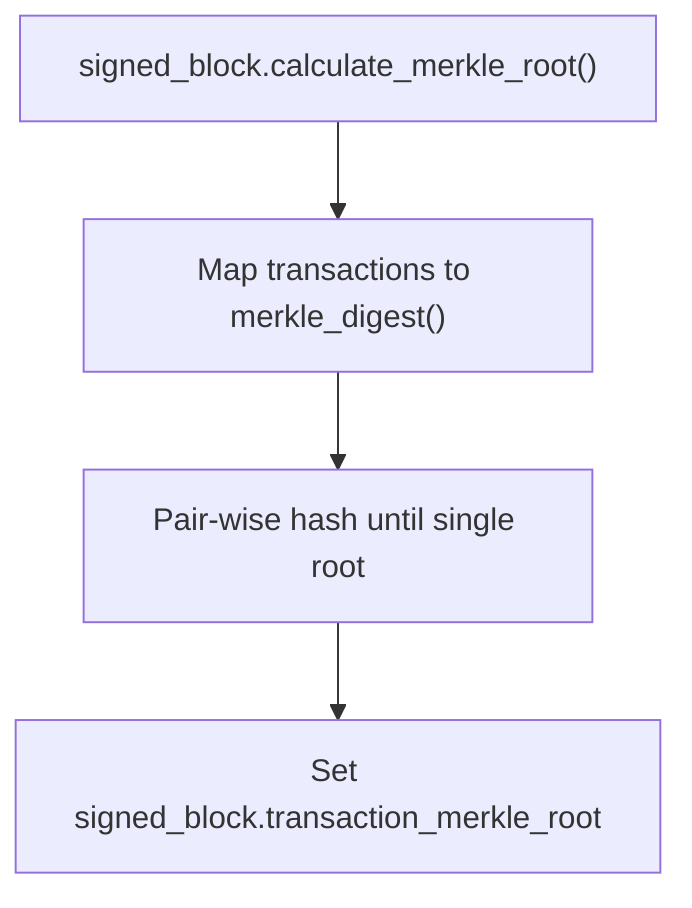
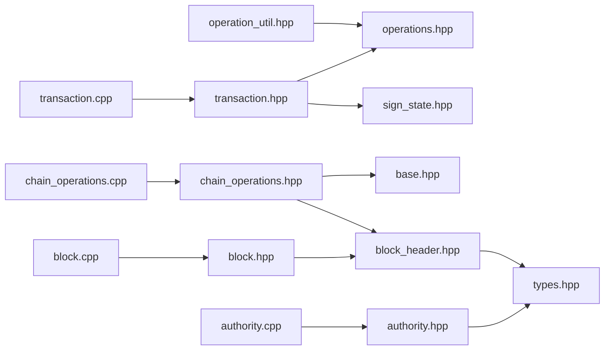

# Protocol Library

<cite>
**Referenced Files in This Document**
- [operations.hpp](file://libraries/protocol/include/graphene/protocol/operations.hpp)
- [transaction.hpp](file://libraries/protocol/include/graphene/protocol/transaction.hpp)
- [authority.hpp](file://libraries/protocol/include/graphene/protocol/authority.hpp)
- [block.hpp](file://libraries/protocol/include/graphene/protocol/block.hpp)
- [block_header.hpp](file://libraries/protocol/include/graphene/protocol/block_header.hpp)
- [chain_operations.hpp](file://libraries/protocol/include/graphene/protocol/chain_operations.hpp)
- [types.hpp](file://libraries/protocol/include/graphene/protocol/types.hpp)
- [base.hpp](file://libraries/protocol/include/graphene/protocol/base.hpp)
- [operation_util.hpp](file://libraries/protocol/include/graphene/protocol/operation_util.hpp)
- [sign_state.hpp](file://libraries/protocol/include/graphene/protocol/sign_state.hpp)
- [operations.cpp](file://libraries/protocol/operations.cpp)
- [transaction.cpp](file://libraries/protocol/transaction.cpp)
- [authority.cpp](file://libraries/protocol/authority.cpp)
- [block.cpp](file://libraries/protocol/block.cpp)
- [chain_operations.cpp](file://libraries/protocol/chain_operations.cpp)
</cite>

## Table of Contents
1. [Introduction](#introduction)
2. [Project Structure](#project-structure)
3. [Core Components](#core-components)
4. [Architecture Overview](#architecture-overview)
5. [Detailed Component Analysis](#detailed-component-analysis)
6. [Dependency Analysis](#dependency-analysis)
7. [Performance Considerations](#performance-considerations)
8. [Troubleshooting Guide](#troubleshooting-guide)
9. [Conclusion](#conclusion)
10. [Appendices](#appendices)

## Introduction
This document describes the Protocol Library that defines the blockchain’s operational framework. It covers:
- Transaction operations and their categorization
- Transaction structure, validation, signature verification, and serialization
- Authority requirements, multi-signature validation, and permission checks
- Block and block header structures, Merkle roots, and consensus-related signing
- Blockchain-specific operations and their evaluation logic
- Core data types and serialization formats
- Practical examples of operation creation, transaction building, authority verification, and block validation
- The relationship between protocol definitions and chain library implementations

## Project Structure
The Protocol Library resides under libraries/protocol and exposes headers for operations, transactions, authorities, blocks, types, and supporting utilities. Implementation files provide concrete behavior for validation, signing, and Merkle tree computation.

**Diagram sources**
- [operations.hpp](file://libraries/protocol/include/graphene/protocol/operations.hpp#L1-L131)
- [transaction.hpp](file://libraries/protocol/include/graphene/protocol/transaction.hpp#L1-L136)
- [authority.hpp](file://libraries/protocol/include/graphene/protocol/authority.hpp#L1-L115)
- [block_header.hpp](file://libraries/protocol/include/graphene/protocol/block_header.hpp#L1-L43)
- [block.hpp](file://libraries/protocol/include/graphene/protocol/block.hpp#L1-L19)
- [chain_operations.hpp](file://libraries/protocol/include/graphene/protocol/chain_operations.hpp#L1-L800)
- [types.hpp](file://libraries/protocol/include/graphene/protocol/types.hpp#L1-L235)
- [base.hpp](file://libraries/protocol/include/graphene/protocol/base.hpp#L1-L62)
- [operation_util.hpp](file://libraries/protocol/include/graphene/protocol/operation_util.hpp#L1-L35)
- [sign_state.hpp](file://libraries/protocol/include/graphene/protocol/sign_state.hpp#L1-L45)
- [operations.cpp](file://libraries/protocol/operations.cpp#L1-L58)
- [transaction.cpp](file://libraries/protocol/transaction.cpp#L1-L361)
- [authority.cpp](file://libraries/protocol/authority.cpp#L1-L228)
- [block.cpp](file://libraries/protocol/block.cpp#L1-L68)
- [chain_operations.cpp](file://libraries/protocol/chain_operations.cpp#L1-L448)

**Section sources**
- [operations.hpp](file://libraries/protocol/include/graphene/protocol/operations.hpp#L1-L131)
- [transaction.hpp](file://libraries/protocol/include/graphene/protocol/transaction.hpp#L1-L136)
- [authority.hpp](file://libraries/protocol/include/graphene/protocol/authority.hpp#L1-L115)
- [block_header.hpp](file://libraries/protocol/include/graphene/protocol/block_header.hpp#L1-L43)
- [block.hpp](file://libraries/protocol/include/graphene/protocol/block.hpp#L1-L19)
- [chain_operations.hpp](file://libraries/protocol/include/graphene/protocol/chain_operations.hpp#L1-L800)
- [types.hpp](file://libraries/protocol/include/graphene/protocol/types.hpp#L1-L235)
- [base.hpp](file://libraries/protocol/include/graphene/protocol/base.hpp#L1-L62)
- [operation_util.hpp](file://libraries/protocol/include/graphene/protocol/operation_util.hpp#L1-L35)
- [sign_state.hpp](file://libraries/protocol/include/graphene/protocol/sign_state.hpp#L1-L45)

## Core Components
- Operations: A static variant enumerating all transaction operations, including account, asset, content, governance, and virtual operations. Includes helpers to detect virtual and data operations.
- Transaction: Transaction and signed transaction structures with validation, signature digest computation, Merkle digest, and authority extraction/minimization.
- Authority: Multi-signature authority model with thresholds, account and key maps, validation, and account name rules.
- Blocks: Block header and signed block structures with Merkle root computation and witness signature verification.
- Chain Operations: Strongly-typed operation structs with validation logic and required authority hooks.
- Types: Core blockchain types (names, keys, amounts, hashes, digests) and serialization support.

**Section sources**
- [operations.hpp](file://libraries/protocol/include/graphene/protocol/operations.hpp#L10-L131)
- [transaction.hpp](file://libraries/protocol/include/graphene/protocol/transaction.hpp#L12-L136)
- [authority.hpp](file://libraries/protocol/include/graphene/protocol/authority.hpp#L9-L115)
- [block_header.hpp](file://libraries/protocol/include/graphene/protocol/block_header.hpp#L8-L43)
- [block.hpp](file://libraries/protocol/include/graphene/protocol/block.hpp#L9-L19)
- [chain_operations.hpp](file://libraries/protocol/include/graphene/protocol/chain_operations.hpp#L11-L800)
- [types.hpp](file://libraries/protocol/include/graphene/protocol/types.hpp#L75-L235)

## Architecture Overview
The Protocol Library composes operations into transactions, validates each operation, computes digests for signing and Merkle roots, and enforces authority requirements. Blocks encapsulate transactions and enforce witness signatures.

**Diagram sources**
- [operations.hpp](file://libraries/protocol/include/graphene/protocol/operations.hpp#L13-L102)
- [transaction.hpp](file://libraries/protocol/include/graphene/protocol/transaction.hpp#L12-L101)
- [authority.hpp](file://libraries/protocol/include/graphene/protocol/authority.hpp#L9-L57)
- [block_header.hpp](file://libraries/protocol/include/graphene/protocol/block_header.hpp#L8-L35)
- [block.hpp](file://libraries/protocol/include/graphene/protocol/block.hpp#L9-L13)
- [chain_operations.hpp](file://libraries/protocol/include/graphene/protocol/chain_operations.hpp#L11-L29)
- [types.hpp](file://libraries/protocol/include/graphene/protocol/types.hpp#L75-L112)

## Detailed Component Analysis

### Operations: Transaction Operation Types
- The operation static variant enumerates all supported operations, including deprecated entries, regular operations, and virtual operations. It also exposes helpers to classify operations (virtual/data).
- The operation wrapper supports reflection and serialization.

Key responsibilities:
- Define the canonical operation set
- Provide classification helpers
- Enable reflection-based serialization

**Section sources**
- [operations.hpp](file://libraries/protocol/include/graphene/protocol/operations.hpp#L13-L131)
- [operations.cpp](file://libraries/protocol/operations.cpp#L8-L52)

### Transaction: Validation, Serialization, and Authority
- Transaction structure includes reference block fields, expiration, operations, and extensions. It computes digests for validation and signing.
- Signed transaction extends transaction with signatures and provides signing, signature minimization, and authority verification.
- Authority verification logic:
  - Extracts required authorities from operations
  - Supports regular authority vs active/master mixing constraints
  - Uses sign_state to track provided signatures/approvals and validate recursively

Processing highlights:
- Transaction::validate ensures at least one operation and delegates per-operation validation
- Transaction::sig_digest constructs the digest used for signing
- Signed transaction methods compute Merkle digest and minimize required signatures

**Diagram sources**
- [transaction.hpp](file://libraries/protocol/include/graphene/protocol/transaction.hpp#L12-L136)
- [transaction.cpp](file://libraries/protocol/transaction.cpp#L30-L222)
- [sign_state.hpp](file://libraries/protocol/include/graphene/protocol/sign_state.hpp#L10-L42)

**Section sources**
- [transaction.hpp](file://libraries/protocol/include/graphene/protocol/transaction.hpp#L12-L136)
- [transaction.cpp](file://libraries/protocol/transaction.cpp#L11-L361)
- [sign_state.hpp](file://libraries/protocol/include/graphene/protocol/sign_state.hpp#L8-L45)

### Authority: Requirement Calculation and Multi-Signature Validation
- Authority model supports thresholds and maps of account weights and key weights.
- Provides validation of account names, domain names, and impossibility checks.
- Offers helpers to enumerate keys and count authorities.

Validation logic:
- Name validation enforces length, character sets, and domain rules
- Threshold satisfaction checked during verification
- Recursive checks via sign_state with configurable depth

**Diagram sources**
- [authority.hpp](file://libraries/protocol/include/graphene/protocol/authority.hpp#L44-L48)
- [authority.cpp](file://libraries/protocol/authority.cpp#L44-L48)

**Section sources**
- [authority.hpp](file://libraries/protocol/include/graphene/protocol/authority.hpp#L9-L115)
- [authority.cpp](file://libraries/protocol/authority.cpp#L7-L228)

### Blocks and Block Headers: Validation and Consensus
- Block header includes previous ID, timestamp, witness, and Merkle root of transactions.
- Signed block header adds witness signature and methods to compute ID and validate signee.
- Signed block computes Merkle root over transaction digests.

Consensus implications:
- Witness signature verification ensures block validity
- Merkle root ensures transaction integrity

**Diagram sources**
- [block_header.hpp](file://libraries/protocol/include/graphene/protocol/block_header.hpp#L8-L35)
- [block.hpp](file://libraries/protocol/include/graphene/protocol/block.hpp#L9-L13)
- [block.cpp](file://libraries/protocol/block.cpp#L35-L64)

**Section sources**
- [block_header.hpp](file://libraries/protocol/include/graphene/protocol/block_header.hpp#L8-L43)
- [block.hpp](file://libraries/protocol/include/graphene/protocol/block.hpp#L9-L19)
- [block.cpp](file://libraries/protocol/block.cpp#L6-L68)

### Chain Operations: Evaluation Logic and Constraints
- Strongly typed operation structs define required authorities and validation rules.
- Examples include account creation/update/metadata, transfers, vesting, witness updates, chain property updates, escrow operations, custom operations, and governance-related operations (committee, invite, paid subscription, account sales, awards, etc.).
- Validation enforces symbol types, numeric bounds, UTF-8 and JSON constraints, permlink rules, and account name rules.

Evaluation highlights:
- Each operation implements validate() and required authority hooks
- Static variants of chain properties support hardfork evolution

**Section sources**
- [chain_operations.hpp](file://libraries/protocol/include/graphene/protocol/chain_operations.hpp#L11-L800)
- [chain_operations.cpp](file://libraries/protocol/chain_operations.cpp#L39-L448)
- [base.hpp](file://libraries/protocol/include/graphene/protocol/base.hpp#L12-L41)

### Types: Data Types and Serialization
- Defines blockchain primitives: account names, keys, amounts, digests, signatures, and hashes.
- Provides reflection and serialization support for types and public keys.
- Includes comparison functors and convenience typedefs.

Serialization characteristics:
- Public keys support base58 encoding/decoding and binary representation
- Safe integer types and big-integer types for precise arithmetic

**Section sources**
- [types.hpp](file://libraries/protocol/include/graphene/protocol/types.hpp#L75-L235)

## Dependency Analysis
- operations.hpp depends on operation utilities and chain operations
- transaction.hpp depends on operations, sign_state, and types
- authority.hpp depends on types
- block.hpp depends on block_header.hpp and transaction.hpp
- chain_operations.hpp depends on base.hpp, block_header.hpp, and asset definitions
- Implementations depend on fc library for hashing, crypto, and serialization

**Diagram sources**
- [operation_util.hpp](file://libraries/protocol/include/graphene/protocol/operation_util.hpp#L1-L35)
- [operations.hpp](file://libraries/protocol/include/graphene/protocol/operations.hpp#L3-L6)
- [chain_operations.hpp](file://libraries/protocol/include/graphene/protocol/chain_operations.hpp#L3-L6)
- [base.hpp](file://libraries/protocol/include/graphene/protocol/base.hpp#L3-L6)
- [block_header.hpp](file://libraries/protocol/include/graphene/protocol/block_header.hpp#L3-L4)
- [transaction.hpp](file://libraries/protocol/include/graphene/protocol/transaction.hpp#L3-L5)
- [sign_state.hpp](file://libraries/protocol/include/graphene/protocol/sign_state.hpp#L3-L4)
- [authority.hpp](file://libraries/protocol/include/graphene/protocol/authority.hpp#L3-L4)
- [types.hpp](file://libraries/protocol/include/graphene/protocol/types.hpp#L3-L7)
- [block.hpp](file://libraries/protocol/include/graphene/protocol/block.hpp#L3-L4)
- [transaction.cpp](file://libraries/protocol/transaction.cpp#L1-L361)
- [authority.cpp](file://libraries/protocol/authority.cpp#L1-L228)
- [block.cpp](file://libraries/protocol/block.cpp#L1-L68)
- [chain_operations.cpp](file://libraries/protocol/chain_operations.cpp#L1-L448)

**Section sources**
- [operations.hpp](file://libraries/protocol/include/graphene/protocol/operations.hpp#L3-L6)
- [transaction.hpp](file://libraries/protocol/include/graphene/protocol/transaction.hpp#L3-L5)
- [authority.hpp](file://libraries/protocol/include/graphene/protocol/authority.hpp#L3-L4)
- [block.hpp](file://libraries/protocol/include/graphene/protocol/block.hpp#L3-L4)
- [chain_operations.hpp](file://libraries/protocol/include/graphene/protocol/chain_operations.hpp#L3-L6)
- [base.hpp](file://libraries/protocol/include/graphene/protocol/base.hpp#L3-L6)
- [types.hpp](file://libraries/protocol/include/graphene/protocol/types.hpp#L3-L7)
- [operation_util.hpp](file://libraries/protocol/include/graphene/protocol/operation_util.hpp#L1-L35)
- [sign_state.hpp](file://libraries/protocol/include/graphene/protocol/sign_state.hpp#L3-L4)

## Performance Considerations
- Authority verification recursion depth is bounded to prevent excessive computation
- Signature minimization prunes unnecessary signatures while preserving validity
- Merkle root computation scales logarithmically with transaction count
- Validation enforces early exits on constraint violations to reduce overhead

[No sources needed since this section provides general guidance]

## Troubleshooting Guide
Common issues and diagnostics:
- Transaction missing required signatures or approvals
- Irrelevant signatures or approvals detected during verification
- Authority thresholds not met or invalid account names
- Block header signature mismatch or invalid witness

Diagnostics:
- verify_authority throws specific exceptions for missing authorities and irrelevant inputs
- assert_unused_approvals reports unused signatures/approvals
- Authority::is_impossible helps detect unsatisfiable authorities

**Section sources**
- [transaction.cpp](file://libraries/protocol/transaction.cpp#L76-L222)
- [authority.cpp](file://libraries/protocol/authority.cpp#L24-L33)

## Conclusion
The Protocol Library provides a robust foundation for blockchain operations, transactions, authorities, and blocks. Its design emphasizes strong typing, clear separation of concerns, and extensibility for governance and content features. Implementations ensure correctness through rigorous validation, cryptographic signing, and Merkle integrity checks.

[No sources needed since this section summarizes without analyzing specific files]

## Appendices

### Example Workflows

#### Operation Creation and Classification
- Create operations using strongly typed structs from chain_operations.hpp
- Use is_virtual_operation and is_data_operation helpers from operations.cpp to classify operations

**Section sources**
- [chain_operations.hpp](file://libraries/protocol/include/graphene/protocol/chain_operations.hpp#L11-L138)
- [operations.cpp](file://libraries/protocol/operations.cpp#L17-L52)

#### Transaction Building and Signing
- Assemble operations into a transaction, set reference block and expiration
- Sign with private key and append signature; verify authority using provided getters

**Section sources**
- [transaction.hpp](file://libraries/protocol/include/graphene/protocol/transaction.hpp#L57-L101)
- [transaction.cpp](file://libraries/protocol/transaction.cpp#L45-L92)

#### Authority Verification
- Extract required authorities from operations and verify via sign_state
- Respect mixing constraints between regular and active/master authorities

**Section sources**
- [transaction.cpp](file://libraries/protocol/transaction.cpp#L94-L222)
- [sign_state.hpp](file://libraries/protocol/include/graphene/protocol/sign_state.hpp#L10-L42)

#### Block Validation
- Compute signed block header ID and validate witness signature
- Recompute Merkle root from transaction digests and compare with block header

**Section sources**
- [block_header.hpp](file://libraries/protocol/include/graphene/protocol/block_header.hpp#L25-L35)
- [block.cpp](file://libraries/protocol/block.cpp#L14-L64)

### Relationship Between Protocol Definitions and Chain Library Implementations
- Protocol headers define operation semantics, types, and structures
- Chain library evaluators consume operations and apply state transitions
- Protocol implementations (transaction.cpp, authority.cpp, block.cpp, chain_operations.cpp) provide runtime behavior aligned with protocol definitions

**Section sources**
- [operations.hpp](file://libraries/protocol/include/graphene/protocol/operations.hpp#L13-L131)
- [transaction.cpp](file://libraries/protocol/transaction.cpp#L1-L361)
- [authority.cpp](file://libraries/protocol/authority.cpp#L1-L228)
- [block.cpp](file://libraries/protocol/block.cpp#L1-L68)
- [chain_operations.cpp](file://libraries/protocol/chain_operations.cpp#L1-L448)