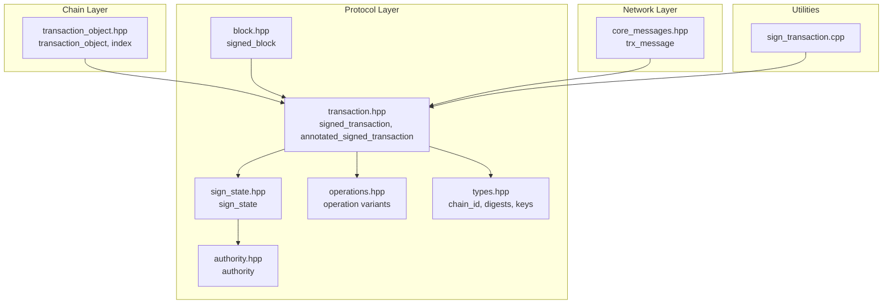
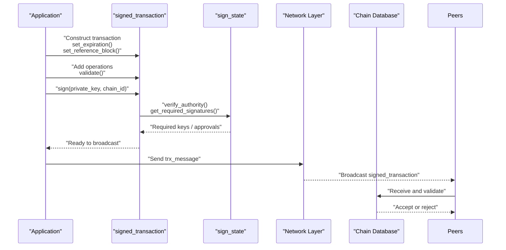
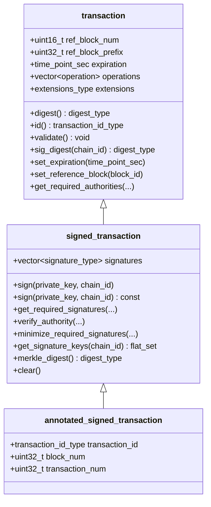
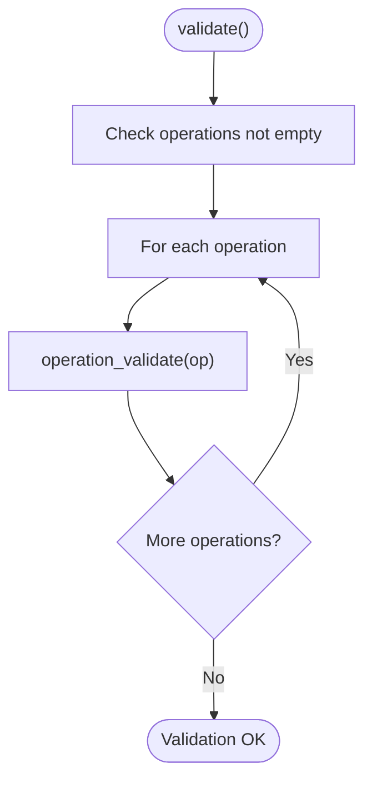
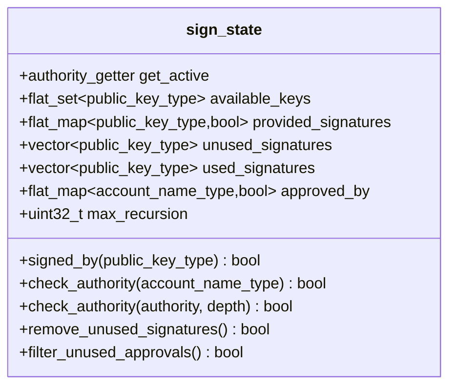
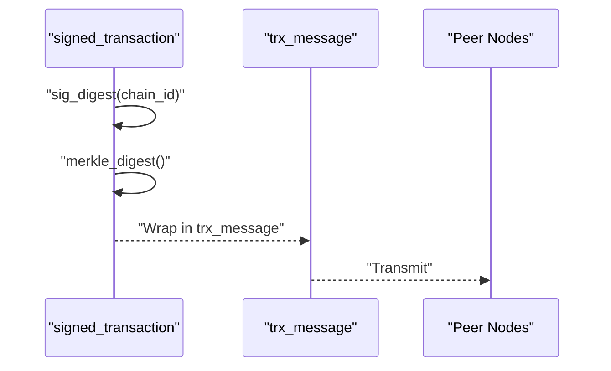
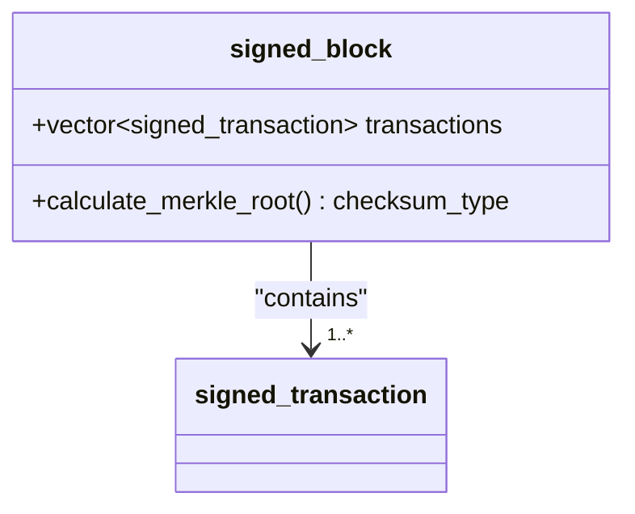
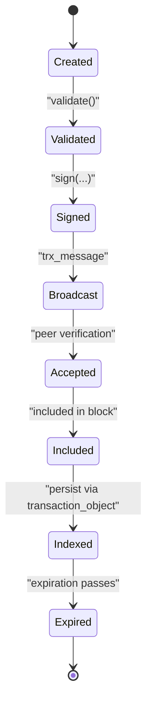
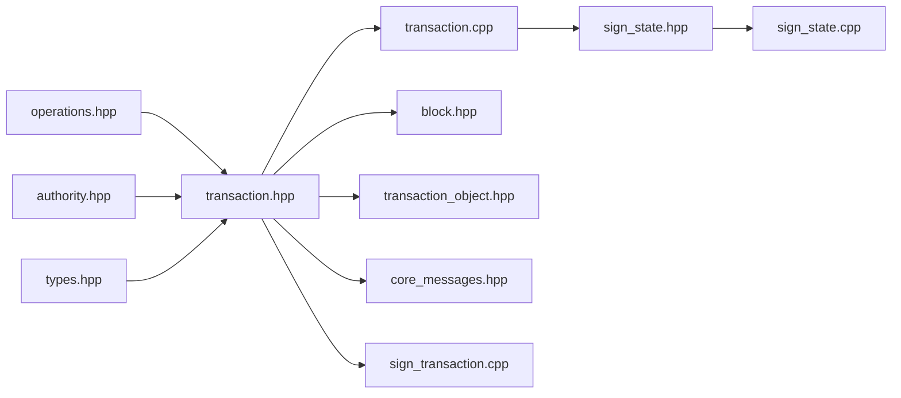

# Transaction Processing

<cite>
**Referenced Files in This Document**
- [transaction.hpp](file://libraries/protocol/include/graphene/protocol/transaction.hpp)
- [transaction.cpp](file://libraries/protocol/transaction.cpp)
- [sign_state.hpp](file://libraries/protocol/include/graphene/protocol/sign_state.hpp)
- [sign_state.cpp](file://libraries/protocol/sign_state.cpp)
- [operations.hpp](file://libraries/protocol/include/graphene/protocol/operations.hpp)
- [authority.hpp](file://libraries/protocol/include/graphene/protocol/authority.hpp)
- [types.hpp](file://libraries/protocol/include/graphene/protocol/types.hpp)
- [block.hpp](file://libraries/protocol/include/graphene/protocol/block.hpp)
- [transaction_object.hpp](file://libraries/chain/include/graphene/chain/transaction_object.hpp)
- [transaction_object.cpp](file://libraries/chain/transaction_object.cpp)
- [core_messages.hpp](file://libraries/network/include/graphene/network/core_messages.hpp)
- [sign_transaction.cpp](file://programs/util/sign_transaction.cpp)
</cite>

## Table of Contents
1. [Introduction](#introduction)
2. [Project Structure](#project-structure)
3. [Core Components](#core-components)
4. [Architecture Overview](#architecture-overview)
5. [Detailed Component Analysis](#detailed-component-analysis)
6. [Dependency Analysis](#dependency-analysis)
7. [Performance Considerations](#performance-considerations)
8. [Troubleshooting Guide](#troubleshooting-guide)
9. [Conclusion](#conclusion)
10. [Appendices](#appendices)

## Introduction
This document explains the Transaction Processing subsystem in the VIZ C++ node. It covers transaction structure, validation, signing, multi-signature authority checks, serialization, and network transport. It also describes the relationship between transactions and blocks, and outlines the transaction lifecycle from creation to inclusion in a block.

## Project Structure
The transaction processing logic spans several libraries:
- Protocol layer: transaction definition, signing, authority verification, and types
- Chain layer: persistence and indexing of transactions
- Network layer: message framing for transaction broadcast
- Utilities: example signing tool

**Diagram sources**
- [transaction.hpp](file://libraries/protocol/include/graphene/protocol/transaction.hpp#L12-L136)
- [sign_state.hpp](file://libraries/protocol/include/graphene/protocol/sign_state.hpp#L10-L42)
- [operations.hpp](file://libraries/protocol/include/graphene/protocol/operations.hpp#L13-L131)
- [authority.hpp](file://libraries/protocol/include/graphene/protocol/authority.hpp#L9-L57)
- [types.hpp](file://libraries/protocol/include/graphene/protocol/types.hpp#L75-L235)
- [block.hpp](file://libraries/protocol/include/graphene/protocol/block.hpp#L9-L18)
- [transaction_object.hpp](file://libraries/chain/include/graphene/chain/transaction_object.hpp#L19-L56)
- [core_messages.hpp](file://libraries/network/include/graphene/network/core_messages.hpp#L99-L110)
- [sign_transaction.cpp](file://programs/util/sign_transaction.cpp#L12-L27)

**Section sources**
- [transaction.hpp](file://libraries/protocol/include/graphene/protocol/transaction.hpp#L1-L136)
- [transaction.cpp](file://libraries/protocol/transaction.cpp#L1-L361)
- [sign_state.hpp](file://libraries/protocol/include/graphene/protocol/sign_state.hpp#L1-L45)
- [sign_state.cpp](file://libraries/protocol/sign_state.cpp#L1-L107)
- [operations.hpp](file://libraries/protocol/include/graphene/protocol/operations.hpp#L1-L131)
- [authority.hpp](file://libraries/protocol/include/graphene/protocol/authority.hpp#L1-L115)
- [types.hpp](file://libraries/protocol/include/graphene/protocol/types.hpp#L1-L235)
- [block.hpp](file://libraries/protocol/include/graphene/protocol/block.hpp#L1-L19)
- [transaction_object.hpp](file://libraries/chain/include/graphene/chain/transaction_object.hpp#L1-L56)
- [transaction_object.cpp](file://libraries/chain/transaction_object.cpp#L1-L73)
- [core_messages.hpp](file://libraries/network/include/graphene/network/core_messages.hpp#L1-L573)
- [sign_transaction.cpp](file://programs/util/sign_transaction.cpp#L1-L54)

## Core Components
- Transaction: Base structure with reference block fields, expiration, operation array, and extensions. Provides ID calculation, validation, and signature digest computation.
- Signed Transaction: Extends transaction with signatures and authority helpers for signing, verification, minimal signature sets, and Merkle hashing.
- Annotated Signed Transaction: Adds block number and transaction number metadata for post-inclusion reporting.
- Sign State: Multi-signature validation engine that tracks provided signatures, required authorities, recursion depth, and unused approvals/signatures filtering.
- Authority: Composite authority model supporting key weights, account delegations, thresholds, and classification.
- Operations: Static variant of supported operations; each operation contributes required authorities and validates itself.
- Types: Core cryptographic and identity types (chain ID, digests, signatures, keys).
- Block: Contains a vector of signed transactions forming the block payload.
- Transaction Object: Chain-side persisted representation for duplicate detection and expiration management.
- Network Messages: Defines the transaction message type for P2P broadcast.

**Section sources**
- [transaction.hpp](file://libraries/protocol/include/graphene/protocol/transaction.hpp#L12-L136)
- [transaction.cpp](file://libraries/protocol/transaction.cpp#L17-L361)
- [sign_state.hpp](file://libraries/protocol/include/graphene/protocol/sign_state.hpp#L10-L42)
- [sign_state.cpp](file://libraries/protocol/sign_state.cpp#L6-L107)
- [authority.hpp](file://libraries/protocol/include/graphene/protocol/authority.hpp#L9-L57)
- [operations.hpp](file://libraries/protocol/include/graphene/protocol/operations.hpp#L13-L131)
- [types.hpp](file://libraries/protocol/include/graphene/protocol/types.hpp#L75-L235)
- [block.hpp](file://libraries/protocol/include/graphene/protocol/block.hpp#L9-L18)
- [transaction_object.hpp](file://libraries/chain/include/graphene/chain/transaction_object.hpp#L19-L56)

## Architecture Overview
End-to-end flow from transaction creation to block inclusion and network propagation:

**Diagram sources**
- [transaction.cpp](file://libraries/protocol/transaction.cpp#L45-L357)
- [sign_state.cpp](file://libraries/protocol/sign_state.cpp#L19-L59)
- [core_messages.hpp](file://libraries/network/include/graphene/network/core_messages.hpp#L99-L110)
- [block.hpp](file://libraries/protocol/include/graphene/protocol/block.hpp#L9-L18)

## Detailed Component Analysis

### Transaction Structure and Lifecycle
- Fields:
  - Reference block number and prefix for replay protection
  - Expiration timestamp
  - Operation array (non-empty requirement enforced)
  - Extensions placeholder
- Methods:
  - ID calculation via digest
  - Validation ensuring at least one operation and per-operation validation
  - Signature digest computation for signing
  - Helper setters for expiration and reference block
  - Required authorities extraction from operations
- Lifecycle:
  - Creation: set reference block and expiration
  - Validation: validate operations and structure
  - Signing: compute sig_digest and append signatures
  - Broadcast: wrap in network message
  - Execution: included in signed_block.transactions during block production/acceptance
  - Persistence: indexed by transaction_object for duplicate detection and expiration cleanup

**Diagram sources**
- [transaction.hpp](file://libraries/protocol/include/graphene/protocol/transaction.hpp#L12-L136)

**Section sources**
- [transaction.hpp](file://libraries/protocol/include/graphene/protocol/transaction.hpp#L12-L136)
- [transaction.cpp](file://libraries/protocol/transaction.cpp#L17-L74)

### Validation Rules
- Structural validation:
  - Non-empty operations array
  - Per-operation validation invoked during transaction.validate()
- Expiration:
  - Expiration enforced by higher layers; transaction stores expiration and computes sig_digest using chain_id and transaction body
- Operation validation:
  - Each operation’s validate() is called during transaction.validate()
- Authority verification:
  - Extract required authorities from operations
  - Enforce authority mixing rules (e.g., regular authority cannot mix with active/master in same transaction)
  - Verify signatures against keys and account delegations up to recursion depth

**Diagram sources**
- [transaction.cpp](file://libraries/protocol/transaction.cpp#L30-L36)

**Section sources**
- [transaction.cpp](file://libraries/protocol/transaction.cpp#L30-L36)

### Multi-Signature Validation and Authority Checking
- sign_state tracks:
  - Provided signatures keyed by public key
  - Used vs unused signatures after verification
  - Accounts approved by existing approvals
  - Unused approvals filtered out
- Authority evaluation:
  - Key weights meet threshold
  - Account delegations evaluated via authority getters
  - Recursion depth controlled by max_recursion
- Verification modes:
  - Regular authority mode enforces stricter separation
  - Active/master authority modes combine delegated checks
- Helpers:
  - get_required_signatures(): determines minimal keys required given available keys
  - minimize_required_signatures(): removes redundant signatures while preserving validity
  - verify_authority(): end-to-end authority verification

**Diagram sources**
- [sign_state.hpp](file://libraries/protocol/include/graphene/protocol/sign_state.hpp#L10-L42)

**Section sources**
- [sign_state.hpp](file://libraries/protocol/include/graphene/protocol/sign_state.hpp#L10-L42)
- [sign_state.cpp](file://libraries/protocol/sign_state.cpp#L6-L107)
- [transaction.cpp](file://libraries/protocol/transaction.cpp#L94-L222)
- [transaction.cpp](file://libraries/protocol/transaction.cpp#L240-L357)

### Serialization and Network Transmission
- Transaction serialization:
  - Digest computed by raw packing of the transaction
  - Signature digest computed by raw packing of chain_id followed by transaction
  - Merkle digest for signed transactions computed by raw packing the signed transaction
- Network messages:
  - trx_message carries a signed_transaction for P2P broadcast
  - Core message type for transactions is defined and reflected
- Block integration:
  - signed_block contains a vector of signed_transaction

**Diagram sources**
- [transaction.cpp](file://libraries/protocol/transaction.cpp#L11-L28)
- [core_messages.hpp](file://libraries/network/include/graphene/network/core_messages.hpp#L99-L110)
- [block.hpp](file://libraries/protocol/include/graphene/protocol/block.hpp#L9-L18)

**Section sources**
- [transaction.cpp](file://libraries/protocol/transaction.cpp#L11-L28)
- [core_messages.hpp](file://libraries/network/include/graphene/network/core_messages.hpp#L99-L110)
- [block.hpp](file://libraries/protocol/include/graphene/protocol/block.hpp#L9-L18)

### Relationship Between Transactions and Blocks
- A block is a signed container holding a sequence of signed transactions.
- Each block maintains a Merkle root derived from its transactions.
- On acceptance, transactions become part of the blockchain state transitions.

**Diagram sources**
- [block.hpp](file://libraries/protocol/include/graphene/protocol/block.hpp#L9-L18)

**Section sources**
- [block.hpp](file://libraries/protocol/include/graphene/protocol/block.hpp#L9-L18)

### Transaction Lifecycle Management
- Duplicate detection and expiration:
  - transaction_object persists packed transactions with expiration and id
  - Index supports lookup by id and expiration ordering
  - Expiration-based cleanup occurs during block processing
- Lifecycle stages:
  - Constructed locally
  - Validated and signed
  - Broadcast via P2P
  - Verified by peers
  - Included in a block
  - Indexed for duplicate detection and eventual expiration removal

**Diagram sources**
- [transaction_object.hpp](file://libraries/chain/include/graphene/chain/transaction_object.hpp#L19-L56)
- [transaction_object.cpp](file://libraries/chain/transaction_object.cpp#L6-L73)

**Section sources**
- [transaction_object.hpp](file://libraries/chain/include/graphene/chain/transaction_object.hpp#L19-L56)
- [transaction_object.cpp](file://libraries/chain/transaction_object.cpp#L6-L73)

## Dependency Analysis
Key dependencies among transaction processing components:

**Diagram sources**
- [operations.hpp](file://libraries/protocol/include/graphene/protocol/operations.hpp#L13-L131)
- [authority.hpp](file://libraries/protocol/include/graphene/protocol/authority.hpp#L9-L57)
- [types.hpp](file://libraries/protocol/include/graphene/protocol/types.hpp#L75-L235)
- [transaction.hpp](file://libraries/protocol/include/graphene/protocol/transaction.hpp#L12-L136)
- [transaction.cpp](file://libraries/protocol/transaction.cpp#L1-L361)
- [sign_state.hpp](file://libraries/protocol/include/graphene/protocol/sign_state.hpp#L10-L42)
- [sign_state.cpp](file://libraries/protocol/sign_state.cpp#L1-L107)
- [block.hpp](file://libraries/protocol/include/graphene/protocol/block.hpp#L9-L18)
- [transaction_object.hpp](file://libraries/chain/include/graphene/chain/transaction_object.hpp#L19-L56)
- [core_messages.hpp](file://libraries/network/include/graphene/network/core_messages.hpp#L99-L110)
- [sign_transaction.cpp](file://programs/util/sign_transaction.cpp#L12-L27)

**Section sources**
- [transaction.hpp](file://libraries/protocol/include/graphene/protocol/transaction.hpp#L12-L136)
- [transaction.cpp](file://libraries/protocol/transaction.cpp#L1-L361)
- [sign_state.hpp](file://libraries/protocol/include/graphene/protocol/sign_state.hpp#L10-L42)
- [sign_state.cpp](file://libraries/protocol/sign_state.cpp#L1-L107)
- [operations.hpp](file://libraries/protocol/include/graphene/protocol/operations.hpp#L13-L131)
- [authority.hpp](file://libraries/protocol/include/graphene/protocol/authority.hpp#L9-L57)
- [types.hpp](file://libraries/protocol/include/graphene/protocol/types.hpp#L75-L235)
- [block.hpp](file://libraries/protocol/include/graphene/protocol/block.hpp#L9-L18)
- [transaction_object.hpp](file://libraries/chain/include/graphene/chain/transaction_object.hpp#L19-L56)
- [core_messages.hpp](file://libraries/network/include/graphene/network/core_messages.hpp#L99-L110)
- [sign_transaction.cpp](file://programs/util/sign_transaction.cpp#L12-L27)

## Performance Considerations
- Signature verification cost scales with number of operations and authorities; minimize required signatures using minimize_required_signatures.
- Authority recursion depth limits prevent deep traversal; tune max_recursion appropriately.
- Serialization overhead is linear in transaction size; keep operations minimal and avoid unnecessary extensions.
- Network bandwidth: broadcast only validated transactions; leverage peer inventory messages to reduce redundant transmissions.

## Troubleshooting Guide
Common validation and signing issues:
- Missing or extra signatures:
  - verify_authority reports unused signatures and missing authorities
  - assert_unused_approvals filters and reports unused approvals
- Authority mismatches:
  - Mixing regular authority with active/master in same transaction is disallowed
  - Missing required active/master/regular authorities cause assertion failures
- Duplicate signatures:
  - get_signature_keys enforces uniqueness of signatures
- Expiration:
  - Ensure expiration is set and within acceptable range; transactions past expiration are rejected

Operational tips:
- Use the signing utility to compute digest and sig_digest for debugging
- Inspect transaction id and block_num/transaction_num in annotated_signed_transaction for post-inclusion tracing

**Section sources**
- [transaction.cpp](file://libraries/protocol/transaction.cpp#L76-L92)
- [transaction.cpp](file://libraries/protocol/transaction.cpp#L94-L222)
- [transaction.cpp](file://libraries/protocol/transaction.cpp#L225-L237)
- [sign_transaction.cpp](file://programs/util/sign_transaction.cpp#L12-L27)

## Conclusion
The transaction processing subsystem integrates a robust transaction model, strong authority verification, efficient serialization, and clear lifecycle management. By leveraging signed_transaction helpers, sign_state, and transaction_object, the system ensures secure, deterministic, and efficient transaction handling across the network and into the blockchain.

## Appendices

### Example Workflows

- Constructing and signing a transaction:
  - Set reference block and expiration
  - Add operations and validate
  - Compute sig_digest and append signatures
  - Broadcast via trx_message

- Authority minimization:
  - Determine required signatures given available keys
  - Minimize signatures while preserving authority coverage

- Network transmission:
  - Wrap signed_transaction in trx_message
  - Send to peers; handle inventory and fetch requests

**Section sources**
- [transaction.cpp](file://libraries/protocol/transaction.cpp#L58-L65)
- [transaction.cpp](file://libraries/protocol/transaction.cpp#L240-L357)
- [core_messages.hpp](file://libraries/network/include/graphene/network/core_messages.hpp#L99-L110)
- [sign_transaction.cpp](file://programs/util/sign_transaction.cpp#L28-L54)