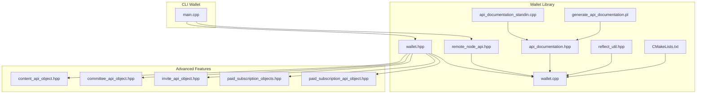
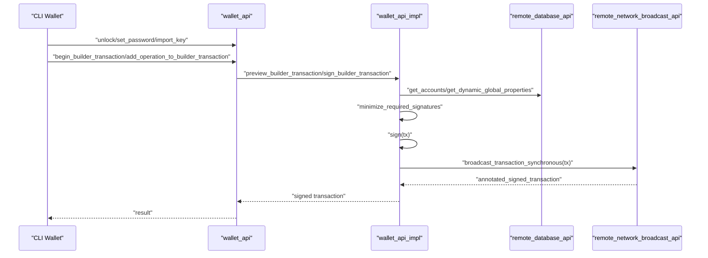
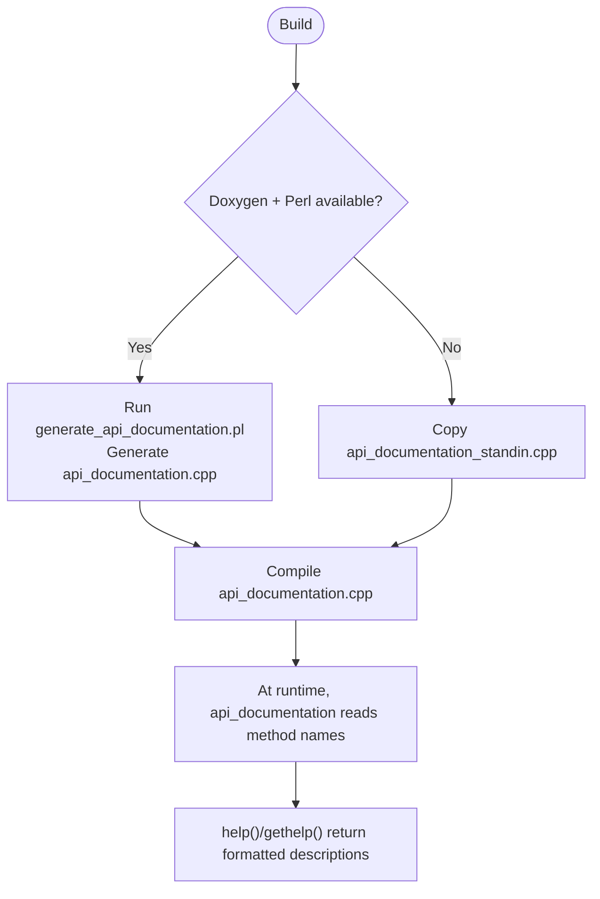
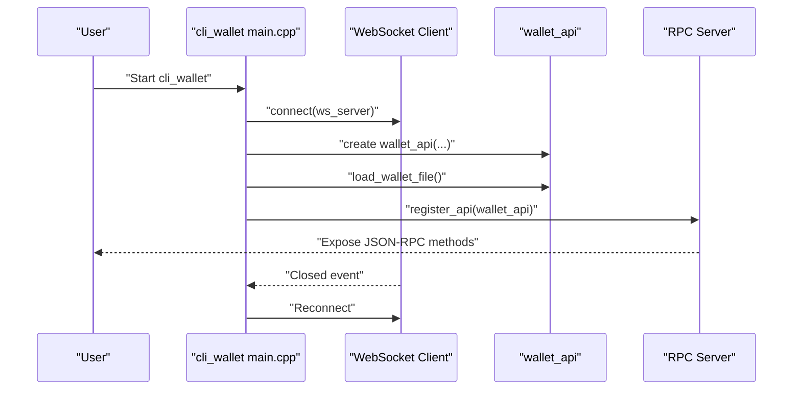
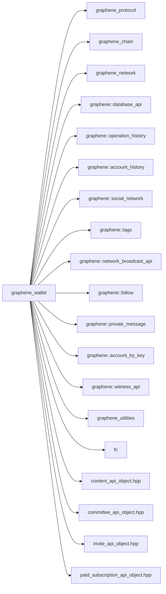

# Wallet Library

<cite>
**Referenced Files in This Document**
- [wallet.hpp](file://libraries/wallet/include/graphene/wallet/wallet.hpp)
- [remote_node_api.hpp](file://libraries/wallet/include/graphene/wallet/remote_node_api.hpp)
- [api_documentation.hpp](file://libraries/wallet/include/graphene/wallet/api_documentation.hpp)
- [reflect_util.hpp](file://libraries/wallet/include/graphene/wallet/reflect_util.hpp)
- [wallet.cpp](file://libraries/wallet/wallet.cpp)
- [api_documentation_standin.cpp](file://libraries/wallet/api_documentation_standin.cpp)
- [generate_api_documentation.pl](file://libraries/wallet/generate_api_documentation.pl)
- [CMakeLists.txt](file://libraries/wallet/CMakeLists.txt)
- [main.cpp](file://programs/cli_wallet/main.cpp)
- [content_api_object.hpp](file://libraries/api/include/graphene/api/content_api_object.hpp)
- [committee_api_object.hpp](file://libraries/api/include/graphene/api/committee_api_object.hpp)
- [invite_api_object.hpp](file://libraries/api/include/graphene/api/invite_api_object.hpp)
- [content_object.hpp](file://libraries/chain/include/graphene/chain/content_object.hpp)
- [paid_subscription_objects.hpp](file://libraries/chain/include/graphene/chain/paid_subscription_objects.hpp)
- [paid_subscription_api_object.hpp](file://libraries/api/include/graphene/api/paid_subscription_api_object.hpp)
</cite>

## Update Summary
**Changes Made**
- Added comprehensive documentation for new wallet operations including custom operations broadcasting, content management, committee system operations, invite functionality, reward systems, subscription management, and account marketplace features
- Updated wallet API surface documentation to reflect 25+ new operations covering advanced blockchain interaction capabilities
- Enhanced transaction builder API documentation with new operation types
- Added detailed coverage of content creation, voting, and reward distribution systems
- Documented committee work request management and voting mechanisms
- Added invite system operations for account creation and fund transfers
- Documented paid subscription management and marketplace operations
- Updated architecture diagrams to reflect expanded API surface

## Table of Contents
1. [Introduction](#introduction)
2. [Project Structure](#project-structure)
3. [Core Components](#core-components)
4. [Architecture Overview](#architecture-overview)
5. [Detailed Component Analysis](#detailed-component-analysis)
6. [Advanced Wallet Operations](#advanced-wallet-operations)
7. [Dependency Analysis](#dependency-analysis)
8. [Performance Considerations](#performance-considerations)
9. [Troubleshooting Guide](#troubleshooting-guide)
10. [Conclusion](#conclusion)
11. [Appendices](#appendices)

## Introduction
This document describes the Wallet Library that provides transaction signing capabilities and wallet management functionality for the blockchain node. It covers:
- Wallet state management, key storage, and transaction building
- Remote node integration via JSON-RPC-like APIs
- API documentation system for dynamic API generation and type introspection
- Encryption, key derivation, and security best practices
- Transaction construction, signature aggregation, and broadcast mechanisms
- Examples of wallet creation, key import/export, transaction signing workflows, and remote node integration
- Backup strategies, recovery procedures, and security considerations for key management
- **Updated**: Comprehensive coverage of advanced blockchain interaction capabilities including custom operations broadcasting, content management, committee system operations, invite functionality, reward systems, subscription management, and account marketplace features

## Project Structure
The Wallet Library is organized around a public API header and an implementation module, with supporting utilities for documentation and reflection. The CLI wallet demonstrates integration with a remote node.

**Diagram sources**
- [wallet.hpp](file://libraries/wallet/include/graphene/wallet/wallet.hpp#L1-L1399)
- [remote_node_api.hpp](file://libraries/wallet/include/graphene/wallet/remote_node_api.hpp#L1-L295)
- [api_documentation.hpp](file://libraries/wallet/include/graphene/wallet/api_documentation.hpp#L1-L79)
- [reflect_util.hpp](file://libraries/wallet/include/graphene/wallet/reflect_util.hpp#L1-L91)
- [wallet.cpp](file://libraries/wallet/wallet.cpp#L1-L2578)
- [api_documentation_standin.cpp](file://libraries/wallet/api_documentation_standin.cpp#L1-L64)
- [generate_api_documentation.pl](file://libraries/wallet/generate_api_documentation.pl#L1-L180)
- [CMakeLists.txt](file://libraries/wallet/CMakeLists.txt#L1-L85)
- [main.cpp](file://programs/cli_wallet/main.cpp#L1-L340)
- [content_api_object.hpp](file://libraries/api/include/graphene/api/content_api_object.hpp#L1-L71)
- [committee_api_object.hpp](file://libraries/api/include/graphene/api/committee_api_object.hpp#L1-L63)
- [invite_api_object.hpp](file://libraries/api/include/graphene/api/invite_api_object.hpp#L1-L39)
- [paid_subscription_objects.hpp](file://libraries/chain/include/graphene/chain/paid_subscription_objects.hpp#L1-L121)
- [paid_subscription_api_object.hpp](file://libraries/api/include/graphene/api/paid_subscription_api_object.hpp#L1-L63)

**Section sources**
- [CMakeLists.txt](file://libraries/wallet/CMakeLists.txt#L26-L85)
- [main.cpp](file://programs/cli_wallet/main.cpp#L166-L175)

## Core Components
- wallet_api: Public interface for wallet operations, including key management, account queries, transaction building, signing, and broadcasting.
- wallet_api_impl: Internal implementation managing remote connections, local key storage, transaction assembly, and cryptographic operations.
- remote_node_api: Dummy classes and FC_API declarations that define the remote API surface for interacting with plugins on a remote node.
- api_documentation: Runtime or generated documentation container for wallet API methods.
- reflect_util: Utilities for dynamic operation name-to-ID mapping and variant conversion.
- CLI integration: Demonstrates connecting to a remote node, registering the wallet API, and exposing it over WebSocket/HTTP/TLS endpoints.
- **Updated**: Advanced feature support for content management, committee operations, invite system, reward distribution, paid subscriptions, and marketplace functionality.

**Section sources**
- [wallet.hpp](file://libraries/wallet/include/graphene/wallet/wallet.hpp#L96-L1399)
- [wallet.cpp](file://libraries/wallet/wallet.cpp#L183-L2578)
- [remote_node_api.hpp](file://libraries/wallet/include/graphene/wallet/remote_node_api.hpp#L44-L295)
- [api_documentation.hpp](file://libraries/wallet/include/graphene/wallet/api_documentation.hpp#L43-L79)
- [reflect_util.hpp](file://libraries/wallet/include/graphene/wallet/reflect_util.hpp#L9-L91)
- [main.cpp](file://programs/cli_wallet/main.cpp#L166-L226)

## Architecture Overview
The wallet connects to a remote node via fc::api connections to multiple plugin APIs. It maintains an in-memory keystore and uses remote APIs to fetch blockchain state, compute required signatures, and broadcast transactions.

**Diagram sources**
- [wallet.cpp](file://libraries/wallet/wallet.cpp#L673-L820)
- [remote_node_api.hpp](file://libraries/wallet/include/graphene/wallet/remote_node_api.hpp#L44-L252)
- [main.cpp](file://programs/cli_wallet/main.cpp#L177-L226)

## Detailed Component Analysis

### Wallet API Surface (wallet_api)
The public API exposes:
- Wallet lifecycle: is_new, is_locked, lock, unlock, set_password, load_wallet_file, save_wallet_file, quit
- Key management: import_key, list_keys, get_private_key, get_private_key_from_password, normalize_brain_key
- Queries: info, database_info, about, list_my_accounts, list_accounts, list_witnesses, get_account, get_block, get_ops_in_block, get_account_history, get_withdraw_routes
- Transactions: begin_builder_transaction, add_operation_to_builder_transaction, replace_operation_in_builder_transaction, preview_builder_transaction, sign_builder_transaction, propose_builder_transaction, remove_builder_transaction, approve_proposal, get_proposed_transactions, get_prototype_operation, serialize_transaction, sign_transaction
- Operations: create_account, create_account_with_keys, update_account, update_account_auth_key, update_account_auth_account, update_account_auth_threshold, update_account_meta, update_account_memo_key, delegate_vesting_shares, update_witness, update_chain_properties, versioned_update_chain_properties, set_voting_proxy, vote_for_witness, transfer, escrow_transfer, escrow_approve, escrow_dispute, escrow_release, transfer_to_vesting, withdraw_vesting, set_withdraw_vesting_route, post_content, vote, set_transaction_expiration, request_account_recovery, recover_account, change_recovery_account, get_master_history, get_encrypted_memo, decrypt_memo, get_inbox, get_outbox, follow

**Updated**: Advanced operations including custom operations broadcasting, content management, committee system operations, invite functionality, reward systems, subscription management, and account marketplace features.

Security and privacy helpers:
- Memo encryption/decryption and safety checks
- Password-based key derivation for account roles
- Brain key suggestion and normalization

**Section sources**
- [wallet.hpp](file://libraries/wallet/include/graphene/wallet/wallet.hpp#L104-L1399)
- [wallet.cpp](file://libraries/wallet/wallet.cpp#L1062-L2578)

### Wallet Implementation Internals (wallet_api_impl)
Key responsibilities:
- Remote API connections to database_api, operation_history, account_history, social_network, network_broadcast_api, follow, private_message, account_by_key, witness_api
- Local keystore management: _keys, _checksum, encrypt_keys/decrypt_keys
- Transaction builder: _builder_transactions
- Prototype operations for dynamic operation creation
- Result formatters for CLI display
- Chain ID and expiration handling

```mermaid
classDiagram
class wallet_api {
+help()
+gethelp(method)
+info()
+database_info()
+about()
+list_my_accounts()
+list_accounts(lowerbound, limit)
+list_witnesses(lowerbound, limit)
+get_account(name)
+get_block(num)
+get_ops_in_block(num, only_virtual)
+get_account_history(account, from, limit)
+get_withdraw_routes(account, type)
+begin_builder_transaction()
+add_operation_to_builder_transaction(handle, op)
+replace_operation_in_builder_transaction(handle, op_index, op)
+preview_builder_transaction(handle)
+sign_builder_transaction(handle, broadcast)
+propose_builder_transaction(handle, author, title, memo, expiration, review, broadcast)
+remove_builder_transaction(handle)
+approve_proposal(author, title, delta, broadcast)
+get_proposed_transactions(account, from, limit)
+get_prototype_operation(operation_name)
+serialize_transaction(tx)
+sign_transaction(tx, broadcast)
+create_account(...)
+create_account_with_keys(...)
+update_account(...)
+update_account_auth_key(...)
+update_account_auth_account(...)
+update_account_auth_threshold(...)
+update_account_meta(...)
+update_account_memo_key(...)
+delegate_vesting_shares(...)
+update_witness(...)
+update_chain_properties(...)
+versioned_update_chain_properties(...)
+set_voting_proxy(...)
+vote_for_witness(...)
+transfer(...)
+escrow_transfer(...)
+escrow_approve(...)
+escrow_dispute(...)
+escrow_release(...)
+transfer_to_vesting(...)
+withdraw_vesting(...)
+set_withdraw_vesting_route(...)
+post_content(...)
+vote(...)
+set_transaction_expiration(seconds)
+request_account_recovery(...)
+recover_account(...)
+change_recovery_account(...)
+get_master_history(account)
+get_encrypted_memo(from, to, memo)
+decrypt_memo(encrypted_memo)
+get_inbox(to, newest, limit, offset)
+get_outbox(from, newest, limit, offset)
+follow(follower, following, what, broadcast)
+get_result_formatters()
+lock()
+unlock(password)
+set_password(password)
+import_key(wif_key)
+list_keys()
+get_private_key(pubkey)
+get_private_key_from_password(account, role, password)
+normalize_brain_key(s)
+suggest_brain_key()
+serialize_transaction(tx)
+get_transaction(tx_id)
+get_active_witnesses()
+get_wallet_filename()
+set_wallet_filename(filename)
+copy_wallet_file(destination)
+quit()
}
class wallet_api_impl {
-method_documentation : api_documentation
-_remote_database_api : fc : : api<remote_database_api>
-_remote_operation_history : fc : : api<remote_operation_history>
-_remote_account_history : fc : : api<remote_account_history>
-_remote_social_network : fc : : api<remote_social_network>
-_remote_network_broadcast_api : fc : : api<remote_network_broadcast_api>
-_remote_follow : fc : : api<remote_follow>
-_remote_private_message : fc : : api<remote_private_message>
-_remote_account_by_key : fc : : api<remote_account_by_key>
-_remote_witness_api : fc : : api<remote_witness_api>
-_keys : map<public_key_type, string>
-_checksum : fc : : sha512
-_builder_transactions : map<transaction_handle_type, signed_transaction>
-_prototype_ops : flat_map<string, operation>
-_tx_expiration_seconds : uint32_t
+info()
+database_info()
+about()
+begin_builder_transaction()
+add_operation_to_builder_transaction(...)
+replace_operation_in_builder_transaction(...)
+preview_builder_transaction(handle)
+sign_builder_transaction(handle, broadcast)
+propose_builder_transaction(...)
+remove_builder_transaction(handle)
+approve_proposal(...)
+get_proposed_transactions(...)
+get_account(name)
+get_prototype_operation(name)
+encrypt_keys()
+copy_wallet_file(destination)
+is_locked()
+sign_transaction(tx, broadcast)
+get_result_formatters()
}
wallet_api --> wallet_api_impl : "owns"
```

**Diagram sources**
- [wallet.hpp](file://libraries/wallet/include/graphene/wallet/wallet.hpp#L96-L1399)
- [wallet.cpp](file://libraries/wallet/wallet.cpp#L183-L2578)

**Section sources**
- [wallet.cpp](file://libraries/wallet/wallet.cpp#L183-L2578)

### Remote Node API Contracts (remote_node_api)
Dummy classes define the remote API surface for each plugin. FC_API macros declare the method names and signatures exposed to the wallet.

- remote_database_api: get_block, get_block_header, get_config, get_dynamic_global_properties, get_chain_properties, get_hardfork_version, get_next_scheduled_hardfork, lookup_account_names, lookup_accounts, get_account_count, get_master_history, get_recovery_request, get_escrow, get_withdraw_routes, get_transaction_hex, get_required_signatures, get_potential_signatures, verify_authority, verify_account_authority, get_accounts, get_database_info, get_proposed_transactions
- remote_operation_history: get_ops_in_block, get_transaction
- remote_account_history: get_account_history
- remote_social_network: get_trending_tags, get_tags_used_by_author, get_active_votes, get_account_votes, get_content, get_content_replies, get_discussions_by_* variants, get_replies_by_last_update
- remote_network_broadcast_api: broadcast_transaction, broadcast_transaction_synchronous, broadcast_block
- remote_follow: get_followers, get_following, get_follow_count, get_feed_entries, get_feed, get_blog_entries, get_blog, get_reblogged_by, get_blog_authors
- remote_private_message: get_inbox, get_outbox
- remote_account_by_key: get_key_references
- remote_witness_api: get_active_witnesses, get_witness_schedule, get_witnesses, get_witnesses_by_vote, get_witness_by_account, lookup_witness_accounts, get_witness_count

These are consumed by wallet_api_impl to fetch blockchain state and broadcast transactions.

**Section sources**
- [remote_node_api.hpp](file://libraries/wallet/include/graphene/wallet/remote_node_api.hpp#L44-L295)

### API Documentation System
There are two modes:
- Generated documentation: Uses Doxygen and Perl to parse comments and generate a static api_documentation.cpp with method descriptions.
- Runtime reflection: When Doxygen/Perl are unavailable, api_documentation_standin.cpp builds descriptions by reflecting the wallet API at runtime.

The api_documentation class stores method_name -> brief/detailed descriptions and exposes get_brief_description, get_detailed_description, and get_method_names.

**Diagram sources**
- [CMakeLists.txt](file://libraries/wallet/CMakeLists.txt#L6-L24)
- [generate_api_documentation.pl](file://libraries/wallet/generate_api_documentation.pl#L1-L180)
- [api_documentation_standin.cpp](file://libraries/wallet/api_documentation_standin.cpp#L1-L64)
- [api_documentation.hpp](file://libraries/wallet/include/graphene/wallet/api_documentation.hpp#L43-L79)

**Section sources**
- [CMakeLists.txt](file://libraries/wallet/CMakeLists.txt#L6-L24)
- [generate_api_documentation.pl](file://libraries/wallet/generate_api_documentation.pl#L34-L88)
- [api_documentation_standin.cpp](file://libraries/wallet/api_documentation_standin.cpp#L54-L60)
- [api_documentation.hpp](file://libraries/wallet/include/graphene/wallet/api_documentation.hpp#L43-L79)

### Reflection Utilities (reflect_util)
Provides:
- Static variant mapping for operations to simplify parsing operations by name
- Helper visitors to populate name-to-which maps and reconstruct variants from which()

This enables dynamic operation creation and parsing without hardcoding operation IDs.

**Section sources**
- [reflect_util.hpp](file://libraries/wallet/include/graphene/wallet/reflect_util.hpp#L9-L91)

### CLI Wallet Integration
The CLI wallet:
- Connects to a remote node via WebSocket
- Creates a wallet_api instance bound to the connection
- Registers the wallet API over WebSocket/HTTP/TLS endpoints
- Supports non-interactive command execution
- Handles reconnection on server disconnect

**Diagram sources**
- [main.cpp](file://programs/cli_wallet/main.cpp#L166-L226)

**Section sources**
- [main.cpp](file://programs/cli_wallet/main.cpp#L166-L226)

## Advanced Wallet Operations

### Custom Operations Broadcasting
The wallet now supports broadcasting custom operations with flexible authorization requirements:

- **custom()**: Broadcast custom operations with specified active and regular authority requirements
- Supports arbitrary JSON data payloads for custom business logic
- Enables decentralized application development on the blockchain

### Content Management System
Comprehensive content creation, modification, and reward distribution capabilities:

- **post_content()**: Create or update content with title, body, metadata, and curation settings
- **delete_content()**: Remove content with proper authorization validation
- **vote()**: Vote on content with weighted influence affecting reward distribution
- **Content API Objects**: Rich content metadata including voting statistics, payout information, and beneficiary configurations

### Committee System Operations
Decentralized governance and funding mechanisms:

- **committee_worker_create_request()**: Create funding requests for community projects
- **committee_worker_cancel_request()**: Cancel pending funding requests
- **committee_vote_request()**: Vote on funding requests with percentage-based weighting
- **Committee API Objects**: Request tracking, voting states, and funding distribution details

### Invite System Operations
Account creation and fund transfer facilitation:

- **create_invite()**: Generate invites with configurable balances and keys
- **claim_invite_balance()**: Claim funds from successful invites
- **invite_registration()**: Register new accounts using invite secrets
- **use_invite_balance()**: Transfer invite balance to vesting shares
- **Invite API Objects**: Invite lifecycle tracking, claiming states, and balance management

### Reward Distribution System
Energy-based and fixed reward mechanisms:

- **award()**: Energy-based rewards with customizable energy allocation and beneficiaries
- **fixed_award()**: Fixed amount rewards with maximum energy constraints
- **Beneficiary Routing**: Configurable reward distribution to multiple accounts
- **Virtual Operations**: Automatic reward processing and distribution tracking

### Paid Subscription Management
Subscription-based content monetization:

- **set_paid_subscription()**: Create subscription plans with pricing tiers
- **paid_subscribe()**: Subscribe to content creators with auto-renewal options
- **Subscription API Objects**: Active subscriber tracking, renewal scheduling, and revenue analytics
- **Marketplace Integration**: Creator earnings and subscriber management

### Account Marketplace Operations
Secondary market for digital assets:

- **set_account_price()**: Put accounts up for sale with listing parameters
- **set_subaccount_price()**: Offer subaccount creation services
- **buy_account()**: Purchase accounts with key replacement and delegation handling
- **target_account_sale()**: Direct sales to specific buyers with escrow protection
- **Auction Integration**: Bid management and sale completion tracking

**Section sources**
- [wallet.hpp](file://libraries/wallet/include/graphene/wallet/wallet.hpp#L958-L1268)
- [content_api_object.hpp](file://libraries/api/include/graphene/api/content_api_object.hpp#L12-L58)
- [committee_api_object.hpp](file://libraries/api/include/graphene/api/committee_api_object.hpp#L23-L51)
- [invite_api_object.hpp](file://libraries/api/include/graphene/api/invite_api_object.hpp#L13-L30)
- [paid_subscription_objects.hpp](file://libraries/chain/include/graphene/chain/paid_subscription_objects.hpp#L15-L75)
- [paid_subscription_api_object.hpp](file://libraries/api/include/graphene/api/paid_subscription_api_object.hpp#L32-L51)

## Dependency Analysis
The wallet library depends on:
- Protocol and chain types for operations and signing
- Plugins for remote APIs (database_api, operation_history, account_history, social_network, tags, network_broadcast_api, follow, private_message, account_by_key, witness_api)
- Utilities for key conversion and word lists
- fc for networking, RPC, crypto, and containers
- **Updated**: Advanced feature dependencies for content management, committee operations, invite system, reward distribution, paid subscriptions, and marketplace functionality

**Diagram sources**
- [CMakeLists.txt](file://libraries/wallet/CMakeLists.txt#L50-L70)
- [content_api_object.hpp](file://libraries/api/include/graphene/api/content_api_object.hpp#L1-L71)
- [committee_api_object.hpp](file://libraries/api/include/graphene/api/committee_api_object.hpp#L1-L63)
- [invite_api_object.hpp](file://libraries/api/include/graphene/api/invite_api_object.hpp#L1-L39)
- [paid_subscription_api_object.hpp](file://libraries/api/include/graphene/api/paid_subscription_api_object.hpp#L1-L63)

**Section sources**
- [CMakeLists.txt](file://libraries/wallet/CMakeLists.txt#L50-L70)

## Performance Considerations
- Minimal caching: The wallet assumes a high-bandwidth, low-latency connection to the node and performs minimal caching, optimizing for responsiveness over persistence.
- Transaction signing minimization: The implementation computes minimal required signatures to reduce signing overhead.
- Batched operations: Use builder transactions to assemble multiple operations efficiently before signing and broadcasting.
- Avoid unnecessary remote calls: Reuse cached account data where possible and batch queries.
- **Updated**: Advanced feature performance considerations including content indexing, committee voting calculations, subscription billing cycles, and marketplace transaction optimization.

## Troubleshooting Guide
Common issues and remedies:
- Wallet locked/uninitialized: Use set_password to initialize a new wallet, then unlock with the password.
- Importing keys: Ensure the WIF key is valid; invalid keys will cause errors during import.
- Broadcasting failures: Verify network connectivity to the remote node and that the transaction is valid and within expiration.
- Memo decryption failures: Ensure the correct private key is present in the wallet for memo decryption.
- Authority errors: When updating authorities, ensure thresholds and weights are valid; impossible authorities can cause assertion failures.
- **Updated**: Advanced feature troubleshooting including content validation errors, committee request processing failures, invite claim issues, subscription payment problems, and marketplace transaction conflicts.

**Section sources**
- [wallet.cpp](file://libraries/wallet/wallet.cpp#L1203-L1232)
- [wallet.cpp](file://libraries/wallet/wallet.cpp#L1006-L1023)
- [wallet.cpp](file://libraries/wallet/wallet.cpp#L807-L820)
- [wallet.cpp](file://libraries/wallet/wallet.cpp#L1995-L2025)

## Conclusion
The Wallet Library provides a robust, extensible framework for managing keys, constructing transactions, and interacting with a remote blockchain node. Its modular design, strong security practices, and dynamic API documentation system make it suitable for both interactive and automated use cases. **Updated**: The library now supports comprehensive advanced blockchain interaction capabilities including custom operations broadcasting, content management, committee governance, invite systems, reward distribution, subscription management, and marketplace functionality, making it a complete solution for modern decentralized applications.

## Appendices

### Security Best Practices
- Protect wallet files: Use strong passwords and restrict filesystem permissions.
- Back up wallets: Regularly copy wallet files and verify backups.
- Avoid exposing private keys: Never paste private keys into untrusted terminals or logs.
- Validate memos: Use built-in memo safety checks to prevent accidental exposure of private keys.
- Use remote signing: Prefer offline signing workflows when possible.
- **Updated**: Advanced security considerations including content moderation, committee voting integrity, invite system protection, subscription billing security, and marketplace transaction validation.

**Section sources**
- [wallet.cpp](file://libraries/wallet/wallet.cpp#L243-L270)
- [wallet.cpp](file://libraries/wallet/wallet.cpp#L1203-L1232)
- [wallet.cpp](file://libraries/wallet/wallet.cpp#L1740-L1794)

### Example Workflows

- Wallet creation and initialization
  - Create a new wallet file and set a password
  - Unlock the wallet to perform operations
  - Import keys or generate brain keys for new accounts

- Key import/export
  - Import WIF keys into the wallet
  - List keys and export them securely

- Transaction signing workflow
  - Build a transaction using the builder API
  - Preview and sign the transaction
  - Optionally propose or broadcast the transaction

- Remote node integration
  - Connect to a remote node via WebSocket
  - Register the wallet API over RPC endpoints
  - Execute commands and receive formatted results

- **Updated**: Advanced workflow examples including content creation with voting rewards, committee participation for project funding, invite-based account creation, subscription management, and marketplace transactions.

**Section sources**
- [main.cpp](file://programs/cli_wallet/main.cpp#L166-L226)
- [wallet.hpp](file://libraries/wallet/include/graphene/wallet/wallet.hpp#L132-L179)
- [wallet.cpp](file://libraries/wallet/wallet.cpp#L1062-L1123)

### Advanced Feature Usage Examples

#### Content Management Workflow
1. Create content with post_content() operation
2. Monitor voting and reward accumulation
3. Update content with subsequent posts
4. Handle content deletion with proper authorization

#### Committee Participation Workflow
1. Review active funding requests
2. Evaluate project proposals and technical merit
3. Cast weighted votes on funding requests
4. Track funding distribution and project completion

#### Invite System Workflow
1. Generate invites with appropriate funding
2. Share invite secrets with intended recipients
3. Process successful claims and registrations
4. Manage invite lifecycle and expiration

#### Subscription Management Workflow
1. Create subscription plans with pricing tiers
2. Monitor active subscribers and renewals
3. Process automatic payments and revenue distribution
4. Handle subscription cancellations and refunds

#### Marketplace Operations Workflow
1. List accounts or subaccounts for sale
2. Monitor bidding activity and auction progress
3. Execute sales with proper key replacement
4. Handle target sales to specific buyers

**Section sources**
- [wallet.hpp](file://libraries/wallet/include/graphene/wallet/wallet.hpp#L958-L1268)
- [content_object.hpp](file://libraries/chain/include/graphene/chain/content_object.hpp#L56-L114)
- [committee_api_object.hpp](file://libraries/api/include/graphene/api/committee_api_object.hpp#L23-L51)
- [invite_api_object.hpp](file://libraries/api/include/graphene/api/invite_api_object.hpp#L13-L30)
- [paid_subscription_objects.hpp](file://libraries/chain/include/graphene/chain/paid_subscription_objects.hpp#L15-L75)