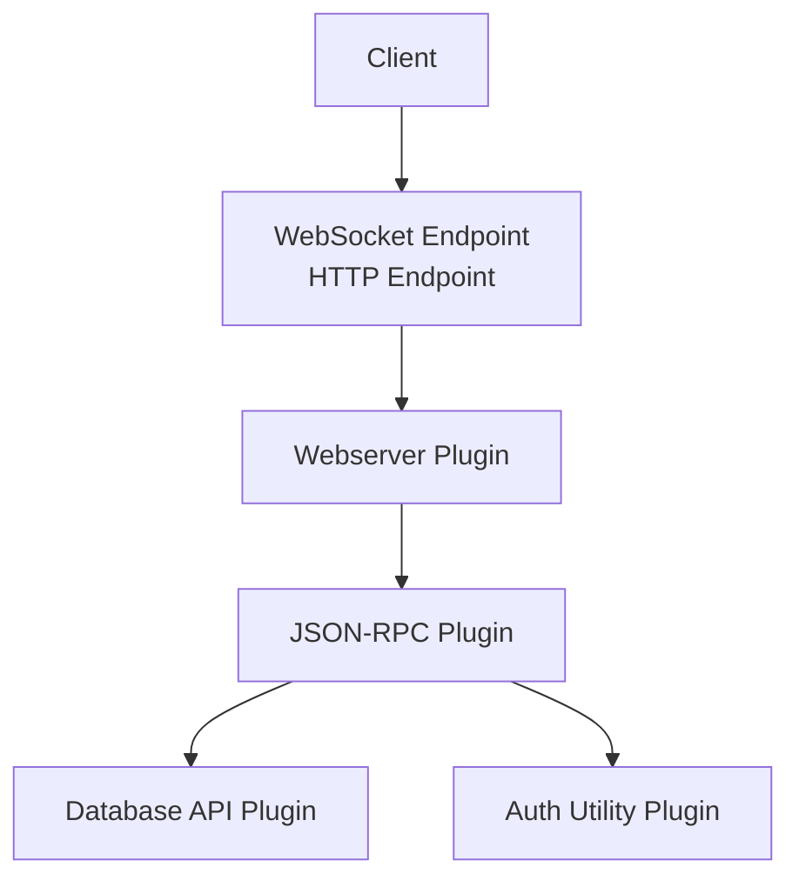
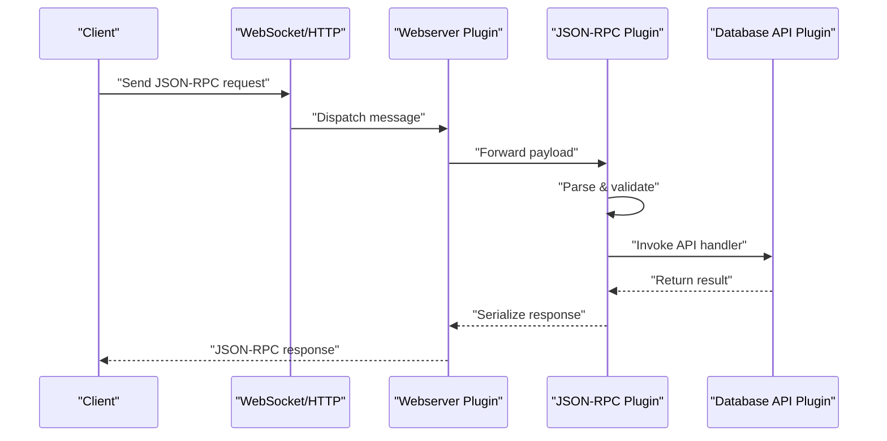
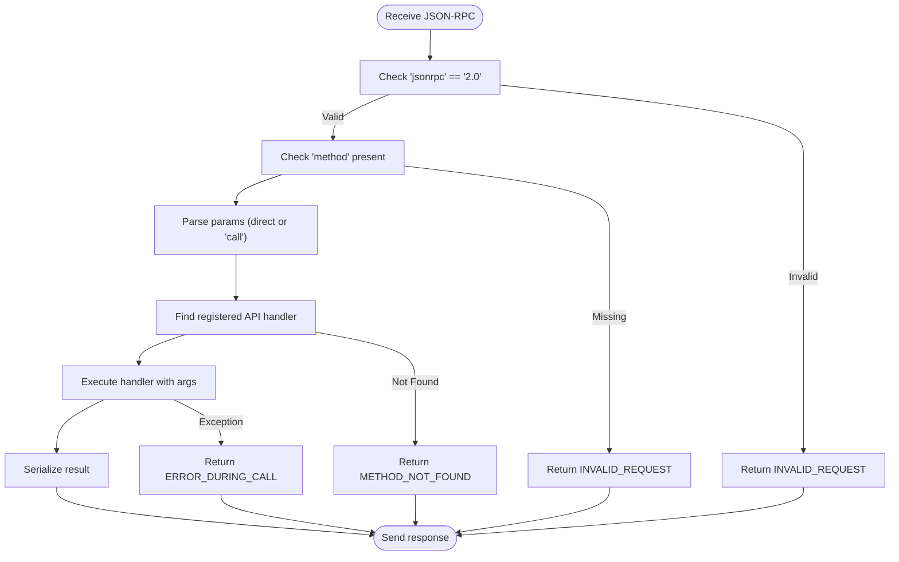
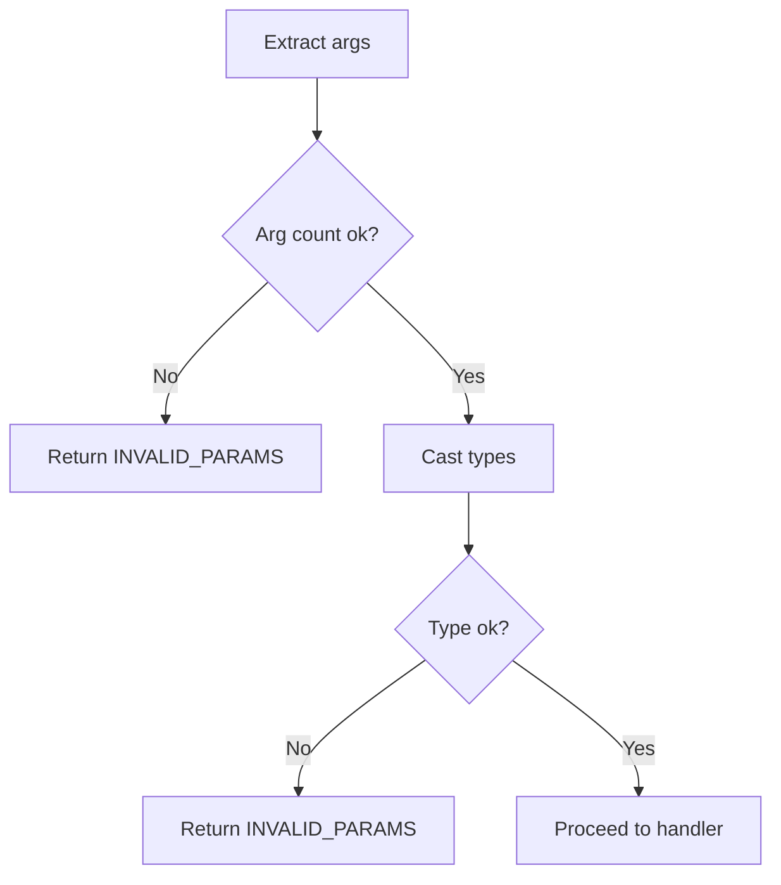
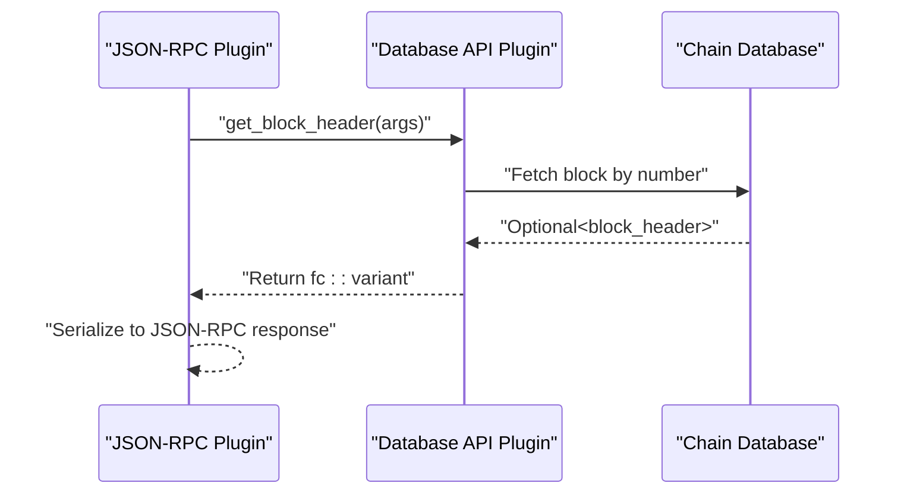
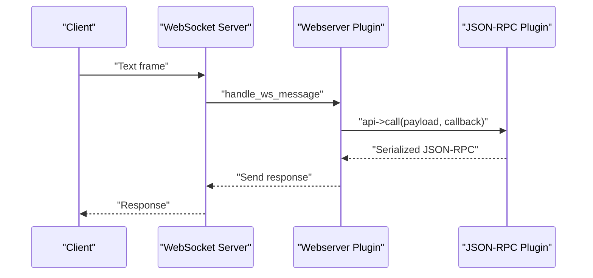
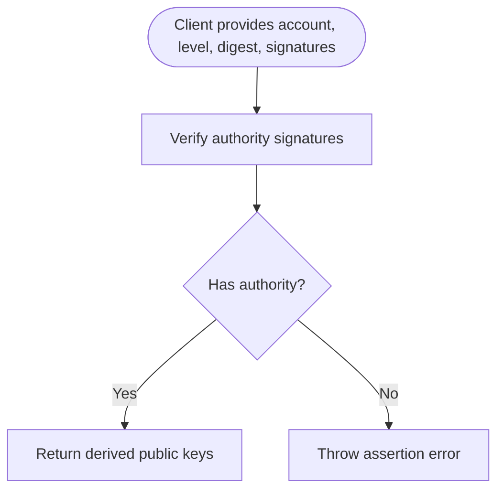
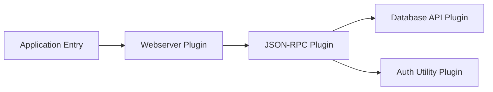

# API Request Processing

<cite>
**Referenced Files in This Document**
- [main.cpp](file://programs/vizd/main.cpp)
- [webserver_plugin.cpp](file://plugins/webserver/webserver_plugin.cpp)
- [plugin.cpp](file://plugins/json_rpc/plugin.cpp)
- [api.cpp](file://plugins/database_api/api.cpp)
- [plugin.cpp](file://plugins/auth_util/plugin.cpp)
- [account_api_object.cpp](file://libraries/api/account_api_object.cpp)
</cite>

## Table of Contents
1. [Introduction](#introduction)
2. [Project Structure](#project-structure)
3. [Core Components](#core-components)
4. [Architecture Overview](#architecture-overview)
5. [Detailed Component Analysis](#detailed-component-analysis)
6. [Dependency Analysis](#dependency-analysis)
7. [Performance Considerations](#performance-considerations)
8. [Troubleshooting Guide](#troubleshooting-guide)
9. [Conclusion](#conclusion)

## Introduction
This document explains how API requests are processed from receipt to response generation in the node. It covers JSON-RPC request parsing, method routing, parameter validation, database query execution, result formatting, and the webserver plugin’s role in handling HTTP and WebSocket traffic. It also documents authentication support, error handling strategies, response formatting standards, and performance monitoring techniques.

## Project Structure
The API request lifecycle spans several components:
- Application entry point initializes plugins and starts the node.
- Webserver plugin handles HTTP and WebSocket connections and forwards JSON-RPC payloads to the JSON-RPC plugin.
- JSON-RPC plugin parses requests, validates method signatures, routes to registered APIs, executes handlers, and serializes responses.
- Database API plugin implements core blockchain queries and returns formatted results.
- Authentication utility plugin provides signature verification APIs used by clients and services.

**Diagram sources**
- [webserver_plugin.cpp](file://plugins/webserver/webserver_plugin.cpp#L112-L165)
- [plugin.cpp](file://plugins/json_rpc/plugin.cpp#L402-L423)
- [api.cpp](file://plugins/database_api/api.cpp#L218-L223)
- [plugin.cpp](file://plugins/auth_util/plugin.cpp#L86-L90)

**Section sources**
- [main.cpp](file://programs/vizd/main.cpp#L62-L91)
- [webserver_plugin.cpp](file://plugins/webserver/webserver_plugin.cpp#L266-L331)

## Core Components
- Webserver plugin: Accepts HTTP and WebSocket connections, defers HTTP responses, posts work to a thread pool, and delegates JSON-RPC payloads to the JSON-RPC plugin.
- JSON-RPC plugin: Parses JSON-RPC 2.0 requests, validates method names and parameters, routes to registered API methods, and serializes responses with proper error handling.
- Database API plugin: Implements core blockchain queries (blocks, accounts, globals, authority helpers) and returns typed results suitable for JSON serialization.
- Authentication utility plugin: Provides signature verification APIs for client-side or service-side authentication checks.

**Section sources**
- [webserver_plugin.cpp](file://plugins/webserver/webserver_plugin.cpp#L192-L246)
- [plugin.cpp](file://plugins/json_rpc/plugin.cpp#L151-L370)
- [api.cpp](file://plugins/database_api/api.cpp#L218-L353)
- [plugin.cpp](file://plugins/auth_util/plugin.cpp#L69-L78)

## Architecture Overview
The request processing pipeline is event-driven and asynchronous:
- Incoming HTTP requests are deferred and handled asynchronously; WebSocket messages are posted to a thread pool.
- The JSON-RPC plugin parses the request, validates the method and parameters, and invokes the appropriate API handler.
- Handlers execute database reads behind weak read locks and return results as fc::variant, which the JSON-RPC plugin serializes to JSON.
- Errors are captured and returned as JSON-RPC error objects with standardized codes and messages.

**Diagram sources**
- [webserver_plugin.cpp](file://plugins/webserver/webserver_plugin.cpp#L192-L246)
- [plugin.cpp](file://plugins/json_rpc/plugin.cpp#L215-L256)
- [api.cpp](file://plugins/database_api/api.cpp#L218-L223)

## Detailed Component Analysis

### JSON-RPC Request Parsing and Method Routing
- Request parsing:
  - Validates presence of jsonrpc equals "2.0" and method field.
  - Supports two forms: direct "api.method" and legacy "call" with params array containing [api, method, args].
  - Extracts method name and parameters, sets msg_pack id for response correlation.
- Method routing:
  - Maintains a registry of registered APIs keyed by plugin name and method.
  - Resolves method to a callable handler and prepares arguments for invocation.
- Parameter validation:
  - Enforces argument count and types via macros and assertions.
  - Returns structured errors for parse failures, invalid params, and missing methods.

**Diagram sources**
- [plugin.cpp](file://plugins/json_rpc/plugin.cpp#L215-L256)
- [plugin.cpp](file://plugins/json_rpc/plugin.cpp#L180-L213)

**Section sources**
- [plugin.cpp](file://plugins/json_rpc/plugin.cpp#L215-L256)
- [plugin.cpp](file://plugins/json_rpc/plugin.cpp#L180-L213)

### Parameter Validation and Error Handling
- Validation patterns:
  - Argument count checks using macros to enforce exact or range-based counts.
  - Type assertions during parameter extraction.
- Error handling:
  - Dedicated JSON-RPC error codes for invalid requests, parse errors, method not found, and errors during call.
  - Exceptions are caught and mapped to JSON-RPC error objects with optional data payloads.
  - Unknown errors are captured and reported with a generic message.

**Diagram sources**
- [api.cpp](file://plugins/database_api/api.cpp#L17-L21)
- [plugin.cpp](file://plugins/json_rpc/plugin.cpp#L295-L310)

**Section sources**
- [api.cpp](file://plugins/database_api/api.cpp#L17-L21)
- [plugin.cpp](file://plugins/json_rpc/plugin.cpp#L295-L310)

### Database Query Execution and Result Formatting
- Handlers execute database reads behind a weak read lock to avoid blocking writers.
- Results are returned as typed structures (e.g., account objects, blocks) that serialize naturally to JSON.
- Example handlers:
  - Block retrieval by number.
  - Account lookup by names.
  - Dynamic global properties and chain configuration.
- Result formatting:
  - fc::variant is used internally; JSON serialization is performed by the JSON-RPC plugin.

**Diagram sources**
- [api.cpp](file://plugins/database_api/api.cpp#L218-L223)
- [api.cpp](file://plugins/database_api/api.cpp#L225-L231)

**Section sources**
- [api.cpp](file://plugins/database_api/api.cpp#L218-L223)
- [api.cpp](file://plugins/database_api/api.cpp#L225-L231)
- [account_api_object.cpp](file://libraries/api/account_api_object.cpp#L9-L45)

### Webserver Plugin: HTTP/WS Handling and Response Serialization
- Endpoint configuration supports separate HTTP and WebSocket endpoints or a combined endpoint.
- Thread pool sizing controls concurrency for request handling.
- WebSocket:
  - Text payloads are forwarded to the JSON-RPC plugin; non-string payloads return an error message.
- HTTP:
  - Requests are deferred; the response body is set asynchronously and sent after completion.
  - Errors during parsing are handled and a standardized HTTP response is returned.

**Diagram sources**
- [webserver_plugin.cpp](file://plugins/webserver/webserver_plugin.cpp#L192-L214)
- [webserver_plugin.cpp](file://plugins/webserver/webserver_plugin.cpp#L216-L246)

**Section sources**
- [webserver_plugin.cpp](file://plugins/webserver/webserver_plugin.cpp#L254-L264)
- [webserver_plugin.cpp](file://plugins/webserver/webserver_plugin.cpp#L112-L165)
- [webserver_plugin.cpp](file://plugins/webserver/webserver_plugin.cpp#L192-L246)

### Authentication Mechanisms
- Signature verification API:
  - Verifies signatures against account authorities (active/master/regular) for given digest and signatures.
  - Returns the derived public keys used for verification.
- Integration:
  - Clients can call this API to validate claims or proofs-of-authority before invoking protected operations.

**Diagram sources**
- [plugin.cpp](file://plugins/auth_util/plugin.cpp#L31-L67)
- [plugin.cpp](file://plugins/auth_util/plugin.cpp#L69-L78)

**Section sources**
- [plugin.cpp](file://plugins/auth_util/plugin.cpp#L31-L67)
- [plugin.cpp](file://plugins/auth_util/plugin.cpp#L69-L78)

### Rate Limiting
- No explicit rate limiting is implemented in the analyzed components. Consider deploying external rate limiting at the reverse proxy or firewall level if needed.

[No sources needed since this section provides general guidance]

## Dependency Analysis
- Application bootstrap registers plugins and starts the node; the webserver plugin depends on the JSON-RPC plugin.
- JSON-RPC plugin depends on fc::variant serialization and websocketpp for transport.
- Database API plugin depends on the chain database and exposes typed API objects.
- Authentication utility plugin depends on chain database and protocol types.

**Diagram sources**
- [main.cpp](file://programs/vizd/main.cpp#L62-L91)
- [webserver_plugin.cpp](file://plugins/webserver/webserver_plugin.cpp#L314-L327)
- [plugin.cpp](file://plugins/json_rpc/plugin.cpp#L378-L395)

**Section sources**
- [main.cpp](file://programs/vizd/main.cpp#L62-L91)
- [webserver_plugin.cpp](file://plugins/webserver/webserver_plugin.cpp#L314-L327)

## Performance Considerations
- Concurrency model:
  - The webserver plugin uses a configurable thread pool to handle requests concurrently.
  - WebSocket and HTTP paths both post work to the same pool, enabling efficient handling of mixed traffic.
- Monitoring:
  - The JSON-RPC plugin logs timing for each request, including elapsed time and error conditions, aiding performance diagnostics.
- Recommendations:
  - Tune thread pool size according to CPU cores and expected load.
  - Monitor JSON-RPC timings and error rates to identify hotspots.
  - Offload heavy operations to background tasks if necessary and keep the request path lightweight.

**Section sources**
- [webserver_plugin.cpp](file://plugins/webserver/webserver_plugin.cpp#L266-L269)
- [plugin.cpp](file://plugins/json_rpc/plugin.cpp#L258-L288)

## Troubleshooting Guide
- Common JSON-RPC errors:
  - INVALID_REQUEST: Missing or invalid jsonrpc/version or missing method.
  - METHOD_NOT_FOUND: Unknown method or API.
  - INVALID_PARAMS: Wrong argument count or wrong types.
  - ERROR_DURING_CALL: Exception thrown inside handler.
- Symptoms and fixes:
  - Empty or malformed responses: Verify request payload and method naming.
  - 500-class HTTP responses: Inspect server logs for exceptions and error messages.
  - Slow responses: Review JSON-RPC timing logs and adjust thread pool size.

**Section sources**
- [plugin.cpp](file://plugins/json_rpc/plugin.cpp#L295-L310)
- [webserver_plugin.cpp](file://plugins/webserver/webserver_plugin.cpp#L231-L244)

## Conclusion
The API request processing pipeline is robust, modular, and designed for high concurrency. JSON-RPC parsing, method routing, and parameter validation occur early, while database queries are executed efficiently behind read locks. The webserver plugin provides flexible HTTP/WS handling with strong error reporting and performance logging. Authentication utilities complement the stack by offering signature verification capabilities. For production deployments, consider external rate limiting and continuous monitoring of request latency and error rates.