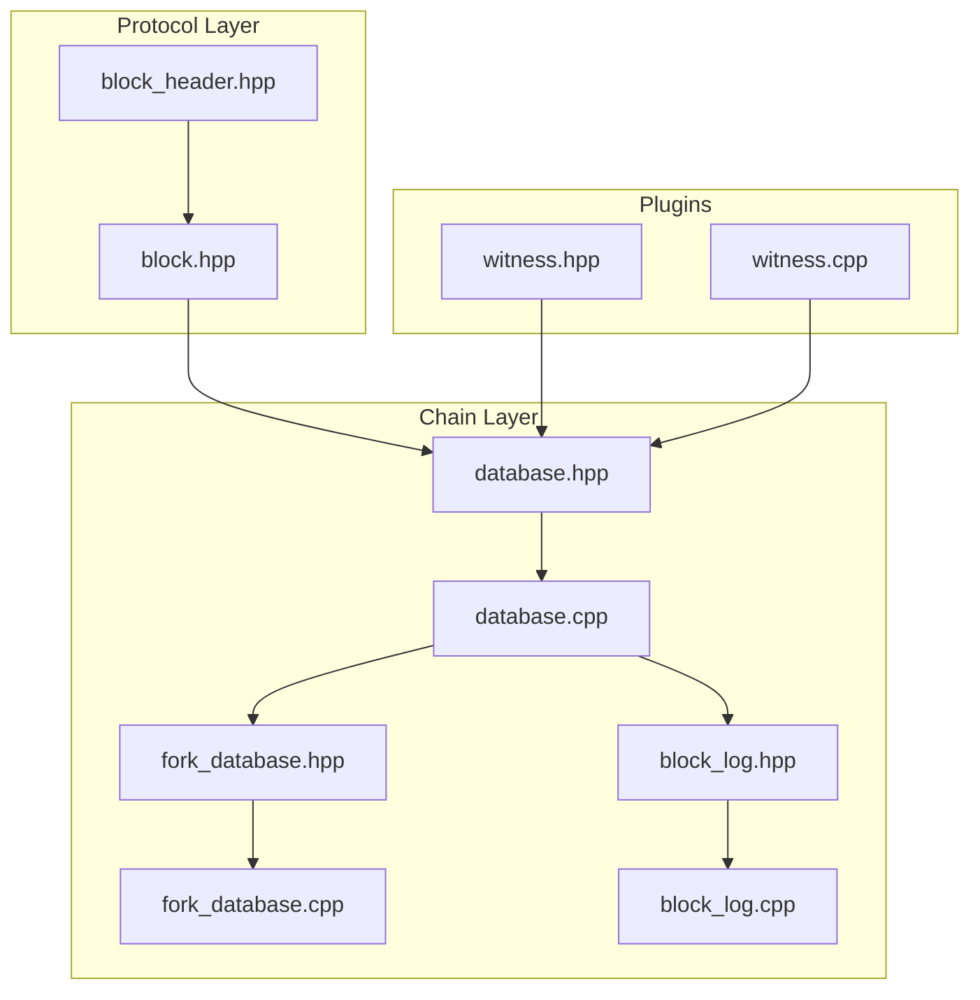
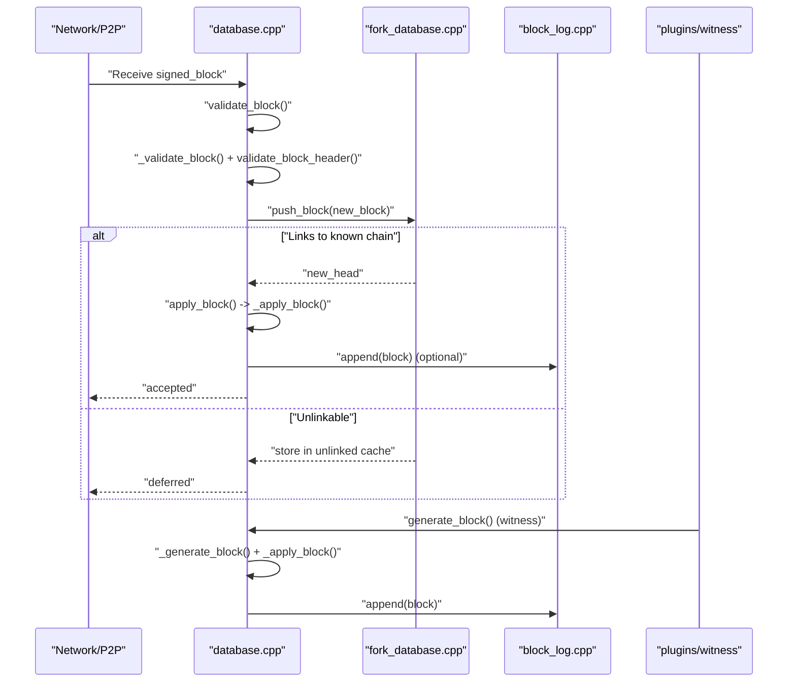
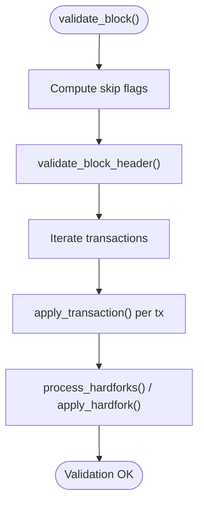
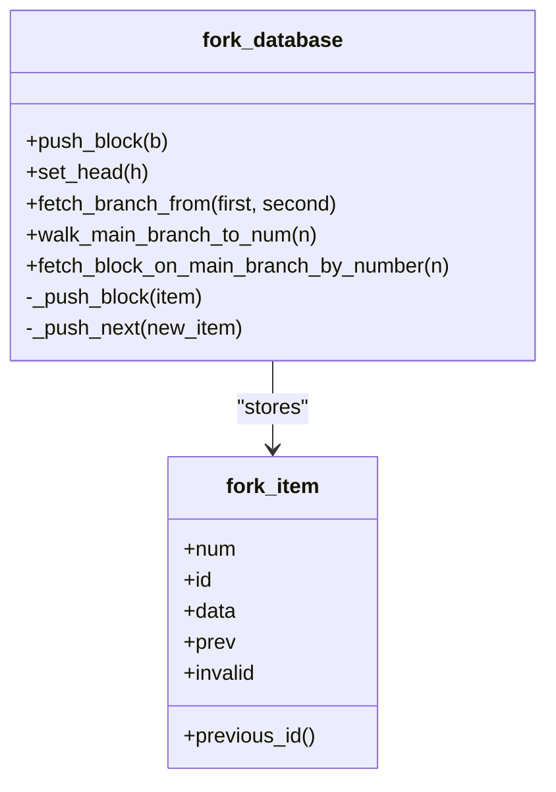
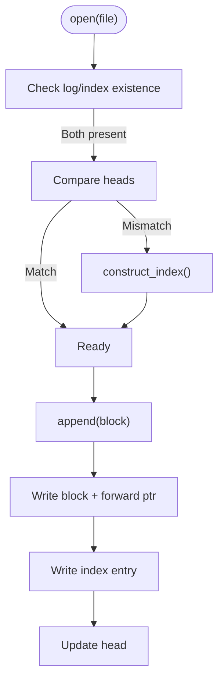
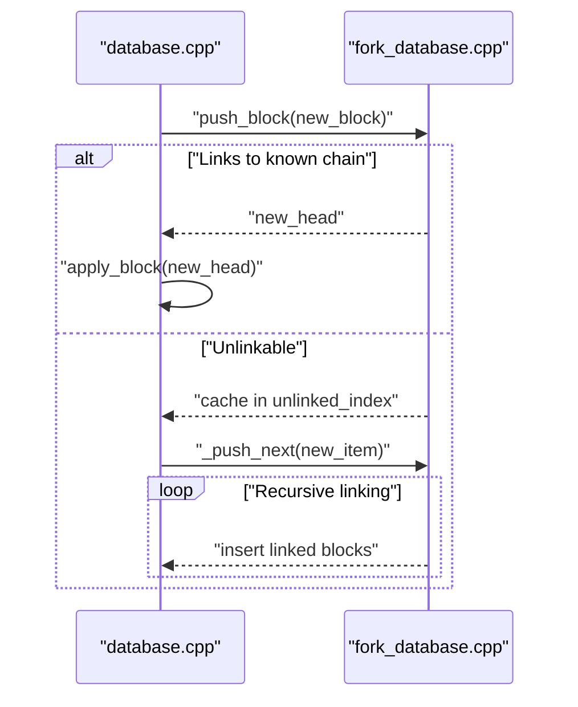
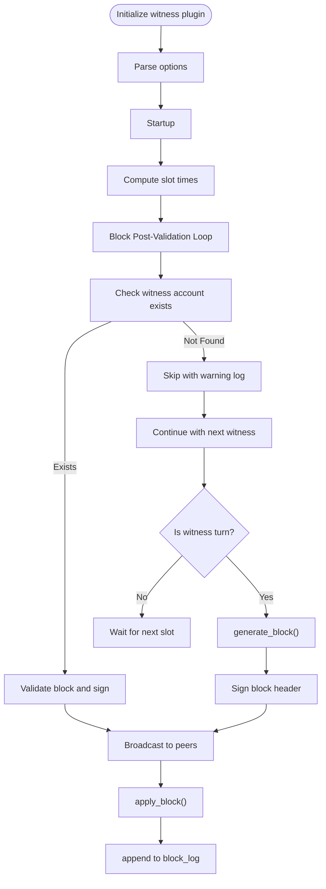
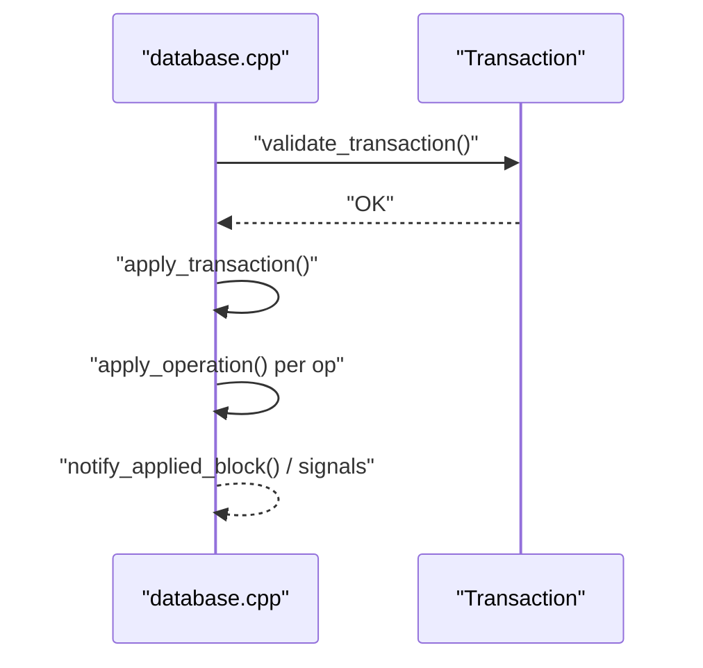
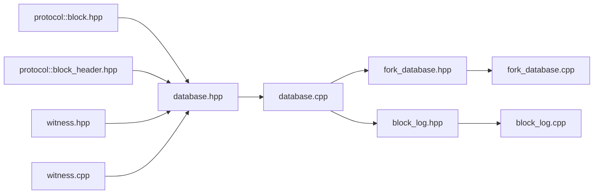

# Block Processing and Validation

<cite>
**Referenced Files in This Document**
- [block_log.hpp](file://libraries/chain/include/graphene/chain/block_log.hpp)
- [block_log.cpp](file://libraries/chain/block_log.cpp)
- [fork_database.hpp](file://libraries/chain/include/graphene/chain/fork_database.hpp)
- [fork_database.cpp](file://libraries/chain/fork_database.cpp)
- [database.hpp](file://libraries/chain/include/graphene/chain/database.hpp)
- [database.cpp](file://libraries/chain/database.cpp)
- [block.hpp](file://libraries/protocol/include/graphene/protocol/block.hpp)
- [block_header.hpp](file://libraries/protocol/include/graphene/protocol/block_header.hpp)
- [witness.hpp](file://plugins/witness/include/graphene/plugins/witness/witness.hpp)
- [witness.cpp](file://plugins/witness/witness.cpp)
- [database_exceptions.hpp](file://libraries/chain/include/graphene/chain/database_exceptions.hpp)
</cite>

## Update Summary
**Changes Made**
- Enhanced witness plugin block post-validation logic with defensive programming to prevent runtime errors when witness accounts aren't found during validation
- Added improved error handling and logging for witness account validation scenarios
- Updated witness block production coordination section to reflect enhanced reliability measures

## Table of Contents
1. [Introduction](#introduction)
2. [Project Structure](#project-structure)
3. [Core Components](#core-components)
4. [Architecture Overview](#architecture-overview)
5. [Detailed Component Analysis](#detailed-component-analysis)
6. [Dependency Analysis](#dependency-analysis)
7. [Performance Considerations](#performance-considerations)
8. [Troubleshooting Guide](#troubleshooting-guide)
9. [Conclusion](#conclusion)

## Introduction
This document explains the complete block processing and validation pipeline in the VIZ node, including header validation, transaction extraction, state application, fork resolution, block persistence, and witness block production coordination. It also covers performance characteristics and optimization techniques used for high-throughput block processing.

**Updated** Enhanced with defensive programming improvements to the witness plugin's block post-validation logic, improving system reliability when witness accounts aren't found during validation processes.

## Project Structure
The block processing pipeline spans three primary subsystems:
- Protocol-level block representation and header definitions
- Chain database that orchestrates validation, fork management, and state application
- Block log for durable, append-only persistence of blocks

**Diagram sources**
- [block_header.hpp](file://libraries/protocol/include/graphene/protocol/block_header.hpp#L1-L43)
- [block.hpp](file://libraries/protocol/include/graphene/protocol/block.hpp#L1-L19)
- [database.hpp](file://libraries/chain/include/graphene/chain/database.hpp#L1-L561)
- [database.cpp](file://libraries/chain/database.cpp#L737-L913)
- [fork_database.hpp](file://libraries/chain/include/graphene/chain/fork_database.hpp#L1-L125)
- [fork_database.cpp](file://libraries/chain/fork_database.cpp#L33-L90)
- [block_log.hpp](file://libraries/chain/include/graphene/chain/block_log.hpp#L1-L75)
- [block_log.cpp](file://libraries/chain/block_log.cpp#L238-L300)
- [witness.hpp](file://plugins/witness/include/graphene/plugins/witness/witness.hpp#L1-L70)
- [witness.cpp](file://plugins/witness/witness.cpp#L295-L341)

**Section sources**
- [block_header.hpp](file://libraries/protocol/include/graphene/protocol/block_header.hpp#L1-L43)
- [block.hpp](file://libraries/protocol/include/graphene/protocol/block.hpp#L1-L19)
- [database.hpp](file://libraries/chain/include/graphene/chain/database.hpp#L1-L561)
- [fork_database.hpp](file://libraries/chain/include/graphene/chain/fork_database.hpp#L1-L125)
- [block_log.hpp](file://libraries/chain/include/graphene/chain/block_log.hpp#L1-L75)
- [witness.hpp](file://plugins/witness/include/graphene/plugins/witness/witness.hpp#L1-L70)
- [witness.cpp](file://plugins/witness/witness.cpp#L295-L341)

## Core Components
- Protocol block model: Defines the signed block structure and signed block header, including merkle roots and witness signatures.
- Fork database: Maintains a tree of candidate blocks, supports branching, linking, and selection of the heaviest chain.
- Block log: Provides append-only, random-access persistence of blocks with an auxiliary index.
- Database: Orchestrates validation, fork resolution, state application, and block logging.
- Witness plugin: Coordinates block production for witness nodes and defines acceptance criteria with enhanced defensive programming.

**Updated** The witness plugin now includes defensive programming enhancements to prevent runtime errors when witness accounts aren't found during block post-validation processes.

**Section sources**
- [block.hpp](file://libraries/protocol/include/graphene/protocol/block.hpp#L9-L13)
- [block_header.hpp](file://libraries/protocol/include/graphene/protocol/block_header.hpp#L25-L35)
- [fork_database.hpp](file://libraries/chain/include/graphene/chain/fork_database.hpp#L53-L96)
- [block_log.hpp](file://libraries/chain/include/graphene/chain/block_log.hpp#L38-L68)
- [database.hpp](file://libraries/chain/include/graphene/chain/database.hpp#L36-L287)
- [witness.hpp](file://plugins/witness/include/graphene/plugins/witness/witness.hpp#L20-L32)
- [witness.cpp](file://plugins/witness/witness.cpp#L295-L341)

## Architecture Overview
The block processing pipeline integrates protocol definitions, fork management, and persistent storage:

**Diagram sources**
- [database.cpp](file://libraries/chain/database.cpp#L737-L913)
- [fork_database.cpp](file://libraries/chain/fork_database.cpp#L33-L90)
- [block_log.cpp](file://libraries/chain/block_log.cpp#L253-L257)
- [witness.hpp](file://plugins/witness/include/graphene/plugins/witness/witness.hpp#L20-L32)

## Detailed Component Analysis

### Block Validation Pipeline
The validation pipeline is exposed via the database interface and consists of:
- Header validation: Verifies cryptographic signatures and structural constraints.
- Transaction extraction: Iterates transactions embedded in the block.
- State application: Applies each transaction's operations against the current state.
- Hardfork handling: Enforces consensus rules per hardfork schedule.
- Optional checks: Signature verification, TAPoS, block size limits, and authority checks depending on skip flags.

**Diagram sources**
- [database.hpp](file://libraries/chain/include/graphene/chain/database.hpp#L194-L206)
- [database.cpp](file://libraries/chain/database.cpp#L737-L757)
- [database.cpp](file://libraries/chain/database.cpp#L3443-L3509)

**Section sources**
- [database.hpp](file://libraries/chain/include/graphene/chain/database.hpp#L56-L73)
- [database.hpp](file://libraries/chain/include/graphene/chain/database.hpp#L194-L206)
- [database.cpp](file://libraries/chain/database.cpp#L737-L757)
- [database.cpp](file://libraries/chain/database.cpp#L3443-L3509)

### Fork Resolution and Chain Selection
Fork resolution maintains a tree of candidate blocks and selects the heaviest chain:
- Unlinkable blocks are cached and later linked when their parent arrives.
- The head advances to the highest-numbered block.
- Branch-from algorithm computes divergent branches to a common ancestor for reorganization decisions.

**Diagram sources**
- [fork_database.hpp](file://libraries/chain/include/graphene/chain/fork_database.hpp#L53-L96)
- [fork_database.cpp](file://libraries/chain/fork_database.cpp#L33-L90)

**Section sources**
- [fork_database.hpp](file://libraries/chain/include/graphene/chain/fork_database.hpp#L53-L96)
- [fork_database.cpp](file://libraries/chain/fork_database.cpp#L33-L90)
- [fork_database.cpp](file://libraries/chain/fork_database.cpp#L168-L210)

### Block Logging and Persistence
Blocks are persisted to an append-only log with a secondary index for random access:
- Main file stores serialized blocks with forward pointers.
- Index file maps block number to file offset.
- Startup routines reconcile log and index, reconstructing the index if needed.
- Append operations are atomic with respect to index alignment.

**Diagram sources**
- [block_log.cpp](file://libraries/chain/block_log.cpp#L134-L193)
- [block_log.cpp](file://libraries/chain/block_log.cpp#L115-L132)
- [block_log.cpp](file://libraries/chain/block_log.cpp#L195-L219)

**Section sources**
- [block_log.hpp](file://libraries/chain/include/graphene/chain/block_log.hpp#L13-L36)
- [block_log.cpp](file://libraries/chain/block_log.cpp#L134-L193)
- [block_log.cpp](file://libraries/chain/block_log.cpp#L115-L132)
- [block_log.cpp](file://libraries/chain/block_log.cpp#L253-L257)

### Role of Fork Database in Chain History and Reorganizations
- Maintains a bounded window of unlinked blocks to handle reordering up to a configured limit.
- Supports walking branches and selecting the heaviest chain head.
- Flags invalid blocks to prevent further growth on top of them.

**Diagram sources**
- [fork_database.cpp](file://libraries/chain/fork_database.cpp#L33-L90)
- [database.cpp](file://libraries/chain/database.cpp#L846-L913)

**Section sources**
- [fork_database.cpp](file://libraries/chain/fork_database.cpp#L47-L71)
- [fork_database.cpp](file://libraries/chain/fork_database.cpp#L79-L90)
- [database.cpp](file://libraries/chain/database.cpp#L846-L913)

### Enhanced Block Production Coordination for Witness Nodes
**Updated** Witness nodes coordinate block production through a dedicated plugin with enhanced defensive programming:
- Acceptance criteria include synchronization status, turn-based scheduling, time windows, participation thresholds, and availability of signing keys.
- The plugin integrates with the chain plugin and P2P plugin to manage production loops.
- **Enhanced defensive programming**: Added error handling to gracefully skip witness accounts that aren't found in the witness index during block post-validation, preventing runtime errors and improving system reliability.

**Diagram sources**
- [witness.hpp](file://plugins/witness/include/graphene/plugins/witness/witness.hpp#L34-L65)
- [witness.cpp](file://plugins/witness/witness.cpp#L295-L341)
- [database.hpp](file://libraries/chain/include/graphene/chain/database.hpp#L214-L226)
- [database.cpp](file://libraries/chain/database.cpp#L3443-L3509)

**Section sources**
- [witness.hpp](file://plugins/witness/include/graphene/plugins/witness/witness.hpp#L20-L32)
- [witness.hpp](file://plugins/witness/include/graphene/plugins/witness/witness.hpp#L34-L65)
- [witness.cpp](file://plugins/witness/witness.cpp#L295-L341)
- [database.hpp](file://libraries/chain/include/graphene/chain/database.hpp#L214-L226)

### Transaction Extraction and State Application
- Transactions are extracted from the block and validated individually.
- Each transaction's operations are evaluated against the current state, with hooks for pre/post operation notifications and virtual operations.
- Hardforks and special processing steps are executed during block application.

**Diagram sources**
- [database.hpp](file://libraries/chain/include/graphene/chain/database.hpp#L423-L428)
- [database.cpp](file://libraries/chain/database.cpp#L3443-L3509)

**Section sources**
- [database.hpp](file://libraries/chain/include/graphene/chain/database.hpp#L423-L428)
- [database.cpp](file://libraries/chain/database.cpp#L3443-L3509)

## Dependency Analysis
The following diagram shows key dependencies among components involved in block processing:

**Diagram sources**
- [block.hpp](file://libraries/protocol/include/graphene/protocol/block.hpp#L1-L19)
- [block_header.hpp](file://libraries/protocol/include/graphene/protocol/block_header.hpp#L1-L43)
- [database.hpp](file://libraries/chain/include/graphene/chain/database.hpp#L1-L561)
- [fork_database.hpp](file://libraries/chain/include/graphene/chain/fork_database.hpp#L1-L125)
- [block_log.hpp](file://libraries/chain/include/graphene/chain/block_log.hpp#L1-L75)
- [witness.hpp](file://plugins/witness/include/graphene/plugins/witness/witness.hpp#L1-L70)
- [witness.cpp](file://plugins/witness/witness.cpp#L295-L341)

**Section sources**
- [database.hpp](file://libraries/chain/include/graphene/chain/database.hpp#L1-L561)
- [fork_database.hpp](file://libraries/chain/include/graphene/chain/fork_database.hpp#L1-L125)
- [block_log.hpp](file://libraries/chain/include/graphene/chain/block_log.hpp#L1-L75)
- [witness.hpp](file://plugins/witness/include/graphene/plugins/witness/witness.hpp#L1-L70)
- [witness.cpp](file://plugins/witness/witness.cpp#L295-L341)

## Performance Considerations
- Skip flags: Validation and checks can be selectively disabled during reindexing or trusted operations to reduce overhead.
- Memory-mapped IO: The block log uses memory-mapped files for efficient random access and reduced syscall overhead.
- Bounded fork cache: Limits memory usage by capping the number of unlinked blocks and pruning older entries.
- Flush intervals: Controlled flushing reduces disk sync frequency while preserving durability guarantees.
- Parallelism: Network and plugin layers can operate concurrently with chain operations under appropriate locking.
- **Enhanced defensive programming**: The witness plugin now includes additional error checking and graceful degradation to prevent runtime errors during block post-validation, improving overall system stability.

## Troubleshooting Guide
Common issues and diagnostics:
- Unlinkable blocks: Detected when a block's previous ID is not present in the fork database; the block is cached and linked when the parent arrives.
- Hardfork application errors: Exceptions indicate attempting to apply unknown hardforks or missing hardfork state.
- Block log inconsistencies: Startup reconciliation reconstructs the index if the log and index are out of sync.
- Witness production failures: Conditions such as not being scheduled, insufficient participation, or missing private keys prevent block production.
- **Enhanced error handling**: Witness accounts not found in witness index are now handled gracefully with warning logs, preventing runtime errors and allowing the system to continue processing other witnesses.

**Section sources**
- [fork_database.cpp](file://libraries/chain/fork_database.cpp#L38-L44)
- [database_exceptions.hpp](file://libraries/chain/include/graphene/chain/database_exceptions.hpp#L83-L83)
- [block_log.cpp](file://libraries/chain/block_log.cpp#L163-L193)
- [witness.hpp](file://plugins/witness/include/graphene/plugins/witness/witness.hpp#L20-L32)
- [witness.cpp](file://plugins/witness/witness.cpp#L305-L307)

## Conclusion
The VIZ node implements a robust block processing pipeline that separates concerns between protocol definitions, fork management, and durable persistence. The fork database ensures resilient handling of out-of-order and conflicting blocks, while the block log provides efficient random access and reindexing support. The database orchestrates validation, state application, and integration with plugins such as the witness node coordinator.

**Updated** The witness plugin now includes enhanced defensive programming that prevents runtime errors when witness accounts aren't found during block post-validation, significantly improving system reliability and error handling. This enhancement ensures that the node can gracefully handle edge cases and continue processing other witnesses without crashing.

Performance is optimized through selective validation, memory-mapped IO, bounded caches, and controlled flushing, enabling high-throughput operation in production environments. The addition of defensive programming measures further enhances the system's resilience and operational stability.