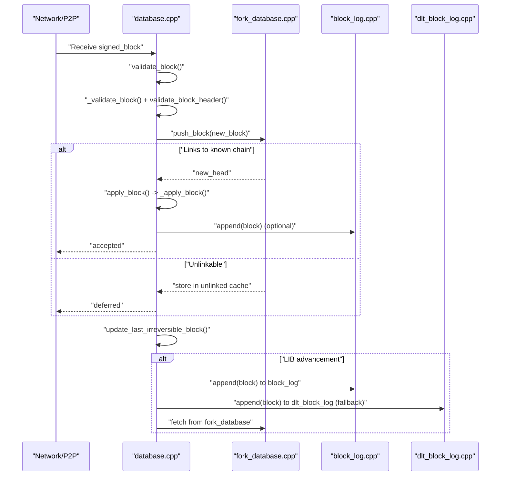
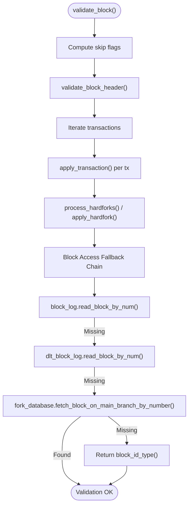
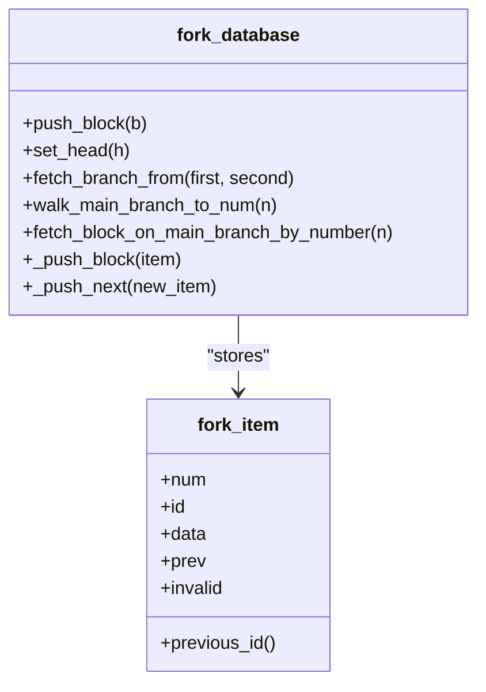
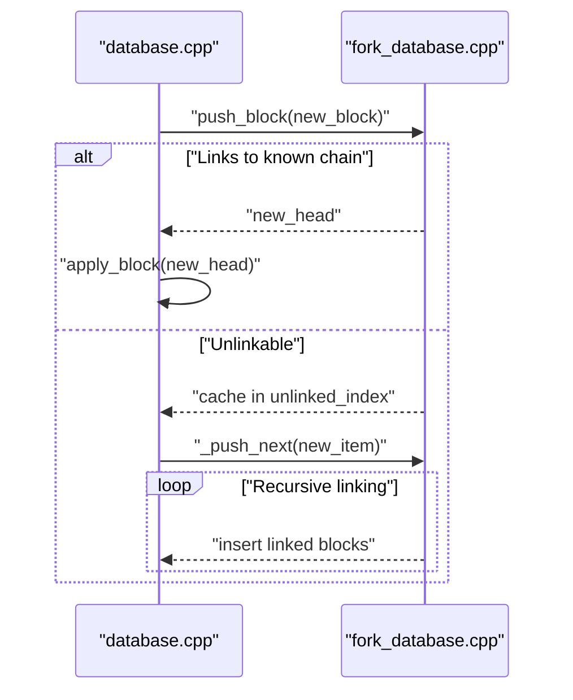
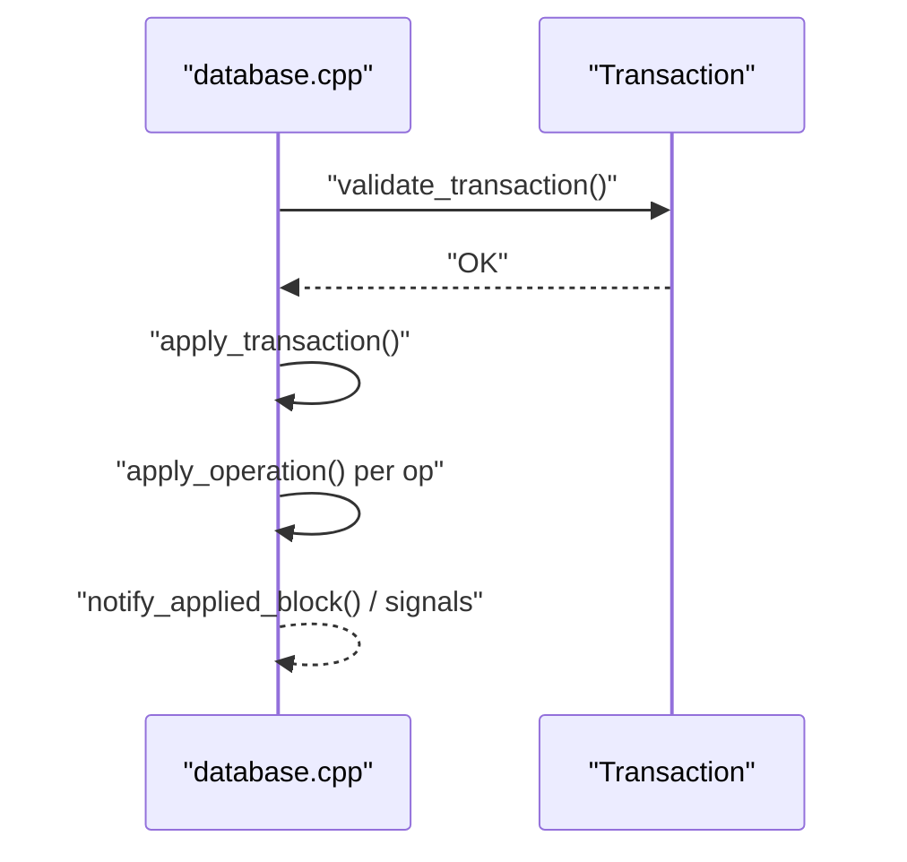

# Block Processing and Validation

<cite>
**Referenced Files in This Document**
- [block_log.hpp](file://libraries/chain/include/graphene/chain/block_log.hpp)
- [block_log.cpp](file://libraries/chain/block_log.cpp)
- [dlt_block_log.hpp](file://libraries/chain/include/graphene/chain/dlt_block_log.hpp)
- [dlt_block_log.cpp](file://libraries/chain/dlt_block_log.cpp)
- [fork_database.hpp](file://libraries/chain/include/graphene/chain/fork_database.hpp)
- [fork_database.cpp](file://libraries/chain/fork_database.cpp)
- [database.hpp](file://libraries/chain/include/graphene/chain/database.hpp)
- [database.cpp](file://libraries/chain/database.cpp)
- [block.hpp](file://libraries/protocol/include/graphene/protocol/block.hpp)
- [block_header.hpp](file://libraries/protocol/include/graphene/protocol/block_header.hpp)
- [witness.hpp](file://plugins/witness/include/graphene/plugins/witness/witness.hpp)
- [witness.cpp](file://plugins/witness/witness.cpp)
- [database_exceptions.hpp](file://libraries/chain/include/graphene/chain/database_exceptions.hpp)
</cite>

## Update Summary
**Changes Made**
- Enhanced fork handling with comprehensive fallback mechanisms for missing irreversible blocks during fork resolution and chain reorganization events
- Improved block log accessibility with dual-path retrieval: block_log → dlt_block_log → fork_database fallback chain
- Added robust gap detection and logging for DLT block log gaps during LIB advancement
- Strengthened chain validation reliability by preventing chain stalls due to missing blocks
- Enhanced witness plugin block post-validation logic with defensive programming to prevent runtime errors when witness accounts aren't found during validation

## Table of Contents
1. [Introduction](#introduction)
2. [Project Structure](#project-structure)
3. [Core Components](#core-components)
4. [Architecture Overview](#architecture-overview)
5. [Detailed Component Analysis](#detailed-component-analysis)
6. [Dependency Analysis](#dependency-analysis)
7. [Performance Considerations](#performance-considerations)
8. [Troubleshooting Guide](#troubleshooting-guide)
9. [Conclusion](#conclusion)

## Introduction
This document explains the complete block processing and validation pipeline in the VIZ node, including header validation, transaction extraction, state application, fork resolution, block persistence, and witness block production coordination. It also covers performance characteristics and optimization techniques used for high-throughput block processing.

**Updated** Enhanced with comprehensive fallback mechanisms for missing irreversible blocks during fork resolution and chain reorganization events, improving chain validation reliability and preventing chain stalls. The block log accessibility system now provides a robust fallback chain: block_log → dlt_block_log → fork_database, ensuring blocks remain accessible even when intermediate storage systems are unavailable.

## Project Structure
The block processing pipeline spans three primary subsystems:
- Protocol-level block representation and header definitions
- Chain database that orchestrates validation, fork management, and state application
- Dual block log system with fallback mechanisms for durable, append-only persistence of blocks

```mermaid
graph TB
subgraph "Protocol Layer"
BH["block_header.hpp"]
SB["block.hpp"]
end
subgraph "Chain Layer"
DBH["database.hpp"]
DBC["database.cpp"]
FDH["fork_database.hpp"]
FDC["fork_database.cpp"]
BLH["block_log.hpp"]
BLC["block_log.cpp"]
DLTH["dlt_block_log.hpp"]
D LTCPP["dlt_block_log.cpp"]
end
subgraph "Plugins"
WIT["witness.hpp"]
WITCPP["witness.cpp"]
end
BH --> SB
SB --> DBH
DBH --> DBC
DBC --> FDH
DBC --> BLH
DBC --> DLTH
FDH --> FDC
BLH --> BLC
DLTH --> D LTCPP
WIT --> DBH
WITCPP --> DBH
```

**Diagram sources**
- [block_header.hpp:1-43](file://libraries/protocol/include/graphene/protocol/block_header.hpp#L1-L43)
- [block.hpp:1-19](file://libraries/protocol/include/graphene/protocol/block.hpp#L1-L19)
- [database.hpp:1-561](file://libraries/chain/include/graphene/chain/database.hpp#L1-L561)
- [database.cpp:737-913](file://libraries/chain/database.cpp#L737-L913)
- [fork_database.hpp:1-125](file://libraries/chain/include/graphene/chain/fork_database.hpp#L1-L125)
- [fork_database.cpp:33-90](file://libraries/chain/fork_database.cpp#L33-L90)
- [block_log.hpp:1-75](file://libraries/chain/include/graphene/chain/block_log.hpp#L1-L75)
- [block_log.cpp:238-300](file://libraries/chain/block_log.cpp#L238-L300)
- [dlt_block_log.hpp:1-76](file://libraries/chain/include/graphene/chain/dlt_block_log.hpp#L1-L76)
- [dlt_block_log.cpp:162-242](file://libraries/chain/dlt_block_log.cpp#L162-L242)
- [witness.hpp:1-70](file://plugins/witness/include/graphene/plugins/witness/witness.hpp#L1-L70)
- [witness.cpp:295-341](file://plugins/witness/witness.cpp#L295-L341)

**Section sources**
- [block_header.hpp:1-43](file://libraries/protocol/include/graphene/protocol/block_header.hpp#L1-L43)
- [block.hpp:1-19](file://libraries/protocol/include/graphene/protocol/block.hpp#L1-L19)
- [database.hpp:1-561](file://libraries/chain/include/graphene/chain/database.hpp#L1-L561)
- [fork_database.hpp:1-125](file://libraries/chain/include/graphene/chain/fork_database.hpp#L1-L125)
- [block_log.hpp:1-75](file://libraries/chain/include/graphene/chain/block_log.hpp#L1-L75)
- [dlt_block_log.hpp:1-76](file://libraries/chain/include/graphene/chain/dlt_block_log.hpp#L1-L76)
- [witness.hpp:1-70](file://plugins/witness/include/graphene/plugins/witness/witness.hpp#L1-L70)
- [witness.cpp:295-341](file://plugins/witness/witness.cpp#L295-L341)

## Core Components
- Protocol block model: Defines the signed block structure and signed block header, including merkle roots and witness signatures.
- Fork database: Maintains a tree of candidate blocks, supports branching, linking, and selection of the heaviest chain.
- Dual block log system: Provides append-only, random-access persistence of blocks with fallback mechanisms:
  - Primary block_log for irreversible blocks
  - DLT rolling block_log for recent blocks with sliding window capability
  - Fork database as final fallback for reversible blocks
- Database: Orchestrates validation, fork resolution, state application, and block logging with comprehensive fallback logic.
- Witness plugin: Coordinates block production for witness nodes and defines acceptance criteria with enhanced defensive programming.

**Updated** The dual block log system now provides comprehensive fallback mechanisms, with block retrieval following the chain: block_log → dlt_block_log → fork_database. This ensures chain validation reliability by preventing chain stalls due to missing blocks in any single storage system.

**Section sources**
- [block.hpp:9-13](file://libraries/protocol/include/graphene/protocol/block.hpp#L9-L13)
- [block_header.hpp:25-35](file://libraries/protocol/include/graphene/protocol/block_header.hpp#L25-L35)
- [fork_database.hpp:53-96](file://libraries/chain/include/graphene/chain/fork_database.hpp#L53-L96)
- [block_log.hpp:38-68](file://libraries/chain/include/graphene/chain/block_log.hpp#L38-L68)
- [dlt_block_log.hpp:13-33](file://libraries/chain/include/graphene/chain/dlt_block_log.hpp#L13-L33)
- [database.hpp:36-287](file://libraries/chain/include/graphene/chain/database.hpp#L36-L287)
- [witness.hpp:20-32](file://plugins/witness/include/graphene/plugins/witness/witness.hpp#L20-L32)
- [witness.cpp:295-341](file://plugins/witness/witness.cpp#L295-L341)

## Architecture Overview
The block processing pipeline integrates protocol definitions, fork management, and dual persistent storage systems with comprehensive fallback mechanisms:



**Diagram sources**
- [database.cpp:737-913](file://libraries/chain/database.cpp#L737-L913)
- [fork_database.cpp:33-90](file://libraries/chain/fork_database.cpp#L33-L90)
- [block_log.cpp:253-257](file://libraries/chain/block_log.cpp#L253-L257)
- [dlt_block_log.cpp:336-340](file://libraries/chain/dlt_block_log.cpp#L336-L340)
- [witness.hpp:20-32](file://plugins/witness/include/graphene/plugins/witness/witness.hpp#L20-L32)

## Detailed Component Analysis

### Enhanced Block Validation Pipeline with Fallback Mechanisms
The validation pipeline is exposed via the database interface and now includes comprehensive fallback mechanisms:
- Header validation: Verifies cryptographic signatures and structural constraints.
- Transaction extraction: Iterates transactions embedded in the block.
- State application: Applies each transaction's operations against the current state.
- Hardfork handling: Enforces consensus rules per hardfork schedule.
- Optional checks: Signature verification, TAPoS, block size limits, and authority checks depending on skip flags.
- **Enhanced fallback chain**: Block retrieval follows block_log → dlt_block_log → fork_database hierarchy for maximum reliability.



**Diagram sources**
- [database.hpp:194-206](file://libraries/chain/include/graphene/chain/database.hpp#L194-L206)
- [database.cpp:737-757](file://libraries/chain/database.cpp#L737-L757)
- [database.cpp:3443-3509](file://libraries/chain/database.cpp#L3443-L3509)
- [database.cpp:812-825](file://libraries/chain/database.cpp#L812-L825)

**Section sources**
- [database.hpp:56-73](file://libraries/chain/include/graphene/chain/database.hpp#L56-L73)
- [database.hpp:194-206](file://libraries/chain/include/graphene/chain/database.hpp#L194-L206)
- [database.cpp:737-757](file://libraries/chain/database.cpp#L737-L757)
- [database.cpp:3443-3509](file://libraries/chain/database.cpp#L3443-L3509)
- [database.cpp:812-825](file://libraries/chain/database.cpp#L812-L825)

### Enhanced Fork Resolution and Chain Selection with Gap Detection
Fork resolution maintains a tree of candidate blocks and selects the heaviest chain with comprehensive gap detection:
- Unlinkable blocks are cached and later linked when their parent arrives.
- The head advances to the highest-numbered block.
- Branch-from algorithm computes divergent branches to a common ancestor for reorganization decisions.
- **Enhanced gap detection**: DLT block log gaps are logged and handled gracefully during LIB advancement.



**Diagram sources**
- [fork_database.hpp:53-96](file://libraries/chain/include/graphene/chain/fork_database.hpp#L53-L96)
- [fork_database.cpp:33-90](file://libraries/chain/fork_database.cpp#L33-L90)

**Section sources**
- [fork_database.hpp:53-96](file://libraries/chain/include/graphene/chain/fork_database.hpp#L53-L96)
- [fork_database.cpp:33-90](file://libraries/chain/fork_database.cpp#L33-L90)
- [fork_database.cpp:168-210](file://libraries/chain/fork_database.cpp#L168-L210)

### Enhanced Block Logging and Persistence with Fallback Chain
Blocks are persisted to dual log systems with comprehensive fallback mechanisms:
- Main file stores serialized blocks with forward pointers.
- Index file maps block number to file offset.
- DLT rolling block_log provides sliding window storage for recent blocks.
- Startup routines reconcile log and index, reconstructing the index if needed.
- Append operations are atomic with respect to index alignment.
- **Enhanced fallback chain**: During LIB advancement, blocks are written to both block_log and dlt_block_log, with graceful handling of gaps.


**Diagram sources**
- [block_log.cpp:134-193](file://libraries/chain/block_log.cpp#L134-L193)
- [block_log.cpp:115-132](file://libraries/chain/block_log.cpp#L115-L132)
- [block_log.cpp:195-219](file://libraries/chain/block_log.cpp#L195-L219)
- [dlt_block_log.cpp:162-242](file://libraries/chain/dlt_block_log.cpp#L162-L242)

**Section sources**
- [block_log.hpp:13-36](file://libraries/chain/include/graphene/chain/block_log.hpp#L13-L36)
- [block_log.cpp:134-193](file://libraries/chain/block_log.cpp#L134-L193)
- [block_log.cpp:115-132](file://libraries/chain/block_log.cpp#L115-L132)
- [block_log.cpp:253-257](file://libraries/chain/block_log.cpp#L253-L257)
- [dlt_block_log.hpp:13-33](file://libraries/chain/include/graphene/chain/dlt_block_log.hpp#L13-L33)
- [dlt_block_log.cpp:162-242](file://libraries/chain/dlt_block_log.cpp#L162-L242)

### Role of Fork Database in Chain History and Reorganizations
- Maintains a bounded window of unlinked blocks to handle reordering up to a configured limit.
- Supports walking branches and selecting the heaviest chain head.
- Flags invalid blocks to prevent further growth on top of them.
- **Enhanced gap handling**: Graceful handling of missing blocks during LIB advancement with detailed logging.



**Diagram sources**
- [fork_database.cpp:33-90](file://libraries/chain/fork_database.cpp#L33-L90)
- [database.cpp:846-913](file://libraries/chain/database.cpp#L846-L913)

**Section sources**
- [fork_database.cpp:47-71](file://libraries/chain/fork_database.cpp#L47-L71)
- [fork_database.cpp:79-90](file://libraries/chain/fork_database.cpp#L79-L90)
- [database.cpp:846-913](file://libraries/chain/database.cpp#L846-L913)

### Enhanced Block Production Coordination for Witness Nodes
**Updated** Witness nodes coordinate block production through a dedicated plugin with enhanced defensive programming:
- Acceptance criteria include synchronization status, turn-based scheduling, time windows, participation thresholds, and availability of signing keys.
- The plugin integrates with the chain plugin and P2P plugin to manage production loops.
- **Enhanced defensive programming**: Added error handling to gracefully skip witness accounts that aren't found in the witness index during block post-validation, preventing runtime errors and improving system reliability.
- **Enhanced gap detection**: DLT block log gaps are logged with detailed information about LIB advancement progress.


**Diagram sources**
- [witness.hpp:34-65](file://plugins/witness/include/graphene/plugins/witness/witness.hpp#L34-L65)
- [witness.cpp:295-341](file://plugins/witness/witness.cpp#L295-L341)
- [database.hpp:214-226](file://libraries/chain/include/graphene/chain/database.hpp#L214-L226)
- [database.cpp:3443-3509](file://libraries/chain/database.cpp#L3443-L3509)

**Section sources**
- [witness.hpp:20-32](file://plugins/witness/include/graphene/plugins/witness/witness.hpp#L20-L32)
- [witness.hpp:34-65](file://plugins/witness/include/graphene/plugins/witness/witness.hpp#L34-L65)
- [witness.cpp:295-341](file://plugins/witness/witness.cpp#L295-L341)
- [database.hpp:214-226](file://libraries/chain/include/graphene/chain/database.hpp#L214-L226)

### Enhanced Transaction Extraction and State Application
- Transactions are extracted from the block and validated individually.
- Each transaction's operations are evaluated against the current state, with hooks for pre/post operation notifications and virtual operations.
- Hardforks and special processing steps are executed during block application.
- **Enhanced fallback chain**: Block retrieval follows block_log → dlt_block_log → fork_database hierarchy for maximum reliability.



**Diagram sources**
- [database.hpp:423-428](file://libraries/chain/include/graphene/chain/database.hpp#L423-L428)
- [database.cpp:3443-3509](file://libraries/chain/database.cpp#L3443-L3509)

**Section sources**
- [database.hpp:423-428](file://libraries/chain/include/graphene/chain/database.hpp#L423-L428)
- [database.cpp:3443-3509](file://libraries/chain/database.cpp#L3443-L3509)

## Dependency Analysis
The following diagram shows key dependencies among components involved in block processing with enhanced fallback mechanisms:

```mermaid
graph LR
PBlock["protocol::block.hpp"] --> DBH["database.hpp"]
PHeader["protocol::block_header.hpp"] --> DBH
DBH --> DBC["database.cpp"]
DBC --> FDH["fork_database.hpp"]
DBC --> BLH["block_log.hpp"]
DBC --> DLTH["dlt_block_log.hpp"]
FDH --> FDC["fork_database.cpp"]
BLH --> BLC["block_log.cpp"]
DLTH --> D LTCPP["dlt_block_log.cpp"]
WIT["witness.hpp"] --> DBH
WITCPP["witness.cpp"] --> DBH
```

**Diagram sources**
- [block.hpp:1-19](file://libraries/protocol/include/graphene/protocol/block.hpp#L1-L19)
- [block_header.hpp:1-43](file://libraries/protocol/include/graphene/protocol/block_header.hpp#L1-L43)
- [database.hpp:1-561](file://libraries/chain/include/graphene/chain/database.hpp#L1-L561)
- [fork_database.hpp:1-125](file://libraries/chain/include/graphene/chain/fork_database.hpp#L1-L125)
- [block_log.hpp:1-75](file://libraries/chain/include/graphene/chain/block_log.hpp#L1-L75)
- [dlt_block_log.hpp:1-76](file://libraries/chain/include/graphene/chain/dlt_block_log.hpp#L1-L76)
- [witness.hpp:1-70](file://plugins/witness/include/graphene/plugins/witness/witness.hpp#L1-L70)
- [witness.cpp:295-341](file://plugins/witness/witness.cpp#L295-L341)

**Section sources**
- [database.hpp:1-561](file://libraries/chain/include/graphene/chain/database.hpp#L1-L561)
- [fork_database.hpp:1-125](file://libraries/chain/include/graphene/chain/fork_database.hpp#L1-L125)
- [block_log.hpp:1-75](file://libraries/chain/include/graphene/chain/block_log.hpp#L1-L75)
- [dlt_block_log.hpp:1-76](file://libraries/chain/include/graphene/chain/dlt_block_log.hpp#L1-L76)
- [witness.hpp:1-70](file://plugins/witness/include/graphene/plugins/witness/witness.hpp#L1-L70)
- [witness.cpp:295-341](file://plugins/witness/witness.cpp#L295-L341)

## Performance Considerations
- Skip flags: Validation and checks can be selectively disabled during reindexing or trusted operations to reduce overhead.
- Memory-mapped IO: Both block logs use memory-mapped files for efficient random access and reduced syscall overhead.
- Bounded fork cache: Limits memory usage by capping the number of unlinked blocks and pruning older entries.
- Flush intervals: Controlled flushing reduces disk sync frequency while preserving durability guarantees.
- Parallelism: Network and plugin layers can operate concurrently with chain operations under appropriate locking.
- **Enhanced fallback mechanisms**: Comprehensive fallback chain (block_log → dlt_block_log → fork_database) improves reliability without significant performance impact.
- **Gap detection optimization**: DLT block log gap detection prevents unnecessary retries and reduces logging overhead during normal operations.
- **Enhanced defensive programming**: The witness plugin now includes additional error checking and graceful degradation to prevent runtime errors during block post-validation, improving overall system stability.

## Troubleshooting Guide
Common issues and diagnostics:
- Unlinkable blocks: Detected when a block's previous ID is not present in the fork database; the block is cached and linked when the parent arrives.
- Hardfork application errors: Exceptions indicate attempting to apply unknown hardforks or missing hardfork state.
- Block log inconsistencies: Startup reconciliation reconstructs the index if the log and index are out of sync.
- Witness production failures: Conditions such as not being scheduled, insufficient participation, or missing private keys prevent block production.
- **Enhanced error handling**: Witness accounts not found in witness index are now handled gracefully with warning logs, preventing runtime errors and allowing the system to continue processing other witnesses.
- **DLT gap detection**: DLT block log gaps are logged with detailed information about LIB advancement progress, helping diagnose synchronization issues.
- **Fallback chain failures**: When all fallback mechanisms fail, the system returns block_id_type(), indicating the block is not available in any storage system.

**Section sources**
- [fork_database.cpp:38-44](file://libraries/chain/fork_database.cpp#L38-L44)
- [database_exceptions.hpp:83-83](file://libraries/chain/include/graphene/chain/database_exceptions.hpp#L83-L83)
- [block_log.cpp:163-193](file://libraries/chain/block_log.cpp#L163-L193)
- [witness.hpp:20-32](file://plugins/witness/include/graphene/plugins/witness/witness.hpp#L20-L32)
- [witness.cpp:305-307](file://plugins/witness/witness.cpp#L305-L307)
- [database.cpp:5395-5419](file://libraries/chain/database.cpp#L5395-L5419)

## Conclusion
The VIZ node implements a robust block processing pipeline that separates concerns between protocol definitions, fork management, and durable persistence with comprehensive fallback mechanisms. The fork database ensures resilient handling of out-of-order and conflicting blocks, while the dual block log system (block_log + dlt_block_log) provides efficient random access and reindexing support with graceful fallback to the fork database.

**Updated** The enhanced fork handling system now includes comprehensive fallback mechanisms for missing irreversible blocks during fork resolution and chain reorganization events, significantly improving chain validation reliability and preventing chain stalls. The block log accessibility system provides a robust fallback chain: block_log → dlt_block_log → fork_database, ensuring blocks remain accessible even when intermediate storage systems are unavailable.

The database orchestrates validation, state application, and integration with plugins such as the witness node coordinator. The enhanced defensive programming in the witness plugin prevents runtime errors when witness accounts aren't found during block post-validation, significantly improving system reliability and error handling.

Performance is optimized through selective validation, memory-mapped IO, bounded caches, and controlled flushing, enabling high-throughput operation in production environments. The addition of comprehensive fallback mechanisms and gap detection further enhances the system's resilience and operational stability, making it highly reliable for production blockchain operations.