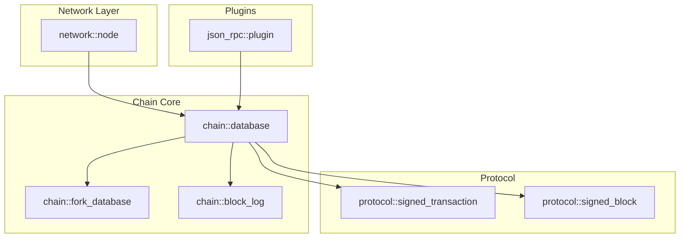
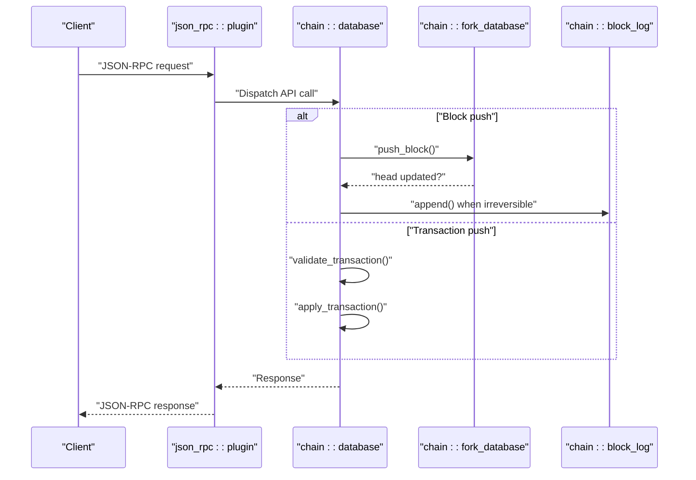
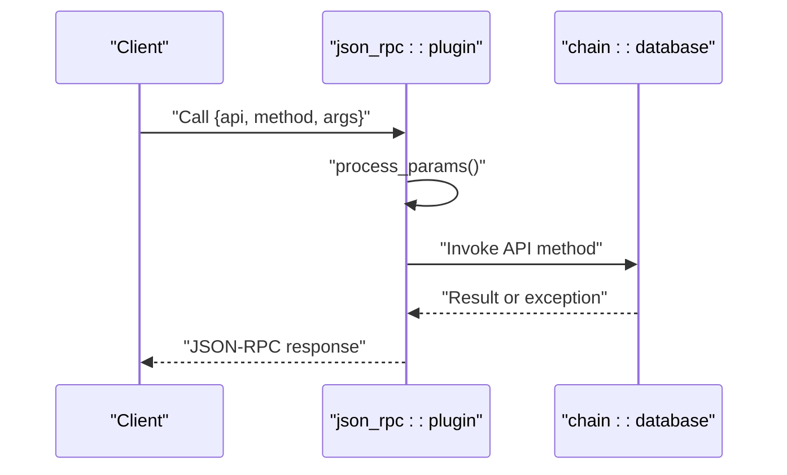
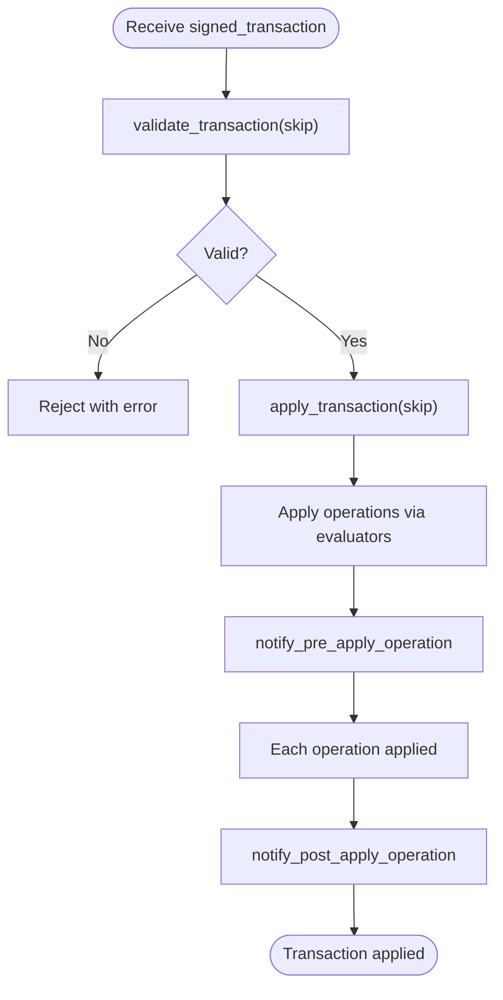
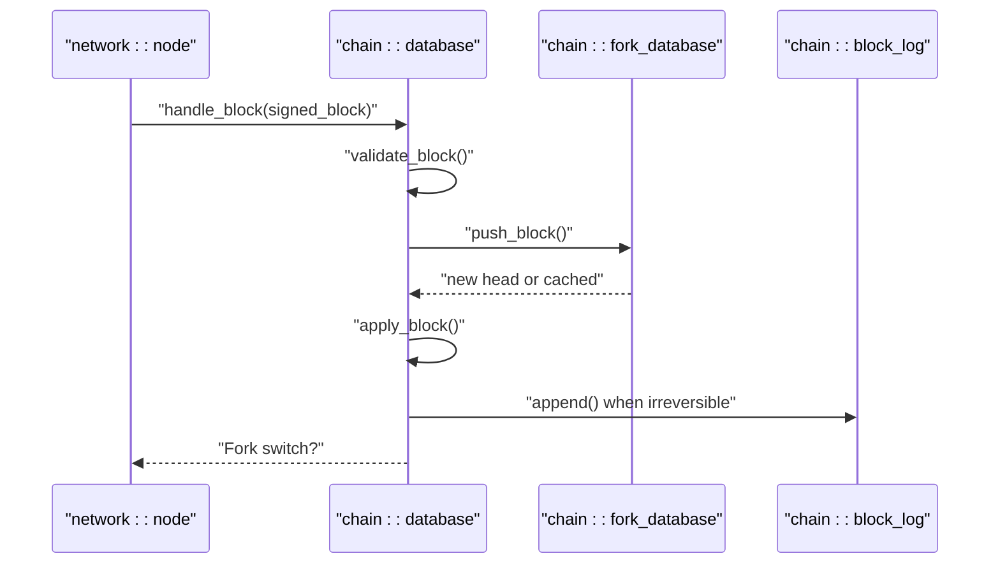
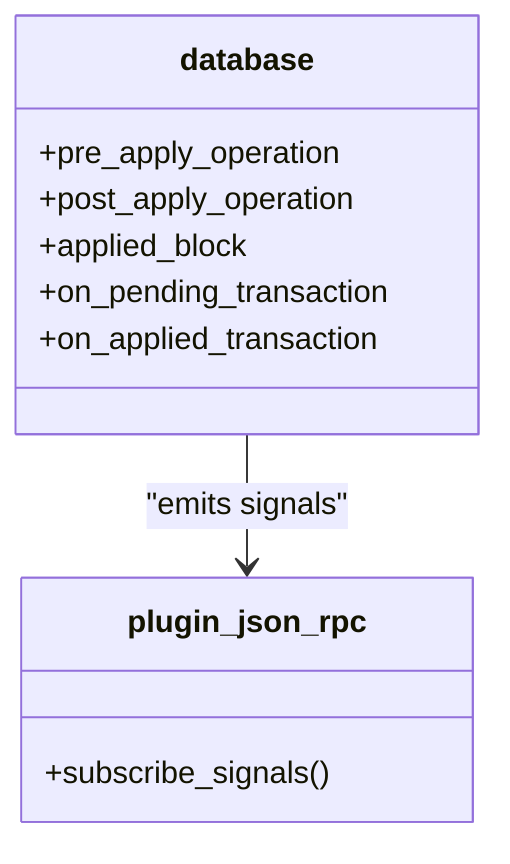
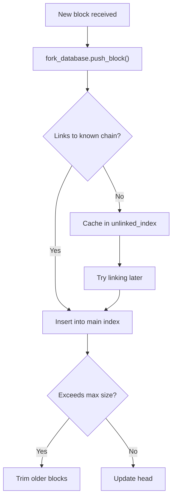
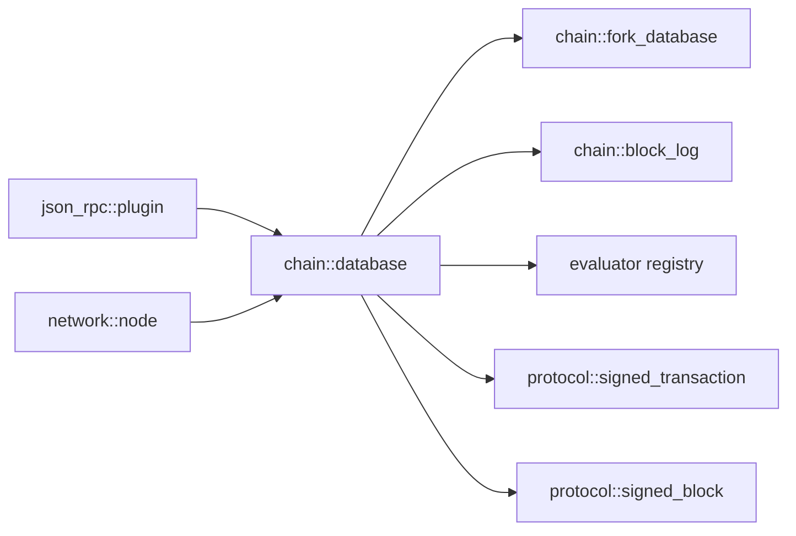

# Data Flow and Processing

<cite>
**Referenced Files in This Document**
- [database.hpp](file://libraries/chain/include/graphene/chain/database.hpp)
- [database.cpp](file://libraries/chain/database.cpp)
- [fork_database.hpp](file://libraries/chain/include/graphene/chain/fork_database.hpp)
- [fork_database.cpp](file://libraries/chain/fork_database.cpp)
- [chain_evaluator.hpp](file://libraries/chain/include/graphene/chain/chain_evaluator.hpp)
- [evaluator.hpp](file://libraries/chain/include/graphene/chain/evaluator.hpp)
- [chain_evaluator.cpp](file://libraries/chain/chain_evaluator.cpp)
- [operation_notification.hpp](file://libraries/chain/include/graphene/chain/operation_notification.hpp)
- [block_log.hpp](file://libraries/chain/include/graphene/chain/block_log.hpp)
- [block_log.cpp](file://libraries/chain/block_log.cpp)
- [transaction.hpp](file://libraries/protocol/include/graphene/protocol/transaction.hpp)
- [block.hpp](file://libraries/protocol/include/graphene/protocol/block.hpp)
- [node.hpp](file://libraries/network/include/graphene/network/node.hpp)
- [plugin.hpp](file://plugins/json_rpc/include/graphene/plugins/json_rpc/plugin.hpp)
- [plugin.cpp](file://plugins/json_rpc/plugin.cpp)
</cite>

## Table of Contents
1. [Introduction](#introduction)
2. [Project Structure](#project-structure)
3. [Core Components](#core-components)
4. [Architecture Overview](#architecture-overview)
5. [Detailed Component Analysis](#detailed-component-analysis)
6. [Dependency Analysis](#dependency-analysis)
7. [Performance Considerations](#performance-considerations)
8. [Troubleshooting Guide](#troubleshooting-guide)
9. [Conclusion](#conclusion)

## Introduction
This document explains the end-to-end data flow and processing patterns in the VIZ node. It covers how incoming JSON-RPC requests are routed to APIs, how transactions are validated and applied, how blocks are validated and integrated, and how state changes are persisted. It also documents the observer pattern used for event-driven architecture, the fork resolution mechanism, and performance-related strategies such as caching and memory management.

## Project Structure
At a high level, the VIZ node is organized around:
- Protocol primitives (transactions, blocks, operations)
- Chain database and state management
- Fork database for out-of-order block handling
- Block log for durable storage
- Plugins for API exposure (JSON-RPC)
- Network layer for peer-to-peer synchronization

**Diagram sources**
- [node.hpp](file://libraries/network/include/graphene/network/node.hpp#L180-L304)
- [plugin.hpp](file://plugins/json_rpc/include/graphene/plugins/json_rpc/plugin.hpp#L84-L118)
- [database.hpp](file://libraries/chain/include/graphene/chain/database.hpp#L36-L561)
- [fork_database.hpp](file://libraries/chain/include/graphene/chain/fork_database.hpp#L53-L122)
- [block_log.hpp](file://libraries/chain/include/graphene/chain/block_log.hpp#L38-L71)
- [transaction.hpp](file://libraries/protocol/include/graphene/protocol/transaction.hpp#L57-L101)
- [block.hpp](file://libraries/protocol/include/graphene/protocol/block.hpp#L9-L18)

**Section sources**
- [node.hpp](file://libraries/network/include/graphene/network/node.hpp#L180-L304)
- [plugin.hpp](file://plugins/json_rpc/include/graphene/plugins/json_rpc/plugin.hpp#L84-L118)
- [database.hpp](file://libraries/chain/include/graphene/chain/database.hpp#L36-L561)
- [fork_database.hpp](file://libraries/chain/include/graphene/chain/fork_database.hpp#L53-L122)
- [block_log.hpp](file://libraries/chain/include/graphene/chain/block_log.hpp#L38-L71)
- [transaction.hpp](file://libraries/protocol/include/graphene/protocol/transaction.hpp#L57-L101)
- [block.hpp](file://libraries/protocol/include/graphene/protocol/block.hpp#L9-L18)

## Core Components
- chain::database: central state machine managing blockchain lifecycle, validation, and persistence. Provides push_block, push_transaction, and related hooks.
- chain::fork_database: maintains a tree of candidate blocks for fork resolution and out-of-order pushes.
- chain::block_log: durable append-only storage of blocks with random access via index.
- protocol::signed_transaction and protocol::signed_block: typed structures for transactions and blocks.
- json_rpc::plugin: exposes APIs over JSON-RPC and dispatches calls to registered methods.
- network::node: handles peer synchronization and relaying of blocks/transactions.

Key responsibilities:
- Validation flags and skip modes for performance tuning
- Merkle roots, TAPOS, and block size limits
- Undo sessions, revision management, and memory scaling
- Signals for observers (pre/post operation, applied block, pending transactions)

**Section sources**
- [database.hpp](file://libraries/chain/include/graphene/chain/database.hpp#L56-L73)
- [database.hpp](file://libraries/chain/include/graphene/chain/database.hpp#L194-L227)
- [database.hpp](file://libraries/chain/include/graphene/chain/database.hpp#L252-L275)
- [fork_database.hpp](file://libraries/chain/include/graphene/chain/fork_database.hpp#L53-L122)
- [block_log.hpp](file://libraries/chain/include/graphene/chain/block_log.hpp#L38-L71)
- [transaction.hpp](file://libraries/protocol/include/graphene/protocol/transaction.hpp#L57-L101)
- [block.hpp](file://libraries/protocol/include/graphene/protocol/block.hpp#L9-L18)
- [plugin.hpp](file://plugins/json_rpc/include/graphene/plugins/json_rpc/plugin.hpp#L84-L118)

## Architecture Overview
The VIZ node follows a layered architecture:
- Application layer: JSON-RPC plugin receives requests and routes them to APIs.
- Chain layer: database orchestrates validation, evaluation, and persistence.
- Storage layer: fork_database caches reversible blocks; block_log persists irreversible blocks.
- Network layer: node manages synchronization and propagation.

**Diagram sources**
- [plugin.cpp](file://plugins/json_rpc/plugin.cpp#L402-L423)
- [database.hpp](file://libraries/chain/include/graphene/chain/database.hpp#L194-L227)
- [fork_database.cpp](file://libraries/chain/fork_database.cpp#L33-L45)
- [block_log.cpp](file://libraries/chain/block_log.cpp#L253-L257)

## Detailed Component Analysis

### JSON-RPC Request Pipeline
- The JSON-RPC plugin parses incoming messages, validates method names, and dispatches to registered API methods.
- It supports batch requests and returns responses in order.
- Errors are normalized into JSON-RPC error codes.

**Diagram sources**
- [plugin.cpp](file://plugins/json_rpc/plugin.cpp#L180-L256)
- [plugin.cpp](file://plugins/json_rpc/plugin.cpp#L402-L423)

**Section sources**
- [plugin.hpp](file://plugins/json_rpc/include/graphene/plugins/json_rpc/plugin.hpp#L84-L118)
- [plugin.cpp](file://plugins/json_rpc/plugin.cpp#L180-L256)
- [plugin.cpp](file://plugins/json_rpc/plugin.cpp#L402-L423)

### Transaction Processing Pipeline
- Incoming signed transactions are validated against chain parameters (TAPOS, expiration, signatures) and then applied to state.
- Validation can be partially skipped for performance (e.g., during reindex) via skip flags.
- Transactions are evaluated via registered evaluators; each operation triggers pre/post operation notifications.

**Diagram sources**
- [database.hpp](file://libraries/chain/include/graphene/chain/database.hpp#L423-L424)
- [database.hpp](file://libraries/chain/include/graphene/chain/database.hpp#L468-L476)
- [operation_notification.hpp](file://libraries/chain/include/graphene/chain/operation_notification.hpp#L11-L23)
- [chain_evaluator.hpp](file://libraries/chain/include/graphene/chain/chain_evaluator.hpp#L14-L79)

**Section sources**
- [database.hpp](file://libraries/chain/include/graphene/chain/database.hpp#L423-L424)
- [database.hpp](file://libraries/chain/include/graphene/chain/database.hpp#L468-L476)
- [operation_notification.hpp](file://libraries/chain/include/graphene/chain/operation_notification.hpp#L11-L23)
- [chain_evaluator.hpp](file://libraries/chain/include/graphene/chain/chain_evaluator.hpp#L14-L79)

### Block Processing Flow
- validate_block performs Merkle root and block size checks.
- push_block integrates a block into the chain, updating dynamic properties, witness participation, and last irreversible block.
- apply_block coordinates per-block state transitions and emits applied_block signals.

**Diagram sources**
- [node.hpp](file://libraries/network/include/graphene/network/node.hpp#L79-L80)
- [database.cpp](file://libraries/chain/database.cpp#L738-L756)
- [database.cpp](file://libraries/chain/database.cpp#L794-L800)
- [fork_database.cpp](file://libraries/chain/fork_database.cpp#L33-L45)
- [block_log.cpp](file://libraries/chain/block_log.cpp#L253-L257)

**Section sources**
- [database.cpp](file://libraries/chain/database.cpp#L738-L756)
- [database.cpp](file://libraries/chain/database.cpp#L794-L800)
- [fork_database.cpp](file://libraries/chain/fork_database.cpp#L33-L45)
- [block_log.cpp](file://libraries/chain/block_log.cpp#L253-L257)

### Observer Pattern and Signals
- The database exposes fc::signal callbacks for:
  - pre_apply_operation and post_apply_operation
  - applied_block
  - on_pending_transaction and on_applied_transaction
- Plugins subscribe to these signals to react to state changes without tight coupling.

**Diagram sources**
- [database.hpp](file://libraries/chain/include/graphene/chain/database.hpp#L252-L275)
- [plugin.hpp](file://plugins/json_rpc/include/graphene/plugins/json_rpc/plugin.hpp#L84-L118)

**Section sources**
- [database.hpp](file://libraries/chain/include/graphene/chain/database.hpp#L252-L275)
- [plugin.hpp](file://plugins/json_rpc/include/graphene/plugins/json_rpc/plugin.hpp#L84-L118)

### Data Persistence and Fork Resolution
- fork_database stores candidate blocks and resolves forks by walking branches to a common ancestor.
- block_log provides durable storage with an index enabling O(1) random access by block number.
- Memory management includes reserved/shared memory sizing and periodic resizing during reindex.

**Diagram sources**
- [fork_database.cpp](file://libraries/chain/fork_database.cpp#L33-L90)
- [fork_database.cpp](file://libraries/chain/fork_database.cpp#L92-L124)

**Section sources**
- [fork_database.hpp](file://libraries/chain/include/graphene/chain/fork_database.hpp#L53-L122)
- [fork_database.cpp](file://libraries/chain/fork_database.cpp#L33-L90)
- [fork_database.cpp](file://libraries/chain/fork_database.cpp#L92-L124)
- [block_log.cpp](file://libraries/chain/block_log.cpp#L134-L193)
- [database.cpp](file://libraries/chain/database.cpp#L368-L430)

## Dependency Analysis
- chain::database depends on:
  - chain::fork_database for reversible blocks
  - chain::block_log for persistent storage
  - protocol::signed_transaction and signed_block for data structures
  - evaluator registry for operation application
- json_rpc::plugin depends on appbase and fc variants for request/response handling.
- network::node delegates block and transaction handling to the chain database.

**Diagram sources**
- [plugin.hpp](file://plugins/json_rpc/include/graphene/plugins/json_rpc/plugin.hpp#L84-L118)
- [node.hpp](file://libraries/network/include/graphene/network/node.hpp#L180-L304)
- [database.hpp](file://libraries/chain/include/graphene/chain/database.hpp#L36-L561)
- [fork_database.hpp](file://libraries/chain/include/graphene/chain/fork_database.hpp#L53-L122)
- [block_log.hpp](file://libraries/chain/include/graphene/chain/block_log.hpp#L38-L71)
- [transaction.hpp](file://libraries/protocol/include/graphene/protocol/transaction.hpp#L57-L101)
- [block.hpp](file://libraries/protocol/include/graphene/protocol/block.hpp#L9-L18)

**Section sources**
- [plugin.hpp](file://plugins/json_rpc/include/graphene/plugins/json_rpc/plugin.hpp#L84-L118)
- [node.hpp](file://libraries/network/include/graphene/network/node.hpp#L180-L304)
- [database.hpp](file://libraries/chain/include/graphene/chain/database.hpp#L36-L561)

## Performance Considerations
- Skip flags: The database supports extensive skip masks to bypass expensive validations during reindex or trusted operations.
- Memory scaling: Shared memory is resized dynamically when free memory drops below thresholds; reserved memory protects critical operations.
- Caching: TAPOS buffers and block summary indices accelerate block ID lookups; fork_database caches recent blocks up to a configurable maximum.
- Batch processing: JSON-RPC plugin supports batch requests and streams responses efficiently.

Recommendations:
- Tune skip flags for trusted environments (e.g., skip signatures for non-witness nodes).
- Monitor free memory and adjust shared file sizing to avoid frequent resizes.
- Use checkpoints to reduce validation overhead on startup.
- Leverage evaluators’ early exits and minimal authority checks where safe.

**Section sources**
- [database.hpp](file://libraries/chain/include/graphene/chain/database.hpp#L56-L73)
- [database.cpp](file://libraries/chain/database.cpp#L368-L430)
- [database.cpp](file://libraries/chain/database.cpp#L270-L350)
- [plugin.cpp](file://plugins/json_rpc/plugin.cpp#L313-L336)

## Troubleshooting Guide
Common issues and diagnostics:
- Block validation failures: Check Merkle root mismatch and block size violations; consult fork database state and block log head consistency.
- Transaction rejection: Inspect TAPOS, expiration, and authority verification errors; review skip flags used during validation.
- Memory exhaustion: Watch logs indicating low free memory and automatic shared memory resizing; increase reserved size or shared file size.
- Fork instability: Verify fork database head and branch resolution; ensure block ordering and previous ID consistency.

Operational tips:
- Use reindex mode with appropriate skip flags to recover from inconsistent state.
- Subscribe to on_applied_transaction and applied_block signals for observability.
- Validate chain state against block log head to detect divergence.

**Section sources**
- [database.cpp](file://libraries/chain/database.cpp#L738-L792)
- [database.cpp](file://libraries/chain/database.cpp#L270-L350)
- [fork_database.cpp](file://libraries/chain/fork_database.cpp#L47-L71)
- [block_log.cpp](file://libraries/chain/block_log.cpp#L134-L193)

## Conclusion
The VIZ node implements a robust, event-driven data flow from JSON-RPC to state application and persistence. Its layered design separates concerns between networking, API exposure, state management, and storage, while providing powerful mechanisms for validation, fork resolution, and performance tuning. Observers can react to state changes via signals, and plugins integrate seamlessly with the core database through well-defined interfaces.