# Event-Driven Communication Patterns

<cite>
**Referenced Files in This Document**
- [database.hpp](file://libraries/chain/include/graphene/chain/database.hpp)
- [database.cpp](file://libraries/chain/database.cpp)
- [plugin.hpp](file://plugins/chain/include/graphene/plugins/chain/plugin.hpp)
- [plugin.cpp](file://plugins/chain/plugin.cpp)
- [block_info_plugin.cpp](file://plugins/block_info/plugin.cpp)
- [database_api_plugin.cpp](file://plugins/database_api/api.cpp)
- [debug_node_plugin.cpp](file://plugins/debug_node/plugin.cpp)
- [network_broadcast_api_plugin.hpp](file://plugins/network_broadcast_api/include/graphene/plugins/network_broadcast_api/network_broadcast_api_plugin.hpp)
- [main.cpp](file://programs/cli_wallet/main.cpp)
- [webserver_plugin.cpp](file://plugins/webserver/webserver_plugin.cpp)
</cite>

## Table of Contents
1. [Introduction](#introduction)
2. [Project Structure](#project-structure)
3. [Core Components](#core-components)
4. [Architecture Overview](#architecture-overview)
5. [Detailed Component Analysis](#detailed-component-analysis)
6. [Dependency Analysis](#dependency-analysis)
7. [Performance Considerations](#performance-considerations)
8. [Troubleshooting Guide](#troubleshooting-guide)
9. [Conclusion](#conclusion)

## Introduction
This document explains the event-driven architecture and observer pattern implementation in the VIZ node. It focuses on how signals and slots enable decoupled communication between plugins and core components, how state changes propagate through event notifications, and how Boost.Signals2 and fc::signal are used to manage subscriptions and callbacks. It also covers plugin communication mechanisms, inter-component messaging patterns, and practical examples such as account updates, transaction confirmations, and block notifications. Finally, it addresses performance implications and optimization strategies for high-frequency events.

## Project Structure
The event-driven design spans three primary layers:
- Core chain engine: emits domain-specific events (operations, blocks, transactions).
- Plugin layer: subscribes to events and implements specialized behaviors.
- Application integrations: CLI, web server, and RPC plugins consume events for user-facing features.

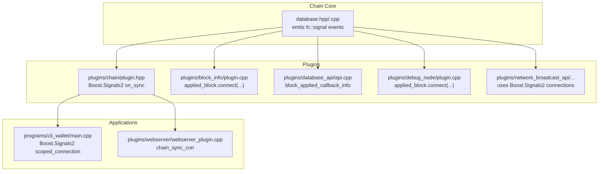

**Diagram sources**
- [database.hpp](file://libraries/chain/include/graphene/chain/database.hpp#L252-L275)
- [database.cpp](file://libraries/chain/database.cpp#L1157-L1198)
- [plugin.hpp](file://plugins/chain/include/graphene/plugins/chain/plugin.hpp#L89-L90)
- [block_info_plugin.cpp](file://plugins/block_info/plugin.cpp#L140-L142)
- [database_api_plugin.cpp](file://plugins/database_api/api.cpp#L27-L51)
- [debug_node_plugin.cpp](file://plugins/debug_node/plugin.cpp#L131-L133)
- [network_broadcast_api_plugin.hpp](file://plugins/network_broadcast_api/include/graphene/plugins/network_broadcast_api/network_broadcast_api_plugin.hpp#L78-L78)
- [main.cpp](file://programs/cli_wallet/main.cpp#L180-L196)
- [webserver_plugin.cpp](file://plugins/webserver/webserver_plugin.cpp#L108-L108)

**Section sources**
- [database.hpp](file://libraries/chain/include/graphene/chain/database.hpp#L252-L275)
- [database.cpp](file://libraries/chain/database.cpp#L1157-L1198)
- [plugin.hpp](file://plugins/chain/include/graphene/plugins/chain/plugin.hpp#L89-L90)
- [block_info_plugin.cpp](file://plugins/block_info/plugin.cpp#L140-L142)
- [database_api_plugin.cpp](file://plugins/database_api/api.cpp#L27-L51)
- [debug_node_plugin.cpp](file://plugins/debug_node/plugin.cpp#L131-L133)
- [network_broadcast_api_plugin.hpp](file://plugins/network_broadcast_api/include/graphene/plugins/network_broadcast_api/network_broadcast_api_plugin.hpp#L78-L78)
- [main.cpp](file://programs/cli_wallet/main.cpp#L180-L196)
- [webserver_plugin.cpp](file://plugins/webserver/webserver_plugin.cpp#L108-L108)

## Core Components
- Chain database events:
  - Operation lifecycle: pre_apply_operation and post_apply_operation.
  - Block lifecycle: applied_block.
  - Transaction lifecycle: on_pending_transaction and on_applied_transaction.
- Plugin-level synchronization: chain plugin emits on_sync via Boost.Signals2.
- Observer pattern in plugins:
  - Plugins connect to database signals to receive notifications.
  - Callbacks are wrapped in scoped_connection/connection to manage lifetime safely.

Key event emitters and receivers:
- Emitters (database):
  - notify_pre_apply_operation, notify_post_apply_operation, notify_applied_block, notify_on_pending_transaction, notify_on_applied_transaction.
- Receivers (plugins):
  - block_info plugin connects to applied_block.
  - database_api plugin manages block_applied_callback_info with connection-based callbacks.
  - debug_node plugin connects to applied_block.
  - chain plugin exposes on_sync for external synchronization.

**Section sources**
- [database.hpp](file://libraries/chain/include/graphene/chain/database.hpp#L238-L275)
- [database.cpp](file://libraries/chain/database.cpp#L1157-L1198)
- [plugin.hpp](file://plugins/chain/include/graphene/plugins/chain/plugin.hpp#L89-L90)
- [block_info_plugin.cpp](file://plugins/block_info/plugin.cpp#L140-L142)
- [database_api_plugin.cpp](file://plugins/database_api/api.cpp#L27-L51)
- [debug_node_plugin.cpp](file://plugins/debug_node/plugin.cpp#L131-L133)

## Architecture Overview
The event architecture follows a publish-subscribe model:
- Publishers: chain database emits fc::signal events during block/application processing.
- Subscribers: plugins register callbacks to receive notifications.
- Synchronization: chain plugin emits on_sync for coordination with external systems.

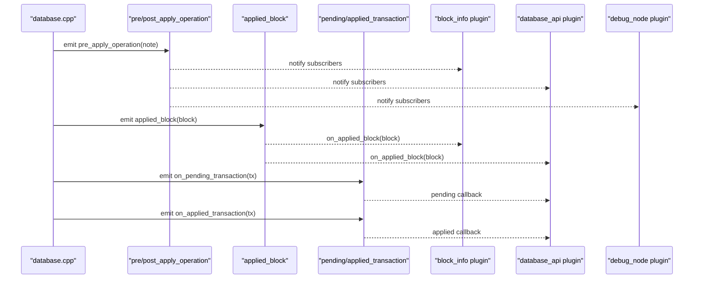

**Diagram sources**
- [database.cpp](file://libraries/chain/database.cpp#L1157-L1198)
- [block_info_plugin.cpp](file://plugins/block_info/plugin.cpp#L140-L142)
- [database_api_plugin.cpp](file://plugins/database_api/api.cpp#L27-L51)
- [debug_node_plugin.cpp](file://plugins/debug_node/plugin.cpp#L131-L133)

## Detailed Component Analysis

### Chain Database Event Emission
The database defines and emits multiple fc::signal events:
- pre_apply_operation and post_apply_operation for operation lifecycle.
- applied_block for block lifecycle.
- on_pending_transaction and on_applied_transaction for transaction lifecycle.

Implementation highlights:
- notify_* methods wrap CHAIN_TRY_NOTIFY to dispatch events to subscribers.
- Virtual operations and current context (block/trx/op indices) are attached to notifications.

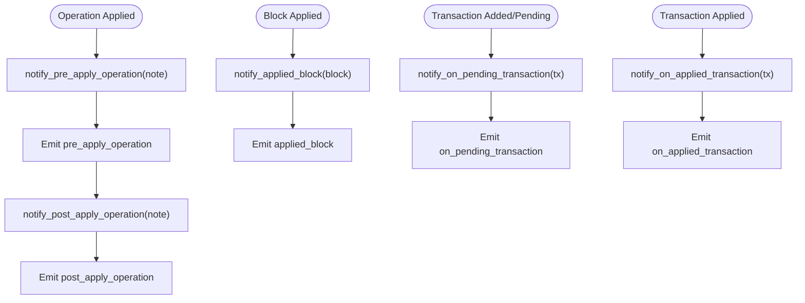

**Diagram sources**
- [database.cpp](file://libraries/chain/database.cpp#L1157-L1198)

**Section sources**
- [database.hpp](file://libraries/chain/include/graphene/chain/database.hpp#L238-L275)
- [database.cpp](file://libraries/chain/database.cpp#L1157-L1198)

### Chain Plugin Synchronization Signal
The chain plugin exposes on_sync via Boost.Signals2 to signal when the blockchain is syncing or live. This enables dependent components to coordinate their startup and state transitions.

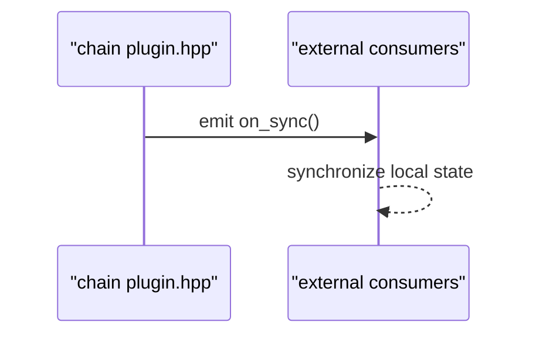

**Diagram sources**
- [plugin.hpp](file://plugins/chain/include/graphene/plugins/chain/plugin.hpp#L89-L90)

**Section sources**
- [plugin.hpp](file://plugins/chain/include/graphene/plugins/chain/plugin.hpp#L89-L90)

### Block Information Plugin Subscription
The block_info plugin subscribes to applied_block to maintain per-block metadata. It uses a scoped_connection to ensure automatic disconnection.

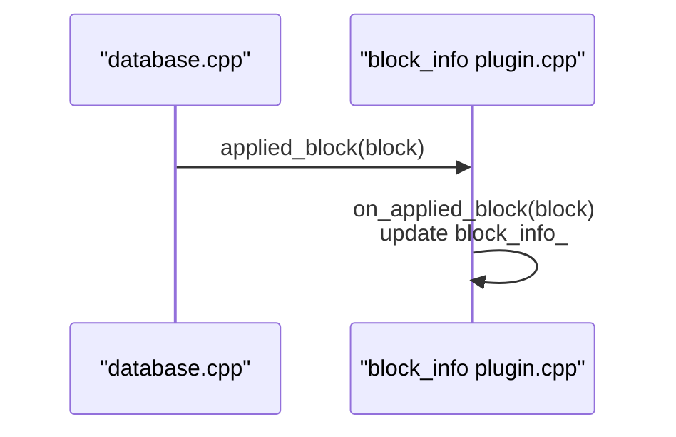

**Diagram sources**
- [block_info_plugin.cpp](file://plugins/block_info/plugin.cpp#L140-L142)

**Section sources**
- [block_info_plugin.cpp](file://plugins/block_info/plugin.cpp#L140-L142)

### Database API Plugin Callback Management
The database_api plugin maintains a container of block_applied_callback_info entries. Each entry holds a callback and a connection. Connections are disconnected upon callback exceptions to prevent leaks.

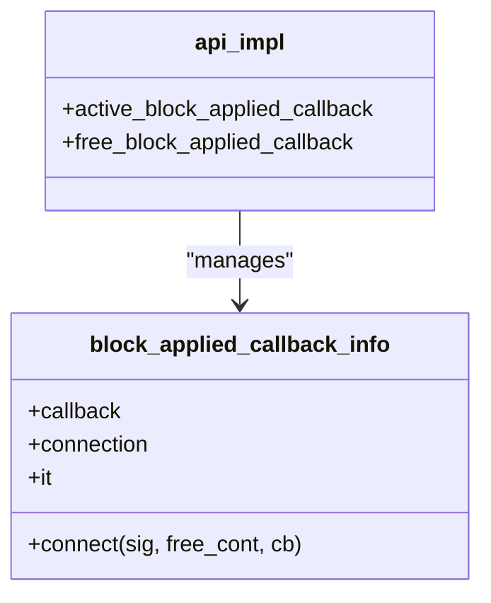

**Diagram sources**
- [database_api_plugin.cpp](file://plugins/database_api/api.cpp#L27-L51)

**Section sources**
- [database_api_plugin.cpp](file://plugins/database_api/api.cpp#L27-L51)

### Debug Node Plugin Subscription
The debug_node plugin subscribes to applied_block to conditionally re-apply debug updates on block application.

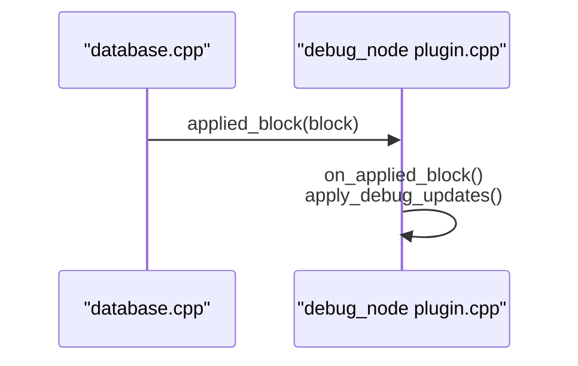

**Diagram sources**
- [debug_node_plugin.cpp](file://plugins/debug_node/plugin.cpp#L131-L133)

**Section sources**
- [debug_node_plugin.cpp](file://plugins/debug_node/plugin.cpp#L131-L133)

### Network Broadcast API Plugin Signal Connection
The network broadcast API plugin uses Boost.Signals2 connections to integrate with chain events. The header declares a scoped_connection member for lifecycle management.

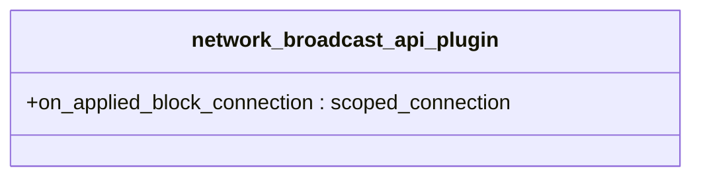

**Diagram sources**
- [network_broadcast_api_plugin.hpp](file://plugins/network_broadcast_api/include/graphene/plugins/network_broadcast_api/network_broadcast_api_plugin.hpp#L78-L78)

**Section sources**
- [network_broadcast_api_plugin.hpp](file://plugins/network_broadcast_api/include/graphene/plugins/network_broadcast_api/network_broadcast_api_plugin.hpp#L78-L78)

### CLI Wallet Signal Usage
The CLI wallet registers scoped_connection instances for various signals (e.g., websocket closed, quit command, lock state changes) to react to runtime events.

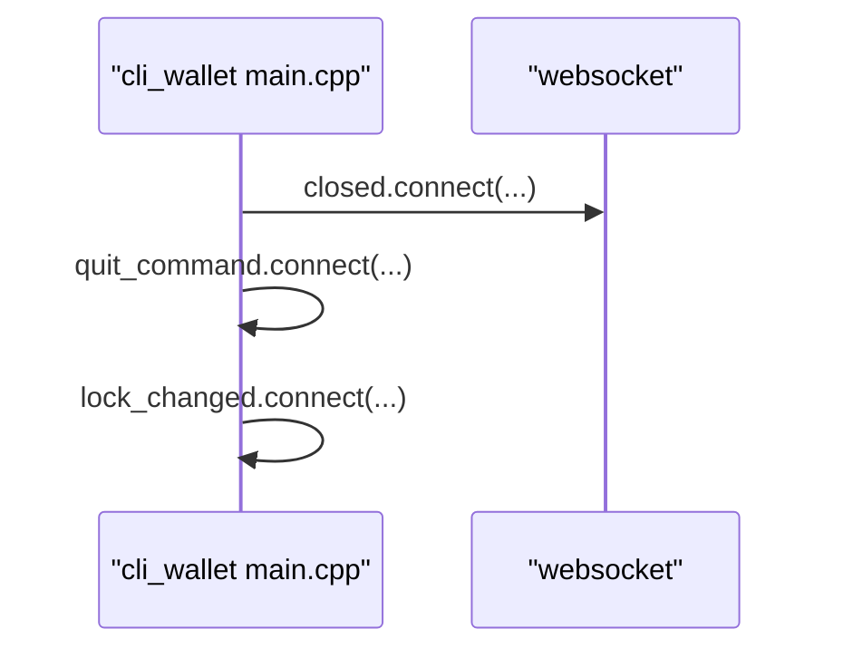

**Diagram sources**
- [main.cpp](file://programs/cli_wallet/main.cpp#L180-L196)

**Section sources**
- [main.cpp](file://programs/cli_wallet/main.cpp#L180-L196)

### Webserver Plugin Chain Sync Connection
The webserver plugin creates a scoped_connection to monitor chain synchronization events.

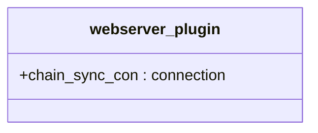

**Diagram sources**
- [webserver_plugin.cpp](file://plugins/webserver/webserver_plugin.cpp#L108-L108)

**Section sources**
- [webserver_plugin.cpp](file://plugins/webserver/webserver_plugin.cpp#L108-L108)

## Dependency Analysis
The event-driven architecture exhibits loose coupling:
- Database publishes events without knowing subscribers.
- Plugins subscribe independently, enabling modular extensions.
- External applications (CLI, webserver) subscribe to chain plugin’s on_sync.

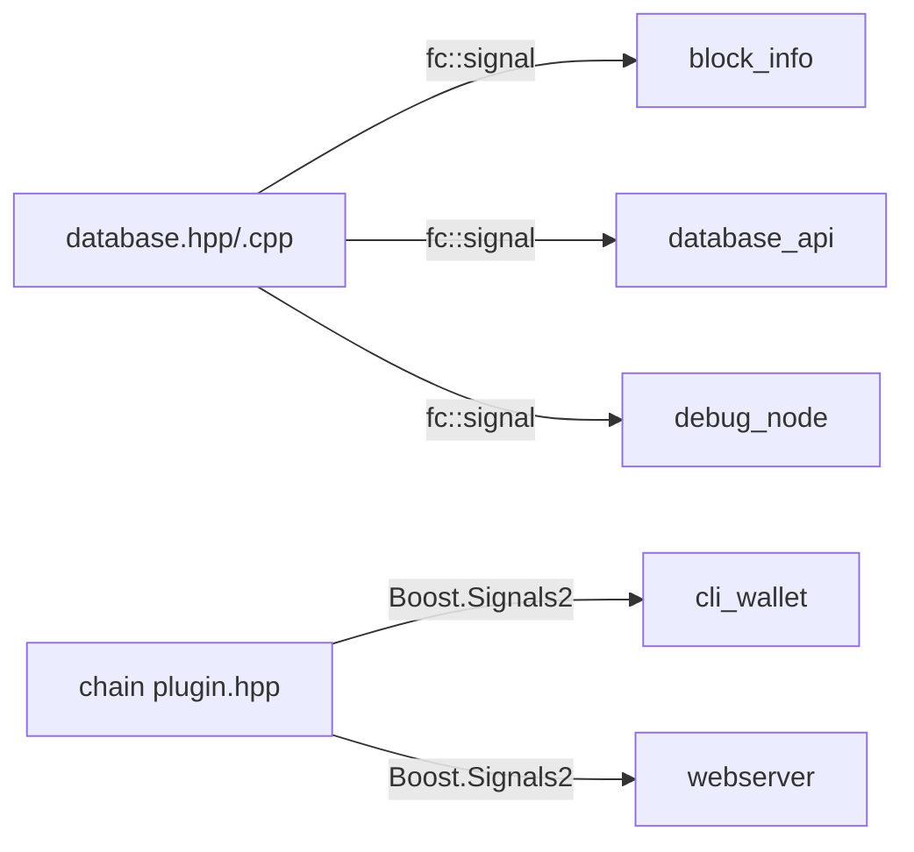

**Diagram sources**
- [database.hpp](file://libraries/chain/include/graphene/chain/database.hpp#L252-L275)
- [block_info_plugin.cpp](file://plugins/block_info/plugin.cpp#L140-L142)
- [database_api_plugin.cpp](file://plugins/database_api/api.cpp#L27-L51)
- [debug_node_plugin.cpp](file://plugins/debug_node/plugin.cpp#L131-L133)
- [plugin.hpp](file://plugins/chain/include/graphene/plugins/chain/plugin.hpp#L89-L90)
- [main.cpp](file://programs/cli_wallet/main.cpp#L180-L196)
- [webserver_plugin.cpp](file://plugins/webserver/webserver_plugin.cpp#L108-L108)

**Section sources**
- [database.hpp](file://libraries/chain/include/graphene/chain/database.hpp#L252-L275)
- [plugin.hpp](file://plugins/chain/include/graphene/plugins/chain/plugin.hpp#L89-L90)
- [block_info_plugin.cpp](file://plugins/block_info/plugin.cpp#L140-L142)
- [database_api_plugin.cpp](file://plugins/database_api/api.cpp#L27-L51)
- [debug_node_plugin.cpp](file://plugins/debug_node/plugin.cpp#L131-L133)
- [main.cpp](file://programs/cli_wallet/main.cpp#L180-L196)
- [webserver_plugin.cpp](file://plugins/webserver/webserver_plugin.cpp#L108-L108)

## Performance Considerations
High-frequency event loops (transactions, operations, blocks) require careful optimization:
- Minimize work inside event handlers:
  - Defer heavy computations to background threads or queues.
  - Use lightweight callbacks that primarily enqueue work.
- Batch updates:
  - Group frequent notifications (e.g., multiple transactions) into batches.
- Connection lifecycle:
  - Use scoped_connection/connection to avoid dangling callbacks and reduce cleanup overhead.
- Throttle UI/API updates:
  - Rate-limit or debounce notifications to clients to prevent overload.
- Lock contention:
  - Keep event handlers short; avoid holding database write locks for extended periods.
- Memory pressure:
  - Monitor callback containers and clean up inactive subscriptions promptly.

[No sources needed since this section provides general guidance]

## Troubleshooting Guide
Common issues and remedies:
- Handlers crash or throw:
  - database_api wraps callbacks in try/catch and disconnects failing connections to keep the system stable.
- Stale or missing subscriptions:
  - Ensure scoped_connection/connection remains alive for the handler’s lifetime; verify plugin initialization order.
- Deadlocks or long-running handlers:
  - Move blocking work off the event thread; use async dispatch patterns.
- Excessive event volume:
  - Apply rate limiting or filtering; consider bloom filters for subscription items.

**Section sources**
- [database_api_plugin.cpp](file://plugins/database_api/api.cpp#L42-L49)

## Conclusion
The VIZ node employs a robust event-driven architecture centered on fc::signal emissions from the chain database and Boost.Signals2-based synchronization in plugins. This design enables decoupled communication, modular plugin development, and scalable inter-component messaging. By adhering to best practices—such as short handlers, safe connection lifecycles, batching, and throttling—developers can maintain responsiveness under high-frequency event loads while preserving system stability.