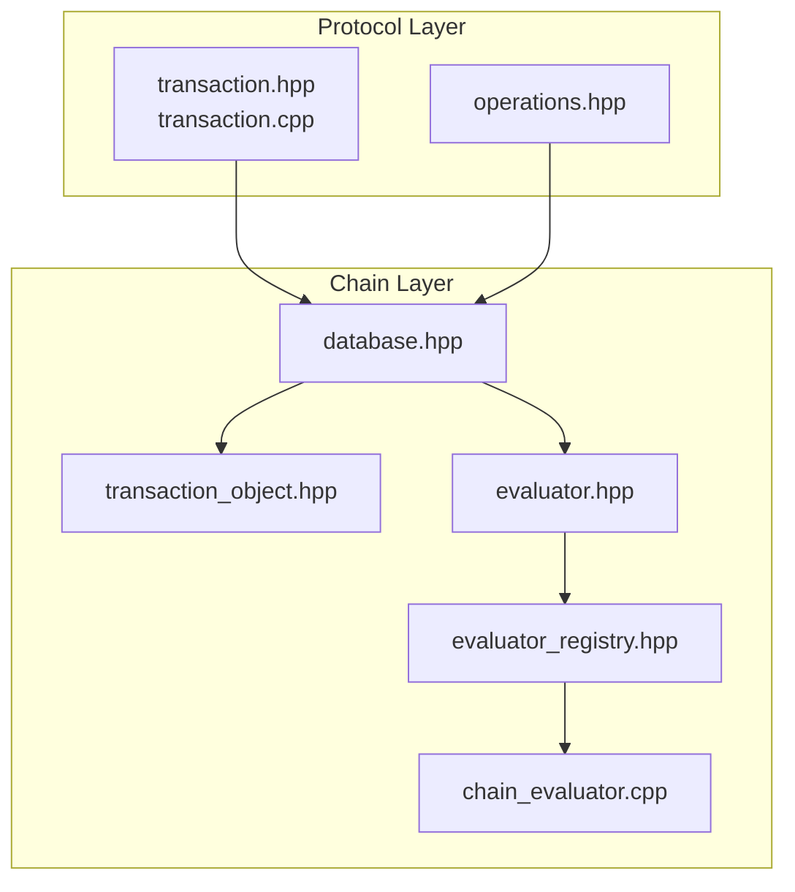
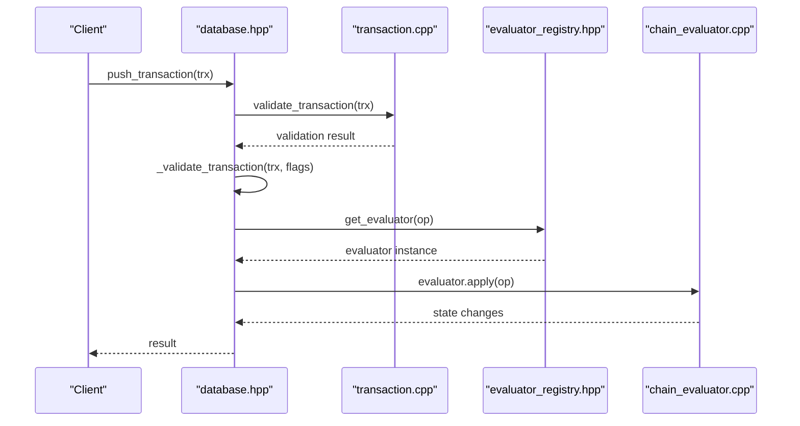
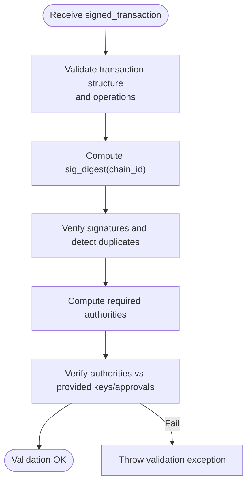
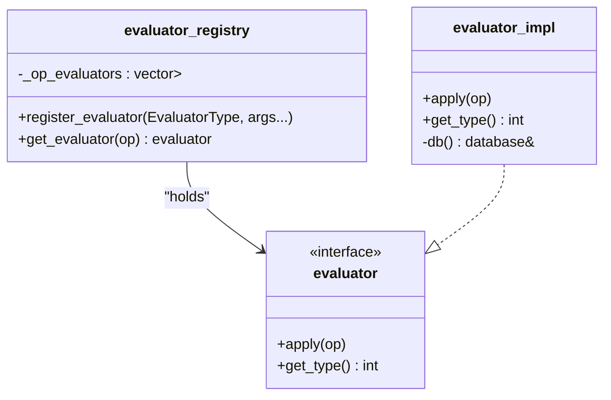
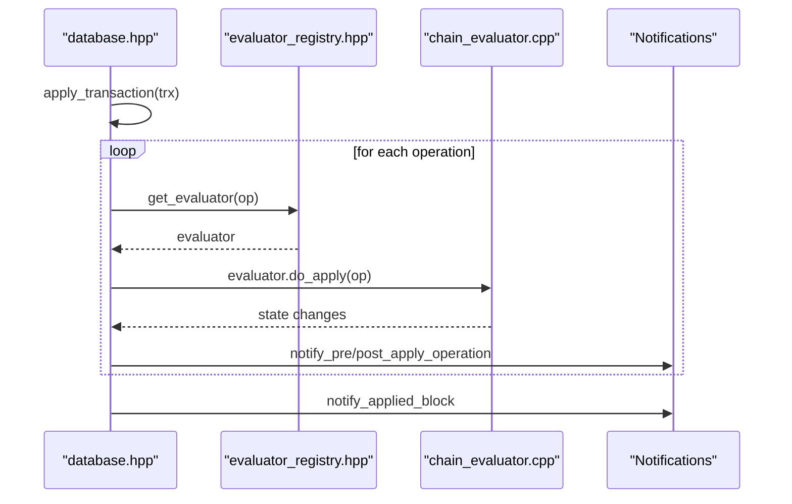
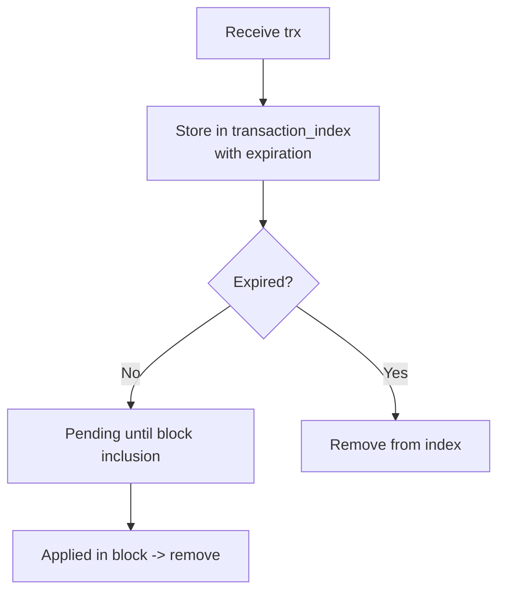
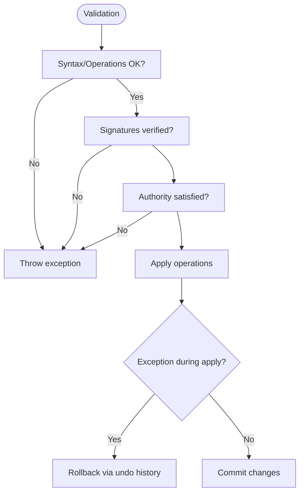
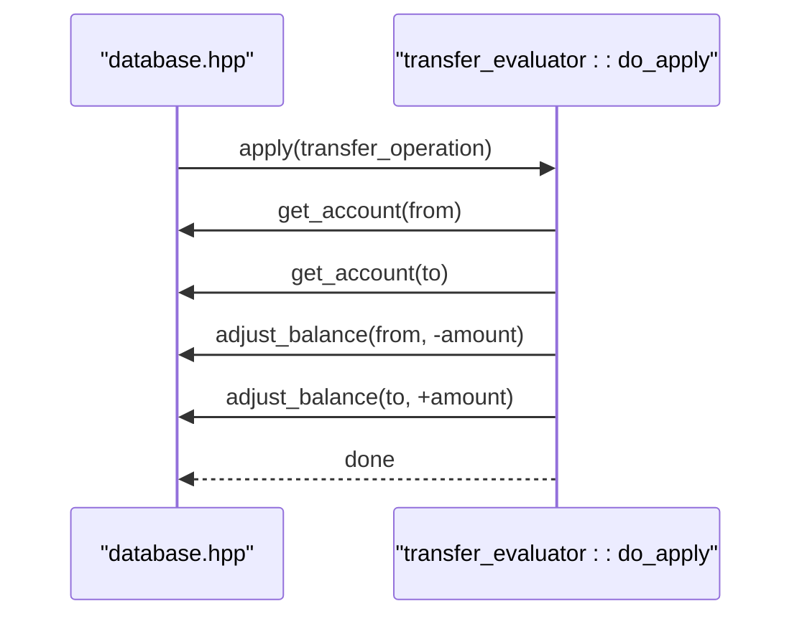
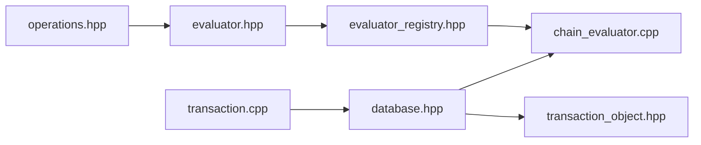

# Transaction Processing Pipeline

<cite>
**Referenced Files in This Document**
- [transaction_object.hpp](file://libraries/chain/include/graphene/chain/transaction_object.hpp)
- [transaction.cpp](file://libraries/protocol/transaction.cpp)
- [operations.hpp](file://libraries/protocol/include/graphene/protocol/operations.hpp)
- [evaluator.hpp](file://libraries/chain/include/graphene/chain/evaluator.hpp)
- [evaluator_registry.hpp](file://libraries/chain/include/graphene/chain/evaluator_registry.hpp)
- [chain_evaluator.cpp](file://libraries/chain/chain_evaluator.cpp)
- [database.hpp](file://libraries/chain/include/graphene/chain/database.hpp)
</cite>

## Table of Contents
1. [Introduction](#introduction)
2. [Project Structure](#project-structure)
3. [Core Components](#core-components)
4. [Architecture Overview](#architecture-overview)
5. [Detailed Component Analysis](#detailed-component-analysis)
6. [Dependency Analysis](#dependency-analysis)
7. [Performance Considerations](#performance-considerations)
8. [Troubleshooting Guide](#troubleshooting-guide)
9. [Conclusion](#conclusion)

## Introduction
This document explains the transaction processing pipeline in the VIZ node from reception to final application. It covers validation stages (syntax, signatures, authority), operation processing via evaluators, and state application. It also documents the evaluator registry mechanism, transaction object lifecycle, error handling, rollback, and performance optimizations such as batch-like pending transaction handling and caching via the database’s internal caches.

## Project Structure
The transaction pipeline spans protocol-level transaction definitions, chain-level validation and application, and evaluator dispatch. Key areas:
- Protocol: transaction definition, validation, signature verification, authority computation
- Chain: database orchestration, validation flags, pending transactions, block application
- Evaluators: operation-specific logic and state mutations
- Registry: mapping operations to evaluators

**Diagram sources**
- [transaction.cpp](file://libraries/protocol/transaction.cpp#L30-L36)
- [operations.hpp](file://libraries/protocol/include/graphene/protocol/operations.hpp#L13-L102)
- [database.hpp](file://libraries/chain/include/graphene/chain/database.hpp#L200-L206)
- [transaction_object.hpp](file://libraries/chain/include/graphene/chain/transaction_object.hpp#L19-L49)
- [evaluator.hpp](file://libraries/chain/include/graphene/chain/evaluator.hpp#L11-L45)
- [evaluator_registry.hpp](file://libraries/chain/include/graphene/chain/evaluator_registry.hpp#L8-L40)
- [chain_evaluator.cpp](file://libraries/chain/chain_evaluator.cpp#L52-L141)

**Section sources**
- [transaction.cpp](file://libraries/protocol/transaction.cpp#L30-L36)
- [operations.hpp](file://libraries/protocol/include/graphene/protocol/operations.hpp#L13-L102)
- [database.hpp](file://libraries/chain/include/graphene/chain/database.hpp#L200-L206)
- [transaction_object.hpp](file://libraries/chain/include/graphene/chain/transaction_object.hpp#L19-L49)
- [evaluator.hpp](file://libraries/chain/include/graphene/chain/evaluator.hpp#L11-L45)
- [evaluator_registry.hpp](file://libraries/chain/include/graphene/chain/evaluator_registry.hpp#L8-L40)
- [chain_evaluator.cpp](file://libraries/chain/chain_evaluator.cpp#L52-L141)

## Core Components
- Transaction model and validation: syntax and operation validation, signature digest and verification, authority computation and verification
- Evaluator framework: base evaluator interface, typed evaluator implementation, and registry for dispatch
- Database orchestration: transaction validation entry points, pending transaction handling, block application, and state mutation hooks
- Transaction object: duplicate detection and expiration indexing

Key responsibilities:
- Protocol layer validates transaction structure and operation semantics and verifies signatures and authorities
- Chain layer coordinates validation and application, manages pending state, and applies operations atomically
- Evaluators implement operation-specific logic and state transitions
- Registry ensures correct evaluator selection per operation type

**Section sources**
- [transaction.cpp](file://libraries/protocol/transaction.cpp#L30-L36)
- [transaction.cpp](file://libraries/protocol/transaction.cpp#L94-L222)
- [transaction.cpp](file://libraries/protocol/transaction.cpp#L240-L357)
- [evaluator.hpp](file://libraries/chain/include/graphene/chain/evaluator.hpp#L11-L45)
- [evaluator_registry.hpp](file://libraries/chain/include/graphene/chain/evaluator_registry.hpp#L8-L40)
- [database.hpp](file://libraries/chain/include/graphene/chain/database.hpp#L200-L206)
- [transaction_object.hpp](file://libraries/chain/include/graphene/chain/transaction_object.hpp#L19-L49)

## Architecture Overview
End-to-end flow:
- Reception: client or plugin submits a signed transaction
- Validation: protocol-level checks (syntax, operations), signature verification, authority verification
- Application: database applies operations via evaluators, emitting notifications and virtual operations
- Persistence: successful transactions become eligible for inclusion in blocks

**Diagram sources**
- [database.hpp](file://libraries/chain/include/graphene/chain/database.hpp#L200-L206)
- [database.hpp](file://libraries/chain/include/graphene/chain/database.hpp#L468-L476)
- [transaction.cpp](file://libraries/protocol/transaction.cpp#L30-L36)
- [evaluator_registry.hpp](file://libraries/chain/include/graphene/chain/evaluator_registry.hpp#L23-L36)
- [chain_evaluator.cpp](file://libraries/chain/chain_evaluator.cpp#L52-L141)

## Detailed Component Analysis

### Transaction Validation Stages
- Syntax and operation validation: transaction must contain at least one operation; each operation is validated
- Signature verification: computes signature digest and verifies signatures; enforces uniqueness
- Authority verification: computes required authorities and validates provided signatures/authorities against thresholds and recursion limits

**Diagram sources**
- [transaction.cpp](file://libraries/protocol/transaction.cpp#L30-L36)
- [transaction.cpp](file://libraries/protocol/transaction.cpp#L45-L56)
- [transaction.cpp](file://libraries/protocol/transaction.cpp#L225-L237)
- [transaction.cpp](file://libraries/protocol/transaction.cpp#L240-L316)
- [transaction.cpp](file://libraries/protocol/transaction.cpp#L94-L222)

**Section sources**
- [transaction.cpp](file://libraries/protocol/transaction.cpp#L30-L36)
- [transaction.cpp](file://libraries/protocol/transaction.cpp#L45-L56)
- [transaction.cpp](file://libraries/protocol/transaction.cpp#L225-L237)
- [transaction.cpp](file://libraries/protocol/transaction.cpp#L240-L316)
- [transaction.cpp](file://libraries/protocol/transaction.cpp#L94-L222)

### Evaluator Registry Mechanism
- Registry stores a vector of evaluators indexed by operation type tag
- Registration binds operation type to evaluator implementation
- Dispatch selects evaluator by operation’s static_variant index

**Diagram sources**
- [evaluator_registry.hpp](file://libraries/chain/include/graphene/chain/evaluator_registry.hpp#L8-L40)
- [evaluator.hpp](file://libraries/chain/include/graphene/chain/evaluator.hpp#L11-L45)

**Section sources**
- [evaluator_registry.hpp](file://libraries/chain/include/graphene/chain/evaluator_registry.hpp#L8-L40)
- [evaluator.hpp](file://libraries/chain/include/graphene/chain/evaluator.hpp#L11-L45)

### Operation Processing and State Application
- Database coordinates validation and application
- Pending transactions are stored and later applied in block context
- Virtual operations may be emitted during evaluation
- Notifications are emitted pre/post operation and post block

**Diagram sources**
- [database.hpp](file://libraries/chain/include/graphene/chain/database.hpp#L468-L478)
- [evaluator_registry.hpp](file://libraries/chain/include/graphene/chain/evaluator_registry.hpp#L23-L36)
- [chain_evaluator.cpp](file://libraries/chain/chain_evaluator.cpp#L52-L141)
- [database.hpp](file://libraries/chain/include/graphene/chain/database.hpp#L238-L263)

**Section sources**
- [database.hpp](file://libraries/chain/include/graphene/chain/database.hpp#L468-L478)
- [evaluator_registry.hpp](file://libraries/chain/include/graphene/chain/evaluator_registry.hpp#L23-L36)
- [chain_evaluator.cpp](file://libraries/chain/chain_evaluator.cpp#L52-L141)
- [database.hpp](file://libraries/chain/include/graphene/chain/database.hpp#L238-L263)

### Transaction Object Lifecycle
- Creation: upon receipt, transactions may be recorded to prevent duplicates
- Expiration: transactions are tracked by expiration time
- Cleanup: expired entries are removed at block processing boundaries

**Diagram sources**
- [transaction_object.hpp](file://libraries/chain/include/graphene/chain/transaction_object.hpp#L19-L49)

**Section sources**
- [transaction_object.hpp](file://libraries/chain/include/graphene/chain/transaction_object.hpp#L19-L49)

### Error Handling and Rollback
- Validation throws exceptions on failures (syntax, signatures, authority)
- Authority verification uses assertions to enforce thresholds and detect unused approvals/signatures
- Database maintains sessions and undo history; on reindex or errors, state can be rolled back
- Pending transactions cache allows reapplication after popping blocks

**Diagram sources**
- [transaction.cpp](file://libraries/protocol/transaction.cpp#L30-L36)
- [transaction.cpp](file://libraries/protocol/transaction.cpp#L94-L222)
- [database.hpp](file://libraries/chain/include/graphene/chain/database.hpp#L466-L472)

**Section sources**
- [transaction.cpp](file://libraries/protocol/transaction.cpp#L94-L222)
- [database.hpp](file://libraries/chain/include/graphene/chain/database.hpp#L466-L472)

### Example: Transfer Operation Evaluation
- Demonstrates typical evaluator pattern: fetch accounts, validate balances, adjust assets, emit virtual operations if applicable

**Diagram sources**
- [chain_evaluator.cpp](file://libraries/chain/chain_evaluator.cpp#L857-L950)

**Section sources**
- [chain_evaluator.cpp](file://libraries/chain/chain_evaluator.cpp#L857-L950)

## Dependency Analysis
- Protocol depends on operations static variant to enumerate supported operations
- Database orchestrates validation and application and holds evaluator registry
- Evaluators depend on database for state queries and mutations
- Transaction object depends on protocol transaction types

**Diagram sources**
- [operations.hpp](file://libraries/protocol/include/graphene/protocol/operations.hpp#L13-L102)
- [evaluator.hpp](file://libraries/chain/include/graphene/chain/evaluator.hpp#L11-L45)
- [evaluator_registry.hpp](file://libraries/chain/include/graphene/chain/evaluator_registry.hpp#L8-L40)
- [chain_evaluator.cpp](file://libraries/chain/chain_evaluator.cpp#L52-L141)
- [transaction.cpp](file://libraries/protocol/transaction.cpp#L30-L36)
- [database.hpp](file://libraries/chain/include/graphene/chain/database.hpp#L200-L206)
- [transaction_object.hpp](file://libraries/chain/include/graphene/chain/transaction_object.hpp#L19-L49)

**Section sources**
- [operations.hpp](file://libraries/protocol/include/graphene/protocol/operations.hpp#L13-L102)
- [evaluator.hpp](file://libraries/chain/include/graphene/chain/evaluator.hpp#L11-L45)
- [evaluator_registry.hpp](file://libraries/chain/include/graphene/chain/evaluator_registry.hpp#L8-L40)
- [chain_evaluator.cpp](file://libraries/chain/chain_evaluator.cpp#L52-L141)
- [transaction.cpp](file://libraries/protocol/transaction.cpp#L30-L36)
- [database.hpp](file://libraries/chain/include/graphene/chain/database.hpp#L200-L206)
- [transaction_object.hpp](file://libraries/chain/include/graphene/chain/transaction_object.hpp#L19-L49)

## Performance Considerations
- Batch-like processing: pending transactions are accumulated and applied together during block processing, reducing repeated validations
- Caching: database caches frequently accessed state (accounts, witnesses, etc.) to avoid repeated lookups
- Validation flags: skip flags allow bypassing expensive checks during reindex or trusted contexts
- Indexing: transaction index supports duplicate detection and expiration cleanup

Recommendations:
- Prefer local transaction submission with minimal signatures to reduce verification overhead
- Use appropriate skip flags only when safe (e.g., during reindex)
- Monitor shared memory growth and tune flush intervals for block production nodes

**Section sources**
- [database.hpp](file://libraries/chain/include/graphene/chain/database.hpp#L200-L206)
- [database.hpp](file://libraries/chain/include/graphene/chain/database.hpp#L423-L423)
- [transaction_object.hpp](file://libraries/chain/include/graphene/chain/transaction_object.hpp#L19-L49)

## Troubleshooting Guide
Common issues and diagnostics:
- Transaction rejected due to missing or extra signatures: verify_authority enforces unused signature detection and throws explicit errors
- Insufficient authority: verify_authority enforces required active/master/regular thresholds and missing approvals
- Operation validation failure: transaction.validate triggers per-operation validation; inspect operation content and semantics
- Duplicate transaction: transaction_object prevents duplicate inclusion; check expiration and packing logic
- Pending transaction not applied: ensure node is not skipping transaction application or is not stalled on undo history

Actions:
- Enable verbose logs around validation and application
- Temporarily disable skip flags for diagnosis
- Confirm authority getters return expected keys and weights
- Verify chain ID and reference block fields are correct

**Section sources**
- [transaction.cpp](file://libraries/protocol/transaction.cpp#L76-L92)
- [transaction.cpp](file://libraries/protocol/transaction.cpp#L105-L222)
- [transaction.cpp](file://libraries/protocol/transaction.cpp#L30-L36)
- [transaction_object.hpp](file://libraries/chain/include/graphene/chain/transaction_object.hpp#L19-L49)
- [database.hpp](file://libraries/chain/include/graphene/chain/database.hpp#L200-L206)

## Conclusion
The VIZ node implements a robust transaction pipeline with layered validation, a flexible evaluator registry, and careful state application. Protocol-level checks ensure syntactic correctness and cryptographic integrity, while authority verification enforces governance rules. The database coordinates validation and application, supports notifications and virtual operations, and leverages caching and indexing for performance. Proper use of skip flags, careful authority configuration, and monitoring of pending state help maintain reliability and throughput.