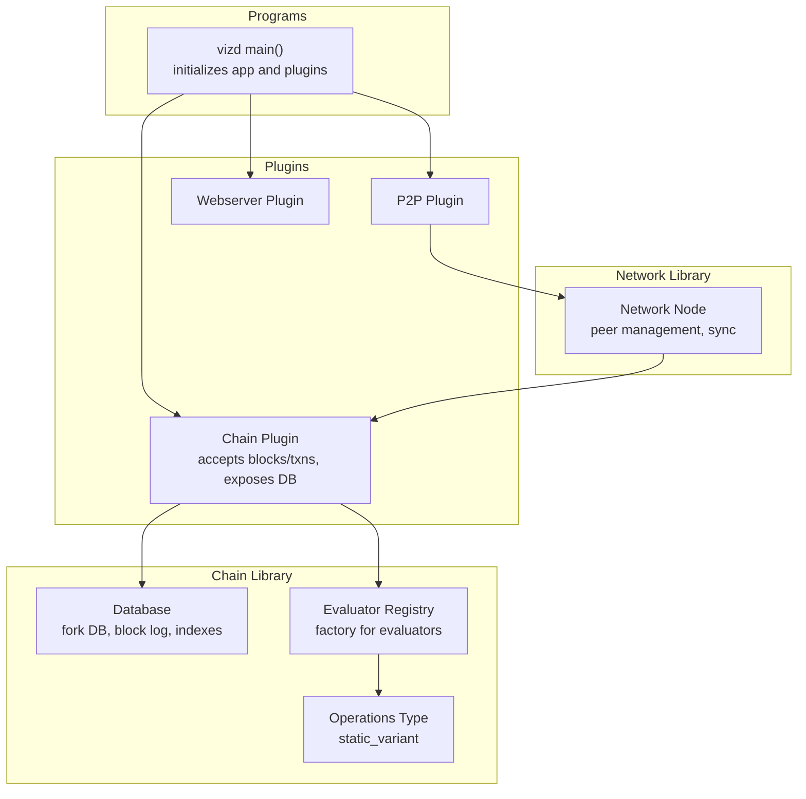
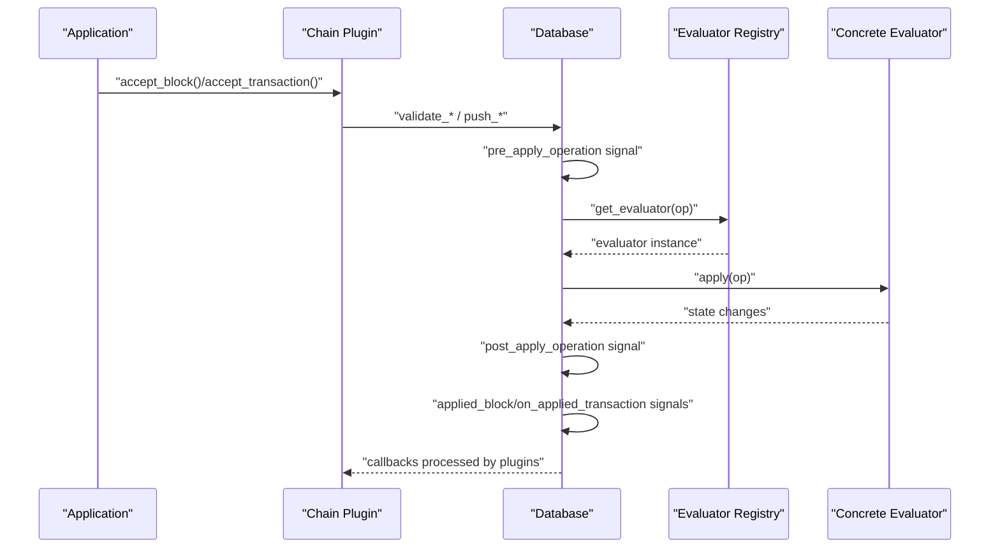
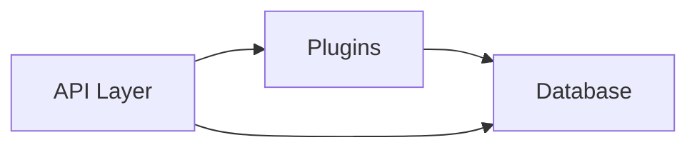
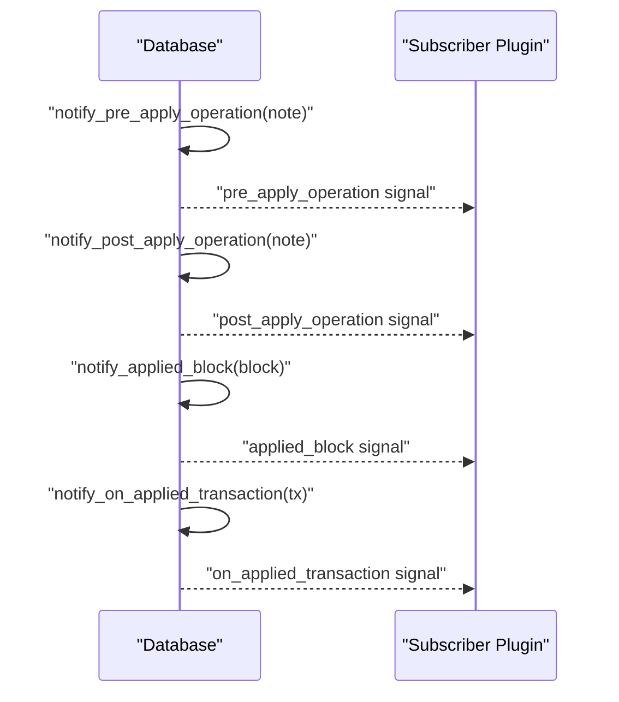
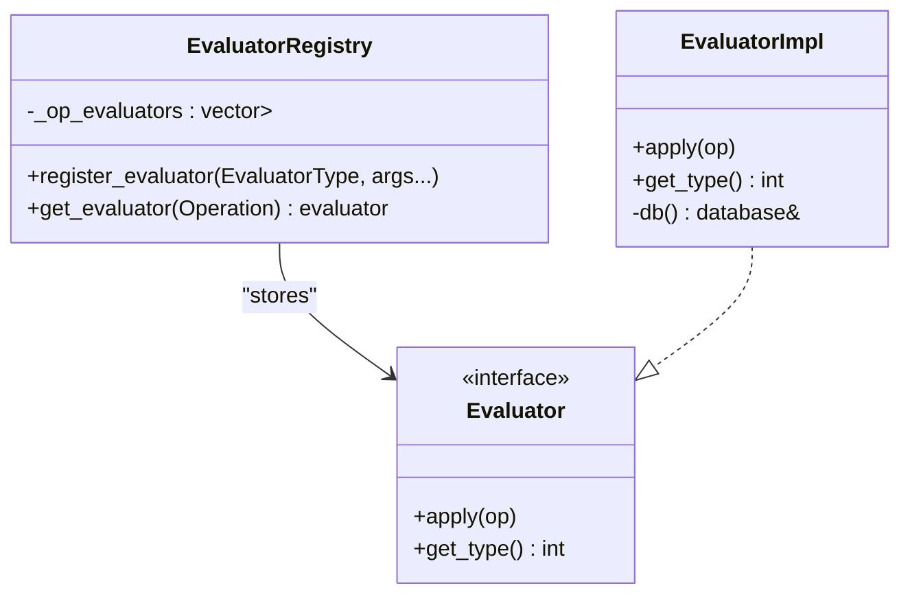
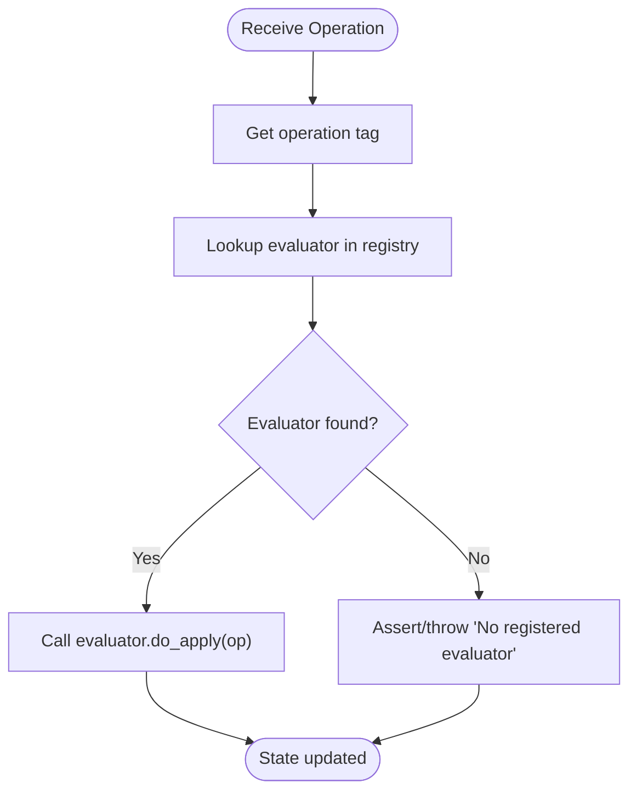
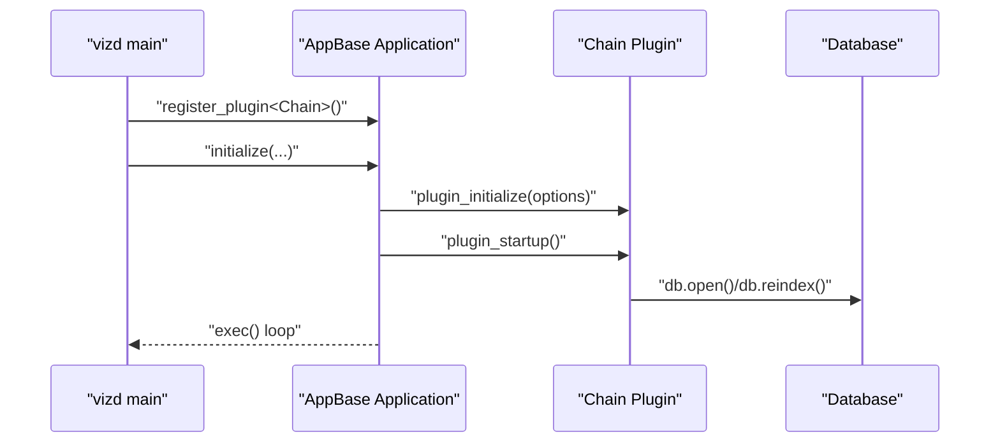
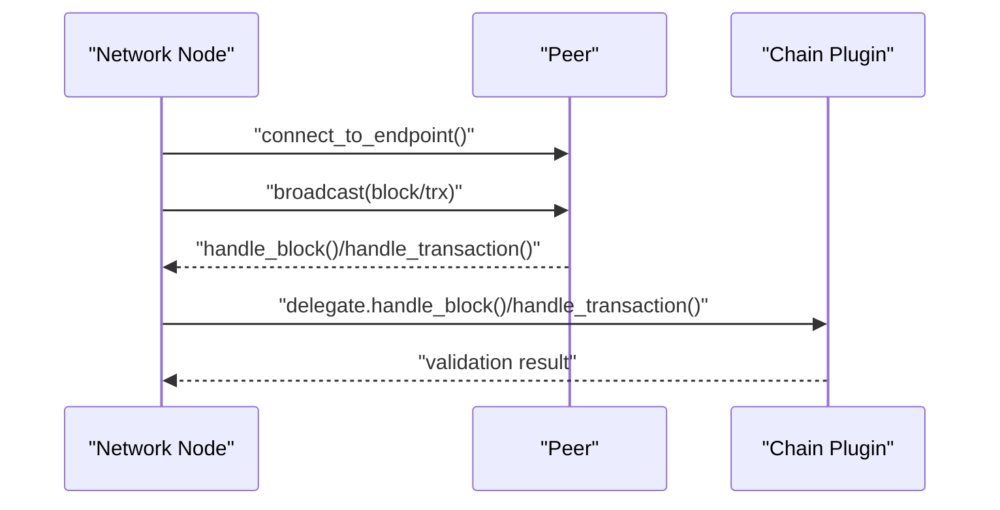
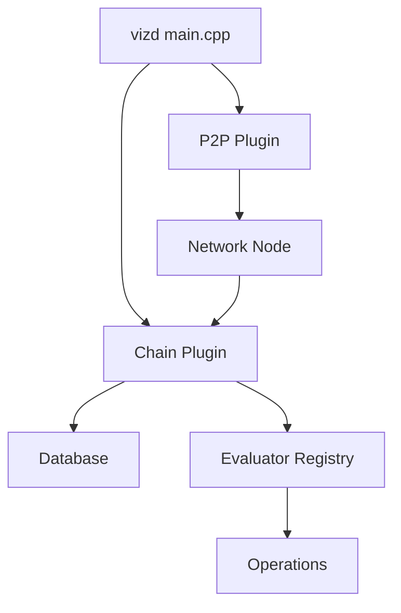

# Design Patterns and Architectural Decisions

<cite>
**Referenced Files in This Document**
- [database.hpp](file://libraries/chain/include/graphene/chain/database.hpp)
- [database.cpp](file://libraries/chain/database.cpp)
- [evaluator.hpp](file://libraries/chain/include/graphene/chain/evaluator.hpp)
- [evaluator_registry.hpp](file://libraries/chain/include/graphene/chain/evaluator_registry.hpp)
- [chain_evaluator.hpp](file://libraries/chain/include/graphene/chain/chain_evaluator.hpp)
- [chain_evaluator.cpp](file://libraries/chain/chain_evaluator.cpp)
- [plugin.hpp](file://plugins/chain/include/graphene/plugins/chain/plugin.hpp)
- [plugin.cpp](file://plugins/chain/plugin.cpp)
- [main.cpp](file://programs/vizd/main.cpp)
- [node.hpp](file://libraries/network/include/graphene/network/node.hpp)
- [operations.hpp](file://libraries/protocol/include/graphene/protocol/operations.hpp)
</cite>

## Table of Contents
1. [Introduction](#introduction)
2. [Project Structure](#project-structure)
3. [Core Components](#core-components)
4. [Architecture Overview](#architecture-overview)
5. [Detailed Component Analysis](#detailed-component-analysis)
6. [Dependency Analysis](#dependency-analysis)
7. [Performance Considerations](#performance-considerations)
8. [Security and Monitoring](#security-and-monitoring)
9. [Scalability and Extensibility](#scalability-and-extensibility)
10. [Troubleshooting Guide](#troubleshooting-guide)
11. [Conclusion](#conclusion)

## Introduction
This document explains the design patterns and architectural decisions that define the VIZ C++ node. It focuses on the MVC-like separation between data (database), control (plugins), and view (APIs), event-driven architecture using signals, factory and strategy patterns for evaluators, and a plugin-based architecture. It also analyzes trade-offs, performance characteristics, maintainability, extensibility, security, monitoring, and scalability considerations.

## Project Structure
The system is organized around three primary layers:
- Data layer: chain database and object model
- Control layer: plugins that orchestrate lifecycle, validation, and dispatch
- View layer: APIs exposed by plugins

**Diagram sources**
- [main.cpp](file://programs/vizd/main.cpp#L106-L158)
- [plugin.hpp](file://plugins/chain/include/graphene/plugins/chain/plugin.hpp#L21-L96)
- [database.hpp](file://libraries/chain/include/graphene/chain/database.hpp#L36-L558)
- [evaluator_registry.hpp](file://libraries/chain/include/graphene/chain/evaluator_registry.hpp#L8-L40)
- [operations.hpp](file://libraries/protocol/include/graphene/protocol/operations.hpp#L13-L102)
- [node.hpp](file://libraries/network/include/graphene/network/node.hpp#L190-L304)

**Section sources**
- [main.cpp](file://programs/vizd/main.cpp#L62-L91)
- [plugin.hpp](file://plugins/chain/include/graphene/plugins/chain/plugin.hpp#L21-L96)

## Core Components
- Database: central state machine managing chain state, indexes, fork database, block log, and event emissions for operations and blocks.
- Evaluator system: strategy/factory for applying operations to state.
- Plugins: lifecycle-managed modules that expose APIs, integrate with the database, and coordinate with the network.
- Network node: peer-to-peer synchronization and message propagation.

Key responsibilities:
- Data (Database): persistence, validation, indexing, and event signaling.
- Control (Plugins): initialization, startup/shutdown, block/txn acceptance, and API exposure.
- View (APIs): presentation of chain state via plugin-provided endpoints.

**Section sources**
- [database.hpp](file://libraries/chain/include/graphene/chain/database.hpp#L36-L558)
- [evaluator.hpp](file://libraries/chain/include/graphene/chain/evaluator.hpp#L11-L45)
- [evaluator_registry.hpp](file://libraries/chain/include/graphene/chain/evaluator_registry.hpp#L8-L40)
- [plugin.hpp](file://plugins/chain/include/graphene/plugins/chain/plugin.hpp#L21-L96)
- [node.hpp](file://libraries/network/include/graphene/network/node.hpp#L190-L304)

## Architecture Overview
The system follows an event-driven, plugin-based architecture:
- The database emits signals for pre/post operation application, applied blocks, and pending/applied transactions.
- Plugins subscribe to these signals to implement cross-cutting concerns (e.g., API indexing, history tracking).
- The evaluator registry acts as a factory mapping operation types to specialized evaluators.
- The main executable initializes the application and registers plugins.

**Diagram sources**
- [plugin.cpp](file://plugins/chain/plugin.cpp#L96-L121)
- [database.hpp](file://libraries/chain/include/graphene/chain/database.hpp#L252-L275)
- [evaluator_registry.hpp](file://libraries/chain/include/graphene/chain/evaluator_registry.hpp#L23-L36)
- [evaluator.hpp](file://libraries/chain/include/graphene/chain/evaluator.hpp#L29-L37)

## Detailed Component Analysis

### MVC-like Separation: Data, Control, View
- Data (Database): encapsulates chain state, indexes, fork database, block log, and validation logic. It exposes getters, push operations, and signals for observers.
- Control (Plugins): manage lifecycle, accept blocks/transactions, and coordinate with the database and network.
- View (APIs): provided by plugins that expose endpoints backed by the database.

**Section sources**
- [database.hpp](file://libraries/chain/include/graphene/chain/database.hpp#L111-L287)
- [plugin.hpp](file://plugins/chain/include/graphene/plugins/chain/plugin.hpp#L21-L96)

### Event-Driven Architecture with Signals
The database emits signals for:
- Pre/post operation application
- Applied block
- Pending/applied transactions

Plugins subscribe to these signals to implement features like API indexing, history tracking, and metrics.

**Diagram sources**
- [database.hpp](file://libraries/chain/include/graphene/chain/database.hpp#L252-L275)

**Section sources**
- [database.hpp](file://libraries/chain/include/graphene/chain/database.hpp#L252-L275)

### Factory Pattern for Object Creation (Evaluator Registry)
The evaluator registry is a factory that:
- Initializes a vector sized by the number of operation types
- Registers evaluators by operation type tag
- Retrieves the appropriate evaluator for an operation

**Diagram sources**
- [evaluator_registry.hpp](file://libraries/chain/include/graphene/chain/evaluator_registry.hpp#L8-L40)
- [evaluator.hpp](file://libraries/chain/include/graphene/chain/evaluator.hpp#L11-L45)

**Section sources**
- [evaluator_registry.hpp](file://libraries/chain/include/graphene/chain/evaluator_registry.hpp#L8-L40)
- [evaluator.hpp](file://libraries/chain/include/graphene/chain/evaluator.hpp#L11-L45)

### Strategy Pattern for Evaluation Strategies
Each operation type has a dedicated evaluator implementation. The strategy is selected dynamically by the registry based on the operation’s static variant index. This enables:
- Clear separation of concerns per operation
- Easy addition of new operations and evaluators
- Testability and isolation of evaluation logic

**Diagram sources**
- [evaluator_registry.hpp](file://libraries/chain/include/graphene/chain/evaluator_registry.hpp#L23-L36)
- [operations.hpp](file://libraries/protocol/include/graphene/protocol/operations.hpp#L13-L102)

**Section sources**
- [chain_evaluator.hpp](file://libraries/chain/include/graphene/chain/chain_evaluator.hpp#L14-L79)
- [chain_evaluator.cpp](file://libraries/chain/chain_evaluator.cpp#L52-L141)

### Plugin-Based Architecture
The application uses a plugin framework to modularize functionality:
- Plugins declare dependencies and lifecycle hooks
- The main executable registers and starts plugins
- Plugins expose APIs and interact with the database

**Diagram sources**
- [main.cpp](file://programs/vizd/main.cpp#L62-L91)
- [plugin.hpp](file://plugins/chain/include/graphene/plugins/chain/plugin.hpp#L36-L42)
- [plugin.cpp](file://plugins/chain/plugin.cpp#L169-L181)

**Section sources**
- [main.cpp](file://programs/vizd/main.cpp#L106-L158)
- [plugin.hpp](file://plugins/chain/include/graphene/plugins/chain/plugin.hpp#L21-L96)
- [plugin.cpp](file://plugins/chain/plugin.cpp#L169-L181)

### Network Synchronization and Peer Coordination
The network node provides:
- Peer discovery and connection management
- Block and transaction propagation
- Sync protocols and bandwidth controls

**Diagram sources**
- [node.hpp](file://libraries/network/include/graphene/network/node.hpp#L79-L88)
- [plugin.cpp](file://plugins/chain/plugin.cpp#L96-L121)

**Section sources**
- [node.hpp](file://libraries/network/include/graphene/network/node.hpp#L190-L304)
- [plugin.cpp](file://plugins/chain/plugin.cpp#L96-L121)

## Dependency Analysis
- The database depends on the evaluator registry and operation types to apply state changes.
- Plugins depend on the database and network node to accept blocks/transactions and propagate them.
- The main executable orchestrates plugin registration and lifecycle.

**Diagram sources**
- [main.cpp](file://programs/vizd/main.cpp#L62-L91)
- [plugin.hpp](file://plugins/chain/include/graphene/plugins/chain/plugin.hpp#L21-L96)
- [database.hpp](file://libraries/chain/include/graphene/chain/database.hpp#L36-L558)
- [evaluator_registry.hpp](file://libraries/chain/include/graphene/chain/evaluator_registry.hpp#L8-L40)
- [operations.hpp](file://libraries/protocol/include/graphene/protocol/operations.hpp#L13-L102)
- [node.hpp](file://libraries/network/include/graphene/network/node.hpp#L190-L304)

**Section sources**
- [main.cpp](file://programs/vizd/main.cpp#L62-L91)
- [plugin.hpp](file://plugins/chain/include/graphene/plugins/chain/plugin.hpp#L21-L96)
- [database.hpp](file://libraries/chain/include/graphene/chain/database.hpp#L36-L558)

## Performance Considerations
- C++ choice: provides low-level control, predictable performance, and efficient memory usage, suitable for high-throughput blockchain operations.
- Shared memory database: chainbase-backed database with configurable shared memory sizing and incremental growth to reduce IO overhead.
- Signal-based notifications: minimal coupling between components; however, subscribers must avoid heavy work in callbacks to prevent write-lock contention.
- Single write thread option: optional serialization of write operations via the application’s io_service to simplify concurrency control at the cost of throughput.
- Evaluator strategy: static variant dispatch minimizes branching overhead; registering evaluators once reduces runtime lookup costs.

Trade-offs:
- Performance vs. safety: skipping validations (e.g., signatures) can improve speed but risks chain integrity.
- Throughput vs. simplicity: single write thread simplifies correctness but may bottleneck writes under load.

**Section sources**
- [plugin.cpp](file://plugins/chain/plugin.cpp#L106-L121)
- [database.hpp](file://libraries/chain/include/graphene/chain/database.hpp#L56-L73)
- [database.cpp](file://libraries/chain/database.cpp#L198-L200)

## Security and Monitoring
- Logging: centralized logging configuration via INI sections for console and file appenders; supports JSON console logging and rotation.
- Signal handling: signal guard sets up handlers for graceful shutdown and interruption.
- Validation: strict validation steps and hardfork-aware checks ensure consensus correctness.
- API exposure: plugins expose endpoints; monitor and rate-limit as needed at the webserver layer.

Monitoring highlights:
- Logging configuration supports multiple appenders and loggers.
- Signals for applied operations and blocks enable real-time analytics.

**Section sources**
- [main.cpp](file://programs/vizd/main.cpp#L167-L288)
- [database.cpp](file://libraries/chain/database.cpp#L134-L184)

## Scalability and Extensibility
- Horizontal scaling: P2P network layer supports multiple peers and sync strategies; block and transaction propagation scales with peer count.
- Vertical scaling: shared memory database sizing and incremental growth support larger datasets; plugin architecture allows selective feature loading.
- Extensibility: new operations and evaluators can be added with minimal changes; plugins can subscribe to signals for cross-cutting features.

Considerations:
- Shared memory limits: tune shared-file-size and increments to accommodate growth.
- Plugin selection: load only required plugins to reduce memory footprint.
- Network topology: optimize peer selection and bandwidth limits for large networks.

**Section sources**
- [plugin.cpp](file://plugins/chain/plugin.cpp#L183-L200)
- [node.hpp](file://libraries/network/include/graphene/network/node.hpp#L290-L295)

## Troubleshooting Guide
Common areas to inspect:
- Database initialization and reindexing failures
- Plugin startup/shutdown errors
- Signal handler exceptions during shutdown
- Transaction/Block acceptance errors (time checks, validation flags)

Actions:
- Review logs configured via INI sections
- Enable/disable specific validation steps for diagnostics
- Use wipe/replay utilities for corrupted states
- Verify plugin dependencies and signal subscriptions

**Section sources**
- [plugin.cpp](file://plugins/chain/plugin.cpp#L134-L146)
- [database.cpp](file://libraries/chain/database.cpp#L134-L184)
- [main.cpp](file://programs/vizd/main.cpp#L167-L288)

## Conclusion
The VIZ C++ node employs a robust, event-driven, plugin-based architecture with clear separation of concerns. The database-centric design, combined with a factory/strategy evaluator system and strong plugin lifecycle management, yields a highly extensible and maintainable platform. Performance is optimized through C++, shared memory storage, and careful validation controls, while the P2P layer supports scalable horizontal growth. Security and observability are addressed through structured logging and signal handling, enabling reliable operations in production environments.