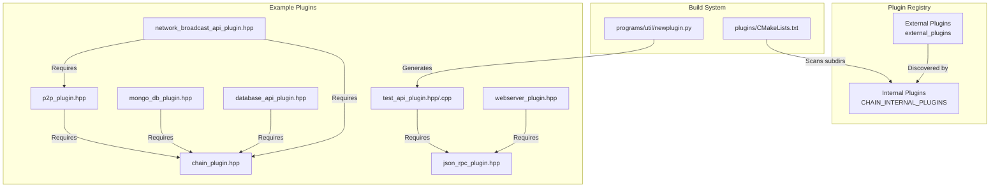
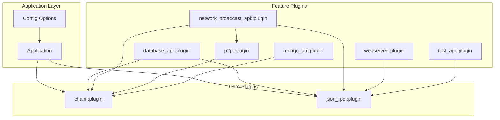
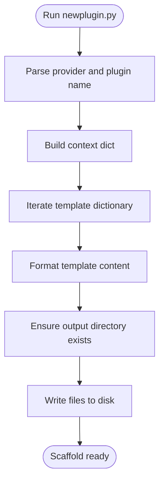
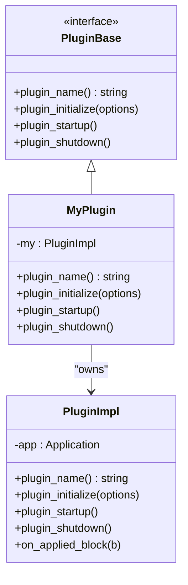
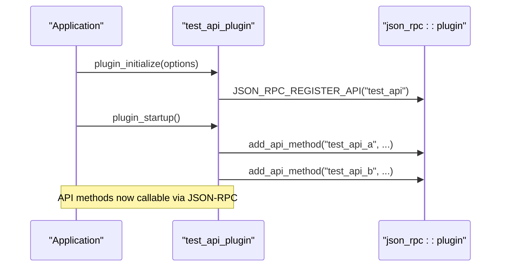
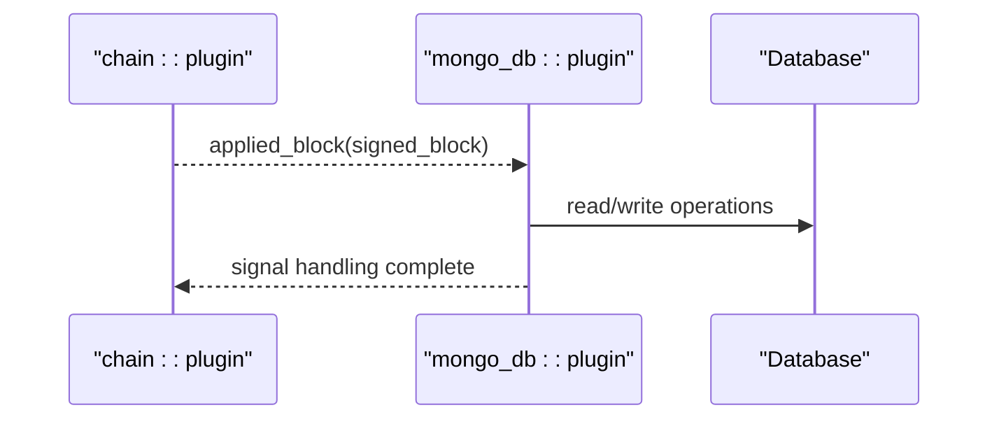
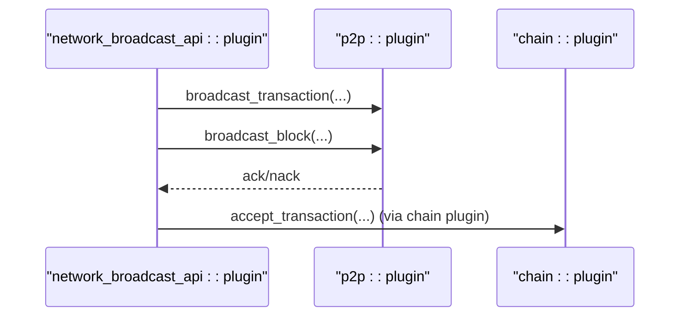
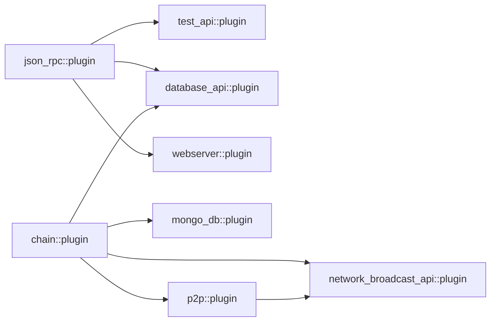

# Custom Plugin Development

<cite>
**Referenced Files in This Document**
- [newplugin.py](file://programs/util/newplugin.py)
- [plugin.md](file://documentation/plugin.md)
- [CMakeLists.txt](file://plugins/CMakeLists.txt)
- [config.ini](file://share/vizd/config/config.ini)
- [test_api_plugin.hpp](file://plugins/test_api/include/graphene/plugins/test_api/test_api_plugin.hpp)
- [test_api_plugin.cpp](file://plugins/test_api/test_api_plugin.cpp)
- [mongo_db_plugin.hpp](file://plugins/mongo_db/include/graphene/plugins/mongo_db/mongo_db_plugin.hpp)
- [webserver_plugin.hpp](file://plugins/webserver/include/graphene/plugins/webserver/webserver_plugin.hpp)
- [p2p_plugin.hpp](file://plugins/p2p/include/graphene/plugins/p2p/p2p_plugin.hpp)
- [account_history_plugin.hpp](file://plugins/account_history/include/graphene/plugins/account_history/plugin.hpp)
- [chain_plugin.hpp](file://plugins/chain/include/graphene/plugins/chain/plugin.hpp)
- [json_rpc_plugin.hpp](file://plugins/json_rpc/include/graphene/plugins/json_rpc/plugin.hpp)
- [database_api_plugin.hpp](file://plugins/database_api/include/graphene/plugins/database_api/plugin.hpp)
- [network_broadcast_api_plugin.hpp](file://plugins/network_broadcast_api/include/graphene/plugins/network_broadcast_api/network_broadcast_api_plugin.hpp)
- [testing.md](file://documentation/testing.md)
</cite>

## Table of Contents
1. [Introduction](#introduction)
2. [Project Structure](#project-structure)
3. [Core Components](#core-components)
4. [Architecture Overview](#architecture-overview)
5. [Detailed Component Analysis](#detailed-component-analysis)
6. [Dependency Analysis](#dependency-analysis)
7. [Performance Considerations](#performance-considerations)
8. [Troubleshooting Guide](#troubleshooting-guide)
9. [Conclusion](#conclusion)
10. [Appendices](#appendices)

## Introduction
This document explains how to develop custom plugins from scratch in the project’s plugin framework. It covers:
- The plugin template system and how to generate boilerplate code using the provided generator
- The plugin class structure, required methods, and interface implementation patterns
- Step-by-step tutorials for three plugin types: API plugins, database plugins, and network plugins
- The development workflow from template generation to deployment and testing
- Configuration options, command-line parameter handling, and integration with the main application
- Testing strategies, unit testing patterns, and integration testing approaches
- Practical examples of common plugin patterns and anti-patterns
- Guidelines for packaging, distribution, and version management
- Debugging techniques and common development issues

## Project Structure
Plugins are organized under the plugins directory. Each plugin typically includes:
- A header file defining the plugin class and API declarations
- An implementation file implementing plugin lifecycle and API methods
- Optional API object headers for serialization and data structures
- A CMakeLists.txt to integrate the plugin into the build system
- A dedicated include/graphene/plugins/<plugin_name>/ directory for public headers

The top-level plugin registry is driven by a CMake script that discovers subdirectories and registers available plugins. Third-party plugins can be dropped into an external_plugins directory and built alongside internal ones.

**Diagram sources**
- [CMakeLists.txt](file://plugins/CMakeLists.txt#L1-L12)
- [newplugin.py](file://programs/util/newplugin.py#L1-L251)
- [test_api_plugin.hpp](file://plugins/test_api/include/graphene/plugins/test_api/test_api_plugin.hpp#L1-L61)
- [webserver_plugin.hpp](file://plugins/webserver/include/graphene/plugins/webserver/webserver_plugin.hpp#L1-L62)
- [p2p_plugin.hpp](file://plugins/p2p/include/graphene/plugins/p2p/p2p_plugin.hpp#L1-L57)
- [mongo_db_plugin.hpp](file://plugins/mongo_db/include/graphene/plugins/mongo_db/mongo_db_plugin.hpp#L1-L51)
- [chain_plugin.hpp](file://plugins/chain/include/graphene/plugins/chain/plugin.hpp#L1-L100)
- [json_rpc_plugin.hpp](file://plugins/json_rpc/include/graphene/plugins/json_rpc/plugin.hpp#L1-L146)
- [database_api_plugin.hpp](file://plugins/database_api/include/graphene/plugins/database_api/plugin.hpp#L1-L429)
- [network_broadcast_api_plugin.hpp](file://plugins/network_broadcast_api/include/graphene/plugins/network_broadcast_api/network_broadcast_api_plugin.hpp#L1-L91)

**Section sources**
- [CMakeLists.txt](file://plugins/CMakeLists.txt#L1-L12)
- [plugin.md](file://documentation/plugin.md#L1-L28)

## Core Components
- Plugin template generator: A Python script that scaffolds a new plugin with standard files and boilerplate code.
- Plugin base class and lifecycle: Plugins derive from the application plugin base and implement initialization, startup, shutdown, and optional API registration.
- JSON-RPC integration: Many plugins depend on and register APIs with the JSON-RPC plugin to expose RPC endpoints.
- Chain integration: Plugins may subscribe to chain events (e.g., applied block signals) and access the database through the chain plugin.
- Configuration and CLI options: Plugins define program options and read configuration values during initialization.

Key implementation patterns:
- Use APPBASE_PLUGIN_REQUIRES to declare dependencies on other plugins
- Implement plugin_initialize to parse options and register APIs
- Implement plugin_startup to connect signals and finalize initialization
- Implement plugin_shutdown to clean up resources
- Expose API methods via DECLARE_API and DEFINE_API macros

**Section sources**
- [newplugin.py](file://programs/util/newplugin.py#L1-L251)
- [json_rpc_plugin.hpp](file://plugins/json_rpc/include/graphene/plugins/json_rpc/plugin.hpp#L1-L146)
- [chain_plugin.hpp](file://plugins/chain/include/graphene/plugins/chain/plugin.hpp#L1-L100)
- [test_api_plugin.hpp](file://plugins/test_api/include/graphene/plugins/test_api/test_api_plugin.hpp#L1-L61)
- [test_api_plugin.cpp](file://plugins/test_api/test_api_plugin.cpp#L1-L40)

## Architecture Overview
The plugin architecture centers around appbase, with plugins registering themselves and APIs with the JSON-RPC dispatcher. Plugins commonly depend on the chain plugin for database access and on p2p for networking.

**Diagram sources**
- [chain_plugin.hpp](file://plugins/chain/include/graphene/plugins/chain/plugin.hpp#L1-L100)
- [json_rpc_plugin.hpp](file://plugins/json_rpc/include/graphene/plugins/json_rpc/plugin.hpp#L1-L146)
- [database_api_plugin.hpp](file://plugins/database_api/include/graphene/plugins/database_api/plugin.hpp#L1-L429)
- [network_broadcast_api_plugin.hpp](file://plugins/network_broadcast_api/include/graphene/plugins/network_broadcast_api/network_broadcast_api_plugin.hpp#L1-L91)
- [p2p_plugin.hpp](file://plugins/p2p/include/graphene/plugins/p2p/p2p_plugin.hpp#L1-L57)
- [webserver_plugin.hpp](file://plugins/webserver/include/graphene/plugins/webserver/webserver_plugin.hpp#L1-L62)
- [test_api_plugin.hpp](file://plugins/test_api/include/graphene/plugins/test_api/test_api_plugin.hpp#L1-L61)
- [mongo_db_plugin.hpp](file://plugins/mongo_db/include/graphene/plugins/mongo_db/mongo_db_plugin.hpp#L1-L51)

## Detailed Component Analysis

### Plugin Template System
The template generator creates a complete plugin scaffold with:
- A plugin header declaring the plugin class and required methods
- An API header declaring the API class and FC_API method list
- Implementation files for both plugin and API
- A CMakeLists.txt fragment for library integration

The generator accepts provider and plugin name arguments and writes files into libraries/plugins/<plugin_name>.

**Diagram sources**
- [newplugin.py](file://programs/util/newplugin.py#L225-L251)

**Section sources**
- [newplugin.py](file://programs/util/newplugin.py#L1-L251)

### Plugin Class Structure and Lifecycle
A typical plugin class follows this structure:
- Public plugin class deriving from the application plugin base
- Private implementation class encapsulating logic
- Required methods: plugin_name, plugin_initialize, plugin_startup, plugin_shutdown
- Optional: signal connections and API registration

**Diagram sources**
- [test_api_plugin.hpp](file://plugins/test_api/include/graphene/plugins/test_api/test_api_plugin.hpp#L27-L53)
- [test_api_plugin.cpp](file://plugins/test_api/test_api_plugin.cpp#L15-L23)

**Section sources**
- [test_api_plugin.hpp](file://plugins/test_api/include/graphene/plugins/test_api/test_api_plugin.hpp#L1-L61)
- [test_api_plugin.cpp](file://plugins/test_api/test_api_plugin.cpp#L1-L40)

### API Plugin Pattern
API plugins expose RPC endpoints via the JSON-RPC plugin. They:
- Define argument/result structs
- Declare APIs with DECLARE_API and implement with DEFINE_API
- Register themselves during plugin_initialize using JSON_RPC_REGISTER_API

**Diagram sources**
- [test_api_plugin.cpp](file://plugins/test_api/test_api_plugin.cpp#L15-L35)
- [json_rpc_plugin.hpp](file://plugins/json_rpc/include/graphene/plugins/json_rpc/plugin.hpp#L109-L113)

**Section sources**
- [test_api_plugin.hpp](file://plugins/test_api/include/graphene/plugins/test_api/test_api_plugin.hpp#L23-L53)
- [test_api_plugin.cpp](file://plugins/test_api/test_api_plugin.cpp#L1-L40)
- [json_rpc_plugin.hpp](file://plugins/json_rpc/include/graphene/plugins/json_rpc/plugin.hpp#L1-L146)

### Database Plugin Pattern
Database plugins typically:
- Require the chain plugin
- Subscribe to chain events (e.g., applied block)
- Access the database through the chain plugin’s database interface
- Optionally maintain their own indices or state

**Diagram sources**
- [mongo_db_plugin.hpp](file://plugins/mongo_db/include/graphene/plugins/mongo_db/mongo_db_plugin.hpp#L1-L51)
- [chain_plugin.hpp](file://plugins/chain/include/graphene/plugins/chain/plugin.hpp#L88-L91)

**Section sources**
- [mongo_db_plugin.hpp](file://plugins/mongo_db/include/graphene/plugins/mongo_db/mongo_db_plugin.hpp#L1-L51)
- [chain_plugin.hpp](file://plugins/chain/include/graphene/plugins/chain/plugin.hpp#L1-L100)

### Network Plugin Pattern
Network plugins:
- Depend on the chain plugin for blockchain data
- May broadcast blocks/transactions via the p2p plugin
- Often expose APIs for broadcasting and synchronization

**Diagram sources**
- [network_broadcast_api_plugin.hpp](file://plugins/network_broadcast_api/include/graphene/plugins/network_broadcast_api/network_broadcast_api_plugin.hpp#L47-L83)
- [p2p_plugin.hpp](file://plugins/p2p/include/graphene/plugins/p2p/p2p_plugin.hpp#L18-L52)
- [chain_plugin.hpp](file://plugins/chain/include/graphene/plugins/chain/plugin.hpp#L44-L46)

**Section sources**
- [network_broadcast_api_plugin.hpp](file://plugins/network_broadcast_api/include/graphene/plugins/network_broadcast_api/network_broadcast_api_plugin.hpp#L1-L91)
- [p2p_plugin.hpp](file://plugins/p2p/include/graphene/plugins/p2p/p2p_plugin.hpp#L1-L57)
- [chain_plugin.hpp](file://plugins/chain/include/graphene/plugins/chain/plugin.hpp#L1-L100)

## Dependency Analysis
Plugins declare dependencies using APPBASE_PLUGIN_REQUIRES. The JSON-RPC plugin is central for exposing APIs. The chain plugin provides database access and event signals. Network plugins typically depend on p2p and chain.

**Diagram sources**
- [json_rpc_plugin.hpp](file://plugins/json_rpc/include/graphene/plugins/json_rpc/plugin.hpp#L1-L146)
- [test_api_plugin.hpp](file://plugins/test_api/include/graphene/plugins/test_api/test_api_plugin.hpp#L35-L35)
- [database_api_plugin.hpp](file://plugins/database_api/include/graphene/plugins/database_api/plugin.hpp#L188-L191)
- [mongo_db_plugin.hpp](file://plugins/mongo_db/include/graphene/plugins/mongo_db/mongo_db_plugin.hpp#L17-L19)
- [network_broadcast_api_plugin.hpp](file://plugins/network_broadcast_api/include/graphene/plugins/network_broadcast_api/network_broadcast_api_plugin.hpp#L49-L49)
- [p2p_plugin.hpp](file://plugins/p2p/include/graphene/plugins/p2p/p2p_plugin.hpp#L20-L20)
- [chain_plugin.hpp](file://plugins/chain/include/graphene/plugins/chain/plugin.hpp#L23-L23)

**Section sources**
- [test_api_plugin.hpp](file://plugins/test_api/include/graphene/plugins/test_api/test_api_plugin.hpp#L35-L35)
- [database_api_plugin.hpp](file://plugins/database_api/include/graphene/plugins/database_api/plugin.hpp#L188-L191)
- [mongo_db_plugin.hpp](file://plugins/mongo_db/include/graphene/plugins/mongo_db/mongo_db_plugin.hpp#L17-L19)
- [network_broadcast_api_plugin.hpp](file://plugins/network_broadcast_api/include/graphene/plugins/network_broadcast_api/network_broadcast_api_plugin.hpp#L49-L49)
- [p2p_plugin.hpp](file://plugins/p2p/include/graphene/plugins/p2p/p2p_plugin.hpp#L20-L20)
- [chain_plugin.hpp](file://plugins/chain/include/graphene/plugins/chain/plugin.hpp#L23-L23)
- [json_rpc_plugin.hpp](file://plugins/json_rpc/include/graphene/plugins/json_rpc/plugin.hpp#L1-L146)

## Performance Considerations
- Minimize database contention by using single-write-thread options and tuned lock retries
- Avoid heavy operations in signal handlers; defer to background tasks when possible
- Use appropriate indexing and caching strategies in database plugins
- Keep API methods efficient; avoid blocking operations in RPC handlers

[No sources needed since this section provides general guidance]

## Troubleshooting Guide
Common issues and resolutions:
- Plugin not loading: Verify plugin is enabled in configuration and discovered by the build system
- API not available: Ensure JSON-RPC registration occurs in plugin_initialize and that public-api is configured if needed
- Chain-dependent plugin failing: Confirm chain plugin is enabled and that replay may be required when toggling history-related plugins
- Lock contention: Adjust read/write wait retries and consider single-write-thread mode

**Section sources**
- [plugin.md](file://documentation/plugin.md#L11-L28)
- [config.ini](file://share/vizd/config/config.ini#L13-L47)

## Conclusion
The project provides a robust, extensible plugin framework. By leveraging the template generator, following the plugin lifecycle, and integrating with core plugins (JSON-RPC, chain, p2p), developers can build API, database, and network plugins efficiently. Proper configuration, testing, and performance tuning ensure reliable deployments.

[No sources needed since this section summarizes without analyzing specific files]

## Appendices

### Step-by-Step Tutorial: API Plugin
1. Generate the plugin scaffold:
   - Run the generator with provider and plugin name
   - Review and customize the generated files
2. Implement API methods:
   - Define argument/result structs
   - Declare APIs in the plugin header
   - Implement methods in the plugin source
3. Register the API:
   - Call JSON-RPC registration in plugin_initialize
4. Configure and run:
   - Enable the plugin in configuration
   - Start the node and test via JSON-RPC

**Section sources**
- [newplugin.py](file://programs/util/newplugin.py#L225-L251)
- [test_api_plugin.hpp](file://plugins/test_api/include/graphene/plugins/test_api/test_api_plugin.hpp#L23-L53)
- [test_api_plugin.cpp](file://plugins/test_api/test_api_plugin.cpp#L15-L35)
- [plugin.md](file://documentation/plugin.md#L21-L28)

### Step-by-Step Tutorial: Database Plugin
1. Generate the plugin scaffold
2. Add chain dependency and database access patterns
3. Subscribe to chain events (e.g., applied block)
4. Implement persistence logic and indexing
5. Register and enable the plugin

**Section sources**
- [newplugin.py](file://programs/util/newplugin.py#L225-L251)
- [mongo_db_plugin.hpp](file://plugins/mongo_db/include/graphene/plugins/mongo_db/mongo_db_plugin.hpp#L17-L19)
- [chain_plugin.hpp](file://plugins/chain/include/graphene/plugins/chain/plugin.hpp#L88-L91)

### Step-by-Step Tutorial: Network Plugin
1. Generate the plugin scaffold
2. Add dependencies on chain and p2p
3. Implement broadcast methods and event handling
4. Integrate with network_broadcast_api if exposing RPC

**Section sources**
- [newplugin.py](file://programs/util/newplugin.py#L225-L251)
- [network_broadcast_api_plugin.hpp](file://plugins/network_broadcast_api/include/graphene/plugins/network_broadcast_api/network_broadcast_api_plugin.hpp#L49-L49)
- [p2p_plugin.hpp](file://plugins/p2p/include/graphene/plugins/p2p/p2p_plugin.hpp#L20-L20)

### Plugin Configuration and CLI
- Enable plugins via configuration entries
- Use public-api and api-user for access control
- Configure thread pools and endpoints for webserver plugins
- Adjust chain-related options affecting plugin behavior

**Section sources**
- [plugin.md](file://documentation/plugin.md#L11-L28)
- [config.ini](file://share/vizd/config/config.ini#L1-L130)

### Testing Strategies
- Unit tests: Use the chain_test target and categorize tests
- Runtime configuration: Control logging and reporting via test harness options
- Code coverage: Enable coverage builds and generate HTML reports

**Section sources**
- [testing.md](file://documentation/testing.md#L1-L43)

### Packaging and Distribution
- Place third-party plugins under external_plugins and build with the same process
- Ensure each plugin includes a CMakeLists.txt and proper include layout
- Version management: Align plugin versions with the project’s release cycle

**Section sources**
- [plugin.md](file://documentation/plugin.md#L7-L7)
- [CMakeLists.txt](file://plugins/CMakeLists.txt#L1-L12)