# Inter-Plugin Communication

<cite>
**Referenced Files in This Document**
- [main.cpp](file://programs/vizd/main.cpp)
- [CMakeLists.txt](file://plugins/CMakeLists.txt)
- [plugin.hpp (chain)](file://plugins/chain/include/graphene/plugins/chain/plugin.hpp)
- [plugin.hpp (database_api)](file://plugins/database_api/include/graphene/plugins/database_api/plugin.hpp)
- [plugin.hpp (operation_history)](file://plugins/operation_history/include/graphene/plugins/operation_history/plugin.hpp)
- [plugin.hpp (account_history)](file://plugins/account_history/include/graphene/plugins/account_history/plugin.hpp)
- [plugin.cpp (operation_history)](file://plugins/operation_history/plugin.cpp)
- [plugin.cpp (account_history)](file://plugins/account_history/plugin.cpp)
- [plugin.hpp (webserver)](file://plugins/webserver/include/graphene/plugins/webserver/webserver_plugin.hpp)
- [p2p_plugin.hpp](file://plugins/p2p/include/graphene/plugins/p2p/p2p_plugin.hpp)
- [api.cpp (database_api)](file://plugins/database_api/api.cpp)
</cite>

## Update Summary
**Changes Made**
- Enhanced memory management coordination between account_history and operation_history plugins
- Added purging coordination mechanisms to prevent dangling references
- Improved signal handler management with proper cleanup procedures
- Updated plugin dependency graph to reflect enhanced coordination patterns

## Table of Contents
1. [Introduction](#introduction)
2. [Project Structure](#project-structure)
3. [Core Components](#core-components)
4. [Architecture Overview](#architecture-overview)
5. [Detailed Component Analysis](#detailed-component-analysis)
6. [Memory Management Coordination](#memory-management-coordination)
7. [Dependency Analysis](#dependency-analysis)
8. [Performance Considerations](#performance-considerations)
9. [Troubleshooting Guide](#troubleshooting-guide)
10. [Conclusion](#conclusion)

## Introduction
This document explains inter-plugin communication patterns and mechanisms in the codebase built on the appbase framework. It focuses on:
- How plugins declare and consume dependencies via appbase's dependency injection system
- Event-driven communication using Boost.Signals2 signals and slots
- Practical examples of signal emission and subscription across plugins
- How plugins expose APIs to other plugins and establish communication channels
- The plugin dependency graph and initialization order
- Best practices for loose coupling and avoiding circular dependencies
- Thread-safety considerations and synchronization mechanisms
- **Enhanced memory management coordination between plugins for efficient resource utilization**

## Project Structure
The application initializes a set of plugins and wires them together through appbase. Plugins declare required dependencies, and the runtime ensures they are initialized in dependency order. The main entrypoint registers and starts selected plugins.

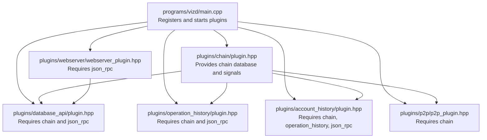

**Diagram sources**
- [main.cpp](file://programs/vizd/main.cpp#L62-L90)
- [plugin.hpp (chain)](file://plugins/chain/include/graphene/plugins/chain/plugin.hpp#L21-L24)
- [plugin.hpp (p2p_plugin.hpp)](file://plugins/p2p/include/graphene/plugins/p2p/p2p_plugin.hpp#L18-L21)
- [plugin.hpp (webserver)](file://plugins/webserver/include/graphene/plugins/webserver/webserver_plugin.hpp#L32-L39)
- [plugin.hpp (database_api)](file://plugins/database_api/include/graphene/plugins/database_api/plugin.hpp#L179-L192)
- [plugin.hpp (operation_history)](file://plugins/operation_history/include/graphene/plugins/operation_history/plugin.hpp#L52-L58)
- [plugin.hpp (account_history)](file://plugins/account_history/include/graphene/plugins/account_history/plugin.hpp#L59-L66)

**Section sources**
- [main.cpp](file://programs/vizd/main.cpp#L62-L90)
- [CMakeLists.txt](file://plugins/CMakeLists.txt#L1-L12)

## Core Components
- Plugin registration and startup: The main entrypoint registers all plugins and starts a configured subset.
- Dependency declaration: Plugins declare required plugins via APPBASE_PLUGIN_REQUIRES, enabling automatic initialization and injection.
- Signals and slots: Plugins emit and subscribe to Boost.Signals2 signals for event-driven communication.
- API exposure: Plugins expose read-only APIs (e.g., database queries) to other plugins and clients.
- **Memory management coordination: Enhanced coordination between plugins to prevent memory leaks and dangling references.**

Key implementation references:
- Plugin registration and startup sequence
  - [main.cpp](file://programs/vizd/main.cpp#L62-L90)
  - [main.cpp](file://programs/vizd/main.cpp#L117-L122)
- Dependency declarations
  - [plugin.hpp (chain)](file://plugins/chain/include/graphene/plugins/chain/plugin.hpp#L21-L24)
  - [plugin.hpp (database_api)](file://plugins/database_api/include/graphene/plugins/database_api/plugin.hpp#L187-L192)
  - [plugin.hpp (operation_history)](file://plugins/operation_history/include/graphene/plugins/operation_history/plugin.hpp#L53-L58)
  - [plugin.hpp (account_history)](file://plugins/account_history/include/graphene/plugins/account_history/plugin.hpp#L60-L66)
  - [plugin.hpp (p2p_plugin.hpp)](file://plugins/p2p/include/graphene/plugins/p2p/p2p_plugin.hpp#L18-L21)
  - [plugin.hpp (webserver)](file://plugins/webserver/include/graphene/plugins/webserver/webserver_plugin.hpp#L32-L39)
- Signals and slots
  - [plugin.hpp (chain)](file://plugins/chain/include/graphene/plugins/chain/plugin.hpp#L88-L91)
  - [api.cpp (database_api)](file://plugins/database_api/api.cpp#L35)
- **Memory management coordination**
  - [plugin.cpp (operation_history)](file://plugins/operation_history/plugin.cpp#L107-L122)
  - [plugin.cpp (account_history)](file://plugins/account_history/plugin.cpp#L94-L163)

**Section sources**
- [main.cpp](file://programs/vizd/main.cpp#L62-L90)
- [plugin.hpp (chain)](file://plugins/chain/include/graphene/plugins/chain/plugin.hpp#L21-L24)
- [plugin.hpp (database_api)](file://plugins/database_api/include/graphene/plugins/database_api/plugin.hpp#L187-L192)
- [plugin.hpp (operation_history)](file://plugins/operation_history/include/graphene/plugins/operation_history/plugin.hpp#L53-L58)
- [plugin.hpp (account_history)](file://plugins/account_history/include/graphene/plugins/account_history/plugin.hpp#L60-L66)
- [plugin.hpp (p2p_plugin.hpp)](file://plugins/p2p/include/graphene/plugins/p2p/p2p_plugin.hpp#L18-L21)
- [plugin.hpp (webserver)](file://plugins/webserver/include/graphene/plugins/webserver/webserver_plugin.hpp#L32-L39)
- [api.cpp (database_api)](file://plugins/database_api/api.cpp#L35)
- [plugin.cpp (operation_history)](file://plugins/operation_history/plugin.cpp#L107-L122)
- [plugin.cpp (account_history)](file://plugins/account_history/plugin.cpp#L94-L163)

## Architecture Overview
The system composes plugins around the chain plugin as a central dependency provider. Other plugins depend on chain and/or json_rpc to expose APIs and coordinate events. **Enhanced memory management coordination ensures efficient resource utilization across plugins.**

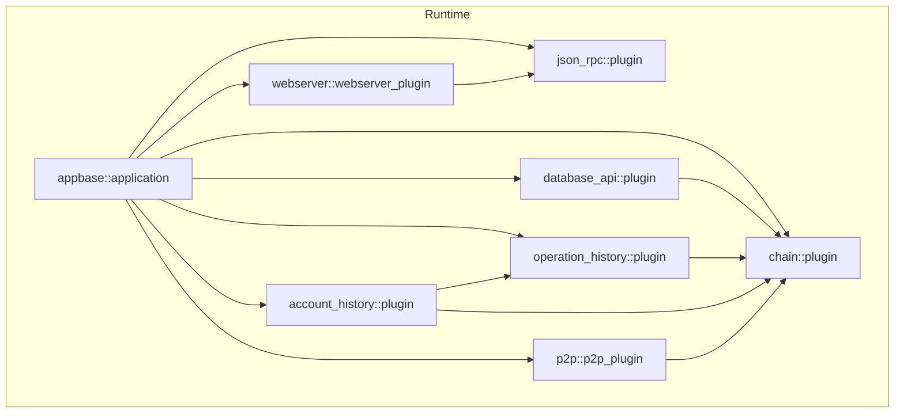

**Diagram sources**
- [main.cpp](file://programs/vizd/main.cpp#L62-L90)
- [plugin.hpp (chain)](file://plugins/chain/include/graphene/plugins/chain/plugin.hpp#L21-L24)
- [plugin.hpp (database_api)](file://plugins/database_api/include/graphene/plugins/database_api/plugin.hpp#L187-L192)
- [plugin.hpp (operation_history)](file://plugins/operation_history/include/graphene/plugins/operation_history/plugin.hpp#L53-L58)
- [plugin.hpp (account_history)](file://plugins/account_history/include/graphene/plugins/account_history/plugin.hpp#L60-L66)
- [plugin.hpp (p2p_plugin.hpp)](file://plugins/p2p/include/graphene/plugins/p2p/p2p_plugin.hpp#L18-L21)
- [plugin.hpp (webserver)](file://plugins/webserver/include/graphene/plugins/webserver/webserver_plugin.hpp#L32-L39)

## Detailed Component Analysis

### Chain Plugin: Central Dependency Provider and Signal Emitter
- Purpose: Provides the blockchain database and emits synchronization signals.
- Signals:
  - on_sync: emitted when the blockchain is syncing/live; useful for plugins that optionally depend on chain state.
- Dependencies:
  - Requires json_rpc::plugin for RPC transport.

```mermaid
classDiagram
class ChainPlugin {
+on_sync : "signal<void()>"
+plugin_initialize(...)
+plugin_startup()
+accept_block(...)
+accept_transaction(...)
+db() : "database&"
}
```

**Diagram sources**
- [plugin.hpp (chain)](file://plugins/chain/include/graphene/plugins/chain/plugin.hpp#L21-L91)

**Section sources**
- [plugin.hpp (chain)](file://plugins/chain/include/graphene/plugins/chain/plugin.hpp#L21-L91)

### Database API Plugin: API Exposure and Callback Subscription
- Purpose: Exposes read-only database queries and subscriptions to clients and other plugins.
- Dependencies:
  - Requires chain::plugin and json_rpc::plugin.
- Subscriptions:
  - set_block_applied_callback: allows plugins to receive notifications when blocks are applied.
  - set_subscribe_callback and set_pending_transaction_callback: for streaming updates.
- Example usage patterns:
  - Subscribe to block-applied events from another plugin via the callback mechanism.
  - Query chain state through the chain database accessor exposed by chain::plugin.

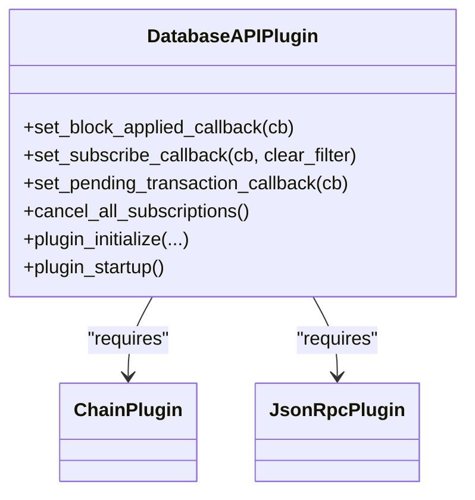

**Diagram sources**
- [plugin.hpp (database_api)](file://plugins/database_api/include/graphene/plugins/database_api/plugin.hpp#L179-L226)
- [plugin.hpp (database_api)](file://plugins/database_api/include/graphene/plugins/database_api/plugin.hpp#L187-L192)
- [plugin.hpp (chain)](file://plugins/chain/include/graphene/plugins/chain/plugin.hpp#L21-L24)

**Section sources**
- [plugin.hpp (database_api)](file://plugins/database_api/include/graphene/plugins/database_api/plugin.hpp#L179-L226)
- [plugin.hpp (database_api)](file://plugins/database_api/include/graphene/plugins/database_api/plugin.hpp#L187-L192)

### Operation History Plugin: Event Producer for Operations
- Purpose: Tracks operations and exposes APIs to query operations in blocks and transactions.
- Dependencies:
  - Requires chain::plugin and json_rpc::plugin.
- Purging mechanism:
  - Implements automatic purging based on history_count_blocks configuration.
  - Provides get_min_keep_block() API for other plugins to coordinate purging.
- Typical usage:
  - Used by account_history to maintain per-account histories.

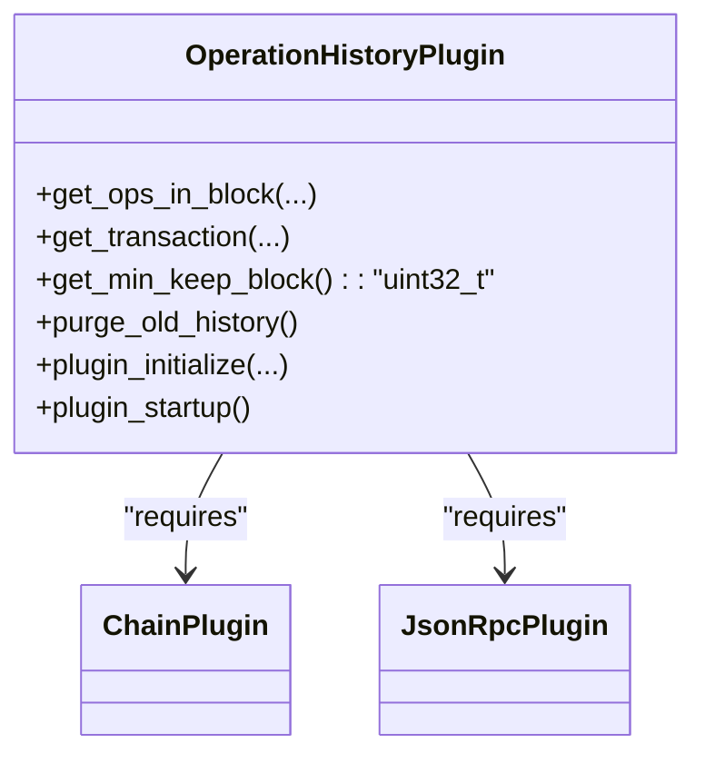

**Diagram sources**
- [plugin.hpp (operation_history)](file://plugins/operation_history/include/graphene/plugins/operation_history/plugin.hpp#L52-L83)
- [plugin.hpp (operation_history)](file://plugins/operation_history/include/graphene/plugins/operation_history/plugin.hpp#L53-L58)
- [plugin.cpp (operation_history)](file://plugins/operation_history/plugin.cpp#L99-L122)

**Section sources**
- [plugin.hpp (operation_history)](file://plugins/operation_history/include/graphene/plugins/operation_history/plugin.hpp#L52-L83)
- [plugin.cpp (operation_history)](file://plugins/operation_history/plugin.cpp#L99-L122)

### Account History Plugin: Consumer of Operation History Events
- Purpose: Maintains per-account operation histories by subscribing to operation streams.
- Dependencies:
  - Requires chain::plugin, operation_history::plugin, and json_rpc::plugin.
- Purging coordination:
  - Coordinates with operation_history plugin to avoid dangling references.
  - Uses get_min_keep_block() from operation_history plugin for aggressive purging.
- Typical usage:
  - Subscribes to operation updates and records them for later retrieval.

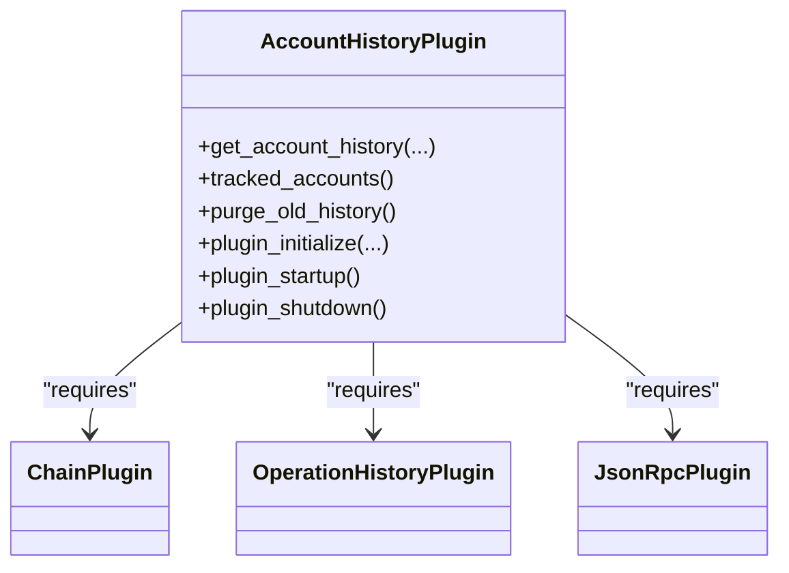

**Diagram sources**
- [plugin.hpp (account_history)](file://plugins/account_history/include/graphene/plugins/account_history/plugin.hpp#L59-L93)
- [plugin.hpp (account_history)](file://plugins/account_history/include/graphene/plugins/account_history/plugin.hpp#L60-L66)
- [plugin.cpp (account_history)](file://plugins/account_history/plugin.cpp#L94-L163)

**Section sources**
- [plugin.hpp (account_history)](file://plugins/account_history/include/graphene/plugins/account_history/plugin.hpp#L59-L93)
- [plugin.cpp (account_history)](file://plugins/account_history/plugin.cpp#L94-L163)

### P2P Plugin: Broadcast and Event Propagation
- Purpose: Handles peer-to-peer networking and broadcasts blocks/transactions.
- Dependencies:
  - Requires chain::plugin for block/transaction validation and context.
- Typical usage:
  - Receives blocks from chain and broadcasts them to peers.

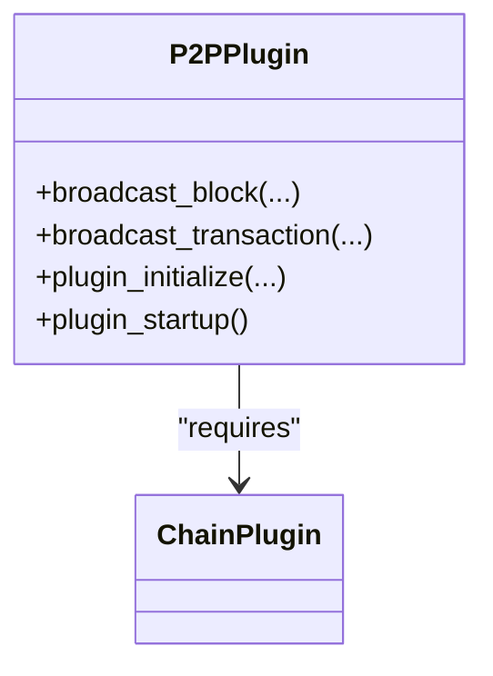

**Diagram sources**
- [p2p_plugin.hpp](file://plugins/p2p/include/graphene/plugins/p2p/p2p_plugin.hpp#L18-L52)

**Section sources**
- [p2p_plugin.hpp](file://plugins/p2p/include/graphene/plugins/p2p/p2p_plugin.hpp#L18-L52)

### Webserver Plugin: JSON-RPC Endpoint
- Purpose: Exposes HTTP/WS endpoints for JSON-RPC requests.
- Dependencies:
  - Requires json_rpc::plugin for request routing and transport.
- Thread-safety note:
  - The plugin documentation indicates handlers run on the appbase io_service thread, and callbacks can be invoked from any thread and are automatically propagated to the HTTP thread.

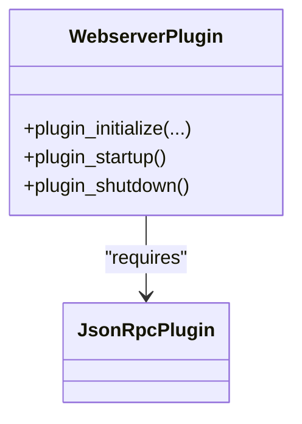

**Diagram sources**
- [plugin.hpp (webserver)](file://plugins/webserver/include/graphene/plugins/webserver/webserver_plugin.hpp#L32-L57)

**Section sources**
- [plugin.hpp (webserver)](file://plugins/webserver/include/graphene/plugins/webserver/webserver_plugin.hpp#L32-L57)

### Observer Pattern with Boost.Signals2
- Signal emission:
  - chain::plugin defines on_sync as a signal<void()> for synchronization events.
- Signal consumption:
  - database_api::plugin subscribes to signals exposed by other components (e.g., block-applied signals) to react to blockchain events.
- Practical examples:
  - chain::plugin emits on_sync during sync/live transitions.
  - database_api::plugin uses a signal reference parameter to connect to block-applied events.

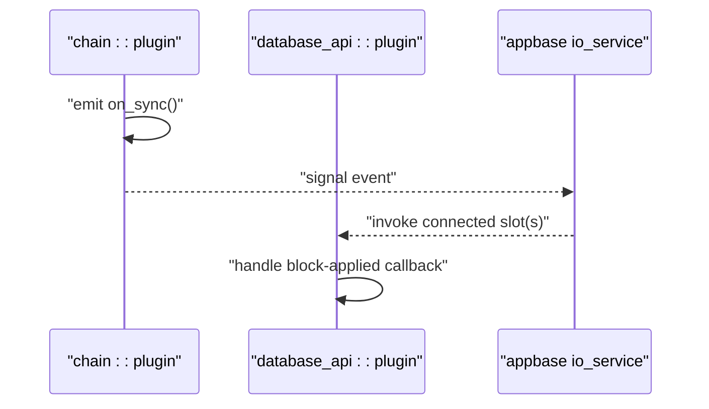

**Diagram sources**
- [plugin.hpp (chain)](file://plugins/chain/include/graphene/plugins/chain/plugin.hpp#L88-L91)
- [api.cpp (database_api)](file://plugins/database_api/api.cpp#L35)

**Section sources**
- [plugin.hpp (chain)](file://plugins/chain/include/graphene/plugins/chain/plugin.hpp#L88-L91)
- [api.cpp (database_api)](file://plugins/database_api/api.cpp#L35)

## Memory Management Coordination

### Enhanced Purging Coordination Mechanisms
The account_history and operation_history plugins now implement sophisticated memory management coordination to prevent memory leaks and dangling references.

#### Operation History Purging
The operation_history plugin maintains a configurable history depth and provides purging capabilities:

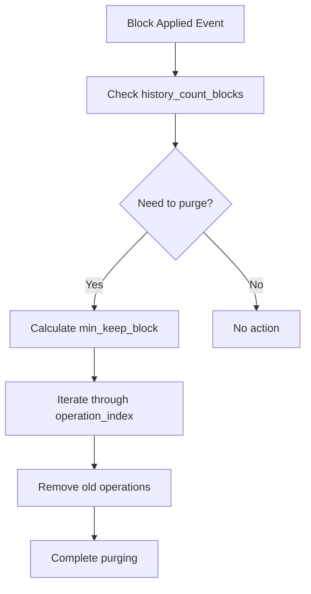

**Diagram sources**
- [plugin.cpp (operation_history)](file://plugins/operation_history/plugin.cpp#L107-L122)

#### Account History Coordination
The account_history plugin coordinates with operation_history to ensure consistent memory management:

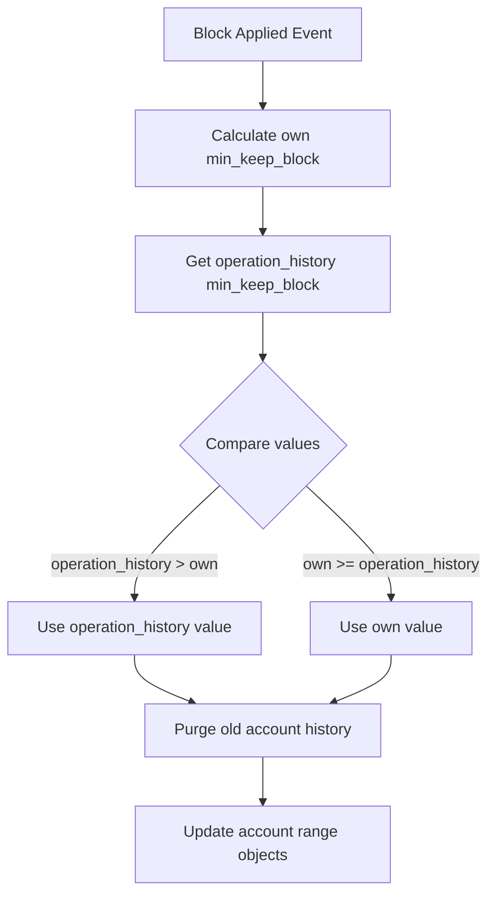

**Diagram sources**
- [plugin.cpp (account_history)](file://plugins/account_history/plugin.cpp#L94-L163)

#### Signal Handler Management
Both plugins implement proper signal handler management for graceful shutdown:

**Section sources**
- [plugin.cpp (operation_history)](file://plugins/operation_history/plugin.cpp#L107-L122)
- [plugin.cpp (account_history)](file://plugins/account_history/plugin.cpp#L94-L163)
- [plugin.cpp (operation_history)](file://plugins/operation_history/plugin.cpp#L293-L299)
- [plugin.cpp (account_history)](file://plugins/account_history/plugin.cpp#L580-L586)

## Dependency Analysis
Plugins declare dependencies using APPBASE_PLUGIN_REQUIRES. The runtime initializes plugins in dependency order and makes required plugins available to consumers. **Enhanced coordination ensures proper memory management across the plugin ecosystem.**

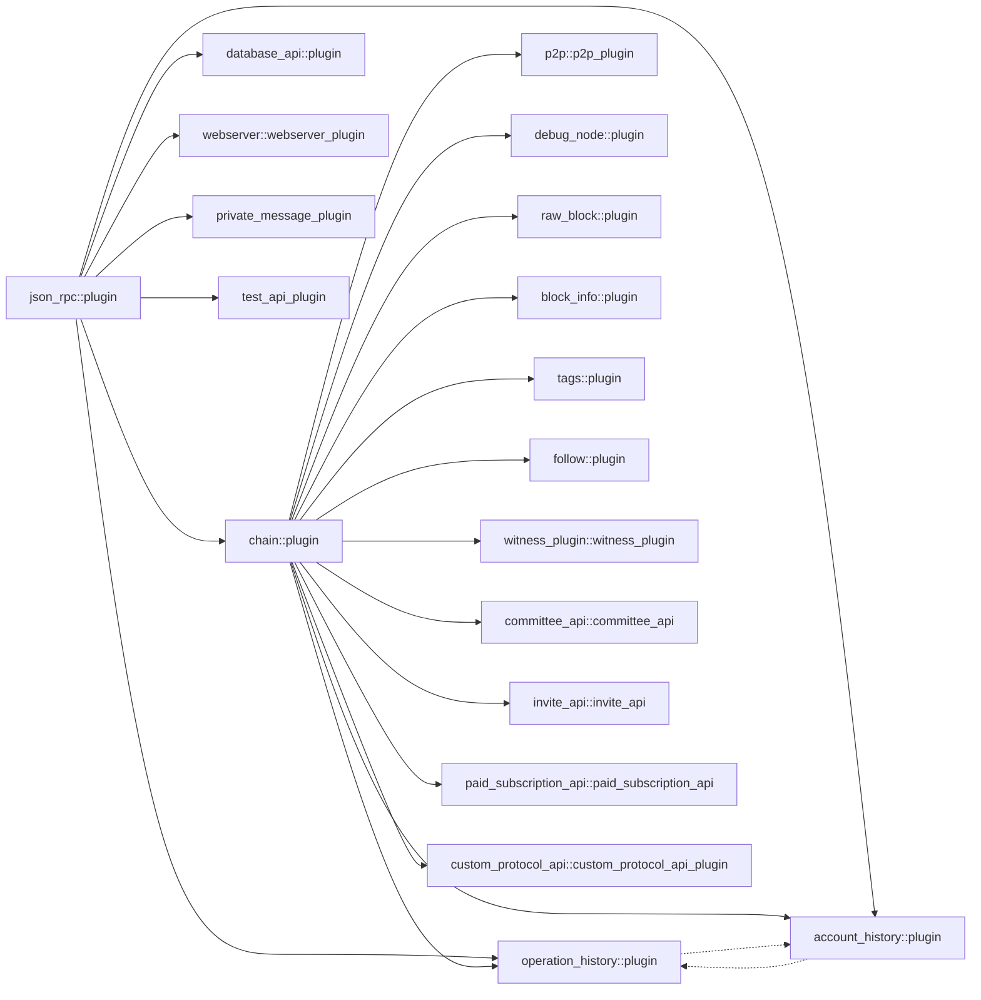

**Diagram sources**
- [plugin.hpp (chain)](file://plugins/chain/include/graphene/plugins/chain/plugin.hpp#L21-L24)
- [plugin.hpp (database_api)](file://plugins/database_api/include/graphene/plugins/database_api/plugin.hpp#L187-L192)
- [plugin.hpp (operation_history)](file://plugins/operation_history/include/graphene/plugins/operation_history/plugin.hpp#L53-L58)
- [plugin.hpp (account_history)](file://plugins/account_history/include/graphene/plugins/account_history/plugin.hpp#L60-L66)
- [plugin.hpp (webserver)](file://plugins/webserver/include/graphene/plugins/webserver/webserver_plugin.hpp#L32-L39)
- [p2p_plugin.hpp](file://plugins/p2p/include/graphene/plugins/p2p/p2p_plugin.hpp#L18-L21)

**Section sources**
- [plugin.hpp (chain)](file://plugins/chain/include/graphene/plugins/chain/plugin.hpp#L21-L24)
- [plugin.hpp (database_api)](file://plugins/database_api/include/graphene/plugins/database_api/plugin.hpp#L187-L192)
- [plugin.hpp (operation_history)](file://plugins/operation_history/include/graphene/plugins/operation_history/plugin.hpp#L53-L58)
- [plugin.hpp (account_history)](file://plugins/account_history/include/graphene/plugins/account_history/plugin.hpp#L60-L66)
- [plugin.hpp (webserver)](file://plugins/webserver/include/graphene/plugins/webserver/webserver_plugin.hpp#L32-L39)
- [p2p_plugin.hpp](file://plugins/p2p/include/graphene/plugins/p2p/p2p_plugin.hpp#L18-L21)

## Performance Considerations
- Prefer lightweight signals for event propagation to avoid heavy synchronous calls.
- Use asynchronous callbacks and appbase io_service threads for I/O-bound tasks (e.g., webserver).
- Minimize contention by keeping shared state protected and avoiding long-running work in signal handlers.
- Batch operations where possible to reduce overhead (e.g., bulk indexing in account_history).
- **Implement coordinated purging to prevent memory accumulation and improve performance.**
- **Use get_min_keep_block() API for consistent memory management across plugins.**

## Troubleshooting Guide
- Initialization failures:
  - Verify that all required plugins are registered and present in the dependency graph.
  - Ensure APPBASE_PLUGIN_REQUIRES lists are correct and match actual dependencies.
- Signal not firing:
  - Confirm that the emitting plugin actually emits the signal and that subscribers connect before the event occurs.
  - Check that the signal lifetime exceeds the subscription duration.
- API not available:
  - Ensure the plugin exposing the API is started and that dependent plugins are initialized in the correct order.
- **Memory issues:**
  - Verify that both operation_history and account_history plugins are properly coordinating purging.
  - Check that get_min_keep_block() values are consistent across plugins.
  - Ensure signal handlers are properly disconnected during shutdown.

## Conclusion
Inter-plugin communication in this codebase relies on a clean separation of concerns with enhanced memory management coordination:
- appbase manages dependency injection and initialization order
- Boost.Signals2 enables decoupled event propagation
- Plugins expose read-only APIs for others to consume
- The chain plugin acts as the central dependency provider
- **Enhanced coordination between operation_history and account_history prevents memory leaks and dangling references**
- **Proper signal handler management ensures graceful shutdown and resource cleanup**

Following the patterns documented here helps maintain loose coupling, predictable initialization, robust event-driven workflows, and efficient memory utilization across the plugin ecosystem.