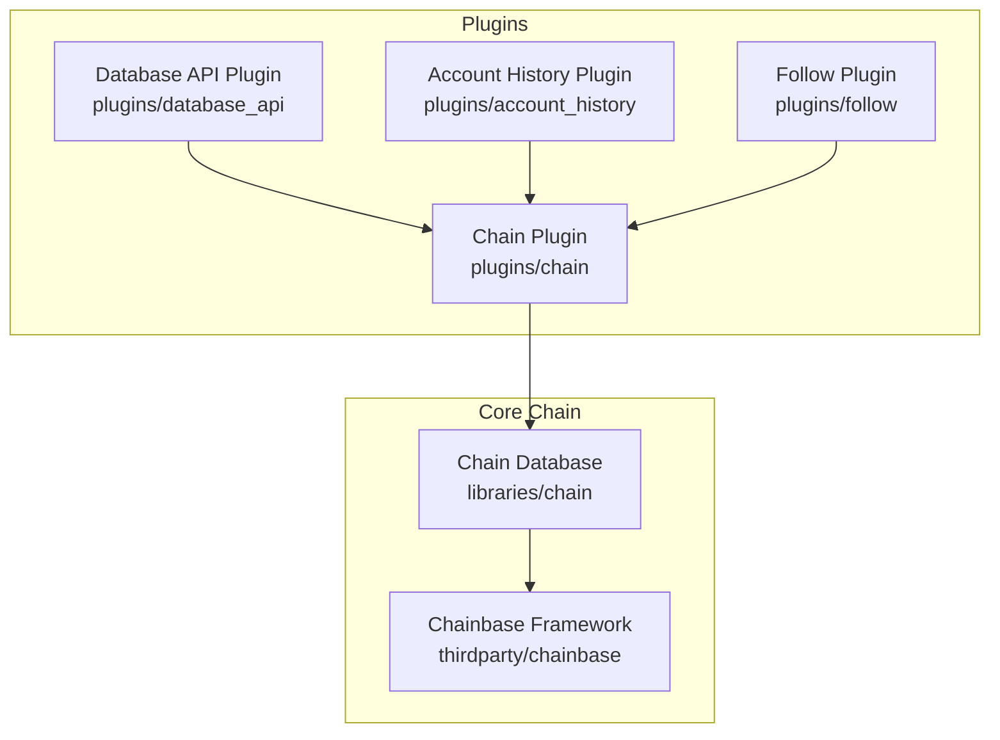
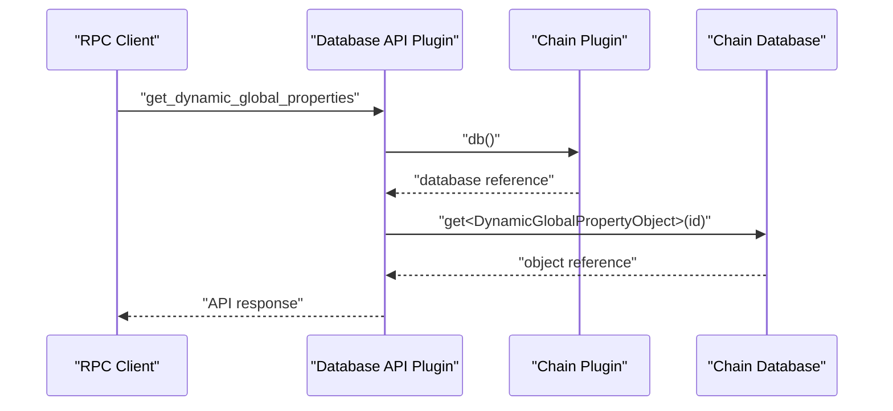
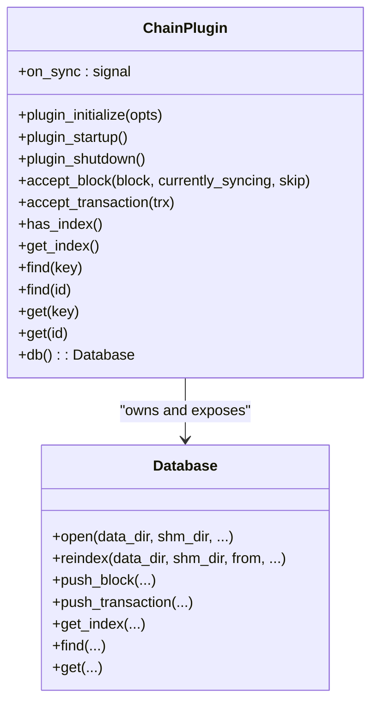
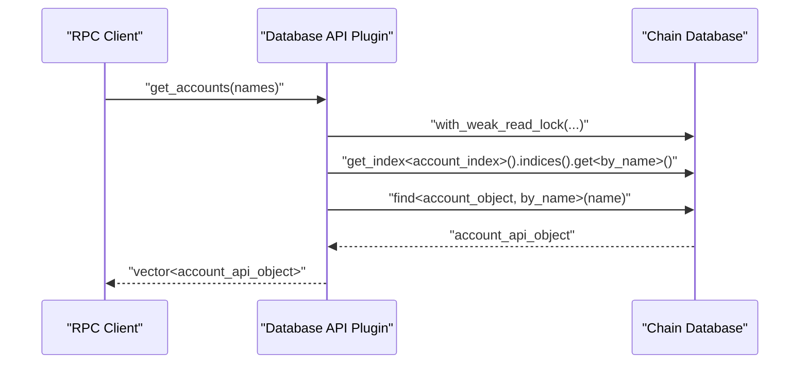
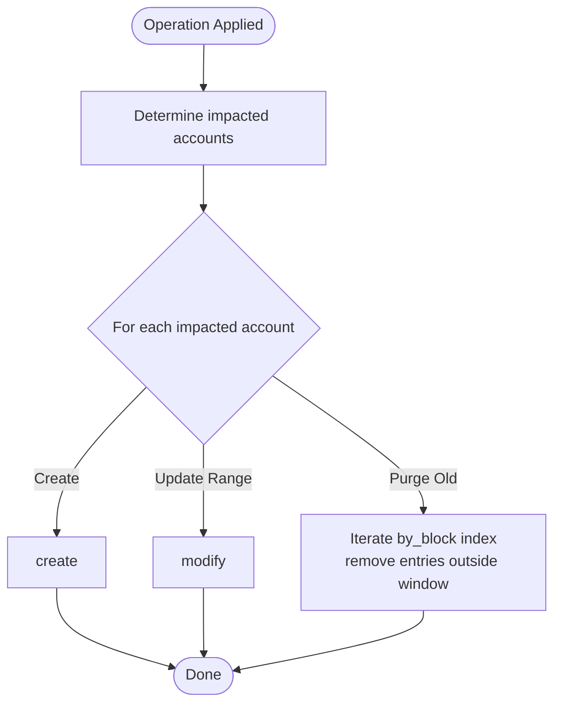
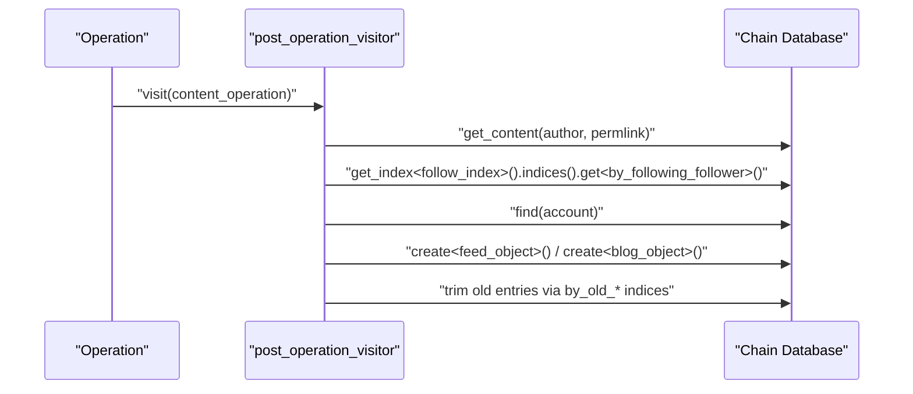
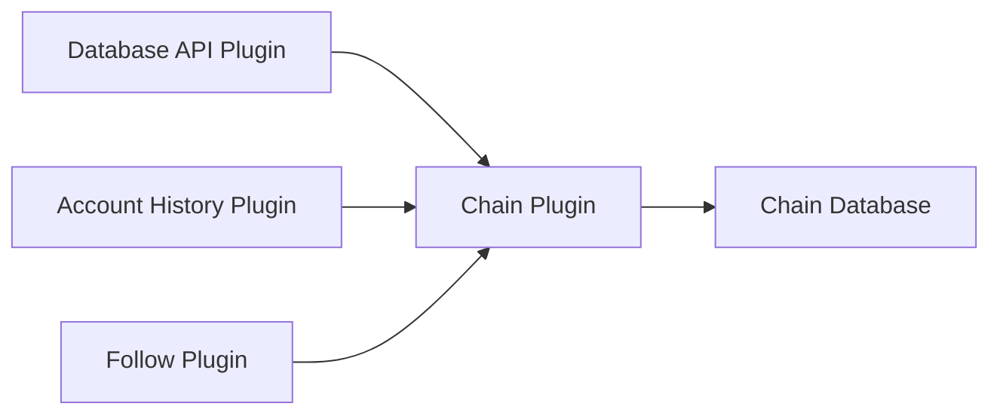

# Plugin API Design Patterns

<cite>
**Referenced Files in This Document**
- [plugin.hpp](file://plugins/chain/include/graphene/plugins/chain/plugin.hpp)
- [plugin.cpp](file://plugins/chain/plugin.cpp)
- [database.hpp](file://libraries/chain/include/graphene/chain/database.hpp)
- [database.cpp](file://libraries/chain/database.cpp)
- [plugin.hpp](file://plugins/database_api/include/graphene/plugins/database_api/plugin.hpp)
- [api.cpp](file://plugins/database_api/api.cpp)
- [db_with.hpp](file://libraries/chain/include/graphene/chain/db_with.hpp)
- [history_object.hpp](file://plugins/account_history/include/graphene/plugins/account_history/history_object.hpp)
- [plugin.cpp](file://plugins/account_history/plugin.cpp)
- [follow_objects.hpp](file://plugins/follow/include/graphene/plugins/follow/follow_objects.hpp)
- [plugin.cpp](file://plugins/follow/plugin.cpp)
- [database_exceptions.hpp](file://libraries/chain/include/graphene/chain/database_exceptions.hpp)
</cite>

## Table of Contents
1. [Introduction](#introduction)
2. [Project Structure](#project-structure)
3. [Core Components](#core-components)
4. [Architecture Overview](#architecture-overview)
5. [Detailed Component Analysis](#detailed-component-analysis)
6. [Dependency Analysis](#dependency-analysis)
7. [Performance Considerations](#performance-considerations)
8. [Troubleshooting Guide](#troubleshooting-guide)
9. [Conclusion](#conclusion)

## Introduction
This document explains plugin API design patterns and best practices for the VIZ blockchain node, focusing on how plugins access and interact with the blockchain database through the chainbase framework. It documents database access patterns (find, get, and index operations), demonstrates CRUD operations implemented by plugins, outlines API surface design principles, and covers error handling, validation, and performance considerations. Practical usage patterns and integration with other system components are also included.

## Project Structure
The plugin system is organized around the appbase framework with plugins exposing JSON-RPC APIs backed by the chain database. The chain plugin owns the database and exposes template-based access helpers. Other plugins (e.g., database_api, account_history, follow) depend on the chain plugin and use the database to implement their APIs.

**Diagram sources**
- [plugin.hpp](file://plugins/chain/include/graphene/plugins/chain/plugin.hpp#L21-L96)
- [plugin.cpp](file://plugins/chain/plugin.cpp#L169-L181)
- [database.hpp](file://libraries/chain/include/graphene/chain/database.hpp#L36-L558)

**Section sources**
- [plugin.hpp](file://plugins/chain/include/graphene/plugins/chain/plugin.hpp#L1-L100)
- [plugin.cpp](file://plugins/chain/plugin.cpp#L169-L181)
- [database.hpp](file://libraries/chain/include/graphene/chain/database.hpp#L36-L558)

## Core Components
- Chain plugin: Provides the database handle and template-based accessors (has_index, get_index, find, get) to support type-safe object operations. It manages database lifecycle (open, reindex, replay, close) and exposes signals for synchronization.
- Database API plugin: Exposes read-only RPC queries against the chain database (blocks, transactions, globals, accounts, balances, authority/validations, database info).
- Account History plugin: Maintains per-account operation history and ranges, implementing CRUD-like operations to create, modify, and purge history entries.
- Follow plugin: Implements social features (followers, following, feed/blog caches) using database CRUD operations and custom operation interpretation.

Key template-based database access patterns:
- has_index<T>()
- get_index<T>()
- find<ObjectType, ByTag, Key>(key)
- find<ObjectType>(object_id)
- get<ObjectType, ByTag, Key>(key)
- get<ObjectType>(object_id)

These are thin wrappers around the underlying chainbase database and are exposed by the chain plugin for use by other plugins.

**Section sources**
- [plugin.hpp](file://plugins/chain/include/graphene/plugins/chain/plugin.hpp#L52-L86)
- [plugin.cpp](file://plugins/chain/plugin.cpp#L169-L181)
- [database.hpp](file://libraries/chain/include/graphene/chain/database.hpp#L13-L558)

## Architecture Overview
The chain plugin owns the database and exposes a clean API surface to other plugins. Plugins requiring read/write access to the database use the chain plugin’s database handle and template-based helpers. Plugins that only need read access wrap their API calls with weak read locks to avoid blocking writers.

**Diagram sources**
- [plugin.hpp](file://plugins/database_api/include/graphene/plugins/database_api/plugin.hpp#L179-L403)
- [api.cpp](file://plugins/database_api/api.cpp#L333-L347)
- [plugin.hpp](file://plugins/chain/include/graphene/plugins/chain/plugin.hpp#L83-L86)
- [database.hpp](file://libraries/chain/include/graphene/chain/database.hpp#L164-L164)

## Detailed Component Analysis

### Chain Plugin: Template-Based Accessors and Lifecycle
- Template accessors:
  - has_index<T>() checks for the existence of a multi-index type.
  - get_index<T>() returns a reference to the generic index for type T.
  - find<ObjectType, ByTag, Key>(key) and find<ObjectType>(id) locate objects without throwing if not found.
  - get<ObjectType, ByTag, Key>(key) and get<ObjectType>(id) retrieve objects and throw if missing.
- Database lifecycle:
  - Open/reindex/replay/close with configurable shared memory sizing and flushing intervals.
  - Options for single-write-thread mode, virtual operations skipping, and plugin hooks on push_transaction.

**Diagram sources**
- [plugin.hpp](file://plugins/chain/include/graphene/plugins/chain/plugin.hpp#L21-L96)
- [plugin.cpp](file://plugins/chain/plugin.cpp#L169-L424)
- [database.hpp](file://libraries/chain/include/graphene/chain/database.hpp#L36-L558)

**Section sources**
- [plugin.hpp](file://plugins/chain/include/graphene/plugins/chain/plugin.hpp#L52-L86)
- [plugin.cpp](file://plugins/chain/plugin.cpp#L169-L424)

### Database API Plugin: Read-Only Queries and Locking
- API surface includes blocks, transactions, globals, accounts, balances, authority/validations, and database info.
- Uses weak read locks around database queries to minimize contention with writers.
- Subscriptions and callbacks for block-applied events.

**Diagram sources**
- [plugin.hpp](file://plugins/database_api/include/graphene/plugins/database_api/plugin.hpp#L179-L403)
- [api.cpp](file://plugins/database_api/api.cpp#L371-L399)
- [api.cpp](file://plugins/database_api/api.cpp#L401-L425)

**Section sources**
- [plugin.hpp](file://plugins/database_api/include/graphene/plugins/database_api/plugin.hpp#L179-L403)
- [api.cpp](file://plugins/database_api/api.cpp#L371-L399)
- [api.cpp](file://plugins/database_api/api.cpp#L401-L425)

### Account History Plugin: CRUD Operations on Blockchain Objects
- Creates account history entries and maintains account range boundaries.
- Modifies existing range objects when sequences change.
- Purges old history based on configured block window.
- Uses database.create, database.modify, and database.remove for CRUD.

**Diagram sources**
- [plugin.cpp](file://plugins/account_history/plugin.cpp#L51-L82)
- [plugin.cpp](file://plugins/account_history/plugin.cpp#L93-L126)

**Section sources**
- [plugin.cpp](file://plugins/account_history/plugin.cpp#L51-L82)
- [plugin.cpp](file://plugins/account_history/plugin.cpp#L93-L126)
- [history_object.hpp](file://plugins/account_history/include/graphene/plugins/account_history/history_object.hpp#L76-L119)

### Follow Plugin: Index-Based Reads and Writes
- Implements social graph and feed/blog caches using multi-index containers.
- Reads with lower_bound and equality checks on composite indices.
- Writes with create and remove operations, enforcing limits via old-index trimming.

**Diagram sources**
- [plugin.cpp](file://plugins/follow/plugin.cpp#L114-L188)
- [follow_objects.hpp](file://plugins/follow/include/graphene/plugins/follow/follow_objects.hpp#L144-L226)

**Section sources**
- [plugin.cpp](file://plugins/follow/plugin.cpp#L114-L188)
- [follow_objects.hpp](file://plugins/follow/include/graphene/plugins/follow/follow_objects.hpp#L144-L226)

### Plugin API Surface Design Principles
- Clean separation of concerns: chain plugin owns DB, other plugins depend on it.
- Type-safe accessors via templates to avoid runtime errors and promote compile-time safety.
- Read-only APIs use weak read locks to reduce contention.
- Strong validation and assertions for limits and invariants.
- Signals for synchronization and event-driven integrations.

**Section sources**
- [plugin.hpp](file://plugins/chain/include/graphene/plugins/chain/plugin.hpp#L52-L86)
- [api.cpp](file://plugins/database_api/api.cpp#L150-L175)
- [plugin.cpp](file://plugins/follow/plugin.cpp#L350-L395)

## Dependency Analysis
- The chain plugin depends on chainbase and exposes a database interface to other plugins.
- The database API plugin depends on the chain plugin and the JSON-RPC plugin.
- Account History and Follow plugins depend on the chain plugin and define their own multi-indexes.

**Diagram sources**
- [plugin.hpp](file://plugins/chain/include/graphene/plugins/chain/plugin.hpp#L21-L42)
- [plugin.hpp](file://plugins/database_api/include/graphene/plugins/database_api/plugin.hpp#L179-L191)
- [plugin.cpp](file://plugins/account_history/plugin.cpp#L491-L492)
- [plugin.cpp](file://plugins/follow/plugin.cpp#L319-L323)

**Section sources**
- [plugin.hpp](file://plugins/chain/include/graphene/plugins/chain/plugin.hpp#L21-L42)
- [plugin.hpp](file://plugins/database_api/include/graphene/plugins/database_api/plugin.hpp#L179-L191)
- [plugin.cpp](file://plugins/account_history/plugin.cpp#L491-L492)
- [plugin.cpp](file://plugins/follow/plugin.cpp#L319-L323)

## Performance Considerations
- Shared memory sizing and growth:
  - Configure initial shared memory size, increment size, and minimum free space thresholds.
  - Periodic checks for free space to avoid stalls.
- Single write thread:
  - Optional single-write-thread mode to serialize block/transaction pushes for stability.
- Virtual operations:
  - Skip virtual operations to reduce memory pressure during sync.
- Read locks:
  - Use weak read locks for read-only APIs to minimize writer contention.
- Index traversal limits:
  - Enforce reasonable limits on returned rows to prevent excessive CPU/memory usage.
- Flush interval:
  - Tune flush interval to balance durability and performance.

Practical tips:
- Prefer index-based lookups (lower_bound, equal_range) for efficient scans.
- Use composite indices for multi-key queries.
- Limit pagination sizes and enforce client-side caps.
- Monitor free shared memory and adjust increments accordingly.

**Section sources**
- [plugin.cpp](file://plugins/chain/plugin.cpp#L183-L251)
- [plugin.cpp](file://plugins/chain/plugin.cpp#L330-L346)
- [api.cpp](file://plugins/database_api/api.cpp#L436-L450)
- [api.cpp](file://plugins/database_api/api.cpp#L582-L591)

## Troubleshooting Guide
Common issues and strategies:
- Database open failures:
  - On revision mismatch or corruption, the chain plugin attempts to replay or resync automatically based on configuration flags.
- Exception propagation:
  - Plugins should wrap API calls with weak read locks and handle exceptions gracefully.
  - Internal exception macros and plugin exception handling ensure consistent logging and propagation.
- Operation validation and evaluation:
  - Dedicated exception categories for validation and evaluation failures aid in diagnostics.
- Signal handling:
  - Signal guard ensures proper cleanup and exception reporting during signal delivery.

Best practices:
- Always validate inputs and enforce limits before querying the database.
- Use find vs get appropriately: find avoids exceptions for missing objects; get throws if not found.
- Log and rethrow plugin exceptions to preserve stack traces.

**Section sources**
- [plugin.cpp](file://plugins/chain/plugin.cpp#L348-L386)
- [database_exceptions.hpp](file://libraries/chain/include/graphene/chain/database_exceptions.hpp#L45-L62)
- [api.cpp](file://plugins/database_api/api.cpp#L150-L175)

## Conclusion
The VIZ plugin system leverages a clean, template-based API surface to safely and efficiently access the blockchain database. Plugins implement CRUD operations using chainbase multi-indexes, expose read-only RPC APIs with weak read locks, and integrate through signals and custom operation interpreters. Robust error handling, validation, and performance tuning enable scalable and maintainable plugin development.