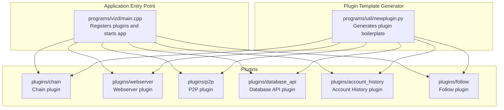
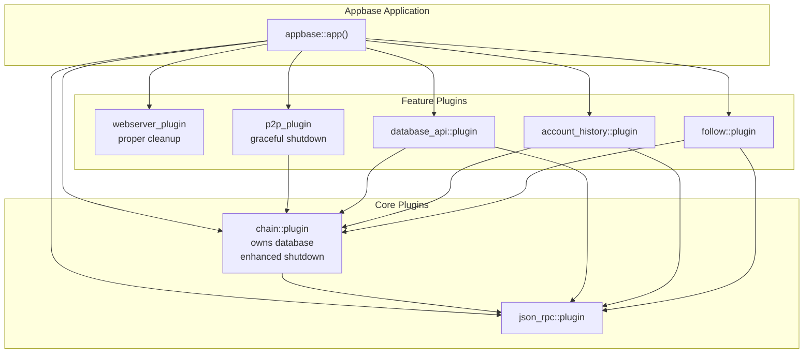
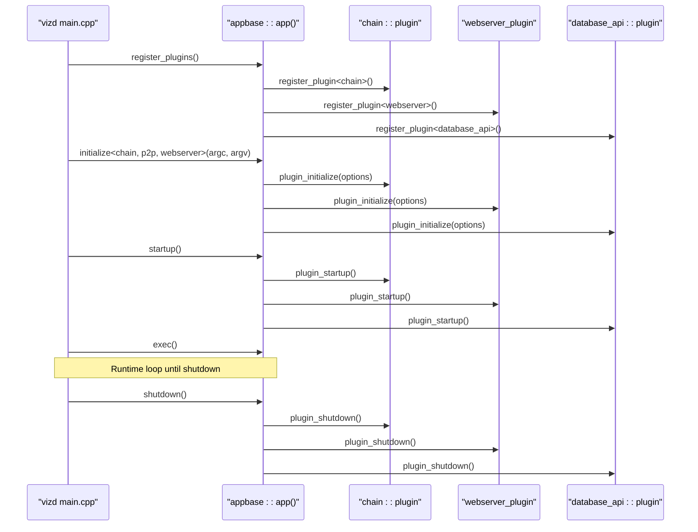
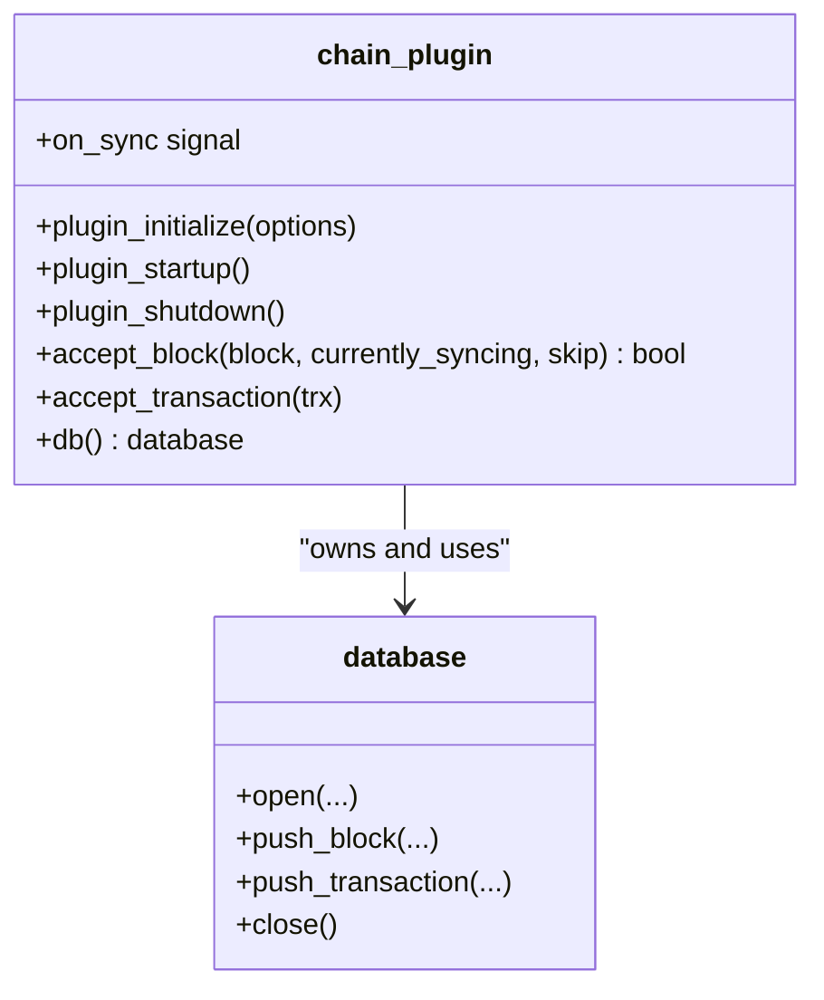
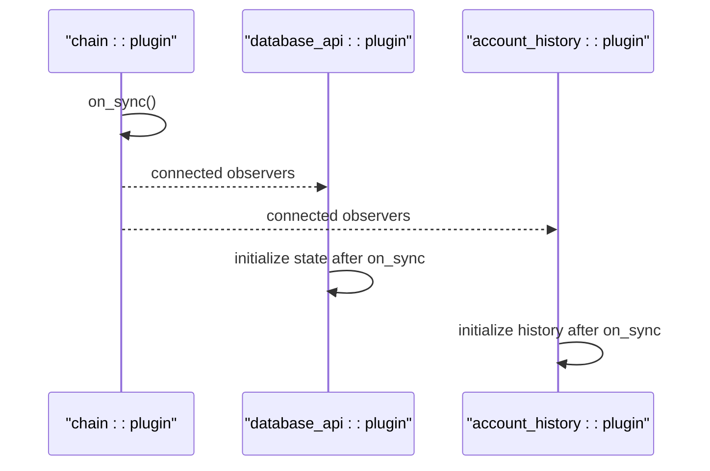
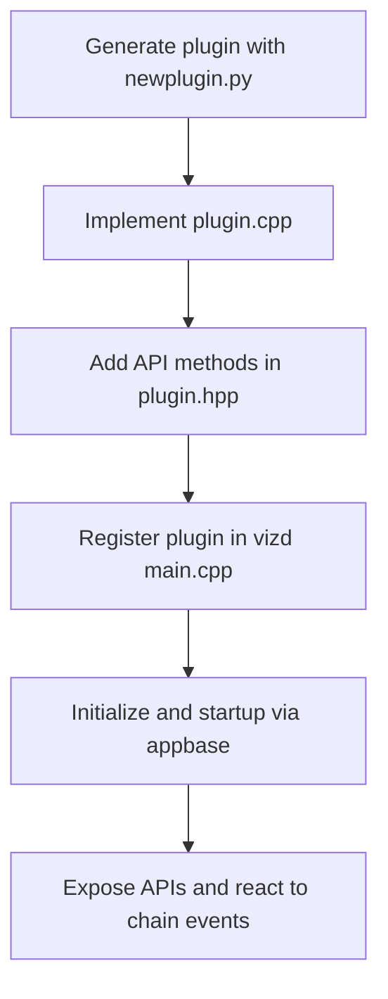
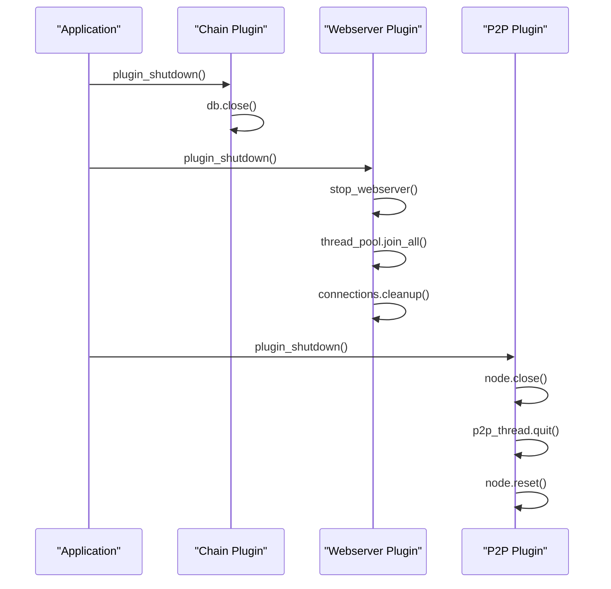
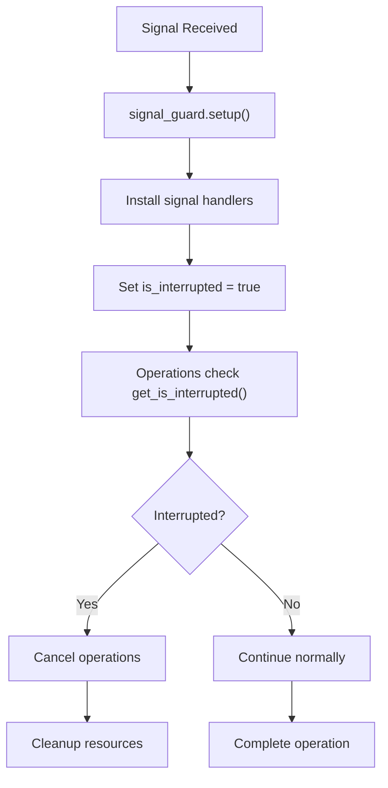
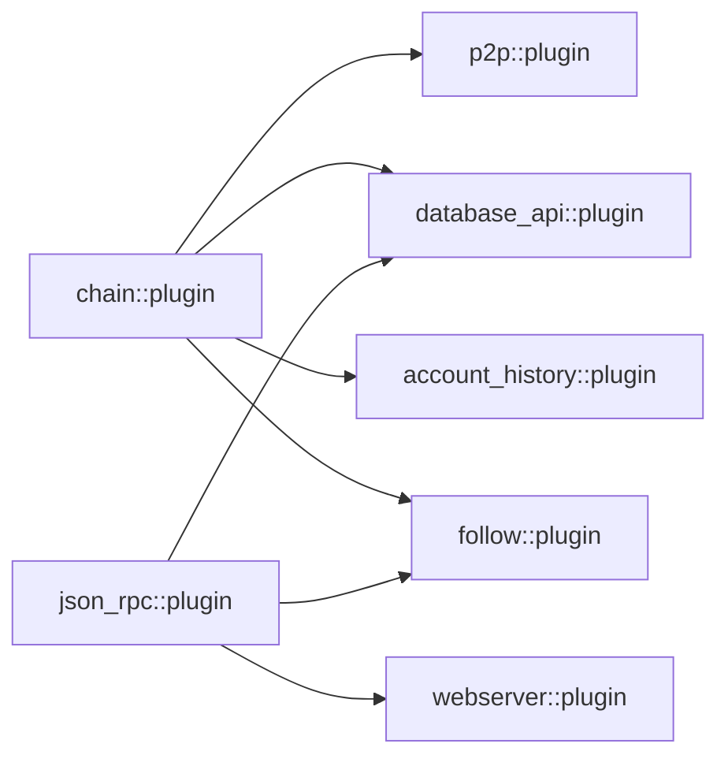
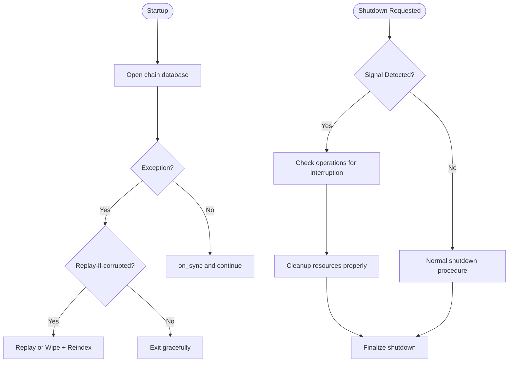

# Plugin Architecture

<cite>
**Referenced Files in This Document**
- [main.cpp](file://programs/vizd/main.cpp)
- [newplugin.py](file://programs/util/newplugin.py)
- [plugin.hpp](file://plugins/chain/include/graphene/plugins/chain/plugin.hpp)
- [plugin.cpp](file://plugins/chain/plugin.cpp)
- [webserver_plugin.cpp](file://plugins/webserver/webserver_plugin.cpp)
- [p2p_plugin.cpp](file://plugins/p2p/p2p_plugin.cpp)
- [plugin.hpp](file://plugins/database_api/include/graphene/plugins/database_api/plugin.hpp)
- [plugin.hpp](file://plugins/account_history/include/graphene/plugins/account_history/plugin.hpp)
- [plugin.hpp](file://plugins/follow/include/graphene/plugins/follow/plugin.hpp)
- [CMakeLists.txt](file://plugins/CMakeLists.txt)
- [database.cpp](file://libraries/chain/database.cpp)
- [node.cpp](file://libraries/network/node.cpp)
</cite>

## Update Summary
**Changes Made**
- Enhanced plugin lifecycle management documentation with improved shutdown procedures
- Added signal handler coordination mechanisms for graceful shutdown
- Documented memory leak prevention through proper resource cleanup
- Updated plugin shutdown sequences with proper connection termination
- Added comprehensive signal handling improvements for database operations

## Table of Contents
1. [Introduction](#introduction)
2. [Project Structure](#project-structure)
3. [Core Components](#core-components)
4. [Architecture Overview](#architecture-overview)
5. [Detailed Component Analysis](#detailed-component-analysis)
6. [Enhanced Lifecycle Management](#enhanced-lifecycle-management)
7. [Signal Handler Coordination](#signal-handler-coordination)
8. [Memory Leak Prevention](#memory-let-prevention)
9. [Dependency Analysis](#dependency-analysis)
10. [Performance Considerations](#performance-considerations)
11. [Troubleshooting Guide](#troubleshooting-guide)
12. [Conclusion](#conclusion)
13. [Appendices](#appendices)

## Introduction
This document explains the plugin architecture of the node, focusing on the modular, plugin-based design enabled by the appbase framework. It covers how plugins are registered, initialized, started, and shut down with enhanced lifecycle management; how they interact with the chain database and each other; and how to develop custom plugins using the provided template generator. The architecture now includes improved shutdown procedures, signal handler coordination, and memory leak prevention mechanisms for robust operation.

## Project Structure
The node organizes plugins under the plugins directory, with each plugin providing its own header and implementation files. The application entry point registers and initializes plugins, while a Python script generates boilerplate for new plugins. The enhanced lifecycle management ensures proper resource cleanup during shutdown.

**Diagram sources**
- [main.cpp](file://programs/vizd/main.cpp#L62-L90)
- [CMakeLists.txt](file://plugins/CMakeLists.txt#L1-L12)
- [newplugin.py](file://programs/util/newplugin.py#L1-L251)

**Section sources**
- [main.cpp](file://programs/vizd/main.cpp#L62-L90)
- [CMakeLists.txt](file://plugins/CMakeLists.txt#L1-L12)

## Core Components
- Application bootstrap and plugin registration: The application entry point registers all built-in plugins and initializes the app with selected plugins.
- Chain plugin: Provides blockchain database access, block acceptance, transaction acceptance, and emits synchronization signals with enhanced shutdown handling.
- Webserver plugin: Exposes JSON-RPC endpoints and delegates routing to the JSON-RPC plugin with proper connection cleanup.
- P2P plugin: Depends on the chain plugin and broadcasts blocks/transactions with graceful shutdown support.
- Database API plugin: Depends on chain and JSON-RPC; provides read-only database queries and subscriptions.
- Account History plugin: Tracks per-account operation history and depends on chain and operation history.
- Follow plugin: Depends on chain and JSON-RPC; provides social graph APIs.
- Plugin template generator: Automates creation of new plugins with standardized structure and dependencies.

**Section sources**
- [main.cpp](file://programs/vizd/main.cpp#L62-L90)
- [plugin.hpp](file://plugins/chain/include/graphene/plugins/chain/plugin.hpp#L21-L96)
- [plugin.cpp](file://plugins/chain/plugin.cpp#L392-L396)
- [webserver_plugin.cpp](file://plugins/webserver/webserver_plugin.cpp#L329-L331)
- [p2p_plugin.cpp](file://plugins/p2p/p2p_plugin.cpp#L568-L573)
- [plugin.hpp](file://plugins/database_api/include/graphene/plugins/database_api/plugin.hpp#L179-L409)
- [plugin.hpp](file://plugins/account_history/include/graphene/plugins/account_history/plugin.hpp#L59-L97)
- [plugin.hpp](file://plugins/follow/include/graphene/plugins/follow/plugin.hpp#L23-L70)
- [newplugin.py](file://programs/util/newplugin.py#L1-L251)

## Architecture Overview
The node uses appbase to manage plugins as independent, composable units with enhanced lifecycle management. Plugins declare their dependencies, receive lifecycle callbacks with proper shutdown handling, and can expose APIs and signals. The chain plugin owns the database and emits events; other plugins subscribe to chain events or depend on the chain plugin for read/write access with coordinated shutdown procedures.

**Diagram sources**
- [main.cpp](file://programs/vizd/main.cpp#L62-L90)
- [plugin.hpp](file://plugins/chain/include/graphene/plugins/chain/plugin.hpp#L21-L96)
- [webserver_plugin.cpp](file://plugins/webserver/webserver_plugin.cpp#L329-L331)
- [p2p_plugin.cpp](file://plugins/p2p/p2p_plugin.cpp#L568-L573)
- [plugin.hpp](file://plugins/database_api/include/graphene/plugins/database_api/plugin.hpp#L179-L191)
- [plugin.hpp](file://plugins/account_history/include/graphene/plugins/account_history/plugin.hpp#L59-L65)
- [plugin.hpp](file://plugins/follow/include/graphene/plugins/follow/plugin.hpp#L23-L31)

## Detailed Component Analysis

### Plugin Registration and Lifecycle
- Registration: The application registers each plugin via appbase::app().register_plugin<Plugin>().
- Initialization: plugin_initialize parses options and prepares internal state.
- Startup: plugin_startup opens databases, subscribes to signals, and exposes APIs.
- Shutdown: plugin_shutdown closes resources and tears down state with proper cleanup.

**Diagram sources**
- [main.cpp](file://programs/vizd/main.cpp#L62-L90)
- [main.cpp](file://programs/vizd/main.cpp#L117-L140)
- [plugin.cpp](file://plugins/chain/plugin.cpp#L392-L396)
- [webserver_plugin.cpp](file://plugins/webserver/webserver_plugin.cpp#L329-L331)
- [plugin.cpp](file://plugins/chain/plugin.cpp#L392-L396)

**Section sources**
- [main.cpp](file://programs/vizd/main.cpp#L62-L90)
- [main.cpp](file://programs/vizd/main.cpp#L117-L140)
- [plugin.cpp](file://plugins/chain/plugin.cpp#L392-L396)

### Chain Plugin: Database Access and Signals
- Database access: Provides db() getters and convenience helpers for indices and objects.
- Block/transaction acceptance: Validates and applies blocks/transactions via the underlying database.
- Synchronization signal: Emits on_sync to notify other plugins when the chain is ready.
- Enhanced shutdown: Properly closes database connections during plugin_shutdown.

**Diagram sources**
- [plugin.hpp](file://plugins/chain/include/graphene/plugins/chain/plugin.hpp#L21-L96)
- [plugin.cpp](file://plugins/chain/plugin.cpp#L392-L396)

**Section sources**
- [plugin.hpp](file://plugins/chain/include/graphene/plugins/chain/plugin.hpp#L21-L96)
- [plugin.cpp](file://plugins/chain/plugin.cpp#L392-L396)

### Inter-Plugin Communication: Observer Pattern with Boost.Signals2
- Chain plugin emits on_sync when synchronized.
- Other plugins subscribe during startup to coordinate behavior after chain readiness.
- Example: database_api and account_history rely on chain readiness for state queries.

**Diagram sources**
- [plugin.hpp](file://plugins/chain/include/graphene/plugins/chain/plugin.hpp#L90-L90)
- [plugin.hpp](file://plugins/database_api/include/graphene/plugins/database_api/plugin.hpp#L195-L199)
- [plugin.hpp](file://plugins/account_history/include/graphene/plugins/account_history/plugin.hpp#L76-L77)

**Section sources**
- [plugin.hpp](file://plugins/chain/include/graphene/plugins/chain/plugin.hpp#L90-L90)
- [plugin.hpp](file://plugins/database_api/include/graphene/plugins/database_api/plugin.hpp#L195-L199)
- [plugin.hpp](file://plugins/account_history/include/graphene/plugins/account_history/plugin.hpp#L76-L77)

### Plugin Template System: newplugin.py
- Generates boilerplate for a new plugin including:
  - CMakeLists.txt for library definition and linking
  - Plugin header with appbase::plugin base class and lifecycle methods
  - Plugin implementation with API factory registration and event subscription
  - API header and implementation stubs
- The template demonstrates:
  - Declaring plugin dependencies via APPBASE_PLUGIN_REQUIRES
  - Registering an API factory during plugin startup
  - Subscribing to chain events (e.g., applied_block)

**Diagram sources**
- [newplugin.py](file://programs/util/newplugin.py#L225-L246)

**Section sources**
- [newplugin.py](file://programs/util/newplugin.py#L1-L251)

### Practical Plugin Development Workflow
- Use the template generator to scaffold a new plugin.
- Implement plugin lifecycle methods and register API factories.
- Declare dependencies using APPBASE_PLUGIN_REQUIRES.
- Subscribe to chain signals or database events as needed.
- Integrate the plugin into the application's registration and initialization steps.

**Diagram sources**
- [newplugin.py](file://programs/util/newplugin.py#L225-L246)
- [main.cpp](file://programs/vizd/main.cpp#L62-L90)
- [plugin.cpp](file://plugins/chain/plugin.cpp#L316-L396)

**Section sources**
- [newplugin.py](file://programs/util/newplugin.py#L1-L251)
- [main.cpp](file://programs/vizd/main.cpp#L62-L90)
- [plugin.cpp](file://plugins/chain/plugin.cpp#L316-L396)

## Enhanced Lifecycle Management

### Improved Shutdown Procedures
The enhanced plugin lifecycle management includes comprehensive shutdown procedures designed to prevent memory leaks and ensure proper resource cleanup:

- **Chain Plugin Shutdown**: The chain plugin implements proper database closure in plugin_shutdown(), ensuring all database connections are properly closed.
- **Webserver Plugin Cleanup**: The webserver plugin implements thorough cleanup of HTTP and WebSocket servers, thread pools, and connection handlers.
- **P2P Plugin Graceful Shutdown**: The P2P plugin ensures proper network node closure, connection termination, and thread cleanup.

**Diagram sources**
- [plugin.cpp](file://plugins/chain/plugin.cpp#L392-L396)
- [webserver_plugin.cpp](file://plugins/webserver/webserver_plugin.cpp#L167-L190)
- [p2p_plugin.cpp](file://plugins/p2p/p2p_plugin.cpp#L568-L573)

**Section sources**
- [plugin.cpp](file://plugins/chain/plugin.cpp#L392-L396)
- [webserver_plugin.cpp](file://plugins/webserver/webserver_plugin.cpp#L167-L190)
- [p2p_plugin.cpp](file://plugins/p2p/p2p_plugin.cpp#L568-L573)

### Signal Handler Coordination
The enhanced architecture includes sophisticated signal handler coordination mechanisms for graceful shutdown and resource cleanup:

- **Signal Guard Implementation**: The database layer implements a signal_guard class that manages signal handlers for SIGHUP, SIGINT, and SIGTERM.
- **Interrupt Detection**: Signal handlers set interrupt flags that can be checked during long-running operations like blockchain reindexing.
- **Graceful Termination**: Operations check for interruption signals and terminate gracefully when detected.

**Diagram sources**
- [database.cpp](file://libraries/chain/database.cpp#L134-L180)
- [database.cpp](file://libraries/chain/database.cpp#L270-L329)

**Section sources**
- [database.cpp](file://libraries/chain/database.cpp#L134-L180)
- [database.cpp](file://libraries/chain/database.cpp#L270-L329)

### Memory Leak Prevention
The enhanced lifecycle management includes several mechanisms to prevent memory leaks during plugin operations:

- **Connection Cleanup**: Webserver plugin properly cleans up WebSocket and HTTP connections, ensuring no lingering references.
- **Thread Pool Management**: Proper thread pool shutdown with join_all() prevents thread leaks.
- **Network Node Cleanup**: P2P plugin ensures complete network node shutdown with proper resource deallocation.
- **Scoped Connections**: Plugins use scoped_connection objects that automatically disconnect when going out of scope.

**Section sources**
- [webserver_plugin.cpp](file://plugins/webserver/webserver_plugin.cpp#L167-L190)
- [p2p_plugin.cpp](file://plugins/p2p/p2p_plugin.cpp#L568-L573)
- [plugin.cpp](file://plugins/chain/plugin.cpp#L392-L396)

## Dependency Analysis
- Plugin discovery: The plugins/CMakeLists.txt iterates subdirectories and adds those with a CMakeLists.txt, enabling automatic inclusion of internal plugins.
- Plugin dependencies:
  - chain::plugin is required by p2p, database_api, account_history, and follow.
  - json_rpc::plugin is required by webserver, database_api, and follow.
  - account_history additionally requires operation_history internally.

**Diagram sources**
- [p2p_plugin.cpp](file://plugins/p2p/p2p_plugin.cpp#L531-L566)
- [plugin.hpp](file://plugins/database_api/include/graphene/plugins/database_api/plugin.hpp#L188-L191)
- [plugin.hpp](file://plugins/follow/include/graphene/plugins/follow/plugin.hpp#L28-L31)
- [webserver_plugin.cpp](file://plugins/webserver/webserver_plugin.cpp#L314-L327)

**Section sources**
- [CMakeLists.txt](file://plugins/CMakeLists.txt#L1-L12)
- [p2p_plugin.cpp](file://plugins/p2p/p2p_plugin.cpp#L531-L566)
- [plugin.hpp](file://plugins/database_api/include/graphene/plugins/database_api/plugin.hpp#L188-L191)
- [plugin.hpp](file://plugins/follow/include/graphene/plugins/follow/plugin.hpp#L28-L31)
- [webserver_plugin.cpp](file://plugins/webserver/webserver_plugin.cpp#L314-L327)

## Performance Considerations
- Single write thread: The chain plugin supports a single-write-thread mode to serialize block/transaction application, which can simplify locking but may reduce throughput.
- Shared memory sizing: Configurable shared memory size and increments help manage storage growth during replay or sync.
- Skipping virtual operations: Option to skip virtual operations reduces memory overhead for plugins not requiring them.
- Flush intervals: Periodic flushing of state to disk can be tuned for durability vs. performance trade-offs.

**Section sources**
- [plugin.cpp](file://plugins/chain/plugin.cpp#L281-L346)
- [plugin.cpp](file://plugins/chain/plugin.cpp#L300-L304)

## Troubleshooting Guide
- Database errors on startup: The chain plugin catches database revision and block log exceptions, optionally triggering a replay or wipe and resync path.
- Logging configuration: The application loads logging configuration from the config file and applies appenders/loggers accordingly.
- Graceful shutdown: Plugins should release connections and close databases in plugin_shutdown with proper cleanup procedures.
- Signal handling: The enhanced signal handling system provides better control over shutdown procedures and resource cleanup.

**Diagram sources**
- [plugin.cpp](file://plugins/chain/plugin.cpp#L348-L386)
- [database.cpp](file://libraries/chain/database.cpp#L270-L329)

**Section sources**
- [plugin.cpp](file://plugins/chain/plugin.cpp#L348-L386)
- [main.cpp](file://programs/vizd/main.cpp#L131-L137)
- [database.cpp](file://libraries/chain/database.cpp#L270-L329)

## Conclusion
The enhanced plugin architecture leverages appbase to provide a clean separation of concerns with improved lifecycle management, enabling flexible feature addition and removal. Plugins declare dependencies, participate in a standardized lifecycle with proper shutdown procedures, and communicate via signals and API factories. The enhanced shutdown mechanisms, signal handler coordination, and memory leak prevention ensure robust, maintainable extensions to the node. The template generator accelerates development while the chain plugin centralizes database access and synchronization events with proper resource cleanup.

## Appendices
- Best practices for extending node functionality:
  - Use APPBASE_PLUGIN_REQUIRES to declare explicit dependencies.
  - Register API factories in plugin_startup and expose only necessary methods.
  - Subscribe to chain signals (e.g., on_sync) to coordinate with other plugins.
  - Implement proper plugin_shutdown methods for resource cleanup.
  - Use scoped_connection objects for automatic disconnection.
  - Handle signals appropriately using the signal_guard mechanism.
  - Keep plugin responsibilities narrow and focused on specific domains.
  - Use configuration options to tune performance and behavior.
  - Ensure graceful shutdown procedures for all long-running operations.