# Plugin Architecture

<cite>
**Referenced Files in This Document**
- [main.cpp](file://programs/vizd/main.cpp)
- [newplugin.py](file://programs/util/newplugin.py)
- [plugin.hpp](file://plugins/chain/include/graphene/plugins/chain/plugin.hpp)
- [plugin.cpp](file://plugins/chain/plugin.cpp)
- [webserver_plugin.cpp](file://plugins/webserver/webserver_plugin.cpp)
- [p2p_plugin.cpp](file://plugins/p2p/p2p_plugin.cpp)
- [plugin.hpp](file://plugins/database_api/include/graphene/plugins/database_api/plugin.hpp)
- [plugin.hpp](file://plugins/account_history/include/graphene/plugins/account_history/plugin.hpp)
- [plugin.hpp](file://plugins/follow/include/graphene/plugins/follow/plugin.hpp)
- [CMakeLists.txt](file://plugins/CMakeLists.txt)
- [database.cpp](file://libraries/chain/database.cpp)
- [node.cpp](file://libraries/network/node.cpp)
- [snapshot_plugin.hpp](file://plugins/snapshot/include/graphene/plugins/snapshot/plugin.hpp)
- [snapshot_plugin.cpp](file://plugins/snapshot/plugin.cpp)
- [snapshot_types.hpp](file://plugins/snapshot/include/graphene/plugins/snapshot/snapshot_types.hpp)
- [snapshot_serializer.hpp](file://plugins/snapshot/include/graphene/plugins/snapshot/snapshot_serializer.hpp)
- [snapshot-plugin.md](file://documentation/snapshot-plugin.md)
</cite>

## Update Summary
**Changes Made**
- Added comprehensive documentation for RAII session guard implementation in snapshot plugin connection handling
- Documented enhanced retry logic for client-side connection establishment addressing race conditions in P2P communication
- Updated snapshot plugin system with improved session management and connection reliability
- Enhanced documentation of anti-spam protection mechanisms with race condition prevention
- Added detailed coverage of session_guard class and its role in preventing race conditions

## Table of Contents
1. [Introduction](#introduction)
2. [Project Structure](#project-structure)
3. [Core Components](#core-components)
4. [Architecture Overview](#architecture-overview)
5. [Detailed Component Analysis](#detailed-component-analysis)
6. [Enhanced Lifecycle Management](#enhanced-lifecycle-management)
7. [Signal Handler Coordination](#signal-handler-coordination)
8. [Memory Leak Prevention](#memory-leak-prevention)
9. [Snapshot Plugin System](#snapshot-plugin-system)
10. [Custom Network Protocol](#custom-network-protocol)
11. [Anti-Spam Protection](#anti-spam-protection)
12. [Session Guard Implementation](#session-guard-implementation)
13. [Enhanced Retry Logic](#enhanced-retry-logic)
14. [Race Condition Prevention](#race-condition-prevention)
15. [Integration with Chain Plugin](#integration-with-chain-plugin)
16. [Dependency Analysis](#dependency-analysis)
17. [Performance Considerations](#performance-considerations)
18. [Troubleshooting Guide](#troubleshooting-guide)
19. [Conclusion](#conclusion)
20. [Appendices](#appendices)

## Introduction
This document explains the plugin architecture of the node, focusing on the modular, plugin-based design enabled by the appbase framework. It covers how plugins are registered, initialized, started, and shut down with enhanced lifecycle management; how they interact with the chain database and each other; and how to develop custom plugins using the provided template generator. The architecture now includes improved shutdown procedures, signal handler coordination, memory leak prevention mechanisms, comprehensive snapshot plugin system with custom network protocols for efficient blockchain state synchronization, and robust session management with RAII-based race condition prevention.

## Project Structure
The node organizes plugins under the plugins directory, with each plugin providing its own header and implementation files. The application entry point registers and initializes plugins, while a Python script generates boilerplate for new plugins. The enhanced lifecycle management ensures proper resource cleanup during shutdown. The new snapshot plugin extends this architecture with advanced state synchronization capabilities and sophisticated connection management.

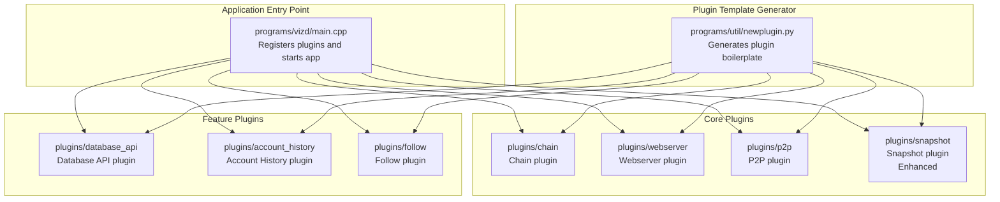
```mermaid
graph TB
subgraph "Application Entry Point"
A["programs/vizd/main.cpp<br/>Registers plugins and starts app"]
end
subgraph "Core Plugins"
P1["plugins/chain<br/>Chain plugin"]
P2["plugins/webserver<br/>Webserver plugin"]
P3["plugins/p2p<br/>P2P plugin"]
P4["plugins/snapshot<br/>Snapshot plugin<br/>Enhanced"]
end
subgraph "Feature Plugins"
P5["plugins/database_api<br/>Database API plugin"]
P6["plugins/account_history<br/>Account History plugin"]
P7["plugins/follow<br/>Follow plugin"]
end
subgraph "Plugin Template Generator"
T["programs/util/newplugin.py<br/>Generates plugin boilerplate"]
end
A --> P1
A --> P2
A --> P3
A --> P4
A --> P5
A --> P6
A --> P7
T --> P1
T --> P2
T --> P3
T --> P4
T --> P5
T --> P6
T --> P7
```

**Diagram sources**
- [main.cpp:62-90](file://programs/vizd/main.cpp#L62-L90)
- [CMakeLists.txt:1-12](file://plugins/CMakeLists.txt#L1-L12)
- [newplugin.py:1-251](file://programs/util/newplugin.py#L1-L251)

**Section sources**
- [main.cpp:62-90](file://programs/vizd/main.cpp#L62-L90)
- [CMakeLists.txt:1-12](file://plugins/CMakeLists.txt#L1-L12)

## Core Components
- Application bootstrap and plugin registration: The application entry point registers all built-in plugins and initializes the app with selected plugins.
- Chain plugin: Provides blockchain database access, block acceptance, transaction acceptance, and emits synchronization signals with enhanced shutdown handling.
- Webserver plugin: Exposes JSON-RPC endpoints and delegates routing to the JSON-RPC plugin with proper connection cleanup.
- P2P plugin: Depends on the chain plugin and broadcasts blocks/transactions with graceful shutdown support.
- Database API plugin: Depends on chain and JSON-RPC; provides read-only database queries and subscriptions.
- Account History plugin: Tracks per-account operation history and depends on chain and operation history.
- Follow plugin: Depends on chain and JSON-RPC; provides social graph APIs.
- **Snapshot plugin**: Enhanced - Provides DLT state snapshots, automatic snapshot creation, P2P synchronization, custom TCP protocol for efficient state distribution, and robust session management with RAII-based race condition prevention.
- Plugin template generator: Automates creation of new plugins with standardized structure and dependencies.

**Section sources**
- [main.cpp:62-90](file://programs/vizd/main.cpp#L62-L90)
- [plugin.hpp:21-96](file://plugins/chain/include/graphene/plugins/chain/plugin.hpp#L21-L96)
- [plugin.cpp:392-396](file://plugins/chain/plugin.cpp#L392-L396)
- [webserver_plugin.cpp:329-331](file://plugins/webserver/webserver_plugin.cpp#L329-L331)
- [p2p_plugin.cpp:568-573](file://plugins/p2p/p2p_plugin.cpp#L568-L573)
- [plugin.hpp:179-409](file://plugins/database_api/include/graphene/plugins/database_api/plugin.hpp#L179-L409)
- [plugin.hpp:59-97](file://plugins/account_history/include/graphene/plugins/account_history/plugin.hpp#L59-L97)
- [plugin.hpp:23-70](file://plugins/follow/include/graphene/plugins/follow/plugin.hpp#L23-L70)
- [newplugin.py:1-251](file://programs/util/newplugin.py#L1-L251)
- [snapshot_plugin.hpp:42-76](file://plugins/snapshot/include/graphene/plugins/snapshot/plugin.hpp#L42-L76)

## Architecture Overview
The node uses appbase to manage plugins as independent, composable units with enhanced lifecycle management. Plugins declare their dependencies, receive lifecycle callbacks with proper shutdown handling, and can expose APIs and signals. The chain plugin owns the database and emits events; other plugins subscribe to chain events or depend on the chain plugin for read/write access with coordinated shutdown procedures. The enhanced snapshot plugin integrates seamlessly with this architecture through specialized callbacks for state management and sophisticated connection handling.

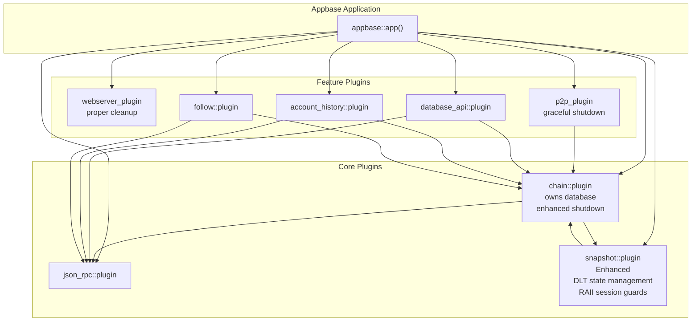
```mermaid
graph TB
subgraph "Appbase Application"
APP["appbase::app()"]
end
subgraph "Core Plugins"
CHAIN["chain::plugin<br/>owns database<br/>enhanced shutdown"]
JSONRPC["json_rpc::plugin"]
SNAPSHOT["snapshot::plugin<br/>Enhanced<br/>DLT state management<br/>RAII session guards"]
end
subgraph "Feature Plugins"
WS["webserver_plugin<br/>proper cleanup"]
P2P["p2p_plugin<br/>graceful shutdown"]
DBAPI["database_api::plugin"]
AH["account_history::plugin"]
FOLLOW["follow::plugin"]
end
APP --> CHAIN
APP --> JSONRPC
APP --> SNAPSHOT
APP --> WS
APP --> P2P
APP --> DBAPI
APP --> AH
APP --> FOLLOW
CHAIN --> JSONRPC
CHAIN --> SNAPSHOT
P2P --> CHAIN
DBAPI --> CHAIN
DBAPI --> JSONRPC
AH --> CHAIN
AH --> JSONRPC
FOLLOW --> CHAIN
FOLLOW --> JSONRPC
SNAPSHOT --> CHAIN
```

**Diagram sources**
- [main.cpp:62-90](file://programs/vizd/main.cpp#L62-L90)
- [plugin.hpp:21-96](file://plugins/chain/include/graphene/plugins/chain/plugin.hpp#L21-L96)
- [webserver_plugin.cpp:329-331](file://plugins/webserver/webserver_plugin.cpp#L329-L331)
- [p2p_plugin.cpp:568-573](file://plugins/p2p/p2p_plugin.cpp#L568-L573)
- [plugin.hpp:179-191](file://plugins/database_api/include/graphene/plugins/database_api/plugin.hpp#L179-L191)
- [plugin.hpp:59-65](file://plugins/account_history/include/graphene/plugins/account_history/plugin.hpp#L59-L65)
- [plugin.hpp:23-31](file://plugins/follow/include/graphene/plugins/follow/plugin.hpp#L23-L31)
- [snapshot_plugin.hpp:42-76](file://plugins/snapshot/include/graphene/plugins/snapshot/plugin.hpp#L42-L76)

## Detailed Component Analysis

### Plugin Registration and Lifecycle
- Registration: The application registers each plugin via appbase::app().register_plugin<Plugin>().
- Initialization: plugin_initialize parses options and prepares internal state.
- Startup: plugin_startup opens databases, subscribes to signals, and exposes APIs.
- Shutdown: plugin_shutdown closes resources and tears down state with proper cleanup.

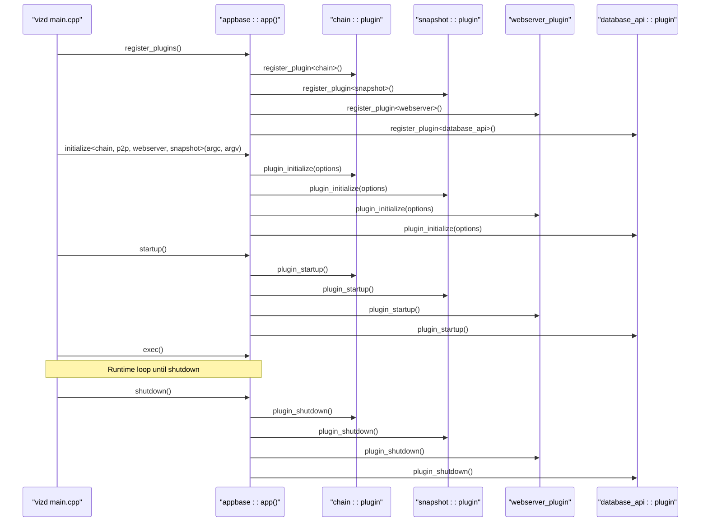
```mermaid
sequenceDiagram
participant Main as "vizd main.cpp"
participant App as "appbase : : app()"
participant Chain as "chain : : plugin"
participant Snapshot as "snapshot : : plugin"
participant WS as "webserver_plugin"
participant DB as "database_api : : plugin"
Main->>App : register_plugins()
App->>Chain : register_plugin<chain>()
App->>Snapshot : register_plugin<snapshot>()
App->>WS : register_plugin<webserver>()
App->>DB : register_plugin<database_api>()
Main->>App : initialize<chain, p2p, webserver, snapshot>(argc, argv)
App->>Chain : plugin_initialize(options)
App->>Snapshot : plugin_initialize(options)
App->>WS : plugin_initialize(options)
App->>DB : plugin_initialize(options)
Main->>App : startup()
App->>Chain : plugin_startup()
App->>Snapshot : plugin_startup()
App->>WS : plugin_startup()
App->>DB : plugin_startup()
Main->>App : exec()
Note over Main,App : Runtime loop until shutdown
Main->>App : shutdown()
App->>Chain : plugin_shutdown()
App->>Snapshot : plugin_shutdown()
App->>WS : plugin_shutdown()
App->>DB : plugin_shutdown()
```

**Diagram sources**
- [main.cpp:62-90](file://programs/vizd/main.cpp#L62-L90)
- [main.cpp:117-140](file://programs/vizd/main.cpp#L117-L140)
- [plugin.cpp:392-396](file://plugins/chain/plugin.cpp#L392-L396)
- [webserver_plugin.cpp:329-331](file://plugins/webserver/webserver_plugin.cpp#L329-L331)
- [plugin.cpp:392-396](file://plugins/chain/plugin.cpp#L392-L396)
- [snapshot_plugin.cpp:1956-1959](file://plugins/snapshot/plugin.cpp#L1956-L1959)

**Section sources**
- [main.cpp:62-90](file://programs/vizd/main.cpp#L62-L90)
- [main.cpp:117-140](file://programs/vizd/main.cpp#L117-L140)
- [plugin.cpp:392-396](file://plugins/chain/plugin.cpp#L392-L396)
- [snapshot_plugin.cpp:1956-1959](file://plugins/snapshot/plugin.cpp#L1956-L1959)

### Chain Plugin: Database Access and Signals
- Database access: Provides db() getters and convenience helpers for indices and objects.
- Block/transaction acceptance: Validates and applies blocks/transactions via the underlying database.
- Synchronization signal: Emits on_sync to notify other plugins when the chain is ready.
- Enhanced shutdown: Properly closes database connections during plugin_shutdown.
- **Snapshot integration**: Provides specialized callbacks for snapshot loading, creation, and P2P synchronization.

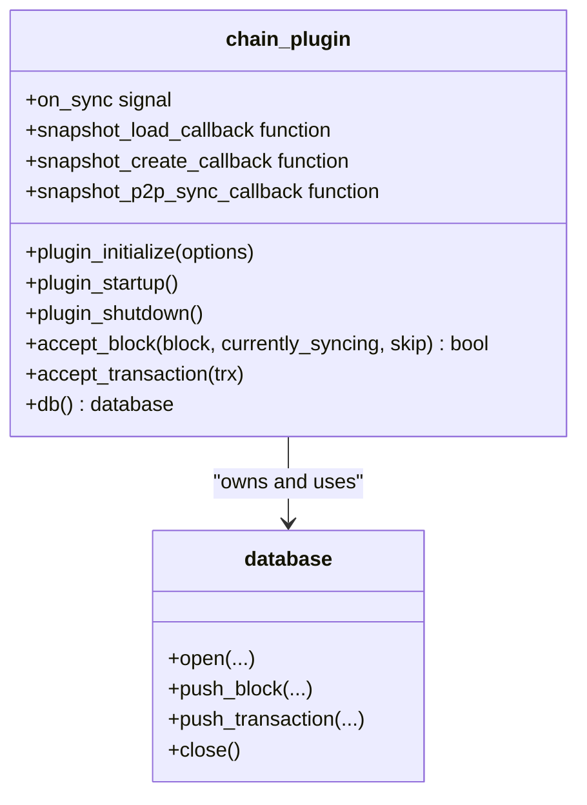
```mermaid
classDiagram
class chain_plugin {
+plugin_initialize(options)
+plugin_startup()
+plugin_shutdown()
+accept_block(block, currently_syncing, skip) bool
+accept_transaction(trx)
+db() database
+on_sync signal
+snapshot_load_callback function
+snapshot_create_callback function
+snapshot_p2p_sync_callback function
}
class database {
+open(...)
+push_block(...)
+push_transaction(...)
+close()
}
chain_plugin --> database : "owns and uses"
```

**Diagram sources**
- [plugin.hpp:21-96](file://plugins/chain/include/graphene/plugins/chain/plugin.hpp#L21-L96)
- [plugin.cpp:392-396](file://plugins/chain/plugin.cpp#L392-L396)

**Section sources**
- [plugin.hpp:21-96](file://plugins/chain/include/graphene/plugins/chain/plugin.hpp#L21-L96)
- [plugin.cpp:392-396](file://plugins/chain/plugin.cpp#L392-L396)

### Inter-Plugin Communication: Observer Pattern with Boost.Signals2
- Chain plugin emits on_sync when synchronized.
- Other plugins subscribe during startup to coordinate behavior after chain readiness.
- Example: database_api and account_history rely on chain readiness for state queries.
- **Snapshot plugin**: Integrates through specialized callbacks rather than signals for state management operations.

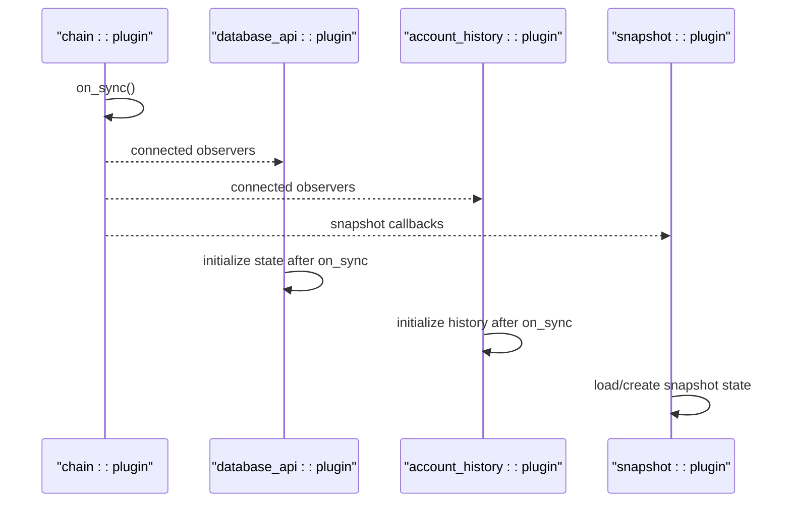
```mermaid
sequenceDiagram
participant Chain as "chain : : plugin"
participant DB as "database_api : : plugin"
participant AH as "account_history : : plugin"
participant Snapshot as "snapshot : : plugin"
Chain->>Chain : on_sync()
Chain-->>DB : connected observers
Chain-->>AH : connected observers
Chain-->>Snapshot : snapshot callbacks
DB->>DB : initialize state after on_sync
AH->>AH : initialize history after on_sync
Snapshot->>Snapshot : load/create snapshot state
```

**Diagram sources**
- [plugin.hpp:90-90](file://plugins/chain/include/graphene/plugins/chain/plugin.hpp#L90-L90)
- [plugin.hpp:195-199](file://plugins/database_api/include/graphene/plugins/database_api/plugin.hpp#L195-L199)
- [plugin.hpp:76-77](file://plugins/account_history/include/graphene/plugins/account_history/plugin.hpp#L76-L77)
- [snapshot_plugin.hpp:92-105](file://plugins/snapshot/include/graphene/plugins/snapshot/plugin.hpp#L92-L105)

**Section sources**
- [plugin.hpp:90-90](file://plugins/chain/include/graphene/plugins/chain/plugin.hpp#L90-L90)
- [plugin.hpp:195-199](file://plugins/database_api/include/graphene/plugins/database_api/plugin.hpp#L195-L199)
- [plugin.hpp:76-77](file://plugins/account_history/include/graphene/plugins/account_history/plugin.hpp#L76-L77)
- [snapshot_plugin.hpp:92-105](file://plugins/snapshot/include/graphene/plugins/snapshot/plugin.hpp#L92-L105)

### Plugin Template System: newplugin.py
- Generates boilerplate for a new plugin including:
  - CMakeLists.txt for library definition and linking
  - Plugin header with appbase::plugin base class and lifecycle methods
  - Plugin implementation with API factory registration and event subscription
  - API header and implementation stubs
- The template demonstrates:
  - Declaring plugin dependencies via APPBASE_PLUGIN_REQUIRES
  - Registering an API factory during plugin startup
  - Subscribing to chain events (e.g., applied_block)

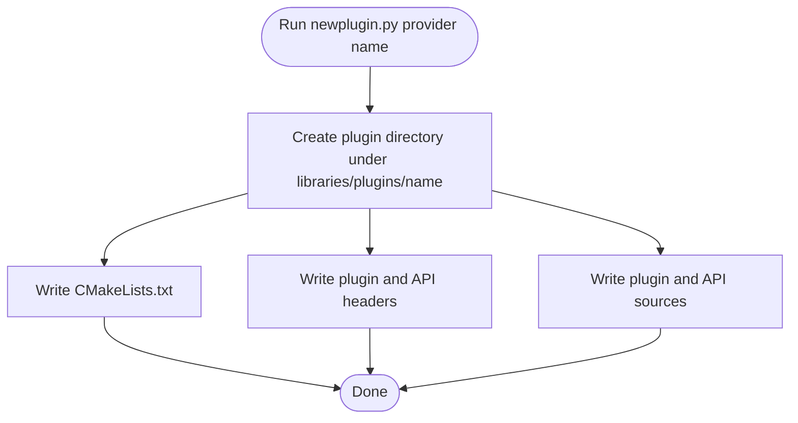
```mermaid
flowchart TD
Start(["Run newplugin.py provider name"]) --> CreateDirs["Create plugin directory under libraries/plugins/name"]
CreateDirs --> WriteCMake["Write CMakeLists.txt"]
CreateDirs --> WriteHeaders["Write plugin and API headers"]
CreateDirs --> WriteSources["Write plugin and API sources"]
WriteCMake --> Done(["Done"])
WriteHeaders --> Done
WriteSources --> Done
```

**Diagram sources**
- [newplugin.py:225-246](file://programs/util/newplugin.py#L225-L246)

**Section sources**
- [newplugin.py:1-251](file://programs/util/newplugin.py#L1-L251)

### Practical Plugin Development Workflow
- Use the template generator to scaffold a new plugin.
- Implement plugin lifecycle methods and register API factories.
- Declare dependencies using APPBASE_PLUGIN_REQUIRES.
- Subscribe to chain signals or database events as needed.
- Integrate the plugin into the application's registration and initialization steps.

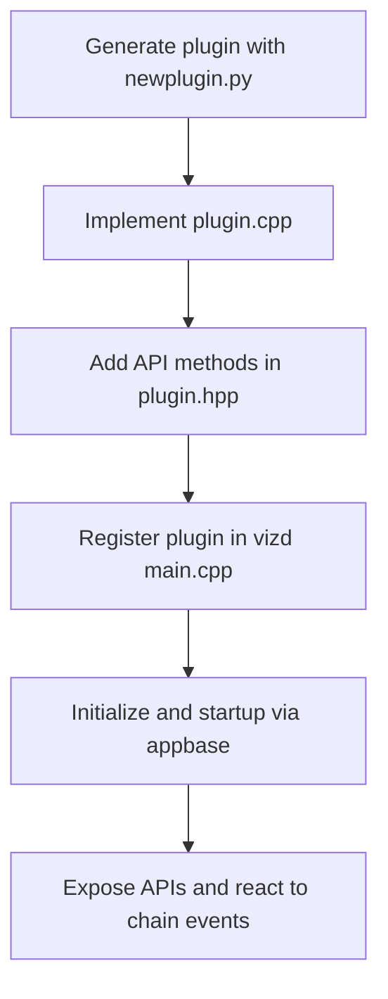
```mermaid
flowchart TD
A["Generate plugin with newplugin.py"] --> B["Implement plugin.cpp"]
B --> C["Add API methods in plugin.hpp"]
C --> D["Register plugin in vizd main.cpp"]
D --> E["Initialize and startup via appbase"]
E --> F["Expose APIs and react to chain events"]
```

**Diagram sources**
- [newplugin.py:225-246](file://programs/util/newplugin.py#L225-L246)
- [main.cpp:62-90](file://programs/vizd/main.cpp#L62-L90)
- [plugin.cpp:316-396](file://plugins/chain/plugin.cpp#L316-L396)

**Section sources**
- [newplugin.py:1-251](file://programs/util/newplugin.py#L1-L251)
- [main.cpp:62-90](file://programs/vizd/main.cpp#L62-L90)
- [plugin.cpp:316-396](file://plugins/chain/plugin.cpp#L316-L396)

## Enhanced Lifecycle Management

### Improved Shutdown Procedures
The enhanced plugin lifecycle management includes comprehensive shutdown procedures designed to prevent memory leaks and ensure proper resource cleanup:

- **Chain Plugin Shutdown**: The chain plugin implements proper database closure in plugin_shutdown(), ensuring all database connections are properly closed.
- **Webserver Plugin Cleanup**: The webserver plugin implements thorough cleanup of HTTP and WebSocket servers, thread pools, and connection handlers.
- **P2P Plugin Graceful Shutdown**: The P2P plugin ensures proper network node closure, connection termination, and thread cleanup.
- **Snapshot Plugin Shutdown**: The snapshot plugin properly stops TCP servers, cancels async operations, and cleans up file handles.

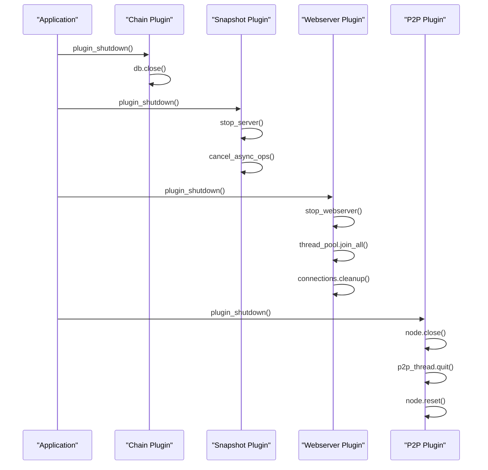
```mermaid
sequenceDiagram
participant App as "Application"
participant Chain as "Chain Plugin"
participant Snapshot as "Snapshot Plugin"
participant WS as "Webserver Plugin"
participant P2P as "P2P Plugin"
App->>Chain : plugin_shutdown()
Chain->>Chain : db.close()
App->>Snapshot : plugin_shutdown()
Snapshot->>Snapshot : stop_server()
Snapshot->>Snapshot : cancel_async_ops()
App->>WS : plugin_shutdown()
WS->>WS : stop_webserver()
WS->>WS : thread_pool.join_all()
WS->>WS : connections.cleanup()
App->>P2P : plugin_shutdown()
P2P->>P2P : node.close()
P2P->>P2P : p2p_thread.quit()
P2P->>P2P : node.reset()
```

**Diagram sources**
- [plugin.cpp:392-396](file://plugins/chain/plugin.cpp#L392-L396)
- [webserver_plugin.cpp:167-190](file://plugins/webserver/webserver_plugin.cpp#L167-L190)
- [p2p_plugin.cpp:568-573](file://plugins/p2p/p2p_plugin.cpp#L568-L573)
- [snapshot_plugin.cpp:1956-1959](file://plugins/snapshot/plugin.cpp#L1956-L1959)

**Section sources**
- [plugin.cpp:392-396](file://plugins/chain/plugin.cpp#L392-L396)
- [webserver_plugin.cpp:167-190](file://plugins/webserver/webserver_plugin.cpp#L167-L190)
- [p2p_plugin.cpp:568-573](file://plugins/p2p/p2p_plugin.cpp#L568-L573)
- [snapshot_plugin.cpp:1956-1959](file://plugins/snapshot/plugin.cpp#L1956-L1959)

### Signal Handler Coordination
The enhanced architecture includes sophisticated signal handler coordination mechanisms for graceful shutdown and resource cleanup:

- **Signal Guard Implementation**: The database layer implements a signal_guard class that manages signal handlers for SIGHUP, SIGINT, and SIGTERM.
- **Interrupt Detection**: Signal handlers set interrupt flags that can be checked during long-running operations like blockchain reindexing.
- **Graceful Termination**: Operations check for interruption signals and terminate gracefully when detected.

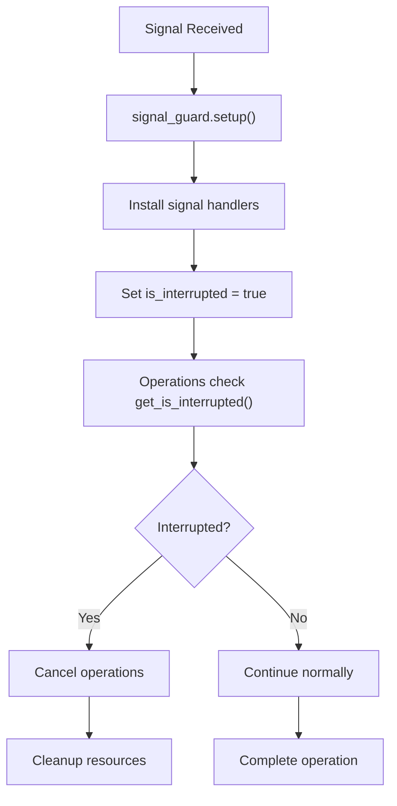
```mermaid
flowchart TD
A["Signal Received"] --> B["signal_guard.setup()"]
B --> C["Install signal handlers"]
C --> D["Set is_interrupted = true"]
D --> E["Operations check get_is_interrupted()"]
E --> F{"Interrupted?"}
F --> |Yes| G["Cancel operations"]
F --> |No| H["Continue normally"]
G --> I["Cleanup resources"]
H --> J["Complete operation"]
```

**Diagram sources**
- [database.cpp:134-180](file://libraries/chain/database.cpp#L134-L180)
- [database.cpp:270-329](file://libraries/chain/database.cpp#L270-L329)

**Section sources**
- [database.cpp:134-180](file://libraries/chain/database.cpp#L134-L180)
- [database.cpp:270-329](file://libraries/chain/database.cpp#L270-L329)

### Memory Leak Prevention
The enhanced lifecycle management includes several mechanisms to prevent memory leaks during plugin operations:

- **Connection Cleanup**: Webserver plugin properly cleans up WebSocket and HTTP connections, ensuring no lingering references.
- **Thread Pool Management**: Proper thread pool shutdown with join_all() prevents thread leaks.
- **Network Node Cleanup**: P2P plugin ensures complete network node shutdown with proper resource deallocation.
- **Scoped Connections**: Plugins use scoped_connection objects that automatically disconnect when going out of scope.
- **Snapshot Resource Management**: Snapshot plugin implements proper cleanup of TCP sockets, file handles, and async operations.

**Section sources**
- [webserver_plugin.cpp:167-190](file://plugins/webserver/webserver_plugin.cpp#L167-L190)
- [p2p_plugin.cpp:568-573](file://plugins/p2p/p2p_plugin.cpp#L568-L573)
- [plugin.cpp:392-396](file://plugins/chain/plugin.cpp#L392-L396)
- [snapshot_plugin.cpp:1427-1436](file://plugins/snapshot/plugin.cpp#L1427-L1436)

## Snapshot Plugin System

### Overview
The snapshot plugin provides comprehensive DLT (Distributed Ledger Technology) state management capabilities for VIZ blockchain nodes. It enables efficient state synchronization through automatic snapshot creation, loading from existing snapshots, and P2P synchronization between nodes using a custom TCP protocol. The enhanced version includes robust session management with RAII-based race condition prevention and sophisticated retry logic for reliable connection establishment.

### Key Features
- **Automatic Snapshot Creation**: Creates snapshots at specific block heights or periodically
- **State Loading**: Loads blockchain state from snapshot files instead of replaying blocks
- **P2P Synchronization**: Downloads snapshots from trusted peers for rapid node bootstrap
- **Custom TCP Protocol**: Implements a binary protocol for efficient snapshot distribution
- **Anti-Spam Protection**: Built-in rate limiting and connection management
- **Security Controls**: Trust model with optional trusted-only serving
- **Enhanced Session Management**: RAII-based session guards prevent race conditions
- **Robust Connection Handling**: Retry logic addresses timing issues in P2P communication

### Snapshot Formats and Storage
The snapshot plugin supports two file formats:
- **.vizjson**: Compressed JSON format with zlib compression
- **.json**: Plain JSON format for debugging and compatibility

Snapshots are stored with naming convention: `snapshot-block-{block_number}.{extension}`

**Section sources**
- [snapshot_plugin.hpp:42-76](file://plugins/snapshot/include/graphene/plugins/snapshot/plugin.hpp#L42-L76)
- [snapshot_types.hpp:16-43](file://plugins/snapshot/include/graphene/plugins/snapshot/snapshot_types.hpp#L16-L43)
- [snapshot-plugin.md:1-164](file://documentation/snapshot-plugin.md#L1-L164)

## Custom Network Protocol

### Protocol Design
The snapshot plugin implements a custom binary protocol over TCP for efficient state synchronization:

#### Wire Format
```
[4 bytes: payload_size][4 bytes: msg_type][payload_bytes]
```

#### Message Types
| Type | Name | Description |
|------|------|-------------|
| 1 | `SNAPSHOT_INFO_REQUEST` | Empty payload. "What's your latest snapshot?" |
| 2 | `SNAPSHOT_INFO_REPLY` | `{block_num, block_id, checksum, compressed_size}` |
| 3 | `SNAPSHOT_DATA_REQUEST` | `{block_num, offset, chunk_size}` |
| 4 | `SNAPSHOT_DATA_REPLY` | `{offset, data_bytes, is_last}` |
| 5 | `SNAPSHOT_NOT_AVAILABLE` | No snapshot available |

### Protocol Flow
1. **Info Request**: Client sends `SNAPSHOT_INFO_REQUEST`
2. **Info Reply**: Server responds with snapshot metadata
3. **Data Requests**: Client requests snapshot in chunks
4. **Data Replies**: Server streams snapshot data
5. **Verification**: Client verifies checksum before accepting

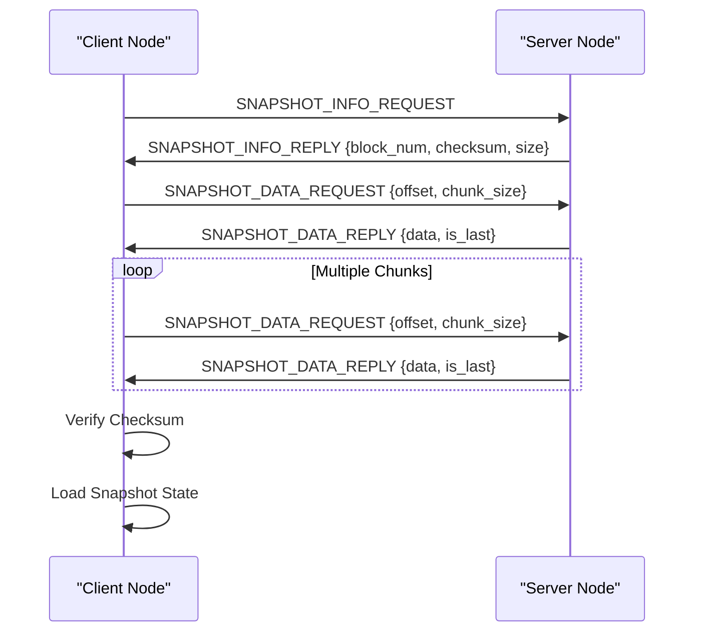
```mermaid
sequenceDiagram
participant Client as "Client Node"
participant Server as "Server Node"
Client->>Server : SNAPSHOT_INFO_REQUEST
Server->>Client : SNAPSHOT_INFO_REPLY {block_num, checksum, size}
Client->>Server : SNAPSHOT_DATA_REQUEST {offset, chunk_size}
Server->>Client : SNAPSHOT_DATA_REPLY {data, is_last}
loop Multiple Chunks
Client->>Server : SNAPSHOT_DATA_REQUEST {offset, chunk_size}
Server->>Client : SNAPSHOT_DATA_REPLY {data, is_last}
end
Client->>Client : Verify Checksum
Client->>Client : Load Snapshot State
```

**Diagram sources**
- [snapshot_plugin.cpp:1249-1317](file://plugins/snapshot/plugin.cpp#L1249-L1317)
- [snapshot_plugin.cpp:1546-1617](file://plugins/snapshot/plugin.cpp#L1546-L1617)

**Section sources**
- [snapshot_plugin.cpp:1249-1317](file://plugins/snapshot/plugin.cpp#L1249-L1317)
- [snapshot_plugin.cpp:1546-1617](file://plugins/snapshot/plugin.cpp#L1546-L1617)
- [snapshot-plugin.md:104-120](file://documentation/snapshot-plugin.md#L104-L120)

## Anti-Spam Protection

### Connection Management
The snapshot TCP server implements comprehensive anti-spam protection:

#### Active Session Control
- **Single Active Session Per IP**: Prevents multiple concurrent downloads from the same IP
- **Connection Tracking**: Monitors active connections to enforce limits

#### Rate Limiting
- **3 Connections Per Hour Per IP**: Prevents abuse through repeated connection attempts
- **Time Window Management**: Automatic cleanup of expired connection records
- **Dynamic Rate Adjustment**: Prevents unbounded memory growth in connection history

#### Security Enforcement
- **Trusted Peer Bypass**: Anti-spam rules apply equally to all connections
- **Trust Model**: Separate from anti-spam enforcement for fairness
- **Connection Timeout**: 60-second timeout for idle connections

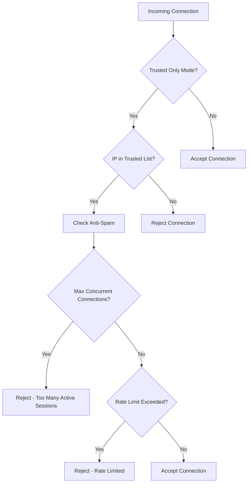
```mermaid
flowchart TD
A["Incoming Connection"] --> B{"Trusted Only Mode?"}
B --> |Yes| C{"IP in Trusted List?"}
B --> |No| D["Accept Connection"]
C --> |Yes| E["Check Anti-Spam"]
C --> |No| F["Reject Connection"]
E --> G{"Max Concurrent Connections?"}
G --> |Yes| H["Reject - Too Many Active Sessions"]
G --> |No| I{"Rate Limit Exceeded?"}
I --> |Yes| J["Reject - Rate Limited"]
I --> |No| K["Accept Connection"]
```

**Diagram sources**
- [snapshot_plugin.cpp:1438-1544](file://plugins/snapshot/plugin.cpp#L1438-L1544)

**Section sources**
- [snapshot_plugin.cpp:1438-1544](file://plugins/snapshot/plugin.cpp#L1438-L1544)
- [snapshot-plugin.md:96-103](file://documentation/snapshot-plugin.md#L96-L103)

## Session Guard Implementation

### RAII Session Guard Design
The snapshot plugin implements a sophisticated RAII session guard to prevent race conditions in connection handling:

#### Session Guard Class
The `session_guard` class provides automatic cleanup of active session records:

```cpp
struct session_guard {
    snapshot_plugin::plugin_impl& self;
    uint32_t ip;
    bool released = false;
    session_guard(snapshot_plugin::plugin_impl& s, uint32_t i) : self(s), ip(i) {}
    ~session_guard() { release(); }
    void release() {
        if (!released) {
            released = true;
            fc::scoped_lock<fc::mutex> lock(self.sessions_mutex);
            self.active_sessions.erase(ip);
        }
    }
} guard(*this, remote_ip);
```

#### Race Condition Prevention
- **Eager Cleanup**: Session is removed from `active_sessions` immediately when the guard goes out of scope
- **Prevents Duplicate Connections**: Ensures no race condition where a client reconnects before async fiber cleanup
- **Thread Safety**: Uses mutex protection for session management operations

#### Integration with Connection Handling
The session guard is integrated into the `handle_connection` method:

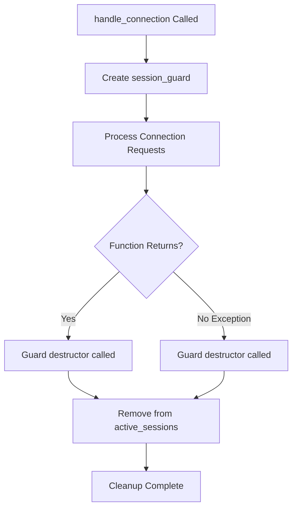
```mermaid
flowchart TD
A["handle_connection Called"] --> B["Create session_guard"]
B --> C["Process Connection Requests"]
C --> D{"Function Returns?"}
D --> |Yes| E["Guard destructor called"]
E --> F["Remove from active_sessions"]
F --> G["Cleanup Complete"]
D --> |No Exception| H["Guard destructor called"]
H --> F
```

**Diagram sources**
- [snapshot_plugin.cpp:1800-1820](file://plugins/snapshot/plugin.cpp#L1800-L1820)
- [snapshot_plugin.cpp:1780-1788](file://plugins/snapshot/plugin.cpp#L1780-L1788)

**Section sources**
- [snapshot_plugin.cpp:1800-1820](file://plugins/snapshot/plugin.cpp#L1800-L1820)
- [snapshot_plugin.cpp:1780-1788](file://plugins/snapshot/plugin.cpp#L1780-L1788)

## Enhanced Retry Logic

### Client-Side Connection Retry Mechanism
The snapshot plugin implements sophisticated retry logic to address race conditions in P2P communication:

#### Retry Strategy
- **Maximum 3 Retries**: Limits retry attempts to prevent infinite loops
- **2-Second Delays**: Allows time for server-side session cleanup
- **Exponential Backoff**: Gradual retry delays improve success probability
- **Resource Cleanup**: Proper cleanup between retry attempts

#### Retry Implementation
The retry logic addresses timing issues where server-side cleanup may not complete:

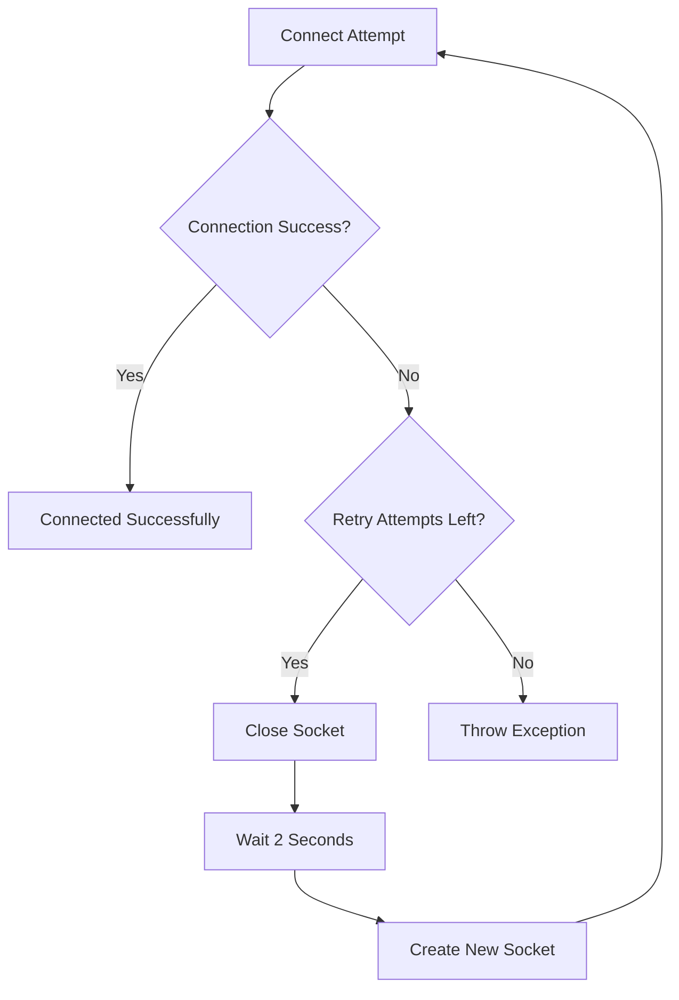
```mermaid
flowchart TD
A["Connect Attempt"] --> B{"Connection Success?"}
B --> |Yes| C["Connected Successfully"]
B --> |No| D{"Retry Attempts Left?"}
D --> |Yes| E["Close Socket"]
E --> F["Wait 2 Seconds"]
F --> G["Create New Socket"]
G --> A
D --> |No| H["Throw Exception"]
```

#### Specific Use Cases
- **Phase 1 to Phase 2 Transition**: Brief delay allows server to clean up Phase 1 session
- **Anti-Spam Duplicate Session Check**: Addresses timing window where duplicate session detection triggers
- **Async Fiber Cleanup**: Allows time for background fiber to complete cleanup operations

**Diagram sources**
- [snapshot_plugin.cpp:2047-2064](file://plugins/snapshot/plugin.cpp#L2047-L2064)
- [snapshot_plugin.cpp:2036-2039](file://plugins/snapshot/plugin.cpp#L2036-L2039)

**Section sources**
- [snapshot_plugin.cpp:2047-2064](file://plugins/snapshot/plugin.cpp#L2047-L2064)
- [snapshot_plugin.cpp:2036-2039](file://plugins/snapshot/plugin.cpp#L2036-L2039)

## Race Condition Prevention

### Comprehensive Race Condition Mitigation
The enhanced snapshot plugin addresses multiple race conditions through layered protection mechanisms:

#### Connection Race Conditions
- **Duplicate Session Prevention**: Session guard ensures no overlap between connection attempts
- **Anti-Spam Race**: Mutex-protected session tracking prevents concurrent access issues
- **Cleanup Timing**: Proper sequencing of cleanup operations prevents timing gaps

#### Session Management Race Conditions
- **Active Session Tracking**: Thread-safe tracking prevents concurrent modifications
- **Connection Count Synchronization**: Atomic operations ensure accurate connection counts
- **Resource Deallocation**: Proper cleanup order prevents dangling references

#### P2P Communication Race Conditions
- **Phase Transition Delays**: Controlled timing prevents race between phases
- **Retry Logic Coordination**: Synchronized retry attempts with server cleanup
- **Timeout Management**: Coordinated timeouts prevent deadlocks

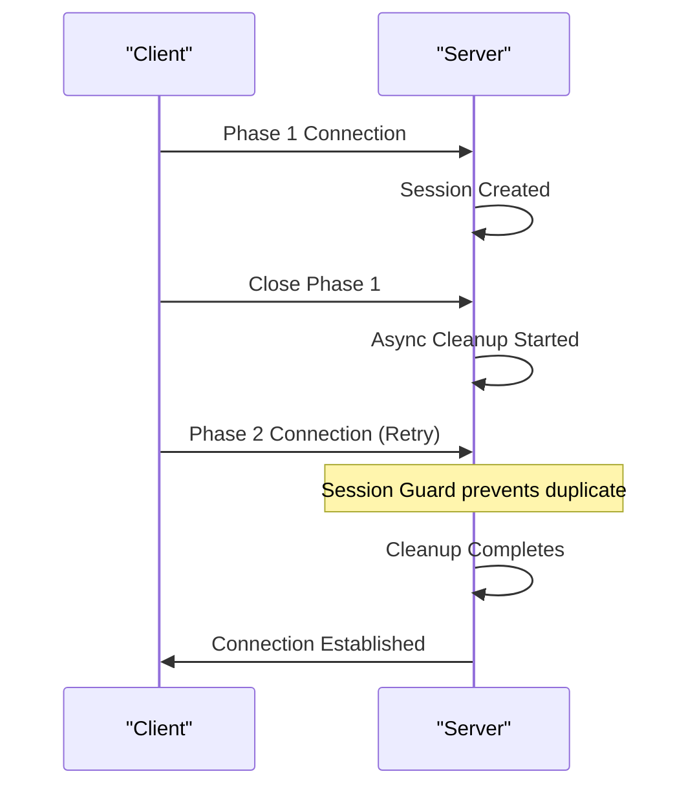
```mermaid
sequenceDiagram
participant Client as "Client"
participant Server as "Server"
Client->>Server : Phase 1 Connection
Server->>Server : Session Created
Client->>Server : Close Phase 1
Server->>Server : Async Cleanup Started
Client->>Server : Phase 2 Connection (Retry)
Note over Server : Session Guard prevents duplicate
Server->>Server : Cleanup Completes
Server->>Client : Connection Established
```

**Diagram sources**
- [snapshot_plugin.cpp:1720-1761](file://plugins/snapshot/plugin.cpp#L1720-L1761)
- [snapshot_plugin.cpp:1804-1820](file://plugins/snapshot/plugin.cpp#L1804-L1820)

**Section sources**
- [snapshot_plugin.cpp:1720-1761](file://plugins/snapshot/plugin.cpp#L1720-L1761)
- [snapshot_plugin.cpp:1804-1820](file://plugins/snapshot/plugin.cpp#L1804-L1820)

## Integration with Chain Plugin

### Callback System
The snapshot plugin integrates with the chain plugin through a sophisticated callback system that coordinates state management during node startup:

#### Available Callbacks
1. **snapshot_load_callback**: Loads state from snapshot file
2. **snapshot_create_callback**: Creates snapshot after full database load
3. **snapshot_p2p_sync_callback**: Downloads and loads snapshot from trusted peers

#### Execution Timing
- **snapshot_load_callback**: Executed BEFORE `on_sync()` fires
- **snapshot_create_callback**: Executed AFTER full DB load, BEFORE `on_sync()`
- **snapshot_p2p_sync_callback**: Executed when state is empty, BEFORE `on_sync()`

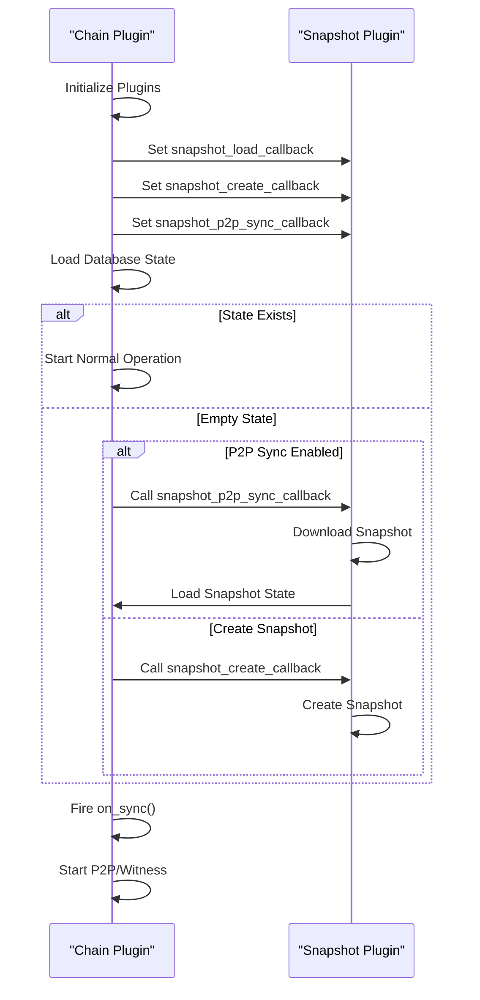
```mermaid
sequenceDiagram
participant Chain as "Chain Plugin"
participant Snapshot as "Snapshot Plugin"
Chain->>Chain : Initialize Plugins
Chain->>Snapshot : Set snapshot_load_callback
Chain->>Snapshot : Set snapshot_create_callback
Chain->>Snapshot : Set snapshot_p2p_sync_callback
Chain->>Chain : Load Database State
alt State Exists
Chain->>Chain : Start Normal Operation
else Empty State
alt P2P Sync Enabled
Chain->>Snapshot : Call snapshot_p2p_sync_callback
Snapshot->>Snapshot : Download Snapshot
Snapshot->>Chain : Load Snapshot State
else Create Snapshot
Chain->>Snapshot : Call snapshot_create_callback
Snapshot->>Snapshot : Create Snapshot
end
end
Chain->>Chain : Fire on_sync()
Chain->>Chain : Start P2P/Witness
```

**Diagram sources**
- [snapshot_plugin.cpp:1872-1919](file://plugins/snapshot/plugin.cpp#L1872-L1919)
- [snapshot_plugin.hpp:92-105](file://plugins/snapshot/include/graphene/plugins/snapshot/plugin.hpp#L92-L105)

**Section sources**
- [snapshot_plugin.cpp:1872-1919](file://plugins/snapshot/plugin.cpp#L1872-L1919)
- [snapshot_plugin.hpp:92-105](file://plugins/snapshot/include/graphene/plugins/snapshot/plugin.hpp#L92-L105)

### Configuration Options
The snapshot plugin provides extensive configuration options for different deployment scenarios:

#### Basic Configuration
- `snapshot-at-block`: Create snapshot at specific block number
- `snapshot-every-n-blocks`: Automatic periodic snapshots
- `snapshot-dir`: Directory for auto-generated snapshots
- `snapshot-max-age-days`: Age-based snapshot cleanup

#### P2P Synchronization
- `allow-snapshot-serving`: Enable TCP snapshot serving
- `allow-snapshot-serving-only-trusted`: Restrict to trusted peers
- `snapshot-serve-endpoint`: TCP listen endpoint
- `trusted-snapshot-peer`: Trusted peer endpoints (repeatable)

#### CLI Options
- `--snapshot <path>`: Load state from snapshot file
- `--create-snapshot <path>`: Create snapshot and exit
- `--sync-snapshot-from-trusted-peer true`: Download snapshot on empty state

**Section sources**
- [snapshot_plugin.cpp:1767-1797](file://plugins/snapshot/plugin.cpp#L1767-L1797)
- [snapshot-plugin.md:142-164](file://documentation/snapshot-plugin.md#L142-L164)

## Dependency Analysis
- Plugin discovery: The plugins/CMakeLists.txt iterates subdirectories and adds those with a CMakeLists.txt, enabling automatic inclusion of internal plugins.
- Plugin dependencies:
  - chain::plugin is required by p2p, database_api, account_history, follow, and **snapshot**.
  - json_rpc::plugin is required by webserver, database_api, and follow.
  - account_history additionally requires operation_history internally.
  - **snapshot::plugin requires chain::plugin for database access**.

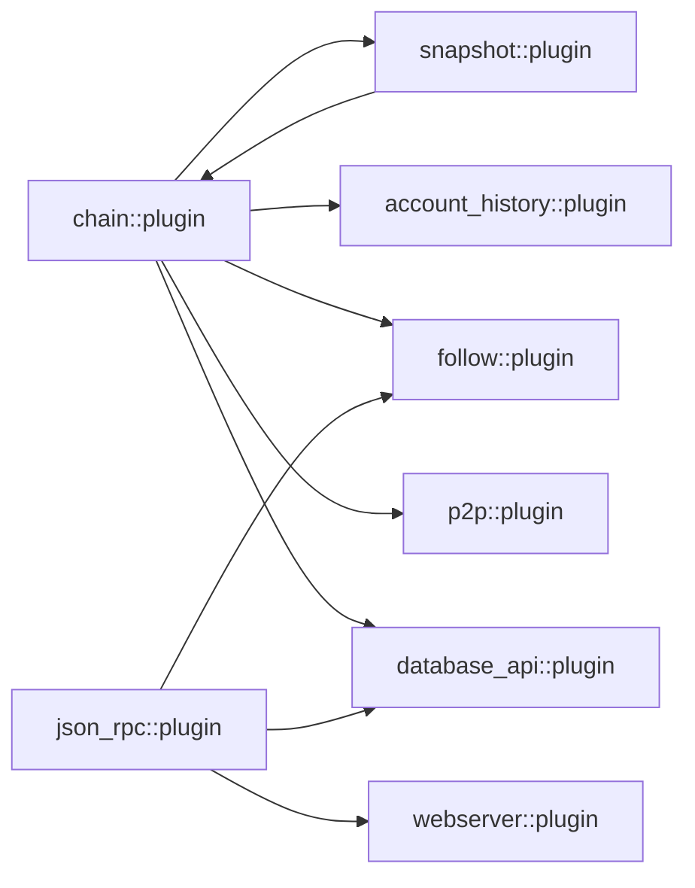
```mermaid
graph LR
CHAIN["chain::plugin"] --> P2P["p2p::plugin"]
CHAIN --> DBAPI["database_api::plugin"]
CHAIN --> AH["account_history::plugin"]
CHAIN --> FOLLOW["follow::plugin"]
CHAIN --> SNAPSHOT["snapshot::plugin"]
JSONRPC["json_rpc::plugin"] --> WS["webserver::plugin"]
JSONRPC --> DBAPI
JSONRPC --> FOLLOW
SNAPSHOT --> CHAIN
```

**Diagram sources**
- [p2p_plugin.cpp:531-566](file://plugins/p2p/p2p_plugin.cpp#L531-L566)
- [plugin.hpp:188-191](file://plugins/database_api/include/graphene/plugins/database_api/plugin.hpp#L188-L191)
- [plugin.hpp:28-31](file://plugins/follow/include/graphene/plugins/follow/plugin.hpp#L28-L31)
- [webserver_plugin.cpp:314-327](file://plugins/webserver/webserver_plugin.cpp#L314-L327)
- [snapshot_plugin.hpp](file://plugins/snapshot/include/graphene/plugins/snapshot/plugin.hpp#L44)

**Section sources**
- [CMakeLists.txt:1-12](file://plugins/CMakeLists.txt#L1-L12)
- [p2p_plugin.cpp:531-566](file://plugins/p2p/p2p_plugin.cpp#L531-L566)
- [plugin.hpp:188-191](file://plugins/database_api/include/graphene/plugins/database_api/plugin.hpp#L188-L191)
- [plugin.hpp:28-31](file://plugins/follow/include/graphene/plugins/follow/plugin.hpp#L28-L31)
- [webserver_plugin.cpp:314-327](file://plugins/webserver/webserver_plugin.cpp#L314-L327)
- [snapshot_plugin.hpp](file://plugins/snapshot/include/graphene/plugins/snapshot/plugin.hpp#L44)

## Performance Considerations
- Single write thread: The chain plugin supports a single-write-thread mode to serialize block/transaction application, which can simplify locking but may reduce throughput.
- Shared memory sizing: Configurable shared memory size and increments help manage storage growth during replay or sync.
- Skipping virtual operations: Option to skip virtual operations reduces memory overhead for plugins not requiring them.
- Flush intervals: Periodic flushing of state to disk can be tuned for durability vs. performance trade-offs.
- **Snapshot compression**: Zlib compression reduces snapshot file sizes by 50-70% compared to uncompressed JSON.
- **Chunked transfers**: 1MB chunk size balances memory usage and network efficiency.
- **Connection limits**: Maximum 5 concurrent connections prevents resource exhaustion.
- **Anti-spam controls**: Prevents abuse while maintaining reasonable throughput.
- **Session guard overhead**: Minimal performance impact with significant race condition prevention benefits.
- **Retry logic efficiency**: Controlled retries with exponential backoff optimize connection success rates.

**Section sources**
- [plugin.cpp:281-346](file://plugins/chain/plugin.cpp#L281-L346)
- [plugin.cpp:300-304](file://plugins/chain/plugin.cpp#L300-L304)
- [snapshot_plugin.cpp:1694-1700](file://plugins/snapshot/plugin.cpp#L1694-L1700)
- [snapshot-plugin.md:96-103](file://documentation/snapshot-plugin.md#L96-L103)

## Troubleshooting Guide
- Database errors on startup: The chain plugin catches database revision and block log exceptions, optionally triggering a replay or wipe and resync path.
- Logging configuration: The application loads logging configuration from the config file and applies appenders/loggers accordingly.
- Graceful shutdown: Plugins should release connections and close databases in plugin_shutdown with proper cleanup procedures.
- Signal handling: The enhanced signal handling system provides better control over shutdown procedures and resource cleanup.
- **Snapshot issues**: 
  - Verify snapshot file integrity using checksum verification
  - Check snapshot directory permissions for read/write access
  - Monitor TCP server logs for connection errors
  - Validate trusted peer configurations for P2P sync
  - **Check session guard logs for race condition prevention**
  - **Monitor retry attempts for connection establishment issues**
- **Performance issues**:
  - Monitor snapshot creation time and adjust chunk sizes
  - Check network bandwidth for P2P synchronization
  - Verify anti-spam configuration isn't blocking legitimate connections
  - **Review session guard effectiveness in preventing race conditions**

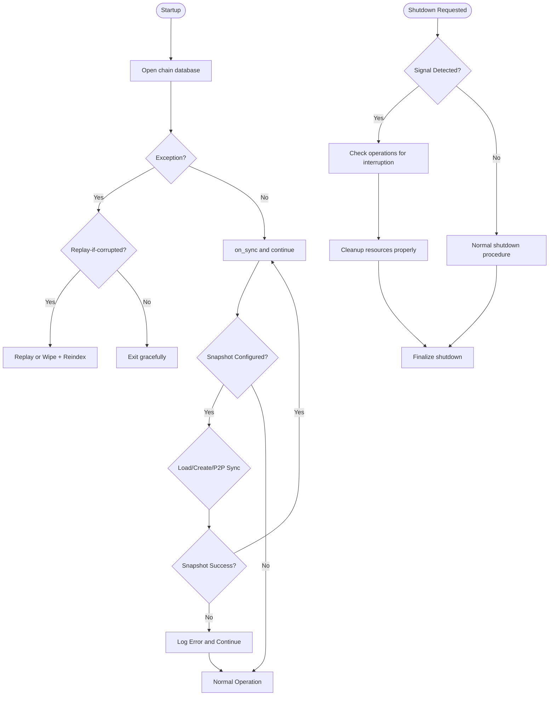
```mermaid
flowchart TD
Start(["Startup"]) --> OpenDB["Open chain database"]
OpenDB --> DBErr{"Exception?"}
DBErr --> |Yes| ReplayOpt{"Replay-if-corrupted?"}
ReplayOpt --> |Yes| Replay["Replay or Wipe + Reindex"]
ReplayOpt --> |No| Quit["Exit gracefully"]
DBErr --> |No| Ready["on_sync and continue"]
Ready --> SnapshotCheck{"Snapshot Configured?"}
SnapshotCheck --> |Yes| SnapshotOp{"Load/Create/P2P Sync"}
SnapshotCheck --> |No| Normal["Normal Operation"]
SnapshotOp --> SnapshotOK{"Snapshot Success?"}
SnapshotOK --> |Yes| Ready
SnapshotOK --> |No| Error["Log Error and Continue"]
Error --> Normal
Shutdown(["Shutdown Requested"]) --> SignalCheck{"Signal Detected?"}
SignalCheck --> |Yes| InterruptOps["Check operations for interruption"]
InterruptOps --> Cleanup["Cleanup resources properly"]
SignalCheck --> |No| NormalShutdown["Normal shutdown procedure"]
Cleanup --> Finalize["Finalize shutdown"]
NormalShutdown --> Finalize
```

**Diagram sources**
- [plugin.cpp:348-386](file://plugins/chain/plugin.cpp#L348-L386)
- [database.cpp:270-329](file://libraries/chain/database.cpp#L270-L329)
- [snapshot_plugin.cpp:1872-1919](file://plugins/snapshot/plugin.cpp#L1872-L1919)

**Section sources**
- [plugin.cpp:348-386](file://plugins/chain/plugin.cpp#L348-L386)
- [main.cpp:131-137](file://programs/vizd/main.cpp#L131-L137)
- [database.cpp:270-329](file://libraries/chain/database.cpp#L270-L329)
- [snapshot_plugin.cpp:1872-1919](file://plugins/snapshot/plugin.cpp#L1872-L1919)

## Conclusion
The enhanced plugin architecture leverages appbase to provide a clean separation of concerns with improved lifecycle management, enabling flexible feature addition and removal. Plugins declare dependencies, participate in a standardized lifecycle with proper shutdown procedures, and communicate via signals and API factories. The enhanced shutdown mechanisms, signal handler coordination, and memory leak prevention ensure robust, maintainable extensions to the node.

**The new snapshot plugin system significantly enhances the architecture by providing:**
- Efficient DLT state management through automatic snapshot creation and loading
- Custom TCP protocol for optimized P2P synchronization
- Comprehensive anti-spam protection and security controls
- Seamless integration with the chain plugin through specialized callbacks
- **Robust session management with RAII-based race condition prevention**
- **Sophisticated retry logic addressing P2P communication timing issues**
- **Layered protection mechanisms preventing various race conditions**

The template generator accelerates development while the chain plugin centralizes database access and synchronization events with proper resource cleanup. The enhanced snapshot plugin exemplifies best practices for extending node functionality with specialized protocols, robust error handling, comprehensive configuration options, and sophisticated concurrency control mechanisms.

## Appendices
- Best practices for extending node functionality:
  - Use APPBASE_PLUGIN_REQUIRES to declare explicit dependencies.
  - Register API factories in plugin_startup and expose only necessary methods.
  - Subscribe to chain signals (e.g., on_sync) to coordinate with other plugins.
  - Implement proper plugin_shutdown methods for resource cleanup.
  - Use scoped_connection objects for automatic disconnection.
  - Handle signals appropriately using the signal_guard mechanism.
  - Keep plugin responsibilities narrow and focused on specific domains.
  - Use configuration options to tune performance and behavior.
  - Ensure graceful shutdown procedures for all long-running operations.
  - **For network plugins**: Implement proper connection management, anti-abuse controls, and race condition prevention.
  - **For state management plugins**: Provide validation and recovery mechanisms with proper cleanup procedures.
  - **For protocol plugins**: Design efficient wire formats, implement proper error handling, and consider concurrency implications.
  - **For plugins with shared resources**: Implement RAII-based resource management to prevent race conditions.
  - **For client-side plugins**: Implement retry logic with proper backoff strategies for reliable operation.