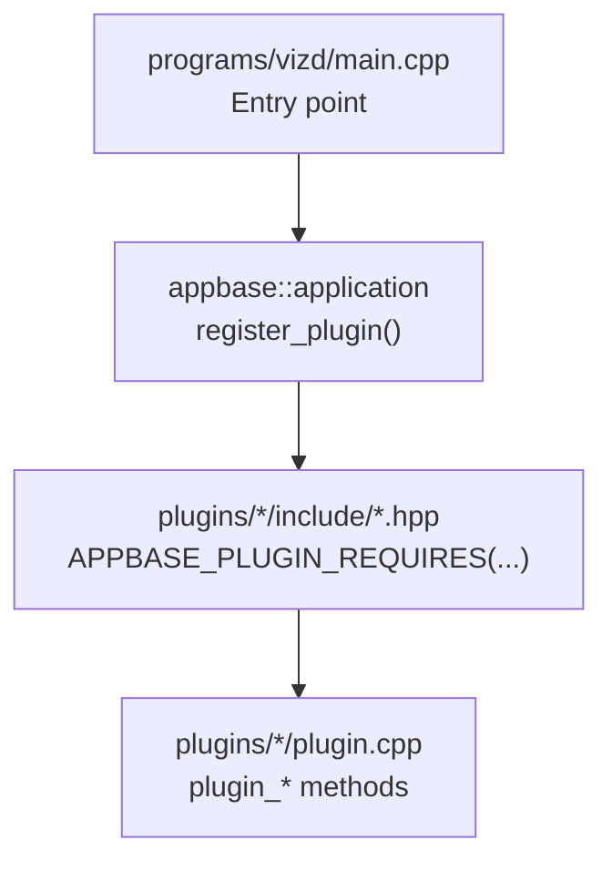
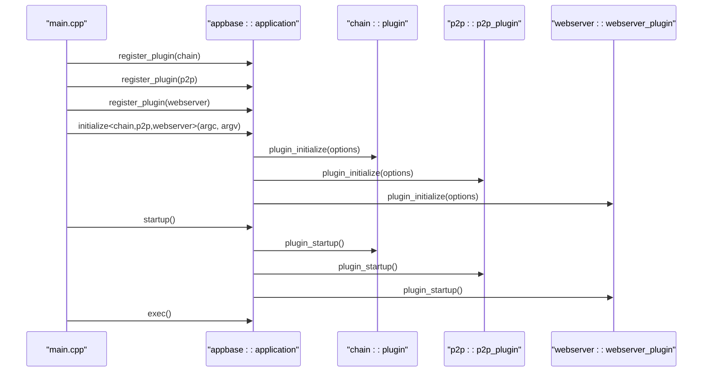
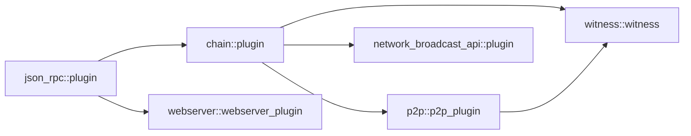

# Plugin Lifecycle and Registration

<cite>
**Referenced Files in This Document**
- [main.cpp](file://programs/vizd/main.cpp)
- [plugin.hpp](file://plugins/chain/include/graphene/plugins/chain/plugin.hpp)
- [plugin.cpp](file://plugins/chain/plugin.cpp)
- [p2p_plugin.hpp](file://plugins/p2p/include/graphene/plugins/p2p/p2p_plugin.hpp)
- [webserver_plugin.hpp](file://plugins/webserver/include/graphene/plugins/webserver/webserver_plugin.hpp)
- [plugin.md](file://documentation/plugin.md)
</cite>

## Table of Contents
1. [Introduction](#introduction)
2. [Project Structure](#project-structure)
3. [Core Components](#core-components)
4. [Architecture Overview](#architecture-overview)
5. [Detailed Component Analysis](#detailed-component-analysis)
6. [Dependency Analysis](#dependency-analysis)
7. [Performance Considerations](#performance-considerations)
8. [Troubleshooting Guide](#troubleshooting-guide)
9. [Conclusion](#conclusion)

## Introduction
This document explains the plugin lifecycle and registration mechanisms in the application built on the appbase framework. It covers the three phases of plugin execution: initialization, startup, and shutdown. It also documents how plugins register themselves with the application, how dependencies are declared via the APPBASE_PLUGIN_REQUIRES macro, and how the application framework determines plugin loading order. Practical examples illustrate initialization sequences, dependency resolution, naming conventions, and error handling during initialization and graceful shutdown.

## Project Structure
The application binary registers and initializes plugins in the main entry point. Plugins are organized under plugins/<plugin_name>/ with a standard plugin interface that extends appbase::plugin. Dependencies between plugins are declared using APPBASE_PLUGIN_REQUIRES in each plugin’s header.

**Diagram sources**
- [main.cpp](file://programs/vizd/main.cpp#L62-L90)
- [plugin.hpp](file://plugins/chain/include/graphene/plugins/chain/plugin.hpp#L21-L42)

**Section sources**
- [main.cpp](file://programs/vizd/main.cpp#L62-L90)
- [plugin.md](file://documentation/plugin.md#L1-L28)

## Core Components
- Application entry point and plugin registration:
  - The application registers all plugins in the main entry point and then initializes the appbase application with a specific set of plugins.
  - The application sets program options, initializes, starts up, and executes the event loop.

- Plugin interface and lifecycle:
  - Plugins derive from appbase::plugin and implement:
    - plugin_initialize(options): parse configuration and prepare resources.
    - plugin_startup(): open databases, bind services, start threads, and signal readiness.
    - plugin_shutdown(): close resources and shut down gracefully.

- Dependency management:
  - Plugins declare dependencies using APPBASE_PLUGIN_REQUIRES in their header.
  - The appbase framework resolves dependencies and ensures required plugins are initialized before dependents.

**Section sources**
- [main.cpp](file://programs/vizd/main.cpp#L106-L158)
- [plugin.hpp](file://plugins/chain/include/graphene/plugins/chain/plugin.hpp#L21-L42)
- [plugin.cpp](file://plugins/chain/plugin.cpp#L254-L396)

## Architecture Overview
The application controls plugin lifecycle through appbase. Plugins are registered centrally, then initialized and started in dependency-aware order. The chain plugin typically initializes first because many plugins require it.

**Diagram sources**
- [main.cpp](file://programs/vizd/main.cpp#L62-L90)
- [plugin.cpp](file://plugins/chain/plugin.cpp#L254-L396)
- [p2p_plugin.hpp](file://plugins/p2p/include/graphene/plugins/p2p/p2p_plugin.hpp#L18-L38)
- [webserver_plugin.hpp](file://plugins/webserver/include/graphene/plugins/webserver/webserver_plugin.hpp#L32-L52)

## Detailed Component Analysis

### Plugin Registration in main.cpp
- Centralized registration:
  - The application registers each plugin via appbase::app().register_plugin<T>().
  - Registration occurs before initialize() so dependencies can be resolved.

- Initialization invocation:
  - After registration, initialize<RequiredPlugins...>() is called with a variadic list of plugins to initialize.
  - The application then calls startup() and enters the event loop via exec().

- Practical pattern:
  - Keep registration in one place (register_plugins()) and pass the same set to initialize().

**Section sources**
- [main.cpp](file://programs/vizd/main.cpp#L62-L90)
- [main.cpp](file://programs/vizd/main.cpp#L117-L122)
- [main.cpp](file://programs/vizd/main.cpp#L139-L140)

### Plugin Lifecycle Phases

#### plugin_initialize
- Purpose:
  - Parse configuration options and prepare internal state.
  - Set up paths, sizes, and flags required for later operations.

- Example behavior:
  - The chain plugin reads shared memory settings, checkpoint lists, and replay flags from options and stores them in its implementation class.

- Error handling:
  - Exceptions during initialization should be allowed to propagate so the application can handle them gracefully.

**Section sources**
- [plugin.cpp](file://plugins/chain/plugin.cpp#L254-L314)

#### plugin_startup
- Purpose:
  - Open databases, bind services, start threads, and publish readiness signals.
  - Perform actions that require dependencies to be ready.

- Example behavior:
  - The chain plugin opens the blockchain database, applies configuration, replays if necessary, and emits a synchronization signal.

- Startup timing:
  - Occurs after plugin_initialize for all plugins and after all dependencies are initialized.

**Section sources**
- [plugin.cpp](file://plugins/chain/plugin.cpp#L316-L390)

#### plugin_shutdown
- Purpose:
  - Close databases, stop threads, and release resources.
  - Ensure clean termination.

- Example behavior:
  - The chain plugin closes the database cleanly.

**Section sources**
- [plugin.cpp](file://plugins/chain/plugin.cpp#L392-L396)

### Dependency Management with APPBASE_PLUGIN_REQUIRES
- Declaration:
  - Plugins declare dependencies in their header using APPBASE_PLUGIN_REQUIRES((dep1)(dep2)...).
  - The chain plugin requires json_rpc; p2p requires chain; webserver requires json_rpc.

- Resolution:
  - The appbase framework ensures dependencies are initialized before the dependent plugin.
  - The order passed to initialize<...>() influences the order of initialization but the framework enforces dependency ordering.

- Example declarations:
  - chain plugin declares json_rpc as a requirement.
  - p2p plugin declares chain as a requirement.
  - webserver plugin declares json_rpc as a requirement.

**Section sources**
- [plugin.hpp](file://plugins/chain/include/graphene/plugins/chain/plugin.hpp#L21-L34)
- [p2p_plugin.hpp](file://plugins/p2p/include/graphene/plugins/p2p/p2p_plugin.hpp#L18-L20)
- [webserver_plugin.hpp](file://plugins/webserver/include/graphene/plugins/webserver/webserver_plugin.hpp#L32-L38)

### Plugin Naming Conventions and Static name() Method
- Naming convention:
  - Plugins define a constant or macro for their name (e.g., P2P_PLUGIN_NAME, WEBSERVER_PLUGIN_NAME).
  - The static name() method returns the plugin’s string identifier.

- Implementation pattern:
  - A static std::string is constructed once and returned by name().
  - This enables consistent identification and logging.

**Section sources**
- [p2p_plugin.hpp](file://plugins/p2p/include/graphene/plugins/p2p/p2p_plugin.hpp#L29-L32)
- [webserver_plugin.hpp](file://plugins/webserver/include/graphene/plugins/webserver/webserver_plugin.hpp#L40-L43)

### Plugin Registration Patterns and Loading Order
- Registration pattern:
  - Call appbase::app().register_plugin<Plugin>() for each plugin.
  - Pass the same set of plugins to initialize<Plugins...>().

- Loading order:
  - The appbase framework resolves dependencies first, then initializes others in the order provided to initialize<...>().
  - Typical order: chain (required by most), then p2p, then webserver and others.

- Practical example:
  - The application registers chain, p2p, and webserver, then initializes them in that order.

**Section sources**
- [main.cpp](file://programs/vizd/main.cpp#L62-L90)
- [main.cpp](file://programs/vizd/main.cpp#L117-L122)

### Error Handling During Initialization and Graceful Shutdown
- Initialization errors:
  - The chain plugin catches database-related exceptions during startup and either replays or exits depending on configuration.
  - Other plugins should throw or log errors during plugin_initialize to prevent startup.

- Graceful shutdown:
  - The chain plugin closes the database in plugin_shutdown.
  - Other plugins should stop threads and release resources in plugin_shutdown.

**Section sources**
- [plugin.cpp](file://plugins/chain/plugin.cpp#L348-L396)

## Dependency Analysis
This section maps plugin dependencies and their impact on initialization order.

**Diagram sources**
- [plugin.hpp](file://plugins/chain/include/graphene/plugins/chain/plugin.hpp#L21-L23)
- [p2p_plugin.hpp](file://plugins/p2p/include/graphene/plugins/p2p/p2p_plugin.hpp#L18-L20)
- [webserver_plugin.hpp](file://plugins/webserver/include/graphene/plugins/webserver/webserver_plugin.hpp#L32-L38)

**Section sources**
- [plugin.hpp](file://plugins/chain/include/graphene/plugins/chain/plugin.hpp#L21-L34)
- [p2p_plugin.hpp](file://plugins/p2p/include/graphene/plugins/p2p/p2p_plugin.hpp#L18-L20)
- [webserver_plugin.hpp](file://plugins/webserver/include/graphene/plugins/webserver/webserver_plugin.hpp#L32-L38)

## Performance Considerations
- Minimize heavy work in plugin_initialize; defer expensive operations to plugin_startup.
- Use asynchronous I/O and dedicated threads where appropriate (e.g., webserver runs in its own thread).
- Configure shared memory and flush intervals thoughtfully to balance safety and performance.

## Troubleshooting Guide
- Plugin fails to start due to missing dependency:
  - Ensure the required plugin is registered and appears before the dependent plugin in the initialize<> list or rely on the framework to resolve dependencies.

- Database errors during startup:
  - The chain plugin attempts to replay on revision mismatch or block log errors. Adjust configuration flags to force replay or resync if needed.

- Logging configuration issues:
  - Review logging options and ensure the configuration file sections are correctly formatted.

- Common pitfalls:
  - Forgetting to register a plugin leads to unresolved dependencies.
  - Not implementing plugin_shutdown properly can leave resources open.
  - Performing blocking operations in plugin_initialize can delay startup.

**Section sources**
- [plugin.cpp](file://plugins/chain/plugin.cpp#L348-L396)
- [plugin.md](file://documentation/plugin.md#L11-L28)

## Conclusion
The appbase framework provides a robust lifecycle for plugins: register them centrally, declare dependencies with APPBASE_PLUGIN_REQUIRES, implement plugin_initialize, plugin_startup, and plugin_shutdown, and rely on the framework to enforce dependency ordering. The chain plugin typically initializes first, followed by dependent plugins such as p2p and webserver. Proper error handling during initialization and graceful shutdown ensure reliable operation.