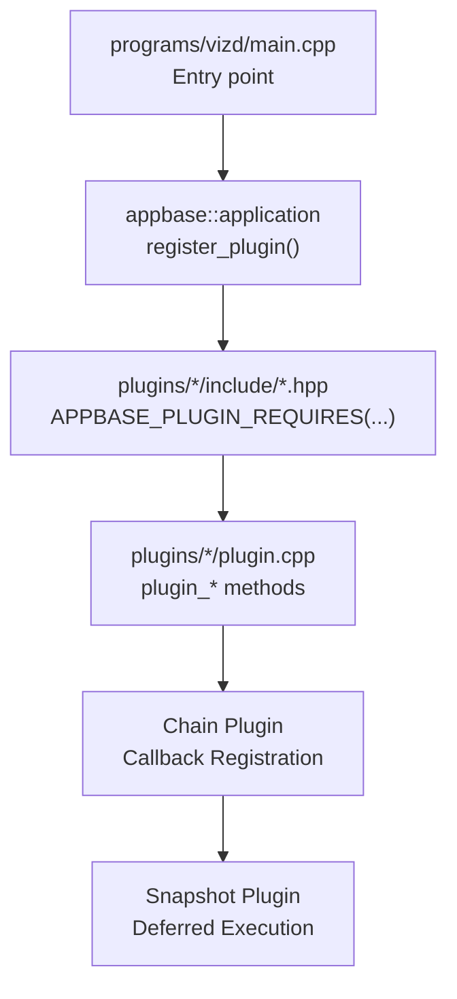
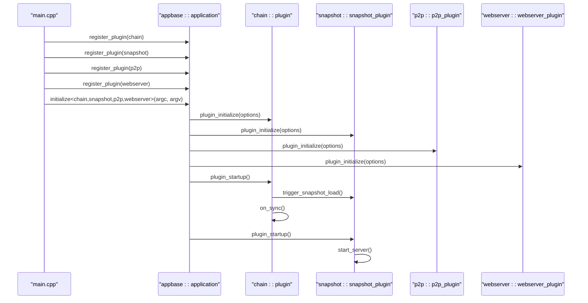
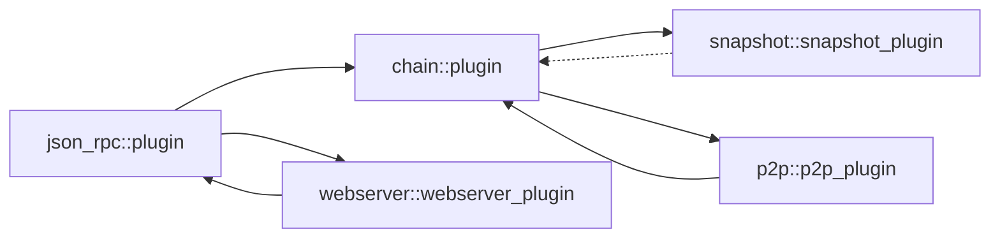
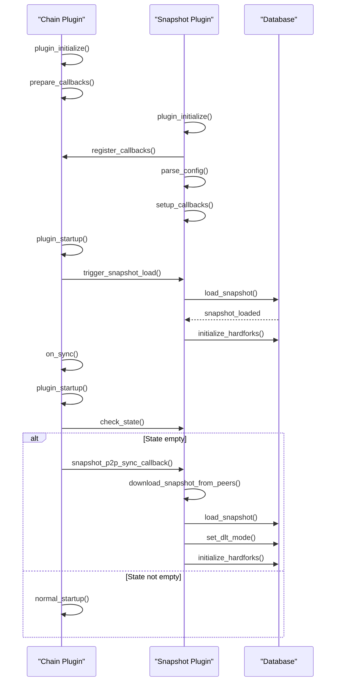
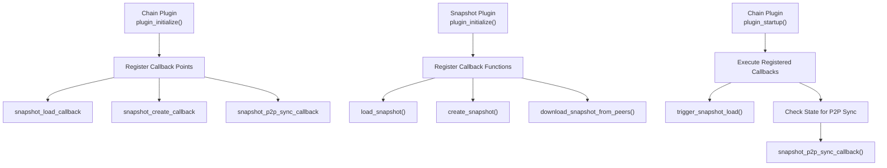
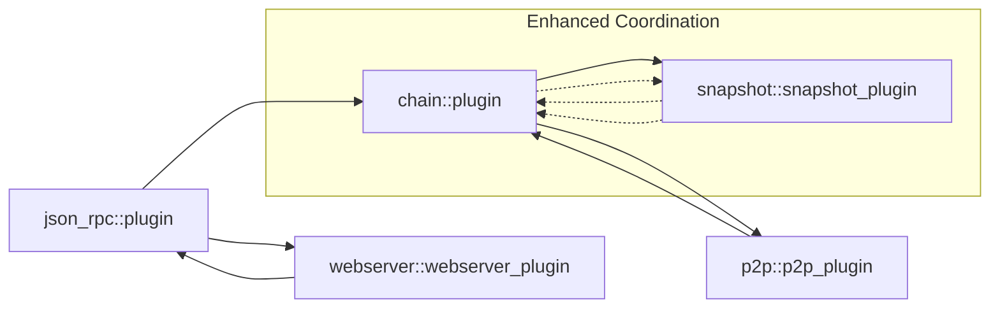

# Plugin Lifecycle and Registration

<cite>
**Referenced Files in This Document**
- [main.cpp](file://programs/vizd/main.cpp)
- [plugin.hpp](file://plugins/chain/include/graphene/plugins/chain/plugin.hpp)
- [plugin.cpp](file://plugins/chain/plugin.cpp)
- [p2p_plugin.hpp](file://plugins/p2p/include/graphene/plugins/p2p/p2p_plugin.hpp)
- [webserver_plugin.hpp](file://plugins/webserver/include/graphene/plugins/webserver/webserver_plugin.hpp)
- [snapshot_plugin.hpp](file://plugins/snapshot/include/graphene/plugins/snapshot/plugin.hpp)
- [snapshot_plugin.cpp](file://plugins/snapshot/plugin.cpp)
- [plugin.md](file://documentation/plugin.md)
- [snapshot-plugin.md](file://documentation/snapshot-plugin.md)
</cite>

## Update Summary
**Changes Made**
- Enhanced plugin initialization order requirements section to reflect new coordination mechanisms
- Added comprehensive coverage of snapshot plugin integration with chain plugin callbacks
- Updated deferred execution model documentation for snapshot loading and creation
- Expanded coordination between chain and snapshot plugins during startup
- Added detailed explanation of P2P snapshot sync callback mechanism
- Updated dependency analysis to include snapshot plugin requirements

## Table of Contents
1. [Introduction](#introduction)
2. [Project Structure](#project-structure)
3. [Core Components](#core-components)
4. [Architecture Overview](#architecture-overview)
5. [Detailed Component Analysis](#detailed-component-analysis)
6. [Enhanced Plugin Initialization Order Requirements](#enhanced-plugin-initialization-order-requirements)
7. [Deferred Execution Model for Snapshot Loading](#deferred-execution-model-for-snapshot-loading)
8. [Coordination Between Chain and Snapshot Plugins](#coordination-between-chain-and-snapshot-plugins)
9. [Dependency Analysis](#dependency-analysis)
10. [Performance Considerations](#performance-considerations)
11. [Troubleshooting Guide](#troubleshooting-guide)
12. [Conclusion](#conclusion)

## Introduction
This document explains the plugin lifecycle and registration mechanisms in the application built on the appbase framework. It covers the three phases of plugin execution: initialization, startup, and shutdown. It also documents how plugins register themselves with the application, how dependencies are declared via the APPBASE_PLUGIN_REQUIRES macro, and how the application framework determines plugin loading order. The document has been updated to reflect enhanced plugin initialization order requirements, improved coordination between chain and snapshot plugins, and the deferred execution model for snapshot loading.

## Project Structure
The application binary registers and initializes plugins in the main entry point. Plugins are organized under plugins/<plugin_name>/ with a standard plugin interface that extends appbase::plugin. Dependencies between plugins are declared using APPBASE_PLUGIN_REQUIRES in each plugin's header. The snapshot plugin introduces a sophisticated callback system that coordinates with the chain plugin for deferred execution of snapshot operations.

**Diagram sources**
- [main.cpp:62-90](file://programs/vizd/main.cpp#L62-L90)
- [plugin.hpp:21-42](file://plugins/chain/include/graphene/plugins/chain/plugin.hpp#L21-L42)
- [snapshot_plugin.hpp:55-89](file://plugins/snapshot/include/graphene/plugins/snapshot/plugin.hpp#L55-L89)

**Section sources**
- [main.cpp:62-90](file://programs/vizd/main.cpp#L62-L90)
- [plugin.md:1-28](file://documentation/plugin.md#L1-L28)

## Core Components
- Application entry point and plugin registration:
  - The application registers all plugins in the main entry point and then initializes the appbase application with a specific set of plugins.
  - The application sets program options, initializes, starts up, and executes the event loop.

- Plugin interface and lifecycle:
  - Plugins derive from appbase::plugin and implement:
    - plugin_initialize(options): parse configuration and prepare resources.
    - plugin_startup(): open databases, bind services, start threads, and signal readiness.
    - plugin_shutdown(): close resources and shut down gracefully.

- Enhanced dependency management:
  - Plugins declare dependencies using APPBASE_PLUGIN_REQUIRES in their header.
  - The chain plugin requires json_rpc; snapshot plugin requires chain; p2p requires chain; webserver requires json_rpc.
  - The appbase framework resolves dependencies and ensures required plugins are initialized before dependents.

- Deferred execution coordination:
  - The chain plugin provides callback mechanisms for snapshot operations.
  - Snapshot plugin registers callbacks during initialization that execute during chain plugin startup.
  - This ensures proper sequencing of snapshot loading, creation, and P2P sync operations.

**Section sources**
- [main.cpp:108-160](file://programs/vizd/main.cpp#L108-L160)
- [plugin.hpp:21-42](file://plugins/chain/include/graphene/plugins/chain/plugin.hpp#L21-L42)
- [plugin.cpp:254-396](file://plugins/chain/plugin.cpp#L254-L396)
- [snapshot_plugin.hpp:55-89](file://plugins/snapshot/include/graphene/plugins/snapshot/plugin.hpp#L55-L89)

## Architecture Overview
The application controls plugin lifecycle through appbase. Plugins are registered centrally, then initialized and started in dependency-aware order. The chain plugin typically initializes first because many plugins require it. The snapshot plugin introduces a callback-driven coordination mechanism that allows it to defer operations until the chain plugin is ready.

**Diagram sources**
- [main.cpp:62-90](file://programs/vizd/main.cpp#L62-L90)
- [plugin.cpp:254-396](file://plugins/chain/plugin.cpp#L254-L396)
- [snapshot_plugin.cpp:3031-3093](file://plugins/snapshot/plugin.cpp#L3031-L3093)

## Detailed Component Analysis

### Plugin Registration in main.cpp
- Centralized registration:
  - The application registers each plugin via appbase::app().register_plugin<T>().
  - Registration occurs before initialize() so dependencies can be resolved.

- Enhanced initialization invocation:
  - After registration, initialize<RequiredPlugins...>() is called with a variadic list of plugins to initialize.
  - The application then calls startup() and enters the event loop via exec().

- Practical pattern:
  - Keep registration in one place (register_plugins()) and pass the same set to initialize().

**Section sources**
- [main.cpp:62-90](file://programs/vizd/main.cpp#L62-L90)
- [main.cpp:117-122](file://programs/vizd/main.cpp#L117-L122)
- [main.cpp:139-140](file://programs/vizd/main.cpp#L139-L140)

### Plugin Lifecycle Phases

#### plugin_initialize
- Purpose:
  - Parse configuration options and prepare internal state.
  - Set up paths, sizes, and flags required for later operations.

- Enhanced behavior with snapshot coordination:
  - The chain plugin prepares callback registration points for snapshot operations.
  - The snapshot plugin registers callback functions that will execute during chain plugin startup.
  - Dependencies are declared using APPBASE_PLUGIN_REQUIRES with enhanced coordination requirements.

- Error handling:
  - Exceptions during initialization should be allowed to propagate so the application can handle them gracefully.

**Section sources**
- [plugin.cpp:254-314](file://plugins/chain/plugin.cpp#L254-L314)
- [snapshot_plugin.cpp:2821-2977](file://plugins/snapshot/plugin.cpp#L2821-L2977)

#### plugin_startup
- Purpose:
  - Open databases, bind services, start threads, and publish readiness signals.
  - Perform actions that require dependencies to be ready.

- Enhanced startup with deferred execution:
  - The chain plugin triggers snapshot loading through registered callbacks.
  - The snapshot plugin starts its TCP server and begins accepting connections.
  - P2P snapshot sync callback is executed when state is empty and snapshot is available.

- Startup timing:
  - Occurs after plugin_initialize for all plugins and after all dependencies are initialized.

**Section sources**
- [plugin.cpp:316-390](file://plugins/chain/plugin.cpp#L316-L390)
- [snapshot_plugin.cpp:3031-3093](file://plugins/snapshot/plugin.cpp#L3031-L3093)

#### plugin_shutdown
- Purpose:
  - Close databases, stop threads, and release resources.
  - Ensure clean termination.

- Enhanced shutdown coordination:
  - The chain plugin ensures proper shutdown sequence.
  - The snapshot plugin stops stalled sync detection and TCP server gracefully.

**Section sources**
- [plugin.cpp:392-396](file://plugins/chain/plugin.cpp#L392-L396)
- [snapshot_plugin.cpp:3095-3100](file://plugins/snapshot/plugin.cpp#L3095-L3100)

### Enhanced Plugin Initialization Order Requirements

#### Dependency Resolution with Coordination
- Declaration:
  - Plugins declare dependencies in their header using APPBASE_PLUGIN_REQUIRES((dep1)(dep2)...).
  - The chain plugin requires json_rpc; snapshot plugin requires chain; p2p requires chain; webserver requires json_rpc.

- Enhanced resolution:
  - The appbase framework ensures dependencies are initialized before the dependent plugin.
  - The chain plugin provides callback registration points that allow dependent plugins to coordinate operations.
  - The snapshot plugin registers callbacks during initialization that execute during chain plugin startup.

- Example declarations:
  - chain plugin declares json_rpc as a requirement.
  - snapshot plugin declares chain as a requirement.
  - p2p plugin declares chain as a requirement.
  - webserver plugin declares json_rpc as a requirement.

**Section sources**
- [plugin.hpp:21-34](file://plugins/chain/include/graphene/plugins/chain/plugin.hpp#L21-L34)
- [snapshot_plugin.hpp:55-57](file://plugins/snapshot/include/graphene/plugins/snapshot/plugin.hpp#L55-L57)
- [p2p_plugin.hpp:18-20](file://plugins/p2p/include/graphene/plugins/p2p/p2p_plugin.hpp#L18-L20)
- [webserver_plugin.hpp:32-38](file://plugins/webserver/include/graphene/plugins/webserver/webserver_plugin.hpp#L32-L38)

### Plugin Naming Conventions and Static name() Method
- Naming convention:
  - Plugins define a constant or macro for their name (e.g., P2P_PLUGIN_NAME, WEBSERVER_PLUGIN_NAME).
  - The static name() method returns the plugin's string identifier.

- Implementation pattern:
  - A static std::string is constructed once and returned by name().
  - This enables consistent identification and logging.

**Section sources**
- [p2p_plugin.hpp:29-32](file://plugins/p2p/include/graphene/plugins/p2p/p2p_plugin.hpp#L29-L32)
- [webserver_plugin.hpp:40-43](file://plugins/webserver/include/graphene/plugins/webserver/webserver_plugin.hpp#L40-L43)

### Plugin Registration Patterns and Loading Order
- Registration pattern:
  - Call appbase::app().register_plugin<Plugin>() for each plugin.
  - Pass the same set of plugins to initialize<Plugins...>().

- Enhanced loading order:
  - The appbase framework resolves dependencies first, then initializes others in the order provided to initialize<...>().
  - The chain plugin typically initializes first, followed by snapshot plugin, then dependent plugins like p2p and webserver.
  - Callback registration ensures proper sequencing of operations across plugin boundaries.

- Practical example:
  - The application registers chain, snapshot, p2p, and webserver, then initializes them in that order with enhanced coordination.

**Section sources**
- [main.cpp:62-90](file://programs/vizd/main.cpp#L62-L90)
- [main.cpp:117-122](file://programs/vizd/main.cpp#L117-L122)

### Error Handling During Initialization and Graceful Shutdown
- Initialization errors:
  - The chain plugin catches database-related exceptions during startup and either replays or exits depending on configuration.
  - The snapshot plugin handles various error scenarios including peer connection failures and snapshot validation errors.
  - Other plugins should throw or log errors during plugin_initialize to prevent startup.

- Enhanced graceful shutdown:
  - The chain plugin closes the database in plugin_shutdown.
  - The snapshot plugin stops stalled sync detection and TCP server gracefully.
  - Other plugins should stop threads and release resources in plugin_shutdown.

**Section sources**
- [plugin.cpp:348-396](file://plugins/chain/plugin.cpp#L348-L396)
- [snapshot_plugin.cpp:3095-3100](file://plugins/snapshot/plugin.cpp#L3095-L3100)

## Enhanced Plugin Initialization Order Requirements

### Advanced Dependency Coordination
The enhanced plugin initialization order requirements ensure proper sequencing of operations across plugin boundaries, particularly for the snapshot plugin's coordination with the chain plugin.

**Diagram sources**
- [plugin.hpp:21-23](file://plugins/chain/include/graphene/plugins/chain/plugin.hpp#L21-L23)
- [snapshot_plugin.hpp:55-57](file://plugins/snapshot/include/graphene/plugins/snapshot/plugin.hpp#L55-L57)
- [p2p_plugin.hpp:18-20](file://plugins/p2p/include/graphene/plugins/p2p/p2p_plugin.hpp#L18-L20)
- [webserver_plugin.hpp:32-38](file://plugins/webserver/include/graphene/plugins/webserver/webserver_plugin.hpp#L32-L38)

**Section sources**
- [plugin.hpp:21-34](file://plugins/chain/include/graphene/plugins/chain/plugin.hpp#L21-L34)
- [snapshot_plugin.hpp:55-57](file://plugins/snapshot/include/graphene/plugins/snapshot/plugin.hpp#L55-L57)
- [p2p_plugin.hpp:18-20](file://plugins/p2p/include/graphene/plugins/p2p/p2p_plugin.hpp#L18-L20)
- [webserver_plugin.hpp:32-38](file://plugins/webserver/include/graphene/plugins/webserver/webserver_plugin.hpp#L32-L38)

## Deferred Execution Model for Snapshot Loading

### Snapshot Operation Coordination
The snapshot plugin implements a sophisticated deferred execution model that coordinates with the chain plugin through callback mechanisms.

**Diagram sources**
- [snapshot_plugin.cpp:2947-3028](file://plugins/snapshot/plugin.cpp#L2947-L3028)
- [plugin.cpp:437-532](file://plugins/chain/plugin.cpp#L437-L532)

### Deferred Execution Mechanisms
The deferred execution model ensures that snapshot operations occur at the appropriate time in the plugin lifecycle:

- **Snapshot Loading**: Executed during chain plugin startup, before on_sync() fires, ensuring P2P sync starts from the snapshot head block.
- **Snapshot Creation**: Executed after full database load (including replay), but before on_sync(), preventing P2P/witness startup.
- **P2P Snapshot Sync**: Executed when state is empty (head_block_num == 0), before on_sync(), enabling bootstrap from trusted peers.

**Section sources**
- [snapshot_plugin.cpp:2947-3028](file://plugins/snapshot/plugin.cpp#L2947-L3028)
- [plugin.cpp:437-532](file://plugins/chain/plugin.cpp#L437-L532)

## Coordination Between Chain and Snapshot Plugins

### Callback Registration System
The chain plugin provides a callback registration system that enables the snapshot plugin to coordinate operations at specific points in the chain plugin's lifecycle.

**Diagram sources**
- [plugin.hpp:97-110](file://plugins/chain/include/graphene/plugins/chain/plugin.hpp#L97-L110)
- [snapshot_plugin.cpp:2947-3028](file://plugins/snapshot/plugin.cpp#L2947-L3028)

### Enhanced Coordination Features
The coordination between chain and snapshot plugins includes several advanced features:

- **Trigger Mechanism**: The chain plugin provides `trigger_snapshot_load()` to activate deferred snapshot loading when the snapshot plugin is ready.
- **State Awareness**: The chain plugin checks if state is empty (head_block_num == 0) before executing P2P snapshot sync.
- **Execution Timing**: Callbacks execute at precisely defined points in the plugin lifecycle to ensure proper sequencing.
- **Error Handling**: Comprehensive error handling for snapshot operations including peer connection failures and validation errors.

**Section sources**
- [plugin.hpp:52-55](file://plugins/chain/include/graphene/plugins/chain/plugin.hpp#L52-L55)
- [snapshot_plugin.cpp:3031-3093](file://plugins/snapshot/plugin.cpp#L3031-L3093)

## Dependency Analysis
This section maps plugin dependencies and their impact on initialization order, with enhanced focus on the coordination between chain and snapshot plugins.

**Diagram sources**
- [plugin.hpp:21-23](file://plugins/chain/include/graphene/plugins/chain/plugin.hpp#L21-L23)
- [snapshot_plugin.hpp:55-57](file://plugins/snapshot/include/graphene/plugins/snapshot/plugin.hpp#L55-L57)
- [p2p_plugin.hpp:18-20](file://plugins/p2p/include/graphene/plugins/p2p/p2p_plugin.hpp#L18-L20)
- [webserver_plugin.hpp:32-38](file://plugins/webserver/include/graphene/plugins/webserver/webserver_plugin.hpp#L32-L38)

**Section sources**
- [plugin.hpp:21-34](file://plugins/chain/include/graphene/plugins/chain/plugin.hpp#L21-L34)
- [snapshot_plugin.hpp:55-57](file://plugins/snapshot/include/graphene/plugins/snapshot/plugin.hpp#L55-L57)
- [p2p_plugin.hpp:18-20](file://plugins/p2p/include/graphene/plugins/p2p/p2p_plugin.hpp#L18-L20)
- [webserver_plugin.hpp:32-38](file://plugins/webserver/include/graphene/plugins/webserver/webserver_plugin.hpp#L32-L38)

## Performance Considerations
- Minimize heavy work in plugin_initialize; defer expensive operations to plugin_startup.
- Use asynchronous I/O and dedicated threads where appropriate (e.g., webserver runs in its own thread).
- Configure shared memory and flush intervals thoughtfully to balance safety and performance.
- The snapshot plugin's deferred execution model prevents blocking operations during critical startup phases.
- Anti-spam protections in the snapshot TCP server prevent resource exhaustion during high-load scenarios.

## Troubleshooting Guide
- Plugin fails to start due to missing dependency:
  - Ensure the required plugin is registered and appears before the dependent plugin in the initialize<> list or rely on the framework to resolve dependencies.
  - Verify that callback registration occurs before the chain plugin attempts to trigger snapshot operations.

- Database errors during startup:
  - The chain plugin attempts to replay on revision mismatch or block log errors. Adjust configuration flags to force replay or resync if needed.
  - The snapshot plugin handles various error scenarios including peer connection failures and snapshot validation errors.

- Snapshot loading issues:
  - Verify that snapshot plugin is registered before chain plugin to ensure proper callback registration.
  - Check that snapshot file paths are accessible and contain valid snapshot data.
  - Monitor snapshot loading logs for detailed error information.

- P2P snapshot sync problems:
  - Ensure trusted snapshot peers are properly configured and reachable.
  - Verify that snapshot serving is enabled on source nodes and that anti-spam configurations are appropriate.
  - Check network connectivity and firewall settings for snapshot TCP connections.

- Logging configuration issues:
  - Review logging options and ensure the configuration file sections are correctly formatted.

- Common pitfalls:
  - Forgetting to register a plugin leads to unresolved dependencies.
  - Not implementing plugin_shutdown properly can leave resources open.
  - Performing blocking operations in plugin_initialize can delay startup.
  - Missing callback registration prevents proper coordination between plugins.

**Section sources**
- [plugin.cpp:348-396](file://plugins/chain/plugin.cpp#L348-L396)
- [snapshot_plugin.cpp:3095-3100](file://plugins/snapshot/plugin.cpp#L3095-L3100)
- [plugin.md:11-28](file://documentation/plugin.md#L11-L28)

## Conclusion
The appbase framework provides a robust lifecycle for plugins with enhanced coordination capabilities: register them centrally, declare dependencies with APPBASE_PLUGIN_REQUIRES, implement plugin_initialize, plugin_startup, and plugin_shutdown, and rely on the framework to enforce dependency ordering. The chain plugin typically initializes first, followed by dependent plugins such as snapshot, p2p, and webserver. The enhanced coordination between chain and snapshot plugins through callback mechanisms ensures proper sequencing of snapshot operations. The deferred execution model prevents blocking operations during critical startup phases and enables sophisticated features like P2P snapshot synchronization. Proper error handling during initialization and graceful shutdown ensure reliable operation, while the callback-driven architecture provides flexible coordination between plugins for complex operational scenarios.