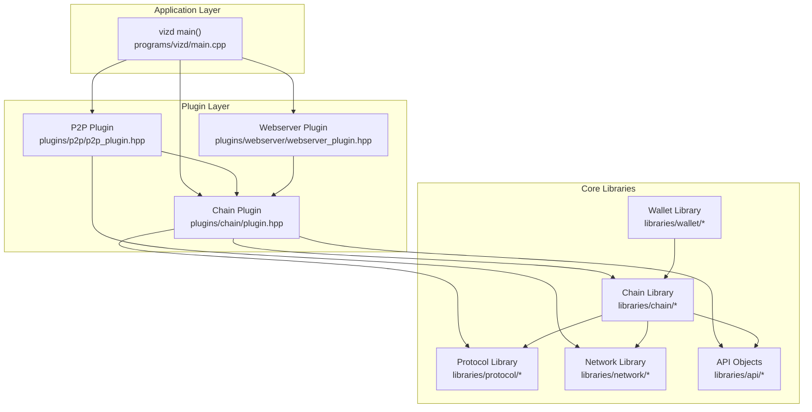
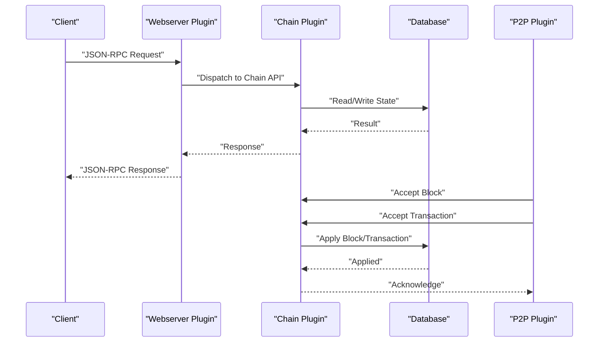
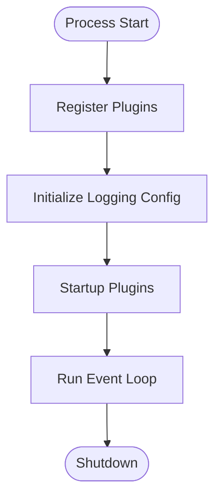
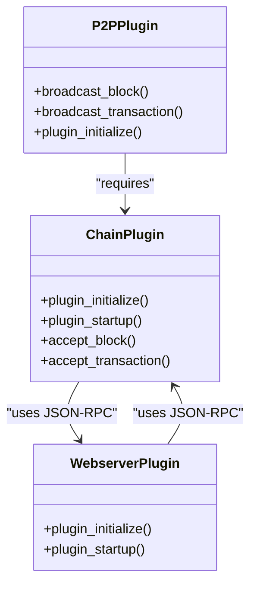
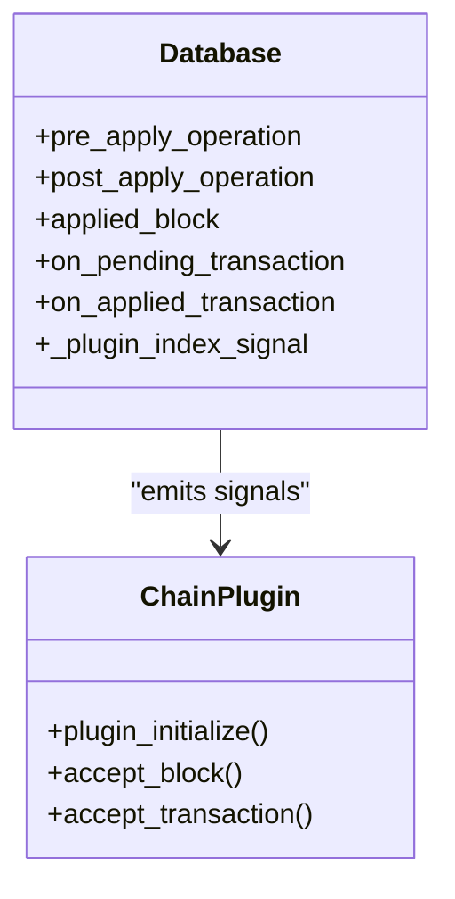
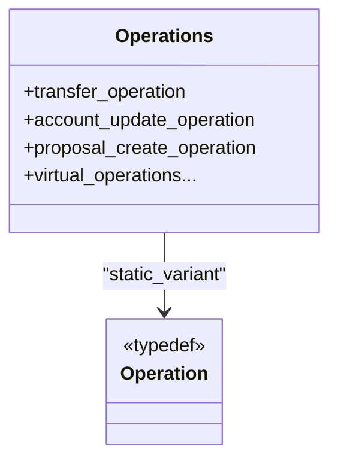
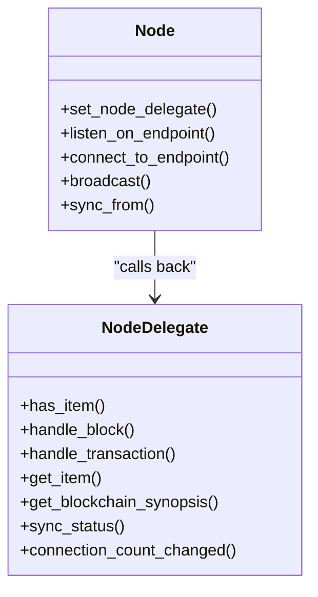
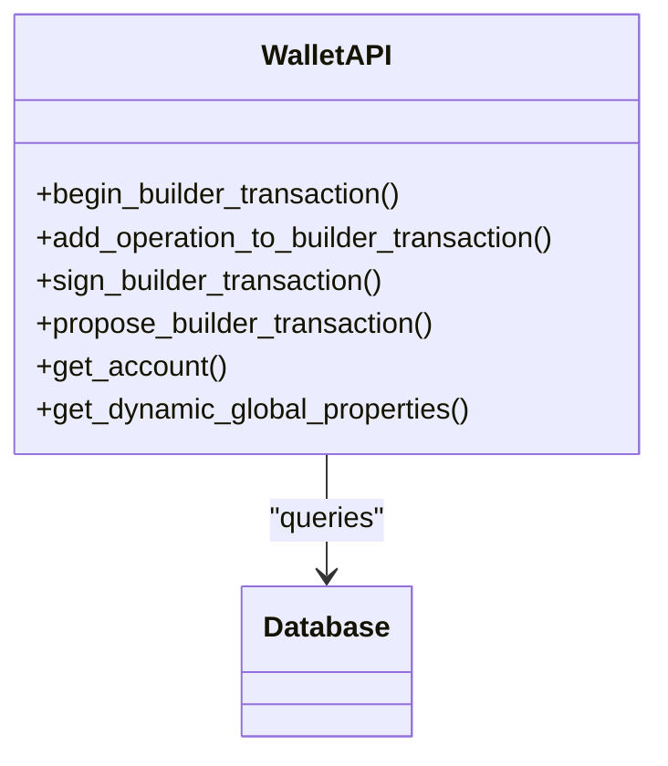
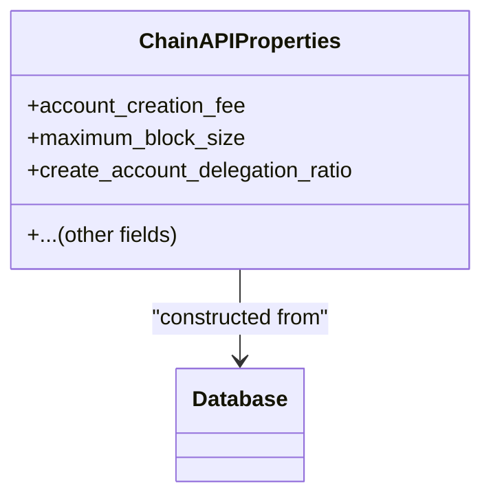
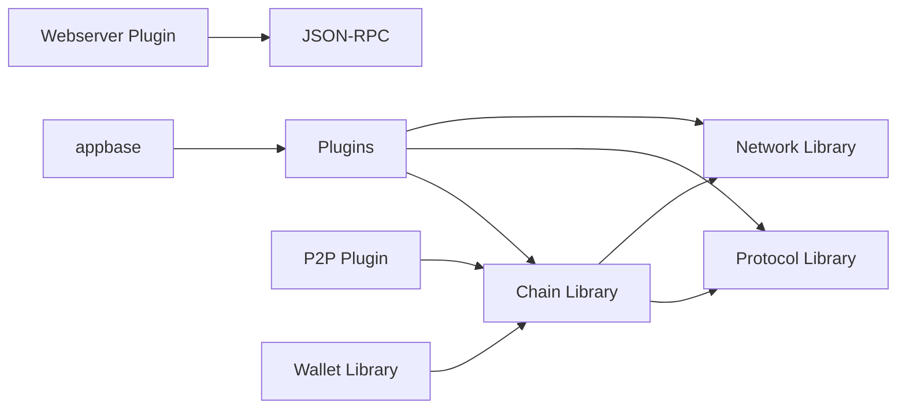

# System Overview

<cite>
**Referenced Files in This Document**
- [README.md](file://README.md)
- [main.cpp](file://programs/vizd/main.cpp)
- [CMakeLists.txt](file://libraries/CMakeLists.txt)
- [CMakeLists.txt](file://plugins/CMakeLists.txt)
- [database.hpp](file://libraries/chain/include/graphene/chain/database.hpp)
- [operations.hpp](file://libraries/protocol/include/graphene/protocol/operations.hpp)
- [node.hpp](file://libraries/network/include/graphene/network/node.hpp)
- [wallet.hpp](file://libraries/wallet/include/graphene/wallet/wallet.hpp)
- [plugin.hpp](file://plugins/chain/include/graphene/plugins/chain/plugin.hpp)
- [p2p_plugin.hpp](file://plugins/p2p/include/graphene/plugins/p2p/p2p_plugin.hpp)
- [webserver_plugin.hpp](file://plugins/webserver/include/graphene/plugins/webserver/webserver_plugin.hpp)
- [chain_api_properties.hpp](file://libraries/api/include/graphene/api/chain_api_properties.hpp)
</cite>

## Table of Contents
1. [Introduction](#introduction)
2. [Project Structure](#project-structure)
3. [Core Components](#core-components)
4. [Architecture Overview](#architecture-overview)
5. [Detailed Component Analysis](#detailed-component-analysis)
6. [Dependency Analysis](#dependency-analysis)
7. [Performance Considerations](#performance-considerations)
8. [Troubleshooting Guide](#troubleshooting-guide)
9. [Conclusion](#conclusion)

## Introduction
This document presents a system overview of the VIZ C++ Node, focusing on how the main vizd process orchestrates the entire stack: the application framework (appbase), the blockchain core (chain library), protocol definitions (protocol library), networking (network library), wallet functionality (wallet library), and the plugin system. It explains the modular design that enables flexible feature addition and removal through plugins, describes the observer pattern used for event-driven architecture, and illustrates the data flow from JSON-RPC requests through plugins to database operations. It also outlines system boundaries for peer-to-peer interactions, API request handling, and persistent state management.

## Project Structure
The repository is organized around a layered architecture:
- Application entrypoint and plugin orchestration live under programs/vizd.
- Libraries are grouped by domain: protocol, chain, network, wallet, api, and utilities.
- Plugins are feature modules that integrate with the appbase framework and the chain library.

**Diagram sources**
- [main.cpp](file://programs/vizd/main.cpp#L106-L158)
- [plugin.hpp](file://plugins/chain/include/graphene/plugins/chain/plugin.hpp#L21-L96)
- [p2p_plugin.hpp](file://plugins/p2p/include/graphene/plugins/p2p/p2p_plugin.hpp#L18-L52)
- [webserver_plugin.hpp](file://plugins/webserver/include/graphene/plugins/webserver/webserver_plugin.hpp#L32-L57)
- [database.hpp](file://libraries/chain/include/graphene/chain/database.hpp#L36-L561)
- [operations.hpp](file://libraries/protocol/include/graphene/protocol/operations.hpp#L13-L102)
- [node.hpp](file://libraries/network/include/graphene/network/node.hpp#L190-L304)
- [wallet.hpp](file://libraries/wallet/include/graphene/wallet/wallet.hpp#L96-L1067)

**Section sources**
- [README.md](file://README.md#L1-L53)
- [CMakeLists.txt](file://libraries/CMakeLists.txt#L1-L8)
- [CMakeLists.txt](file://plugins/CMakeLists.txt#L1-L12)

## Core Components
- Application framework (appbase): Provides the plugin lifecycle, dependency injection, and runtime orchestration. The vizd entrypoint registers and initializes plugins, sets logging, and runs the event loop.
- Blockchain core (chain library): Implements the database, block validation, transaction processing, and event signals for observers.
- Protocol definitions (protocol library): Defines operations, transactions, blocks, and types used across the chain.
- Networking (network library): Offers a peer-to-peer node abstraction with delegate callbacks for block/transaction handling and synchronization.
- Wallet (wallet library): Provides wallet APIs and helpers for building and signing transactions.
- Plugin system: Feature modules that depend on appbase and optionally on the chain library, enabling modular extension.

**Section sources**
- [main.cpp](file://programs/vizd/main.cpp#L62-L91)
- [database.hpp](file://libraries/chain/include/graphene/chain/database.hpp#L252-L287)
- [operations.hpp](file://libraries/protocol/include/graphene/protocol/operations.hpp#L13-L102)
- [node.hpp](file://libraries/network/include/graphene/network/node.hpp#L60-L167)
- [wallet.hpp](file://libraries/wallet/include/graphene/wallet/wallet.hpp#L96-L1067)
- [plugin.hpp](file://plugins/chain/include/graphene/plugins/chain/plugin.hpp#L21-L96)

## Architecture Overview
The VIZ node follows an event-driven architecture:
- The vizd process initializes appbase, registers plugins, and starts the application loop.
- The chain plugin owns the blockchain state and emits signals for operations, blocks, and transactions.
- The P2P plugin consumes network events and forwards blocks/transactions to the chain.
- The webserver plugin exposes JSON-RPC endpoints that route to chain and API plugins.
- Plugins can subscribe to chain signals to react to state changes.

**Diagram sources**
- [webserver_plugin.hpp](file://plugins/webserver/include/graphene/plugins/webserver/webserver_plugin.hpp#L32-L57)
- [plugin.hpp](file://plugins/chain/include/graphene/plugins/chain/plugin.hpp#L21-L96)
- [database.hpp](file://libraries/chain/include/graphene/chain/database.hpp#L252-L287)
- [p2p_plugin.hpp](file://plugins/p2p/include/graphene/plugins/p2p/p2p_plugin.hpp#L18-L52)

## Detailed Component Analysis

### Application Orchestration (vizd)
- Registers plugins including chain, p2p, webserver, and many others.
- Initializes logging and starts the appbase event loop.
- Ensures required plugins are available before startup.

**Diagram sources**
- [main.cpp](file://programs/vizd/main.cpp#L106-L158)

**Section sources**
- [main.cpp](file://programs/vizd/main.cpp#L62-L91)
- [main.cpp](file://programs/vizd/main.cpp#L106-L158)

### Plugin System and Dependencies
- Plugins declare dependencies using appbase macros.
- The chain plugin depends on json_rpc; webserver and p2p depend on json_rpc; p2p depends on chain.
- This ensures initialization order and decouples plugin lifecycles.

**Diagram sources**
- [plugin.hpp](file://plugins/chain/include/graphene/plugins/chain/plugin.hpp#L21-L96)
- [p2p_plugin.hpp](file://plugins/p2p/include/graphene/plugins/p2p/p2p_plugin.hpp#L18-L52)
- [webserver_plugin.hpp](file://plugins/webserver/include/graphene/plugins/webserver/webserver_plugin.hpp#L32-L57)

**Section sources**
- [plugin.hpp](file://plugins/chain/include/graphene/plugins/chain/plugin.hpp#L21-L42)
- [p2p_plugin.hpp](file://plugins/p2p/include/graphene/plugins/p2p/p2p_plugin.hpp#L20-L38)
- [webserver_plugin.hpp](file://plugins/webserver/include/graphene/plugins/webserver/webserver_plugin.hpp#L38-L52)

### Blockchain Core and Signals
- The database exposes signals for operation application, block application, pending/applied transactions, and plugin index registration.
- Plugins subscribe to these signals to implement features like history tracking, API indexing, and analytics.

**Diagram sources**
- [database.hpp](file://libraries/chain/include/graphene/chain/database.hpp#L252-L287)
- [plugin.hpp](file://plugins/chain/include/graphene/plugins/chain/plugin.hpp#L21-L96)

**Section sources**
- [database.hpp](file://libraries/chain/include/graphene/chain/database.hpp#L252-L287)

### Protocol Definitions
- Operations are defined as a static variant covering on-chain actions and virtual operations.
- This type system underpins transaction validation and operation dispatch.

**Diagram sources**
- [operations.hpp](file://libraries/protocol/include/graphene/protocol/operations.hpp#L13-L102)

**Section sources**
- [operations.hpp](file://libraries/protocol/include/graphene/protocol/operations.hpp#L13-L102)

### Networking and Peer Interactions
- The node delegate interface defines callbacks for handling blocks, transactions, and synchronization.
- The node manages peer connections, broadcasting, and sync status reporting.

**Diagram sources**
- [node.hpp](file://libraries/network/include/graphene/network/node.hpp#L60-L167)
- [node.hpp](file://libraries/network/include/graphene/network/node.hpp#L190-L304)

**Section sources**
- [node.hpp](file://libraries/network/include/graphene/network/node.hpp#L60-L167)
- [node.hpp](file://libraries/network/include/graphene/network/node.hpp#L190-L304)

### Wallet Integration
- The wallet API provides transaction building, signing, and proposal workflows.
- It integrates with remote node APIs and chain state for account and balance queries.

**Diagram sources**
- [wallet.hpp](file://libraries/wallet/include/graphene/wallet/wallet.hpp#L96-L1067)

**Section sources**
- [wallet.hpp](file://libraries/wallet/include/graphene/wallet/wallet.hpp#L96-L1067)

### API Properties and State Exposure
- API objects encapsulate chain state for consumption by clients.
- Example: chain_api_properties mirrors chain configuration exposed via APIs.

**Diagram sources**
- [chain_api_properties.hpp](file://libraries/api/include/graphene/api/chain_api_properties.hpp#L11-L44)

**Section sources**
- [chain_api_properties.hpp](file://libraries/api/include/graphene/api/chain_api_properties.hpp#L11-L44)

## Dependency Analysis
- The plugin layer depends on appbase and optionally on the chain library.
- The chain library depends on protocol definitions and network abstractions.
- The webserver and p2p plugins depend on json_rpc for request routing.
- The wallet library depends on chain and protocol types.

**Diagram sources**
- [main.cpp](file://programs/vizd/main.cpp#L62-L91)
- [plugin.hpp](file://plugins/chain/include/graphene/plugins/chain/plugin.hpp#L21-L96)
- [p2p_plugin.hpp](file://plugins/p2p/include/graphene/plugins/p2p/p2p_plugin.hpp#L18-L52)
- [webserver_plugin.hpp](file://plugins/webserver/include/graphene/plugins/webserver/webserver_plugin.hpp#L32-L57)
- [database.hpp](file://libraries/chain/include/graphene/chain/database.hpp#L36-L561)
- [operations.hpp](file://libraries/protocol/include/graphene/protocol/operations.hpp#L13-L102)
- [node.hpp](file://libraries/network/include/graphene/network/node.hpp#L190-L304)
- [wallet.hpp](file://libraries/wallet/include/graphene/wallet/wallet.hpp#L96-L1067)

**Section sources**
- [main.cpp](file://programs/vizd/main.cpp#L62-L91)
- [plugin.hpp](file://plugins/chain/include/graphene/plugins/chain/plugin.hpp#L21-L96)
- [p2p_plugin.hpp](file://plugins/p2p/include/graphene/plugins/p2p/p2p_plugin.hpp#L18-L52)
- [webserver_plugin.hpp](file://plugins/webserver/include/graphene/plugins/webserver/webserver_plugin.hpp#L32-L57)
- [database.hpp](file://libraries/chain/include/graphene/chain/database.hpp#L36-L561)
- [operations.hpp](file://libraries/protocol/include/graphene/protocol/operations.hpp#L13-L102)
- [node.hpp](file://libraries/network/include/graphene/network/node.hpp#L190-L304)
- [wallet.hpp](file://libraries/wallet/include/graphene/wallet/wallet.hpp#L96-L1067)

## Performance Considerations
- Signal-based event handling avoids tight coupling and supports efficient plugin reactions to chain state changes.
- The plugin model enables selective feature activation, reducing overhead when unnecessary modules are disabled.
- Proper logging configuration and network bandwidth limits help maintain responsiveness under load.

[No sources needed since this section provides general guidance]

## Troubleshooting Guide
- Verify plugin registration and initialization order in the main entrypoint.
- Confirm logging configuration is loaded and appropriate appenders/loggers are defined.
- Monitor network delegate callbacks for block/transaction acceptance and sync progress.
- Subscribe to chain signals to diagnose operation/application timing and failures.

**Section sources**
- [main.cpp](file://programs/vizd/main.cpp#L117-L158)
- [database.hpp](file://libraries/chain/include/graphene/chain/database.hpp#L252-L287)
- [node.hpp](file://libraries/network/include/graphene/network/node.hpp#L60-L167)

## Conclusion
The VIZ C++ Node is a modular, event-driven system centered on appbase and the chain library. The plugin architecture cleanly separates concerns across networking, API exposure, and specialized features, while the observer pattern enables responsive, decoupled reactions to blockchain state changes. Together, these components form a robust foundation for a production-grade blockchain node with flexible feature management and clear system boundaries.