# Chain Plugin

<cite>
**Referenced Files in This Document**
- [plugin.cpp](file://plugins/chain/plugin.cpp)
- [plugin.hpp](file://plugins/chain/include/graphene/plugins/chain/plugin.hpp)
- [database.cpp](file://libraries/chain/database.cpp)
- [database_exceptions.hpp](file://libraries/chain/include/graphene/chain/database_exceptions.hpp)
- [plugin.cpp](file://plugins/snapshot/plugin.cpp)
- [application.cpp](file://thirdparty/appbase/application.cpp)
- [README.md](file://README.md)
- [snapshot-plugin.md](file://documentation/snapshot-plugin.md)
- [console_appender.cpp](file://thirdparty/fc/src/log/console_appender.cpp)
- [console_defines.h](file://thirdparty/fc/src/log/console_defines.h)
- [logger_config.cpp](file://thirdparty/fc/src/log/logger_config.cpp)
- [main.cpp](file://programs/vizd/main.cpp)
</cite>

## Update Summary
**Changes Made**
- Added comprehensive automatic recovery system from shared memory corruption with new --auto-recover-from-snapshot flag
- Implemented new --snapshot-auto-latest command-line flag for automatic snapshot discovery
- Enhanced database error handling with shared_memory_corruption_exception for robust error reporting
- Improved chain plugin startup sequence with conditional on_sync() callback invocation to prevent conflicts during automatic recovery scenarios
- Added immediate auto-recovery mechanism that triggers during block processing when corruption is detected

## Table of Contents
1. [Introduction](#introduction)
2. [Project Structure](#project-structure)
3. [Core Components](#core-components)
4. [Architecture Overview](#architecture-overview)
5. [Detailed Component Analysis](#detailed-component-analysis)
6. [Enhanced Logging System](#enhanced-logging-system)
7. [Automatic Recovery System](#automatic-recovery-system)
8. [Dependency Analysis](#dependency-analysis)
9. [Performance Considerations](#performance-considerations)
10. [Troubleshooting Guide](#troubleshooting-guide)
11. [Conclusion](#conclusion)

## Introduction
The Chain Plugin is the core component responsible for managing the blockchain state, accepting blocks and transactions, maintaining database consistency, and coordinating with other plugins in the VIZ node. It integrates tightly with the underlying database layer and provides APIs for block acceptance, transaction processing, and state queries. Recent enhancements focus on improved plugin coordination, deferred execution support for snapshot loading, comprehensive recovery system integration with DLT block log capabilities, expanded snapshot management infrastructure with consistent data directory usage, enhanced logging system with visual differentiation for better debugging experience, and most importantly, a comprehensive automatic recovery system that can detect and recover from shared memory corruption scenarios.

## Project Structure
The Chain Plugin resides under the `plugins/chain` directory and interfaces with the `libraries/chain` database implementation. The plugin exposes a clean interface for other plugins and the application to interact with the blockchain state, with enhanced deferred execution support and comprehensive recovery capabilities. The data directory path has been standardized to use 'state' for improved organizational clarity.

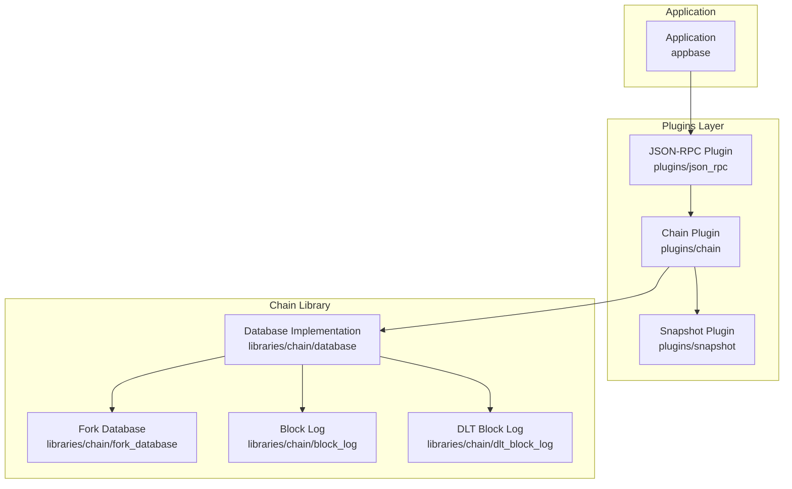

**Diagram sources**
- [plugin.cpp:183-649](file://plugins/chain/plugin.cpp#L183-L649)
- [database.cpp:351-544](file://libraries/chain/database.cpp#L351-L544)
- [plugin.cpp:3031-3118](file://plugins/snapshot/plugin.cpp#L3031-L3118)

**Section sources**
- [plugin.cpp:1-694](file://plugins/chain/plugin.cpp#L1-L694)
- [database.cpp:1-6314](file://libraries/chain/database.cpp#L1-L6314)

## Core Components
The Chain Plugin consists of two primary parts:
- The plugin class that manages lifecycle, configuration, and external interfaces
- The database wrapper that handles block acceptance, transaction processing, and state management

Key responsibilities include:
- Managing shared memory configuration and growth policies with updated default directory structure using 'state'
- Handling snapshot loading and recovery modes with enhanced deferred execution support
- Coordinating block and transaction acceptance with plugin synchronization
- Providing state queries and database accessors
- Supporting DLT (Dynamic Ledger Technology) block logging with comprehensive replay capabilities
- Implementing advanced recovery procedures with automatic snapshot detection and restoration
- Integrating with comprehensive snapshot management infrastructure including automatic discovery, rotation, and serving capabilities
- **Enhanced** Providing visual feedback through color-coded console logging for improved debugging experience
- **New** Implementing comprehensive automatic recovery system from shared memory corruption with immediate detection and restoration capabilities

**Updated** Enhanced plugin coordination with deferred execution support allows seamless integration between chain and snapshot plugins, enabling flexible startup sequences and improved error recovery mechanisms. The default shared memory directory has been changed from 'blockchain' to 'state' for better organizational clarity and consistency across data directory usage. The enhanced logging system now provides visual differentiation through ANSI escape codes for better console output readability. The new automatic recovery system provides robust protection against shared memory corruption scenarios with immediate detection and restoration capabilities.

**Section sources**
- [plugin.hpp:21-124](file://plugins/chain/include/graphene/plugins/chain/plugin.hpp#L21-L124)
- [plugin.cpp:21-93](file://plugins/chain/plugin.cpp#L21-L93)
- [database.cpp:351-544](file://libraries/chain/database.cpp#L351-L544)

## Architecture Overview
The Chain Plugin follows a layered architecture with clear separation of concerns and enhanced plugin coordination:

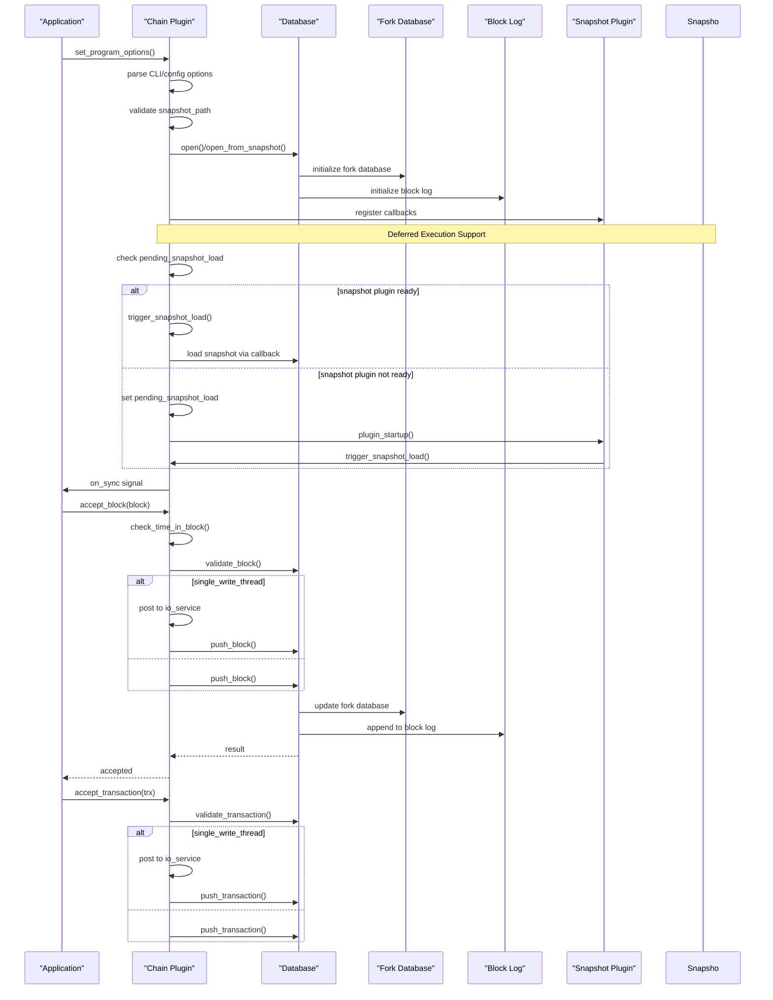

**Diagram sources**
- [plugin.cpp:103-183](file://plugins/chain/plugin.cpp#L103-L183)
- [database.cpp:438-544](file://libraries/chain/database.cpp#L438-L544)
- [plugin.cpp:650-666](file://plugins/chain/plugin.cpp#L650-L666)

**Section sources**
- [plugin.cpp:197-272](file://plugins/chain/plugin.cpp#L197-L272)
- [database.cpp:438-544](file://libraries/chain/database.cpp#L438-L544)

## Detailed Component Analysis

### Chain Plugin Class
The plugin class serves as the main interface for blockchain operations and configuration management with enhanced plugin coordination and deferred execution support.

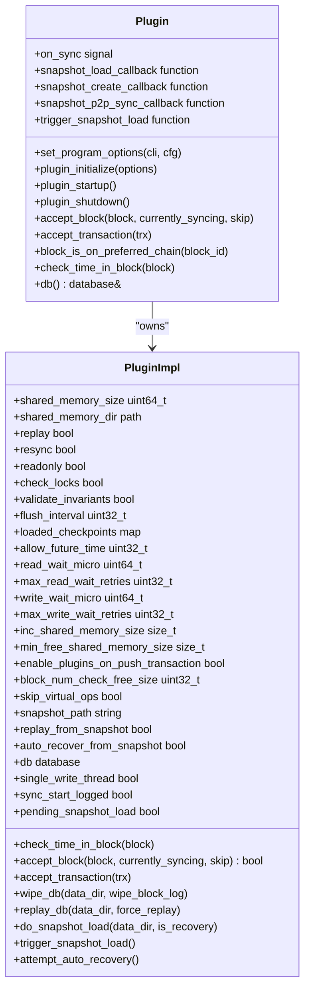

**Diagram sources**
- [plugin.hpp:21-124](file://plugins/chain/include/graphene/plugins/chain/plugin.hpp#L21-L124)
- [plugin.cpp:21-93](file://plugins/chain/plugin.cpp#L21-L93)

#### Configuration Options
The plugin supports extensive configuration through command-line and configuration file options with enhanced recovery and coordination capabilities:

| Option | Type | Description | Default |
|--------|------|-------------|---------|
| shared-file-dir | path | Location of shared memory files (absolute path or relative to application data dir) | **state** |
| shared-file-size | size | Initial shared memory size | 2G |
| inc-shared-file-size | size | Memory growth increment | 2G |
| min-free-shared-file-size | size | Minimum free space threshold | 500M |
| block-num-check-free-size | uint32_t | Check free space every N blocks | 1000 |
| checkpoint | pairs | Enforced checkpoints | none |
| flush-state-interval | uint32_t | Flush interval | 10000 |
| read-wait-micro | uint64_t | Read lock timeout | db default |
| max-read-wait-retries | uint32_t | Read retry attempts | db default |
| write-wait-micro | uint64_t | Write lock timeout | db default |
| max-write-wait-retries | uint32_t | Write retry attempts | db default |
| single-write-thread | bool | Single thread mode | false |
| clear-votes-before-block | uint32_t | Clear votes before block | 0 |
| skip-virtual-ops | bool | Skip virtual ops | false |
| enable-plugins-on-push-transaction | bool | Enable plugins on tx | false |
| dlt-block-log-max-blocks | uint32_t | DLT log size | 100000 |
| **snapshot** | string | Load state from snapshot file | empty |
| **snapshot-auto-latest** | bool | Auto-find latest snapshot in snapshot-dir | false |
| **replay-from-snapshot** | bool | Snapshot + dlt_block_log replay | false |
| **snapshot-dir** | string | Directory for auto-generated snapshots | empty |
| **auto-recover-from-snapshot** | bool | Automatically recover from corruption | true |

**Updated** Enhanced plugin coordination with deferred execution support for snapshot operations, allowing flexible startup sequences between chain and snapshot plugins. The default shared-file-dir has been changed from 'blockchain' to 'state' for improved organizational clarity and consistency across data directory usage. Enhanced logging system provides visual feedback through color-coded console output. **New** The --auto-recover-from-snapshot flag enables automatic recovery from shared memory corruption by importing the latest available snapshot and replaying DLT block log data.

**Section sources**
- [plugin.cpp:197-272](file://plugins/chain/plugin.cpp#L197-L272)
- [plugin.cpp:274-386](file://plugins/chain/plugin.cpp#L274-L386)

### Database Operations
The database layer provides comprehensive blockchain state management with enhanced recovery and DLT block log integration:

**Diagram sources**
- [plugin.cpp:388-649](file://plugins/chain/plugin.cpp#L388-L649)
- [database.cpp:351-544](file://libraries/chain/database.cpp#L351-L544)
- [plugin.cpp:650-666](file://plugins/chain/plugin.cpp#L650-L666)

#### Block Processing Pipeline
The block processing pipeline handles validation, application, and persistence with enhanced error handling and plugin coordination:

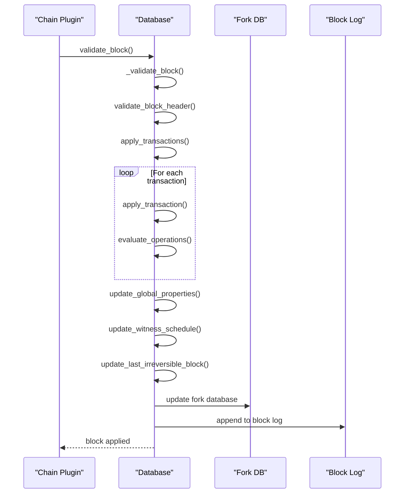

**Diagram sources**
- [database.cpp:4253-4323](file://libraries/chain/database.cpp#L4253-L4323)
- [database.cpp:4314-4323](file://libraries/chain/database.cpp#L4314-L4323)

**Section sources**
- [database.cpp:351-544](file://libraries/chain/database.cpp#L351-L544)
- [database.cpp:4253-4323](file://libraries/chain/database.cpp#L4253-L4323)

### Transaction Processing
Transaction processing involves validation, evaluation, and application within the block context:

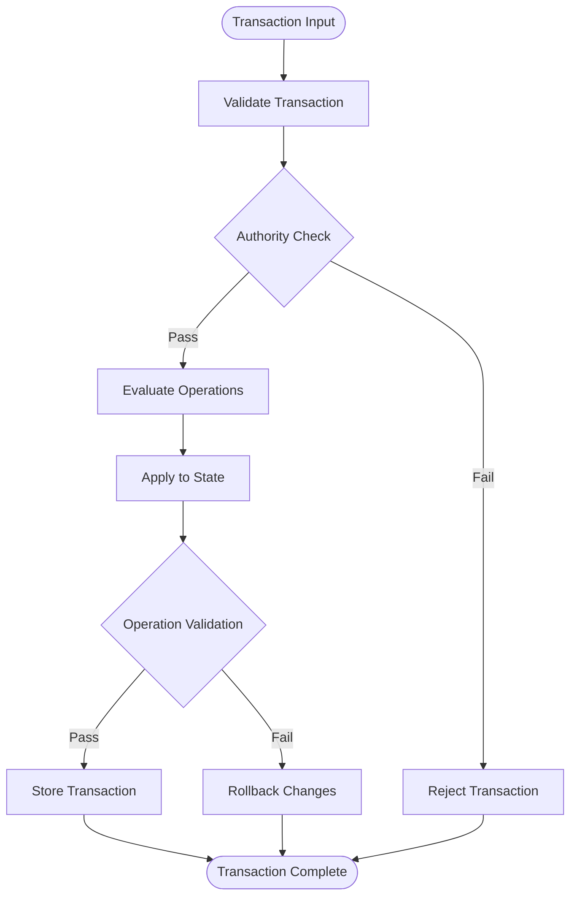

**Diagram sources**
- [database.cpp:4253-4323](file://libraries/chain/database.cpp#L4253-L4323)

**Section sources**
- [database.cpp:4253-4323](file://libraries/chain/database.cpp#L4253-L4323)

### Enhanced Plugin Coordination and Deferred Execution
Recent improvements focus on sophisticated plugin coordination mechanisms with deferred execution support:

**Updated** Enhanced plugin coordination includes:
- Deferred snapshot loading when snapshot plugin isn't ready during chain startup
- Automatic callback registration and triggering between chain and snapshot plugins
- Comprehensive recovery system integration with DLT block log replay capabilities
- Improved error handling and fallback mechanisms for snapshot operations
- **New** Immediate auto-recovery mechanism that can trigger during block processing when corruption is detected

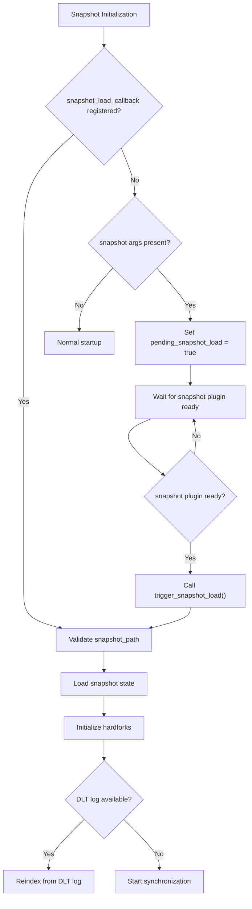

**Diagram sources**
- [plugin.cpp:420-475](file://plugins/chain/plugin.cpp#L420-L475)
- [plugin.cpp:650-666](file://plugins/chain/plugin.cpp#L650-L666)
- [plugin.cpp:3031-3042](file://plugins/snapshot/plugin.cpp#L3031-L3042)

**Section sources**
- [plugin.cpp:420-475](file://plugins/chain/plugin.cpp#L420-L475)
- [plugin.cpp:650-666](file://plugins/chain/plugin.cpp#L650-L666)
- [plugin.cpp:3031-3042](file://plugins/snapshot/plugin.cpp#L3031-L3042)

### Comprehensive Recovery System Integration
The enhanced recovery system provides robust snapshot-based restoration with DLT block log integration:

**Updated** Advanced recovery capabilities include:
- Automatic snapshot detection and loading with path validation
- DLT block log replay for incremental recovery from corrupted states
- Emergency consensus mode support for network recovery scenarios
- Comprehensive error reporting and fallback mechanisms
- **New** Immediate auto-recovery from shared memory corruption during block processing

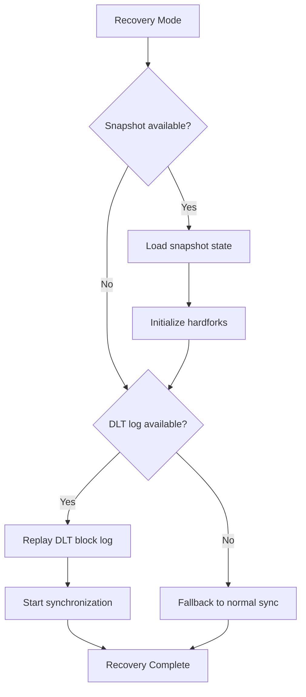

**Diagram sources**
- [plugin.cpp:566-649](file://plugins/chain/plugin.cpp#L566-L649)
- [database.cpp:438-544](file://libraries/chain/database.cpp#L438-L544)

**Section sources**
- [plugin.cpp:566-649](file://plugins/chain/plugin.cpp#L566-L649)
- [database.cpp:438-544](file://libraries/chain/database.cpp#L438-L544)

### Enhanced Snapshot Management Infrastructure
**Updated** The snapshot plugin now provides comprehensive snapshot management capabilities:

- **Automatic Discovery**: `--snapshot-auto-latest` with `--snapshot-dir` for finding the latest snapshot
- **Periodic Snapshots**: `--snapshot-every-n-blocks` for automated snapshot creation
- **Snapshot Rotation**: `--snapshot-max-age-days` for automatic cleanup of old snapshots
- **Snapshot Serving**: `--allow-snapshot-serving` with trust model and anti-spam protection
- **Trusted Peers**: `--trusted-snapshot-peer` for P2P snapshot synchronization
- **Stalled Sync Detection**: Automatic detection and recovery from stalled synchronization

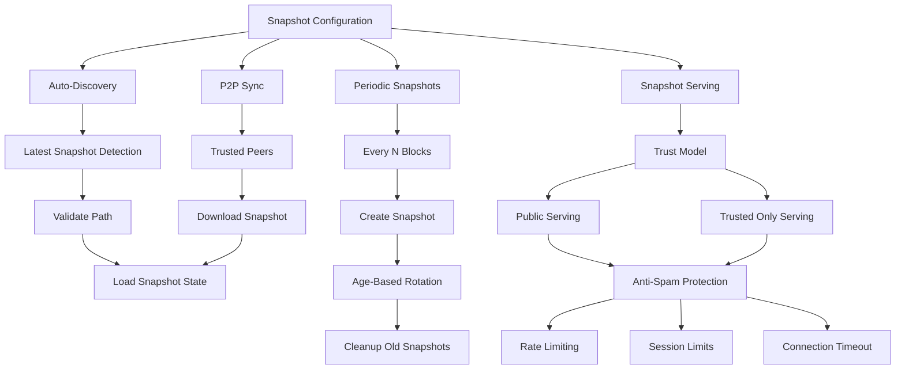

**Diagram sources**
- [plugin.cpp:344-382](file://plugins/chain/plugin.cpp#L344-L382)
- [plugin.cpp:2817-2861](file://plugins/snapshot/plugin.cpp#L2817-L2861)
- [plugin.cpp:2908-2920](file://plugins/snapshot/plugin.cpp#L2908-L2920)

**Section sources**
- [plugin.cpp:344-382](file://plugins/chain/plugin.cpp#L344-L382)
- [plugin.cpp:2817-2861](file://plugins/snapshot/plugin.cpp#L2817-L2861)
- [plugin.cpp:2908-2920](file://plugins/snapshot/plugin.cpp#L2908-L2920)

## Enhanced Logging System

**Updated** The Chain Plugin now features an enhanced logging system with visual differentiation for improved debugging experience:

### Color-Coded Console Output
The logging system uses ANSI escape codes to provide visual feedback:

- **Green Color** (`\033[92m`): Used for sync mode start and completion messages
- **Brown/Yellow Color** (`\033[93m`): Used for periodic sync progress notifications
- **Default Colors**: Maintained for other log levels (debug, warn, error)

### Sync Mode Status Messages
The enhanced logging provides clear visual indicators for different sync states:

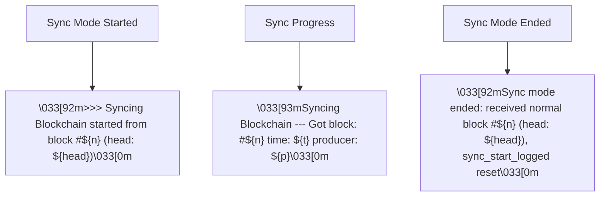

**Diagram sources**
- [plugin.cpp:105-121](file://plugins/chain/plugin.cpp#L105-L121)

### Logging Framework Enhancements
The underlying logging framework supports comprehensive color configuration:

- **Default Configuration**: Debug (green), Warn (brown), Error (red)
- **Application Override**: Error level now uses cyan instead of red for better visual hierarchy
- **Platform Support**: Windows and Unix terminal color support through ANSI escape codes
- **File Output**: Color codes are stripped when logging to files to prevent garbled output

### Visual Differentiation Benefits
The enhanced logging system improves debugging experience through:

- **Immediate Visual Feedback**: Sync start and completion clearly highlighted in green
- **Progress Indicators**: Periodic sync progress shown in yellow/brown for easy scanning
- **Consistent Color Scheme**: Maintains visual hierarchy with appropriate colors for different log levels
- **Cross-Platform Compatibility**: ANSI escape codes work across different terminal environments

**Section sources**
- [plugin.cpp:105-121](file://plugins/chain/plugin.cpp#L105-L121)
- [console_appender.cpp:71-84](file://thirdparty/fc/src/log/console_appender.cpp#L71-L84)
- [console_defines.h:146-188](file://thirdparty/fc/src/log/console_defines.h#L146-L188)
- [logger_config.cpp:69-89](file://thirdparty/fc/src/log/logger_config.cpp#L69-L89)
- [main.cpp:234-250](file://programs/vizd/main.cpp#L234-L250)

## Automatic Recovery System

**New** The Chain Plugin now implements a comprehensive automatic recovery system designed to detect and recover from shared memory corruption scenarios without manual intervention. This system provides multiple layers of protection and recovery mechanisms.

### Recovery System Architecture

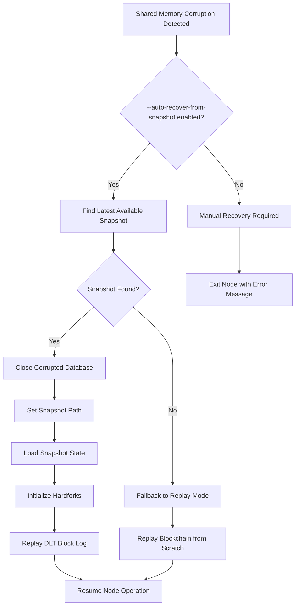

**Diagram sources**
- [plugin.cpp:757-816](file://plugins/chain/plugin.cpp#L757-L816)
- [plugin.cpp:547-600](file://plugins/chain/plugin.cpp#L547-L600)

### Recovery Triggers

The automatic recovery system can be triggered in multiple scenarios:

1. **Startup Phase Recovery**: When the database fails to open due to shared memory corruption
2. **Runtime Recovery**: During block processing when shared memory corruption is detected
3. **Configuration-Based Recovery**: When the `--auto-recover-from-snapshot` flag is enabled

### Recovery Process Implementation

The recovery process follows a systematic approach:

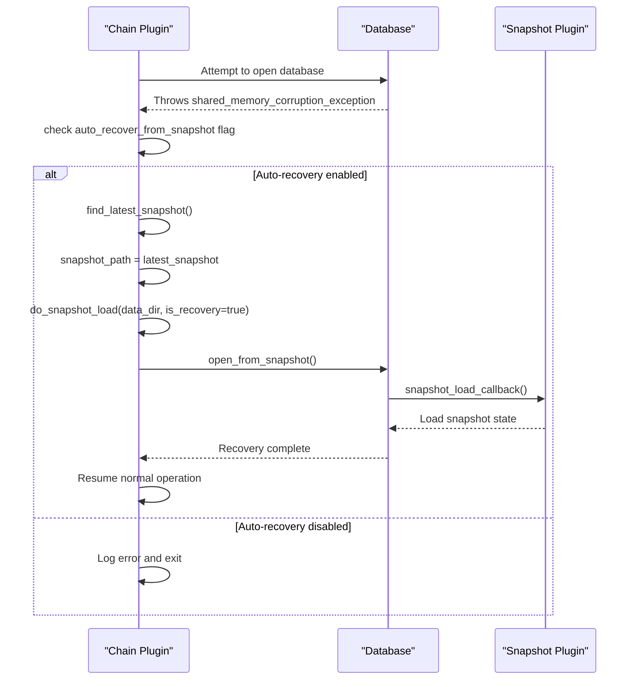

**Diagram sources**
- [plugin.cpp:757-816](file://plugins/chain/plugin.cpp#L757-L816)
- [database_exceptions.hpp:122](file://libraries/chain/include/graphene/chain/database_exceptions.hpp#L122)

### Database Exception Handling

The system leverages a dedicated exception type for shared memory corruption detection:

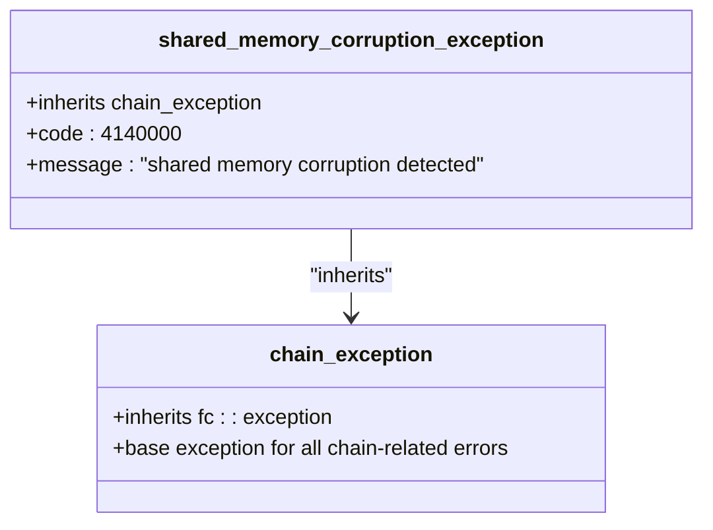

**Diagram sources**
- [database_exceptions.hpp:122](file://libraries/chain/include/graphene/chain/database_exceptions.hpp#L122)

### Command-Line Configuration

The automatic recovery system introduces new command-line flags:

| Flag | Type | Description | Default |
|------|------|-------------|---------|
| `--auto-recover-from-snapshot` | boolean | Automatically recover from shared memory corruption by importing latest snapshot | true |
| `--snapshot-auto-latest` | boolean | Auto-discover latest snapshot in snapshot-dir for recovery scenarios | false |

### Recovery Validation and Safety

The system includes multiple safety mechanisms:

- **Snapshot Validation**: Ensures recovered snapshots are valid and compatible
- **Database Integrity Checks**: Verifies recovered state before resuming operations
- **DLT Block Log Replay**: Applies incremental updates from DLT log for complete state consistency
- **Graceful Degradation**: Falls back to traditional replay mode if snapshot recovery fails

### Recovery Monitoring and Reporting

The system provides comprehensive logging for recovery operations:

- **Recovery Initiation**: Logs when automatic recovery is triggered
- **Snapshot Detection**: Reports found snapshot path and block number
- **Recovery Progress**: Tracks recovery stages and completion status
- **Error Handling**: Provides detailed error messages for recovery failures

**Section sources**
- [plugin.cpp:757-816](file://plugins/chain/plugin.cpp#L757-L816)
- [plugin.cpp:547-600](file://plugins/chain/plugin.cpp#L547-L600)
- [database_exceptions.hpp:122](file://libraries/chain/include/graphene/chain/database_exceptions.hpp#L122)

## Dependency Analysis
The Chain Plugin has well-defined dependencies and integration points with enhanced plugin coordination:

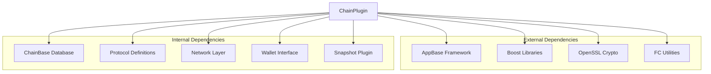

**Diagram sources**
- [plugin.cpp:1-12](file://plugins/chain/plugin.cpp#L1-L12)
- [database.cpp:1-10](file://libraries/chain/database.cpp#L1-L10)

### Integration Points
The plugin integrates with several other components with enhanced coordination:
- JSON-RPC plugin for API exposure
- Snapshot plugin for state recovery with deferred execution support
- P2P plugin for block propagation
- Witness plugin for block production
- Database plugin for state persistence

**Updated** Enhanced integration with snapshot plugin includes sophisticated deferred execution mechanisms, automatic callback registration, and comprehensive recovery system coordination. The default shared memory directory has been changed from 'blockchain' to 'state' for better organizational structure and consistent data directory usage. The enhanced logging system provides visual feedback for better debugging experience. **New** The automatic recovery system provides seamless protection against shared memory corruption with immediate detection and restoration capabilities.

**Section sources**
- [plugin.hpp:23-24](file://plugins/chain/include/graphene/plugins/chain/plugin.hpp#L23-L24)
- [plugin.cpp:92-105](file://plugins/chain/plugin.cpp#L92-L105)

## Performance Considerations
The Chain Plugin implements several performance optimizations with enhanced plugin coordination:

### Shared Memory Management
- Configurable shared memory size with automatic growth
- Minimum free space thresholds to prevent fragmentation
- Periodic flushing to balance performance and safety

### Concurrency Control
- Optional single-thread mode for deterministic processing
- Configurable read/write lock timeouts and retry limits
- Asynchronous processing through io_service for non-blocking operations

### Storage Optimization
- DLT (Dynamic Ledger Technology) block logging for recovery scenarios
- Checkpoint enforcement for validation acceleration
- Efficient fork database management for chain reorganization

### Enhanced Plugin Coordination Performance
**Updated** Optimized plugin coordination includes:
- Deferred execution support to avoid blocking during plugin initialization
- Efficient callback registration and triggering mechanisms
- Reduced redundant operations through intelligent state checking
- Optimized snapshot loading with automatic path validation
- Improved snapshot serving performance with trust model and anti-spam protection
- **Enhanced** Color-coded logging reduces visual scanning time for important sync events
- **New** Automatic recovery system minimizes downtime during corruption scenarios

### Logging Performance Considerations
**Updated** The enhanced logging system maintains performance through:
- Minimal overhead for color code insertion
- Efficient ANSI escape code handling
- Platform-specific optimization for Windows and Unix terminals
- Stripping of color codes for file output to prevent performance degradation

### Recovery System Performance Impact
**New** The automatic recovery system is designed to minimize performance impact:
- Fast snapshot discovery using optimized file system scanning
- Incremental DLT block log replay to reduce recovery time
- Graceful degradation to traditional replay mode if needed
- Background recovery operations to avoid blocking normal node operations

**Section sources**
- [plugin.cpp:24-51](file://plugins/chain/plugin.cpp#L24-L51)
- [plugin.cpp:398-418](file://plugins/chain/plugin.cpp#L398-L418)

## Troubleshooting Guide

### Common Startup Issues
1. **Database Corruption**: The plugin automatically attempts to replay the blockchain when corruption is detected
2. **Missing State**: Uses snapshot recovery mode when available with enhanced deferred execution support
3. **Lock Conflicts**: Configurable lock timeouts and retry mechanisms
4. **Plugin Coordination Issues**: Enhanced error reporting for snapshot plugin initialization delays
5. ****New** Shared Memory Corruption**: Automatic recovery system provides immediate detection and restoration

### Recovery Procedures
- Use `--replay-blockchain` to force blockchain replay
- Use `--resync-blockchain` to wipe and rebuild from scratch
- Use `--replay-from-snapshot` for recovery from corrupted state with DLT block log replay
- **Updated** Use `--snapshot-auto-latest` with proper `--snapshot-dir` configuration for automatic snapshot discovery
- **New** Enable `--auto-recover-from-snapshot` to automatically recover from corruption scenarios

### Monitoring and Diagnostics
- Enable `--check-locks` for lock validation debugging
- Use `--validate-database-invariants` for state consistency checks
- Monitor shared memory usage and growth patterns
- **Updated** Enable verbose logging for snapshot plugin coordination failures
- Monitor snapshot serving metrics and trust model compliance
- **Enhanced** Use color-coded logs to quickly identify sync mode status and progress
- **New** Monitor automatic recovery system logs for corruption detection and restoration events

### Enhanced Plugin Coordination Troubleshooting
**Updated** Specific troubleshooting for plugin coordination issues:
- Verify snapshot plugin is loaded before chain plugin for optimal performance
- Check deferred execution logs for snapshot loading delays
- Ensure proper callback registration between chain and snapshot plugins
- Monitor plugin startup order and initialization sequences
- Validate snapshot file compatibility and path accessibility
- Check snapshot directory permissions and disk space availability

### Recovery System Troubleshooting
**Updated** Specific troubleshooting for recovery system issues:
- Verify DLT block log availability for incremental recovery
- Check snapshot file integrity and compatibility
- Monitor hardfork initialization during recovery processes
- Validate emergency consensus mode settings for network recovery scenarios
- Test snapshot serving configuration with trust model and anti-spam settings
- **New** Verify `--auto-recover-from-snapshot` flag is properly configured
- **New** Check snapshot directory permissions for automatic recovery access
- **New** Monitor recovery logs for corruption detection and restoration success

### Snapshot Management Troubleshooting
**Updated** Specific troubleshooting for snapshot management issues:
- Verify snapshot directory exists and is writable
- Check snapshot rotation configuration with `--snapshot-max-age-days`
- Validate periodic snapshot creation with `--snapshot-every-n-blocks`
- Test snapshot serving configuration with `--allow-snapshot-serving`
- Configure trusted peers properly with `--trusted-snapshot-peer`
- Monitor snapshot P2P sync performance and reliability

### Enhanced Logging Troubleshooting
**Updated** Specific troubleshooting for logging issues:
- Verify terminal supports ANSI escape codes for color output
- Check logging configuration for proper color scheme setup
- Ensure color codes are properly formatted in log messages
- Test color output in different terminal environments
- Verify color codes are stripped when logging to files
- Check for proper terminal reset sequences after color output

### Sync Mode Troubleshooting
**Updated** Specific troubleshooting for sync mode logging:
- Verify green color appears for sync start and completion messages
- Check yellow/brown color for periodic sync progress notifications
- Ensure sync mode status messages appear only during active synchronization
- Verify sync mode completion messages reset properly when normal blocks arrive
- Check that sync mode guard variables work correctly to prevent duplicate messages

### Automatic Recovery System Troubleshooting
**New** Specific troubleshooting for automatic recovery system issues:
- Verify `--auto-recover-from-snapshot` flag is enabled in configuration
- Check snapshot directory accessibility for automatic recovery operations
- Monitor recovery logs for corruption detection and restoration attempts
- Verify snapshot plugin is properly configured for recovery callbacks
- Test recovery system by simulating shared memory corruption scenarios
- Check DLT block log availability for incremental recovery after snapshot restoration

**Section sources**
- [plugin.cpp:562-601](file://plugins/chain/plugin.cpp#L562-L601)
- [plugin.cpp:251-271](file://plugins/chain/plugin.cpp#L251-L271)

## Conclusion
The Chain Plugin provides a robust foundation for blockchain state management in the VIZ node. Its modular design, comprehensive configuration options, and efficient database operations make it suitable for production deployments while maintaining flexibility for development and testing scenarios. Recent enhancements focus on improved plugin coordination with deferred execution support, comprehensive recovery system integration with DLT block log capabilities, and sophisticated snapshot loading mechanisms. The plugin's integration with snapshot technology, emergency consensus mode, and advanced recovery procedures provides strong operational resilience and enhanced error handling capabilities with improved plugin coordination and seamless user experience.

**Updated** The default shared-memory directory has been changed from 'blockchain' to 'state' for better organizational clarity, ensuring consistency across data directory usage in plugin initialization and snapshot plugin deferred loading functionality. The comprehensive snapshot management infrastructure provides powerful automation capabilities including automatic discovery, periodic creation, rotation, serving, and P2P synchronization with trust models and anti-spam protection. The enhanced logging system significantly improves debugging experience through color-coded console output, providing immediate visual feedback for sync mode status and progress indicators with green color for important completion messages and yellow/brown for periodic progress notifications.

**New** The comprehensive automatic recovery system represents a major advancement in operational resilience, providing seamless protection against shared memory corruption scenarios. The system automatically detects corruption during both startup and runtime, immediately initiates recovery procedures, and restores node operation with minimal downtime. This system includes sophisticated snapshot discovery, validation, and restoration mechanisms, along with incremental DLT block log replay for complete state consistency. The recovery system is fully configurable and can be enabled or disabled based on operational requirements, providing operators with control over their recovery strategy while ensuring maximum uptime and data integrity.