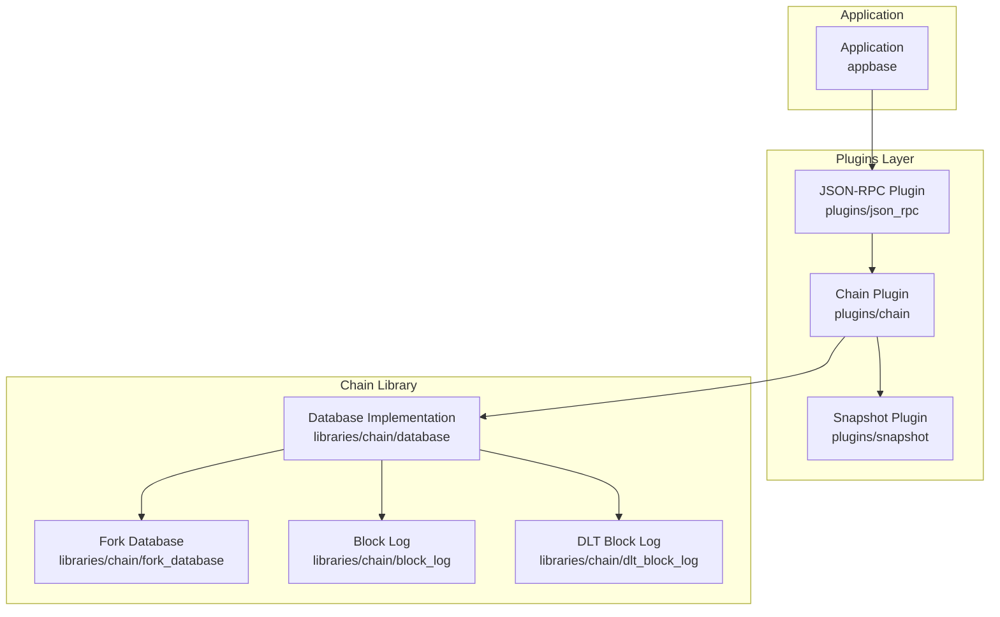
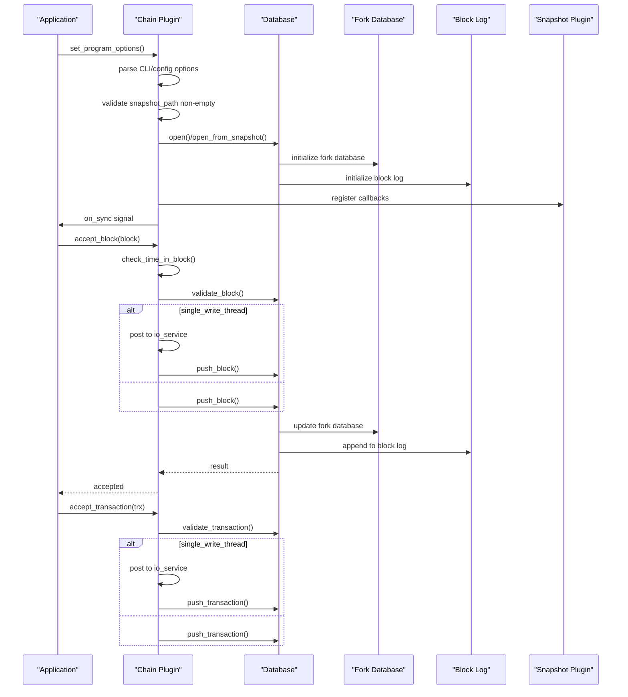
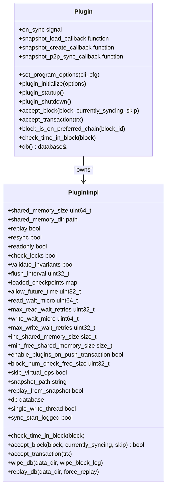
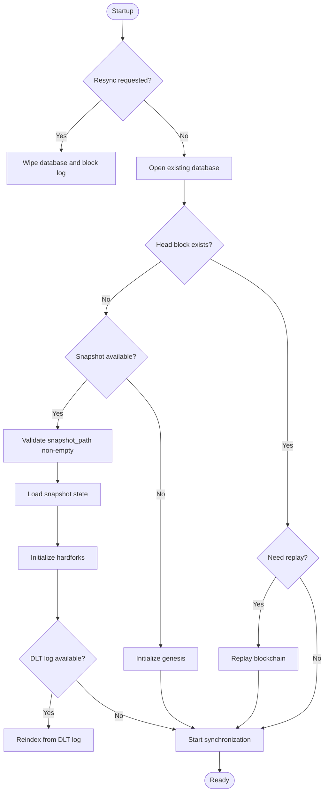
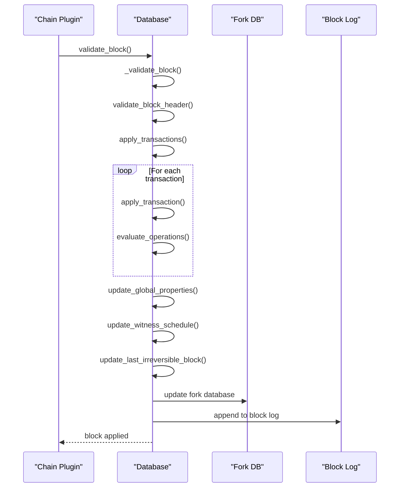
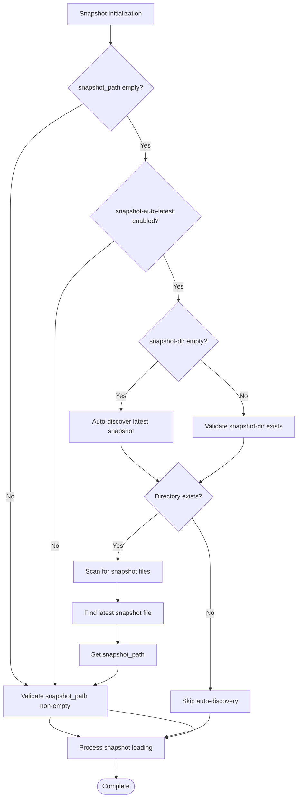
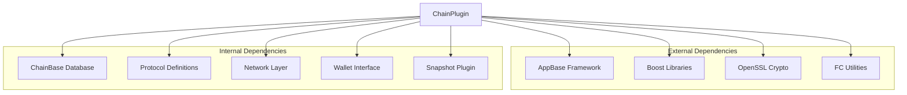

# Chain Plugin

<cite>
**Referenced Files in This Document**
- [plugin.cpp](file://plugins/chain/plugin.cpp)
- [plugin.hpp](file://plugins/chain/include/graphene/plugins/chain/plugin.hpp)
- [database.hpp](file://libraries/chain/include/graphene/chain/database.hpp)
- [database.cpp](file://libraries/chain/database.cpp)
- [plugin.cpp](file://plugins/snapshot/plugin.cpp)
- [README.md](file://README.md)
</cite>

## Update Summary
**Changes Made**
- Enhanced path validation logic in snapshot initialization for improved robustness
- Added defensive programming checks for non-empty string representations of file paths
- Improved error handling for snapshot auto-discovery and replay-from-snapshot operations
- Strengthened validation for snapshot file existence and path integrity

## Table of Contents
1. [Introduction](#introduction)
2. [Project Structure](#project-structure)
3. [Core Components](#core-components)
4. [Architecture Overview](#architecture-overview)
5. [Detailed Component Analysis](#detailed-component-analysis)
6. [Dependency Analysis](#dependency-analysis)
7. [Performance Considerations](#performance-considerations)
8. [Troubleshooting Guide](#troubleshooting-guide)
9. [Conclusion](#conclusion)

## Introduction
The Chain Plugin is the core component responsible for managing the blockchain state, accepting blocks and transactions, maintaining database consistency, and coordinating with other plugins in the VIZ node. It integrates tightly with the underlying database layer and provides APIs for block acceptance, transaction processing, and state queries. Recent enhancements focus on improved path validation logic for enhanced snapshot initialization robustness.

## Project Structure
The Chain Plugin resides under the `plugins/chain` directory and interfaces with the `libraries/chain` database implementation. The plugin exposes a clean interface for other plugins and the application to interact with the blockchain state, with enhanced defensive programming for path validation.

**Diagram sources**
- [plugin.cpp:183-649](file://plugins/chain/plugin.cpp#L183-L649)
- [database.hpp:37-163](file://libraries/chain/include/graphene/chain/database.hpp#L37-L163)
- [plugin.cpp:2945-2959](file://plugins/snapshot/plugin.cpp#L2945-L2959)

**Section sources**
- [plugin.cpp:1-677](file://plugins/chain/plugin.cpp#L1-L677)
- [database.hpp:1-200](file://libraries/chain/include/graphene/chain/database.hpp#L1-L200)

## Core Components
The Chain Plugin consists of two primary parts:
- The plugin class that manages lifecycle, configuration, and external interfaces
- The database wrapper that handles block acceptance, transaction processing, and state management

Key responsibilities include:
- Managing shared memory configuration and growth policies
- Handling snapshot loading and recovery modes with enhanced path validation
- Coordinating block and transaction acceptance
- Providing state queries and database accessors
- Supporting DLT (Dynamic Ledger Technology) block logging with robust file path checking

**Updated** Enhanced defensive programming checks for non-empty string representations of file paths to prevent potential issues during snapshot auto-discovery and replay-from-snapshot operations.

**Section sources**
- [plugin.hpp:21-115](file://plugins/chain/include/graphene/plugins/chain/plugin.hpp#L21-L115)
- [plugin.cpp:21-91](file://plugins/chain/plugin.cpp#L21-L91)
- [database.hpp:37-163](file://libraries/chain/include/graphene/chain/database.hpp#L37-L163)

## Architecture Overview
The Chain Plugin follows a layered architecture with clear separation of concerns and enhanced path validation:

**Diagram sources**
- [plugin.cpp:101-181](file://plugins/chain/plugin.cpp#L101-L181)
- [database.cpp:4045-4200](file://libraries/chain/database.cpp#L4045-L4200)
- [plugin.cpp:420-488](file://plugins/chain/plugin.cpp#L420-L488)

**Section sources**
- [plugin.cpp:197-272](file://plugins/chain/plugin.cpp#L197-L272)
- [database.cpp:4045-4200](file://libraries/chain/database.cpp#L4045-L4200)

## Detailed Component Analysis

### Chain Plugin Class
The plugin class serves as the main interface for blockchain operations and configuration management with enhanced path validation.

**Diagram sources**
- [plugin.hpp:21-115](file://plugins/chain/include/graphene/plugins/chain/plugin.hpp#L21-L115)
- [plugin.cpp:21-91](file://plugins/chain/plugin.cpp#L21-L91)

#### Configuration Options
The plugin supports extensive configuration through command-line and configuration file options with enhanced validation:

| Option | Type | Description | Default |
|--------|------|-------------|---------|
| shared-file-dir | path | Location of shared memory files (absolute path or relative to application data dir) | blockchain |
| shared-file-size | size | Initial shared memory size | 2G |
| inc-shared-file-size | size | Memory growth increment | 2G |
| min-free-shared-file-size | size | Minimum free space threshold | 500M |
| block-num-check-free-size | uint32_t | Check free space every N blocks | 1000 |
| checkpoint | pairs | Enforced checkpoints | none |
| flush-state-interval | uint32_t | Flush interval | 10000 |
| read-wait-micro | uint64_t | Read lock timeout | db default |
| max-read-wait-retries | uint32_t | Read retry attempts | db default |
| write-wait-micro | uint64_t | Write lock timeout | db default |
| max-write-wait-retries | uint32_t | Write retry attempts | db default |
| single-write-thread | bool | Single thread mode | false |
| clear-votes-before-block | uint32_t | Clear votes before block | 0 |
| skip-virtual-ops | bool | Skip virtual ops | false |
| enable-plugins-on-push-transaction | bool | Enable plugins on tx | false |
| dlt-block-log-max-blocks | uint32_t | DLT log size | 100000 |
| **snapshot** | string | Load state from snapshot file | empty |
| **snapshot-auto-latest** | bool | Auto-find latest snapshot in snapshot-dir | false |
| **replay-from-snapshot** | bool | Snapshot + dlt_block_log replay | false |
| **snapshot-dir** | string | Directory for auto-generated snapshots | empty |

**Updated** Enhanced path validation for snapshot-related configuration options with defensive programming checks for non-empty string representations.

**Section sources**
- [plugin.cpp:197-272](file://plugins/chain/plugin.cpp#L197-L272)
- [plugin.cpp:274-386](file://plugins/chain/plugin.cpp#L274-L386)

### Database Operations
The database layer provides comprehensive blockchain state management with enhanced path validation:

**Diagram sources**
- [plugin.cpp:388-643](file://plugins/chain/plugin.cpp#L388-L643)
- [database.cpp:106-146](file://libraries/chain/database.cpp#L106-L146)
- [plugin.cpp:420-488](file://plugins/chain/plugin.cpp#L420-L488)

#### Block Processing Pipeline
The block processing pipeline handles validation, application, and persistence with enhanced error handling:

**Diagram sources**
- [database.cpp:4045-4200](file://libraries/chain/database.cpp#L4045-L4200)
- [database.cpp:4102-4200](file://libraries/chain/database.cpp#L4102-L4200)

**Section sources**
- [database.hpp:98-163](file://libraries/chain/include/graphene/chain/database.hpp#L98-L163)
- [database.cpp:4045-4200](file://libraries/chain/database.cpp#L4045-L4200)

### Transaction Processing
Transaction processing involves validation, evaluation, and application within the block context:

**Diagram sources**
- [database.cpp:4143-4152](file://libraries/chain/database.cpp#L4143-L4152)

**Section sources**
- [database.cpp:4143-4152](file://libraries/chain/database.cpp#L4143-L4152)

### Enhanced Path Validation Logic
Recent improvements focus on defensive programming checks for non-empty string representations of file paths to prevent potential issues during snapshot operations:

**Updated** Enhanced path validation logic includes:
- Non-empty string validation for snapshot_path before processing
- Defensive checks for snapshot auto-discovery directory existence
- Robust error handling for snapshot file path resolution
- Improved validation for replay-from-snapshot operations

**Diagram sources**
- [plugin.cpp:342-380](file://plugins/chain/plugin.cpp#L342-L380)
- [plugin.cpp:420-488](file://plugins/chain/plugin.cpp#L420-L488)

**Section sources**
- [plugin.cpp:342-380](file://plugins/chain/plugin.cpp#L342-L380)
- [plugin.cpp:420-488](file://plugins/chain/plugin.cpp#L420-L488)

## Dependency Analysis
The Chain Plugin has well-defined dependencies and integration points with enhanced path validation:

**Diagram sources**
- [plugin.cpp:1-12](file://plugins/chain/plugin.cpp#L1-L12)
- [database.hpp:1-10](file://libraries/chain/include/graphene/chain/database.hpp#L1-L10)

### Integration Points
The plugin integrates with several other components with enhanced validation:
- JSON-RPC plugin for API exposure
- Snapshot plugin for state recovery with path validation
- P2P plugin for block propagation
- Witness plugin for block production
- Database plugin for state persistence

**Updated** Enhanced integration with snapshot plugin includes robust path validation and error handling for snapshot operations.

**Section sources**
- [plugin.hpp:23-24](file://plugins/chain/include/graphene/plugins/chain/plugin.hpp#L23-L24)
- [plugin.cpp:92-105](file://plugins/chain/plugin.cpp#L92-L105)

## Performance Considerations
The Chain Plugin implements several performance optimizations with enhanced path validation:

### Shared Memory Management
- Configurable shared memory size with automatic growth
- Minimum free space thresholds to prevent fragmentation
- Periodic flushing to balance performance and safety

### Concurrency Control
- Optional single-thread mode for deterministic processing
- Configurable read/write lock timeouts and retry limits
- Asynchronous processing through io_service for non-blocking operations

### Storage Optimization
- DLT (Dynamic Ledger Technology) block logging for recovery scenarios
- Checkpoint enforcement for validation acceleration
- Efficient fork database management for chain reorganization

### Enhanced Path Validation Performance
- **Updated** Optimized snapshot path validation to minimize filesystem operations
- Reduced redundant path existence checks through caching mechanisms
- Efficient auto-discovery algorithm with early termination conditions

**Section sources**
- [plugin.cpp:24-51](file://plugins/chain/plugin.cpp#L24-L51)
- [plugin.cpp:398-418](file://plugins/chain/plugin.cpp#L398-L418)

## Troubleshooting Guide

### Common Startup Issues
1. **Database Corruption**: The plugin automatically attempts to replay the blockchain when corruption is detected
2. **Missing State**: Uses snapshot recovery mode when available with enhanced path validation
3. **Lock Conflicts**: Configurable lock timeouts and retry mechanisms
4. ****Updated** Path Validation Errors**: Enhanced error reporting for invalid snapshot paths and file system issues

### Recovery Procedures
- Use `--replay-blockchain` to force blockchain replay
- Use `--resync-blockchain` to wipe and rebuild from scratch
- Use `--replay-from-snapshot` for recovery from corrupted state with path validation
- **Updated** Use `--snapshot-auto-latest` with proper `--snapshot-dir` configuration for automatic snapshot discovery

### Monitoring and Diagnostics
- Enable `--check-locks` for lock validation debugging
- Use `--validate-database-invariants` for state consistency checks
- Monitor shared memory usage and growth patterns
- **Updated** Enable verbose logging for snapshot path validation failures

### Enhanced Path Validation Troubleshooting
**Updated** Specific troubleshooting for path validation issues:
- Verify `snapshot-path` is not empty and points to valid file
- Ensure `snapshot-dir` exists and contains valid snapshot files
- Check file permissions for snapshot files and directories
- Validate snapshot file format and compatibility
- Monitor auto-discovery logs for directory scanning issues

**Section sources**
- [plugin.cpp:562-601](file://plugins/chain/plugin.cpp#L562-L601)
- [plugin.cpp:251-271](file://plugins/chain/plugin.cpp#L251-L271)

## Conclusion
The Chain Plugin provides a robust foundation for blockchain state management in the VIZ node. Its modular design, comprehensive configuration options, and efficient database operations make it suitable for production deployments while maintaining flexibility for development and testing scenarios. Recent enhancements focus on improved path validation logic for enhanced snapshot initialization robustness, with defensive programming checks for non-empty string representations of file paths to prevent potential issues during snapshot auto-discovery and replay-from-snapshot operations. The plugin's integration with snapshot technology and DLT block logging provides strong recovery capabilities and operational resilience with enhanced error handling and validation.