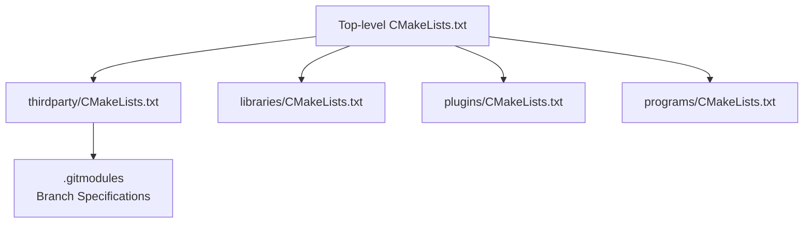
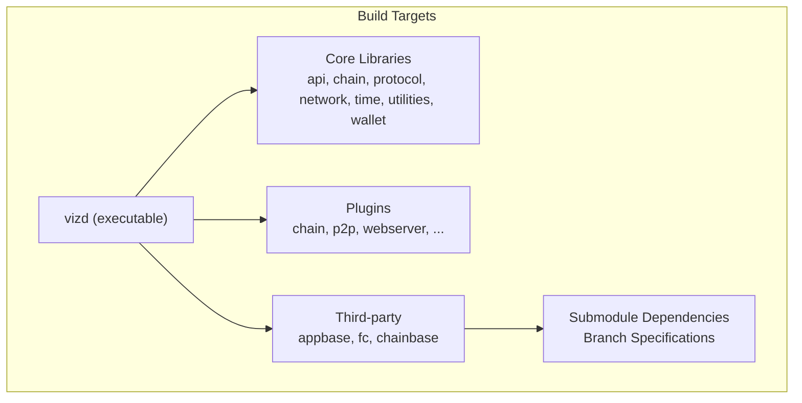
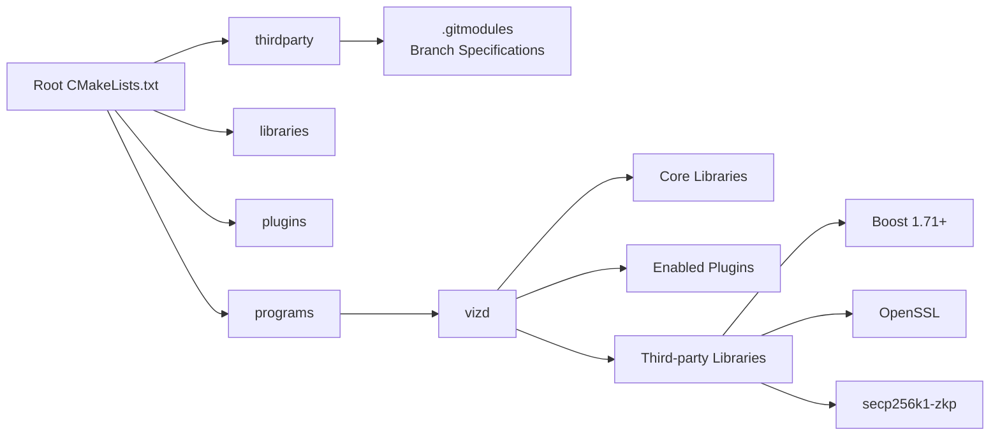

# Build Configuration

<cite>
**Referenced Files in This Document**
- [.gitmodules](file://.gitmodules)
- [thirdparty/fc/.gitmodules](file://thirdparty/fc/.gitmodules)
- [thirdparty/fc/CMakeLists.txt](file://thirdparty/fc/CMakeLists.txt)
- [thirdparty/chainbase/CMakeLists.txt](file://thirdparty/chainbase/CMakeLists.txt)
- [thirdparty/appbase/CMakeLists.txt](file://thirdparty/appbase/CMakeLists.txt)
- [CMakeLists.txt](file://CMakeLists.txt)
- [building.md](file://documentation/building.md)
- [.travis.yml](file://.travis.yml)
- [Dockerfile-testnet](file://share/vizd/docker/Dockerfile-testnet)
- [Dockerfile-lowmem](file://share/vizd/docker/Dockerfile-lowmem)
- [Dockerfile-mongo](file://share/vizd/docker/Dockerfile-mongo)
- [docker-main.yml](file://.github/workflows/docker-main.yml)
- [libraries/CMakeLists.txt](file://libraries/CMakeLists.txt)
- [plugins/CMakeLists.txt](file://plugins/CMakeLists.txt)
- [programs/CMakeLists.txt](file://programs/CMakeLists.txt)
- [thirdparty/CMakeLists.txt](file://thirdparty/CMakeLists.txt)
- [programs/vizd/CMakeLists.txt](file://programs/vizd/CMakeLists.txt)
</cite>

## Update Summary
**Changes Made**
- Enhanced submodule management documentation with branch specifications for thirdparty submodules
- Updated dependency management section to reflect Boost 1.71 requirement across thirdparty libraries
- Added fc submodule vendor dependencies documentation
- Updated Docker configuration references to reflect streamlined Docker setup
- Revised third-party library integration section with specific Boost version requirements

## Table of Contents
1. [Introduction](#introduction)
2. [Project Structure](#project-structure)
3. [Core Components](#core-components)
4. [Architecture Overview](#architecture-overview)
5. [Detailed Component Analysis](#detailed-component-analysis)
6. [Dependency Analysis](#dependency-analysis)
7. [Performance Considerations](#performance-considerations)
8. [Troubleshooting Guide](#troubleshooting-guide)
9. [Conclusion](#conclusion)
10. [Appendices](#appendices)

## Introduction
This document describes the build configuration for VIZ CPP Node, focusing on the CMake build system, available build options, compiler flags, feature toggles, cross-platform compilation, dependency management, and third-party library integration. It also covers build variants (development, production, low-memory, testnet), environment variable requirements, toolchain configuration, and CI integration via Docker and GitHub Actions. Practical examples and troubleshooting guidance are included to help you build reliably across platforms.

**Updated** Enhanced submodule management with branch specification for thirdparty submodules and improved dependency management through streamlined Docker configurations.

## Project Structure
The repository is organized around a top-level CMake project that orchestrates three major subtrees:
- thirdparty: Internal vendored libraries (appbase, fc, chainbase) with specified branch management
- libraries: Core libraries (api, chain, protocol, network, time, utilities, wallet)
- plugins: Optional plugin modules (e.g., chain, p2p, webserver, mongo_db)
- programs: Executables (vizd, cli_wallet, js_operation_serializer, size_checker, util)

**Diagram sources**
- [CMakeLists.txt:210-213](file://CMakeLists.txt#L210-L213)
- [thirdparty/CMakeLists.txt:1-3](file://thirdparty/CMakeLists.txt#L1-L3)
- [libraries/CMakeLists.txt:1-8](file://libraries/CMakeLists.txt#L1-L8)
- [plugins/CMakeLists.txt:1-12](file://plugins/CMakeLists.txt#L1-L12)
- [programs/CMakeLists.txt:1-8](file://programs/CMakeLists.txt#L1-L8)
- [.gitmodules:1-13](file://.gitmodules#L1-L13)

**Section sources**
- [CMakeLists.txt:210-213](file://CMakeLists.txt#L210-L213)
- [thirdparty/CMakeLists.txt:1-3](file://thirdparty/CMakeLists.txt#L1-L3)
- [libraries/CMakeLists.txt:1-8](file://libraries/CMakeLists.txt#L1-L8)
- [plugins/CMakeLists.txt:1-12](file://plugins/CMakeLists.txt#L1-L12)
- [programs/CMakeLists.txt:1-8](file://programs/CMakeLists.txt#L1-L8)
- [.gitmodules:1-13](file://.gitmodules#L1-L13)

## Core Components
Key build options and toggles configured at the top-level CMake:
- CMAKE_BUILD_TYPE: Selects Release or Debug profiles
- BUILD_SHARED_LIBRARIES: Controls static vs shared library builds
- BUILD_TESTNET: Enables testnet configuration via preprocessor defines
- LOW_MEMORY_NODE: Enables low-memory node configuration via preprocessor defines
- CHAINBASE_CHECK_LOCKING: Enables chainbase locking checks via preprocessor defines
- ENABLE_MONGO_PLUGIN: Enables MongoDB plugin and related preprocessor defines
- USE_PCH: Enables precompiled headers via cotire when set
- FULL_STATIC_BUILD: Forces static linking flags on Windows and Linux
- ENABLE_INSTALLER: Enables CPack packaging configuration (optional)

Compiler and toolchain behavior:
- Minimum compiler versions enforced for GCC and Clang
- Platform-specific flags for MSVC, MinGW, Apple, and Linux
- Optional ccache launchers for compile and link stages
- Coverage instrumentation toggle
- Git revision injection for version metadata

Platform specifics:
- Windows: Boost static linkage, MSVC/MinGW flags, TCL detection, static-linking options
- macOS/Linux: C++ standard selection, libc++ vs libstdc++, threading/crypto libraries, Ninja color diagnostics

**Section sources**
- [CMakeLists.txt:1-277](file://CMakeLists.txt#L1-L277)
- [building.md:3-212](file://documentation/building.md#L3-L212)

## Architecture Overview
The build system composes the final executable by linking together internal libraries and plugins, then installs the runtime artifacts. The vizd executable links against appbase, graphene core libraries, and enabled plugins.

**Diagram sources**
- [programs/vizd/CMakeLists.txt:16-49](file://programs/vizd/CMakeLists.txt#L16-L49)
- [libraries/CMakeLists.txt:1-8](file://libraries/CMakeLists.txt#L1-L8)
- [plugins/CMakeLists.txt:1-12](file://plugins/CMakeLists.txt#L1-L12)
- [thirdparty/CMakeLists.txt:1-3](file://thirdparty/CMakeLists.txt#L1-L3)
- [.gitmodules:1-13](file://.gitmodules#L1-L13)

## Detailed Component Analysis

### Top-Level CMake Configuration
Highlights:
- Enforces minimum compiler versions for GCC and Clang
- Configures module paths for custom Find modules and Git version generation
- Sets export of compile_commands.json for tooling support
- Defines Boost components and static-linking preference
- Provides feature toggles (BUILD_TESTNET, LOW_MEMORY_NODE, CHAINBASE_CHECK_LOCKING, ENABLE_MONGO_PLUGIN)
- Adds platform-specific compiler/linker flags and optional ccache
- Adds subdirectories for thirdparty, libraries, plugins, and programs
- Supports CPack packaging when enabled

Common build invocations:
- Release build: cmake -DCMAKE_BUILD_TYPE=Release ..
- Low-memory node: cmake -DLowMemoryNode=TRUE ..
- Testnet build: cmake -DBUILD_TESTNET=TRUE ..
- Enable MongoDB plugin: cmake -DENABLE_MONGO_PLUGIN=TRUE ..

Environment variables:
- BOOST_ROOT (Windows): points to Boost installation
- TCL_ROOT (Windows): points to TCL include directory
- OPENSSL_ROOT_DIR (macOS): points to OpenSSL installation
- CCACHE: enables transparent caching of compilation/linking

Toolchains and generators:
- Ninja generator benefits from color diagnostics on Clang
- Visual Studio and MinGW toolchains supported per documentation

**Section sources**
- [CMakeLists.txt:1-277](file://CMakeLists.txt#L1-L277)
- [building.md:3-212](file://documentation/building.md#L3-L212)

### Build Variants and Feature Toggles
- Debug vs Release: controlled by CMAKE_BUILD_TYPE; debug adds a debug macro and may enable coverage instrumentation when toggled
- Low-memory node: reduces storage footprint by disabling non-consensus data fields
- Testnet: switches to testnet configuration and seeds
- Chainbase locking checks: enables additional synchronization assertions
- MongoDB plugin: compiles and links the mongo_db plugin with appropriate preprocessor defines
- Static vs shared libraries: BUILD_SHARED_LIBRARIES controls library type
- Full static build: FULL_STATIC_BUILD forces static linking flags on supported platforms

Preprocessor defines injected at configure time:
- BUILD_TESTNET, IS_LOW_MEM, CHAINBASE_CHECK_LOCKING, MONGODB_PLUGIN_BUILT

**Section sources**
- [CMakeLists.txt:56-89](file://CMakeLists.txt#L56-L89)
- [CMakeLists.txt:196-208](file://CMakeLists.txt#L196-L208)

### Cross-Platform Compilation
- Linux:
  - C++ standard set to C++14
  - Threading and realtime libraries linked conditionally
  - Optional static linking flags
  - Ninja generator gains color diagnostics
- macOS:
  - Uses libc++
  - Optional TCMalloc discovery via gperftools
- Windows:
  - MSVC flags: disables safe-seh, ensures debug info in Debug
  - MinGW flags: C++11, permissiveness, SSE4.2, big object support, optimized debug flags
  - TCL detection and adjusted library naming

Dependencies:
- Boost 1.71+ required across all thirdparty libraries (appbase, chainbase, fc)
- Special handling for Boost 1.53 on Windows
- OpenSSL (via find_package or explicit root on macOS)
- Readline on Unix-like systems
- Optional: MongoDB C/C++ drivers when enabling the plugin

**Updated** All thirdparty libraries now require Boost 1.71+, with fc specifically requiring this version for secp256k1-zkp integration.

**Section sources**
- [CMakeLists.txt:91-202](file://CMakeLists.txt#L91-L202)
- [building.md:25-212](file://documentation/building.md#L25-L212)
- [thirdparty/fc/CMakeLists.txt:115-130](file://thirdparty/fc/CMakeLists.txt#L115-L130)
- [thirdparty/chainbase/CMakeLists.txt](file://thirdparty/chainbase/CMakeLists.txt#L28)
- [thirdparty/appbase/CMakeLists.txt](file://thirdparty/appbase/CMakeLists.txt#L21)

### Enhanced Submodule Management and Dependency Resolution

#### Third-Party Submodule Branch Specifications
The repository now maintains explicit branch specifications for thirdparty submodules to ensure consistent dependency resolution:

- fc submodule: Branch `update` for enhanced functionality
- chainbase submodule: Branch `lib-boost-1.71` for Boost 1.71 compatibility
- appbase submodule: Branch `lib-boost-1.71` for Boost 1.71 compatibility

These branch specifications ensure that all thirdparty dependencies align with the required Boost 1.71 version and receive the latest updates for their respective functionality.

#### fc Submodule Vendor Dependencies
The fc library manages its own vendor dependencies through nested submodules:
- websocketpp: WebSocket protocol implementation
- diff-match-patch-cpp-stl: Text comparison utilities
- secp256k1-zkp: Cryptographic elliptic curve implementation

These dependencies are automatically managed during the fc build process and integrated into the final library.

#### Streamlined Docker Configuration
The Docker build system has been streamlined to support multiple deployment variants:
- Production builds with Release configuration and static linking
- Testnet builds with testnet-specific configuration
- Low-memory builds optimized for resource-constrained environments
- MongoDB-enabled builds with database integration support

**Section sources**
- [.gitmodules:1-13](file://.gitmodules#L1-L13)
- [thirdparty/fc/.gitmodules:1-10](file://thirdparty/fc/.gitmodules#L1-L10)
- [thirdparty/fc/CMakeLists.txt:51-101](file://thirdparty/fc/CMakeLists.txt#L51-L101)
- [thirdparty/chainbase/CMakeLists.txt](file://thirdparty/chainbase/CMakeLists.txt#L28)
- [thirdparty/appbase/CMakeLists.txt](file://thirdparty/appbase/CMakeLists.txt#L21)

### Dependency Management and Third-Party Integration
- Boost: 1.71+ required across all thirdparty libraries (appbase, chainbase, fc)
- OpenSSL: found automatically or via OPENSSL_ROOT_DIR on macOS
- Readline: optional on Unix-like systems
- gperftools: optional TCMalloc usage on Unix-like systems
- MongoDB: optional; when enabled, the mongo_c driver and mongo_cxx driver are built and linked

**Updated** All thirdparty libraries now enforce Boost 1.71+ requirement, with specific branch targeting for compatibility and feature alignment.

**Section sources**
- [CMakeLists.txt:97-104](file://CMakeLists.txt#L97-L104)
- [CMakeLists.txt:160-183](file://CMakeLists.txt#L160-L183)
- [CMakeLists.txt:106-110](file://CMakeLists.txt#L106-L110)
- [programs/vizd/CMakeLists.txt:10-14](file://programs/vizd/CMakeLists.txt#L10-L14)
- [thirdparty/fc/CMakeLists.txt:115-130](file://thirdparty/fc/CMakeLists.txt#L115-L130)
- [thirdparty/chainbase/CMakeLists.txt](file://thirdparty/chainbase/CMakeLists.txt#L28)
- [thirdparty/appbase/CMakeLists.txt](file://thirdparty/appbase/CMakeLists.txt#L21)

### Executable Linkage (vizd)
The vizd executable links against:
- appbase and fc
- Core graphene libraries and plugins
- Optional MongoDB library when enabled
- Platform-specific libraries (readline on macOS/Unix, tcmalloc if found)

Installation:
- Runtime, library, and archive targets are installed under standard prefixes

**Section sources**
- [programs/vizd/CMakeLists.txt:1-58](file://programs/vizd/CMakeLists.txt#L1-L58)

### Continuous Integration and Packaging
- Travis CI:
  - Builds multiple Docker images for production, test, testnet, lowmem, and mongo variants
  - Matrix builds tag/branch-aware image names
  - Pushes images to registry on success
- GitHub Actions:
  - Builds production and testnet Docker images on master branch pushes
  - Uses Docker's build-push action with credentials from secrets

Dockerfiles:
- Production: Release build with shared libs disabled, minimal flags
- Testnet: Same as production plus BUILD_TESTNET
- Low-memory: Same as production plus LOW_MEMORY_NODE
- Mongo: Installs MongoDB C/C++ drivers and enables ENABLE_MONGO_PLUGIN

**Updated** Docker configurations have been streamlined to support the enhanced submodule management and improved dependency resolution.

**Section sources**
- [.travis.yml:1-46](file://.travis.yml#L1-L46)
- [docker-main.yml:1-41](file://.github/workflows/docker-main.yml#L1-L41)
- [Dockerfile-testnet:46-54](file://share/vizd/docker/Dockerfile-testnet#L46-L54)
- [Dockerfile-lowmem:45-53](file://share/vizd/docker/Dockerfile-lowmem#L45-L53)
- [Dockerfile-mongo:74-82](file://share/vizd/docker/Dockerfile-mongo#L74-L82)

## Dependency Analysis
The build system composes targets in a layered fashion. The top-level CMake orchestrates thirdparty, libraries, plugins, and programs. The vizd executable depends on core libraries and selected plugins.

**Diagram sources**
- [CMakeLists.txt:210-213](file://CMakeLists.txt#L210-L213)
- [libraries/CMakeLists.txt:1-8](file://libraries/CMakeLists.txt#L1-L8)
- [plugins/CMakeLists.txt:1-12](file://plugins/CMakeLists.txt#L1-L12)
- [programs/CMakeLists.txt:1-8](file://programs/CMakeLists.txt#L1-L8)
- [programs/vizd/CMakeLists.txt:16-49](file://programs/vizd/CMakeLists.txt#L16-L49)
- [.gitmodules:1-13](file://.gitmodules#L1-L13)
- [thirdparty/fc/CMakeLists.txt:115-130](file://thirdparty/fc/CMakeLists.txt#L115-L130)

**Section sources**
- [CMakeLists.txt:210-213](file://CMakeLists.txt#L210-L213)
- [libraries/CMakeLists.txt:1-8](file://libraries/CMakeLists.txt#L1-L8)
- [plugins/CMakeLists.txt:1-12](file://plugins/CMakeLists.txt#L1-L12)
- [programs/CMakeLists.txt:1-8](file://programs/CMakeLists.txt#L1-L8)
- [programs/vizd/CMakeLists.txt:16-49](file://programs/vizd/CMakeLists.txt#L16-L49)
- [.gitmodules:1-13](file://.gitmodules#L1-L13)

## Performance Considerations
- Compiler flags:
  - MinGW sets C++11, permissiveness, SSE4.2, and big object support for large translation units
  - Linux sets fno-builtin-memcmp for performance-sensitive comparisons
  - Ninja with Clang enables color diagnostics for readability
- Caching:
  - ccache is detected and used globally for compile and link steps when available
- Static linking:
  - FULL_STATIC_BUILD toggles static linking flags on Windows and Linux to reduce runtime dependencies
- Coverage:
  - ENABLE_COVERAGE_TESTING injects coverage flags for analysis workflows
- PCH:
  - USE_PCH enables precompiled headers via cotire to speed up rebuilds

**Section sources**
- [CMakeLists.txt:147-156](file://CMakeLists.txt#L147-L156)
- [CMakeLists.txt:186-188](file://CMakeLists.txt#L186-L188)
- [CMakeLists.txt:190-194](file://CMakeLists.txt#L190-L194)
- [CMakeLists.txt:106-110](file://CMakeLists.txt#L106-L110)
- [CMakeLists.txt:204-208](file://CMakeLists.txt#L204-L208)
- [CMakeLists.txt:29-31](file://CMakeLists.txt#L29-L31)

## Troubleshooting Guide
Common issues and resolutions:
- Boost version mismatch:
  - Ubuntu 14.04 Boost in repos is too old; use Boost 1.71 manually installed
  - Ubuntu 16.04 modern Boost packages are sufficient
  - All thirdparty libraries now require Boost 1.71+
- macOS Boost/OpenSSL paths:
  - Set BOOST_ROOT and OPENSSL_ROOT_DIR to Homebrew locations when using non-system Boost/OpenSSL
- Windows toolchain:
  - Ensure TCL_ROOT is set for TCL include path; MSVC flags disable safe-seh and enable debug info in Debug
- MinGW large object sizes:
  - Debug builds use increased optimization level to avoid assembler "file too big" errors
- Coverage builds:
  - ENABLE_COVERAGE_TESTING requires compatible toolchain and gcov/gcovr availability
- Plugin dependencies:
  - Enabling ENABLE_MONGO_PLUGIN requires MongoDB C/C++ drivers; Dockerfile-mongo demonstrates the process
- Submodule branch conflicts:
  - Ensure thirdparty submodules are checked out from the correct branches (lib-boost-1.71 for chainbase/appbase, update for fc)

**Updated** Added troubleshooting guidance for Boost 1.71+ requirement and submodule branch conflicts.

**Section sources**
- [building.md:76-137](file://documentation/building.md#L76-L137)
- [building.md:138-199](file://documentation/building.md#L138-L199)
- [CMakeLists.txt:91-156](file://CMakeLists.txt#L91-L156)
- [CMakeLists.txt:204-208](file://CMakeLists.txt#L204-L208)
- [thirdparty/fc/CMakeLists.txt:115-130](file://thirdparty/fc/CMakeLists.txt#L115-L130)
- [thirdparty/chainbase/CMakeLists.txt](file://thirdparty/chainbase/CMakeLists.txt#L28)
- [thirdparty/appbase/CMakeLists.txt](file://thirdparty/appbase/CMakeLists.txt#L21)
- [.gitmodules:1-13](file://.gitmodules#L1-L13)

## Conclusion
The VIZ CPP Node build system is designed for portability and flexibility across Linux, macOS, and Windows. It exposes a concise set of CMake options to tailor builds for development, production, testnet, and specialized configurations like low-memory nodes and MongoDB-enabled deployments. The enhanced submodule management ensures consistent dependency resolution with Boost 1.71+ across all thirdparty libraries, while streamlined Docker configurations support automated CI/CD workflows. CI pipelines automate reproducible builds using Docker, ensuring consistent outcomes across environments.

**Updated** The build system now includes enhanced submodule management with branch specifications and improved dependency resolution through Boost 1.71+ enforcement across all thirdparty libraries.

## Appendices

### Practical Build Scenarios
- Development build (Linux/macOS):
  - Configure with Release profile and desired feature toggles
  - Example: cmake -DCMAKE_BUILD_TYPE=Release -DBUILD_TESTNET=TRUE ..
- Production deployment (Linux):
  - Use Dockerfile-production for a Release build with static linking and minimal flags
  - Alternatively, cmake -DCMAKE_BUILD_TYPE=Release -DBUILD_SHARED_LIBRARIES=FALSE ..
- Low-memory node:
  - cmake -DCMAKE_BUILD_TYPE=Release -DLOW_MEMORY_NODE=TRUE ..
- Testnet node:
  - cmake -DCMAKE_BUILD_TYPE=Release -DBUILD_TESTNET=TRUE ..
- MongoDB-enabled node:
  - Build Dockerfile-mongo or cmake -DENABLE_MONGO_PLUGIN=TRUE .. with drivers installed
- Windows (MSVC):
  - Ensure Boost and TCL roots are set; use Visual Studio generator
- Windows (MinGW):
  - cmake -DCMAKE_BUILD_TYPE=Release -G "MinGW Makefiles" ..
- Submodule management:
  - Ensure thirdparty submodules are properly initialized: git submodule update --init --recursive
  - Verify branch specifications match required versions

**Updated** Added submodule management scenario for proper dependency initialization.

### Environment Variables Reference
- BOOST_ROOT: Path to Boost installation (Windows)
- TCL_ROOT: Path to TCL include directory (Windows)
- OPENSSL_ROOT_DIR: Path to OpenSSL installation (macOS)
- CCACHE: Presence enables transparent compile/link caching

### CI Integration Notes
- Travis CI builds multiple Docker images for production, test, testnet, lowmem, and mongo variants
- GitHub Actions builds production and testnet images on master branch pushes

**Updated** Docker configurations have been streamlined to support the enhanced submodule management and improved dependency resolution.

**Section sources**
- [Dockerfile-testnet:46-54](file://share/vizd/docker/Dockerfile-testnet#L46-L54)
- [Dockerfile-lowmem:45-53](file://share/vizd/docker/Dockerfile-lowmem#L45-L53)
- [Dockerfile-mongo:74-82](file://share/vizd/docker/Dockerfile-mongo#L74-L82)
- [.travis.yml:12-42](file://.travis.yml#L12-L42)
- [docker-main.yml:11-41](file://.github/workflows/docker-main.yml#L11-L41)
- [.gitmodules:1-13](file://.gitmodules#L1-L13)