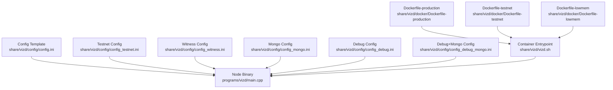
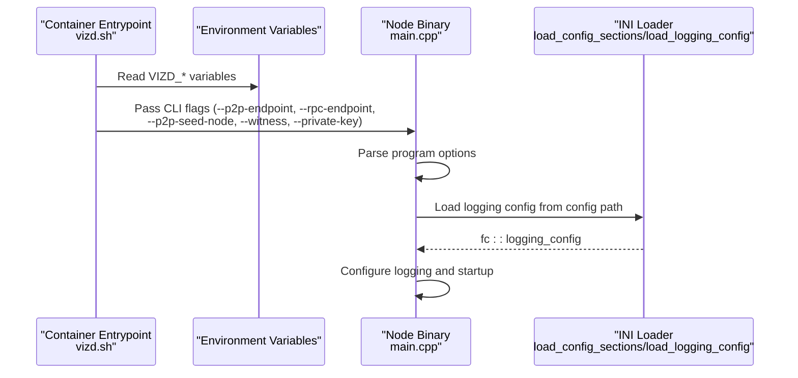
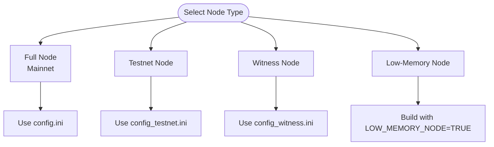
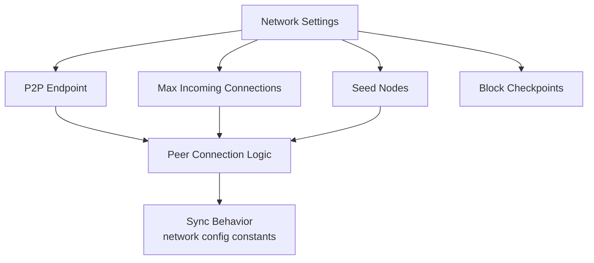
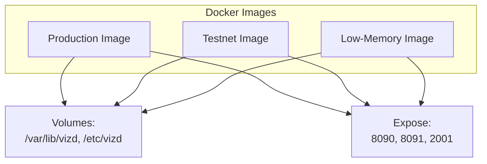
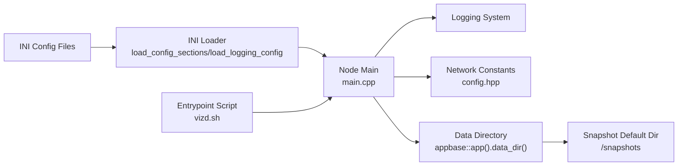

# Configuration Management

<cite>
**Referenced Files in This Document**
- [config.ini](file://share/vizd/config/config.ini)
- [config_testnet.ini](file://share/vizd/config/config_testnet.ini)
- [config_witness.ini](file://share/vizd/config/config_witness.ini)
- [config_mongo.ini](file://share/vizd/config/config_mongo.ini)
- [config_debug.ini](file://share/vizd/config/config_debug.ini)
- [config_debug_mongo.ini](file://share/vizd/config/config_debug_mongo.ini)
- [Dockerfile-production](file://share/vizd/docker/Dockerfile-production)
- [Dockerfile-testnet](file://share/vizd/docker/Dockerfile-testnet)
- [Dockerfile-lowmem](file://share/vizd/docker/Dockerfile-lowmem)
- [vizd.sh](file://share/vizd/vizd.sh)
- [main.cpp](file://programs/vizd/main.cpp)
- [config.hpp](file://libraries/network/include/graphene/network/config.hpp)
- [building.md](file://documentation/building.md)
- [testnet.md](file://documentation/testnet.md)
- [plugin.md](file://documentation/plugin.md)
- [witness.cpp](file://plugins/witness/witness.cpp)
- [config_testnet.hpp](file://libraries/protocol/include/graphene/protocol/config_testnet.hpp)
- [config.hpp](file://libraries/protocol/include/graphene/protocol/config.hpp)
- [snapshot-plugin.md](file://documentation/snapshot-plugin.md)
- [plugin.cpp](file://plugins/snapshot/plugin.cpp)
- [plugin.cpp](file://plugins/chain/plugin.cpp)
- [application.cpp](file://thirdparty/appbase/application.cpp)
</cite>

## Update Summary
**Changes Made**
- Updated snapshot directory default behavior section to reflect new data-directory-based default location
- Added documentation for enhanced snapshot configuration including trusted-snapshot-peer integration
- Updated snapshot configuration examples to show new default behavior and trusted peer options
- Enhanced troubleshooting guidance for snapshot-related configuration issues

## Table of Contents
1. [Introduction](#introduction)
2. [Project Structure](#project-structure)
3. [Core Components](#core-components)
4. [Architecture Overview](#architecture-overview)
5. [Detailed Component Analysis](#detailed-component-analysis)
6. [Dependency Analysis](#dependency-analysis)
7. [Performance Considerations](#performance-considerations)
8. [Troubleshooting Guide](#troubleshooting-guide)
9. [Conclusion](#conclusion)
10. [Appendices](#appendices)

## Introduction
This document describes the configuration management system for VIZ CPP Node. It explains configuration file structure, runtime parameters, environment variable overrides, node types (full node, witness node, low-memory node), network configuration, plugin activation, performance tuning, logging, Docker-specific configuration, build-time options, and troubleshooting guidance. Practical deployment scenarios (production, testnet, development) are included.

## Project Structure
The configuration system centers around:
- A primary configuration file template for mainnet
- Testnet-specific configuration
- Witness-specific configuration
- MongoDB-enabled configuration variants
- Dockerfiles for production, testnet, and low-memory builds
- A container entrypoint script that supports environment variable overrides
- The node binary's program options and logging configuration loader



**Diagram sources**
- [config.ini:1-136](file://share/vizd/config/config.ini#L1-L136)
- [config_testnet.ini:1-132](file://share/vizd/config/config_testnet.ini#L1-L132)
- [config_witness.ini:1-138](file://share/vizd/config/config_witness.ini#L1-L138)
- [config_mongo.ini:1-135](file://share/vizd/config/config_mongo.ini#L1-L135)
- [config_debug.ini:1-126](file://share/vizd/config/config_debug.ini#L1-L126)
- [config_debug_mongo.ini:1-135](file://share/vizd/config/config_debug_mongo.ini#L1-L135)
- [Dockerfile-production:1-88](file://share/vizd/docker/Dockerfile-production#L1-L88)
- [Dockerfile-testnet:1-88](file://share/vizd/docker/Dockerfile-testnet#L1-L88)
- [Dockerfile-lowmem:1-82](file://share/vizd/docker/Dockerfile-lowmem#L1-L82)
- [vizd.sh:1-82](file://share/vizd/vizd.sh#L1-L82)
- [main.cpp:106-158](file://programs/vizd/main.cpp#L106-L158)

**Section sources**
- [config.ini:1-136](file://share/vizd/config/config.ini#L1-L136)
- [config_testnet.ini:1-132](file://share/vizd/config/config_testnet.ini#L1-L132)
- [config_witness.ini:1-138](file://share/vizd/config/config_witness.ini#L1-L138)
- [config_mongo.ini:1-135](file://share/vizd/config/config_mongo.ini#L1-L135)
- [config_debug.ini:1-126](file://share/vizd/config/config_debug.ini#L1-L126)
- [config_debug_mongo.ini:1-135](file://share/vizd/config/config_debug_mongo.ini#L1-L135)
- [Dockerfile-production:1-88](file://share/vizd/docker/Dockerfile-production#L1-L88)
- [Dockerfile-testnet:1-88](file://share/vizd/docker/Dockerfile-testnet#L1-L88)
- [Dockerfile-lowmem:1-82](file://share/vizd/docker/Dockerfile-lowmem#L1-L82)
- [vizd.sh:1-82](file://share/vizd/vizd.sh#L1-L82)
- [main.cpp:106-158](file://programs/vizd/main.cpp#L106-L158)

## Core Components
- Configuration file format: INI-style with sections for logging appenders and loggers.
- Runtime parameters: Passed via program options and loaded from configuration.
- Environment variable overrides: Container entrypoint sets CLI flags based on environment variables.
- Plugin activation: Controlled via configuration entries.
- Logging configuration: Program options and INI sections define appenders and logger routing.

Key configuration categories:
- Network endpoints and connectivity
- RPC endpoints (HTTP/WebSocket)
- Lock/wait tuning for database operations
- Shared memory sizing and growth policy
- Plugin list and activation
- Witness production controls
- Logging configuration
- **Snapshot configuration** (updated with new default behavior)

**Section sources**
- [main.cpp:167-191](file://programs/vizd/main.cpp#L167-L191)
- [main.cpp:194-289](file://programs/vizd/main.cpp#L194-L289)
- [config.ini:1-136](file://share/vizd/config/config.ini#L1-L136)

## Architecture Overview
The configuration pipeline integrates configuration files, program options, and environment variables to initialize the node.



**Diagram sources**
- [vizd.sh:13-81](file://share/vizd/vizd.sh#L13-L81)
- [main.cpp:112-139](file://programs/vizd/main.cpp#L112-L139)
- [main.cpp:194-289](file://programs/vizd/main.cpp#L194-L289)

## Detailed Component Analysis

### Configuration File Structure and Sections
- Logging appenders:
  - Console appenders
  - File appenders
- Loggers:
  - Route loggers to specific appenders with levels

These sections are parsed by the node to configure logging at startup.

**Section sources**
- [main.cpp:167-191](file://programs/vizd/main.cpp#L167-L191)
- [main.cpp:211-289](file://programs/vizd/main.cpp#L211-L289)
- [config.ini:118-136](file://share/vizd/config/config.ini#L118-L136)

### Runtime Parameters and Program Options
Program options include logging configuration and standard node options. The node parses configuration files and applies logging settings accordingly.

**Section sources**
- [main.cpp:112-139](file://programs/vizd/main.cpp#L112-L139)
- [main.cpp:167-191](file://programs/vizd/main.cpp#L167-L191)

### Environment Variable Overrides (Docker)
The container entrypoint supports the following environment variables:
- VIZD_SEED_NODES: Comma-separated seed nodes
- VIZD_WITNESS_NAME: Witness name to operate
- VIZD_PRIVATE_KEY: Private key for signing
- VIZD_RPC_ENDPOINT: Override RPC endpoint
- VIZD_P2P_ENDPOINT: Override P2P endpoint
- VIZD_EXTRA_OPTS: Additional arguments appended to node invocation

These variables override defaults and inject CLI flags at runtime.

**Section sources**
- [vizd.sh:17-37](file://share/vizd/vizd.sh#L17-L37)
- [vizd.sh:62-72](file://share/vizd/vizd.sh#L62-L72)
- [vizd.sh:74-81](file://share/vizd/vizd.sh#L74-L81)

### Node Types and Their Configuration Requirements
- Full node (mainnet):
  - Uses the main configuration template with default plugin sets suitable for full synchronization and API exposure.
- Testnet:
  - Includes testnet-specific defaults and enables stale production for continuous block production.
- Witness node:
  - Activates witness and witness_api plugins, binds RPC endpoints to localhost by default, and includes witness credentials.
- Low-memory node:
  - Built with a dedicated flag to reduce memory footprint; Dockerfile demonstrates enabling this build-time option.



**Diagram sources**
- [config.ini:1-136](file://share/vizd/config/config.ini#L1-L136)
- [config_testnet.ini:1-132](file://share/vizd/config/config_testnet.ini#L1-L132)
- [config_witness.ini:1-138](file://share/vizd/config/config_witness.ini#L1-L138)
- [Dockerfile-lowmem:45-51](file://share/vizd/docker/Dockerfile-lowmem#L45-L51)
- [building.md:11-15](file://documentation/building.md#L11-L15)

**Section sources**
- [config.ini:73-85](file://share/vizd/config/config.ini#L73-L85)
- [config_testnet.ini:69-73](file://share/vizd/config/config_testnet.ini#L69-L73)
- [config_witness.ini:72-84](file://share/vizd/config/config_witness.ini#L72-L84)
- [building.md:11-15](file://documentation/building.md#L11-L15)
- [Dockerfile-lowmem:45-51](file://share/vizd/docker/Dockerfile-lowmem#L45-L51)

### Network Configuration
Network settings include:
- P2P endpoint binding and maximum connections
- Seed nodes for initial connectivity
- Checkpoint enforcement for block safety
- Peer connection and sync behavior governed by network constants



**Diagram sources**
- [config.ini:1-16](file://share/vizd/config/config.ini#L1-L16)
- [config_testnet.ini:1-11](file://share/vizd/config/config_testnet.ini#L1-L11)
- [config_witness.ini:1-15](file://share/vizd/config/config_witness.ini#L1-L15)
- [config.hpp:54-56](file://libraries/network/include/graphene/network/config.hpp#L54-L56)
- [config.hpp:105-106](file://libraries/network/include/graphene/network/config.hpp#L105-L106)

**Section sources**
- [config.ini:1-16](file://share/vizd/config/config.ini#L1-L16)
- [config_testnet.ini:1-11](file://share/vizd/config/config_testnet.ini#L1-L11)
- [config_witness.ini:1-15](file://share/vizd/config/config_witness.ini#L1-L15)
- [config.hpp:54-56](file://libraries/network/include/graphene/network/config.hpp#L54-L56)
- [config.hpp:105-106](file://libraries/network/include/graphene/network/config.hpp#L105-L106)

### Plugin Activation and Configuration
Plugins are activated via configuration entries. The node registers all built-in plugins and loads the configured set at startup. Some plugins maintain persistent state and may require replay when toggled.

- Example plugin lists appear in the configuration templates.
- The plugin documentation outlines enabling/disabling and replay requirements.

**Section sources**
- [config.ini:73-85](file://share/vizd/config/config.ini#L73-L85)
- [config_testnet.ini:69-73](file://share/vizd/config/config_testnet.ini#L69-L73)
- [config_witness.ini:72-84](file://share/vizd/config/config_witness.ini#L72-L84)
- [plugin.md:14-18](file://documentation/plugin.md#L14-L18)

### Performance Tuning Parameters
Key tunables include:
- Thread pool size for RPC clients
- Read/write lock wait durations and retries
- Single-threaded write mode for database operations
- Skipping plugin notifications on push transactions
- Shared memory size, minimum free space, increment, and free-space check frequency

These parameters influence throughput and stability under load.

**Section sources**
- [config.ini:17-72](file://share/vizd/config/config.ini#L17-L72)
- [config.ini:49-67](file://share/vizd/config/config.ini#L49-L67)

### Logging Configuration
Logging is configured via INI sections for appenders and loggers. The node exposes program options to define console/file appenders and logger routing.

- Console and file appenders
- Logger levels and appender assignments

**Section sources**
- [config.ini:118-136](file://share/vizd/config/config.ini#L118-L136)
- [main.cpp:167-191](file://programs/vizd/main.cpp#L167-L191)
- [main.cpp:211-289](file://programs/vizd/main.cpp#L211-L289)

### Snapshot Configuration and Default Directory Behavior

**Updated** The snapshot plugin now uses a data-directory-based default location instead of the current working directory fallback:

#### Default Directory Behavior
- **New default**: When `snapshot-dir` is not explicitly configured, the system now defaults to `<data_dir>/snapshots` instead of the current working directory
- **Data directory resolution**: The data directory is determined by the application's data_dir() method, typically located at `/var/lib/vizd` for production containers
- **Automatic creation**: The default snapshot directory is automatically created if it doesn't exist

#### Enhanced Trusted Peer Integration
The snapshot plugin now includes comprehensive trusted peer configuration options:

- **Trusted snapshot peers**: List of seed nodes that can serve snapshots to this node
- **Snapshot serving restrictions**: Control who can download snapshots from this node
- **Anti-spam protection**: Built-in rate limiting and connection management for snapshot serving
- **DLT mode support**: Optimized for distributed ledger technology nodes without full block history

#### Configuration Examples

**Basic snapshot configuration**:
```ini
plugin = snapshot
snapshot-dir = /var/lib/vizd/snapshots
snapshot-every-n-blocks = 2400
snapshot-max-age-days = 2
```

**Trusted peer configuration**:
```ini
plugin = snapshot
sync-snapshot-from-trusted-peer = true
trusted-snapshot-peer = 185.45.192.155:8092
trusted-snapshot-peer = 62.109.17.82:8092
snapshot-dir = /var/lib/vizd/snapshots
```

**Snapshot serving configuration**:
```ini
plugin = snapshot
allow-snapshot-serving = true
allow-snapshot-serving-only-trusted = false
snapshot-serve-endpoint = 0.0.0.0:8092
snapshot-dir = /var/lib/vizd/snapshots
```

**Section sources**
- [plugin.cpp:2974-2983](file://plugins/snapshot/plugin.cpp#L2974-L2983)
- [plugin.cpp:3044-3050](file://plugins/snapshot/plugin.cpp#L3044-L3050)
- [plugin.cpp:3070-3090](file://plugins/snapshot/plugin.cpp#L3070-L3090)
- [plugin.cpp:352-355](file://plugins/chain/plugin.cpp#L352-L355)
- [application.cpp:298-300](file://thirdparty/appbase/application.cpp#L298-L300)
- [snapshot-plugin.md:1-365](file://documentation/snapshot-plugin.md#L1-L365)

### Docker-Specific Configuration
- Production image:
  - Copies main configuration and seednodes into /etc/vizd
  - Exposes RPC and P2P ports
  - Mounts persistent volumes for data and config
- Testnet image:
  - Uses testnet configuration and snapshot
  - Enables testnet build flag
- Low-memory image:
  - Enables low-memory build flag



**Diagram sources**
- [Dockerfile-production:74-87](file://share/vizd/docker/Dockerfile-production#L74-L87)
- [Dockerfile-testnet:75-87](file://share/vizd/docker/Dockerfile-testnet#L75-L87)
- [Dockerfile-lowmem:68-81](file://share/vizd/docker/Dockerfile-lowmem#L68-L81)

**Section sources**
- [Dockerfile-production:74-87](file://share/vizd/docker/Dockerfile-production#L74-L87)
- [Dockerfile-testnet:75-87](file://share/vizd/docker/Dockerfile-testnet#L75-L87)
- [Dockerfile-lowmem:68-81](file://share/vizd/docker/Dockerfile-lowmem#L68-L81)

### Build-Time Configuration Options
Build-time flags and toggles:
- LOW_MEMORY_NODE: Builds a consensus-only low-memory node
- BUILD_TESTNET: Enables testnet-specific defaults
- CHAINBASE_CHECK_LOCKING: Debugging toggle
- ENABLE_MONGO_PLUGIN: Feature toggle for MongoDB plugin

These are set via CMake flags in Dockerfiles and documented in the building guide.

**Section sources**
- [building.md:11-15](file://documentation/building.md#L11-L15)
- [Dockerfile-production:46-52](file://share/vizd/docker/Dockerfile-production#L46-L52)
- [Dockerfile-testnet:46-52](file://share/vizd/docker/Dockerfile-testnet#L46-L52)
- [Dockerfile-lowmem:45-51](file://share/vizd/docker/Dockerfile-lowmem#L45-L51)

### Practical Configuration Scenarios

- Production deployment (mainnet)
  - Use the main configuration template and production Docker image.
  - Persist data via mounted volumes.
  - Optionally override endpoints and seed nodes via environment variables.
  - **Updated**: Snapshot directory will default to `/var/lib/vizd/snapshots` if not explicitly configured.

- Testnet setup
  - Use the testnet Docker image and configuration.
  - The testnet image enables testnet build flags and uses a testnet snapshot.
  - **Updated**: Trusted snapshot peers are pre-configured for testnet bootstrap.

- Development environment
  - Use the debug configuration templates to enable additional plugins and adjust logging.
  - Optionally enable MongoDB plugin configuration.

- Witness node
  - Use the witness configuration template and bind RPC endpoints to localhost.
  - Provide witness name and private key via environment variables.
  - **Updated**: Snapshot configuration supports witness-aware deferral to prevent missed production slots.

**Section sources**
- [config.ini:1-136](file://share/vizd/config/config.ini#L1-L136)
- [config_testnet.ini:1-132](file://share/vizd/config/config_testnet.ini#L1-L132)
- [config_witness.ini:1-138](file://share/vizd/config/config_witness.ini#L1-L138)
- [config_debug.ini:1-126](file://share/vizd/config/config_debug.ini#L1-L126)
- [config_mongo.ini:1-135](file://share/vizd/config/config_mongo.ini#L1-L135)
- [Dockerfile-production:74-87](file://share/vizd/docker/Dockerfile-production#L74-L87)
- [Dockerfile-testnet:75-87](file://share/vizd/docker/Dockerfile-testnet#L75-L87)
- [testnet.md:21-37](file://documentation/testnet.md#L21-L37)

## Dependency Analysis
Configuration dependencies and interactions:
- The node binary depends on the configuration loader to parse logging and runtime settings.
- Docker entrypoint depends on environment variables to inject CLI flags.
- Network behavior is influenced by both configuration and compiled-in network constants.
- **Updated**: Snapshot configuration depends on the application's data_dir() method for default directory resolution.



**Diagram sources**
- [main.cpp:194-289](file://programs/vizd/main.cpp#L194-L289)
- [vizd.sh:13-81](file://share/vizd/vizd.sh#L13-L81)
- [config.hpp:54-56](file://libraries/network/include/graphene/network/config.hpp#L54-L56)
- [application.cpp:298-300](file://thirdparty/appbase/application.cpp#L298-L300)

**Section sources**
- [main.cpp:194-289](file://programs/vizd/main.cpp#L194-L289)
- [vizd.sh:13-81](file://share/vizd/vizd.sh#L13-L81)
- [config.hpp:54-56](file://libraries/network/include/graphene/network/config.hpp#L54-L56)
- [application.cpp:298-300](file://thirdparty/appbase/application.cpp#L298-L300)

## Performance Considerations
- Tune read/write lock wait parameters to balance latency and contention.
- Use single-threaded writes to reduce database lock contention.
- Adjust shared memory size and growth thresholds to minimize resizing overhead.
- Limit plugin notifications on push transactions to improve responsiveness.
- Select appropriate node type (low-memory) for constrained environments.
- **Updated**: Configure snapshot directory on fast storage for optimal snapshot creation and loading performance.

## Troubleshooting Guide

### Witness Configuration Issues

**Updated** The witness configuration defaults have been updated to improve reliability and participation calculations:

- **enable-stale-production default changed**: The default value for `enable-stale-production` has been changed from `false` to `true`. This means witness nodes will now automatically continue producing blocks even when the chain appears stale, improving network resilience during network partitions or temporary forks.

- **required-participation calculation**: The `required-participation` parameter now uses the formula `33 * CHAIN_1_PERCENT` instead of a hardcoded percentage. With `CHAIN_1_PERCENT` equal to 100 (representing 1% in the 10000-point scale), this calculates to 3300, which represents 33% participation threshold.

- **Witness production failures**: If witness production is failing, check the participation threshold calculation. The system now requires at least 33% of witnesses to be participating for block production to continue.

### Snapshot Configuration Issues

**Updated** Common snapshot configuration issues and validation techniques:

- **Snapshot directory default behavior**
  - Verify that the data directory is properly mounted in Docker containers
  - Check that `/var/lib/vizd/snapshots` exists and has proper permissions
  - Use explicit `snapshot-dir` configuration when the default location is not suitable

- **Trusted peer configuration**
  - Verify that trusted snapshot peers are reachable and serving snapshots
  - Check firewall rules for port 8092 (snapshot serving)
  - Use `test-trusted-seeds` option to diagnose connectivity issues

- **Snapshot auto-discovery**
  - Ensure snapshot files follow the naming convention `snapshot-block-NNNNN.vizjson`
  - Verify that snapshot files are readable and not corrupted
  - Check that the snapshot directory contains valid snapshot files

- **Snapshot serving issues**
  - Verify that `allow-snapshot-serving` is properly configured
  - Check anti-spam settings if clients are being rate-limited
  - Monitor snapshot serving logs for connection errors

Common configuration issues and validation techniques:
- Logging misconfiguration
  - Verify INI sections for appenders and loggers.
  - Confirm program options for logging are recognized by the node.
- RPC/P2P endpoint conflicts
  - Ensure endpoints are reachable and not blocked by firewalls.
  - Validate environment variable overrides for endpoints.
- Plugin activation problems
  - Confirm plugin entries in configuration.
  - Review plugin documentation for replay requirements when toggling stateful plugins.
- Memory and shared file sizing
  - Adjust shared file size and growth increments based on observed free space checks.
- Docker volume and permissions
  - Ensure persistent volumes are mounted and owned by the node user.
  - Confirm snapshot extraction occurs when present.
- Witness production issues
  - Verify witness name and private key are correctly configured.
  - Check participation threshold calculations using the CHAIN_1_PERCENT constant.
  - Monitor for "low participation" errors indicating below-threshold witness participation.
- **Updated**: Snapshot configuration issues
  - Verify snapshot directory permissions and disk space
  - Check snapshot file integrity and naming conventions
  - Validate trusted peer connectivity and snapshot availability

**Section sources**
- [main.cpp:167-191](file://programs/vizd/main.cpp#L167-L191)
- [main.cpp:211-289](file://programs/vizd/main.cpp#L211-L289)
- [config.ini:118-136](file://share/vizd/config/config.ini#L118-L136)
- [plugin.md:14-18](file://documentation/plugin.md#L14-L18)
- [vizd.sh:44-53](file://share/vizd/vizd.sh#L44-L53)
- [witness.cpp:125-130](file://plugins/witness/witness.cpp#L125-L130)
- [config_testnet.hpp:57-59](file://libraries/protocol/include/graphene/protocol/config_testnet.hpp#L57-L59)
- [config.hpp:57-59](file://libraries/protocol/include/graphene/protocol/config.hpp#L57-L59)
- [plugin.cpp:2974-2983](file://plugins/snapshot/plugin.cpp#L2974-L2983)
- [plugin.cpp:3044-3050](file://plugins/snapshot/plugin.cpp#L3044-L3050)
- [plugin.cpp:3070-3090](file://plugins/snapshot/plugin.cpp#L3070-L3090)

## Conclusion
VIZ CPP Node offers a flexible configuration system combining INI-based settings, program options, and environment variable overrides. Different node types and deployment modes are supported through configuration templates and Docker images. Proper tuning of performance and logging parameters ensures reliable operation across production, testnet, and development environments. **Updated**: The snapshot configuration system now provides enhanced default behavior with data-directory-based snapshot directories and comprehensive trusted peer integration for improved bootstrap and distribution capabilities.

## Appendices

### Appendix A: Configuration Keys Reference
- Network
  - p2p-endpoint
  - p2p-max-connections
  - p2p-seed-node
  - checkpoint
- RPC
  - webserver-thread-pool-size
  - webserver-http-endpoint
  - webserver-ws-endpoint
- Database locks
  - read-wait-micro
  - max-read-wait-retries
  - write-wait-micro
  - max-write-wait-retries
  - single-write-thread
  - enable-plugins-on-push-transaction
- Shared memory
  - shared-file-size
  - min-free-shared-file-size
  - inc-shared-file-size
  - block-num-check-free-size
- Plugins
  - plugin (repeatable)
- Witness
  - enable-stale-production (default: true)
  - required-participation (default: 33% calculated as 33 * CHAIN_1_PERCENT)
  - witness
  - private-key
- Logging
  - log.console_appender.*
  - log.file_appender.*
  - logger.*
- **Updated** Snapshot
  - snapshot-at-block (default: 0)
  - snapshot-every-n-blocks (default: 0)
  - snapshot-dir (default: `<data_dir>/snapshots`)
  - snapshot-max-age-days (default: 0)
  - allow-snapshot-serving (default: false)
  - allow-snapshot-serving-only-trusted (default: false)
  - snapshot-serve-endpoint (default: 0.0.0.0:8092)
  - trusted-snapshot-peer (repeatable)
  - sync-snapshot-from-trusted-peer (default: false)
  - enable-stalled-sync-detection (default: false)
  - stalled-sync-timeout-minutes (default: 5)
  - test-trusted-seeds (default: false)
  - dlt-block-log-max-blocks (default: 100000)

**Updated** Witness configuration defaults now use improved defaults for better network reliability and accurate participation calculations.

**Section sources**
- [config.ini:1-136](file://share/vizd/config/config.ini#L1-L136)
- [config_testnet.ini:1-132](file://share/vizd/config/config_testnet.ini#L1-L132)
- [config_witness.ini:1-138](file://share/vizd/config/config_witness.ini#L1-L138)
- [config_mongo.ini:1-135](file://share/vizd/config/config_mongo.ini#L1-L135)
- [config_debug.ini:1-126](file://share/vizd/config/config_debug.ini#L1-L126)
- [config_debug_mongo.ini:1-135](file://share/vizd/config/config_debug_mongo.ini#L1-L135)
- [witness.cpp:125-130](file://plugins/witness/witness.cpp#L125-L130)
- [config_testnet.hpp:57-59](file://libraries/protocol/include/graphene/protocol/config_testnet.hpp#L57-L59)
- [config.hpp:57-59](file://libraries/protocol/include/graphene/protocol/config.hpp#L57-L59)
- [plugin.cpp:2974-2983](file://plugins/snapshot/plugin.cpp#L2974-L2983)
- [plugin.cpp:3044-3050](file://plugins/snapshot/plugin.cpp#L3044-L3050)
- [plugin.cpp:3070-3090](file://plugins/snapshot/plugin.cpp#L3070-L3090)

### Appendix B: Docker Environment Variables
- VIZD_SEED_NODES
- VIZD_WITNESS_NAME
- VIZD_PRIVATE_KEY
- VIZD_RPC_ENDPOINT
- VIZD_P2P_ENDPOINT
- VIZD_EXTRA_OPTS

**Section sources**
- [vizd.sh:17-37](file://share/vizd/vizd.sh#L17-L37)
- [vizd.sh:62-72](file://share/vizd/vizd.sh#L62-L72)
- [vizd.sh:74-81](file://share/vizd/vizd.sh#L74-L81)

### Appendix C: Witness Participation Calculation Details

**New** The witness participation calculation system now uses the CHAIN_1_PERCENT constant for precise percentage calculations:

- **CHAIN_1_PERCENT definition**: Defined as `CHAIN_100_PERCENT/100` where `CHAIN_100_PERCENT` equals 10000
- **Participation threshold**: Default required participation is 33% (3300/10000)
- **Calculation method**: `required-participation = 33 * CHAIN_1_PERCENT`
- **Precision**: Uses 10000-point scale for accurate percentage representation

This change ensures more accurate participation calculations and consistent behavior across mainnet and testnet configurations.

**Section sources**
- [witness.cpp:125-130](file://plugins/witness/witness.cpp#L125-L130)
- [config_testnet.hpp:57-59](file://libraries/protocol/include/graphene/protocol/config_testnet.hpp#L57-L59)
- [config.hpp:57-59](file://libraries/protocol/include/graphene/protocol/config.hpp#L57-L59)

### Appendix D: Snapshot Configuration Best Practices

**New** Best practices for snapshot configuration:

- **Default directory behavior**: The system now defaults to `<data_dir>/snapshots` instead of current working directory
- **Volume mounting**: Ensure `/var/lib/vizd` volume is properly mounted in Docker containers
- **Trusted peer selection**: Choose reliable snapshot peers with good uptime and bandwidth
- **Anti-spam configuration**: Use `allow-snapshot-serving-only-trusted` for private networks
- **Monitoring**: Regularly check snapshot directory disk usage and cleanup old snapshots
- **Security**: Restrict snapshot serving to trusted peers in production environments
- **Performance**: Store snapshots on fast storage devices for optimal loading performance

**Section sources**
- [plugin.cpp:2974-2983](file://plugins/snapshot/plugin.cpp#L2974-L2983)
- [plugin.cpp:3044-3050](file://plugins/snapshot/plugin.cpp#L3044-L3050)
- [plugin.cpp:3070-3090](file://plugins/snapshot/plugin.cpp#L3070-L3090)
- [snapshot-plugin.md:1-365](file://documentation/snapshot-plugin.md#L1-L365)