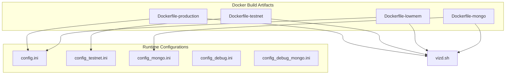
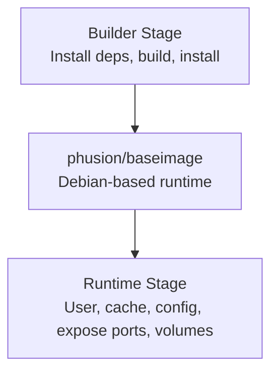
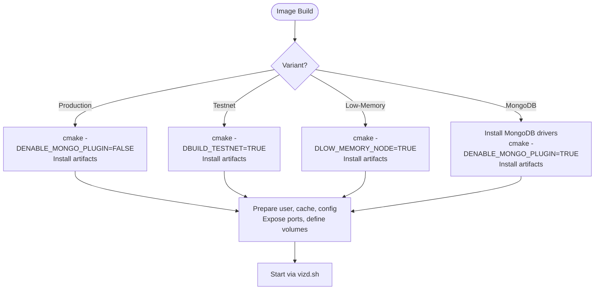
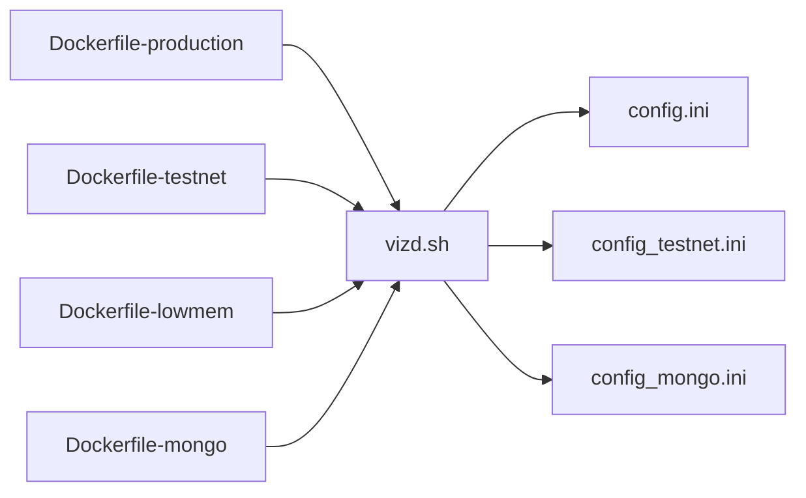

# Docker Configuration

<cite>
**Referenced Files in This Document**
- [Dockerfile-production](file://share/vizd/docker/Dockerfile-production)
- [Dockerfile-testnet](file://share/vizd/docker/Dockerfile-testnet)
- [Dockerfile-lowmem](file://share/vizd/docker/Dockerfile-lowmem)
- [Dockerfile-mongo](file://share/vizd/docker/Dockerfile-mongo)
- [vizd.sh](file://share/vizd/vizd.sh)
- [config.ini](file://share/vizd/config/config.ini)
- [config_testnet.ini](file://share/vizd/config/config_testnet.ini)
- [config_mongo.ini](file://share/vizd/config/config_mongo.ini)
- [config_debug.ini](file://share/vizd/config/config_debug.ini)
- [config_debug_mongo.ini](file://share/vizd/config/config_debug_mongo.ini)
- [docker-main.yml](file://.github/workflows/docker-main.yml)
- [docker-pr-build.yml](file://.github/workflows/docker-pr-build.yml)
- [README.md](file://README.md)
</cite>

## Table of Contents
1. [Introduction](#introduction)
2. [Project Structure](#project-structure)
3. [Core Components](#core-components)
4. [Architecture Overview](#architecture-overview)
5. [Detailed Component Analysis](#detailed-component-analysis)
6. [Dependency Analysis](#dependency-analysis)
7. [Performance Considerations](#performance-considerations)
8. [Troubleshooting Guide](#troubleshooting-guide)
9. [Conclusion](#conclusion)
10. [Appendices](#appendices)

## Introduction
This document provides comprehensive Docker configuration guidance for deploying the VIZ C++ Node in containers. It covers available Docker images (production, testnet, low-memory, and MongoDB variants), environment variables, persistent storage via volumes, network exposure, and operational patterns. It also documents image customization, base image selection, security considerations, monitoring and logging, and update procedures.

## Project Structure
The Docker assets and configuration are organized under share/vizd/docker and share/vizd/config. The runtime bootstrap script is located at share/vizd/vizd.sh. Automated builds are defined in GitHub Actions workflows.

**Diagram sources**
- [Dockerfile-production](file://share/vizd/docker/Dockerfile-production#L1-L88)
- [Dockerfile-testnet](file://share/vizd/docker/Dockerfile-testnet#L1-L88)
- [Dockerfile-lowmem](file://share/vizd/docker/Dockerfile-lowmem#L1-L82)
- [Dockerfile-mongo](file://share/vizd/docker/Dockerfile-mongo#L1-L111)
- [vizd.sh](file://share/vizd/vizd.sh#L1-L82)
- [config.ini](file://share/vizd/config/config.ini#L1-L130)
- [config_testnet.ini](file://share/vizd/config/config_testnet.ini#L1-L132)
- [config_mongo.ini](file://share/vizd/config/config_mongo.ini#L1-L135)

**Section sources**
- [Dockerfile-production](file://share/vizd/docker/Dockerfile-production#L1-L88)
- [Dockerfile-testnet](file://share/vizd/docker/Dockerfile-testnet#L1-L88)
- [Dockerfile-lowmem](file://share/vizd/docker/Dockerfile-lowmem#L1-L82)
- [Dockerfile-mongo](file://share/vizd/docker/Dockerfile-mongo#L1-L111)
- [vizd.sh](file://share/vizd/vizd.sh#L1-L82)
- [config.ini](file://share/vizd/config/config.ini#L1-L130)
- [config_testnet.ini](file://share/vizd/config/config_testnet.ini#L1-L132)
- [config_mongo.ini](file://share/vizd/config/config_mongo.ini#L1-L135)

## Core Components
- Production image: Built from Dockerfile-production, targeting the mainnet with standard configuration and exposed ports for RPC and P2P.
- Testnet image: Built from Dockerfile-testnet, configured for testnet with pre-set testnet endpoints and plugins.
- Low-memory image: Built from Dockerfile-lowmem, optimized for constrained environments with reduced memory footprint.
- MongoDB-enabled image: Built from Dockerfile-mongo, including MongoDB drivers and enabling the mongo_db plugin with a default connection URI.

Key runtime behavior is orchestrated by the entrypoint script (vizd.sh), which sets up user permissions, applies environment overrides, initializes optional cached blockchain data, and starts the node with appropriate endpoints and arguments.

**Section sources**
- [Dockerfile-production](file://share/vizd/docker/Dockerfile-production#L66-L88)
- [Dockerfile-testnet](file://share/vizd/docker/Dockerfile-testnet#L67-L88)
- [Dockerfile-lowmem](file://share/vizd/docker/Dockerfile-lowmem#L60-L82)
- [Dockerfile-mongo](file://share/vizd/docker/Dockerfile-mongo#L89-L111)
- [vizd.sh](file://share/vizd/vizd.sh#L1-L82)

## Architecture Overview
The container architecture consists of:
- Base image: phusion/baseimage variants for Debian-based environments.
- Build stage: installs build dependencies, clones repository, initializes submodules, builds release binaries, and installs artifacts.
- Runtime stage: creates a non-root user, prepares cache and config directories, exposes RPC and P2P ports, defines persistent volumes, and starts the node via an init service.

**Diagram sources**
- [Dockerfile-production](file://share/vizd/docker/Dockerfile-production#L1-L88)
- [Dockerfile-testnet](file://share/vizd/docker/Dockerfile-testnet#L1-L88)
- [Dockerfile-lowmem](file://share/vizd/docker/Dockerfile-lowmem#L1-L82)
- [Dockerfile-mongo](file://share/vizd/docker/Dockerfile-mongo#L1-L111)

## Detailed Component Analysis

### Docker Images and Variants
- Production image
  - Purpose: Run on the main VIZ network.
  - Build parameters: standard build with MongoDB disabled.
  - Exposed ports: RPC HTTP (8090), RPC WS (8091), P2P (2001).
  - Persistent volumes: /var/lib/vizd (blockchain data), /etc/vizd (configuration).
  - Entrypoint script: sets defaults and starts node.
  - Reference: [Dockerfile-production](file://share/vizd/docker/Dockerfile-production#L1-L88), [vizd.sh](file://share/vizd/vizd.sh#L1-L82), [config.ini](file://share/vizd/config/config.ini#L1-L130)

- Testnet image
  - Purpose: Run on the testnet.
  - Build parameters: BUILD_TESTNET enabled, MongoDB disabled.
  - Exposed ports: same as production.
  - Persistent volumes: same as production.
  - Entrypoint script: same behavior, with testnet-specific defaults.
  - Reference: [Dockerfile-testnet](file://share/vizd/docker/Dockerfile-testnet#L1-L88), [config_testnet.ini](file://share/vizd/config/config_testnet.ini#L1-L132)

- Low-memory image
  - Purpose: Constrained environments.
  - Build parameters: LOW_MEMORY_NODE enabled, MongoDB disabled.
  - Exposed ports: same as production.
  - Persistent volumes: same as production.
  - Reference: [Dockerfile-lowmem](file://share/vizd/docker/Dockerfile-lowmem#L1-L82)

- MongoDB-enabled image
  - Purpose: Enable historical indexing and analytics via MongoDB.
  - Build parameters: ENABLE_MONGO_PLUGIN enabled, installs MongoDB C/C++ drivers.
  - Exposed ports: same as production.
  - Persistent volumes: same as production.
  - MongoDB URI: configured in the MongoDB-enabled config.
  - Reference: [Dockerfile-mongo](file://share/vizd/docker/Dockerfile-mongo#L1-L111), [config_mongo.ini](file://share/vizd/config/config_mongo.ini#L1-L135)

**Diagram sources**
- [Dockerfile-production](file://share/vizd/docker/Dockerfile-production#L40-L59)
- [Dockerfile-testnet](file://share/vizd/docker/Dockerfile-testnet#L40-L55)
- [Dockerfile-lowmem](file://share/vizd/docker/Dockerfile-lowmem#L39-L53)
- [Dockerfile-mongo](file://share/vizd/docker/Dockerfile-mongo#L31-L82)
- [vizd.sh](file://share/vizd/vizd.sh#L1-L82)

**Section sources**
- [Dockerfile-production](file://share/vizd/docker/Dockerfile-production#L1-L88)
- [Dockerfile-testnet](file://share/vizd/docker/Dockerfile-testnet#L1-L88)
- [Dockerfile-lowmem](file://share/vizd/docker/Dockerfile-lowmem#L1-L82)
- [Dockerfile-mongo](file://share/vizd/docker/Dockerfile-mongo#L1-L111)

### Environment Variables
The container supports the following environment variables to customize runtime behavior:
- VIZD_SEED_NODES: Space-delimited list of seed nodes to connect to at startup. Overrides default seed list.
- VIZD_WITNESS_NAME: Name of the witness to operate when block production is enabled.
- VIZD_PRIVATE_KEY: Private key for signing blocks (when operating a witness).
- VIZD_RPC_ENDPOINT: RPC endpoint binding (default: 0.0.0.0:8090).
- VIZD_P2P_ENDPOINT: P2P endpoint binding (default: 0.0.0.0:2001).
- VIZD_EXTRA_OPTS: Additional command-line options appended to the node invocation.

Behavior is implemented in the entrypoint script, which constructs arguments, copies the packaged config into the data directory, and starts the node with the chosen endpoints and optional cached blockchain initialization.

**Section sources**
- [vizd.sh](file://share/vizd/vizd.sh#L13-L81)
- [config.ini](file://share/vizd/config/config.ini#L16-L20)
- [config_testnet.ini](file://share/vizd/config/config_testnet.ini#L16-L20)

### Volume Mounting Strategies
Persistent data storage relies on two primary volumes:
- /var/lib/vizd: Contains blockchain data (including the blockchain directory and cache).
- /etc/vizd: Contains configuration files and seednode lists.

Mounting strategy recommendations:
- Bind mounts for durability and backups: map /var/lib/vizd to a host directory for long-term persistence.
- Config override: mount a host config.ini into /etc/vizd/config.ini to customize RPC endpoints, plugins, and logging without rebuilding images.
- Seednodes override: mount a custom seednodes file into /etc/vizd/seednodes to tailor connectivity.

Exposed ports:
- RPC HTTP: 8090/tcp
- RPC WS: 8091/tcp
- P2P: 2001/tcp

These are defined in the Dockerfiles and used by the entrypoint script.

**Section sources**
- [Dockerfile-production](file://share/vizd/docker/Dockerfile-production#L74-L87)
- [Dockerfile-testnet](file://share/vizd/docker/Dockerfile-testnet#L75-L87)
- [Dockerfile-lowmem](file://share/vizd/docker/Dockerfile-lowmem#L68-L81)
- [Dockerfile-mongo](file://share/vizd/docker/Dockerfile-mongo#L97-L110)
- [vizd.sh](file://share/vizd/vizd.sh#L62-L72)

### Network Configuration
- Default RPC endpoints are configurable via environment variables; otherwise, defaults bind to 0.0.0.0 on ports 8090 (HTTP) and 8091 (WS).
- P2P endpoint defaults to 0.0.0.0:2001.
- Port exposure is defined per image; ensure firewall and orchestration platforms allow inbound connections on these ports.
- Seed nodes are either taken from the packaged seednodes file or overridden via VIZD_SEED_NODES.

**Section sources**
- [vizd.sh](file://share/vizd/vizd.sh#L62-L72)
- [config.ini](file://share/vizd/config/config.ini#L1-L20)
- [config_testnet.ini](file://share/vizd/config/config_testnet.ini#L1-L20)

### Image Customization and Base Image Selection
- Base image: phusion/baseimage variants are used across images. The production and testnet images use a newer variant, while the low-memory and MongoDB images use an older variant.
- Build customization:
  - Production: standard build with MongoDB disabled.
  - Testnet: enables BUILD_TESTNET.
  - Low-memory: enables LOW_MEMORY_NODE.
  - MongoDB: installs MongoDB C/C++ drivers and enables ENABLE_MONGO_PLUGIN.
- Debug configurations: separate debug configs are provided for development and MongoDB-enabled debug setups.

**Section sources**
- [Dockerfile-production](file://share/vizd/docker/Dockerfile-production#L1-L88)
- [Dockerfile-testnet](file://share/vizd/docker/Dockerfile-testnet#L1-L88)
- [Dockerfile-lowmem](file://share/vizd/docker/Dockerfile-lowmem#L1-L82)
- [Dockerfile-mongo](file://share/vizd/docker/Dockerfile-mongo#L31-L82)
- [config_debug.ini](file://share/vizd/config/config_debug.ini#L1-L126)
- [config_debug_mongo.ini](file://share/vizd/config/config_debug_mongo.ini#L1-L135)

### Security Considerations
- Non-root execution: the runtime stage creates a dedicated non-root user and sets ownership on cache and data directories.
- Minimal attack surface: images exclude unnecessary packages post-build and rely on minimal base images.
- Secrets handling: private keys and sensitive configuration should be mounted from secure volumes or managed via secret stores in orchestrators.
- Network exposure: restrict inbound access to RPC and P2P ports using firewalls and reverse proxies as appropriate.

**Section sources**
- [Dockerfile-production](file://share/vizd/docker/Dockerfile-production#L69-L77)
- [Dockerfile-testnet](file://share/vizd/docker/Dockerfile-testnet#L70-L77)
- [Dockerfile-lowmem](file://share/vizd/docker/Dockerfile-lowmem#L63-L71)
- [Dockerfile-mongo](file://share/vizd/docker/Dockerfile-mongo#L92-L100)

### Monitoring and Logging
- Logging configuration is defined in the packaged config files. Logs are written to files under the data directory according to the configured appenders and loggers.
- For production deployments, consider mounting a writable logs directory or integrating with container-native logging stacks.
- Health checks and metrics are not defined in the images; deploy external monitoring and alerting as needed.

**Section sources**
- [config.ini](file://share/vizd/config/config.ini#L111-L130)
- [config_testnet.ini](file://share/vizd/config/config_testnet.ini#L113-L132)
- [config_mongo.ini](file://share/vizd/config/config_mongo.ini#L116-L135)
- [config_debug.ini](file://share/vizd/config/config_debug.ini#L107-L126)
- [config_debug_mongo.ini](file://share/vizd/config/config_debug_mongo.ini#L116-L135)

### Practical Deployment Patterns
- Standalone container
  - Run the production image and map ports 8090, 8091, and 2001.
  - Override RPC/P2P endpoints via environment variables if needed.
  - Persist data via a bind mount to /var/lib/vizd.
  - Reference: [README.md](file://README.md#L21-L29), [Dockerfile-production](file://share/vizd/docker/Dockerfile-production#L74-L87)

- Testnet node
  - Use the testnet image tag and adjust seed nodes if required.
  - Reference: [README.md](file://README.md#L16-L20), [Dockerfile-testnet](file://share/vizd/docker/Dockerfile-testnet#L75-L87)

- Witness node
  - Set VIZD_WITNESS_NAME and VIZD_PRIVATE_KEY to operate a witness.
  - Reference: [vizd.sh](file://share/vizd/vizd.sh#L31-L37)

- MongoDB analytics node
  - Use the MongoDB-enabled image and configure mongodb-uri in the mounted config.
  - Reference: [Dockerfile-mongo](file://share/vizd/docker/Dockerfile-mongo#L97-L110), [config_mongo.ini](file://share/vizd/config/config_mongo.ini#L71-L72)

- Development environment
  - Use debug configurations and enable debug plugins for development and testing.
  - Reference: [config_debug.ini](file://share/vizd/config/config_debug.ini#L69-L126), [config_debug_mongo.ini](file://share/vizd/config/config_debug_mongo.ini#L69-L135)

**Section sources**
- [README.md](file://README.md#L12-L53)
- [Dockerfile-production](file://share/vizd/docker/Dockerfile-production#L74-L87)
- [Dockerfile-testnet](file://share/vizd/docker/Dockerfile-testnet#L75-L87)
- [Dockerfile-mongo](file://share/vizd/docker/Dockerfile-mongo#L97-L110)
- [vizd.sh](file://share/vizd/vizd.sh#L31-L37)
- [config_debug.ini](file://share/vizd/config/config_debug.ini#L69-L126)
- [config_debug_mongo.ini](file://share/vizd/config/config_debug_mongo.ini#L69-L135)

### Container Orchestration and Multi-Container Scenarios
- Single-node deployment: run one container with mapped volumes and ports.
- Multi-node deployment: run multiple containers with distinct data directories and optionally different seed nodes.
- MongoDB stack: when using the MongoDB-enabled image, deploy a MongoDB instance alongside the node container and configure the mongodb-uri accordingly.
- Reverse proxy: front RPC endpoints with a reverse proxy for TLS termination and rate limiting.

[No sources needed since this section provides general guidance]

### Docker Registry Usage, Versioning, and Updates
- Official image repository: vizblockchain/vizd on Docker Hub.
- Tags:
  - latest: production image built from master.
  - testnet: testnet image built from master.
- Automated builds:
  - Master branch pushes trigger builds for both production and testnet images.
  - Pull requests trigger testnet image builds with ref-based tagging.
- Update procedure:
  - Pull the target tag.
  - Stop the running container.
  - Recreate the container with updated image and preserved volumes.

**Section sources**
- [README.md](file://README.md#L14-L20)
- [docker-main.yml](file://.github/workflows/docker-main.yml#L1-L41)
- [docker-pr-build.yml](file://.github/workflows/docker-pr-build.yml#L1-L24)

## Dependency Analysis
The runtime depends on:
- Entrypoint script for argument construction and startup.
- Configuration files for RPC endpoints, plugins, and logging.
- Persistent volumes for blockchain data and configuration.

**Diagram sources**
- [Dockerfile-production](file://share/vizd/docker/Dockerfile-production#L74-L76)
- [Dockerfile-testnet](file://share/vizd/docker/Dockerfile-testnet#L76-L77)
- [Dockerfile-mongo](file://share/vizd/docker/Dockerfile-mongo#L99-L100)
- [vizd.sh](file://share/vizd/vizd.sh#L39-L42)
- [config.ini](file://share/vizd/config/config.ini#L1-L130)
- [config_testnet.ini](file://share/vizd/config/config_testnet.ini#L1-L132)
- [config_mongo.ini](file://share/vizd/config/config_mongo.ini#L1-L135)

**Section sources**
- [vizd.sh](file://share/vizd/vizd.sh#L1-L82)
- [config.ini](file://share/vizd/config/config.ini#L1-L130)
- [config_testnet.ini](file://share/vizd/config/config_testnet.ini#L1-L132)
- [config_mongo.ini](file://share/vizd/config/config_mongo.ini#L1-L135)

## Performance Considerations
- Shared memory sizing: tune shared-file-size and related parameters in the configuration to balance memory usage and performance.
- Plugin selection: disable unused plugins to reduce overhead.
- Single write thread: the configuration encourages single-write-thread to mitigate lock contention.
- Low-memory variant: use the low-memory image when running on constrained hardware.

[No sources needed since this section provides general guidance]

## Troubleshooting Guide
Common issues and resolutions:
- Ports already in use
  - Ensure host ports 8090, 8091, and 2001 are free or remap to different host ports.
  - Verify container port exposure matches published ports.
  - References: [Dockerfile-production](file://share/vizd/docker/Dockerfile-production#L79-L87), [Dockerfile-testnet](file://share/vizd/docker/Dockerfile-testnet#L79-L87)

- Permission denied on data directory
  - Confirm the non-root user owns /var/lib/vizd after initial run.
  - Reference: [Dockerfile-production](file://share/vizd/docker/Dockerfile-production#L70-L72)

- No connectivity to peers
  - Override seed nodes via VIZD_SEED_NODES or mount a custom seednodes file.
  - Reference: [vizd.sh](file://share/vizd/vizd.sh#L17-L29), [README.md](file://README.md#L31-L39)

- Blockchain initialization delays
  - Cached blockchain data may be unpacked on first run; allow time for decompression.
  - Reference: [vizd.sh](file://share/vizd/vizd.sh#L44-L53)

- MongoDB plugin connectivity
  - Ensure mongodb-uri is reachable from the container network and credentials are correct.
  - Reference: [config_mongo.ini](file://share/vizd/config/config_mongo.ini#L71-L72), [Dockerfile-mongo](file://share/vizd/docker/Dockerfile-mongo#L97-L100)

**Section sources**
- [Dockerfile-production](file://share/vizd/docker/Dockerfile-production#L70-L87)
- [Dockerfile-testnet](file://share/vizd/docker/Dockerfile-testnet#L70-L87)
- [vizd.sh](file://share/vizd/vizd.sh#L17-L53)
- [README.md](file://README.md#L31-L39)
- [config_mongo.ini](file://share/vizd/config/config_mongo.ini#L71-L72)

## Conclusion
The VIZ C++ Node provides multiple Docker images tailored for production, testnet, low-memory, and MongoDB-enabled deployments. By leveraging environment variables, persistent volumes, and the packaged configurations, operators can quickly deploy reliable and secure nodes. Automated CI builds maintain official images, and the modular design allows for flexible customization and operational patterns.

[No sources needed since this section summarizes without analyzing specific files]

## Appendices

### Environment Variable Reference
- VIZD_SEED_NODES: Seed nodes to connect to.
- VIZD_WITNESS_NAME: Witness name for block production.
- VIZD_PRIVATE_KEY: Private key for signing blocks.
- VIZD_RPC_ENDPOINT: RPC endpoint binding.
- VIZD_P2P_ENDPOINT: P2P endpoint binding.
- VIZD_EXTRA_OPTS: Additional CLI options.

**Section sources**
- [vizd.sh](file://share/vizd/vizd.sh#L17-L81)

### Ports Reference
- RPC HTTP: 8090
- RPC WS: 8091
- P2P: 2001

**Section sources**
- [Dockerfile-production](file://share/vizd/docker/Dockerfile-production#L79-L87)
- [Dockerfile-testnet](file://share/vizd/docker/Dockerfile-testnet#L79-L87)
- [Dockerfile-lowmem](file://share/vizd/docker/Dockerfile-lowmem#L73-L81)
- [Dockerfile-mongo](file://share/vizd/docker/Dockerfile-mongo#L102-L110)