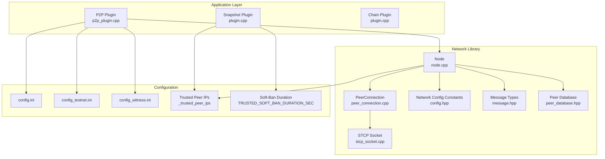
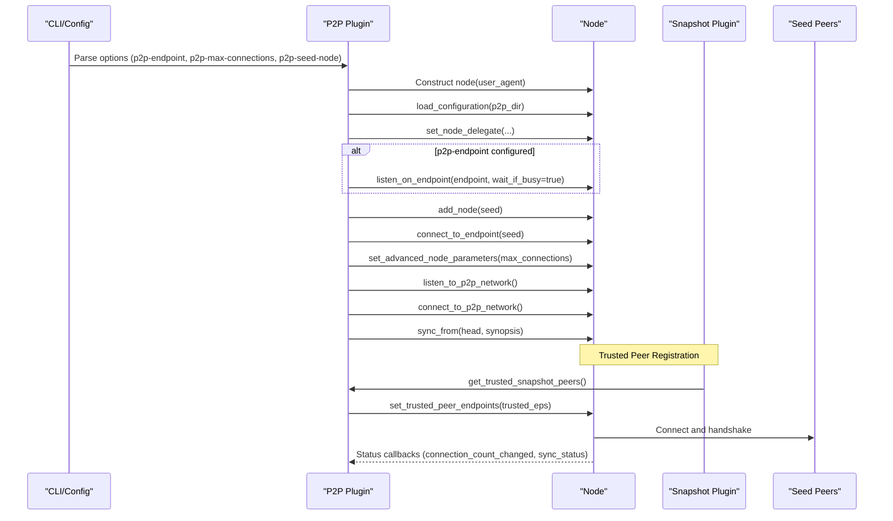
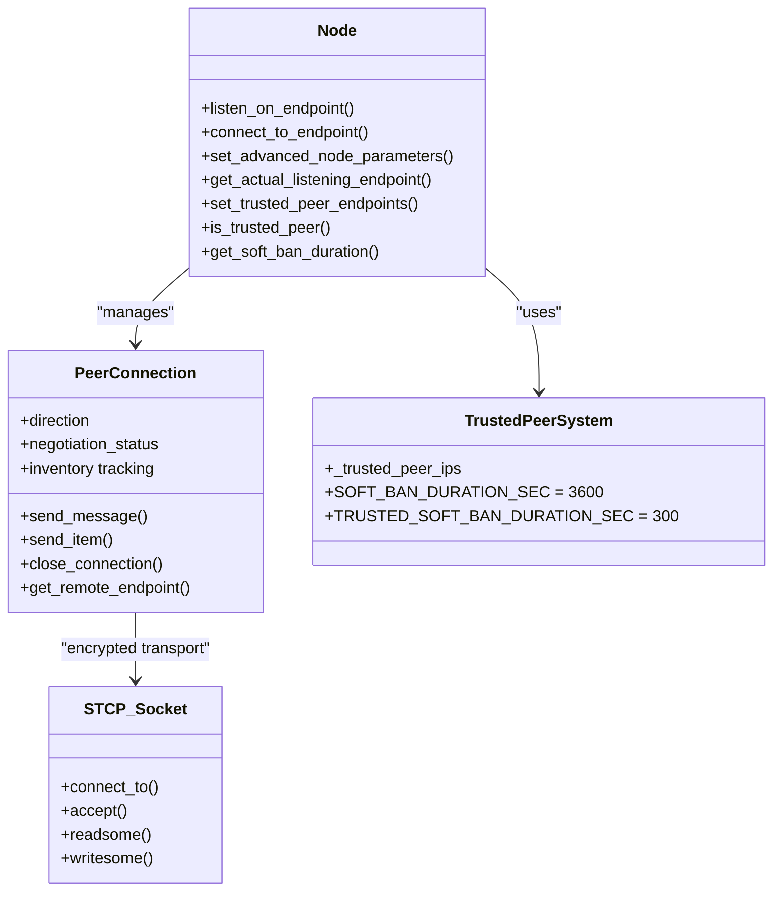
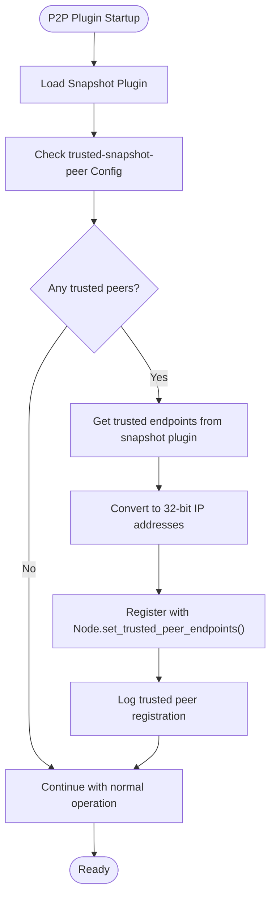
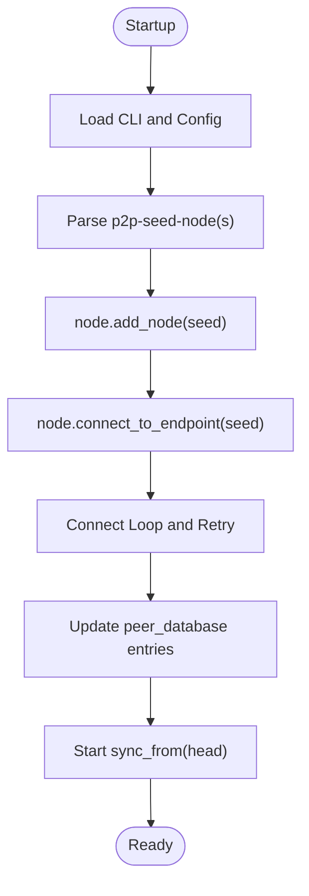
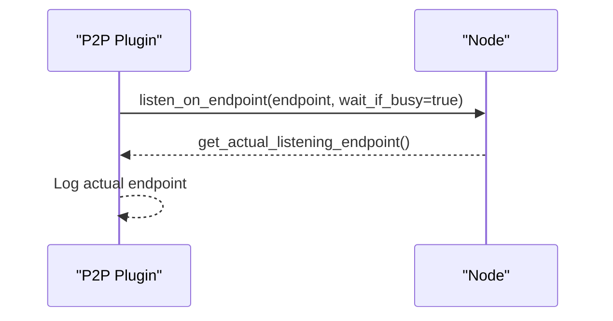
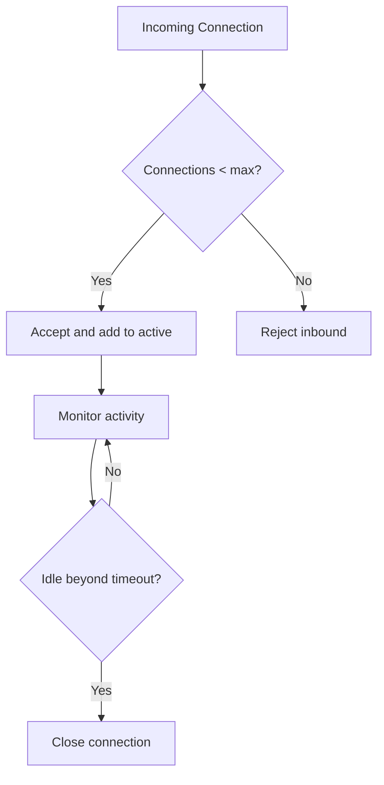
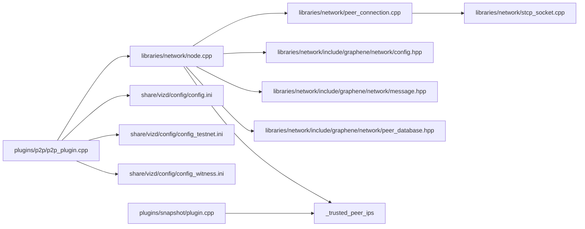

# Network Configuration

<cite>
**Referenced Files in This Document**
- [config.hpp](file://libraries/network/include/graphene/network/config.hpp)
- [node.cpp](file://libraries/network/node.cpp)
- [peer_connection.cpp](file://libraries/network/peer_connection.cpp)
- [stcp_socket.cpp](file://libraries/network/stcp_socket.cpp)
- [p2p_plugin.cpp](file://plugins/p2p/p2p_plugin.cpp)
- [config.ini](file://share/vizd/config/config.ini)
- [config_testnet.ini](file://share/vizd/config/config_testnet.ini)
- [config_witness.ini](file://share/vizd/config/config_witness.ini)
- [node.hpp](file://libraries/network/include/graphene/network/node.hpp)
- [peer_database.hpp](file://libraries/network/include/graphene/network/peer_database.hpp)
- [message.hpp](file://libraries/network/include/graphene/network/message.hpp)
- [plugin.hpp](file://plugins/snapshot/include/graphene/plugins/snapshot/plugin.hpp)
- [plugin.cpp](file://plugins/snapshot/plugin.cpp)
- [snapshot-plugin.md](file://documentation/snapshot-plugin.md)
</cite>

## Update Summary
**Changes Made**
- Added comprehensive documentation for the new trusted peer support system
- Documented the trusted-snapshot-peer configuration option and its integration with P2P soft-ban reduction
- Updated soft-ban duration documentation (5 minutes for trusted peers vs 1 hour for regular peers)
- Enhanced P2P integration section covering automatic trusted peer endpoint registration
- Updated practical deployment examples to include trusted peer configuration

## Table of Contents
1. [Introduction](#introduction)
2. [Project Structure](#project-structure)
3. [Core Components](#core-components)
4. [Architecture Overview](#architecture-overview)
5. [Detailed Component Analysis](#detailed-component-analysis)
6. [Dependency Analysis](#dependency-analysis)
7. [Performance Considerations](#performance-considerations)
8. [Troubleshooting Guide](#troubleshooting-guide)
9. [Conclusion](#conclusion)
10. [Appendices](#appendices)

## Introduction
This document provides comprehensive network configuration guidance for the VIZ CPP Node peer-to-peer (P2P) networking stack. It covers peer connection settings, seed node configuration, network discovery mechanisms, listen address and port configuration, firewall considerations, security settings, connection limits, performance tuning, bandwidth management, and monitoring. Practical examples are included for private networks, testnets, and mainnet-like deployments.

**Updated** The configuration system now includes a sophisticated trusted peer support system with reduced soft-ban duration for trusted peers and automatic integration with the snapshot plugin for enhanced network bootstrapping capabilities.

## Project Structure
The P2P networking is implemented in the network library and integrated via the P2P plugin. Configuration is primarily driven by command-line options and configuration files, with enhanced integration through the snapshot plugin for trusted peer management.

**Diagram sources**
- [p2p_plugin.cpp:689-698](file://plugins/p2p/p2p_plugin.cpp#L689-L698)
- [node.cpp:5254-5274](file://libraries/network/node.cpp#L5254-L5274)
- [plugin.cpp:714-715](file://plugins/snapshot/plugin.cpp#L714-L715)
- [config.ini:96-101](file://share/vizd/config/config.ini#L96-L101)
- [node.cpp:592-600](file://libraries/network/node.cpp#L592-L600)

**Section sources**
- [p2p_plugin.cpp:689-698](file://plugins/p2p/p2p_plugin.cpp#L689-L698)
- [node.cpp:5254-5274](file://libraries/network/node.cpp#L5254-L5274)
- [plugin.cpp:714-715](file://plugins/snapshot/plugin.cpp#L714-L715)
- [config.ini:96-101](file://share/vizd/config/config.ini#L96-L101)

## Core Components
- P2P Plugin: Parses CLI and config options, initializes the Node, sets advanced parameters, and starts listening/connecting.
- Node: Manages P2P lifecycle, connection orchestration, sync loops, rate limiting, bandwidth monitoring, and trusted peer soft-ban management.
- PeerConnection: Encapsulates per-peer state, encryption handshake, send queues, and inventory tracking.
- STCP Socket: Provides encrypted transport using ephemeral ECDH key exchange and AES-based stream cipher.
- Configuration Constants: Defines protocol version, ports, defaults, timeouts, limits, and performance parameters.
- Message Types: Defines the wire-level message header and serialization.
- Peer Database: Tracks potential peers, connection attempts, and outcomes.
- **Trusted Peer System**: New component that manages trusted peer endpoints and reduces soft-ban duration for improved network bootstrapping.

Key configuration entry points:
- CLI options: p2p-endpoint, p2p-max-connections, p2p-seed-node, p2p-force-validate.
- Config file keys: p2p-endpoint, p2p-max-connections, p2p-seed-node, loggers, **trusted-snapshot-peer**.
- **Trusted Peer Configuration**: Multiple trusted-snapshot-peer entries for reduced soft-ban duration.

**Updated** Configuration now includes trusted peer support with reduced soft-ban duration and automatic integration with the snapshot plugin.

**Section sources**
- [p2p_plugin.cpp:689-698](file://plugins/p2p/p2p_plugin.cpp#L689-L698)
- [node.cpp:5254-5274](file://libraries/network/node.cpp#L5254-L5274)
- [plugin.cpp:714-715](file://plugins/snapshot/plugin.cpp#L714-L715)
- [config.ini:96-101](file://share/vizd/config/config.ini#L96-L101)

## Architecture Overview
High-level P2P flow from plugin initialization to network operation, including trusted peer integration.

**Diagram sources**
- [p2p_plugin.cpp:689-706](file://plugins/p2p/p2p_plugin.cpp#L689-L706)
- [node.cpp:5254-5274](file://libraries/network/node.cpp#L5254-L5274)

## Detailed Component Analysis

### Peer Connection Settings and Security
- Encryption and Handshake:
  - Ephemeral ECDH key exchange performed during connection establishment.
  - Shared secret used to derive AES cipher keys for bidirectional encryption.
  - Transport ensures confidentiality and integrity for all P2P messages.
- Connection States and Lifecycle:
  - PeerConnection tracks direction, negotiation status, and connection states.
  - Queued message transmission with backpressure and maximum queue size enforcement.
  - Automatic closure on excessive queued message size.
- Inventory and Throttling:
  - Per-peer inventory lists with time-based expiry.
  - Transaction and block inventory limits to prevent memory pressure.
- Firewall and NAT Awareness:
  - Node determines firewall status and tracks publicly visible listening endpoint.
  - Peer records include inbound/outbound ports for NAT traversal hints.
- **Soft-Ban Management**:
  - **Default duration**: 1 hour (3600 seconds) for regular peers.
  - **Trusted peers**: Reduced to 5 minutes (300 seconds) soft-ban duration.
  - Automatic soft-ban duration adjustment based on peer trust status.

**Diagram sources**
- [peer_connection.cpp:68-162](file://libraries/network/peer_connection.cpp#L68-L162)
- [stcp_socket.cpp:37-92](file://libraries/network/stcp_socket.cpp#L37-L92)
- [node.cpp:5254-5274](file://libraries/network/node.cpp#L5254-L5274)
- [node.cpp:592-600](file://libraries/network/node.cpp#L592-L600)

**Section sources**
- [peer_connection.cpp:68-162](file://libraries/network/peer_connection.cpp#L68-L162)
- [stcp_socket.cpp:37-92](file://libraries/network/stcp_socket.cpp#L37-L92)
- [node.cpp:5254-5274](file://libraries/network/node.cpp#L5254-L5274)
- [node.cpp:592-600](file://libraries/network/node.cpp#L592-L600)

### Trusted Peer Support System
- **Trusted Peer Configuration**:
  - Configured via multiple `trusted-snapshot-peer` entries in config.ini.
  - Supports IP:port format for each trusted peer endpoint.
  - Automatically parsed and registered during P2P plugin initialization.
- **Automatic Integration**:
  - P2P plugin automatically queries snapshot plugin for trusted peer endpoints.
  - Trusted peer IPs are converted to 32-bit integers for O(1) lookup performance.
  - Registered trusted peers receive reduced soft-ban duration (5 minutes vs 1 hour).
- **Soft-Ban Duration Management**:
  - Default soft-ban: 3600 seconds (1 hour) for regular peers.
  - Trusted peers: 300 seconds (5 minutes) soft-ban duration.
  - Dynamic duration calculation based on peer trust status.
- **Logging and Monitoring**:
  - Logs registration of trusted peers with count and duration information.
  - Clear distinction between regular and trusted peer soft-ban behavior.

**Diagram sources**
- [p2p_plugin.cpp:689-698](file://plugins/p2p/p2p_plugin.cpp#L689-L698)
- [node.cpp:5254-5274](file://libraries/network/node.cpp#L5254-L5274)

**Section sources**
- [p2p_plugin.cpp:689-698](file://plugins/p2p/p2p_plugin.cpp#L689-L698)
- [node.cpp:5254-5274](file://libraries/network/node.cpp#L5254-L5274)
- [plugin.cpp:714-715](file://plugins/snapshot/plugin.cpp#L714-L715)

### Seed Node Configuration and Discovery
- Seed Nodes:
  - Configured via CLI option p2p-seed-node and/or config file key p2p-seed-node.
  - Multiple seeds supported; each is added and connected to during startup.
  - Integrated directly into config.ini without external file management.
- Peer Database:
  - Tracks potential peers, last seen time, disposition, and connection attempt counts.
  - Used to manage retry/backoff and selection of peers for outbound connections.

**Diagram sources**
- [p2p_plugin.cpp:497-521](file://plugins/p2p/p2p_plugin.cpp#L497-L521)
- [node.cpp:780-785](file://libraries/network/node.cpp#L780-L785)
- [peer_database.hpp:47-71](file://libraries/network/include/graphene/network/peer_database.hpp#L47-L71)

**Section sources**
- [p2p_plugin.cpp:497-521](file://plugins/p2p/p2p_plugin.cpp#L497-L521)
- [peer_database.hpp:47-71](file://libraries/network/include/graphene/network/peer_database.hpp#L47-L71)

### Listen Address, Port, and Endpoint Management
- Listen Endpoint:
  - Configured via CLI p2p-endpoint or config key p2p-endpoint.
  - Node binds to the specified IP:port; supports waiting if port is busy.
  - Actual listening endpoint is recorded and exposed for diagnostics.
- Ports:
  - Standardized default P2P port is 2001 for mainnet configurations.
  - Testnet uses 4243 as specified in config_testnet.ini.
  - Users can override port in config or CLI.

**Updated** Mainnet now uses standardized port 2001 instead of legacy 4243.

**Diagram sources**
- [p2p_plugin.cpp:537-540](file://plugins/p2p/p2p_plugin.cpp#L537-L540)
- [node.cpp:786-792](file://libraries/network/node.cpp#L786-L792)

**Section sources**
- [p2p_plugin.cpp:487-495](file://plugins/p2p/p2p_plugin.cpp#L487-L495)
- [node.cpp:786-792](file://libraries/network/node.cpp#L786-L792)
- [config.hpp:52-56](file://libraries/network/include/graphene/network/config.hpp#L52-L56)

### Firewall and NAT Considerations
- Firewall Detection:
  - Node periodically sends firewall check messages and tracks state.
  - Publicly visible listening endpoint is recorded when known.
- Inbound vs Outbound:
  - Inbound connections are accepted on the bound endpoint.
  - Outbound connections are initiated to seed nodes and peers discovered via inventory.

**Section sources**
- [node.cpp:441-445](file://libraries/network/node.cpp#L441-L445)
- [peer_connection.cpp:169-206](file://libraries/network/peer_connection.cpp#L169-L206)

### Security Settings and Authentication
- Transport Security:
  - STCP socket performs ECDH key exchange and AES encryption for all traffic.
- Node Identity:
  - Node configuration includes a node identity keypair; used in hello/user data.
- Authentication:
  - No explicit node authentication or TLS certificate verification is implemented in the referenced code; encryption is provided by STCP.

**Section sources**
- [stcp_socket.cpp:49-66](file://libraries/network/stcp_socket.cpp#L49-L66)
- [node.cpp:223-239](file://libraries/network/node.cpp#L223-L239)

### Connection Limits and Timeouts
- Connection Limits:
  - Desired and maximum connections are configurable via advanced parameters.
  - Node enforces acceptance policy based on current connection count.
- Timeouts:
  - Handshake inactivity timeout and disconnect timeout constants are defined.
  - Inactivity-based disconnection is enforced during operation.

**Diagram sources**
- [config.hpp:48-50](file://libraries/network/include/graphene/network/config.hpp#L48-L50)
- [node.cpp:638-640](file://libraries/network/node.cpp#L638-L640)

**Section sources**
- [config.hpp:48-50](file://libraries/network/include/graphene/network/config.hpp#L48-L50)
- [node.cpp:518-526](file://libraries/network/node.cpp#L518-L526)

### Bandwidth Management and Rate Limiting
- Rate Limiting:
  - Node maintains a rate limiting group for outbound traffic.
- Bandwidth Monitoring:
  - Rolling averages for read/write speeds are tracked and updated periodically.
- Message Queue Backpressure:
  - Maximum queued message size enforced per-peer; oversized queues trigger closure.

**Section sources**
- [node.cpp:548-567](file://libraries/network/node.cpp#L548-L567)
- [peer_connection.cpp:314-325](file://libraries/network/peer_connection.cpp#L314-L325)

### Network Performance Tuning Parameters
- Defaults and Limits:
  - Default desired and maximum connections, retry intervals, and message sizes are defined.
  - Transaction rate limit and inventory retention windows are tunable via constants.
- Sync Behavior:
  - Prefetch thresholds and batch sizes influence sync throughput.
- **Soft-Ban Optimization**:
  - Trusted peers benefit from reduced soft-ban duration for faster recovery.
  - Improved network bootstrapping and sync performance.

**Section sources**
- [config.hpp:55-106](file://libraries/network/include/graphene/network/config.hpp#L55-L106)
- [node.cpp:592-600](file://libraries/network/node.cpp#L592-L600)

### Practical Deployment Examples

#### Private Network
- Configure a private listen endpoint and a small set of seed nodes.
- Adjust p2p-max-connections for expected peer count.
- Disable external exposure by binding to localhost or internal subnet.

Example keys:
- p2p-endpoint = 10.0.0.5:2001
- p2p-max-connections = 10
- p2p-seed-node = 10.0.0.10:2001

**Updated** Using standardized port 2001 instead of legacy 4243.

**Section sources**
- [config.ini:1-136](file://share/vizd/config/config.ini#L1-L136)

#### Testnet
- Use testnet-specific defaults and endpoints.
- Enable witness participation and adjust required participation as needed.

Example keys:
- p2p-endpoint = 0.0.0.0:4243
- p2p-seed-node = (testnet seed IPs)
- enable-stale-production = true

**Section sources**
- [config_testnet.ini:1-132](file://share/vizd/config/config_testnet.ini#L1-L132)

#### Mainnet-like Deployment
- Bind to public IP and port 2001; ensure firewall/NAT traversal is configured.
- Increase p2p-max-connections for high-throughput nodes.
- Monitor bandwidth and tune rate limiting.

Example keys:
- p2p-endpoint = 0.0.0.0:2001
- p2p-max-connections = 200
- p2p-seed-node = (mainnet seed IPs)

**Updated** Mainnet now standardized to port 2001 for consistent deployment.

#### Trusted Peer Deployment
- Configure trusted-snapshot-peer entries for reliable network bootstrapping.
- Set sync-snapshot-from-trusted-peer to true for automatic snapshot-based bootstrapping.
- Benefit from reduced soft-ban duration (5 minutes vs 1 hour) for trusted peers.

Example keys:
- p2p-endpoint = 0.0.0.0:2001
- p2p-max-connections = 200
- p2p-seed-node = (mainnet seed IPs)
- sync-snapshot-from-trusted-peer = true
- trusted-snapshot-peer = 185.45.192.155:8092
- trusted-snapshot-peer = 62.109.17.82:8092

**Updated** Added trusted peer configuration for enhanced network bootstrapping and reduced soft-ban duration.

**Section sources**
- [config.ini:1-136](file://share/vizd/config/config.ini#L1-L136)
- [config.hpp:52-56](file://libraries/network/include/graphene/network/config.hpp#L52-L56)
- [config.ini:96-101](file://share/vizd/config/config.ini#L96-L101)

## Dependency Analysis

**Diagram sources**
- [p2p_plugin.cpp:689-698](file://plugins/p2p/p2p_plugin.cpp#L689-L698)
- [node.cpp:5254-5274](file://libraries/network/node.cpp#L5254-L5274)
- [plugin.cpp:714-715](file://plugins/snapshot/plugin.cpp#L714-L715)
- [config.ini:96-101](file://share/vizd/config/config.ini#L96-L101)

**Section sources**
- [p2p_plugin.cpp:689-698](file://plugins/p2p/p2p_plugin.cpp#L689-L698)
- [node.cpp:5254-5274](file://libraries/network/node.cpp#L5254-L5274)
- [plugin.cpp:714-715](file://plugins/snapshot/plugin.cpp#L714-L715)
- [config.ini:96-101](file://share/vizd/config/config.ini#L96-L101)

## Performance Considerations
- Tune p2p-max-connections to balance throughput and resource usage.
- Monitor bandwidth metrics and adjust rate limiting if necessary.
- Prefer outbound connections to stable, high-bandwidth peers.
- Keep inventory sizes reasonable to avoid memory pressure during floods.
- **Trusted Peer Benefits**:
  - Reduced soft-ban duration (5 minutes vs 1 hour) for faster recovery from transient errors.
  - Improved network bootstrapping performance with trusted snapshot peers.
  - Enhanced sync reliability during network partitions or peer unavailability.

## Troubleshooting Guide
Common issues and remedies:
- Connection Issues:
  - Verify p2p-endpoint bind address and port availability.
  - Ensure firewall allows inbound connections on the configured port.
  - Confirm seed nodes are reachable and not rate-limited.
- Latency Problems:
  - Reduce p2p-max-connections to lower contention.
  - Monitor bandwidth metrics and adjust rate limiting.
- Peer Discovery Failures:
  - Check peer_database entries for repeated failures.
  - Increase retry delays and verify network connectivity.
- **Trusted Peer Issues**:
  - Verify trusted-snapshot-peer configuration entries are valid IP:port pairs.
  - Check that snapshot plugin is properly loaded and reporting trusted peers.
  - Monitor logs for trusted peer registration success messages.
  - Ensure soft-ban duration is correctly applied (5 minutes vs 1 hour).

Operational hooks:
- Node delegates connection_count_changed and sync_status for monitoring.
- Logs for P2P subsystem are configurable via logging appenders.
- **Trusted Peer Logging**: Automatic registration and soft-ban duration logging.

**Section sources**
- [p2p_plugin.cpp:403-405](file://plugins/p2p/p2p_plugin.cpp#L403-L405)
- [config.ini:112-136](file://share/vizd/config/config.ini#L112-L136)
- [node.cpp:5259-5262](file://libraries/network/node.cpp#L5259-L5262)

## Conclusion
The VIZ CPP Node P2P stack provides a robust, encrypted transport with configurable connection limits, bandwidth monitoring, and seed-driven discovery. The recent additions of trusted peer support significantly enhance network bootstrapping capabilities with reduced soft-ban duration (5 minutes vs 1 hour) and automatic integration with the snapshot plugin. The standardization of port 2001 for mainnet deployments and integration of seed node management through config.ini simplify configuration and improve consistency. The trusted peer system enables faster recovery from transient errors, improved sync performance, and more reliable network bootstrapping. Correctly setting listen endpoints, ports, connection caps, and trusted peer configurations, combined with appropriate firewall and NAT configuration, enables reliable operation across private, testnet, and mainnet environments. Monitoring and tuning of rate limits, inventory sizes, and trusted peer benefits further improves resilience under load.

## Appendices

### Configuration Options Summary
- p2p-endpoint: Local IP:port to listen for P2P connections (standardized to 2001 for mainnet).
- p2p-max-connections: Maximum number of simultaneous connections.
- p2p-seed-node: Remote peer IP:port to bootstrap discovery (configured in config.ini).
- p2p-force-validate: Force validation of all transactions.
- **trusted-snapshot-peer**: Trusted peer IP:port for reduced soft-ban duration and enhanced bootstrapping.
- **sync-snapshot-from-trusted-peer**: Enable automatic snapshot-based bootstrapping from trusted peers.

**Updated** Mainnet now uses standardized port 2001 and integrated seed node configuration, plus new trusted peer support system.

**Section sources**
- [p2p_plugin.cpp:467-482](file://plugins/p2p/p2p_plugin.cpp#L467-L482)
- [config.ini:1-136](file://share/vizd/config/config.ini#L1-L136)
- [config_testnet.ini:1-132](file://share/vizd/config/config_testnet.ini#L1-L132)
- [config_witness.ini:1-107](file://share/vizd/config/config_witness.ini#L1-L107)
- [config.ini:96-101](file://share/vizd/config/config.ini#L96-L101)
- [node.cpp:592-600](file://libraries/network/node.cpp#L592-L600)