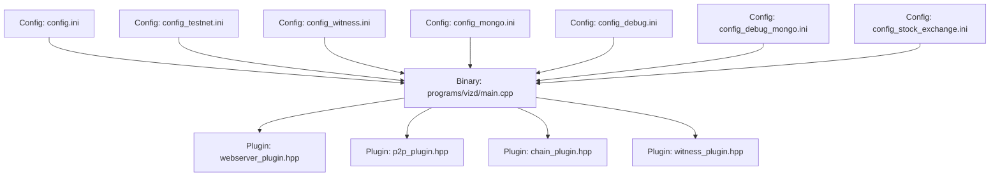
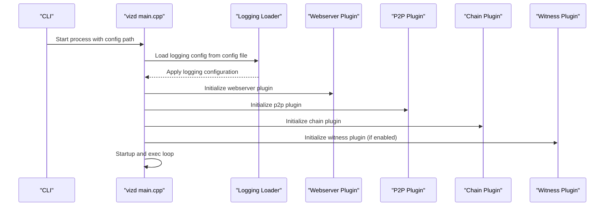
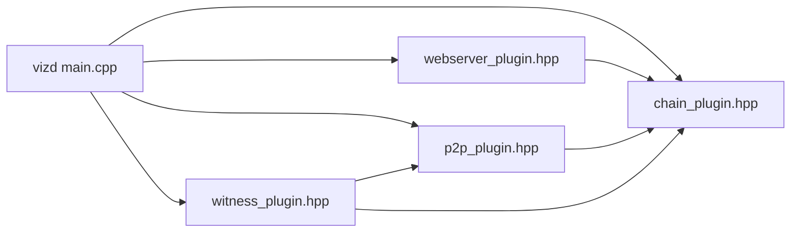

# Node Configuration

<cite>
**Referenced Files in This Document**
- [config.ini](file://share/vizd/config/config.ini)
- [config_testnet.ini](file://share/vizd/config/config_testnet.ini)
- [config_witness.ini](file://share/vizd/config/config_witness.ini)
- [config_mongo.ini](file://share/vizd/config/config_mongo.ini)
- [config_debug.ini](file://share/vizd/config/config_debug.ini)
- [config_debug_mongo.ini](file://share/vizd/config/config_debug_mongo.ini)
- [config_stock_exchange.ini](file://share/vizd/config/config_stock_exchange.ini)
- [main.cpp](file://programs/vizd/main.cpp)
- [webserver_plugin.hpp](file://plugins/webserver/include/graphene/plugins/webserver/webserver_plugin.hpp)
- [p2p_plugin.hpp](file://plugins/p2p/include/graphene/plugins/p2p/p2p_plugin.hpp)
- [chain_plugin.hpp](file://plugins/chain/include/graphene/plugins/chain/plugin.hpp)
- [witness_plugin.hpp](file://plugins/witness/include/graphene/plugins/witness/witness.hpp)
- [config.hpp](file://libraries/protocol/include/graphene/protocol/config.hpp)
- [Dockerfile-production](file://share/vizd/docker/Dockerfile-production)
- [Dockerfile-lowmem](file://share/vizd/docker/Dockerfile-lowmem)
</cite>

## Table of Contents
1. [Introduction](#introduction)
2. [Project Structure](#project-structure)
3. [Core Components](#core-components)
4. [Architecture Overview](#architecture-overview)
5. [Detailed Component Analysis](#detailed-component-analysis)
6. [Dependency Analysis](#dependency-analysis)
7. [Performance Considerations](#performance-considerations)
8. [Troubleshooting Guide](#troubleshooting-guide)
9. [Conclusion](#conclusion)
10. [Appendices](#appendices)

## Introduction
This document provides comprehensive guidance for configuring a VIZ CPP Node. It explains the configuration file structure, available parameters, defaults, and acceptable ranges. It also covers different node types (full node, witness node, low-memory node, testnet node), essential settings (database location, plugin activation, network parameters, performance tuning), authentication and API access controls, security configurations, and practical deployment examples. Finally, it includes validation tips, syntax guidance, and organizational best practices for configuration files.

## Project Structure
The configuration system centers around a primary configuration file and several prebuilt templates for different deployment profiles. The node binary loads plugins and applies logging configuration from the same file.

**Diagram sources**
- [config.ini](file://share/vizd/config/config.ini#L1-L130)
- [config_testnet.ini](file://share/vizd/config/config_testnet.ini#L1-L132)
- [config_witness.ini](file://share/vizd/config/config_witness.ini#L1-L107)
- [config_mongo.ini](file://share/vizd/config/config_mongo.ini#L1-L135)
- [config_debug.ini](file://share/vizd/config/config_debug.ini#L1-L126)
- [config_debug_mongo.ini](file://share/vizd/config/config_debug_mongo.ini#L1-L135)
- [config_stock_exchange.ini](file://share/vizd/config/config_stock_exchange.ini#L1-L114)
- [main.cpp](file://programs/vizd/main.cpp#L106-L158)
- [webserver_plugin.hpp](file://plugins/webserver/include/graphene/plugins/webserver/webserver_plugin.hpp#L32-L57)
- [p2p_plugin.hpp](file://plugins/p2p/include/graphene/plugins/p2p/p2p_plugin.hpp#L18-L52)
- [chain_plugin.hpp](file://plugins/chain/include/graphene/plugins/chain/plugin.hpp#L21-L96)
- [witness_plugin.hpp](file://plugins/witness/include/graphene/plugins/witness/witness_plugin.hpp#L34-L65)

**Section sources**
- [config.ini](file://share/vizd/config/config.ini#L1-L130)
- [main.cpp](file://programs/vizd/main.cpp#L106-L158)

## Core Components
This section enumerates the most important configuration parameters grouped by category, with purpose, default value, and acceptable ranges where applicable.

- Network and P2P
  - p2p-endpoint: IP:PORT for P2P listener. Default varies by template; see [config.ini](file://share/vizd/config/config.ini#L2-L2), [config_testnet.ini](file://share/vizd/config/config_testnet.ini#L2-L2), [config_witness.ini](file://share/vizd/config/config_witness.ini#L2-L2).
  - p2p-max-connections: Integer; default unset (plugin-specific behavior). See [config.ini](file://share/vizd/config/config.ini#L5-L5).
  - p2p-seed-node: Repeatable; default unset. See [config.ini](file://share/vizd/config/config.ini#L8-L8).
  - checkpoint: Repeatable; pairs [BLOCK_NUM,BLOCK_ID]; default unset. See [config.ini](file://share/vizd/config/config.ini#L11-L11).

- Webserver and RPC
  - webserver-thread-pool-size: Integer; default 2. See [config.ini](file://share/vizd/config/config.ini#L14-L14).
  - webserver-http-endpoint: IP:PORT; default 0.0.0.0:8090. See [config.ini](file://share/vizd/config/config.ini#L17-L17).
  - webserver-ws-endpoint: IP:PORT; default 0.0.0.0:8091. See [config.ini](file://share/vizd/config/config.ini#L20-L20).

- Locking and Concurrency
  - read-wait-micro: Integer microseconds; default 500000. See [config.ini](file://share/vizd/config/config.ini#L23-L23).
  - max-read-wait-retries: Integer retries; default 2. See [config.ini](file://share/vizd/config/config.ini#L27-L27).
  - write-wait-micro: Integer microseconds; default 500000. See [config.ini](file://share/vizd/config/config.ini#L30-L30).
  - max-write-wait-retries: Integer retries; default 3. See [config.ini](file://share/vizd/config/config.ini#L34-L34).
  - single-write-thread: Boolean; default true. See [config.ini](file://share/vizd/config/config.ini#L40-L40).
  - enable-plugins-on-push-transaction: Boolean; default false. See [config.ini](file://share/vizd/config/config.ini#L47-L47).

- Shared Memory and Disk
  - shared-file-size: Size string; default 2G. See [config.ini](file://share/vizd/config/config.ini#L54-L54).
  - min-free-shared-file-size: Size string; default 500M. See [config.ini](file://share/vizd/config/config.ini#L58-L58).
  - inc-shared-file-size: Size string; default 2G. See [config.ini](file://share/vizd/config/config.ini#L62-L62).
  - block-num-check-free-size: Integer blocks; default 1000. See [config.ini](file://share/vizd/config/config.ini#L67-L67).

- Plugin Activation
  - plugin: Repeatable; list of plugin names. Defaults vary by template. See [config.ini](file://share/vizd/config/config.ini#L69-L73), [config_testnet.ini](file://share/vizd/config/config_testnet.ini#L69-L73), [config_witness.ini](file://share/vizd/config/config_witness.ini#L68-L68).

- History and Tracking
  - clear-votes-before-block: Integer block number; default 0. See [config.ini](file://share/vizd/config/config.ini#L76-L76).
  - skip-virtual-ops: Boolean; default false. See [config.ini](file://share/vizd/config/config.ini#L79-L79).
  - track-account-range: JSON pair ["from","to"]; default unset. See [config.ini](file://share/vizd/config/config.ini#L82-L82).
  - history-whitelist-ops: List of operation types; default unset. See [config.ini](file://share/vizd/config/config.ini#L85-L85).
  - history-blacklist-ops: List of operation types; default unset. See [config.ini](file://share/vizd/config/config.ini#L88-L88).
  - history-start-block: Integer block number; default unset. See [config.ini](file://share/vizd/config/config.ini#L91-L91).
  - follow-max-feed-size: Integer; default 500. See [config.ini](file://share/vizd/config/config.ini#L94-L94).
  - pm-account-range: JSON pair ["from","to"]; default unset. See [config.ini](file://share/vizd/config/config.ini#L97-L97).

- Witness Production
  - enable-stale-production: Boolean; default false (production), true (testnet). See [config.ini](file://share/vizd/config/config.ini#L100-L100), [config_testnet.ini](file://share/vizd/config/config_testnet.ini#L100-L100).
  - required-participation: Integer percentage (0–99); default unset (plugin default). See [config.ini](file://share/vizd/config/config.ini#L103-L103), [config_testnet.ini](file://share/vizd/config/config_testnet.ini#L103-L103).
  - witness: String name; default unset (non-witness), "committee" (testnet). See [config.ini](file://share/vizd/config/config.ini#L106-L106), [config_testnet.ini](file://share/vizd/config/config_testnet.ini#L106-L106).
  - private-key: WIF key; default unset (non-witness), testnet committee key shown. See [config.ini](file://share/vizd/config/config.ini#L109-L109), [config_testnet.ini](file://share/vizd/config/config_testnet.ini#L111-L111).

- MongoDB (when enabled)
  - mongodb-uri: URI string; default unset. See [config_mongo.ini](file://share/vizd/config/config_mongo.ini#L72-L72), [config_debug_mongo.ini](file://share/vizd/config/config_debug_mongo.ini#L72-L72).

- Logging Configuration
  - log.console_appender.<name>.stream: Stream target; default std_error. See [config.ini](file://share/vizd/config/config.ini#L113-L113), [main.cpp](file://programs/vizd/main.cpp#L167-L191).
  - log.file_appender.<name>.filename: Path; default logs/p2p/p2p.log. See [config.ini](file://share/vizd/config/config.ini#L117-L117), [main.cpp](file://programs/vizd/main.cpp#L252-L268).
  - logger.<name>.level: Level string; default warn. See [main.cpp](file://programs/vizd/main.cpp#L167-L191).
  - logger.<name>.appenders: Comma-separated appender names; default stderr. See [main.cpp](file://programs/vizd/main.cpp#L167-L191).

Notes on defaults and ranges:
- Numeric parameters without explicit ranges should be validated against typical hardware constraints and plugin expectations.
- Boolean parameters accept common variants supported by the underlying configuration parser.
- Paths for file appenders are resolved relative to the config file location unless absolute.

**Section sources**
- [config.ini](file://share/vizd/config/config.ini#L1-L130)
- [config_testnet.ini](file://share/vizd/config/config_testnet.ini#L1-L132)
- [config_mongo.ini](file://share/vizd/config/config_mongo.ini#L1-L135)
- [config_debug.ini](file://share/vizd/config/config_debug.ini#L1-L126)
- [config_debug_mongo.ini](file://share/vizd/config/config_debug_mongo.ini#L1-L135)
- [config_stock_exchange.ini](file://share/vizd/config/config_stock_exchange.ini#L1-L114)
- [main.cpp](file://programs/vizd/main.cpp#L167-L191)

## Architecture Overview
The node binary initializes plugins and applies logging configuration from the selected configuration file. The webserver plugin exposes HTTP and WebSocket endpoints. The P2P plugin manages peer connections. The chain plugin coordinates block acceptance and transaction processing. The witness plugin participates in block production when configured.

**Diagram sources**
- [main.cpp](file://programs/vizd/main.cpp#L106-L158)
- [webserver_plugin.hpp](file://plugins/webserver/include/graphene/plugins/webserver/webserver_plugin.hpp#L32-L57)
- [p2p_plugin.hpp](file://plugins/p2p/include/graphene/plugins/p2p/p2p_plugin.hpp#L18-L52)
- [chain_plugin.hpp](file://plugins/chain/include/graphene/plugins/chain/plugin.hpp#L21-L96)
- [witness_plugin.hpp](file://plugins/witness/include/graphene/plugins/witness/witness_plugin.hpp#L34-L65)

## Detailed Component Analysis

### Node Types and Templates
- Full node (mainnet)
  - Typical characteristics: Public P2P endpoint, broad plugin set, production RPC endpoints, witness disabled by default.
  - Reference template: [config.ini](file://share/vizd/config/config.ini#L1-L130)
- Testnet node
  - Characteristics: enable-stale-production=true, required-participation=0, witness="committee", private-key for committee.
  - Reference template: [config_testnet.ini](file://share/vizd/config/config_testnet.ini#L1-L132)
- Witness node
  - Characteristics: webserver endpoints bound to localhost, witness and private-key configured, skip-virtual-ops=true.
  - Reference template: [config_witness.ini](file://share/vizd/config/config_witness.ini#L1-L107)
- Low-memory node
  - Build-time flag: LOW_MEMORY_NODE=TRUE via CMake; exposed via Dockerfile-lowmem.
  - Reference: [Dockerfile-lowmem](file://share/vizd/docker/Dockerfile-lowmem#L48-L48)
- MongoDB-enabled node
  - Characteristics: plugin list includes mongo_db, mongodb-uri configured.
  - Reference templates: [config_mongo.ini](file://share/vizd/config/config_mongo.ini#L1-L135), [config_debug_mongo.ini](file://share/vizd/config/config_debug_mongo.ini#L1-L135)
- Stock exchange node profile
  - Characteristics: optimized plugin set for market data, localhost RPC, stricter history handling.
  - Reference template: [config_stock_exchange.ini](file://share/vizd/config/config_stock_exchange.ini#L1-L114)

Practical selection guidance:
- Choose config_testnet.ini for development and testing.
- Use config_witness.ini when operating a validating witness with private keys.
- Use config_mongo.ini when integrating external analytics or historical archiving.
- Use config_stock_exchange.ini for market data consumers requiring minimal overhead.

**Section sources**
- [config.ini](file://share/vizd/config/config.ini#L1-L130)
- [config_testnet.ini](file://share/vizd/config/config_testnet.ini#L1-L132)
- [config_witness.ini](file://share/vizd/config/config_witness.ini#L1-L107)
- [config_mongo.ini](file://share/vizd/config/config_mongo.ini#L1-L135)
- [config_debug_mongo.ini](file://share/vizd/config/config_debug_mongo.ini#L1-L135)
- [config_stock_exchange.ini](file://share/vizd/config/config_stock_exchange.ini#L1-L114)
- [Dockerfile-lowmem](file://share/vizd/docker/Dockerfile-lowmem#L48-L48)

### Essential Settings: Database Location
- Shared memory sizing parameters control the size of the shared database file and growth thresholds. These influence disk usage and performance.
  - shared-file-size, min-free-shared-file-size, inc-shared-file-size, block-num-check-free-size.
- References:
  - [config.ini](file://share/vizd/config/config.ini#L54-L67)
  - [config_testnet.ini](file://share/vizd/config/config_testnet.ini#L54-L67)
  - [config_witness.ini](file://share/vizd/config/config_witness.ini#L53-L66)
  - [config_mongo.ini](file://share/vizd/config/config_mongo.ini#L54-L67)
  - [config_debug.ini](file://share/vizd/config/config_debug.ini#L54-L67)
  - [config_debug_mongo.ini](file://share/vizd/config/config_debug_mongo.ini#L54-L67)
  - [config_stock_exchange.ini](file://share/vizd/config/config_stock_exchange.ini#L54-L67)

Operational notes:
- Adjust shared memory parameters to match expected chain growth and available disk space.
- Monitor free space checks to avoid excessive resizing during runtime.

**Section sources**
- [config.ini](file://share/vizd/config/config.ini#L54-L67)
- [config_testnet.ini](file://share/vizd/config/config_testnet.ini#L54-L67)
- [config_witness.ini](file://share/vizd/config/config_witness.ini#L53-L66)
- [config_mongo.ini](file://share/vizd/config/config_mongo.ini#L54-L67)
- [config_debug.ini](file://share/vizd/config/config_debug.ini#L54-L67)
- [config_debug_mongo.ini](file://share/vizd/config/config_debug_mongo.ini#L54-L67)
- [config_stock_exchange.ini](file://share/vizd/config/config_stock_exchange.ini#L54-L67)

### Plugin Activation
- The plugin directive enables or disables functionality. Different templates activate distinct sets of plugins tailored to their role.
- Examples:
  - Full node: [config.ini](file://share/vizd/config/config.ini#L69-L73)
  - Testnet: [config_testnet.ini](file://share/vizd/config/config_testnet.ini#L69-L73)
  - Witness: [config_witness.ini](file://share/vizd/config/config_witness.ini#L68-L68)
  - MongoDB: [config_mongo.ini](file://share/vizd/config/config_mongo.ini#L69-L69), [config_debug_mongo.ini](file://share/vizd/config/config_debug_mongo.ini#L69-L69)
  - Stock exchange: [config_stock_exchange.ini](file://share/vizd/config/config_stock_exchange.ini#L69-L69)

Validation tip:
- Ensure required plugins are present for your deployment (e.g., chain, p2p, webserver, json_rpc, database_api).

**Section sources**
- [config.ini](file://share/vizd/config/config.ini#L69-L73)
- [config_testnet.ini](file://share/vizd/config/config_testnet.ini#L69-L73)
- [config_witness.ini](file://share/vizd/config/config_witness.ini#L68-L68)
- [config_mongo.ini](file://share/vizd/config/config_mongo.ini#L69-L69)
- [config_debug_mongo.ini](file://share/vizd/config/config_debug_mongo.ini#L69-L69)
- [config_stock_exchange.ini](file://share/vizd/config/config_stock_exchange.ini#L69-L69)

### Network Parameters
- P2P endpoint and seed nodes define connectivity.
  - p2p-endpoint: [config.ini](file://share/vizd/config/config.ini#L2-L2), [config_testnet.ini](file://share/vizd/config/config_testnet.ini#L2-L2), [config_witness.ini](file://share/vizd/config/config_witness.ini#L2-L2)
  - p2p-seed-node: [config.ini](file://share/vizd/config/config.ini#L8-L8)
- RPC endpoints:
  - webserver-http-endpoint: [config.ini](file://share/vizd/config/config.ini#L17-L17)
  - webserver-ws-endpoint: [config.ini](file://share/vizd/config/config.ini#L20-L20)

Security note:
- Bind RPC to localhost for witness nodes to prevent external exposure: [config_witness.ini](file://share/vizd/config/config_witness.ini#L17-L20).

**Section sources**
- [config.ini](file://share/vizd/config/config.ini#L1-L20)
- [config_testnet.ini](file://share/vizd/config/config_testnet.ini#L1-L20)
- [config_witness.ini](file://share/vizd/config/config_witness.ini#L1-L20)

### Performance Tuning Options
- Concurrency and locking:
  - single-write-thread: [config.ini](file://share/vizd/config/config.ini#L40-L40)
  - enable-plugins-on-push-transaction: [config.ini](file://share/vizd/config/config.ini#L47-L47)
  - read-wait-micro, max-read-wait-retries: [config.ini](file://share/vizd/config/config.ini#L23-L27)
  - write-wait-micro, max-write-wait-retries: [config.ini](file://share/vizd/config/config.ini#L30-L34)
- Shared memory growth:
  - shared-file-size, min-free-shared-file-size, inc-shared-file-size, block-num-check-free-size: [config.ini](file://share/vizd/config/config.ini#L54-L67)

Recommendations:
- Keep single-write-thread enabled for high-throughput RPC workloads to reduce lock contention.
- Tune retries and wait intervals based on observed lock acquisition failures.

**Section sources**
- [config.ini](file://share/vizd/config/config.ini#L23-L67)

### Authentication, API Access Controls, and Security
- RPC endpoints:
  - HTTP: [config.ini](file://share/vizd/config/config.ini#L17-L17)
  - WebSocket: [config.ini](file://share/vizd/config/config.ini#L20-L20)
- Binding to localhost for witness nodes:
  - [config_witness.ini](file://share/vizd/config/config_witness.ini#L17-L20)
- Witness credentials:
  - witness and private-key: [config_witness.ini](file://share/vizd/config/config_witness.ini#L83-L86), [config_testnet.ini](file://share/vizd/config/config_testnet.ini#L106-L111)
- Logging security:
  - Console and file appenders: [config.ini](file://share/vizd/config/config.ini#L112-L130)
  - Program options for logging: [main.cpp](file://programs/vizd/main.cpp#L167-L191)

Best practices:
- Restrict RPC access to trusted networks or bind to localhost for witness nodes.
- Rotate private keys and store them securely; avoid committing secrets to repositories.
- Use file appenders for persistent logs and monitor log rotation externally if needed.

**Section sources**
- [config.ini](file://share/vizd/config/config.ini#L17-L130)
- [config_witness.ini](file://share/vizd/config/config_witness.ini#L17-L86)
- [config_testnet.ini](file://share/vizd/config/config_testnet.ini#L106-L111)
- [main.cpp](file://programs/vizd/main.cpp#L167-L191)

### Practical Configuration Scenarios
- Full node for public API:
  - Use [config.ini](file://share/vizd/config/config.ini#L1-L130) with public RPC endpoints and broad plugin set.
- Testnet validator:
  - Use [config_testnet.ini](file://share/vizd/config/config_testnet.ini#L1-L132) with enable-stale-production and committee witness settings.
- Witness operator:
  - Use [config_witness.ini](file://share/vizd/config/config_witness.ini#L1-L107) with localhost RPC and configured witness/private-key.
- Low-memory deployment:
  - Build with LOW_MEMORY_NODE=TRUE via [Dockerfile-lowmem](file://share/vizd/docker/Dockerfile-lowmem#L48-L48).
- MongoDB integration:
  - Use [config_mongo.ini](file://share/vizd/config/config_mongo.ini#L1-L135) or [config_debug_mongo.ini](file://share/vizd/config/config_debug_mongo.ini#L1-L135) and ensure mongodb-uri is reachable.
- Stock exchange consumer:
  - Use [config_stock_exchange.ini](file://share/vizd/config/config_stock_exchange.ini#L1-L114) for minimal overhead and focused plugins.

**Section sources**
- [config.ini](file://share/vizd/config/config.ini#L1-L130)
- [config_testnet.ini](file://share/vizd/config/config_testnet.ini#L1-L132)
- [config_witness.ini](file://share/vizd/config/config_witness.ini#L1-L107)
- [config_mongo.ini](file://share/vizd/config/config_mongo.ini#L1-L135)
- [config_debug_mongo.ini](file://share/vizd/config/config_debug_mongo.ini#L1-L135)
- [config_stock_exchange.ini](file://share/vizd/config/config_stock_exchange.ini#L1-L114)
- [Dockerfile-lowmem](file://share/vizd/docker/Dockerfile-lowmem#L48-L48)

### Parameter Validation and Syntax
- Configuration file syntax:
  - Key-value pairs and repeatable directives (e.g., plugin, p2p-seed-node, checkpoint).
  - Logging sections use dotted prefixes: log.console_appender.*, log.file_appender.*, logger.*.
- Validation steps:
  - Ensure numeric values are within reasonable bounds for your hardware.
  - Verify plugin names match available plugins.
  - Confirm file paths for log appenders are writable.
  - For witness nodes, confirm witness and private-key are set consistently.
- Example references:
  - Logging program options: [main.cpp](file://programs/vizd/main.cpp#L167-L191)
  - Config parsing and logging loader: [main.cpp](file://programs/vizd/main.cpp#L194-L288)

**Section sources**
- [main.cpp](file://programs/vizd/main.cpp#L167-L191)
- [main.cpp](file://programs/vizd/main.cpp#L194-L288)

### Configuration Organization, Backup, and Version Management
- Organization:
  - Keep a base template (e.g., config.ini) and environment-specific overlays.
  - Group related settings (network, RPC, plugins, logging) together.
- Backup:
  - Back up the entire configuration directory and rotate logs.
- Version management:
  - Track changes to configuration files alongside code releases.
  - Use environment variables or separate files for secrets (e.g., private-key) while keeping non-secret settings under version control.

[No sources needed since this section provides general guidance]

## Dependency Analysis
The node binary registers and initializes plugins, which in turn depend on each other. The webserver plugin requires the JSON-RPC plugin. The P2P plugin depends on the chain plugin. The witness plugin depends on both chain and P2P.

**Diagram sources**
- [main.cpp](file://programs/vizd/main.cpp#L62-L90)
- [webserver_plugin.hpp](file://plugins/webserver/include/graphene/plugins/webserver/webserver_plugin.hpp#L38-L43)
- [p2p_plugin.hpp](file://plugins/p2p/include/graphene/plugins/p2p/p2p_plugin.hpp#L20-L21)
- [chain_plugin.hpp](file://plugins/chain/include/graphene/plugins/chain/plugin.hpp#L23-L24)
- [witness_plugin.hpp](file://plugins/witness/include/graphene/plugins/witness/witness_plugin.hpp#L36-L37)

**Section sources**
- [main.cpp](file://programs/vizd/main.cpp#L62-L90)
- [webserver_plugin.hpp](file://plugins/webserver/include/graphene/plugins/webserver/webserver_plugin.hpp#L32-L57)
- [p2p_plugin.hpp](file://plugins/p2p/include/graphene/plugins/p2p/p2p_plugin.hpp#L18-L52)
- [chain_plugin.hpp](file://plugins/chain/include/graphene/plugins/chain/plugin.hpp#L21-L96)
- [witness_plugin.hpp](file://plugins/witness/include/graphene/plugins/witness/witness_plugin.hpp#L34-L65)

## Performance Considerations
- Single write thread: Reduces lock contention for database writes; recommended for high RPC throughput.
- Plugin notifications on push: Disabling can improve performance by avoiding extra indexing work for transactions not included in the next block.
- Shared memory sizing: Proper sizing prevents frequent reallocations and reduces latency spikes.
- Logging verbosity: Lower log levels reduce I/O overhead in production.

[No sources needed since this section provides general guidance]

## Troubleshooting Guide
Common issues and resolutions:
- Unable to acquire READ/WRITE lock:
  - Increase retries or adjust wait microseconds; review single-write-thread setting.
  - References: [config.ini](file://share/vizd/config/config.ini#L23-L34), [config.ini](file://share/vizd/config/config.ini#L40-L47)
- Insufficient disk space for shared memory:
  - Increase min-free-shared-file-size and inc-shared-file-size; monitor growth.
  - References: [config.ini](file://share/vizd/config/config.ini#L58-L62)
- Witness not producing blocks:
  - Verify witness name and private-key; ensure enable-stale-production and required-participation are appropriate for the network.
  - References: [config_witness.ini](file://share/vizd/config/config_witness.ini#L83-L86), [config_testnet.ini](file://share/vizd/config/config_testnet.ini#L100-L103)
- RPC endpoints unreachable:
  - Confirm binding address and port; for witness nodes, ensure localhost binding is intended.
  - References: [config.ini](file://share/vizd/config/config.ini#L17-L20), [config_witness.ini](file://share/vizd/config/config_witness.ini#L17-L20)
- Logging misconfiguration:
  - Validate dotted section names and file paths; ensure appenders are writable.
  - References: [main.cpp](file://programs/vizd/main.cpp#L167-L191), [main.cpp](file://programs/vizd/main.cpp#L211-L288)

**Section sources**
- [config.ini](file://share/vizd/config/config.ini#L23-L67)
- [config_witness.ini](file://share/vizd/config/config_witness.ini#L83-L86)
- [config_testnet.ini](file://share/vizd/config/config_testnet.ini#L100-L103)
- [main.cpp](file://programs/vizd/main.cpp#L167-L191)
- [main.cpp](file://programs/vizd/main.cpp#L211-L288)

## Conclusion
A well-tuned VIZ CPP Node configuration balances performance, security, and operational needs. Select the appropriate template for your deployment type, validate parameters carefully, and apply robust logging and backup practices. Use the provided references to align your configuration with the node’s plugin architecture and runtime behavior.

[No sources needed since this section summarizes without analyzing specific files]

## Appendices

### Appendix A: Configuration File Syntax Quick Reference
- Key-value pairs: key = value
- Repeatable directives: plugin = ..., p2p-seed-node = ...
- Logging sections:
  - log.console_appender.<name>.stream
  - log.file_appender.<name>.filename
  - logger.<name>.level
  - logger.<name>.appenders

**Section sources**
- [main.cpp](file://programs/vizd/main.cpp#L167-L191)
- [config.ini](file://share/vizd/config/config.ini#L112-L130)

### Appendix B: Build-Time Flags for Low-Memory Nodes
- LOW_MEMORY_NODE=TRUE via CMake; Dockerfile demonstrates usage.
- Reference: [Dockerfile-lowmem](file://share/vizd/docker/Dockerfile-lowmem#L48-L48)

**Section sources**
- [Dockerfile-lowmem](file://share/vizd/docker/Dockerfile-lowmem#L48-L48)