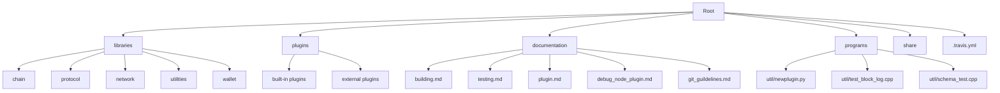
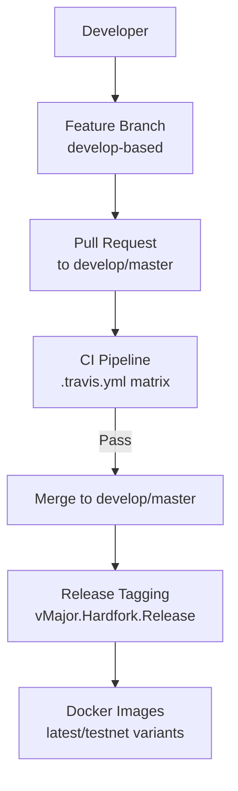
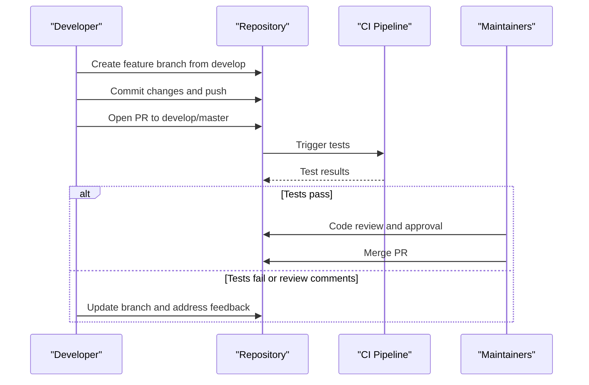
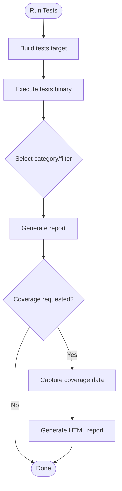
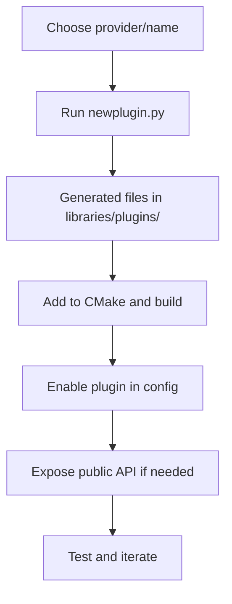
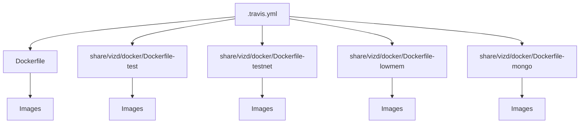

# Contributing and Development

<cite>
**Referenced Files in This Document**
- [README.md](file://README.md)
- [documentation/git_guildelines.md](file://documentation/git_guildelines.md)
- [documentation/building.md](file://documentation/building.md)
- [documentation/testing.md](file://documentation/testing.md)
- [documentation/plugin.md](file://documentation/plugin.md)
- [documentation/debug_node_plugin.md](file://documentation/debug_node_plugin.md)
- [LICENSE.md](file://LICENSE.md)
- [.travis.yml](file://.travis.yml)
- [programs/util/newplugin.py](file://programs/util/newplugin.py)
- [programs/util/schema_test.cpp](file://programs/util/schema_test.cpp)
- [programs/util/test_block_log.cpp](file://programs/util/test_block_log.cpp)
</cite>

## Table of Contents
1. [Introduction](#introduction)
2. [Project Structure](#project-structure)
3. [Core Components](#core-components)
4. [Architecture Overview](#architecture-overview)
5. [Detailed Component Analysis](#detailed-component-analysis)
6. [Dependency Analysis](#dependency-analysis)
7. [Performance Considerations](#performance-considerations)
8. [Troubleshooting Guide](#troubleshooting-guide)
9. [Conclusion](#conclusion)
10. [Appendices](#appendices)

## Introduction
This document provides comprehensive contributing and development guidance for VIZ CPP Node. It covers the development workflow, code style and commit conventions, review processes, contribution lifecycle from issue to merge, quality standards (testing, documentation, performance), plugin development contribution process, community contribution opportunities, and practical examples of common contribution scenarios. It also outlines the relationship between contributions and project governance, licensing, and intellectual property considerations, and offers guidance for new contributors to get started.

## Project Structure
The repository is organized around a CMake-based build system, layered libraries (chain, protocol, network, utilities, wallet), plugins, and documentation. Key areas for contributors:
- Libraries: core blockchain logic, protocol definitions, network messaging, utilities, and wallet APIs
- Plugins: built-in and external plugin ecosystem
- Documentation: build instructions, testing, plugin development, and guidelines
- Tools: scripts for building helpers, CLI utilities, and plugin scaffolding

**Diagram sources**
- [documentation/building.md](file://documentation/building.md#L1-L212)
- [documentation/testing.md](file://documentation/testing.md#L1-L43)
- [documentation/plugin.md](file://documentation/plugin.md#L1-L28)
- [documentation/debug_node_plugin.md](file://documentation/debug_node_plugin.md#L1-L134)
- [documentation/git_guildelines.md](file://documentation/git_guildelines.md#L1-L111)
- [programs/util/newplugin.py](file://programs/util/newplugin.py#L1-L251)
- [programs/util/test_block_log.cpp](file://programs/util/test_block_log.cpp#L1-L54)
- [programs/util/schema_test.cpp](file://programs/util/schema_test.cpp#L1-L57)

**Section sources**
- [README.md](file://README.md#L1-L53)
- [documentation/building.md](file://documentation/building.md#L1-L212)
- [documentation/testing.md](file://documentation/testing.md#L1-L43)
- [documentation/plugin.md](file://documentation/plugin.md#L1-L28)
- [documentation/debug_node_plugin.md](file://documentation/debug_node_plugin.md#L1-L134)
- [documentation/git_guildelines.md](file://documentation/git_guildelines.md#L1-L111)
- [programs/util/newplugin.py](file://programs/util/newplugin.py#L1-L251)
- [programs/util/test_block_log.cpp](file://programs/util/test_block_log.cpp#L1-L54)
- [programs/util/schema_test.cpp](file://programs/util/schema_test.cpp#L1-L57)

## Core Components
- Build and CI: CMake-based build with Docker-based CI matrix covering multiple configurations
- Testing: unit tests via a dedicated target, runtime configuration options, and coverage generation
- Plugin system: built-in and external plugin support, registration, and API exposure
- Developer tools: plugin scaffolding script, schema and block log utilities for testing and validation

Key references:
- Build options and platform-specific instructions
- Test categories and runtime configuration
- Plugin registration and enabling
- Debug node plugin usage and API surface
- Git branching, PR, and review policies
- Licensing and contribution terms

**Section sources**
- [documentation/building.md](file://documentation/building.md#L1-L212)
- [documentation/testing.md](file://documentation/testing.md#L1-L43)
- [documentation/plugin.md](file://documentation/plugin.md#L1-L28)
- [documentation/debug_node_plugin.md](file://documentation/debug_node_plugin.md#L1-L134)
- [documentation/git_guildelines.md](file://documentation/git_guildelines.md#L1-L111)
- [LICENSE.md](file://LICENSE.md#L1-L26)
- [.travis.yml](file://.travis.yml#L1-L46)

## Architecture Overview
The development and contribution workflow integrates build, test, and release automation with explicit branching and review policies. Contributors develop on feature branches, submit PRs, and adhere to code quality gates enforced by CI.

**Diagram sources**
- [documentation/git_guildelines.md](file://documentation/git_guildelines.md#L8-L24)
- [documentation/git_guildelines.md](file://documentation/git_guildelines.md#L49-L76)
- [.travis.yml](file://.travis.yml#L12-L46)

**Section sources**
- [documentation/git_guildelines.md](file://documentation/git_guildelines.md#L1-L111)
- [.travis.yml](file://.travis.yml#L1-L46)

## Detailed Component Analysis

### Development Workflow and Contribution Lifecycle
- Issue identification: Use repository issues to track work; non-issue patches still require an issue for documentation and traceability
- Branching: Feature branches originate from develop; naming convention for issue-related branches is issue-number-hyphen-shorthand; non-issue branches use YYYYMMDD-shortname
- Pull requests: All changes enter via PRs; automated testing is mandatory; maintainers enforce review and approval policies
- Merging: Master merges are single-commit PRs after feature consolidation; develop merges require passing tests and approvals

**Diagram sources**
- [documentation/git_guildelines.md](file://documentation/git_guildelines.md#L25-L48)
- [documentation/git_guildelines.md](file://documentation/git_guildelines.md#L49-L76)
- [documentation/git_guildelines.md](file://documentation/git_guildelines.md#L93-L111)

**Section sources**
- [documentation/git_guildelines.md](file://documentation/git_guildelines.md#L1-L111)

### Code Style Guidelines
- Commit messages: Reference related issues to create a documentation trail; ensure messages clearly explain the change and its rationale
- PRs: Include a summary of changes, rationale, and any special instructions for reviewers
- Branch hygiene: Keep commits focused; avoid mixing unrelated changes; rebase to resolve conflicts before resubmission

**Section sources**
- [documentation/git_guildelines.md](file://documentation/git_guildelines.md#L70-L76)

### Review Processes and Governance
- Review requirements: At least two developers must review and approve changes; for releases and consensus-breaking changes, stricter requirements apply
- Author participation: Authors may review their own work; however, at least one independent reviewer is required
- Enforcement: PRs must pass automated tests; manual checks ensure adherence to style and correctness

**Section sources**
- [documentation/git_guildelines.md](file://documentation/git_guildelines.md#L93-L111)

### Testing Requirements and Quality Standards
- Unit tests: Build and run via a dedicated target; tests are categorized (basic, block, operation, serialization, etc.)
- Runtime configuration: Control verbosity and filtering via runtime options
- Coverage: Enable coverage collection and generate HTML reports using lcov
- Validation utilities: Use provided tools to validate schema and block log behavior during development

**Diagram sources**
- [documentation/testing.md](file://documentation/testing.md#L1-L43)

**Section sources**
- [documentation/testing.md](file://documentation/testing.md#L1-L43)
- [programs/util/schema_test.cpp](file://programs/util/schema_test.cpp#L1-L57)
- [programs/util/test_block_log.cpp](file://programs/util/test_block_log.cpp#L1-L54)

### Documentation Expectations
- Build and usage docs: Follow the documented procedures for building and running the node
- Plugin docs: Use the plugin guide and debug plugin documentation as references for extending functionality
- Contribution docs: Adhere to the git guidelines and ensure PRs link to relevant issues

**Section sources**
- [documentation/building.md](file://documentation/building.md#L1-L212)
- [documentation/plugin.md](file://documentation/plugin.md#L1-L28)
- [documentation/debug_node_plugin.md](file://documentation/debug_node_plugin.md#L1-L134)
- [documentation/git_guildelines.md](file://documentation/git_guildelines.md#L1-L111)

### Performance Criteria
- Build types: Prefer Release builds for production and benchmarking; use Debug with coverage for development and profiling
- Low-memory builds: Consider low-memory node builds for resource-constrained environments (e.g., witnesses)

**Section sources**
- [documentation/building.md](file://documentation/building.md#L3-L16)

### Plugin Development Contribution Process
- Template usage: Use the plugin scaffolding script to generate boilerplate for new plugins
- Registration and enabling: Configure plugins via configuration options; enable public APIs as needed
- Integration guidelines: Follow plugin registration patterns and integrate with the application’s plugin lifecycle

**Diagram sources**
- [programs/util/newplugin.py](file://programs/util/newplugin.py#L1-L251)
- [documentation/plugin.md](file://documentation/plugin.md#L14-L28)

**Section sources**
- [programs/util/newplugin.py](file://programs/util/newplugin.py#L1-L251)
- [documentation/plugin.md](file://documentation/plugin.md#L1-L28)
- [documentation/debug_node_plugin.md](file://documentation/debug_node_plugin.md#L1-L134)

### Community Contribution Opportunities
- Bug reports: Use repository issues to report reproducible bugs with clear steps and environment details
- Feature requests: Propose enhancements via issues; include motivation, acceptance criteria, and potential impact
- Documentation improvements: Submit PRs for docs; ensure clarity and completeness
- Code contributions: Follow the workflow outlined above; ensure tests and documentation accompany changes

**Section sources**
- [documentation/git_guildelines.md](file://documentation/git_guildelines.md#L49-L76)

### Practical Examples of Common Contribution Scenarios
- Fixing a bug:
  - Create a branch from develop
  - Add or update unit tests to reproduce the issue
  - Implement the fix and verify with tests
  - Submit a PR referencing the issue
- Adding a feature:
  - Open an issue to track the feature
  - Develop on a feature branch; add tests and documentation
  - Submit a PR; iterate based on feedback
- Improving documentation:
  - Edit relevant documentation files
  - Submit a PR with a concise description of changes

**Section sources**
- [documentation/git_guildelines.md](file://documentation/git_guildelines.md#L25-L48)
- [documentation/testing.md](file://documentation/testing.md#L1-L43)

### Licensing and Intellectual Property Considerations
- License: The repository uses the MIT License for VIZ-Blockchain-contributed code
- Dependencies: Third-party components remain under their respective licenses
- Contributions: By submitting code, contributors agree to license their work under the repository’s license

**Section sources**
- [LICENSE.md](file://LICENSE.md#L1-L26)

### Getting Started for New Contributors
- Set up the build environment per platform-specific instructions
- Explore the documentation for building, testing, and plugin development
- Pick an issue labeled as good first issue or similar; start with small tasks
- Follow the branching and PR workflow described above

**Section sources**
- [documentation/building.md](file://documentation/building.md#L1-L212)
- [documentation/git_guildelines.md](file://documentation/git_guildelines.md#L1-L111)

## Dependency Analysis
The project relies on a CMake-based build system with Dockerized CI. The CI matrix builds multiple Docker images, ensuring compatibility across configurations.

**Diagram sources**
- [.travis.yml](file://.travis.yml#L12-L18)
- [.travis.yml](file://.travis.yml#L22-L46)

**Section sources**
- [.travis.yml](file://.travis.yml#L1-L46)

## Performance Considerations
- Build type selection impacts performance and debugging capabilities
- Low-memory builds reduce storage and RAM usage for consensus roles
- Use coverage builds judiciously for profiling and optimization efforts

**Section sources**
- [documentation/building.md](file://documentation/building.md#L3-L16)

## Troubleshooting Guide
- Build failures: Verify platform prerequisites and CMake options; consult platform-specific sections
- Test failures: Use runtime configuration to narrow down failing categories; inspect coverage output
- Plugin issues: Confirm plugin registration and configuration; validate API exposure settings
- CI failures: Review Docker build logs and ensure environment parity

**Section sources**
- [documentation/building.md](file://documentation/building.md#L25-L212)
- [documentation/testing.md](file://documentation/testing.md#L16-L43)
- [documentation/plugin.md](file://documentation/plugin.md#L14-L28)
- [.travis.yml](file://.travis.yml#L22-L46)

## Conclusion
Contributions to VIZ CPP Node are governed by clear branching, PR, and review policies, supported by robust testing and CI infrastructure. Contributors should follow the documented workflow, ensure tests and documentation accompany changes, and leverage the plugin system and developer tools to deliver high-quality contributions.

## Appendices
- Quick links to key documents:
  - Build instructions: [documentation/building.md](file://documentation/building.md#L1-L212)
  - Testing guide: [documentation/testing.md](file://documentation/testing.md#L1-L43)
  - Plugin development: [documentation/plugin.md](file://documentation/plugin.md#L1-L28)
  - Debug node plugin: [documentation/debug_node_plugin.md](file://documentation/debug_node_plugin.md#L1-L134)
  - Git guidelines: [documentation/git_guildelines.md](file://documentation/git_guildelines.md#L1-L111)
  - License: [LICENSE.md](file://LICENSE.md#L1-L26)
  - CI configuration: [.travis.yml](file://.travis.yml#L1-L46)
  - Plugin scaffolding: [programs/util/newplugin.py](file://programs/util/newplugin.py#L1-L251)
  - Schema and block log utilities: [programs/util/schema_test.cpp](file://programs/util/schema_test.cpp#L1-L57), [programs/util/test_block_log.cpp](file://programs/util/test_block_log.cpp#L1-L54)