# Core Libraries

<cite>
**Referenced Files in This Document**
- [libraries/chain/include/graphene/chain/database.hpp](file://libraries/chain/include/graphene/chain/database.hpp)
- [libraries/chain/database.cpp](file://libraries/chain/database.cpp)
- [libraries/chain/include/graphene/chain/evaluator.hpp](file://libraries/chain/include/graphene/chain/evaluator.hpp)
- [libraries/chain/include/graphene/chain/chain_objects.hpp](file://libraries/chain/include/graphene/chain/chain_objects.hpp)
- [libraries/chain/include/graphene/chain/db_with.hpp](file://libraries/chain/include/graphene/chain/db_with.hpp)
- [libraries/protocol/include/graphene/protocol/operations.hpp](file://libraries/protocol/include/graphene/protocol/operations.hpp)
- [libraries/protocol/include/graphene/protocol/transaction.hpp](file://libraries/protocol/include/graphene/protocol/transaction.hpp)
- [libraries/protocol/transaction.cpp](file://libraries/protocol/transaction.cpp)
- [libraries/protocol/include/graphene/protocol/types.hpp](file://libraries/protocol/include/graphene/protocol/types.hpp)
- [libraries/protocol/operations.cpp](file://libraries/protocol/operations.cpp)
- [libraries/protocol/include/graphene/protocol/chain_operations.hpp](file://libraries/protocol/include/graphene/protocol/chain_operations.hpp)
- [libraries/protocol/include/graphene/protocol/chain_virtual_operations.hpp](file://libraries/protocol/include/graphene/protocol/chain_virtual_operations.hpp)
- [libraries/network/include/graphene/network/node.hpp](file://libraries/network/include/graphene/network/node.hpp)
- [libraries/network/node.cpp](file://libraries/network/node.cpp)
- [libraries/wallet/include/graphene/wallet/wallet.hpp](file://libraries/wallet/include/graphene/wallet/wallet.hpp)
- [libraries/wallet/wallet.cpp](file://libraries/wallet/wallet.cpp)
- [libraries/wallet/include/graphene/wallet/api_documentation.hpp](file://libraries/wallet/include/graphene/wallet/api_documentation.hpp)
- [plugins/chain/include/graphene/plugins/chain/plugin.hpp](file://plugins/chain/include/graphene/plugins/chain/plugin.hpp)
- [plugins/p2p/include/graphene/plugins/p2p/p2p_plugin.hpp](file://plugins/p2p/include/graphene/plugins/p2p/p2p_plugin.hpp)
- [programs/vizd/main.cpp](file://programs/vizd/main.cpp)
</cite>

## Update Summary
**Changes Made**
- Updated postponed transactions logging accuracy documentation to reflect corrected logical error in postponed transactions counter
- Enhanced logging behavior documentation to prevent false 'Postponed' messages for skipped known transactions
- Added detailed explanation of postponed transaction counting logic and block size limit handling
- Updated database pending transaction processing documentation with improved accuracy metrics

## Table of Contents
1. [Introduction](#introduction)
2. [Project Structure](#project-structure)
3. [Core Components](#core-components)
4. [Architecture Overview](#architecture-overview)
5. [Detailed Component Analysis](#detailed-component-analysis)
6. [Blockchain Operations and Data Types](#blockchain-operations-and-data-types)
7. [Protocol Specifications](#protocol-specifications)
8. [DNS Nameserver Helper Functionality](#dns-nameserver-helper-functionality)
9. [Postponed Transactions Processing](#postponed-transactions-processing)
10. [Dependency Analysis](#dependency-analysis)
11. [Performance Considerations](#performance-considerations)
12. [Troubleshooting Guide](#troubleshooting-guide)
13. [Conclusion](#conclusion)

## Introduction
This document explains the VIZ CPP Node core libraries that form the foundation of the blockchain node. The four main library categories are:
- Chain library: blockchain state management, validation, and consensus
- Protocol library: transaction and operation definitions and cryptographic signing
- Network library: peer-to-peer communication and synchronization
- Wallet library: transaction signing and key management

These libraries interact closely: the Chain library validates and applies operations, the Protocol library defines operations and transactions, the Network library propagates blocks and transactions across peers, and the Wallet library signs transactions before they are broadcast.

**Updated** Enhanced documentation now includes comprehensive coverage of blockchain operations, data types, protocol specifications, DNS nameserver helper functionality, and accurate postponed transactions processing with corrected logging behavior.

## Project Structure
The core libraries are organized under the libraries/ directory, with each library providing focused capabilities:
- libraries/chain: state machine, evaluators, database, fork management, block processing
- libraries/protocol: operations, transactions, signing, types, chain constants
- libraries/network: P2P node, peer connections, message handling, synchronization
- libraries/wallet: transaction builder, signing, key management, APIs, DNS nameserver helpers

Plugins integrate these libraries into a full node via the appbase framework. The main entry point initializes plugins and starts the node.

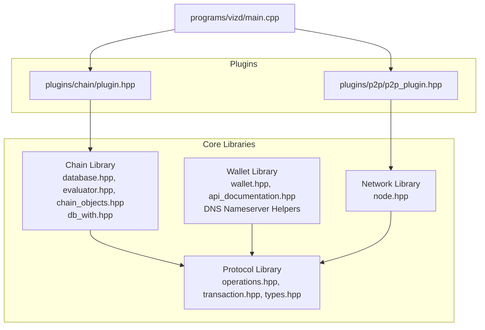

**Diagram sources**
- [programs/vizd/main.cpp:106-140](file://programs/vizd/main.cpp#L106-L140)
- [plugins/chain/include/graphene/plugins/chain/plugin.hpp:21-46](file://plugins/chain/include/graphene/plugins/chain/plugin.hpp#L21-L46)
- [plugins/p2p/include/graphene/plugins/p2p/p2p_plugin.hpp:18-46](file://plugins/p2p/include/graphene/plugins/p2p/p2p_plugin.hpp#L18-L46)
- [libraries/chain/include/graphene/chain/database.hpp:36-561](file://libraries/chain/include/graphene/chain/database.hpp#L36-L561)
- [libraries/protocol/include/graphene/protocol/operations.hpp:13-102](file://libraries/protocol/include/graphene/protocol/operations.hpp#L13-L102)
- [libraries/network/include/graphene/network/node.hpp:190-304](file://libraries/network/include/graphene/network/node.hpp#L190-L304)
- [libraries/wallet/include/graphene/wallet/wallet.hpp:96-1067](file://libraries/wallet/include/graphene/wallet/wallet.hpp#L96-L1067)

**Section sources**
- [programs/vizd/main.cpp:62-91](file://programs/vizd/main.cpp#L62-L91)
- [plugins/chain/include/graphene/plugins/chain/plugin.hpp:21-46](file://plugins/chain/include/graphene/plugins/chain/plugin.hpp#L21-L46)
- [plugins/p2p/include/graphene/plugins/p2p/p2p_plugin.hpp:18-46](file://plugins/p2p/include/graphene/plugins/p2p/p2p_plugin.hpp#L18-L46)

## Core Components
This section introduces the primary responsibilities and key classes of each library.

- Chain Library
  - database: central state machine managing blockchain objects, fork database, block log, and applying operations
  - evaluator: pluggable operation handlers that mutate state according to protocol rules
  - chain_objects: persistent object model (accounts, content, escrow, vesting routes, etc.)
  - db_with: pending transaction processing, postponed transactions handling, and restoration logic
  - Responsibilities: block validation, transaction validation, state transitions, hardfork handling, witness scheduling

- Protocol Library
  - operations: static_variant of all supported operations (transfers, governance, content, etc.)
  - transaction: structure with operations, expiration, reference block, and cryptographic signing
  - types: comprehensive data type definitions including cryptographic keys, asset types, and authority structures
  - Responsibilities: define canonical operation semantics, transaction signing and verification, authority checks

- Network Library
  - node: P2P node with peer connections, message propagation, sync protocol, and broadcasting
  - Responsibilities: block and transaction propagation, peer discovery, sync from peers, bandwidth limits

- Wallet Library
  - wallet_api: transaction builder, signing, key management, proposal creation, account operations, DNS nameserver helpers
  - api_documentation: method descriptions and help system for wallet operations
  - DNS Nameserver Helpers: validation, extraction, and management of DNS records in account metadata
  - Responsibilities: construct transactions, sign with private keys, manage encrypted key storage, expose APIs, handle DNS metadata

**Updated** Enhanced with comprehensive DNS nameserver helper functionality and accurate postponed transactions processing documentation.

**Section sources**
- [libraries/chain/include/graphene/chain/database.hpp:36-561](file://libraries/chain/include/graphene/chain/database.hpp#L36-L561)
- [libraries/chain/include/graphene/chain/evaluator.hpp:11-45](file://libraries/chain/include/graphene/chain/evaluator.hpp#L11-L45)
- [libraries/chain/include/graphene/chain/chain_objects.hpp:20-200](file://libraries/chain/include/graphene/chain/chain_objects.hpp#L20-L200)
- [libraries/chain/include/graphene/chain/db_with.hpp:37-100](file://libraries/chain/include/graphene/chain/db_with.hpp#L37-L100)
- [libraries/protocol/include/graphene/protocol/operations.hpp:13-102](file://libraries/protocol/include/graphene/protocol/operations.hpp#L13-L102)
- [libraries/protocol/include/graphene/protocol/transaction.hpp:12-101](file://libraries/protocol/include/graphene/protocol/transaction.hpp#L12-L101)
- [libraries/protocol/include/graphene/protocol/types.hpp:75-207](file://libraries/protocol/include/graphene/protocol/types.hpp#L75-L207)
- [libraries/network/include/graphene/network/node.hpp:190-304](file://libraries/network/include/graphene/network/node.hpp#L190-L304)
- [libraries/wallet/include/graphene/wallet/wallet.hpp:96-1067](file://libraries/wallet/include/graphene/wallet/wallet.hpp#L96-L1067)
- [libraries/wallet/include/graphene/wallet/api_documentation.hpp:37-75](file://libraries/wallet/include/graphene/wallet/api_documentation.hpp#L37-L75)

## Architecture Overview
The libraries integrate through explicit interfaces and signals. The Chain library exposes a database interface and signals for operation application. The Protocol library defines the canonical operation types and transaction structures. The Network library consumes blocks and transactions from the Chain library and broadcasts them to peers. The Wallet library constructs and signs transactions using the Protocol library and sends them to the Chain library via the P2P plugin. The DNS nameserver helper functionality extends the wallet library to manage DNS metadata within account JSON metadata. The db_with module handles postponed transactions processing with accurate counting and logging.

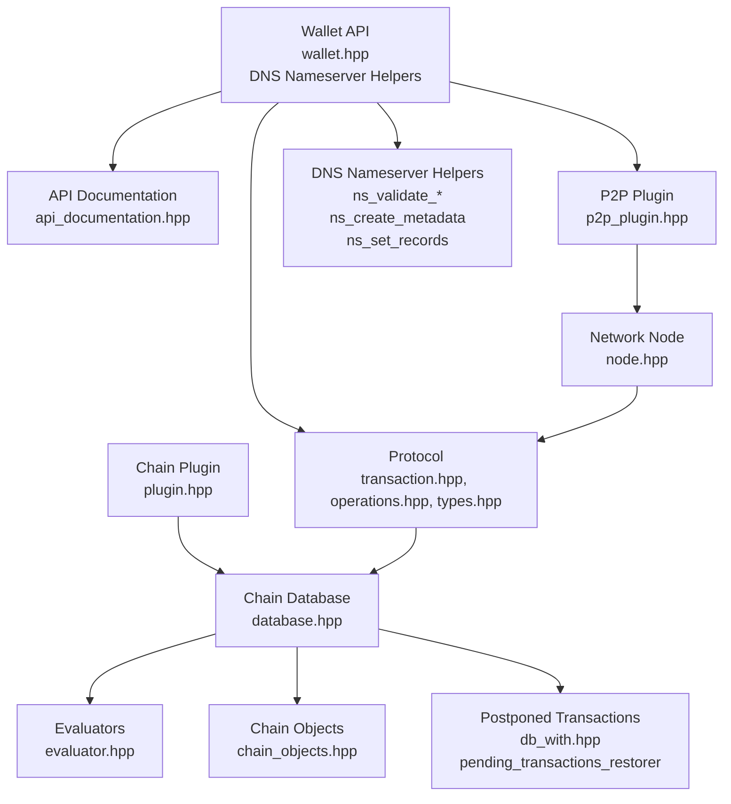

**Diagram sources**
- [libraries/wallet/include/graphene/wallet/wallet.hpp:1310-1420](file://libraries/wallet/include/graphene/wallet/wallet.hpp#L1310-L1420)
- [libraries/wallet/include/graphene/wallet/api_documentation.hpp:43-75](file://libraries/wallet/include/graphene/wallet/api_documentation.hpp#L43-L75)
- [libraries/protocol/include/graphene/protocol/transaction.hpp:12-101](file://libraries/protocol/include/graphene/protocol/transaction.hpp#L12-L101)
- [libraries/protocol/include/graphene/protocol/operations.hpp:13-102](file://libraries/protocol/include/graphene/protocol/operations.hpp#L13-L102)
- [libraries/protocol/include/graphene/protocol/types.hpp:75-207](file://libraries/protocol/include/graphene/protocol/types.hpp#L75-L207)
- [libraries/chain/include/graphene/chain/database.hpp:36-561](file://libraries/chain/include/graphene/chain/database.hpp#L36-L561)
- [libraries/chain/include/graphene/chain/evaluator.hpp:11-45](file://libraries/chain/include/graphene/chain/evaluator.hpp#L11-L45)
- [libraries/chain/include/graphene/chain/chain_objects.hpp:20-200](file://libraries/chain/include/graphene/chain/chain_objects.hpp#L20-L200)
- [libraries/chain/include/graphene/chain/db_with.hpp:37-100](file://libraries/chain/include/graphene/chain/db_with.hpp#L37-L100)
- [libraries/network/include/graphene/network/node.hpp:190-304](file://libraries/network/include/graphene/network/node.hpp#L190-L304)
- [plugins/chain/include/graphene/plugins/chain/plugin.hpp:21-46](file://plugins/chain/include/graphene/plugins/chain/plugin.hpp#L21-L46)
- [plugins/p2p/include/graphene/plugins/p2p/p2p_plugin.hpp:18-46](file://plugins/p2p/include/graphene/plugins/p2p/p2p_plugin.hpp#L18-L46)

## Detailed Component Analysis

### Chain Library
The Chain library is the core state machine. It manages:
- Blockchain state: persistent objects, indexes, and undo history
- Validation pipeline: block and transaction validation with configurable skip flags
- Fork management: fork database and branch selection
- Operation application: dispatch to evaluators and emit notifications
- Hardfork handling: versioning and activation logic
- Postponed transactions: accurate counting and processing with proper logging

Key classes and responsibilities:
- database: open/reindex, push/pop blocks, push transactions, notify signals, hardfork control
- evaluator: base class for operation-specific logic
- chain_objects: multi-index containers for persistent state
- db_with: pending transaction restoration, postponed transaction processing, execution limits

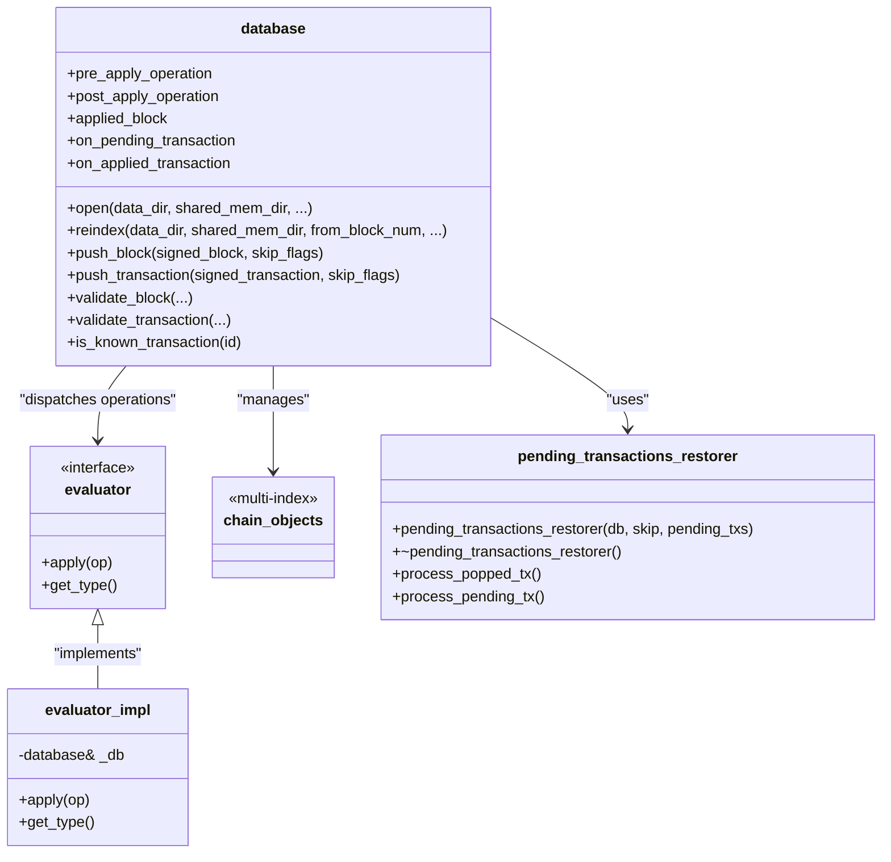

**Diagram sources**
- [libraries/chain/include/graphene/chain/database.hpp:36-561](file://libraries/chain/include/graphene/chain/database.hpp#L36-L561)
- [libraries/chain/include/graphene/chain/evaluator.hpp:11-45](file://libraries/chain/include/graphene/chain/evaluator.hpp#L11-L45)
- [libraries/chain/include/graphene/chain/chain_objects.hpp:20-200](file://libraries/chain/include/graphene/chain/chain_objects.hpp#L20-L200)
- [libraries/chain/include/graphene/chain/db_with.hpp:37-100](file://libraries/chain/include/graphene/chain/db_with.hpp#L37-L100)

**Section sources**
- [libraries/chain/include/graphene/chain/database.hpp:36-561](file://libraries/chain/include/graphene/chain/database.hpp#L36-L561)
- [libraries/chain/database.cpp:198-200](file://libraries/chain/database.cpp#L198-L200)
- [libraries/chain/include/graphene/chain/evaluator.hpp:11-45](file://libraries/chain/include/graphene/chain/evaluator.hpp#L11-L45)
- [libraries/chain/include/graphene/chain/chain_objects.hpp:20-200](file://libraries/chain/include/graphene/chain/chain_objects.hpp#L20-L200)
- [libraries/chain/include/graphene/chain/db_with.hpp:37-100](file://libraries/chain/include/graphene/chain/db_with.hpp#L37-L100)

### Protocol Library
The Protocol library defines the canonical operation types and transaction structures:
- operations: static_variant of all operations (transfers, governance, content, etc.)
- transaction: operations, expiration, reference block, and signing/verification helpers
- types: comprehensive data type definitions including cryptographic keys, asset types, and authority structures
- Authority and sign_state: required authorities and signature verification

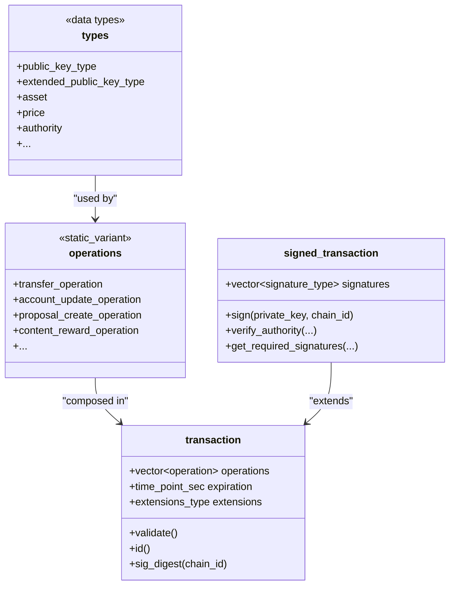

**Diagram sources**
- [libraries/protocol/include/graphene/protocol/operations.hpp:13-102](file://libraries/protocol/include/graphene/protocol/operations.hpp#L13-L102)
- [libraries/protocol/include/graphene/protocol/transaction.hpp:12-101](file://libraries/protocol/include/graphene/protocol/transaction.hpp#L12-L101)
- [libraries/protocol/include/graphene/protocol/types.hpp:75-207](file://libraries/protocol/include/graphene/protocol/types.hpp#L75-L207)

**Section sources**
- [libraries/protocol/include/graphene/protocol/operations.hpp:13-102](file://libraries/protocol/include/graphene/protocol/operations.hpp#L13-L102)
- [libraries/protocol/include/graphene/protocol/transaction.hpp:12-101](file://libraries/protocol/include/graphene/protocol/transaction.hpp#L12-L101)
- [libraries/protocol/include/graphene/protocol/types.hpp:75-207](file://libraries/protocol/include/graphene/protocol/types.hpp#L75-L207)
- [libraries/protocol/transaction.cpp:30-200](file://libraries/protocol/transaction.cpp#L30-L200)

### Network Library
The Network library provides peer-to-peer connectivity:
- node: P2P node with delegate interface, peer connections, message propagation, sync protocol
- Broadcasting: blocks and transactions to peers
- Sync: blockchain synopsis, block requests, and peer synchronization

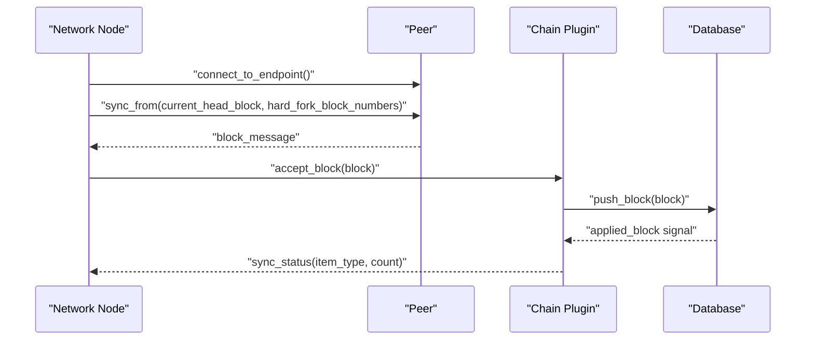

**Diagram sources**
- [libraries/network/include/graphene/network/node.hpp:190-304](file://libraries/network/include/graphene/network/node.hpp#L190-L304)
- [plugins/chain/include/graphene/plugins/chain/plugin.hpp:44-46](file://plugins/chain/include/graphene/plugins/chain/plugin.hpp#L44-L46)

**Section sources**
- [libraries/network/include/graphene/network/node.hpp:190-304](file://libraries/network/include/graphene/network/node.hpp#L190-L304)
- [libraries/network/node.cpp:1-200](file://libraries/network/node.cpp#L1-L200)
- [plugins/chain/include/graphene/plugins/chain/plugin.hpp:44-46](file://plugins/chain/include/graphene/plugins/chain/plugin.hpp#L44-L46)

### Wallet Library
The Wallet library provides transaction construction and signing:
- wallet_api: builder APIs, signing, key management, proposal creation, account operations, DNS nameserver helpers
- api_documentation: method descriptions and help system for wallet operations
- DNS Nameserver Helpers: comprehensive DNS metadata management functionality
- Signing: uses Protocol transaction structures and private keys
- Integration: communicates with the node via plugins and remote APIs


**Diagram sources**
- [libraries/wallet/include/graphene/wallet/wallet.hpp:132-180](file://libraries/wallet/include/graphene/wallet/wallet.hpp#L132-L180)
- [libraries/wallet/include/graphene/wallet/api_documentation.hpp:43-75](file://libraries/wallet/include/graphene/wallet/api_documentation.hpp#L43-L75)

**Section sources**
- [libraries/wallet/include/graphene/wallet/wallet.hpp:96-1067](file://libraries/wallet/include/graphene/wallet/wallet.hpp#L96-L1067)
- [libraries/wallet/wallet.cpp:1-200](file://libraries/wallet/wallet.cpp#L1-L200)
- [libraries/wallet/include/graphene/wallet/api_documentation.hpp:37-75](file://libraries/wallet/include/graphene/wallet/api_documentation.hpp#L37-L75)

### DNS Nameserver Helper Functionality
The wallet library now includes comprehensive DNS nameserver helper functionality for managing DNS records within VIZ account metadata. This functionality enables:

- **Validation Functions**: IPv4 address validation, SHA256 hash validation, TTL validation, and SSL TXT record format validation
- **Metadata Creation**: Generation of DNS metadata JSON with A records and SSL hash TXT records
- **Extraction Functions**: Retrieval of A records, SSL hashes, and TTL values from account metadata
- **Management Operations**: Setting and removing DNS records while preserving other metadata fields

Key data structures:
- `ns_record`: Represents a single DNS record tuple [type, value]
- `ns_metadata_options`: Configuration options for DNS metadata (A records, SSL hash, TTL)
- `ns_summary`: Extracted DNS metadata summary from account JSON
- `ns_validation_result`: Validation results with error reporting

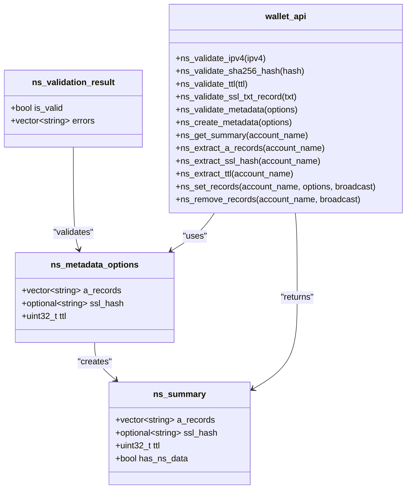

**Diagram sources**
- [libraries/wallet/include/graphene/wallet/wallet.hpp:24-62](file://libraries/wallet/include/graphene/wallet/wallet.hpp#L24-L62)
- [libraries/wallet/include/graphene/wallet/wallet.hpp:1310-1420](file://libraries/wallet/include/graphene/wallet/wallet.hpp#L1310-L1420)
- [libraries/wallet/wallet.cpp:2577-2884](file://libraries/wallet/wallet.cpp#L2577-L2884)

**Section sources**
- [libraries/wallet/include/graphene/wallet/wallet.hpp:24-62](file://libraries/wallet/include/graphene/wallet/wallet.hpp#L24-L62)
- [libraries/wallet/include/graphene/wallet/wallet.hpp:1310-1420](file://libraries/wallet/include/graphene/wallet/wallet.hpp#L1310-L1420)
- [libraries/wallet/wallet.cpp:2577-2884](file://libraries/wallet/wallet.cpp#L2577-L2884)

### Postponed Transactions Processing
The Chain library includes sophisticated postponed transactions processing with accurate counting and logging. This system handles transactions that cannot be included in a block due to size constraints or execution limits.

Key components:
- `pending_transactions_restorer`: Manages restoration of pending transactions during block production
- `postponed_tx_count`: Accurate counter for transactions postponed due to block size limits
- Execution limits: Configurable time-based limits for processing pending transactions
- Logging: Prevents false 'Postponed' messages for skipped known transactions

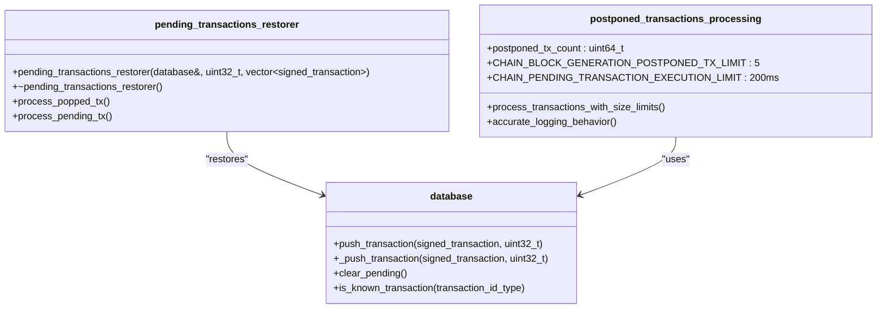

**Diagram sources**
- [libraries/chain/include/graphene/chain/db_with.hpp:37-100](file://libraries/chain/include/graphene/chain/db_with.hpp#L37-L100)
- [libraries/chain/database.cpp:1165-1202](file://libraries/chain/database.cpp#L1165-L1202)
- [libraries/chain/database.cpp:549-555](file://libraries/chain/database.cpp#L549-L555)

**Section sources**
- [libraries/chain/include/graphene/chain/db_with.hpp:37-100](file://libraries/chain/include/graphene/chain/db_with.hpp#L37-L100)
- [libraries/chain/database.cpp:1165-1202](file://libraries/chain/database.cpp#L1165-L1202)
- [libraries/chain/database.cpp:549-555](file://libraries/chain/database.cpp#L549-L555)

### Typical Operations: Transaction Processing and Block Validation

#### Transaction Processing Flow
- Wallet builds and signs a transaction using Protocol structures
- P2P plugin broadcasts the signed transaction to peers
- Chain plugin receives and validates the transaction via the Chain library
- Chain library applies the transaction's operations through evaluators
- Database emits notifications for pre/post application and applied block

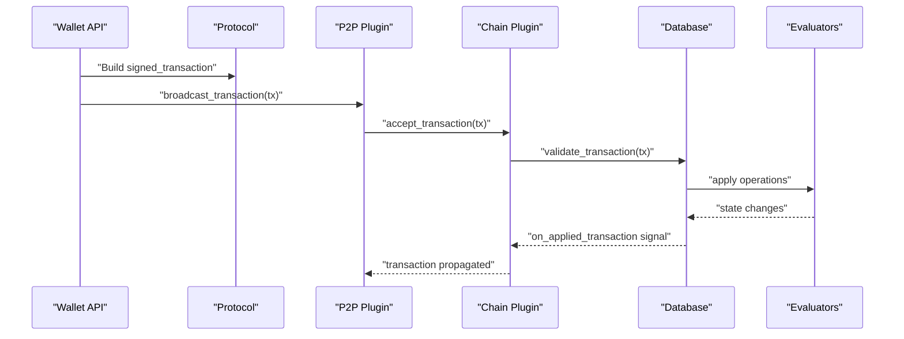

**Diagram sources**
- [libraries/wallet/include/graphene/wallet/wallet.hpp:132-180](file://libraries/wallet/include/graphene/wallet/wallet.hpp#L132-L180)
- [libraries/protocol/include/graphene/protocol/transaction.hpp:57-101](file://libraries/protocol/include/graphene/protocol/transaction.hpp#L57-L101)
- [plugins/p2p/include/graphene/plugins/p2p/p2p_plugin.hpp:46-46](file://plugins/p2p/include/graphene/plugins/p2p/p2p_plugin.hpp#L46-L46)
- [plugins/chain/include/graphene/plugins/chain/plugin.hpp:46-46](file://plugins/chain/include/graphene/plugins/chain/plugin.hpp#L46-L46)
- [libraries/chain/include/graphene/chain/database.hpp:200-275](file://libraries/chain/include/graphene/chain/database.hpp#L200-L275)

#### Block Validation Flow
- Network receives a block from peers
- Chain plugin accepts the block and validates it
- Database validates block header, extensions, and applies block-level operations
- Database updates global properties, witness schedules, and emits applied_block signal

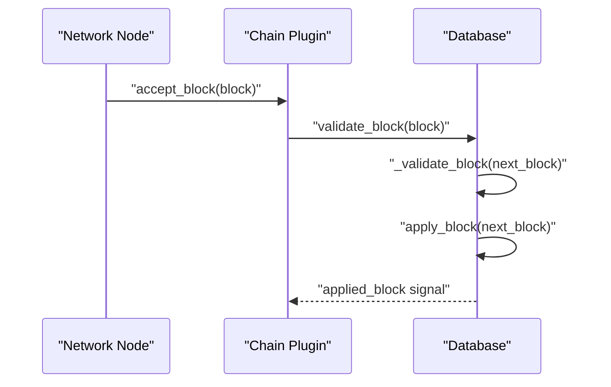

**Diagram sources**
- [libraries/network/include/graphene/network/node.hpp:79-80](file://libraries/network/include/graphene/network/node.hpp#L79-L80)
- [plugins/chain/include/graphene/plugins/chain/plugin.hpp:44-44](file://plugins/chain/include/graphene/plugins/chain/plugin.hpp#L44-L44)
- [libraries/chain/include/graphene/chain/database.hpp:194-226](file://libraries/chain/include/graphene/chain/database.hpp#L194-L226)

## Blockchain Operations and Data Types

### Comprehensive Operation Coverage
The protocol library now provides extensive operation documentation covering all blockchain operations:

#### Core Operations
- **Account Management**: account_create_operation, account_update_operation, account_metadata_operation
- **Token Operations**: transfer_operation, transfer_to_vesting_operation, withdraw_vesting_operation
- **Governance**: witness_update_operation, chain_properties_update_operation, proposal operations
- **Content Operations**: content_operation, delete_content_operation, vote_operation
- **Escrow Operations**: escrow_transfer_operation, escrow_approve_operation, escrow_dispute_operation, escrow_release_operation
- **Virtual Operations**: author_reward_operation, curation_reward_operation, content_reward_operation

#### Advanced Operations
- **Committee Operations**: Various committee request and approval operations
- **Award Operations**: Award creation and distribution operations
- **Paid Subscription Operations**: Subscription management and billing operations
- **Account Sale Operations**: Account marketplace operations
- **Hardfork Operations**: System upgrade and maintenance operations

#### Data Type Definitions
The types.hpp file provides comprehensive data type coverage:

- **Cryptographic Types**: 
  - public_key_type, extended_public_key_type, extended_private_key_type
  - signature_type, chain_id_type
- **Asset Types**: 
  - asset, price, share_type for token and share management
- **Authority Structures**: 
  - authority, weight_type for multi-signature requirements
- **Name Types**: 
  - account_name_type for account identification

**Section sources**
- [libraries/protocol/include/graphene/protocol/operations.hpp:13-102](file://libraries/protocol/include/graphene/protocol/operations.hpp#L13-L102)
- [libraries/protocol/include/graphene/protocol/chain_operations.hpp:11-800](file://libraries/protocol/include/graphene/protocol/chain_operations.hpp#L11-L800)
- [libraries/protocol/include/graphene/protocol/chain_virtual_operations.hpp:11-329](file://libraries/protocol/include/graphene/protocol/chain_virtual_operations.hpp#L11-L329)
- [libraries/protocol/include/graphene/protocol/types.hpp:75-207](file://libraries/protocol/include/graphene/protocol/types.hpp#L75-L207)
- [libraries/protocol/operations.cpp:17-52](file://libraries/protocol/operations.cpp#L17-L52)

### Operation Categorization and Classification
Operations are systematically categorized for better understanding and implementation:

#### Operation Categories
- **Regular Operations**: Standard blockchain operations that affect state
- **Virtual Operations**: System-generated operations for rewards and maintenance
- **Data Operations**: Operations carrying raw data payloads
- **Governance Operations**: Operations affecting chain parameters and governance

#### Operation Properties
Each operation includes validation rules, authority requirements, and extension mechanisms for future enhancements.

**Section sources**
- [libraries/protocol/operations.cpp:17-52](file://libraries/protocol/operations.cpp#L17-L52)
- [libraries/protocol/include/graphene/protocol/operations.hpp:104-113](file://libraries/protocol/include/graphene/protocol/operations.hpp#L104-L113)

## Protocol Specifications

### Detailed Operation Documentation
The protocol now includes comprehensive documentation for all operation types:

#### Operation Structure
Each operation follows a standardized structure:
- Base class inheritance from base_operation or virtual_operation
- validate() method for input validation
- get_required_*_authorities() methods for authority determination
- Extension support for future compatibility

#### Authority Requirements
Operations specify required authorities:
- Active authorities for standard operations
- Master authorities for sensitive operations
- Regular authorities for metadata operations
- Custom authorities for specialized operations

#### Virtual Operations
Virtual operations represent system events:
- Reward distributions (author_reward_operation, curation_reward_operation)
- Maintenance operations (hardfork_operation, shutdown_witness_operation)
- State transitions (fill_vesting_withdraw_operation)

**Section sources**
- [libraries/protocol/include/graphene/protocol/chain_operations.hpp:11-800](file://libraries/protocol/include/graphene/protocol/chain_operations.hpp#L11-L800)
- [libraries/protocol/include/graphene/protocol/chain_virtual_operations.hpp:11-329](file://libraries/protocol/include/graphene/protocol/chain_virtual_operations.hpp#L11-L329)

### Transaction Structure and Validation
Transactions follow a strict validation pipeline:
- Operation composition and ordering
- Expiration handling and reference block validation
- Signature verification and authority checking
- Extension processing and custom operation support

**Section sources**
- [libraries/protocol/include/graphene/protocol/transaction.hpp:12-101](file://libraries/protocol/include/graphene/protocol/transaction.hpp#L12-L101)
- [libraries/protocol/transaction.cpp:30-200](file://libraries/protocol/transaction.cpp#L30-L200)

## DNS Nameserver Helper Functionality

The wallet library now includes comprehensive DNS nameserver helper functionality that extends blockchain metadata management capabilities with DNS record support for VIZ accounts.

### DNS Metadata Structure
DNS nameserver helpers manage DNS records stored within account JSON metadata. The metadata structure supports:

- **NS Array**: Contains DNS record tuples with type and value pairs
- **TTL Value**: Time-to-live for DNS records in seconds
- **SSL Hash**: Optional SHA256 hash for SSL certificate verification

### Validation Functions
The DNS helpers provide comprehensive validation for DNS metadata:

- **IPv4 Validation**: Validates IPv4 address format with proper octet ranges
- **SHA256 Hash Validation**: Ensures 64-character hexadecimal hash format
- **TTL Validation**: Requires positive integer values for TTL
- **SSL TXT Record Validation**: Validates "ssl=<hash>" format

### Extraction and Management Operations
The DNS helpers support complete DNS metadata lifecycle management:

- **Metadata Creation**: Generates DNS metadata JSON with A records and SSL hash TXT records
- **Summary Extraction**: Retrieves complete DNS metadata summary from account JSON
- **Record Extraction**: Extracts specific DNS record types (A records, SSL hashes, TTL values)
- **Record Management**: Sets and removes DNS records while preserving other metadata fields

### Practical Usage Examples

#### Setting DNS Records
```cpp
// Configure DNS metadata options
ns_metadata_options options;
options.a_records = {"188.120.231.153", "192.168.1.100"};
options.ssl_hash = "a1b2c3d4e5f67890123456789012345678901234567890123456789012345678";
options.ttl = 28800; // 8 hours

// Validate metadata
auto validation = wallet.ns_validate_metadata(options);
if (validation.is_valid) {
    // Set DNS records for account
    auto tx = wallet.ns_set_records("myaccount", options, true);
}
```

#### Extracting DNS Information
```cpp
// Extract A records
auto a_records = wallet.ns_extract_a_records("myaccount");
for (const auto& ip : a_records) {
    std::cout << "A record: " << ip << std::endl;
}

// Extract SSL hash
auto ssl_hash = wallet.ns_extract_ssl_hash("myaccount");
if (ssl_hash) {
    std::cout << "SSL hash: " << *ssl_hash << std::endl;
}

// Extract TTL
auto ttl = wallet.ns_extract_ttl("myaccount");
std::cout << "TTL: " << ttl << " seconds" << std::endl;
```

#### Removing DNS Records
```cpp
// Remove DNS records while preserving other metadata
auto tx = wallet.ns_remove_records("myaccount", true);
```

**Section sources**
- [libraries/wallet/include/graphene/wallet/wallet.hpp:24-62](file://libraries/wallet/include/graphene/wallet/wallet.hpp#L24-L62)
- [libraries/wallet/include/graphene/wallet/wallet.hpp:1310-1420](file://libraries/wallet/include/graphene/wallet/wallet.hpp#L1310-L1420)
- [libraries/wallet/wallet.cpp:2577-2884](file://libraries/wallet/wallet.cpp#L2577-L2884)

## Postponed Transactions Processing

The Chain library implements sophisticated postponed transactions processing to handle transactions that cannot be included in a block due to size constraints or execution limits. This system ensures accurate counting and appropriate logging behavior.

### Postponed Transaction Counting Logic
The system maintains an accurate `postponed_tx_count` variable that tracks transactions postponed due to block size limits:

- **Size Limit Checking**: Each transaction is evaluated against the maximum block size
- **Counter Increment**: Only transactions that exceed size limits increment the counter
- **Limit Enforcement**: Processing stops when the configured limit is reached
- **Accurate Reporting**: Log messages reflect the actual number of postponed transactions

### Execution Limits and Performance
The system implements time-based execution limits to prevent excessive processing time:

- **Execution Window**: Configurable time limit (default 200ms) for processing pending transactions
- **Graceful Degradation**: When time limit is reached, remaining transactions are postponed
- **Known Transaction Filtering**: Skipped known transactions prevent false logging messages

### Logging Behavior Improvements
Recent improvements ensure accurate logging behavior:

- **False Positive Prevention**: Known transactions are skipped without generating 'Postponed' messages
- **Accurate Counting**: Only truly postponed transactions contribute to the counter
- **Performance Monitoring**: Proper logging helps monitor block production efficiency

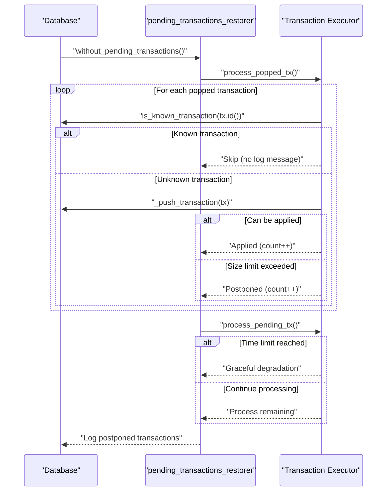

**Diagram sources**
- [libraries/chain/include/graphene/chain/db_with.hpp:37-100](file://libraries/chain/include/graphene/chain/db_with.hpp#L37-L100)
- [libraries/chain/database.cpp:1165-1202](file://libraries/chain/database.cpp#L1165-L1202)
- [libraries/chain/database.cpp:549-555](file://libraries/chain/database.cpp#L549-L555)

**Section sources**
- [libraries/chain/include/graphene/chain/db_with.hpp:37-100](file://libraries/chain/include/graphene/chain/db_with.hpp#L37-L100)
- [libraries/chain/database.cpp:1165-1202](file://libraries/chain/database.cpp#L1165-L1202)
- [libraries/chain/database.cpp:549-555](file://libraries/chain/database.cpp#L549-L555)

## Dependency Analysis
The libraries exhibit layered dependencies:
- Chain depends on Protocol for operation types and transaction structures
- Network depends on Protocol for message serialization and types
- Wallet depends on Protocol for transaction construction and signing, plus includes DNS helpers
- Plugins depend on Chain for database access and on Network for P2P operations
- db_with module depends on Chain database for transaction processing and logging

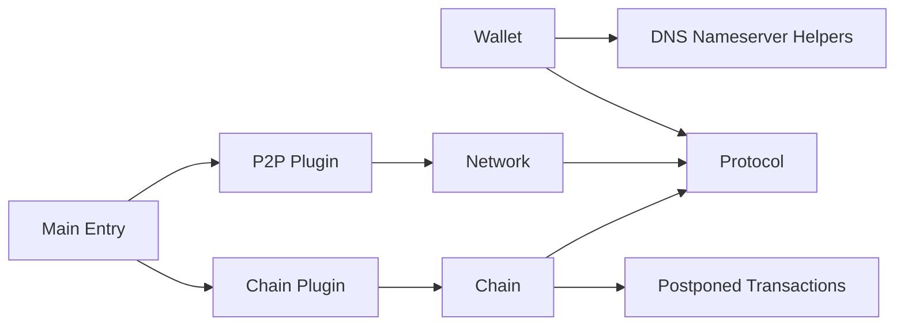

**Diagram sources**
- [libraries/wallet/include/graphene/wallet/wallet.hpp:18-21](file://libraries/wallet/include/graphene/wallet/wallet.hpp#L18-L21)
- [libraries/protocol/include/graphene/protocol/operations.hpp:3-6](file://libraries/protocol/include/graphene/protocol/operations.hpp#L3-L6)
- [libraries/network/include/graphene/network/node.hpp:26-30](file://libraries/network/include/graphene/network/node.hpp#L26-L30)
- [libraries/chain/include/graphene/chain/database.hpp:8-8](file://libraries/chain/include/graphene/chain/database.hpp#L8-L8)
- [libraries/chain/include/graphene/chain/db_with.hpp:37-100](file://libraries/chain/include/graphene/chain/db_with.hpp#L37-L100)
- [plugins/p2p/include/graphene/plugins/p2p/p2p_plugin.hpp:3-3](file://plugins/p2p/include/graphene/plugins/p2p/p2p_plugin.hpp#L3-L3)
- [plugins/chain/include/graphene/plugins/chain/plugin.hpp:7-7](file://plugins/chain/include/graphene/plugins/chain/plugin.hpp#L7-L7)
- [programs/vizd/main.cpp:106-140](file://programs/vizd/main.cpp#L106-L140)

**Section sources**
- [programs/vizd/main.cpp:106-140](file://programs/vizd/main.cpp#L106-L140)
- [plugins/chain/include/graphene/plugins/chain/plugin.hpp:7-7](file://plugins/chain/include/graphene/plugins/chain/plugin.hpp#L7-L7)
- [plugins/p2p/include/graphene/plugins/p2p/p2p_plugin.hpp:3-3](file://plugins/p2p/include/graphene/plugins/p2p/p2p_plugin.hpp#L3-L3)
- [libraries/chain/include/graphene/chain/database.hpp:8-8](file://libraries/chain/include/graphene/chain/database.hpp#L8-L8)
- [libraries/network/include/graphene/network/node.hpp:26-30](file://libraries/network/include/graphene/network/node.hpp#L26-L30)
- [libraries/wallet/include/graphene/wallet/wallet.hpp:18-21](file://libraries/wallet/include/graphene/wallet/wallet.hpp#L18-L21)
- [libraries/chain/include/graphene/chain/db_with.hpp:37-100](file://libraries/chain/include/graphene/chain/db_with.hpp#L37-L100)

## Performance Considerations
- Database tuning: shared memory sizing, flush intervals, and checkpoints reduce I/O overhead
- Validation skipping flags: during reindex or trusted scenarios, selective validation can accelerate startup
- Network bandwidth: rate limiting and propagation tracking help manage traffic
- Wallet caching: minimal caching assumptions favor local APIs with fast node connections
- Operation processing: efficient static_variant dispatch and lazy evaluation optimize performance
- DNS validation: lightweight validation functions minimize overhead for DNS metadata operations
- Postponed transactions: accurate counting prevents unnecessary processing and improves block production efficiency
- Execution limits: configurable time limits prevent excessive processing time during block production

## Troubleshooting Guide
Common issues and diagnostics:
- Validation failures: inspect skip flags and hardfork versions; use validation steps to narrow down failure points
- Authority verification errors: ensure required signatures and approvals match operation requirements
- Network sync stalls: check peer counts, sync status callbacks, and bandwidth limits
- Wallet signing problems: verify chain ID, key derivation, and memo encryption
- Operation classification errors: verify operation type and category using is_virtual_operation and is_data_operation functions
- DNS metadata errors: validate DNS records using ns_validate_metadata and check for proper JSON formatting
- SSL hash validation failures: ensure 64-character hexadecimal format for SSL certificate hashes
- TTL validation errors: verify positive integer values for DNS record TTL settings
- Postponed transactions issues: check block size limits, execution time limits, and known transaction filtering
- Logging accuracy: verify postponed transaction counters and avoid false 'Postponed' messages for skipped known transactions

**Section sources**
- [libraries/chain/include/graphene/chain/database.hpp:56-73](file://libraries/chain/include/graphene/chain/database.hpp#L56-L73)
- [libraries/protocol/transaction.cpp:94-200](file://libraries/protocol/transaction.cpp#L94-L200)
- [libraries/network/include/graphene/network/node.hpp:143-148](file://libraries/network/include/graphene/network/node.hpp#L143-L148)
- [libraries/wallet/include/graphene/wallet/wallet.hpp:311-331](file://libraries/wallet/include/graphene/wallet/wallet.hpp#L311-L331)
- [libraries/protocol/operations.cpp:17-52](file://libraries/protocol/operations.cpp#L17-L52)
- [libraries/wallet/wallet.cpp:2640-2673](file://libraries/wallet/wallet.cpp#L2640-L2673)
- [libraries/chain/database.cpp:1165-1202](file://libraries/chain/database.cpp#L1165-L1202)
- [libraries/chain/database.cpp:549-555](file://libraries/chain/database.cpp#L549-L555)

## Conclusion
The VIZ CPP Node core libraries form a cohesive architecture: Protocol defines canonical operations and transactions, Chain manages state and validation with accurate postponed transactions processing, Network enables peer synchronization and propagation, and Wallet provides signing and key management. The enhanced documentation now provides comprehensive coverage of blockchain operations, data types, protocol specifications, DNS nameserver helper functionality, and accurate postponed transactions processing with corrected logging behavior, supporting robust transaction processing, block validation, peer coordination, and DNS metadata management essential to a production blockchain node.

**Updated** Enhanced documentation provides expanded coverage of blockchain operations, data types, protocol specifications, DNS nameserver helper functionality, and accurate postponed transactions processing with corrected logging behavior, making it easier for developers to understand and work with the VIZ blockchain protocol and manage DNS records within account metadata.