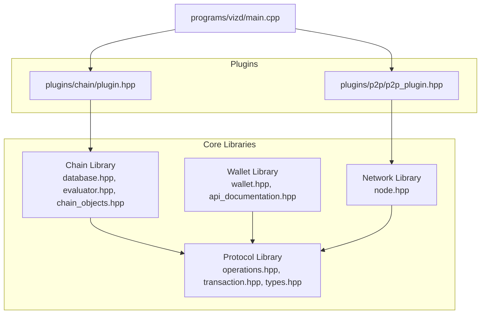
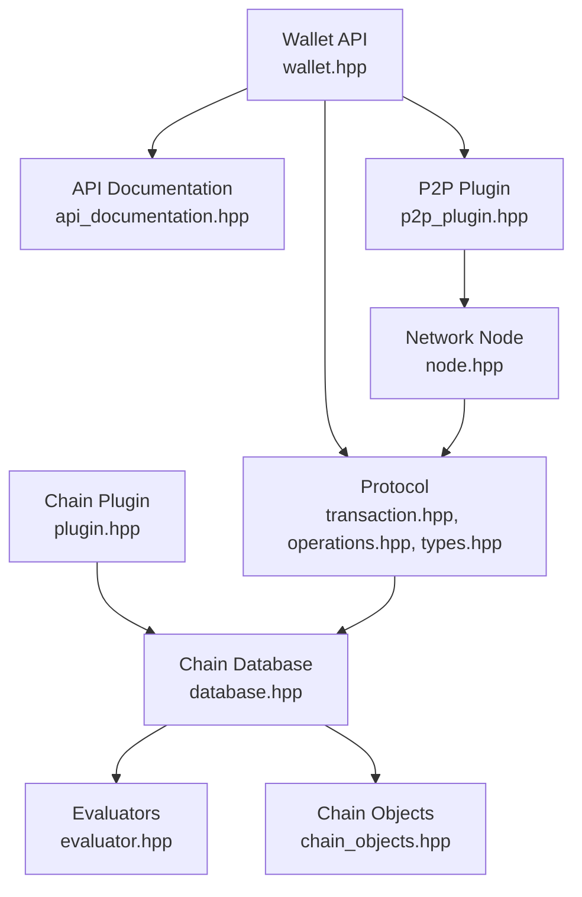
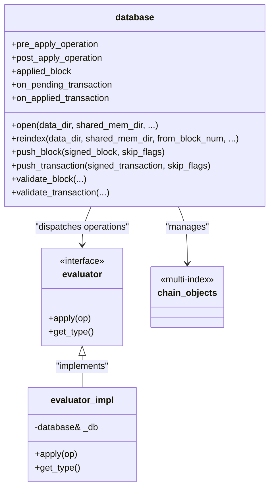
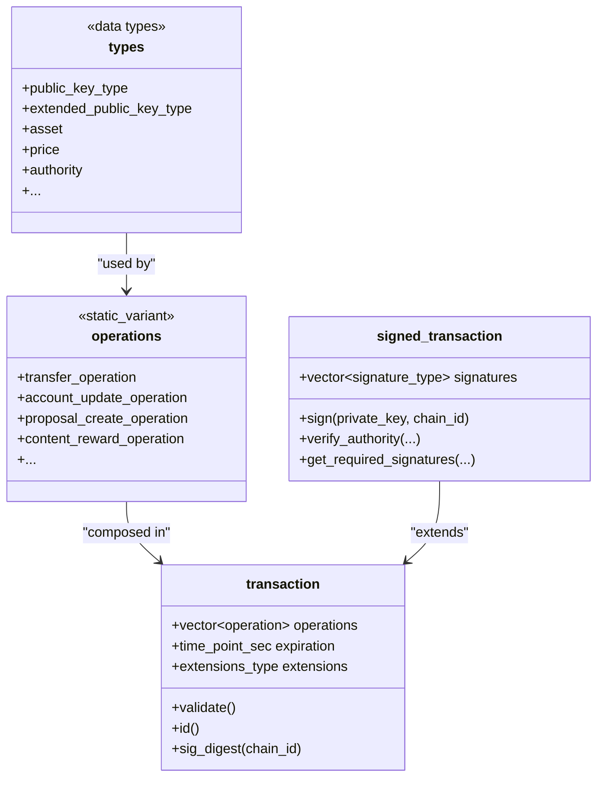
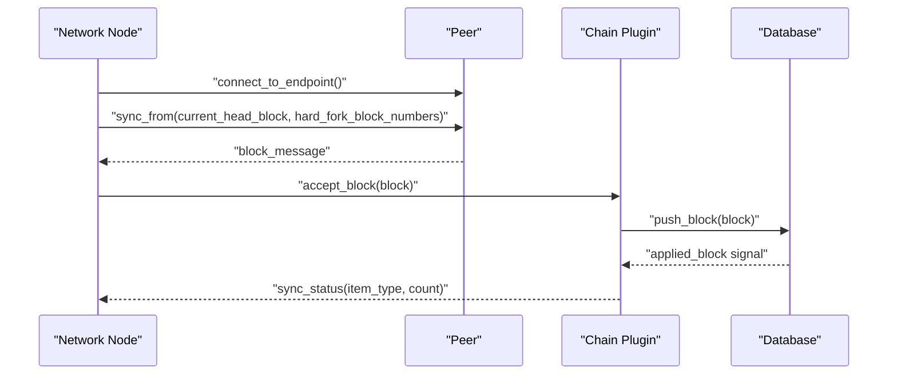
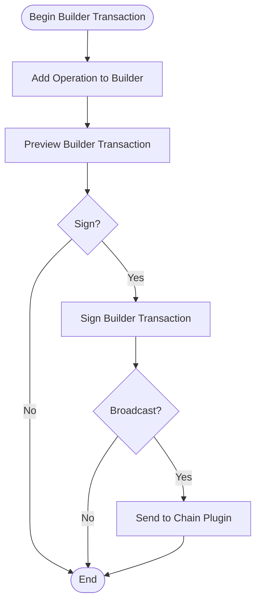
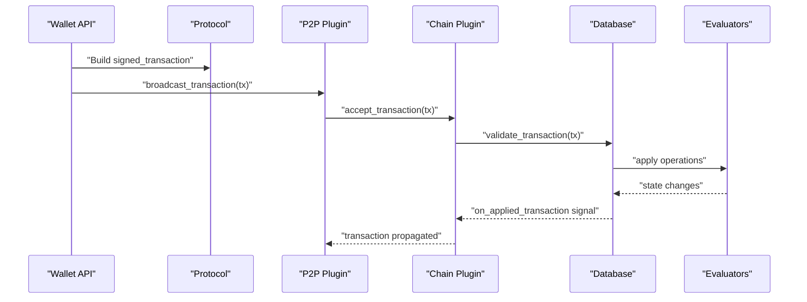
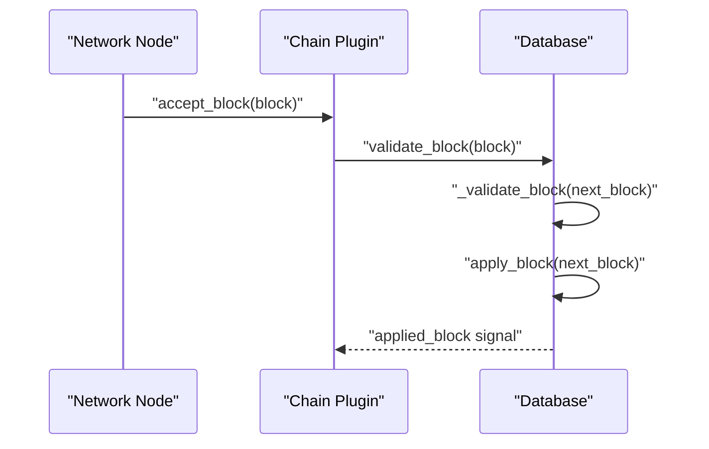
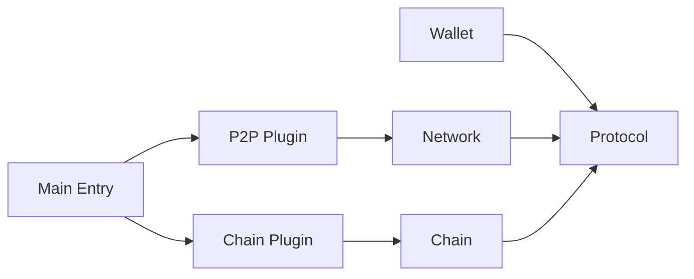

# Core Libraries

<cite>
**Referenced Files in This Document**
- [libraries/chain/include/graphene/chain/database.hpp](file://libraries/chain/include/graphene/chain/database.hpp)
- [libraries/chain/database.cpp](file://libraries/chain/database.cpp)
- [libraries/chain/include/graphene/chain/evaluator.hpp](file://libraries/chain/include/graphene/chain/evaluator.hpp)
- [libraries/chain/include/graphene/chain/chain_objects.hpp](file://libraries/chain/include/graphene/chain/chain_objects.hpp)
- [libraries/protocol/include/graphene/protocol/operations.hpp](file://libraries/protocol/include/graphene/protocol/operations.hpp)
- [libraries/protocol/include/graphene/protocol/transaction.hpp](file://libraries/protocol/include/graphene/protocol/transaction.hpp)
- [libraries/protocol/transaction.cpp](file://libraries/protocol/transaction.cpp)
- [libraries/protocol/include/graphene/protocol/types.hpp](file://libraries/protocol/include/graphene/protocol/types.hpp)
- [libraries/protocol/operations.cpp](file://libraries/protocol/operations.cpp)
- [libraries/protocol/include/graphene/protocol/chain_operations.hpp](file://libraries/protocol/include/graphene/protocol/chain_operations.hpp)
- [libraries/protocol/include/graphene/protocol/chain_virtual_operations.hpp](file://libraries/protocol/include/graphene/protocol/chain_virtual_operations.hpp)
- [libraries/network/include/graphene/network/node.hpp](file://libraries/network/include/graphene/network/node.hpp)
- [libraries/network/node.cpp](file://libraries/network/node.cpp)
- [libraries/wallet/include/graphene/wallet/wallet.hpp](file://libraries/wallet/include/graphene/wallet/wallet.hpp)
- [libraries/wallet/wallet.cpp](file://libraries/wallet/wallet.cpp)
- [libraries/wallet/include/graphene/wallet/api_documentation.hpp](file://libraries/wallet/include/graphene/wallet/api_documentation.hpp)
- [plugins/chain/include/graphene/plugins/chain/plugin.hpp](file://plugins/chain/include/graphene/plugins/chain/plugin.hpp)
- [plugins/p2p/include/graphene/plugins/p2p/p2p_plugin.hpp](file://plugins/p2p/include/graphene/plugins/p2p/p2p_plugin.hpp)
- [programs/vizd/main.cpp](file://programs/vizd/main.cpp)
</cite>

## Update Summary
**Changes Made**
- Enhanced comprehensive operation documentation coverage with detailed operation definitions
- Expanded data type documentation including cryptographic types, asset types, and authority structures
- Added protocol specification documentation with operation categorization and virtual operations
- Improved wallet API documentation with prototype operation generation and method descriptions

## Table of Contents
1. [Introduction](#introduction)
2. [Project Structure](#project-structure)
3. [Core Components](#core-components)
4. [Architecture Overview](#architecture-overview)
5. [Detailed Component Analysis](#detailed-component-analysis)
6. [Blockchain Operations and Data Types](#blockchain-operations-and-data-types)
7. [Protocol Specifications](#protocol-specifications)
8. [Dependency Analysis](#dependency-analysis)
9. [Performance Considerations](#performance-considerations)
10. [Troubleshooting Guide](#troubleshooting-guide)
11. [Conclusion](#conclusion)

## Introduction
This document explains the VIZ CPP Node core libraries that form the foundation of the blockchain node. The four main library categories are:
- Chain library: blockchain state management, validation, and consensus
- Protocol library: transaction and operation definitions and cryptographic signing
- Network library: peer-to-peer communication and synchronization
- Wallet library: transaction signing and key management

These libraries interact closely: the Chain library validates and applies operations, the Protocol library defines operations and transactions, the Network library propagates blocks and transactions across peers, and the Wallet library signs transactions before they are broadcast.

**Updated** Enhanced documentation now includes comprehensive coverage of blockchain operations, data types, and protocol specifications with detailed operation definitions and cryptographic type documentation.

## Project Structure
The core libraries are organized under the libraries/ directory, with each library providing focused capabilities:
- libraries/chain: state machine, evaluators, database, fork management, block processing
- libraries/protocol: operations, transactions, signing, types, chain constants
- libraries/network: P2P node, peer connections, message handling, synchronization
- libraries/wallet: transaction builder, signing, key management, APIs

Plugins integrate these libraries into a full node via the appbase framework. The main entry point initializes plugins and starts the node.

**Diagram sources**
- [programs/vizd/main.cpp](file://programs/vizd/main.cpp#L106-L140)
- [plugins/chain/include/graphene/plugins/chain/plugin.hpp](file://plugins/chain/include/graphene/plugins/chain/plugin.hpp#L21-L46)
- [plugins/p2p/include/graphene/plugins/p2p/p2p_plugin.hpp](file://plugins/p2p/include/graphene/plugins/p2p/p2p_plugin.hpp#L18-L46)
- [libraries/chain/include/graphene/chain/database.hpp](file://libraries/chain/include/graphene/chain/database.hpp#L36-L561)
- [libraries/protocol/include/graphene/protocol/operations.hpp](file://libraries/protocol/include/graphene/protocol/operations.hpp#L13-L102)
- [libraries/network/include/graphene/network/node.hpp](file://libraries/network/include/graphene/network/node.hpp#L190-L304)
- [libraries/wallet/include/graphene/wallet/wallet.hpp](file://libraries/wallet/include/graphene/wallet/wallet.hpp#L96-L1067)

**Section sources**
- [programs/vizd/main.cpp](file://programs/vizd/main.cpp#L62-L91)
- [plugins/chain/include/graphene/plugins/chain/plugin.hpp](file://plugins/chain/include/graphene/plugins/chain/plugin.hpp#L21-L46)
- [plugins/p2p/include/graphene/plugins/p2p/p2p_plugin.hpp](file://plugins/p2p/include/graphene/plugins/p2p/p2p_plugin.hpp#L18-L46)

## Core Components
This section introduces the primary responsibilities and key classes of each library.

- Chain Library
  - database: central state machine managing blockchain objects, fork database, block log, and applying operations
  - evaluator: pluggable operation handlers that mutate state according to protocol rules
  - chain_objects: persistent object model (accounts, content, escrow, vesting routes, etc.)
  - Responsibilities: block validation, transaction validation, state transitions, hardfork handling, witness scheduling

- Protocol Library
  - operations: static_variant of all supported operations (transfers, governance, content, etc.)
  - transaction: structure with operations, expiration, reference block, and cryptographic signing
  - types: comprehensive data type definitions including cryptographic keys, asset types, and authority structures
  - Responsibilities: define canonical operation semantics, transaction signing and verification, authority checks

- Network Library
  - node: P2P node with peer connections, message propagation, sync protocol, and broadcasting
  - Responsibilities: block and transaction propagation, peer discovery, sync from peers, bandwidth limits

- Wallet Library
  - wallet_api: transaction builder, signing, key management, proposal creation, account operations
  - api_documentation: method descriptions and help system for wallet operations
  - Responsibilities: construct transactions, sign with private keys, manage encrypted key storage, expose APIs

**Updated** Enhanced with comprehensive data type coverage and operation documentation.

**Section sources**
- [libraries/chain/include/graphene/chain/database.hpp](file://libraries/chain/include/graphene/chain/database.hpp#L36-L561)
- [libraries/chain/include/graphene/chain/evaluator.hpp](file://libraries/chain/include/graphene/chain/evaluator.hpp#L11-L45)
- [libraries/chain/include/graphene/chain/chain_objects.hpp](file://libraries/chain/include/graphene/chain/chain_objects.hpp#L20-L200)
- [libraries/protocol/include/graphene/protocol/operations.hpp](file://libraries/protocol/include/graphene/protocol/operations.hpp#L13-L102)
- [libraries/protocol/include/graphene/protocol/transaction.hpp](file://libraries/protocol/include/graphene/protocol/transaction.hpp#L12-L101)
- [libraries/protocol/include/graphene/protocol/types.hpp](file://libraries/protocol/include/graphene/protocol/types.hpp#L75-L207)
- [libraries/network/include/graphene/network/node.hpp](file://libraries/network/include/graphene/network/node.hpp#L190-L304)
- [libraries/wallet/include/graphene/wallet/wallet.hpp](file://libraries/wallet/include/graphene/wallet/wallet.hpp#L96-L1067)
- [libraries/wallet/include/graphene/wallet/api_documentation.hpp](file://libraries/wallet/include/graphene/wallet/api_documentation.hpp#L37-L75)

## Architecture Overview
The libraries integrate through explicit interfaces and signals. The Chain library exposes a database interface and signals for operation application. The Protocol library defines the canonical operation types and transaction structures. The Network library consumes blocks and transactions from the Chain library and broadcasts them to peers. The Wallet library constructs and signs transactions using the Protocol library and sends them to the Chain library via the P2P plugin.

**Diagram sources**
- [libraries/wallet/include/graphene/wallet/wallet.hpp](file://libraries/wallet/include/graphene/wallet/wallet.hpp#L96-L1067)
- [libraries/wallet/include/graphene/wallet/api_documentation.hpp](file://libraries/wallet/include/graphene/wallet/api_documentation.hpp#L43-L75)
- [libraries/protocol/include/graphene/protocol/transaction.hpp](file://libraries/protocol/include/graphene/protocol/transaction.hpp#L12-L101)
- [libraries/protocol/include/graphene/protocol/operations.hpp](file://libraries/protocol/include/graphene/protocol/operations.hpp#L13-L102)
- [libraries/protocol/include/graphene/protocol/types.hpp](file://libraries/protocol/include/graphene/protocol/types.hpp#L75-L207)
- [libraries/chain/include/graphene/chain/database.hpp](file://libraries/chain/include/graphene/chain/database.hpp#L36-L561)
- [libraries/chain/include/graphene/chain/evaluator.hpp](file://libraries/chain/include/graphene/chain/evaluator.hpp#L11-L45)
- [libraries/chain/include/graphene/chain/chain_objects.hpp](file://libraries/chain/include/graphene/chain/chain_objects.hpp#L20-L200)
- [libraries/network/include/graphene/network/node.hpp](file://libraries/network/include/graphene/network/node.hpp#L190-L304)
- [plugins/chain/include/graphene/plugins/chain/plugin.hpp](file://plugins/chain/include/graphene/plugins/chain/plugin.hpp#L21-L46)
- [plugins/p2p/include/graphene/plugins/p2p/p2p_plugin.hpp](file://plugins/p2p/include/graphene/plugins/p2p/p2p_plugin.hpp#L18-L46)

## Detailed Component Analysis

### Chain Library
The Chain library is the core state machine. It manages:
- Blockchain state: persistent objects, indexes, and undo history
- Validation pipeline: block and transaction validation with configurable skip flags
- Fork management: fork database and branch selection
- Operation application: dispatch to evaluators and emit notifications
- Hardfork handling: versioning and activation logic

Key classes and responsibilities:
- database: open/reindex, push/pop blocks, push transactions, notify signals, hardfork control
- evaluator: base class for operation-specific logic
- chain_objects: multi-index containers for persistent state

**Diagram sources**
- [libraries/chain/include/graphene/chain/database.hpp](file://libraries/chain/include/graphene/chain/database.hpp#L36-L561)
- [libraries/chain/include/graphene/chain/evaluator.hpp](file://libraries/chain/include/graphene/chain/evaluator.hpp#L11-L45)
- [libraries/chain/include/graphene/chain/chain_objects.hpp](file://libraries/chain/include/graphene/chain/chain_objects.hpp#L20-L200)

**Section sources**
- [libraries/chain/include/graphene/chain/database.hpp](file://libraries/chain/include/graphene/chain/database.hpp#L36-L561)
- [libraries/chain/database.cpp](file://libraries/chain/database.cpp#L198-L200)
- [libraries/chain/include/graphene/chain/evaluator.hpp](file://libraries/chain/include/graphene/chain/evaluator.hpp#L11-L45)
- [libraries/chain/include/graphene/chain/chain_objects.hpp](file://libraries/chain/include/graphene/chain/chain_objects.hpp#L20-L200)

### Protocol Library
The Protocol library defines the canonical operation types and transaction structures:
- operations: static_variant of all operations (transfers, governance, content, etc.)
- transaction: operations, expiration, reference block, and signing/verification helpers
- types: comprehensive data type definitions including cryptographic keys, asset types, and authority structures
- Authority and sign_state: required authorities and signature verification

**Diagram sources**
- [libraries/protocol/include/graphene/protocol/operations.hpp](file://libraries/protocol/include/graphene/protocol/operations.hpp#L13-L102)
- [libraries/protocol/include/graphene/protocol/transaction.hpp](file://libraries/protocol/include/graphene/protocol/transaction.hpp#L12-L101)
- [libraries/protocol/include/graphene/protocol/types.hpp](file://libraries/protocol/include/graphene/protocol/types.hpp#L75-L207)

**Section sources**
- [libraries/protocol/include/graphene/protocol/operations.hpp](file://libraries/protocol/include/graphene/protocol/operations.hpp#L13-L102)
- [libraries/protocol/include/graphene/protocol/transaction.hpp](file://libraries/protocol/include/graphene/protocol/transaction.hpp#L12-L101)
- [libraries/protocol/include/graphene/protocol/types.hpp](file://libraries/protocol/include/graphene/protocol/types.hpp#L75-L207)
- [libraries/protocol/transaction.cpp](file://libraries/protocol/transaction.cpp#L30-L200)

### Network Library
The Network library provides peer-to-peer connectivity:
- node: P2P node with delegate interface, peer connections, message propagation, sync protocol
- Broadcasting: blocks and transactions to peers
- Sync: blockchain synopsis, block requests, and peer synchronization

**Diagram sources**
- [libraries/network/include/graphene/network/node.hpp](file://libraries/network/include/graphene/network/node.hpp#L190-L304)
- [plugins/chain/include/graphene/plugins/chain/plugin.hpp](file://plugins/chain/include/graphene/plugins/chain/plugin.hpp#L44-L46)

**Section sources**
- [libraries/network/include/graphene/network/node.hpp](file://libraries/network/include/graphene/network/node.hpp#L190-L304)
- [libraries/network/node.cpp](file://libraries/network/node.cpp#L1-L200)
- [plugins/chain/include/graphene/plugins/chain/plugin.hpp](file://plugins/chain/include/graphene/plugins/chain/plugin.hpp#L44-L46)

### Wallet Library
The Wallet library provides transaction construction and signing:
- wallet_api: builder APIs, signing, key management, proposal creation, account operations
- api_documentation: method descriptions and help system for wallet operations
- Signing: uses Protocol transaction structures and private keys
- Integration: communicates with the node via plugins and remote APIs

**Diagram sources**
- [libraries/wallet/include/graphene/wallet/wallet.hpp](file://libraries/wallet/include/graphene/wallet/wallet.hpp#L132-L180)
- [libraries/wallet/include/graphene/wallet/api_documentation.hpp](file://libraries/wallet/include/graphene/wallet/api_documentation.hpp#L43-L75)

**Section sources**
- [libraries/wallet/include/graphene/wallet/wallet.hpp](file://libraries/wallet/include/graphene/wallet/wallet.hpp#L96-L1067)
- [libraries/wallet/wallet.cpp](file://libraries/wallet/wallet.cpp#L1-L200)
- [libraries/wallet/include/graphene/wallet/api_documentation.hpp](file://libraries/wallet/include/graphene/wallet/api_documentation.hpp#L37-L75)

### Typical Operations: Transaction Processing and Block Validation

#### Transaction Processing Flow
- Wallet builds and signs a transaction using Protocol structures
- P2P plugin broadcasts the signed transaction to peers
- Chain plugin receives and validates the transaction via the Chain library
- Chain library applies the transaction's operations through evaluators
- Database emits notifications for pre/post application and applied block

**Diagram sources**
- [libraries/wallet/include/graphene/wallet/wallet.hpp](file://libraries/wallet/include/graphene/wallet/wallet.hpp#L132-L180)
- [libraries/protocol/include/graphene/protocol/transaction.hpp](file://libraries/protocol/include/graphene/protocol/transaction.hpp#L57-L101)
- [plugins/p2p/include/graphene/plugins/p2p/p2p_plugin.hpp](file://plugins/p2p/include/graphene/plugins/p2p/p2p_plugin.hpp#L46-L46)
- [plugins/chain/include/graphene/plugins/chain/plugin.hpp](file://plugins/chain/include/graphene/plugins/chain/plugin.hpp#L46-L46)
- [libraries/chain/include/graphene/chain/database.hpp](file://libraries/chain/include/graphene/chain/database.hpp#L200-L275)

#### Block Validation Flow
- Network receives a block from peers
- Chain plugin accepts the block and validates it
- Database validates block header, extensions, and applies block-level operations
- Database updates global properties, witness schedules, and emits applied_block signal

**Diagram sources**
- [libraries/network/include/graphene/network/node.hpp](file://libraries/network/include/graphene/network/node.hpp#L79-L80)
- [plugins/chain/include/graphene/plugins/chain/plugin.hpp](file://plugins/chain/include/graphene/plugins/chain/plugin.hpp#L44-L44)
- [libraries/chain/include/graphene/chain/database.hpp](file://libraries/chain/include/graphene/chain/database.hpp#L194-L226)

## Blockchain Operations and Data Types

### Comprehensive Operation Coverage
The protocol library now provides extensive operation documentation covering all blockchain operations:

#### Core Operations
- **Account Management**: account_create_operation, account_update_operation, account_metadata_operation
- **Token Operations**: transfer_operation, transfer_to_vesting_operation, withdraw_vesting_operation
- **Governance**: witness_update_operation, chain_properties_update_operation, proposal operations
- **Content Operations**: content_operation, delete_content_operation, vote_operation
- **Escrow Operations**: escrow_transfer_operation, escrow_approve_operation, escrow_dispute_operation, escrow_release_operation
- **Virtual Operations**: author_reward_operation, curation_reward_operation, content_reward_operation

#### Advanced Operations
- **Committee Operations**: Various committee request and approval operations
- **Award Operations**: Award creation and distribution operations
- **Paid Subscription Operations**: Subscription management and billing operations
- **Account Sale Operations**: Account marketplace operations
- **Hardfork Operations**: System upgrade and maintenance operations

#### Data Type Definitions
The types.hpp file provides comprehensive data type coverage:

- **Cryptographic Types**: 
  - public_key_type, extended_public_key_type, extended_private_key_type
  - signature_type, chain_id_type
- **Asset Types**: 
  - asset, price, share_type for token and share management
- **Authority Structures**: 
  - authority, weight_type for multi-signature requirements
- **Name Types**: 
  - account_name_type for account identification

**Section sources**
- [libraries/protocol/include/graphene/protocol/operations.hpp](file://libraries/protocol/include/graphene/protocol/operations.hpp#L13-L102)
- [libraries/protocol/include/graphene/protocol/chain_operations.hpp](file://libraries/protocol/include/graphene/protocol/chain_operations.hpp#L11-L800)
- [libraries/protocol/include/graphene/protocol/chain_virtual_operations.hpp](file://libraries/protocol/include/graphene/protocol/chain_virtual_operations.hpp#L11-L329)
- [libraries/protocol/include/graphene/protocol/types.hpp](file://libraries/protocol/include/graphene/protocol/types.hpp#L75-L207)
- [libraries/protocol/operations.cpp](file://libraries/protocol/operations.cpp#L17-L52)

### Operation Categorization and Classification
Operations are systematically categorized for better understanding and implementation:

#### Operation Categories
- **Regular Operations**: Standard blockchain operations that affect state
- **Virtual Operations**: System-generated operations for rewards and maintenance
- **Data Operations**: Operations carrying raw data payloads
- **Governance Operations**: Operations affecting chain parameters and governance

#### Operation Properties
Each operation includes validation rules, authority requirements, and extension mechanisms for future enhancements.

**Section sources**
- [libraries/protocol/operations.cpp](file://libraries/protocol/operations.cpp#L17-L52)
- [libraries/protocol/include/graphene/protocol/operations.hpp](file://libraries/protocol/include/graphene/protocol/operations.hpp#L104-L113)

## Protocol Specifications

### Detailed Operation Documentation
The protocol now includes comprehensive documentation for all operation types:

#### Operation Structure
Each operation follows a standardized structure:
- Base class inheritance from base_operation or virtual_operation
- validate() method for input validation
- get_required_*_authorities() methods for authority determination
- Extension support for future compatibility

#### Authority Requirements
Operations specify required authorities:
- Active authorities for standard operations
- Master authorities for sensitive operations
- Regular authorities for metadata operations
- Custom authorities for specialized operations

#### Virtual Operations
Virtual operations represent system events:
- Reward distributions (author_reward_operation, curation_reward_operation)
- Maintenance operations (hardfork_operation, shutdown_witness_operation)
- State transitions (fill_vesting_withdraw_operation)

**Section sources**
- [libraries/protocol/include/graphene/protocol/chain_operations.hpp](file://libraries/protocol/include/graphene/protocol/chain_operations.hpp#L11-L800)
- [libraries/protocol/include/graphene/protocol/chain_virtual_operations.hpp](file://libraries/protocol/include/graphene/protocol/chain_virtual_operations.hpp#L11-L329)

### Transaction Structure and Validation
Transactions follow a strict validation pipeline:
- Operation composition and ordering
- Expiration handling and reference block validation
- Signature verification and authority checking
- Extension processing and custom operation support

**Section sources**
- [libraries/protocol/include/graphene/protocol/transaction.hpp](file://libraries/protocol/include/graphene/protocol/transaction.hpp#L12-L101)
- [libraries/protocol/transaction.cpp](file://libraries/protocol/transaction.cpp#L30-L200)

## Dependency Analysis
The libraries exhibit layered dependencies:
- Chain depends on Protocol for operation types and transaction structures
- Network depends on Protocol for message serialization and types
- Wallet depends on Protocol for transaction construction and signing
- Plugins depend on Chain for database access and on Network for P2P operations

**Diagram sources**
- [libraries/wallet/include/graphene/wallet/wallet.hpp](file://libraries/wallet/include/graphene/wallet/wallet.hpp#L18-L21)
- [libraries/protocol/include/graphene/protocol/operations.hpp](file://libraries/protocol/include/graphene/protocol/operations.hpp#L3-L6)
- [libraries/network/include/graphene/network/node.hpp](file://libraries/network/include/graphene/network/node.hpp#L26-L30)
- [libraries/chain/include/graphene/chain/database.hpp](file://libraries/chain/include/graphene/chain/database.hpp#L8-L8)
- [plugins/p2p/include/graphene/plugins/p2p/p2p_plugin.hpp](file://plugins/p2p/include/graphene/plugins/p2p/p2p_plugin.hpp#L3-L3)
- [plugins/chain/include/graphene/plugins/chain/plugin.hpp](file://plugins/chain/include/graphene/plugins/chain/plugin.hpp#L7-L7)
- [programs/vizd/main.cpp](file://programs/vizd/main.cpp#L106-L140)

**Section sources**
- [programs/vizd/main.cpp](file://programs/vizd/main.cpp#L106-L140)
- [plugins/chain/include/graphene/plugins/chain/plugin.hpp](file://plugins/chain/include/graphene/plugins/chain/plugin.hpp#L7-L7)
- [plugins/p2p/include/graphene/plugins/p2p/p2p_plugin.hpp](file://plugins/p2p/include/graphene/plugins/p2p/p2p_plugin.hpp#L3-L3)
- [libraries/chain/include/graphene/chain/database.hpp](file://libraries/chain/include/graphene/chain/database.hpp#L8-L8)
- [libraries/network/include/graphene/network/node.hpp](file://libraries/network/include/graphene/network/node.hpp#L26-L30)
- [libraries/wallet/include/graphene/wallet/wallet.hpp](file://libraries/wallet/include/graphene/wallet/wallet.hpp#L18-L21)

## Performance Considerations
- Database tuning: shared memory sizing, flush intervals, and checkpoints reduce I/O overhead
- Validation skipping flags: during reindex or trusted scenarios, selective validation can accelerate startup
- Network bandwidth: rate limiting and propagation tracking help manage traffic
- Wallet caching: minimal caching assumptions favor local APIs with fast node connections
- Operation processing: efficient static_variant dispatch and lazy evaluation optimize performance

## Troubleshooting Guide
Common issues and diagnostics:
- Validation failures: inspect skip flags and hardfork versions; use validation steps to narrow down failure points
- Authority verification errors: ensure required signatures and approvals match operation requirements
- Network sync stalls: check peer counts, sync status callbacks, and bandwidth limits
- Wallet signing problems: verify chain ID, key derivation, and memo encryption
- Operation classification errors: verify operation type and category using is_virtual_operation and is_data_operation functions

**Section sources**
- [libraries/chain/include/graphene/chain/database.hpp](file://libraries/chain/include/graphene/chain/database.hpp#L56-L73)
- [libraries/protocol/transaction.cpp](file://libraries/protocol/transaction.cpp#L94-L200)
- [libraries/network/include/graphene/network/node.hpp](file://libraries/network/include/graphene/network/node.hpp#L143-L148)
- [libraries/wallet/include/graphene/wallet/wallet.hpp](file://libraries/wallet/include/graphene/wallet/wallet.hpp#L311-L331)
- [libraries/protocol/operations.cpp](file://libraries/protocol/operations.cpp#L17-L52)

## Conclusion
The VIZ CPP Node core libraries form a cohesive architecture: Protocol defines canonical operations and transactions, Chain manages state and validation, Network enables peer synchronization and propagation, and Wallet provides signing and key management. The enhanced documentation now provides comprehensive coverage of blockchain operations, data types, and protocol specifications, supporting robust transaction processing, block validation, and peer coordination essential to a production blockchain node.

**Updated** Enhanced documentation provides expanded coverage of blockchain operations, data types, and protocol specifications including comprehensive operation documentation and data type coverage, making it easier for developers to understand and work with the VIZ blockchain protocol.