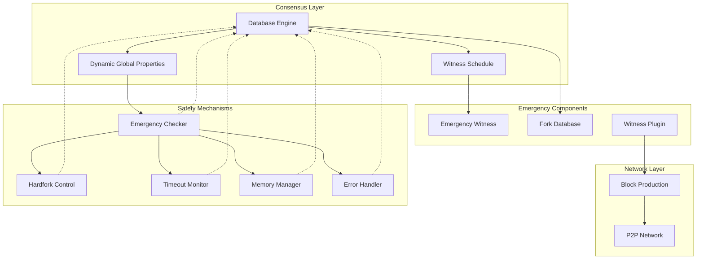
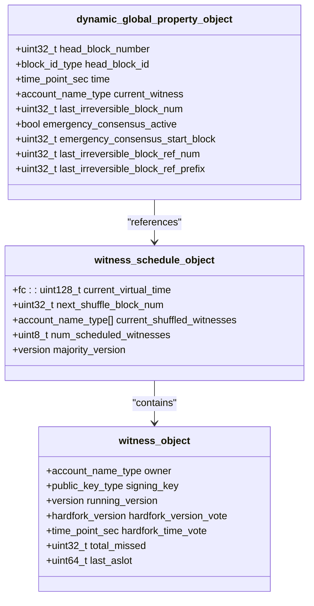
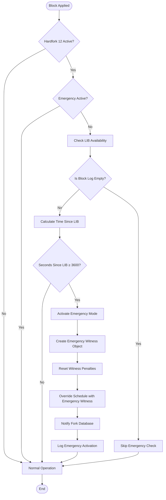
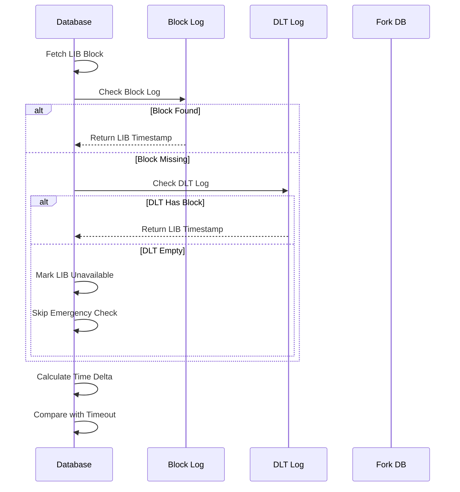
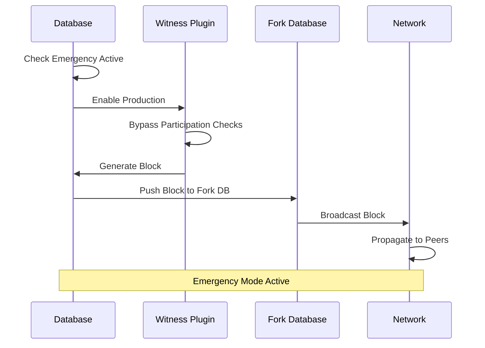
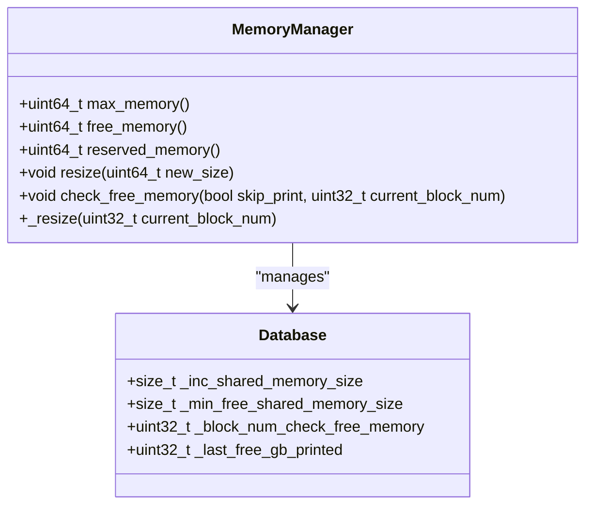
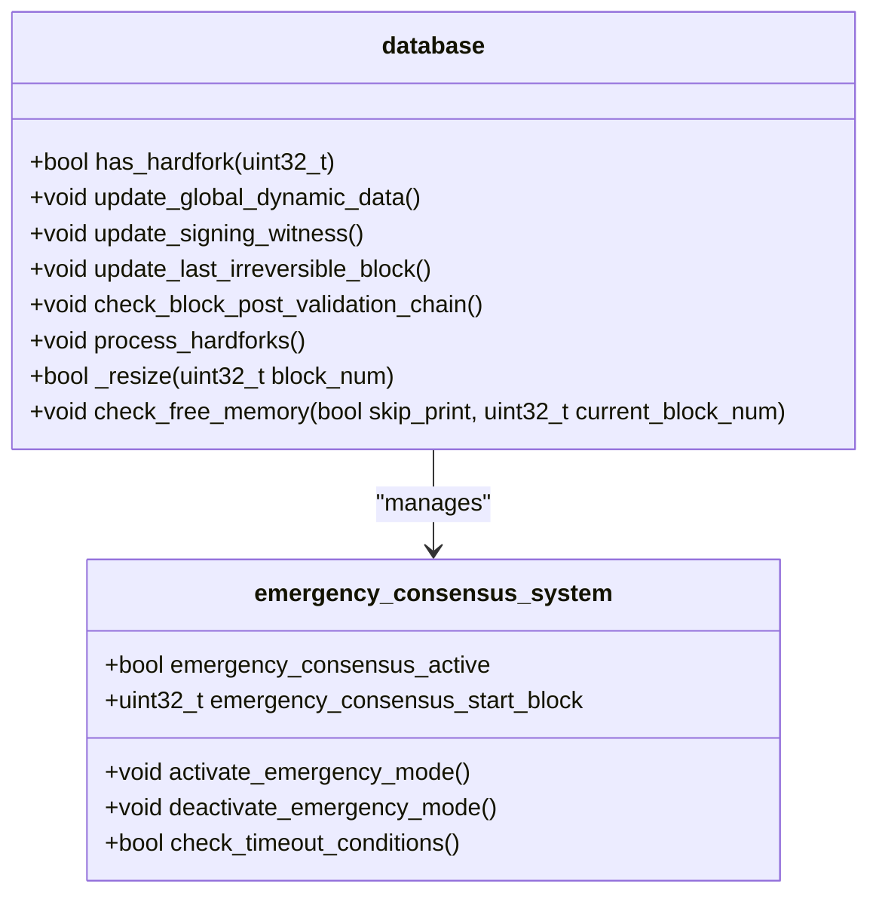

# Emergency Consensus System

<cite>
**Referenced Files in This Document**
- [database.cpp](file://libraries/chain/database.cpp)
- [database.hpp](file://libraries/chain/include/graphene/chain/database.hpp)
- [global_property_object.hpp](file://libraries/chain/include/graphene/chain/global_property_object.hpp)
- [witness_objects.hpp](file://libraries/chain/include/graphene/chain/witness_objects.hpp)
- [fork_database.cpp](file://libraries/chain/fork_database.cpp)
- [config.hpp](file://libraries/protocol/include/graphene/protocol/config.hpp)
- [witness.cpp](file://plugins/witness/witness.cpp)
- [witness.hpp](file://plugins/witness/include/graphene/plugins/witness/witness.hpp)
- [12.hf](file://libraries/chain/hardfork.d/12.hf)
- [chainbase.cpp](file://thirdparty/chainbase/src/chainbase.cpp)
</cite>

## Update Summary
**Changes Made**
- Enhanced emergency consensus detection algorithms with improved LIB timestamp monitoring
- Added comprehensive error handling throughout the consensus process
- Implemented enhanced memory management with detailed logging of free, reserved, and maximum memory states
- Improved network stall detection with better snapshot compatibility handling
- Added detailed memory resizing logging and monitoring capabilities

## Table of Contents
1. [Introduction](#introduction)
2. [System Architecture](#system-architecture)
3. [Core Components](#core-components)
4. [Emergency Consensus Activation](#emergency-consensus-activation)
5. [Enhanced Detection Algorithms](#enhanced-detection-algorithms)
6. [Emergency Mode Operations](#emergency-mode-operations)
7. [Exit Conditions](#exit-conditions)
8. [Network Behavior](#network-behavior)
9. [Configuration and Constants](#configuration-and-constants)
10. [Enhanced Memory Management](#enhanced-memory-management)
11. [Implementation Details](#implementation-details)
12. [Troubleshooting Guide](#troubleshooting-guide)
13. [Conclusion](#conclusion)

## Introduction

The Emergency Consensus System is a critical safety mechanism implemented in the VIZ blockchain to maintain network continuity during extended periods of network stall or witness failure. This system automatically activates when the blockchain stops producing blocks for a predetermined timeout period, ensuring the network remains functional even when regular witness production is compromised.

The system operates as a three-state safety enforcement mechanism, providing automatic recovery capabilities that prevent network paralysis during emergencies. It maintains consensus integrity while allowing the network to recover from various failure scenarios including witness failures, network partitions, or other catastrophic events.

**Updated** Enhanced with improved emergency consensus detection algorithms featuring better LIB timestamp monitoring and comprehensive error handling throughout the consensus process.

## System Architecture

The Emergency Consensus System is built on a distributed architecture that integrates multiple components working together to maintain blockchain functionality:

**Diagram sources**
- [database.cpp:4510-4623](file://libraries/chain/database.cpp#L4510-L4623)
- [fork_database.cpp:260-262](file://libraries/chain/fork_database.cpp#L260-L262)
- [witness.cpp:354-392](file://plugins/witness/witness.cpp#L354-L392)
- [database.cpp:562-590](file://libraries/chain/database.cpp#L562-L590)

The architecture consists of several key layers:

- **Consensus Layer**: Core blockchain state management and witness scheduling
- **Emergency Components**: Specialized emergency witness and fork database modifications  
- **Network Layer**: Peer-to-peer communication and block propagation
- **Safety Mechanisms**: Hardfork coordination, timeout monitoring, memory management, and error handling

## Core Components

### Dynamic Global Properties

The emergency consensus state is maintained through the dynamic global properties object, which tracks critical consensus parameters:

**Diagram sources**
- [global_property_object.hpp:24-146](file://libraries/chain/include/graphene/chain/global_property_object.hpp#L24-L146)
- [witness_objects.hpp:27-132](file://libraries/chain/include/graphene/chain/witness_objects.hpp#L27-L132)

### Emergency Witness Implementation

The emergency witness serves as the automated consensus producer during emergency conditions:

| Property | Value | Description |
|----------|-------|-------------|
| Account Name | `committee` | Emergency witness account identifier |
| Public Key | `VIZ75CRHVHPwYiUESy1bgN3KhVFbZCQQRA9jT6TnpzKAmpxMPD6Xv` | Block signing key |
| Role | Automated Producer | Produces blocks when network is stalled |

**Section sources**
- [config.hpp:114-119](file://libraries/protocol/include/graphene/protocol/config.hpp#L114-L119)
- [witness_objects.hpp:47-61](file://libraries/chain/include/graphene/chain/witness_objects.hpp#L47-L61)

## Emergency Consensus Activation

### Enhanced Timeout Detection Mechanism

The emergency consensus activation is triggered by monitoring the time elapsed since the last irreversible block (LIB) with improved timestamp handling:

**Diagram sources**
- [database.cpp:4510-4623](file://libraries/chain/database.cpp#L4510-L4623)
- [config.hpp:110-112](file://libraries/protocol/include/graphene/protocol/config.hpp#L110-L112)

### Enhanced Activation Triggers

The system monitors several key indicators to determine emergency activation with improved error handling:

1. **Timeout Threshold**: 3,600 seconds (1 hour) since last irreversible block
2. **Hardfork Activation**: Requires CHAIN_HARDFORK_12 to be active
3. **Network Stall Detection**: No blocks produced within timeout period
4. **Snapshot Compatibility**: Handles DLT mode scenarios with proper LIB availability checking
5. **Error Prevention**: Skips emergency check when LIB timestamp cannot be determined

**Section sources**
- [database.cpp:4510-4623](file://libraries/chain/database.cpp#L4510-L4623)
- [database.cpp:4522-4526](file://libraries/chain/database.cpp#L4522-L4526)

## Enhanced Detection Algorithms

### Improved LIB Timestamp Monitoring

The system now implements enhanced LIB timestamp monitoring with comprehensive error handling:

**Diagram sources**
- [database.cpp:4510-4520](file://libraries/chain/database.cpp#L4510-L4520)

### Network Stall Detection Improvements

The enhanced detection algorithm includes:

- **LIB Availability Validation**: Ensures LIB timestamp can be determined before activation
- **DLT Mode Compatibility**: Proper handling of snapshot restoration scenarios
- **False Activation Prevention**: Skips emergency check when LIB timestamp is unavailable
- **Graceful Degradation**: Continues normal operation when emergency conditions cannot be verified

**Section sources**
- [database.cpp:4510-4526](file://libraries/chain/database.cpp#L4510-L4526)
- [database.cpp:4522-4526](file://libraries/chain/database.cpp#L4522-L4526)

## Emergency Mode Operations

### Automatic Block Production

During emergency mode, the system automatically produces blocks using the emergency witness:

**Diagram sources**
- [witness.cpp:354-392](file://plugins/witness/witness.cpp#L354-L392)
- [fork_database.cpp:80-87](file://libraries/chain/fork_database.cpp#L80-L87)

### Fork Database Modifications

The fork database implements special handling for emergency mode with enhanced tie-breaking:

| Feature | Description | Impact |
|---------|-------------|--------|
| Deterministic Tie-Breaking | Lower block ID preferred during conflicts | Ensures network convergence |
| Emergency Mode Flag | Special state tracking | Modifies block acceptance rules |
| Hash Comparison | Prevents cascade disconnections | Maintains network stability |
| Enhanced Conflict Resolution | Improved handling of competing blocks | Reduces fork collisions |

**Section sources**
- [fork_database.cpp:80-87](file://libraries/chain/fork_database.cpp#L80-L87)
- [fork_database.cpp:260-262](file://libraries/chain/fork_database.cpp#L260-L262)

## Exit Conditions

### Automatic Deactivation

The emergency consensus mode deactivates automatically when:

**Diagram sources**
- [database.cpp:2255-2272](file://libraries/chain/database.cpp#L2255-L2272)

### Enhanced Exit Criteria

The system evaluates several conditions for emergency mode exit with improved monitoring:

1. **LIB Advancement**: Last Irreversible Block number exceeds start block
2. **Network Recovery**: 75% of real witnesses are producing consistently
3. **Automatic Trigger**: 21 consecutive blocks produced by emergency witness
4. **Manual Intervention**: System administrator override possible
5. **Real-time Monitoring**: Continuous LIB progress tracking during emergency

**Section sources**
- [database.cpp:2255-2272](file://libraries/chain/database.cpp#L2255-L2272)
- [config.hpp:121-123](file://libraries/protocol/include/graphene/protocol/config.hpp#L121-L123)

## Network Behavior

### Peer Connection Management

During emergency mode, the system implements special peer connection handling with enhanced stability measures:

| Scenario | Action | Rationale |
|----------|--------|-----------|
| Multiple Emergency Producers | Prefer lower block ID hash | Prevents network splits |
| Cascade Disconnections | Prevention measures | Maintains network stability |
| Block Propagation | Normal P2P behavior | Ensures consensus continuity |
| Fork Collisions | Deterministic resolution | Reduces network fragmentation |

### Enhanced Witness Participation Override

The emergency system bypasses normal witness participation requirements with improved error handling:

- **Participation Rate Checks**: Automatically enabled during emergency
- **Stale Block Production**: Allowed without penalties
- **Production Scheduling**: Emergency witness takes precedence
- **Conflict Resolution**: Enhanced tie-breaking algorithms
- **Schedule Updates**: Hybrid schedule during emergency mode

**Section sources**
- [witness.cpp:354-392](file://plugins/witness/witness.cpp#L354-L392)
- [fork_database.cpp:80-87](file://libraries/chain/fork_database.cpp#L80-L87)

## Configuration and Constants

### Emergency Consensus Parameters

The system uses several configurable constants with enhanced monitoring:

| Parameter | Value | Unit | Description |
|-----------|-------|------|-------------|
| CHAIN_EMERGENCY_CONSENSUS_TIMEOUT_SEC | 3600 | Seconds | Timeout threshold |
| CHAIN_EMERGENCY_WITNESS_ACCOUNT | "committee" | Account | Emergency producer |
| CHAIN_EMERGENCY_WITNESS_PUBLIC_KEY | VIZ75CR... | Key | Block signing key |
| CHAIN_EMERGENCY_EXIT_NORMAL_BLOCKS | 21 | Blocks | Consecutive blocks to exit |
| CHAIN_IRREVERSIBLE_THRESHOLD | 75% | Percent | Recovery threshold |

### Hardfork Configuration

The emergency consensus requires specific hardfork activation:

- **Hardfork Version**: 12
- **Activation Time**: 1776620500 (Unix timestamp)
- **Protocol Version**: 3.1.0
- **Required Nodes**: Majority consensus for activation

**Section sources**
- [config.hpp:110-123](file://libraries/protocol/include/graphene/protocol/config.hpp#L110-L123)
- [12.hf:1-6](file://libraries/chain/hardfork.d/12.hf#L1-L6)

## Enhanced Memory Management

### Detailed Memory State Logging

The system now implements comprehensive memory management with detailed logging:

**Diagram sources**
- [database.cpp:562-590](file://libraries/chain/database.cpp#L562-L590)
- [chainbase.cpp:229-230](file://thirdparty/chainbase/src/chainbase.cpp#L229-L230)

### Memory Management Features

The enhanced memory management system includes:

- **Pre-resize Monitoring**: Logs free and reserved memory before resizing
- **Post-resize Verification**: Confirms memory state after resizing operations
- **Detailed Logging**: Tracks free memory in MB and reserved memory in MB
- **Automatic Scaling**: Configurable shared memory size increases
- **Threshold Monitoring**: Monitors minimum free memory thresholds

**Section sources**
- [database.cpp:562-590](file://libraries/chain/database.cpp#L562-L590)
- [database.cpp:592-626](file://libraries/chain/database.cpp#L592-L626)

## Implementation Details

### Database Integration

The emergency consensus system integrates deeply with the blockchain database with enhanced error handling:

**Diagram sources**
- [database.cpp:4510-4623](file://libraries/chain/database.cpp#L4510-L4623)
- [database.hpp:37-612](file://libraries/chain/include/graphene/chain/database.hpp#L37-L612)

### Enhanced Error Handling

The system implements comprehensive error handling throughout the consensus process:

- **LIB Availability Checks**: Validates LIB timestamp before emergency activation
- **Snapshot Compatibility**: Handles DLT mode scenarios gracefully
- **Memory Management Errors**: Provides detailed logging for memory operations
- **Fork Database Exceptions**: Enhanced error reporting for fork operations
- **Witness Creation Failures**: Comprehensive error handling for emergency witness setup

**Section sources**
- [database.cpp:4510-4623](file://libraries/chain/database.cpp#L4510-L4623)
- [database.cpp:562-590](file://libraries/chain/database.cpp#L562-L590)

## Troubleshooting Guide

### Common Issues

| Issue | Symptoms | Solution |
|-------|----------|----------|
| Emergency Mode Not Activating | No automatic blocks produced | Verify hardfork 12 activation and LIB availability |
| Emergency Mode Stuck | Cannot exit emergency mode | Check LIB advancement and memory management logs |
| Network Instability | Frequent disconnections | Review fork database settings and memory usage |
| Witness Production Failures | Emergency witness cannot produce blocks | Verify emergency key configuration and memory allocation |
| Memory Issues | Low free memory warnings | Check memory management configuration and resize logs |

### Enhanced Diagnostic Commands

To troubleshoot emergency consensus issues with improved monitoring:

1. **Check Emergency Status**: Verify `emergency_consensus_active` flag and start block
2. **Monitor LIB Progress**: Track irreversible block advancement and timestamp
3. **Review Timeout Logs**: Check activation/deactivation timestamps and LIB availability
4. **Validate Witness Configuration**: Ensure emergency witness exists with correct key
5. **Monitor Memory Usage**: Check free, reserved, and maximum memory states
6. **Review Error Logs**: Look for memory management and fork database errors

### Performance Considerations

- **Memory Usage**: Emergency mode may increase fork database size with detailed logging
- **Network Bandwidth**: Additional block propagation during emergency with enhanced monitoring
- **CPU Load**: Extra processing for emergency block validation with improved error handling
- **Storage Impact**: Extended fork database retention during emergencies with better memory management
- **Logging Overhead**: Enhanced detailed logging for troubleshooting and monitoring

**Section sources**
- [database.cpp:4510-4623](file://libraries/chain/database.cpp#L4510-L4623)
- [fork_database.cpp:113-145](file://libraries/chain/fork_database.cpp#L113-L145)
- [database.cpp:562-590](file://libraries/chain/database.cpp#L562-L590)

## Conclusion

The Emergency Consensus System represents a sophisticated safety mechanism designed to maintain blockchain functionality during critical network failures. By implementing automatic activation, deterministic network behavior, and clear exit conditions, the system provides robust protection against network stalls while maintaining consensus integrity.

**Updated** The enhanced system now features improved emergency consensus detection algorithms with better LIB timestamp monitoring, comprehensive error handling throughout the consensus process, and enhanced memory management with detailed logging of free, reserved, and maximum memory states before and after resizing operations.

The system's three-state safety enforcement approach ensures that the network can recover from various failure scenarios without requiring manual intervention. Through careful integration with existing consensus mechanisms and network protocols, the emergency system operates seamlessly with minimal disruption to normal network operations.

Key benefits include:
- **Automatic Recovery**: No manual intervention required for activation
- **Network Stability**: Prevents cascade failures during emergencies with enhanced tie-breaking
- **Consensus Integrity**: Maintains blockchain validity during recovery with improved error handling
- **Operational Continuity**: Ensures service availability during outages with comprehensive monitoring
- **Enhanced Reliability**: Improved detection algorithms and memory management for better system stability
- **Better Troubleshooting**: Detailed logging and monitoring capabilities for easier diagnostics

The implementation demonstrates best practices in distributed systems design, providing a reliable foundation for blockchain resilience and operational continuity with significantly improved reliability and monitoring capabilities.