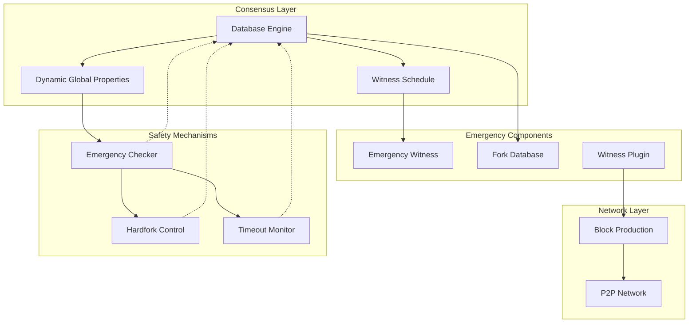
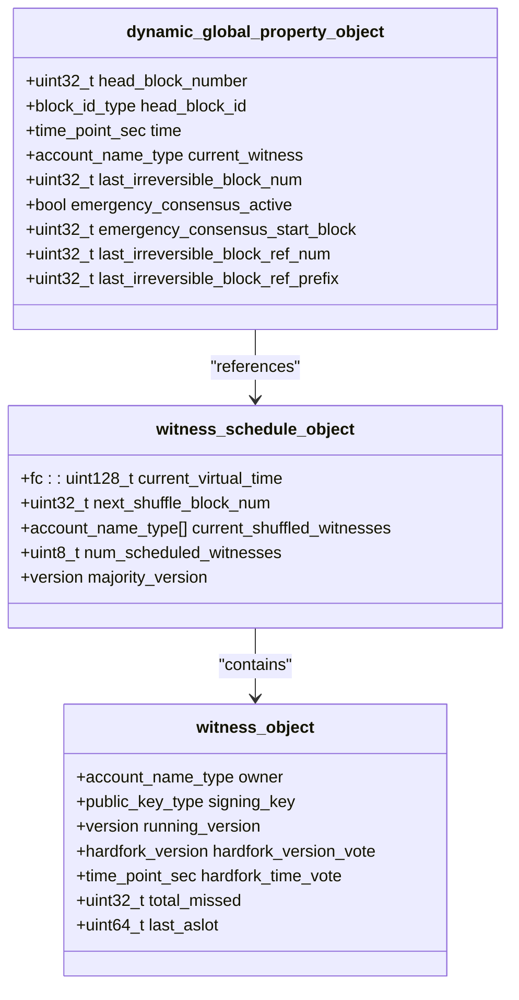
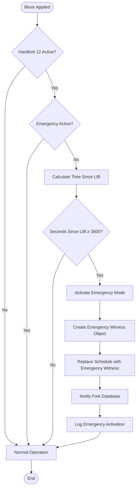
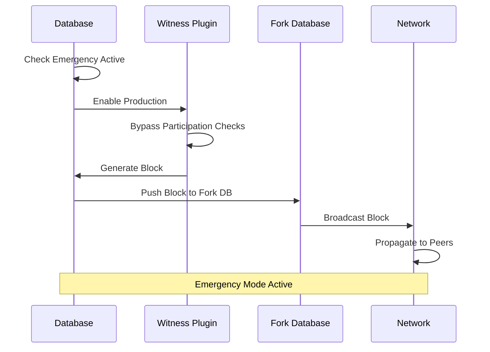
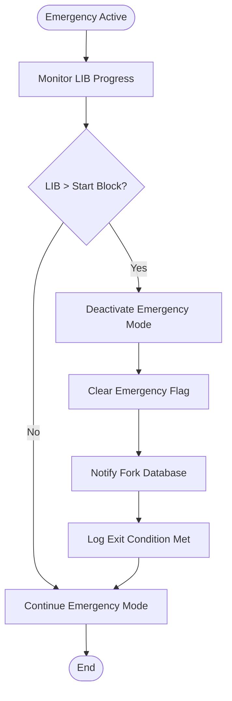
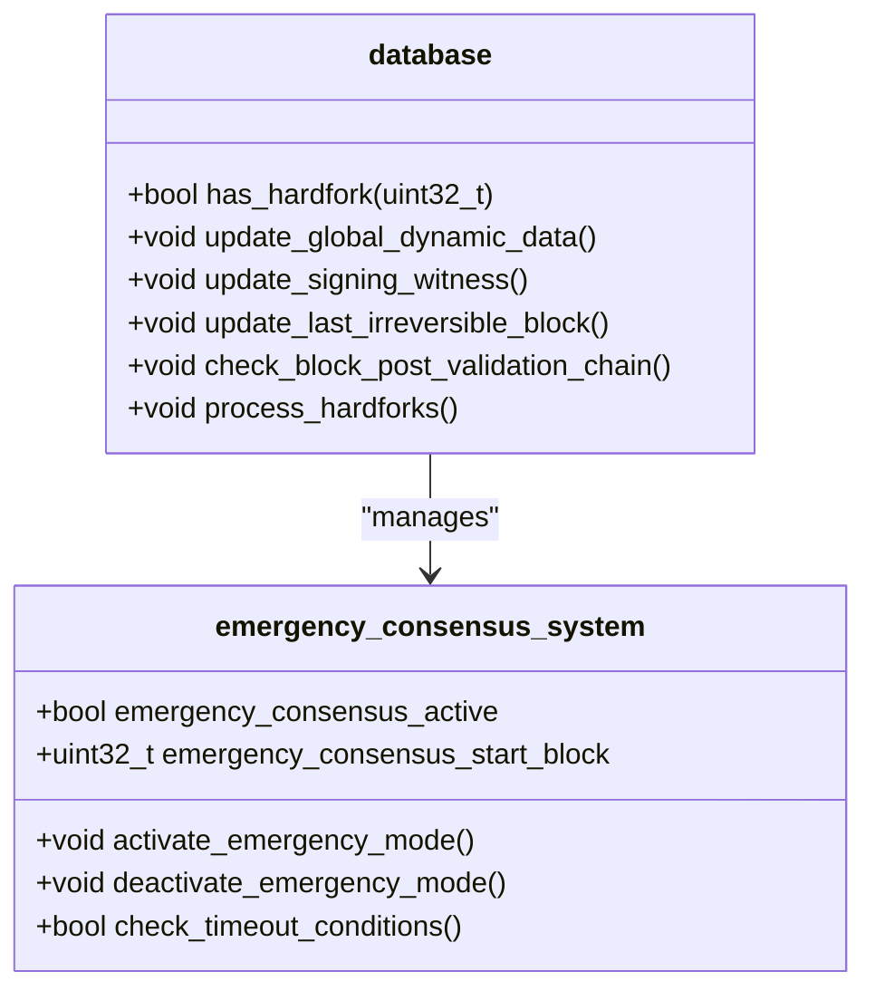

# Emergency Consensus System

<cite>
**Referenced Files in This Document**
- [database.cpp](file://libraries/chain/database.cpp)
- [database.hpp](file://libraries/chain/include/graphene/chain/database.hpp)
- [global_property_object.hpp](file://libraries/chain/include/graphene/chain/global_property_object.hpp)
- [witness_objects.hpp](file://libraries/chain/include/graphene/chain/witness_objects.hpp)
- [fork_database.cpp](file://libraries/chain/fork_database.cpp)
- [config.hpp](file://libraries/protocol/include/graphene/protocol/config.hpp)
- [witness.cpp](file://plugins/witness/witness.cpp)
- [witness.hpp](file://plugins/witness/include/graphene/plugins/witness/witness.hpp)
- [12.hf](file://libraries/chain/hardfork.d/12.hf)
</cite>

## Table of Contents
1. [Introduction](#introduction)
2. [System Architecture](#system-architecture)
3. [Core Components](#core-components)
4. [Emergency Consensus Activation](#emergency-consensus-activation)
5. [Emergency Mode Operations](#emergency-mode-operations)
6. [Exit Conditions](#exit-conditions)
7. [Network Behavior](#network-behavior)
8. [Configuration and Constants](#configuration-and-constants)
9. [Implementation Details](#implementation-details)
10. [Troubleshooting Guide](#troubleshooting-guide)
11. [Conclusion](#conclusion)

## Introduction

The Emergency Consensus System is a critical safety mechanism implemented in the VIZ blockchain to maintain network continuity during extended periods of network stall or witness failure. This system automatically activates when the blockchain stops producing blocks for a predetermined timeout period, ensuring the network remains functional even when regular witness production is compromised.

The system operates as a three-state safety enforcement mechanism, providing automatic recovery capabilities that prevent network paralysis during emergencies. It maintains consensus integrity while allowing the network to recover from various failure scenarios including witness failures, network partitions, or other catastrophic events.

## System Architecture

The Emergency Consensus System is built on a distributed architecture that integrates multiple components working together to maintain blockchain functionality:

**Diagram sources**
- [database.cpp:4363-4463](file://libraries/chain/database.cpp#L4363-L4463)
- [fork_database.cpp:260-262](file://libraries/chain/fork_database.cpp#L260-L262)
- [witness.cpp:354-392](file://plugins/witness/witness.cpp#L354-L392)

The architecture consists of several key layers:

- **Consensus Layer**: Core blockchain state management and witness scheduling
- **Emergency Components**: Specialized emergency witness and fork database modifications  
- **Network Layer**: Peer-to-peer communication and block propagation
- **Safety Mechanisms**: Hardfork coordination and timeout monitoring

## Core Components

### Dynamic Global Properties

The emergency consensus state is maintained through the dynamic global properties object, which tracks critical consensus parameters:

**Diagram sources**
- [global_property_object.hpp:24-146](file://libraries/chain/include/graphene/chain/global_property_object.hpp#L24-L146)
- [witness_objects.hpp:27-132](file://libraries/chain/include/graphene/chain/witness_objects.hpp#L27-L132)

### Emergency Witness Implementation

The emergency witness serves as the automated consensus producer during emergency conditions:

| Property | Value | Description |
|----------|-------|-------------|
| Account Name | `committee` | Emergency witness account identifier |
| Public Key | `VIZ75CRHVHPwYiUESy1bgN3KhVFbZCQQRA9jT6TnpzKAmpxMPD6Xv` | Block signing key |
| Role | Automated Producer | Produces blocks when network is stalled |

**Section sources**
- [config.hpp:114-119](file://libraries/protocol/include/graphene/protocol/config.hpp#L114-L119)
- [witness_objects.hpp:47-61](file://libraries/chain/include/graphene/chain/witness_objects.hpp#L47-L61)

## Emergency Consensus Activation

### Timeout Detection Mechanism

The emergency consensus activation is triggered by monitoring the time elapsed since the last irreversible block (LIB):

**Diagram sources**
- [database.cpp:4363-4463](file://libraries/chain/database.cpp#L4363-L4463)
- [config.hpp:110-112](file://libraries/protocol/include/graphene/protocol/config.hpp#L110-L112)

### Activation Triggers

The system monitors several key indicators to determine emergency activation:

1. **Timeout Threshold**: 3,600 seconds (1 hour) since last irreversible block
2. **Hardfork Activation**: Requires CHAIN_HARDFORK_12 to be active
3. **Network Stall Detection**: No blocks produced within timeout period
4. **Snapshot Compatibility**: Handles DLT mode scenarios appropriately

**Section sources**
- [database.cpp:4363-4463](file://libraries/chain/database.cpp#L4363-L4463)
- [database.cpp:4369-4376](file://libraries/chain/database.cpp#L4369-L4376)

## Emergency Mode Operations

### Automatic Block Production

During emergency mode, the system automatically produces blocks using the emergency witness:

**Diagram sources**
- [witness.cpp:354-392](file://plugins/witness/witness.cpp#L354-L392)
- [fork_database.cpp:80-87](file://libraries/chain/fork_database.cpp#L80-L87)

### Fork Database Modifications

The fork database implements special handling for emergency mode:

| Feature | Description | Impact |
|---------|-------------|--------|
| Deterministic Tie-Breaking | Lower block ID preferred during conflicts | Ensures network convergence |
| Emergency Mode Flag | Special state tracking | Modifies block acceptance rules |
| Hash Comparison | Prevents cascade disconnections | Maintains network stability |

**Section sources**
- [fork_database.cpp:80-87](file://libraries/chain/fork_database.cpp#L80-L87)
- [fork_database.cpp:260-262](file://libraries/chain/fork_database.cpp#L260-L262)

## Exit Conditions

### Automatic Deactivation

The emergency consensus mode deactivates automatically when:

**Diagram sources**
- [database.cpp:2126-2143](file://libraries/chain/database.cpp#L2126-L2143)

### Exit Criteria

The system evaluates several conditions for emergency mode exit:

1. **LIB Advancement**: Last Irreversible Block number exceeds start block
2. **Network Recovery**: 75% of real witnesses are producing consistently
3. **Automatic Trigger**: 21 consecutive blocks produced by emergency witness
4. **Manual Intervention**: System administrator override possible

**Section sources**
- [database.cpp:2126-2143](file://libraries/chain/database.cpp#L2126-L2143)
- [config.hpp:121-123](file://libraries/protocol/include/graphene/protocol/config.hpp#L121-L123)

## Network Behavior

### Peer Connection Management

During emergency mode, the system implements special peer connection handling:

| Scenario | Action | Rationale |
|----------|--------|-----------|
| Multiple Emergency Producers | Prefer lower block ID hash | Prevents network splits |
| Cascade Disconnections | Prevention measures | Maintains network stability |
| Block Propagation | Normal P2P behavior | Ensures consensus continuity |

### Witness Participation Override

The emergency system bypasses normal witness participation requirements:

- **Participation Rate Checks**: Automatically enabled during emergency
- **Stale Block Production**: Allowed without penalties
- **Production Scheduling**: Emergency witness takes precedence

**Section sources**
- [witness.cpp:354-392](file://plugins/witness/witness.cpp#L354-L392)
- [fork_database.cpp:80-87](file://libraries/chain/fork_database.cpp#L80-L87)

## Configuration and Constants

### Emergency Consensus Parameters

The system uses several configurable constants:

| Parameter | Value | Unit | Description |
|-----------|-------|------|-------------|
| CHAIN_EMERGENCY_CONSENSUS_TIMEOUT_SEC | 3600 | Seconds | Timeout threshold |
| CHAIN_EMERGENCY_WITNESS_ACCOUNT | "committee" | Account | Emergency producer |
| CHAIN_EMERGENCY_WITNESS_PUBLIC_KEY | VIZ75CR... | Key | Block signing key |
| CHAIN_EMERGENCY_EXIT_NORMAL_BLOCKS | 21 | Blocks | Consecutive blocks to exit |

### Hardfork Configuration

The emergency consensus requires specific hardfork activation:

- **Hardfork Version**: 12
- **Activation Time**: 1776620500 (Unix timestamp)
- **Protocol Version**: 3.1.0
- **Required Nodes**: Majority consensus for activation

**Section sources**
- [config.hpp:110-123](file://libraries/protocol/include/graphene/protocol/config.hpp#L110-L123)
- [12.hf:1-6](file://libraries/chain/hardfork.d/12.hf#L1-L6)

## Implementation Details

### Database Integration

The emergency consensus system integrates deeply with the blockchain database:

**Diagram sources**
- [database.cpp:4363-4463](file://libraries/chain/database.cpp#L4363-L4463)
- [database.hpp:37-612](file://libraries/chain/include/graphene/chain/database.hpp#L37-L612)

### Witness Plugin Modifications

The witness plugin receives special handling during emergency mode:

- **Automatic Production Enablement**: Production enabled regardless of participation
- **Stale Block Handling**: Allows production of blocks that may be stale
- **Key Management**: Supports emergency private key loading

**Section sources**
- [witness.cpp:175-182](file://plugins/witness/witness.cpp#L175-L182)
- [witness.cpp:354-392](file://plugins/witness/witness.cpp#L354-L392)

## Troubleshooting Guide

### Common Issues

| Issue | Symptoms | Solution |
|-------|----------|----------|
| Emergency Mode Not Activating | No automatic blocks produced | Verify hardfork 12 activation |
| Emergency Mode Stuck | Cannot exit emergency mode | Check LIB advancement |
| Network Instability | Frequent disconnections | Review fork database settings |
| Witness Production Failures | Emergency witness cannot produce blocks | Verify emergency key configuration |

### Diagnostic Commands

To troubleshoot emergency consensus issues:

1. **Check Emergency Status**: Verify `emergency_consensus_active` flag
2. **Monitor LIB Progress**: Track irreversible block advancement
3. **Review Timeout Logs**: Check activation/deactivation timestamps
4. **Validate Witness Configuration**: Ensure emergency witness exists

### Performance Considerations

- **Memory Usage**: Emergency mode may increase fork database size
- **Network Bandwidth**: Additional block propagation during emergency
- **CPU Load**: Extra processing for emergency block validation
- **Storage Impact**: Extended fork database retention during emergencies

**Section sources**
- [database.cpp:4363-4463](file://libraries/chain/database.cpp#L4363-L4463)
- [fork_database.cpp:113-145](file://libraries/chain/fork_database.cpp#L113-L145)

## Conclusion

The Emergency Consensus System represents a sophisticated safety mechanism designed to maintain blockchain functionality during critical network failures. By implementing automatic activation, deterministic network behavior, and clear exit conditions, the system provides robust protection against network stalls while maintaining consensus integrity.

The system's three-state safety enforcement approach ensures that the network can recover from various failure scenarios without requiring manual intervention. Through careful integration with existing consensus mechanisms and network protocols, the emergency system operates seamlessly with minimal disruption to normal network operations.

Key benefits include:
- **Automatic Recovery**: No manual intervention required for activation
- **Network Stability**: Prevents cascade failures during emergencies  
- **Consensus Integrity**: Maintains blockchain validity during recovery
- **Operational Continuity**: Ensures service availability during outages

The implementation demonstrates best practices in distributed systems design, providing a reliable foundation for blockchain resilience and operational continuity.