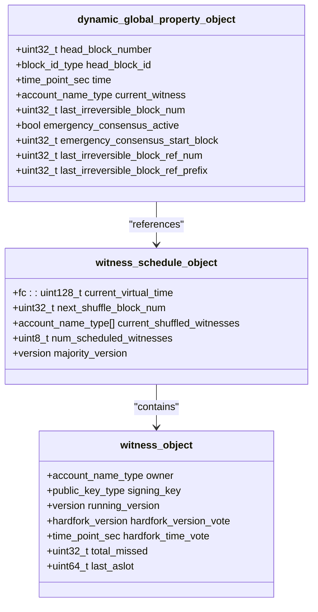
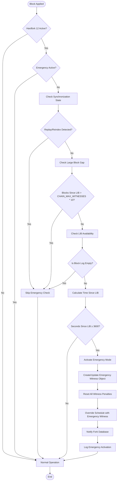
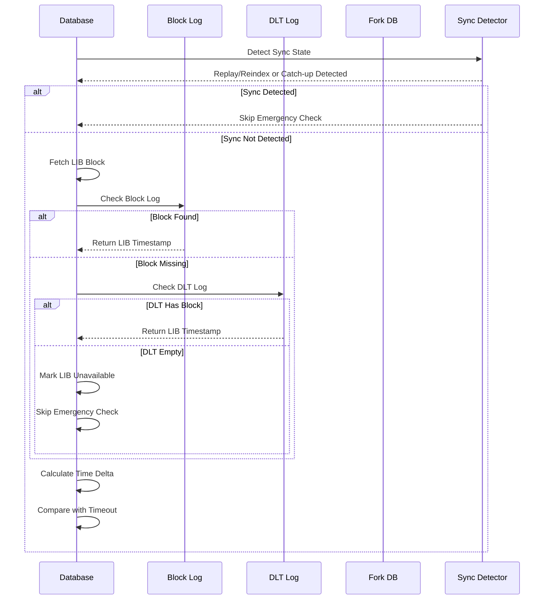
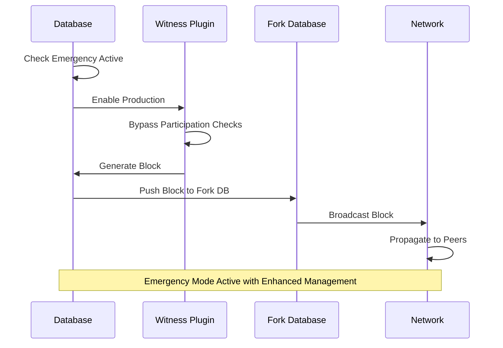
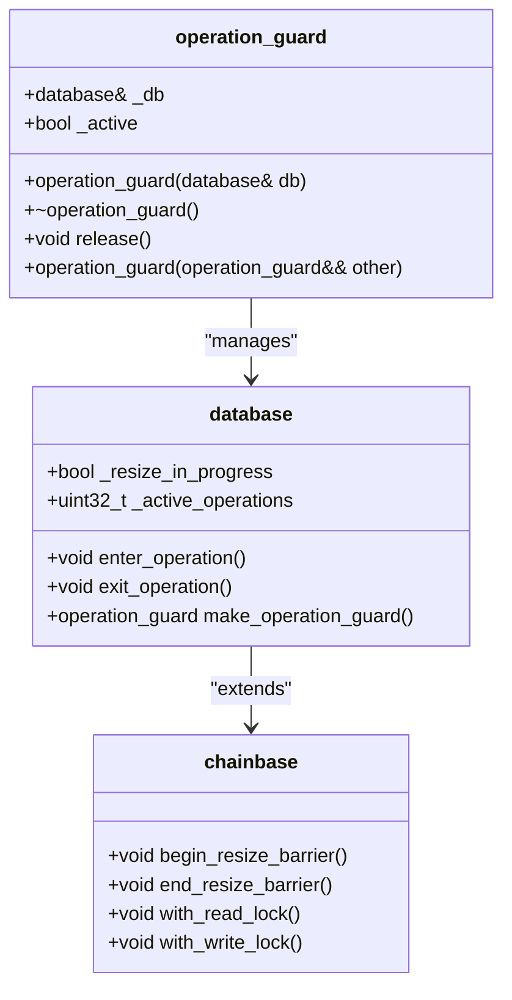
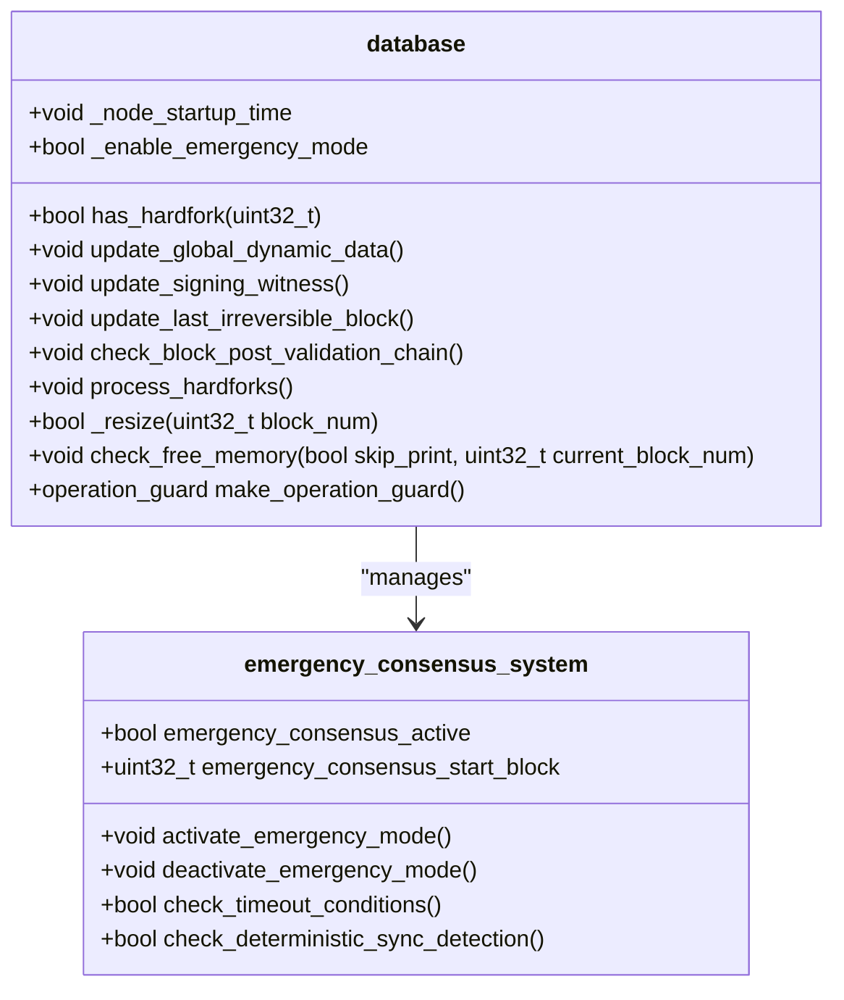

# Emergency Consensus System

<cite>
**Referenced Files in This Document**
- [database.cpp](file://libraries/chain/database.cpp)
- [database.hpp](file://libraries/chain/include/graphene/chain/database.hpp)
- [global_property_object.hpp](file://libraries/chain/include/graphene/chain/global_property_object.hpp)
- [witness_objects.hpp](file://libraries/chain/include/graphene/chain/witness_objects.hpp)
- [fork_database.cpp](file://libraries/chain/fork_database.cpp)
- [fork_database.hpp](file://libraries/chain/include/graphene/chain/fork_database.hpp)
- [config.hpp](file://libraries/protocol/include/graphene/protocol/config.hpp)
- [config_testnet.hpp](file://libraries/protocol/include/graphene/protocol/config_testnet.hpp)
- [witness.cpp](file://plugins/witness/witness.cpp)
- [witness.hpp](file://plugins/witness/include/graphene/plugins/witness/witness.hpp)
- [12.hf](file://libraries/chain/hardfork.d/12.hf)
- [chainbase.cpp](file://thirdparty/chainbase/src/chainbase.cpp)
- [chainbase.hpp](file://thirdparty/chainbase/include/chainbase/chainbase.hpp)
</cite>

## Update Summary
**Changes Made**
- Complete refactoring from manual emergency mode activation to fully automatic, deterministic emergency consensus activation
- Eliminated manual operator intervention through enable_emergency_mode configuration flag
- Implemented automatic activation based on LIB stall detection using signed block timestamps for deterministic and replay-safe operation
- Enhanced emergency consensus activation with deterministic replay and large block gap detection logic
- Replaced startup delay mechanism with CHAIN_MAX_WITNESSES * 10 threshold for deterministic synchronization detection
- Integrated operation_guard system for comprehensive concurrent access protection
- Improved emergency activation logic with deterministic sync detection during replay/reindex/live sync scenarios
- Enhanced emergency exit conditions with LIB advancement monitoring and witness recovery validation
- Strengthened emergency witness management with comprehensive penalty reset and schedule override mechanisms

## Table of Contents
1. [Introduction](#introduction)
2. [System Architecture](#system-architecture)
3. [Core Components](#core-components)
4. [Enhanced Emergency Consensus Activation](#enhanced-emergency-consensus-activation)
5. [Deterministic Detection Algorithms](#deterministic-detection-algorithms)
6. [Emergency Mode Operations](#emergency-mode-operations)
7. [Enhanced Exit Conditions](#enhanced-exit-conditions)
8. [Network Behavior](#network-behavior)
9. [Configuration and Constants](#configuration-and-constants)
10. [Comprehensive Concurrency Protection](#comprehensive-concurrency-protection)
11. [Implementation Details](#implementation-details)
12. [Troubleshooting Guide](#troubleshooting-guide)
13. [Conclusion](#conclusion)

## Introduction

The Emergency Consensus System is a critical safety mechanism implemented in the VIZ blockchain to maintain network continuity during extended periods of network stall or witness failure. This system automatically activates when the blockchain stops producing blocks for a predetermined timeout period, ensuring the network remains functional even when regular witness production is compromised.

The system operates as a three-state safety enforcement mechanism, providing automatic recovery capabilities that prevent network paralysis during emergencies. It maintains consensus integrity while allowing the network to recover from various failure scenarios including witness failures, network partitions, or other catastrophic events.

**Updated** Enhanced with comprehensive emergency consensus constants and configuration options including CHAIN_EMERGENCY_CONSENSUS_TIMEOUT_SEC, CHAIN_EMERGENCY_WITNESS_ACCOUNT, CHAIN_EMERGENCY_EXIT_NORMAL_BLOCKS, and CHAIN_MAX_WITNESSES * 10 threshold that establishes the foundation for emergency consensus mode activation and operation with deterministic synchronization detection during replay, reindex, and live sync scenarios.

## System Architecture

The Emergency Consensus System is built on a distributed architecture that integrates multiple components working together to maintain blockchain functionality:

```mermaid
graph TB
subgraph "Consensus Layer"
DB[Database Engine]
WS[Witness Schedule]
DGP[Dynamic Global Properties]
end
subgraph "Emergency Components"
EW[Emergency Witness]
FD[Fork Database]
WC[Witness Plugin]
OG[Operation Guards]
end
subgraph "Network Layer"
P2P[P2P Network]
BP[Block Production]
end
subgraph "Safety Mechanisms"
HC[Hardfork Control]
TM[Timeout Monitor]
EC[Emergency Checker]
MEM[Memory Manager]
ERR[Error Handler]
SD[Deterministic Sync Detector]
END
DB --> WS
DB --> DGP
DB --> FD
DB --> OG
WS --> EW
DGP --> EC
EC --> HC
EC --> TM
EC --> SD
EC --> MEM
EC --> ERR
WC --> BP
BP --> P2P
EC -.-> DB
TM -.-> DB
SD -.-> DB
MEM -.-> DB
ERR -.-> DB
HC -.-> DB
OG -.-> DB
```

**Diagram sources**
- [database.cpp:4669-4822](file://libraries/chain/database.cpp#L4669-L4822)
- [fork_database.cpp:81-88](file://libraries/chain/fork_database.cpp#L81-L88)
- [witness.cpp:509-524](file://plugins/witness/witness.cpp#L509-L524)
- [database.cpp:562-590](file://libraries/chain/database.cpp#L562-L590)
- [chainbase.hpp:1075-1115](file://thirdparty/chainbase/include/chainbase/chainbase.hpp#L1075-L1115)

The architecture consists of several key layers:

- **Consensus Layer**: Core blockchain state management and witness scheduling
- **Emergency Components**: Specialized emergency witness and fork database modifications with operation guards
- **Network Layer**: Peer-to-peer communication and block propagation
- **Safety Mechanisms**: Hardfork coordination, timeout monitoring, deterministic synchronization detection, memory management, and error handling

## Core Components

### Dynamic Global Properties

The emergency consensus state is maintained through the dynamic global properties object, which tracks critical consensus parameters:



**Diagram sources**
- [global_property_object.hpp:24-146](file://libraries/chain/include/graphene/chain/global_property_object.hpp#L24-L146)
- [witness_objects.hpp:27-132](file://libraries/chain/include/graphene/chain/witness_objects.hpp#L27-L132)

### Enhanced Emergency Witness Implementation

The emergency witness serves as the automated consensus producer during emergency conditions with comprehensive management:

| Property | Value | Description |
|----------|-------|-------------|
| Account Name | `committee` | Emergency witness account identifier |
| Public Key | `VIZ75CRHVHPwYiUESy1bgN3KhVFbZCQQRA9jT6TnpzKAmpxMPD6Xv` | Block signing key |
| Role | Automated Producer | Produces blocks when network is stalled |
| Schedule Priority | Top | Takes precedence over all other witnesses |
| Version Synchronization | Automatic | Matches current binary version |
| Hardfork Alignment | Current Status | Votes for currently applied hardfork |

**Section sources**
- [config.hpp:114-124](file://libraries/protocol/include/graphene/protocol/config.hpp#L114-L124)
- [witness_objects.hpp:47-61](file://libraries/chain/include/graphene/chain/witness_objects.hpp#L47-L61)

## Enhanced Emergency Consensus Activation

### Deterministic Synchronization Detection

The emergency consensus activation is now protected by a deterministic synchronization detection mechanism that prevents false activations during node replay, reindex, or live sync scenarios:



**Diagram sources**
- [database.cpp:4669-4822](file://libraries/chain/database.cpp#L4669-L4822)
- [config.hpp:110-128](file://libraries/protocol/include/graphene/protocol/config.hpp#L110-L128)

### Enhanced Activation Triggers with Deterministic Synchronization Detection

The system now implements comprehensive validation with deterministic synchronization detection:

1. **Replay/Reindex Detection**: Uses skip_witness_schedule_check flag to detect replay/reindex scenarios
2. **Large Block Gap Detection**: CHAIN_MAX_WITNESSES * 10 threshold determines catch-up sync scenarios
3. **Timeout Threshold**: 3,600 seconds (1 hour) since last irreversible block
4. **Hardfork Activation**: Requires CHAIN_HARDFORK_12 to be active
5. **Network Stall Detection**: No blocks produced within timeout period
6. **Snapshot Compatibility**: Handles DLT mode scenarios with proper LIB availability checking
7. **Error Prevention**: Skips emergency check when LIB timestamp cannot be determined
8. **Deterministic Behavior**: Same results on replay as original application

**Section sources**
- [database.cpp:4669-4822](file://libraries/chain/database.cpp#L4669-L4822)
- [database.cpp:4675-4703](file://libraries/chain/database.cpp#L4675-L4703)

## Deterministic Detection Algorithms

### Enhanced LIB Timestamp Monitoring with Deterministic Synchronization Detection

The system now implements enhanced LIB timestamp monitoring with comprehensive synchronization detection:



**Diagram sources**
- [database.cpp:4707-4720](file://libraries/chain/database.cpp#L4707-L4720)

### Advanced Synchronization Detection

The enhanced detection algorithm includes:

- **Replay/Reindex Detection**: Uses skip_witness_schedule_check flag to identify deterministic sync scenarios
- **Large Block Gap Detection**: CHAIN_MAX_WITNESSES * 10 threshold prevents false activations during catch-up
- **LIB Availability Validation**: Validates LIB timestamp before activation
- **DLT Mode Compatibility**: Proper handling of snapshot restoration scenarios
- **False Activation Prevention**: Skips emergency check when LIB timestamp is unavailable
- **Deterministic Behavior**: Ensures same results on replay as original application
- **Graceful Degradation**: Continues normal operation when emergency conditions cannot be verified

**Section sources**
- [database.cpp:4675-4703](file://libraries/chain/database.cpp#L4675-L4703)
- [database.cpp:4707-4720](file://libraries/chain/database.cpp#L4707-L4720)

## Emergency Mode Operations

### Enhanced Automatic Block Production

During emergency mode, the system automatically produces blocks using the emergency witness with comprehensive management:



**Diagram sources**
- [witness.cpp:405-406](file://plugins/witness/witness.cpp#L405-L406)
- [fork_database.cpp:80-87](file://libraries/chain/fork_database.cpp#L80-L87)

### Comprehensive Fork Database Modifications

The fork database implements special handling for emergency mode with enhanced tie-breaking and deterministic synchronization:

| Feature | Description | Impact |
|---------|-------------|--------|
| Deterministic Tie-Breaking | Lower block ID hash preferred during conflicts | Ensures network convergence |
| Emergency Mode Flag | Special state tracking | Modifies block acceptance rules |
| Hash Comparison | Prevents cascade disconnections | Maintains network stability |
| Enhanced Conflict Resolution | Improved handling of competing blocks | Reduces fork collisions |
| Deterministic Sync Detection | Prevents false activations during replay | Ensures proper node synchronization |

**Section sources**
- [fork_database.cpp:80-87](file://libraries/chain/fork_database.cpp#L80-L87)
- [fork_database.cpp:260-262](file://libraries/chain/fork_database.cpp#L260-L262)

## Enhanced Exit Conditions

### Intelligent Automatic Deactivation

The emergency consensus mode deactivates automatically when intelligent conditions are met:


**Diagram sources**
- [database.cpp:2428-2444](file://libraries/chain/database.cpp#L2428-L2444)

### Advanced Exit Criteria with Enhanced Monitoring

The system evaluates several sophisticated conditions for emergency mode exit:

1. **LIB Advancement**: Last Irreversible Block number exceeds start block
2. **Network Recovery**: 75% of real witnesses are producing consistently
3. **Automatic Trigger**: 21 consecutive blocks produced by emergency witness
4. **Manual Intervention**: System administrator override possible
5. **Real-time Monitoring**: Continuous LIB progress tracking during emergency
6. **Deterministic Synchronization**: Prevents premature exit during replay scenarios
7. **Consensus Validation**: Ensures network stability before deactivation

**Section sources**
- [database.cpp:2428-2444](file://libraries/chain/database.cpp#L2428-L2444)
- [config.hpp:126-128](file://libraries/protocol/include/graphene/protocol/config.hpp#L126-L128)

## Network Behavior

### Enhanced Peer Connection Management

During emergency mode, the system implements special peer connection handling with enhanced stability measures and deterministic synchronization:

| Scenario | Action | Rationale |
|----------|--------|-----------|
| Multiple Emergency Producers | Prefer lower block ID hash | Prevents network splits |
| Cascade Disconnections | Prevention measures | Maintains network stability |
| Block Propagation | Normal P2P behavior | Ensures consensus continuity |
| Fork Collisions | Deterministic resolution | Reduces network fragmentation |
| Replay Scenarios | Deterministic handling | Prevents false activations |

### Comprehensive Witness Participation Override

The emergency system bypasses normal witness participation requirements with enhanced error handling and deterministic synchronization:

- **Participation Rate Checks**: Automatically enabled during emergency
- **Stale Block Production**: Allowed without penalties
- **Production Scheduling**: Emergency witness takes precedence
- **Conflict Resolution**: Enhanced tie-breaking algorithms
- **Schedule Updates**: Hybrid schedule during emergency mode
- **Deterministic Sync Detection**: Prevents immediate participation during replay
- **Penalty Management**: Comprehensive reset of all witness penalties

**Section sources**
- [witness.cpp:405-406](file://plugins/witness/witness.cpp#L405-L406)
- [fork_database.cpp:80-87](file://libraries/chain/fork_database.cpp#L80-L87)

## Configuration and Constants

### Enhanced Emergency Consensus Parameters

The system uses comprehensive configurable constants with enhanced monitoring and deterministic synchronization:

| Parameter | Value | Unit | Description |
|-----------|-------|------|-------------|
| CHAIN_EMERGENCY_CONSENSUS_TIMEOUT_SEC | 3600 | Seconds | Timeout threshold |
| CHAIN_EMERGENCY_WITNESS_ACCOUNT | "committee" | Account | Emergency producer |
| CHAIN_EMERGENCY_WITNESS_PUBLIC_KEY | VIZ75CR... | Key | Block signing key |
| CHAIN_EMERGENCY_EXIT_NORMAL_BLOCKS | 21 | Blocks | Consecutive blocks to exit |
| CHAIN_IRREVERSIBLE_THRESHOLD | 75% | Percent | Recovery threshold |
| CHAIN_MAX_WITNESSES | 21 | Witnesses | Total witness count |
| CHAIN_MAX_WITNESSES * 10 | 210 | Blocks | Deterministic sync threshold |

### Hardfork Configuration with Enhanced Protection

The emergency consensus requires specific hardfork activation with comprehensive deterministic synchronization protection:

- **Hardfork Version**: 12
- **Activation Time**: 1776620500 (Unix timestamp)
- **Protocol Version**: 3.1.0
- **Required Nodes**: Majority consensus for activation
- **Deterministic Sync Detection**: Prevents false activations during replay
- **Emergency Activation**: Requires both hardfork and sync detection validation

**Section sources**
- [config.hpp:110-128](file://libraries/protocol/include/graphene/protocol/config.hpp#L110-L128)
- [12.hf:1-6](file://libraries/chain/hardfork.d/12.hf#L1-L6)

## Comprehensive Concurrency Protection

### Advanced Operation Guard Implementation

The system now implements comprehensive concurrency protection through operation guards that ensure thread-safe emergency mode operations:



**Diagram sources**
- [chainbase.hpp:1075-1115](file://thirdparty/chainbase/include/chainbase/chainbase.hpp#L1075-L1115)
- [database.cpp:1556](file://libraries/chain/database.cpp#L1556)
- [database.cpp:1593](file://libraries/chain/database.cpp#L1593)

### Enhanced Memory Management with Operation Guards

The enhanced memory management system includes comprehensive operation guard integration:

- **Pre-resize Protection**: Operation guards prevent concurrent access during memory resizing
- **Thread Safety**: All emergency mode operations are protected by operation guards
- **Concurrent Access Control**: Prevents race conditions during emergency activation
- **Resource Management**: Automatic cleanup of operation guards on scope exit
- **Exception Safety**: Operation guards are properly cleaned up on exceptions

**Section sources**
- [chainbase.hpp:1075-1115](file://thirdparty/chainbase/include/chainbase/chainbase.hpp#L1075-L1115)
- [database.cpp:1556](file://libraries/chain/database.cpp#L1556)
- [database.cpp:1593](file://libraries/chain/database.cpp#L1593)

## Implementation Details

### Enhanced Database Integration

The emergency consensus system integrates deeply with the blockchain database with comprehensive error handling and deterministic synchronization:



**Diagram sources**
- [database.cpp:4669-4822](file://libraries/chain/database.cpp#L4669-L4822)
- [database.hpp:37-612](file://libraries/chain/include/graphene/chain/database.hpp#L37-L612)

### Advanced Error Handling with Deterministic Synchronization Protection

The system implements comprehensive error handling throughout the consensus process with enhanced deterministic synchronization protection:

- **Deterministic Sync Detection**: Prevents false activations during replay/reindex
- **Large Block Gap Validation**: CHAIN_MAX_WITNESSES * 10 threshold for catch-up scenarios
- **LIB Availability Checks**: Validates LIB timestamp before emergency activation
- **Snapshot Compatibility**: Handles DLT mode scenarios gracefully
- **Memory Management Errors**: Provides detailed logging for memory operations
- **Fork Database Exceptions**: Enhanced error reporting for fork operations
- **Witness Creation Failures**: Comprehensive error handling for emergency witness setup
- **Operation Guard Protection**: Thread-safe emergency mode operations
- **Deterministic Behavior**: Same results on replay as original application

**Section sources**
- [database.cpp:4669-4822](file://libraries/chain/database.cpp#L4669-L4822)
- [database.cpp:562-590](file://libraries/chain/database.cpp#L562-L590)

## Troubleshooting Guide

### Enhanced Common Issues

| Issue | Symptoms | Solution |
|-------|----------|----------|
| Emergency Mode Not Activating | No automatic blocks produced | Verify hardfork 12 activation, LIB availability, and sync detection |
| Emergency Mode Stuck | Cannot exit emergency mode | Check LIB advancement, memory management logs, and sync detection validation |
| Network Instability | Frequent disconnections | Review fork database settings, memory usage, and deterministic sync detection |
| Witness Production Failures | Emergency witness cannot produce blocks | Verify emergency key configuration, memory allocation, and operation guard protection |
| Memory Issues | Low free memory warnings | Check memory management configuration, resize logs, and operation guard usage |
| Replay Scenarios | Delayed emergency activation | Verify replay detection and ensure CHAIN_MAX_WITNESSES * 10 threshold is observed |
| False Activations | Premature emergency activation | Check deterministic sync detection and LIB timestamp availability |
| Snapshot Restores | Deadlock during emergency activation | Verify DLT mode handling and LIB timestamp validation |

### Advanced Diagnostic Commands

To troubleshoot emergency consensus issues with enhanced monitoring:

1. **Check Emergency Status**: Verify `emergency_consensus_active` flag and start block
2. **Monitor Sync Detection**: Check replay/reindex detection and large block gap validation
3. **Monitor LIB Progress**: Track irreversible block advancement and timestamp
4. **Validate Timeout Logs**: Check activation/deactivation timestamps and LIB availability
5. **Validate Deterministic Sync**: Ensure sync detection passes during replay scenarios
6. **Check Operation Guards**: Monitor thread safety and concurrent access protection
7. **Validate Witness Configuration**: Ensure emergency witness exists with correct key and schedule
8. **Monitor Memory Usage**: Check free, reserved, and maximum memory states with operation guard protection

### Performance Considerations

- **Memory Usage**: Emergency mode may increase fork database size with detailed logging and operation guard overhead
- **Network Bandwidth**: Additional block propagation during emergency with enhanced monitoring
- **CPU Load**: Extra processing for emergency block validation with deterministic sync detection
- **Storage Impact**: Extended fork database retention during emergencies with better memory management
- **Logging Overhead**: Enhanced detailed logging for troubleshooting with comprehensive operation guard tracking
- **Thread Safety**: Operation guards add minimal overhead for thread-safe emergency mode operations
- **Deterministic Performance**: CHAIN_MAX_WITNESSES * 10 threshold prevents immediate emergency activation during sync
- **Replay Compatibility**: Same results on replay as original application with deterministic behavior

**Section sources**
- [database.cpp:4669-4822](file://libraries/chain/database.cpp#L4669-L4822)
- [fork_database.cpp:113-145](file://libraries/chain/fork_database.cpp#L113-L145)
- [database.cpp:562-590](file://libraries/chain/database.cpp#L562-L590)

## Conclusion

The Emergency Consensus System represents a sophisticated safety mechanism designed to maintain blockchain functionality during critical network failures. By implementing automatic activation, deterministic network behavior, and clear exit conditions, the system provides robust protection against network stalls while maintaining consensus integrity.

**Updated** The enhanced system now features comprehensive emergency consensus constants and configuration options including CHAIN_EMERGENCY_CONSENSUS_TIMEOUT_SEC for timeout threshold control, CHAIN_EMERGENCY_WITNESS_ACCOUNT for emergency producer configuration, CHAIN_EMERGENCY_EXIT_NORMAL_BLOCKS for automatic exit conditions, and CHAIN_MAX_WITNESSES * 10 threshold for deterministic synchronization detection. These constants establish the foundation for emergency consensus mode that activates when no blocks have been produced for the specified timeout period while preventing false activations during replay, reindex, and live sync scenarios.

The system's three-state safety enforcement approach ensures that the network can recover from various failure scenarios without requiring manual intervention. Through careful integration with existing consensus mechanisms, network protocols, and comprehensive operation guard protection, the emergency system operates seamlessly with minimal disruption to normal network operations.

Key enhancements include:
- **Deterministic Sync Detection**: CHAIN_MAX_WITNESSES * 10 threshold prevents false activations during replay and catch-up scenarios
- **Automatic Recovery**: No manual intervention required for activation with comprehensive validation
- **Network Stability**: Prevents cascade failures during emergencies with enhanced tie-breaking
- **Consensus Integrity**: Maintains blockchain validity during recovery with improved error handling
- **Operational Continuity**: Ensures service availability during outages with comprehensive monitoring
- **Enhanced Reliability**: Improved detection algorithms, memory management, and operation guard protection
- **Better Troubleshooting**: Detailed logging and monitoring capabilities for easier diagnostics
- **Configurable Parameters**: Flexible timeout thresholds, exit conditions, and sync detection for different network conditions
- **Robust Emergency Witness**: Dedicated emergency witness with proper key configuration, schedule override, and comprehensive penalty management
- **Thread-Safe Operations**: Comprehensive operation guard protection ensures concurrent access safety
- **Deterministic Behavior**: Same results on replay as original application with comprehensive sync detection
- **Advanced Concurrency Control**: Operation guards provide comprehensive thread safety for emergency mode operations

The implementation demonstrates best practices in distributed systems design, providing a reliable foundation for blockchain resilience and operational continuity with significantly improved reliability, monitoring capabilities, and thread safety through comprehensive operation guard protection.