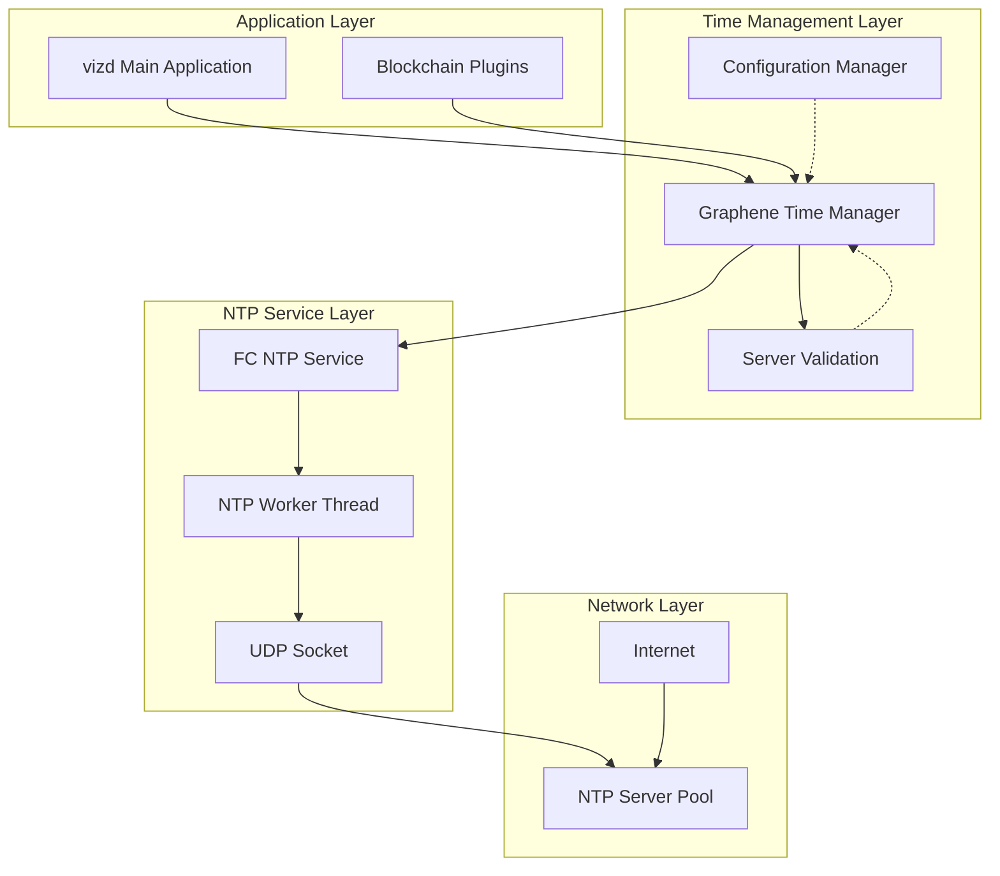
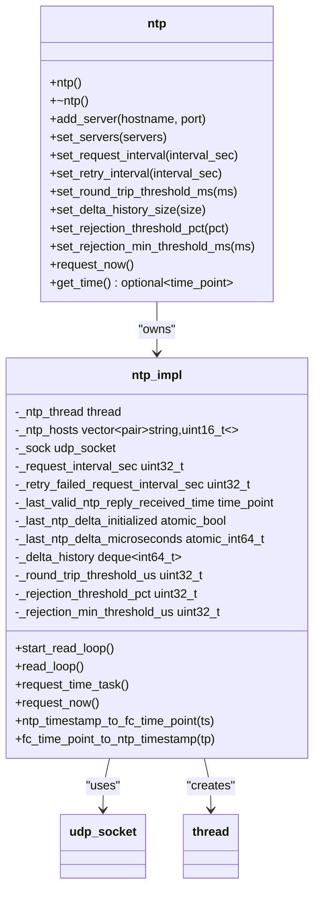
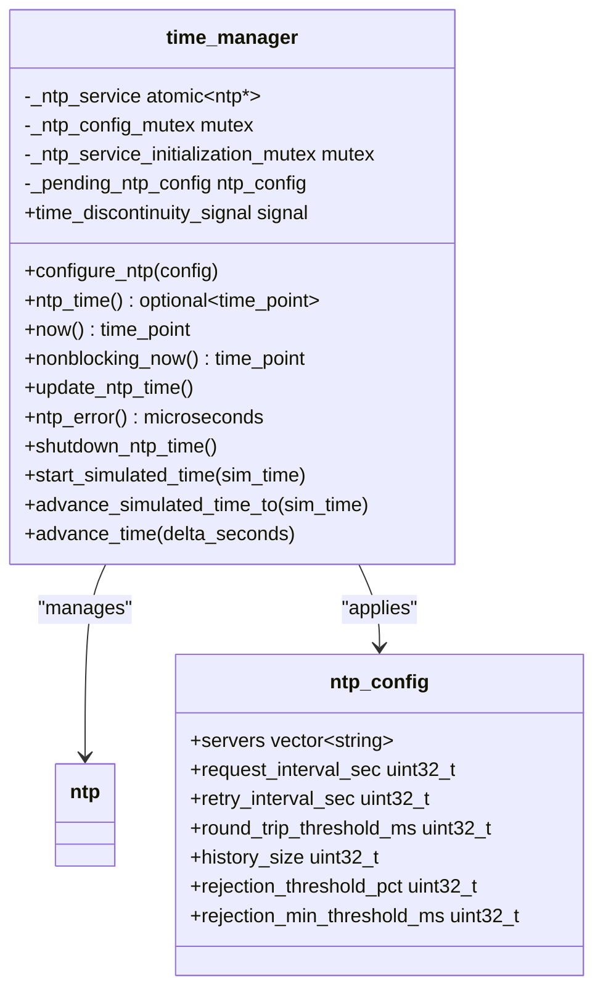
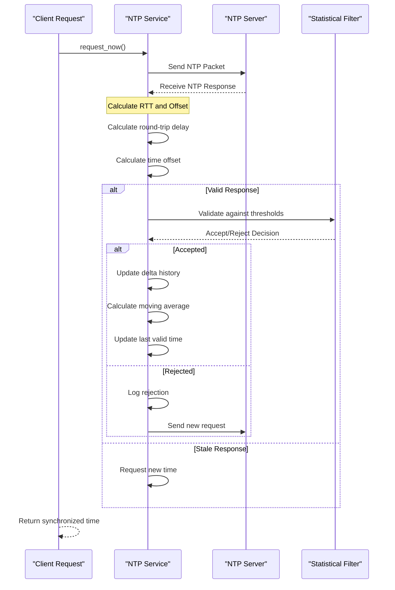
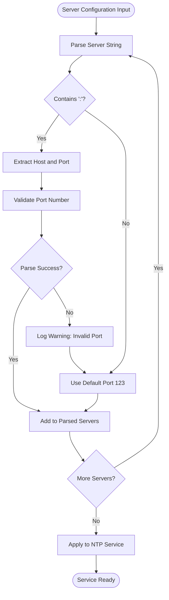
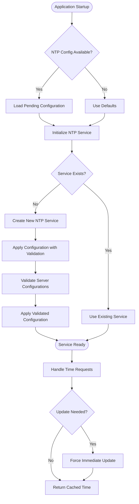
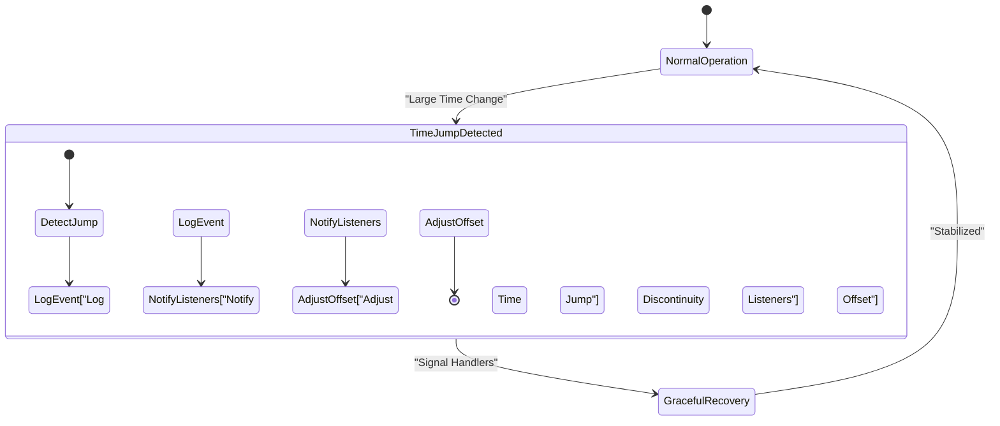
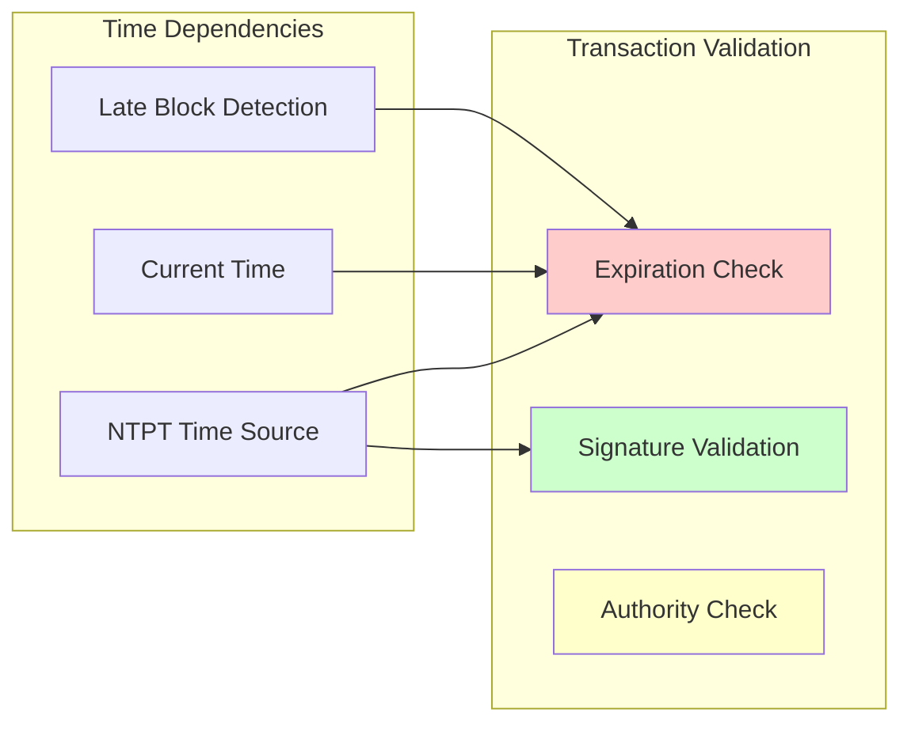
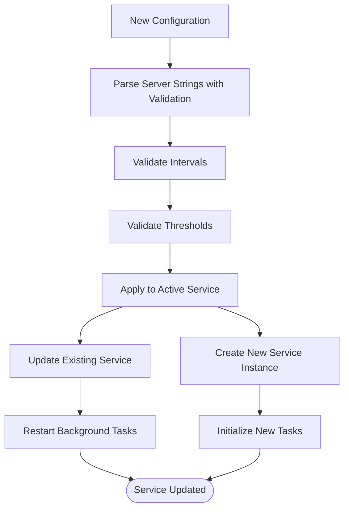

# NTP Synchronization System

<cite>
**Referenced Files in This Document**
- [ntp.hpp](file://thirdparty/fc/include/fc/network/ntp.hpp)
- [ntp.cpp](file://thirdparty/fc/src/network/ntp.cpp)
- [time.hpp](file://libraries/time/include/graphene/time/time.hpp)
- [time.cpp](file://libraries/time/time.cpp)
- [main.cpp](file://programs/vizd/main.cpp)
- [ntp_test.cpp](file://thirdparty/fc/tests/network/ntp_test.cpp)
- [witness.cpp](file://plugins/witness/witness.cpp)
</cite>

## Update Summary
**Changes Made**
- Enhanced NTP server configuration validation with improved port parsing error handling
- Added comprehensive error validation for NTP server configuration strings
- Updated configuration parsing section to reflect new error handling mechanisms
- Revised troubleshooting guide to address new validation scenarios

## Table of Contents
1. [Introduction](#introduction)
2. [System Architecture](#system-architecture)
3. [Core Components](#core-components)
4. [NTP Implementation Details](#ntp-implementation-details)
5. [Time Management Layer](#time-management-layer)
6. [Integration with Blockchain Operations](#integration-with-blockchain-operations)
7. [Configuration and Tuning](#configuration-and-tuning)
8. [Performance Considerations](#performance-considerations)
9. [Troubleshooting Guide](#troubleshooting-guide)
10. [Conclusion](#conclusion)

## Introduction

The NTP (Network Time Protocol) Synchronization System in the VIZ blockchain node provides accurate time synchronization across distributed network participants. This system ensures that all nodes maintain consistent time references, which is critical for blockchain operations such as transaction validation, block production scheduling, and consensus mechanisms.

The NTP system operates independently of the main blockchain processing but integrates seamlessly with the time management layer to provide synchronized time services to all components of the VIZ node. It implements robust error handling, statistical filtering, and automatic failover mechanisms to maintain reliable time synchronization even in challenging network conditions.

**Updated** Enhanced with comprehensive server configuration validation and improved port parsing error handling for more reliable NTP server setup.

## System Architecture

The NTP synchronization system follows a layered architecture with clear separation of concerns:



**Diagram sources**
- [main.cpp:108-142](file://programs/vizd/main.cpp#L108-L142)
- [time.cpp:53-79](file://libraries/time/time.cpp#L53-L79)
- [ntp.cpp:19-61](file://thirdparty/fc/src/network/ntp.cpp#L19-L61)

The architecture consists of three main layers:

1. **Application Layer**: The main VIZ node application and blockchain plugins that consume time services
2. **Time Management Layer**: Graphene's time management system that provides a unified interface for time operations and includes enhanced server validation
3. **NTP Service Layer**: The underlying FC (Fast Crypto) NTP implementation with dedicated worker threads

## Core Components

### FC NTP Service

The FC NTP service provides the core time synchronization functionality through a sophisticated UDP-based implementation:



**Diagram sources**
- [ntp.hpp:17-52](file://thirdparty/fc/include/fc/network/ntp.hpp#L17-L52)
- [ntp.cpp:19-61](file://thirdparty/fc/src/network/ntp.cpp#L19-L61)

### Graphene Time Manager

The Graphene time manager provides a higher-level interface that integrates NTP services with the broader blockchain ecosystem:



**Diagram sources**
- [time.hpp:17-61](file://libraries/time/include/graphene/time/time.hpp#L17-L61)
- [time.cpp:19-51](file://libraries/time/time.cpp#L19-L51)

**Section sources**
- [ntp.hpp:17-52](file://thirdparty/fc/include/fc/network/ntp.hpp#L17-L52)
- [time.hpp:17-61](file://libraries/time/include/graphene/time/time.hpp#L17-L61)

## NTP Implementation Details

### Time Synchronization Algorithm

The NTP implementation uses the standard NTPv4 algorithm with several enhancements for blockchain-specific requirements:



**Diagram sources**
- [ntp.cpp:176-236](file://thirdparty/fc/src/network/ntp.cpp#L176-L236)

### Statistical Filtering Mechanism

The system implements a sophisticated statistical filtering mechanism to reject outliers and maintain accuracy:

| Parameter | Default Value | Purpose |
|-----------|---------------|---------|
| `request_interval_sec` | 900 (15 minutes) | Time between regular updates |
| `retry_failed_request_interval_sec` | 300 (5 minutes) | Retry interval for failed requests |
| `round_trip_threshold_us` | 150,000 (150ms) | Maximum acceptable round-trip delay |
| `history_size` | 5 | Number of samples in moving average |
| `rejection_threshold_pct` | 50% | Percentage deviation threshold |
| `rejection_min_threshold_us` | 5,000 (5ms) | Minimum absolute deviation threshold |

**Section sources**
- [ntp.cpp:43-57](file://thirdparty/fc/src/network/ntp.cpp#L43-L57)
- [time.cpp:27-50](file://libraries/time/time.cpp#L27-L50)

## Time Management Layer

### Enhanced Server Configuration Validation

**Updated** The Graphene time manager now includes comprehensive validation for NTP server configuration strings with improved error handling:



**Diagram sources**
- [time.cpp:29-57](file://libraries/time/time.cpp#L29-L57)

The validation process includes:

1. **String Parsing**: Each server string is parsed for host:port format
2. **Port Extraction**: Port numbers are extracted using `rfind(':')` method
3. **Error Handling**: Invalid port numbers are caught with try-catch blocks
4. **Fallback Logic**: Invalid ports fall back to default port 123
5. **Logging**: Warning messages are logged for invalid configurations

### Time Service Lifecycle

The Graphene time manager implements a lazy initialization pattern to ensure efficient resource usage:



**Diagram sources**
- [time.cpp:53-79](file://libraries/time/time.cpp#L53-L79)

### Time Discontinuity Handling

The system provides mechanisms to handle time discontinuities gracefully:



**Diagram sources**
- [time.cpp:134-137](file://libraries/time/time.cpp#L134-L137)

**Section sources**
- [time.cpp:53-79](file://libraries/time/time.cpp#L53-L79)
- [time.cpp:134-137](file://libraries/time/time.cpp#L134-L137)

## Integration with Blockchain Operations

### Block Production Timing

The NTP system integrates with the blockchain's block production mechanism to ensure proper timing:

| Component | Integration Point | Purpose |
|-----------|-------------------|---------|
| Witness Plugin | Block slot calculation | Determines when witnesses can produce blocks |
| Chain Database | Block timestamp validation | Ensures block timestamps are reasonable |
| P2P Plugin | Peer synchronization | Maintains time consistency across network |
| Wallet | Transaction timestamping | Provides accurate timestamps for operations |

### Transaction Validation Dependencies

The time synchronization affects several critical validation processes:



**Diagram sources**
- [p2p_plugin.cpp:158-161](file://plugins/p2p/p2p_plugin.cpp#L158-L161)

**Section sources**
- [p2p_plugin.cpp:158-161](file://plugins/p2p/p2p_plugin.cpp#L158-L161)

## Configuration and Tuning

### Runtime Configuration Options

The NTP system provides extensive runtime configuration capabilities:

| Configuration Option | Type | Default | Description |
|---------------------|------|---------|-------------|
| `servers` | `vector<string>` | `["pool.ntp.org:123", "time.google.com:123", "time.cloudflare.com:123"]` | NTP server pool with host:port format |
| `request_interval_sec` | `uint32_t` | 900 | Interval between regular updates (seconds) |
| `retry_interval_sec` | `uint32_t` | 300 | Retry interval for failed requests (seconds) |
| `round_trip_threshold_ms` | `uint32_t` | 150 | Maximum acceptable round-trip delay (milliseconds) |
| `history_size` | `uint32_t` | 5 | Number of samples in moving average |
| `rejection_threshold_pct` | `uint32_t` | 50 | Percentage deviation threshold |
| `rejection_min_threshold_ms` | `uint32_t` | 5 | Minimum absolute deviation threshold (milliseconds) |

### Enhanced Configuration Application Process

**Updated** The configuration application process now includes comprehensive server validation:



**Diagram sources**
- [time.cpp:29-57](file://libraries/time/time.cpp#L29-L57)

### Server Configuration Validation

**New** The system now validates NTP server configurations with comprehensive error handling:

The server configuration validation process includes:

1. **Format Validation**: Each server string is checked for proper host:port format
2. **Port Parsing**: Port numbers are extracted and validated using `std::stoul()`
3. **Error Recovery**: Invalid port numbers trigger fallback to default port 123
4. **Logging**: Warning messages are generated for invalid configurations
5. **Graceful Degradation**: Invalid entries don't prevent service initialization

**Section sources**
- [time.hpp:17-40](file://libraries/time/include/graphene/time/time.hpp#L17-L40)
- [time.cpp:29-57](file://libraries/time/time.cpp#L29-L57)

## Performance Considerations

### Memory Management

The NTP system implements efficient memory management strategies:

- **Thread-Safe Design**: Uses atomic operations for shared state
- **Circular Buffer**: Implements a deque-based history buffer with fixed capacity
- **Lazy Initialization**: Creates NTP service instances only when needed
- **Resource Cleanup**: Properly manages socket connections and thread resources

### Network Efficiency

The system optimizes network usage through:

- **Connection Reuse**: Reuses UDP sockets across requests
- **Batch Processing**: Processes multiple NTP servers in sequence
- **Timeout Handling**: Implements appropriate timeouts for network operations
- **Error Recovery**: Automatically handles temporary network failures

### Scalability Factors

Key factors affecting NTP system scalability:

| Factor | Impact | Optimization Strategy |
|--------|--------|----------------------|
| Server Pool Size | Directly affects reliability | Monitor response rates and adjust dynamically |
| History Window Size | Affects smoothing quality | Balance between responsiveness and stability |
| Update Frequency | Affects network traffic | Tune based on network conditions |
| Threshold Values | Affects accuracy vs. reliability | Calibrate based on deployment environment |

## Troubleshooting Guide

### Common Issues and Solutions

#### NTP Service Not Starting

**Symptoms**: Time functions return invalid results or throw exceptions

**Causes**:
- Network connectivity issues
- Firewall blocking UDP port 123
- DNS resolution failures
- Insufficient privileges

**Solutions**:
1. Verify network connectivity to NTP servers
2. Check firewall settings for UDP port 123
3. Test DNS resolution manually
4. Run with appropriate privileges

#### Time Drift Problems

**Symptoms**: Persistent time differences between nodes

**Causes**:
- Incorrect system clock
- Network latency variations
- Server pool configuration issues

**Solutions**:
1. Check system clock synchronization
2. Adjust round-trip delay thresholds
3. Modify server pool configuration
4. Review network topology

#### Performance Degradation

**Symptoms**: Slow response times or frequent timeouts

**Causes**:
- Network congestion
- Excessive update frequency
- Insufficient history window

**Solutions**:
1. Reduce update frequency
2. Increase retry intervals
3. Expand history window
4. Optimize network routing

### Server Configuration Issues

**Updated** New troubleshooting scenarios for enhanced server validation:

#### Invalid Server Configuration Entries

**Symptoms**: Warning messages about invalid port numbers in logs

**Causes**:
- Malformed server strings (missing or invalid port numbers)
- Non-numeric port values
- Missing colons in server format

**Solutions**:
1. Verify server strings use format `host:port`
2. Ensure port numbers are valid integers between 1-65535
3. Check for typos in server hostnames
4. Remove entries with invalid configurations

#### Port Parsing Errors

**Symptoms**: Automatic fallback to default port 123 in logs

**Causes**:
- Invalid port numbers in configuration
- Out-of-range port values
- Non-integer port specifications

**Solutions**:
1. Use valid port numbers (1-65535)
2. Ensure ports are accessible and not blocked by firewalls
3. Test port connectivity using network tools
4. Consider using default port 123 for standard NTP servers

### Diagnostic Commands

The system provides several diagnostic capabilities:

```bash
# Check current NTP status
curl -s http://localhost:8090/get_ntp_status

# Monitor time synchronization
watch -n 1 'echo "Current time offset: $(./cli_wallet get_ntp_offset)"'

# Verify NTP server connectivity
nslookup pool.ntp.org

# Check for server configuration warnings
tail -f logs/vizd.log | grep "NTP: invalid port"
```

**Section sources**
- [ntp_test.cpp:9-28](file://thirdparty/fc/tests/network/ntp_test.cpp#L9-L28)

## Conclusion

The NTP Synchronization System in the VIZ blockchain node represents a robust, production-ready solution for maintaining accurate time across distributed network participants. The system's architecture balances reliability, performance, and ease of maintenance through several key design principles:

**Key Strengths**:
- **Fault Tolerance**: Multiple NTP server support with automatic failover
- **Statistical Filtering**: Advanced outlier detection prevents time corruption
- **Thread Safety**: Concurrent access patterns with proper synchronization
- **Configurability**: Extensive runtime tuning options for various environments
- **Enhanced Validation**: Comprehensive server configuration validation with error recovery
- **Integration**: Seamless integration with blockchain operations and APIs

**Operational Benefits**:
- **Consistent Timekeeping**: Ensures all blockchain operations use synchronized time
- **Network Coordination**: Enables proper block production and transaction validation
- **Reliability**: Maintains service availability even under adverse conditions
- **Performance**: Optimized for minimal resource usage while maximizing accuracy
- **Resilience**: Graceful handling of configuration errors and network issues

**Updated** The recent enhancements to server configuration validation significantly improve the system's robustness by automatically handling malformed server entries and providing clear error feedback. This makes the NTP system more resilient to configuration mistakes while maintaining backward compatibility.

The system's modular design allows for easy maintenance and extension, making it well-suited for the evolving needs of blockchain infrastructure. Its integration with the broader VIZ ecosystem demonstrates thoughtful engineering that prioritizes both technical excellence and operational practicality.