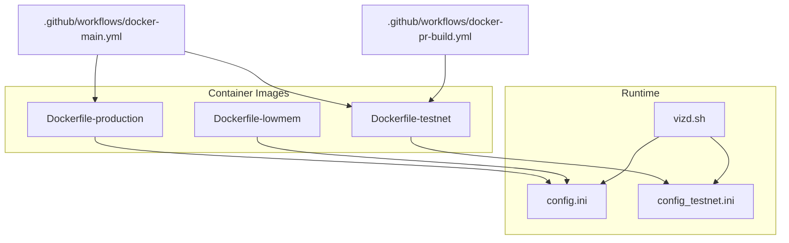
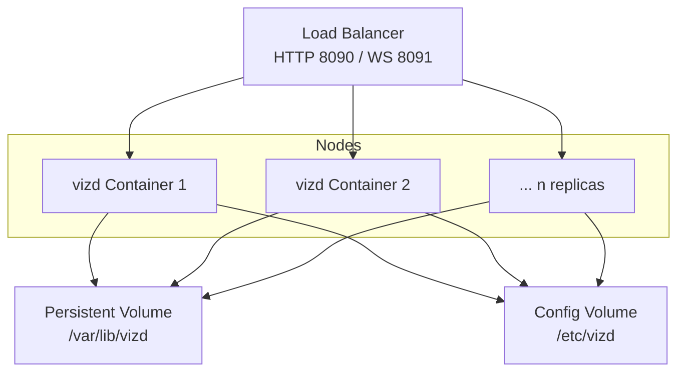
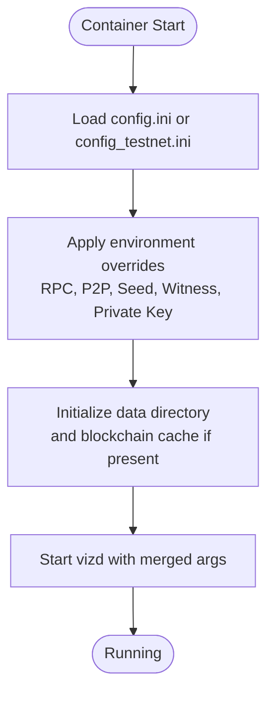
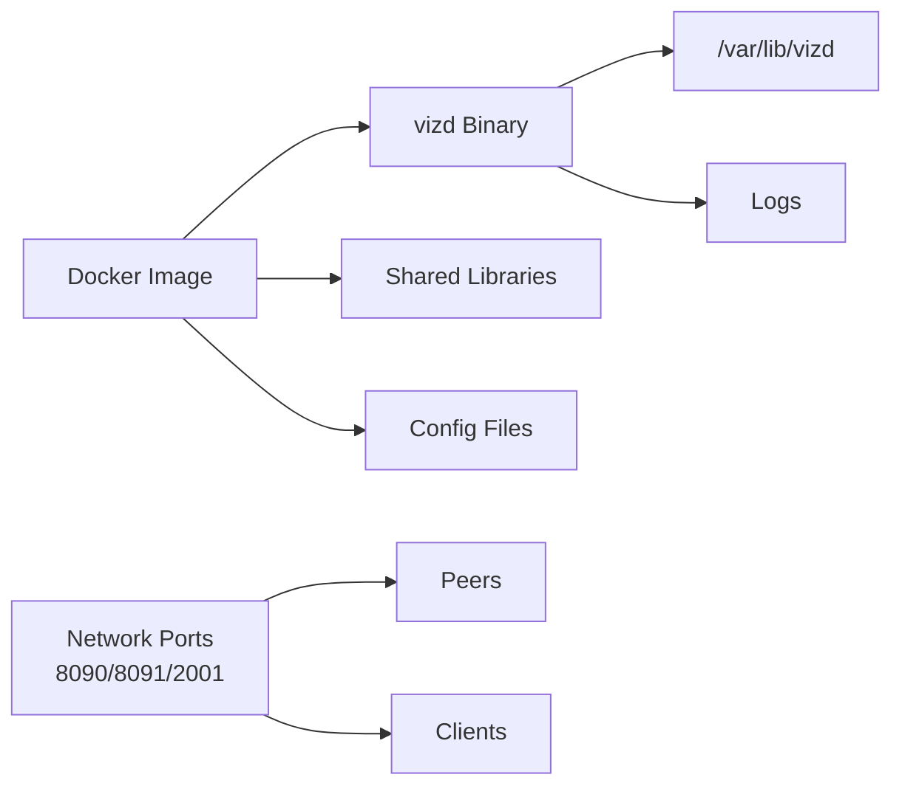

# Cloud and Infrastructure

<cite>
**Referenced Files in This Document**
- [README.md](file://README.md)
- [.github/workflows/docker-main.yml](file://.github/workflows/docker-main.yml)
- [.github/workflows/docker-pr-build.yml](file://.github/workflows/docker-pr-build.yml)
- [share/vizd/docker/Dockerfile-production](file://share/vizd/docker/Dockerfile-production)
- [share/vizd/docker/Dockerfile-lowmem](file://share/vizd/docker/Dockerfile-lowmem)
- [share/vizd/docker/Dockerfile-testnet](file://share/vizd/docker/Dockerfile-testnet)
- [share/vizd/vizd.sh](file://share/vizd/vizd.sh)
- [share/vizd/config/config.ini](file://share/vizd/config/config.ini)
- [share/vizd/config/config_testnet.ini](file://share/vizd/config/config_testnet.ini)
</cite>

## Table of Contents
1. [Introduction](#introduction)
2. [Project Structure](#project-structure)
3. [Core Components](#core-components)
4. [Architecture Overview](#architecture-overview)
5. [Detailed Component Analysis](#detailed-component-analysis)
6. [Dependency Analysis](#dependency-analysis)
7. [Performance Considerations](#performance-considerations)
8. [Troubleshooting Guide](#troubleshooting-guide)
9. [Conclusion](#conclusion)
10. [Appendices](#appendices)

## Introduction
This document provides cloud and infrastructure deployment guidance for the VIZ CPP Node. It focuses on containerized deployment using the official Docker images, highlights runtime configuration via environment variables and configuration files, and outlines operational practices for high availability, scaling, and observability. Where applicable, it references the repository’s Dockerfiles, configuration templates, and CI/CD workflows to ground recommendations in the existing build and packaging artifacts.

## Project Structure
The repository includes:
- Container build definitions for production, low-memory, and testnet variants
- Runtime configuration templates for mainnet and testnet
- A container entrypoint script that initializes data directories, applies optional overrides, and starts the node
- GitHub Actions workflows that build and publish Docker images

**Diagram sources**
- [share/vizd/docker/Dockerfile-production](file://share/vizd/docker/Dockerfile-production#L1-L88)
- [share/vizd/docker/Dockerfile-lowmem](file://share/vizd/docker/Dockerfile-lowmem#L1-L82)
- [share/vizd/docker/Dockerfile-testnet](file://share/vizd/docker/Dockerfile-testnet#L1-L88)
- [share/vizd/config/config.ini](file://share/vizd/config/config.ini#L1-L130)
- [share/vizd/config/config_testnet.ini](file://share/vizd/config/config_testnet.ini#L1-L132)
- [share/vizd/vizd.sh](file://share/vizd/vizd.sh#L1-L82)
- [.github/workflows/docker-main.yml](file://.github/workflows/docker-main.yml#L1-L41)
- [.github/workflows/docker-pr-build.yml](file://.github/workflows/docker-pr-build.yml#L1-L24)

**Section sources**
- [README.md](file://README.md#L12-L29)
- [share/vizd/docker/Dockerfile-production](file://share/vizd/docker/Dockerfile-production#L66-L88)
- [share/vizd/docker/Dockerfile-lowmem](file://share/vizd/docker/Dockerfile-lowmem#L60-L82)
- [share/vizd/docker/Dockerfile-testnet](file://share/vizd/docker/Dockerfile-testnet#L67-L88)
- [share/vizd/config/config.ini](file://share/vizd/config/config.ini#L1-L130)
- [share/vizd/config/config_testnet.ini](file://share/vizd/config/config_testnet.ini#L1-L132)
- [share/vizd/vizd.sh](file://share/vizd/vizd.sh#L1-L82)
- [.github/workflows/docker-main.yml](file://.github/workflows/docker-main.yml#L1-L41)
- [.github/workflows/docker-pr-build.yml](file://.github/workflows/docker-pr-build.yml#L1-L24)

## Core Components
- Container images
  - Production image: optimized for mainnet operation
  - Low-memory image: tuned for constrained environments
  - Testnet image: preconfigured for testnet operation
- Runtime configuration
  - Mainnet configuration template
  - Testnet configuration template
- Entrypoint script
  - Initializes data directory
  - Applies environment-driven overrides
  - Starts the node process

Key runtime ports exposed by the images:
- RPC HTTP: 8090
- RPC WS: 8091
- P2P: 2001

Volumes:
- Data directory: persists blockchain data
- Config directory: allows mounting custom configuration

**Section sources**
- [share/vizd/docker/Dockerfile-production](file://share/vizd/docker/Dockerfile-production#L74-L88)
- [share/vizd/docker/Dockerfile-lowmem](file://share/vizd/docker/Dockerfile-lowmem#L68-L82)
- [share/vizd/docker/Dockerfile-testnet](file://share/vizd/docker/Dockerfile-testnet#L75-L88)
- [share/vizd/config/config.ini](file://share/vizd/config/config.ini#L16-L20)
- [share/vizd/config/config_testnet.ini](file://share/vizd/config/config_testnet.ini#L16-L20)
- [share/vizd/vizd.sh](file://share/vizd/vizd.sh#L74-L81)

## Architecture Overview
The recommended deployment model is container-first:
- Run one or more VIZ node containers behind a load balancer
- Persist blockchain data via volumes
- Mount configuration files and seed node lists as needed
- Use environment variables to override endpoints and enable witness operation when required

[No sources needed since this diagram shows conceptual workflow, not actual code structure]

## Detailed Component Analysis

### Container Images and Build Artifacts
- Production image
  - Multi-stage build with a base image and a final runtime stage
  - Installs compiled binaries and sets up a dedicated user
  - Exposes RPC and P2P ports
  - Declares persistent volumes for data and config
- Low-memory image
  - Similar structure to production but enables a low-memory mode during build
- Testnet image
  - Includes testnet-specific configuration and snapshot
  - Enables witness operation by default

Operational notes:
- The images are published by the CI/CD workflows
- The workflows build and push images tagged as latest and testnet

**Section sources**
- [share/vizd/docker/Dockerfile-production](file://share/vizd/docker/Dockerfile-production#L1-L88)
- [share/vizd/docker/Dockerfile-lowmem](file://share/vizd/docker/Dockerfile-lowmem#L1-L82)
- [share/vizd/docker/Dockerfile-testnet](file://share/vizd/docker/Dockerfile-testnet#L1-L88)
- [.github/workflows/docker-main.yml](file://.github/workflows/docker-main.yml#L11-L41)
- [.github/workflows/docker-pr-build.yml](file://.github/workflows/docker-pr-build.yml#L9-L24)

### Runtime Configuration and Environment Overrides
The node reads configuration from a mounted config file and supports environment-driven overrides via the entrypoint script. Notable runtime parameters include:
- RPC endpoint binding
- P2P endpoint binding
- Witness name and private key
- Seed nodes list
- Optional extra arguments

Configuration templates:
- Mainnet template defines default endpoints, plugin list, and logging configuration
- Testnet template adds witness operation and adjusts participation thresholds

**Diagram sources**
- [share/vizd/vizd.sh](file://share/vizd/vizd.sh#L39-L81)
- [share/vizd/config/config.ini](file://share/vizd/config/config.ini#L1-L130)
- [share/vizd/config/config_testnet.ini](file://share/vizd/config/config_testnet.ini#L1-L132)

**Section sources**
- [share/vizd/vizd.sh](file://share/vizd/vizd.sh#L13-L39)
- [share/vizd/vizd.sh](file://share/vizd/vizd.sh#L62-L72)
- [share/vizd/config/config.ini](file://share/vizd/config/config.ini#L1-L130)
- [share/vizd/config/config_testnet.ini](file://share/vizd/config/config_testnet.ini#L1-L132)

### CI/CD and Image Publishing
- The main workflow builds and pushes:
  - testnet image on push to master
  - latest image on push to master
- The PR workflow builds a testnet image and tags it with the PR ref

These workflows provide a baseline for automated image creation and can be extended to support cloud-native deployment pipelines.

**Section sources**
- [.github/workflows/docker-main.yml](file://.github/workflows/docker-main.yml#L1-L41)
- [.github/workflows/docker-pr-build.yml](file://.github/workflows/docker-pr-build.yml#L1-L24)

## Dependency Analysis
The runtime depends on:
- Base OS packages installed in the image
- Compiled node binary and shared libraries
- Persistent volumes for data and configuration
- Network connectivity to peers and clients

[No sources needed since this diagram shows conceptual relationships, not specific code structure]

## Performance Considerations
- Single write thread: the configuration encourages a single-threaded write path to reduce contention on the database lock
- Shared memory sizing: initial and incremental sizes are configurable to balance memory footprint and growth overhead
- Thread pool sizing: the HTTP server thread pool can be tuned to match CPU cores
- Lock wait limits: read/write lock wait microsecond and retry counts help manage concurrency under load

Recommendations:
- Size shared memory according to expected chain state growth and available host memory
- Adjust thread pool size based on CPU cores and expected concurrent requests
- Monitor lock wait metrics and tune retries if contention is observed

**Section sources**
- [share/vizd/config/config.ini](file://share/vizd/config/config.ini#L36-L47)
- [share/vizd/config/config.ini](file://share/vizd/config/config.ini#L49-L67)

## Troubleshooting Guide
Common operational checks:
- Verify ports 8090 (HTTP), 8091 (WS), and 2001 (P2P) are reachable
- Confirm persistent volume is mounted and writable
- Review logs written to the configured log directories
- Validate seed nodes connectivity and adjust seed list if needed
- For witness nodes, confirm witness name and private key are set appropriately

Environment overrides:
- Override RPC and P2P endpoints if necessary
- Provide custom seed nodes via environment variable
- Enable witness operation by setting witness name and private key

**Section sources**
- [share/vizd/vizd.sh](file://share/vizd/vizd.sh#L62-L72)
- [share/vizd/vizd.sh](file://share/vizd/vizd.sh#L31-L37)
- [share/vizd/config/config.ini](file://share/vizd/config/config.ini#L111-L130)

## Conclusion
The repository provides a solid foundation for deploying VIZ CPP Node in containers with production-ready images and configuration templates. By leveraging environment-driven overrides, persistent volumes, and a load-balanced deployment pattern, operators can achieve high availability and scalability. The CI/CD workflows automate image creation, which can be extended to support cloud-native deployment pipelines.

## Appendices

### Cloud Provider Deployment Strategies
- AWS
  - Compute: choose general-purpose or compute-optimized instances depending on workload; consider EBS gp3 or io2 for IOPS-sensitive workloads
  - Networking: place nodes in private subnets behind NAT for outbound access; expose RPC via Application Load Balancer with WSS support
  - Storage: provision EBS volumes or EFS for shared data; enable snapshots for backups
  - IAM: attach least-privilege roles for metadata and logging
- Google Cloud
  - Compute: use sustained use discounts or committed use commitments; SSD persistent disks for performance
  - Networking: Cloud Load Balancing with internal and external tiers; firewall rules for RPC and P2P ports
  - Storage: Persistent Disk or Filestore; Cloud Backup for snapshots
- Azure
  - Compute: burstable or DC-series VMs; Premium SSD disks for IOPS
  - Networking: Load Balancer or Application Gateway; NSGs for port-based access
  - Storage: Managed Disks or NetApp Files; Automation Account for scheduled snapshots

[No sources needed since this section provides general guidance]

### Infrastructure-as-Code Approaches
- Terraform
  - Define VPC, subnets, security groups, autoscaling groups, and load balancers
  - Provision managed volumes and attach to instances
  - Use data sources to fetch latest container image digests for immutability
- CloudFormation (AWS)
  - StackSets for multi-account/multi-region rollouts
  - Parameterized templates for environment-specific tuning
- Other IaC tools
  - Pulumi, Ansible playbooks, or Helm charts for Kubernetes-native deployments

[No sources needed since this section provides general guidance]

### Load Balancing, Auto Scaling, and High Availability
- Load balancing
  - Distribute traffic across multiple node instances
  - Enable health checks on RPC endpoints
- Auto scaling
  - Scale on CPU, network I/O, or request latency
  - Use predictive scaling for predictable traffic patterns
- High availability
  - Deploy across multiple AZs
  - Use standby nodes with failover mechanisms

[No sources needed since this section provides general guidance]

### CDN Integration, SSL/TLS, and Security Groups
- CDN
  - Offload static assets and public APIs via CDN fronting
- SSL/TLS
  - Terminate TLS at the load balancer; secure backend-to-backend communication
- Security groups/firewall
  - Allow inbound RPC only from trusted networks
  - Permit P2P egress to seed nodes and restrict ingress to necessary ports

[No sources needed since this section provides general guidance]

### Monitoring, Alerting, Log Aggregation, and Metrics
- Cloud-native tools
  - Use platform-native observability suites for metrics and logs
- Log aggregation
  - Stream node logs to centralized logging systems
- Metrics
  - Track RPC latency, throughput, peer count, and disk usage

[No sources needed since this section provides general guidance]

### Cost Optimization, Reserved/Spot Instances
- Reserved instances
  - Commit to steady-state capacity with savings plans or reserved instances
- Spot instances
  - Use for fault-tolerant, stateless workers; avoid critical witness slots

[No sources needed since this section provides general guidance]

### Disaster Recovery, Backups, and Multi-Region
- Backups
  - Snapshot persistent volumes regularly; retain offsite copies
- DR
  - Replicate volumes across regions; automate failover procedures
- Multi-region
  - Operate secondary region for read replicas or cold standby

[No sources needed since this section provides general guidance]

### Migration, Blue-Green, and Rolling Upgrades
- Blue-green
  - Deploy new version alongside live; switch traffic on validation
- Rolling upgrades
  - Upgrade nodes in batches with health checks between batches
- Migration
  - Use snapshots to migrate between providers or regions

[No sources needed since this section provides general guidance]