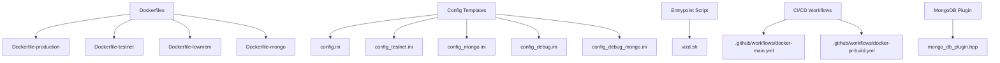
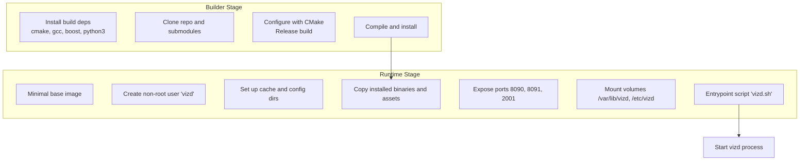
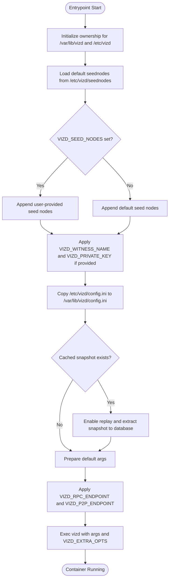
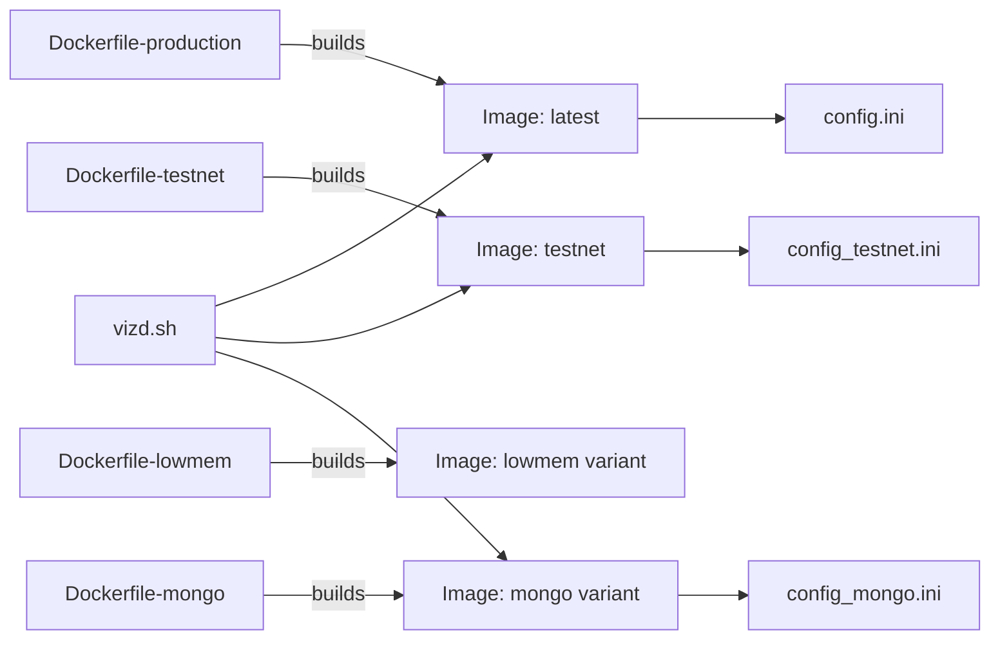

# Containerization and Docker

<cite>
**Referenced Files in This Document**
- [README.md](file://README.md)
- [.github/workflows/docker-main.yml](file://.github/workflows/docker-main.yml)
- [.github/workflows/docker-pr-build.yml](file://.github/workflows/docker-pr-build.yml)
- [share/vizd/docker/Dockerfile-production](file://share/vizd/docker/Dockerfile-production)
- [share/vizd/docker/Dockerfile-testnet](file://share/vizd/docker/Dockerfile-testnet)
- [share/vizd/docker/Dockerfile-lowmem](file://share/vizd/docker/Dockerfile-lowmem)
- [share/vizd/docker/Dockerfile-mongo](file://share/vizd/docker/Dockerfile-mongo)
- [share/vizd/vizd.sh](file://share/vizd/vizd.sh)
- [share/vizd/config/config.ini](file://share/vizd/config/config.ini)
- [share/vizd/config/config_testnet.ini](file://share/vizd/config/config_testnet.ini)
- [share/vizd/config/config_mongo.ini](file://share/vizd/config/config_mongo.ini)
- [share/vizd/config/config_debug.ini](file://share/vizd/config/config_debug.ini)
- [share/vizd/config/config_debug_mongo.ini](file://share/vizd/config/config_debug_mongo.ini)
- [plugins/mongo_db/include/graphene/plugins/mongo_db/mongo_db_plugin.hpp](file://plugins/mongo_db/include/graphene/plugins/mongo_db/mongo_db_plugin.hpp)
</cite>

## Table of Contents
1. [Introduction](#introduction)
2. [Project Structure](#project-structure)
3. [Core Components](#core-components)
4. [Architecture Overview](#architecture-overview)
5. [Detailed Component Analysis](#detailed-component-analysis)
6. [Dependency Analysis](#dependency-analysis)
7. [Performance Considerations](#performance-considerations)
8. [Troubleshooting Guide](#troubleshooting-guide)
9. [Conclusion](#conclusion)
10. [Appendices](#appendices)

## Introduction
This document provides comprehensive guidance for containerizing and deploying the VIZ C++ Node using Docker. It covers image variants (production, testnet, low-memory, and MongoDB-enabled), Dockerfile construction and multi-stage builds, configuration and runtime customization, orchestration patterns, volume and network management, security and resource best practices, monitoring integration, deployment workflows, scaling, upgrades, and troubleshooting.

## Project Structure
The repository includes Dockerfiles and configuration templates under share/vizd/docker and share/vizd/config, along with CI/CD workflows for automated image builds.

**Diagram sources**
- [share/vizd/docker/Dockerfile-production](file://share/vizd/docker/Dockerfile-production#L1-L88)
- [share/vizd/docker/Dockerfile-testnet](file://share/vizd/docker/Dockerfile-testnet#L1-L88)
- [share/vizd/docker/Dockerfile-lowmem](file://share/vizd/docker/Dockerfile-lowmem#L1-L82)
- [share/vizd/docker/Dockerfile-mongo](file://share/vizd/docker/Dockerfile-mongo#L1-L111)
- [share/vizd/config/config.ini](file://share/vizd/config/config.ini#L1-L130)
- [share/vizd/config/config_testnet.ini](file://share/vizd/config/config_testnet.ini#L1-L132)
- [share/vizd/config/config_mongo.ini](file://share/vizd/config/config_mongo.ini#L1-L135)
- [share/vizd/config/config_debug.ini](file://share/vizd/config/config_debug.ini#L1-L126)
- [share/vizd/config/config_debug_mongo.ini](file://share/vizd/config/config_debug_mongo.ini#L1-L135)
- [share/vizd/vizd.sh](file://share/vizd/vizd.sh#L1-L82)
- [.github/workflows/docker-main.yml](file://.github/workflows/docker-main.yml#L1-L41)
- [.github/workflows/docker-pr-build.yml](file://.github/workflows/docker-pr-build.yml#L1-L24)
- [plugins/mongo_db/include/graphene/plugins/mongo_db/mongo_db_plugin.hpp](file://plugins/mongo_db/include/graphene/plugins/mongo_db/mongo_db_plugin.hpp#L1-L51)

**Section sources**
- [README.md](file://README.md#L12-L52)
- [.github/workflows/docker-main.yml](file://.github/workflows/docker-main.yml#L1-L41)
- [.github/workflows/docker-pr-build.yml](file://.github/workflows/docker-pr-build.yml#L1-L24)

## Core Components
- Docker image variants:
  - Production: Built from master, intended for the main VIZ network.
  - Testnet: Built from master, suitable for local/regression test networks.
  - Low-memory: Optimized for constrained environments.
  - MongoDB-enabled: Includes the mongo_db plugin for external database indexing/export.
- Entrypoint script: Initializes volumes, applies environment overrides, seeds peers, and starts the node.
- Configuration templates: Provide defaults for RPC endpoints, P2P, logging, plugins, and optional MongoDB connectivity.

Key runtime environment variables supported by the entrypoint:
- VIZD_SEED_NODES: Override seed nodes.
- VIZD_WITNESS_NAME: Configure witness name for block production.
- VIZD_PRIVATE_KEY: Private key for signing blocks.
- VIZD_RPC_ENDPOINT: Override RPC HTTP endpoint.
- VIZD_P2P_ENDPOINT: Override P2P endpoint.
- VIZD_EXTRA_OPTS: Additional arguments appended to the node command.

Exposed ports:
- 8090 TCP (HTTP RPC)
- 8091 TCP (WebSocket RPC)
- 2001 TCP (P2P)

Volumes:
- /var/lib/vizd: Blockchain data directory (blocks, databases, caches).
- /etc/vizd: Configuration directory (config.ini, seednodes).

**Section sources**
- [share/vizd/docker/Dockerfile-production](file://share/vizd/docker/Dockerfile-production#L66-L88)
- [share/vizd/docker/Dockerfile-testnet](file://share/vizd/docker/Dockerfile-testnet#L67-L88)
- [share/vizd/docker/Dockerfile-lowmem](file://share/vizd/docker/Dockerfile-lowmem#L60-L82)
- [share/vizd/docker/Dockerfile-mongo](file://share/vizd/docker/Dockerfile-mongo#L89-L111)
- [share/vizd/vizd.sh](file://share/vizd/vizd.sh#L13-L81)
- [share/vizd/config/config.ini](file://share/vizd/config/config.ini#L16-L20)
- [share/vizd/config/config_testnet.ini](file://share/vizd/config/config_testnet.ini#L16-L20)
- [share/vizd/config/config_mongo.ini](file://share/vizd/config/config_mongo.ini#L16-L20)

## Architecture Overview
The container architecture consists of a multi-stage build that compiles the node in a builder stage and installs artifacts into a minimal runtime base. The runtime stage sets up a non-root user, exposes ports, mounts volumes, and starts the node via an entrypoint script.

**Diagram sources**
- [share/vizd/docker/Dockerfile-production](file://share/vizd/docker/Dockerfile-production#L1-L88)
- [share/vizd/docker/Dockerfile-testnet](file://share/vizd/docker/Dockerfile-testnet#L1-L88)
- [share/vizd/docker/Dockerfile-lowmem](file://share/vizd/docker/Dockerfile-lowmem#L1-L82)
- [share/vizd/docker/Dockerfile-mongo](file://share/vizd/docker/Dockerfile-mongo#L1-L111)
- [share/vizd/vizd.sh](file://share/vizd/vizd.sh#L74-L81)

## Detailed Component Analysis

### Dockerfile-production
- Purpose: Production image for the main VIZ network.
- Build characteristics:
  - Multi-stage build with a dedicated builder stage.
  - Installs build dependencies and compiles Release binaries.
  - Copies installed artifacts to the runtime stage.
- Runtime characteristics:
  - Creates non-root user and cache directories.
  - Copies default config and seednodes.
  - Exposes RPC and P2P ports.
  - Declares volumes for data and config.

**Section sources**
- [share/vizd/docker/Dockerfile-production](file://share/vizd/docker/Dockerfile-production#L1-L88)

### Dockerfile-testnet
- Purpose: Testnet image for local/regression testing.
- Differences from production:
  - Enables BUILD_TESTNET during CMake configuration.
  - Uses testnet-specific snapshot and config template.
- Runtime characteristics:
  - Same runtime setup as production.

**Section sources**
- [share/vizd/docker/Dockerfile-testnet](file://share/vizd/docker/Dockerfile-testnet#L1-L88)

### Dockerfile-lowmem
- Purpose: Low-memory footprint variant for constrained environments.
- Differences:
  - Configures LOW_MEMORY_NODE during CMake.
  - Uses an older base image tag for smaller size.
- Runtime characteristics:
  - Same runtime setup and exposed ports.

**Section sources**
- [share/vizd/docker/Dockerfile-lowmem](file://share/vizd/docker/Dockerfile-lowmem#L1-L82)

### Dockerfile-mongo
- Purpose: MongoDB-enabled image for external indexing/export.
- Differences:
  - Installs MongoDB C/C++ drivers in the builder stage.
  - Configures ENABLE_MONGO_PLUGIN during CMake.
  - Copies mongo-specific config template.
- Runtime characteristics:
  - Same runtime setup and volumes.

**Section sources**
- [share/vizd/docker/Dockerfile-mongo](file://share/vizd/docker/Dockerfile-mongo#L1-L111)

### Entrypoint Script (vizd.sh)
Responsibilities:
- Initialize ownership for data/config directories.
- Seed peers from /etc/vizd/seednodes if no explicit override is provided.
- Apply environment overrides for witness name/private key, RPC/P2P endpoints, and extra options.
- Optionally initialize blockchain from a cached snapshot if present.
- Start the node with chpst under the non-root user.

**Diagram sources**
- [share/vizd/vizd.sh](file://share/vizd/vizd.sh#L1-L82)

**Section sources**
- [share/vizd/vizd.sh](file://share/vizd/vizd.sh#L1-L82)

### Configuration Templates
- config.ini: Default production configuration with RPC endpoints, plugin list, and logging.
- config_testnet.ini: Testnet-specific configuration with witness participation enabled and test keys.
- config_mongo.ini: MongoDB-enabled configuration with mongodb-uri and mongo_db plugin enabled.
- Debug configs: Smaller shared memory and debug logging for development/testing.

Key configurable areas:
- RPC endpoints (HTTP and WS)
- P2P endpoint and seed nodes
- Plugin list and options
- Logging appenders and levels
- Optional MongoDB URI for mongo_db plugin

**Section sources**
- [share/vizd/config/config.ini](file://share/vizd/config/config.ini#L1-L130)
- [share/vizd/config/config_testnet.ini](file://share/vizd/config/config_testnet.ini#L1-L132)
- [share/vizd/config/config_mongo.ini](file://share/vizd/config/config_mongo.ini#L1-L135)
- [share/vizd/config/config_debug.ini](file://share/vizd/config/config_debug.ini#L1-L126)
- [share/vizd/config/config_debug_mongo.ini](file://share/vizd/config/config_debug_mongo.ini#L1-L135)

### MongoDB Plugin Integration
- The mongo_db plugin is declared in the mongo-enabled configuration and requires a MongoDB connection URI.
- The plugin header defines the plugin lifecycle hooks and dependencies.

**Section sources**
- [share/vizd/config/config_mongo.ini](file://share/vizd/config/config_mongo.ini#L69-L72)
- [plugins/mongo_db/include/graphene/plugins/mongo_db/mongo_db_plugin.hpp](file://plugins/mongo_db/include/graphene/plugins/mongo_db/mongo_db_plugin.hpp#L1-L51)

## Dependency Analysis
- Dockerfiles depend on:
  - Base image (phusion/baseimage) for runtime.
  - Builder stage installing build tools and dependencies.
  - CMake configuration flags controlling features (BUILD_TESTNET, LOW_MEMORY_NODE, ENABLE_MONGO_PLUGIN).
- Entrypoint depends on:
  - Presence of config and seednodes in /etc/vizd.
  - Optional cached snapshot in /var/cache/vizd.
- CI/CD workflows depend on Docker build-push action and Docker Hub credentials.

**Diagram sources**
- [share/vizd/docker/Dockerfile-production](file://share/vizd/docker/Dockerfile-production#L1-L88)
- [share/vizd/docker/Dockerfile-testnet](file://share/vizd/docker/Dockerfile-testnet#L1-L88)
- [share/vizd/docker/Dockerfile-lowmem](file://share/vizd/docker/Dockerfile-lowmem#L1-L82)
- [share/vizd/docker/Dockerfile-mongo](file://share/vizd/docker/Dockerfile-mongo#L1-L111)
- [share/vizd/vizd.sh](file://share/vizd/vizd.sh#L1-L82)
- [share/vizd/config/config.ini](file://share/vizd/config/config.ini#L1-L130)
- [share/vizd/config/config_testnet.ini](file://share/vizd/config/config_testnet.ini#L1-L132)
- [share/vizd/config/config_mongo.ini](file://share/vizd/config/config_mongo.ini#L1-L135)

**Section sources**
- [.github/workflows/docker-main.yml](file://.github/workflows/docker-main.yml#L11-L41)
- [.github/workflows/docker-pr-build.yml](file://.github/workflows/docker-pr-build.yml#L9-L24)

## Performance Considerations
- Multi-stage builds reduce final image size by discarding build tools and intermediate artifacts.
- Using Release builds and disabling shared library builds reduces binary size and improves runtime performance characteristics.
- Low-memory variant reduces shared memory footprint and related allocations for constrained environments.
- MongoDB driver installation adds overhead; enable only when required.
- Tune webserver-thread-pool-size and shared memory parameters per workload and CPU cores.
- Prefer pre-seeded snapshots to accelerate initial sync on first run.

[No sources needed since this section provides general guidance]

## Troubleshooting Guide
Common issues and resolutions:
- Ports already in use:
  - Ensure host ports 8090, 8091, and 2001 are available or map to different host ports.
- Permission denied on data directory:
  - Verify /var/lib/vizd is writable by the non-root user.
- No connectivity to seed nodes:
  - Override VIZD_SEED_NODES with reachable nodes or ensure default seednodes are present.
- MongoDB plugin failures:
  - Confirm mongodb-uri is reachable from the container network and plugin is enabled in config.
- Slow initial sync:
  - Provide a cached snapshot in /var/cache/vizd to enable automatic replay on first run.
- Logs not visible:
  - Check default and p2p log appenders configured in the active config template.

Operational tips:
- Use docker logs -f <container> to stream logs.
- Adjust log levels in config for verbose diagnostics.
- Validate configuration syntax by mounting a custom config.ini to /etc/vizd and copying it into /var/lib/vizd during startup.

**Section sources**
- [share/vizd/vizd.sh](file://share/vizd/vizd.sh#L44-L53)
- [share/vizd/config/config.ini](file://share/vizd/config/config.ini#L112-L129)
- [share/vizd/config/config_mongo.ini](file://share/vizd/config/config_mongo.ini#L116-L134)

## Conclusion
The VIZ C++ Node provides a robust set of Docker images tailored for production, testnet, low-memory, and MongoDB-enabled deployments. The multi-stage Dockerfiles, entrypoint-driven configuration, and modular config templates enable flexible, secure, and efficient containerized operations. By leveraging volumes, environment overrides, and CI/CD automation, operators can reliably deploy, scale, and maintain VIZ nodes in containerized environments.

[No sources needed since this section summarizes without analyzing specific files]

## Appendices

### Image Variants and Use Cases
- Production (latest):
  - Use for main VIZ network.
  - Built from master with standard production settings.
- Testnet (testnet):
  - Use for local/regression testing.
  - Includes testnet-specific snapshot and configuration.
- Low-memory:
  - Use on constrained systems.
  - Optimized shared memory and build settings.
- MongoDB-enabled:
  - Use when external indexing/export to MongoDB is required.
  - Includes MongoDB drivers and plugin configuration.

**Section sources**
- [README.md](file://README.md#L16-L29)
- [share/vizd/docker/Dockerfile-production](file://share/vizd/docker/Dockerfile-production#L46-L54)
- [share/vizd/docker/Dockerfile-testnet](file://share/vizd/docker/Dockerfile-testnet#L46-L54)
- [share/vizd/docker/Dockerfile-lowmem](file://share/vizd/docker/Dockerfile-lowmem#L45-L53)
- [share/vizd/docker/Dockerfile-mongo](file://share/vizd/docker/Dockerfile-mongo#L74-L82)

### Dockerfile Construction and Optimization
- Multi-stage builds:
  - Builder stage installs build tools and compiles Release binaries.
  - Runtime stage copies installed artifacts and sets up a minimal environment.
- Optimization techniques:
  - Clean package manager caches after installs.
  - Remove temporary build artifacts post-install.
  - Use non-root user and restrict filesystem permissions.
  - Keep base image versions pinned for reproducibility.

**Section sources**
- [share/vizd/docker/Dockerfile-production](file://share/vizd/docker/Dockerfile-production#L61-L64)
- [share/vizd/docker/Dockerfile-testnet](file://share/vizd/docker/Dockerfile-testnet#L62-L65)
- [share/vizd/docker/Dockerfile-lowmem](file://share/vizd/docker/Dockerfile-lowmem#L55-L58)
- [share/vizd/docker/Dockerfile-mongo](file://share/vizd/docker/Dockerfile-mongo#L32-L57)

### Container Orchestration and Service Discovery
- Docker Compose:
  - Define services with port mappings, volumes, environment variables, and restart policies.
  - Use networks to connect vizd with MongoDB (for mongo-enabled variant).
- Kubernetes:
  - Deploy as a StatefulSet with persistent volume claims for /var/lib/vizd.
  - Use ConfigMaps for config.ini and seednodes.
  - Expose services for RPC (TCP 8090/8091) and P2P (TCP 2001).
  - Implement readiness/liveness probes against RPC endpoints.

[No sources needed since this section provides general guidance]

### Volume Management and Network Configuration
- Volumes:
  - /var/lib/vizd: Persistent blockchain data and caches.
  - /etc/vizd: Configuration and seednodes.
- Network:
  - Publish 8090/8091 for RPC and 2001 for P2P.
  - For mongo-enabled, ensure MongoDB is reachable via mongodb-uri.

**Section sources**
- [share/vizd/docker/Dockerfile-production](file://share/vizd/docker/Dockerfile-production#L87-L88)
- [share/vizd/docker/Dockerfile-testnet](file://share/vizd/docker/Dockerfile-testnet#L87-L88)
- [share/vizd/docker/Dockerfile-lowmem](file://share/vizd/docker/Dockerfile-lowmem#L81-L82)
- [share/vizd/docker/Dockerfile-mongo](file://share/vizd/docker/Dockerfile-mongo#L110-L111)
- [share/vizd/config/config_mongo.ini](file://share/vizd/config/config_mongo.ini#L71-L72)

### Security Best Practices and Resource Limits
- Security:
  - Run as non-root user.
  - Limit container capabilities and mount only necessary volumes.
  - Pin base image versions and rebuild periodically.
- Resource limits:
  - Set CPU/memory limits appropriate for workload.
  - Monitor shared memory growth and adjust shared-file-size accordingly.

**Section sources**
- [share/vizd/docker/Dockerfile-production](file://share/vizd/docker/Dockerfile-production#L70-L72)
- [share/vizd/docker/Dockerfile-testnet](file://share/vizd/docker/Dockerfile-testnet#L70-L72)
- [share/vizd/docker/Dockerfile-lowmem](file://share/vizd/docker/Dockerfile-lowmem#L63-L66)
- [share/vizd/config/config.ini](file://share/vizd/config/config.ini#L49-L67)

### Monitoring Integration
- Logs:
  - Use console and file appenders defined in config templates.
  - Stream container logs and ship to centralized logging systems.
- Health checks:
  - Probe RPC endpoints for readiness.
- Metrics:
  - Expose metrics via plugins if available; otherwise monitor logs and container stats.

**Section sources**
- [share/vizd/config/config.ini](file://share/vizd/config/config.ini#L112-L129)
- [share/vizd/config/config_testnet.ini](file://share/vizd/config/config_testnet.ini#L113-L131)
- [share/vizd/config/config_mongo.ini](file://share/vizd/config/config_mongo.ini#L116-L134)

### Deployment Workflows, Scaling, and Upgrades
- Workflows:
  - Automated builds for master branch (latest) and PRs (testnet).
- Scaling:
  - Stateless RPC: Scale horizontally behind a load balancer.
  - P2P: Coordinate seed nodes and network topology carefully.
- Upgrades:
  - Pull new image tag, stop container, backup /var/lib/vizd, start with same volumes and env.

**Section sources**
- [.github/workflows/docker-main.yml](file://.github/workflows/docker-main.yml#L11-L41)
- [.github/workflows/docker-pr-build.yml](file://.github/workflows/docker-pr-build.yml#L9-L24)
- [README.md](file://README.md#L40-L52)