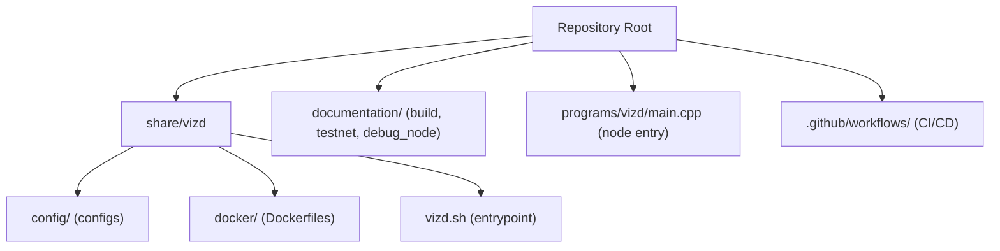
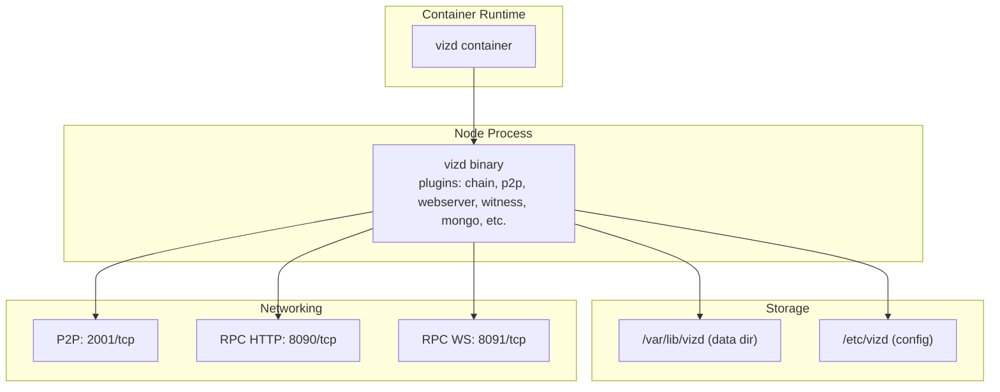
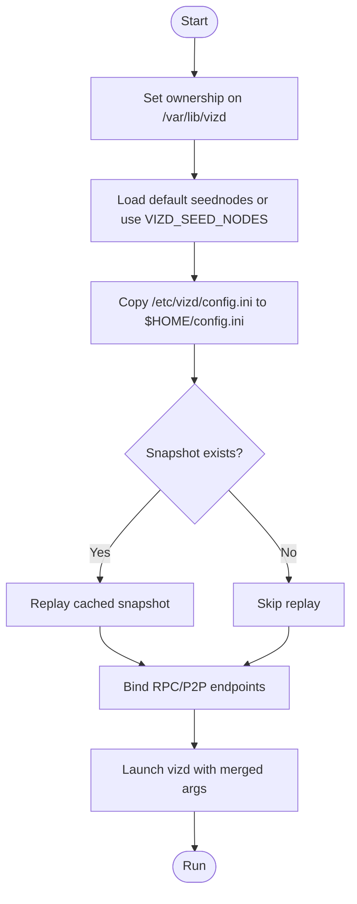
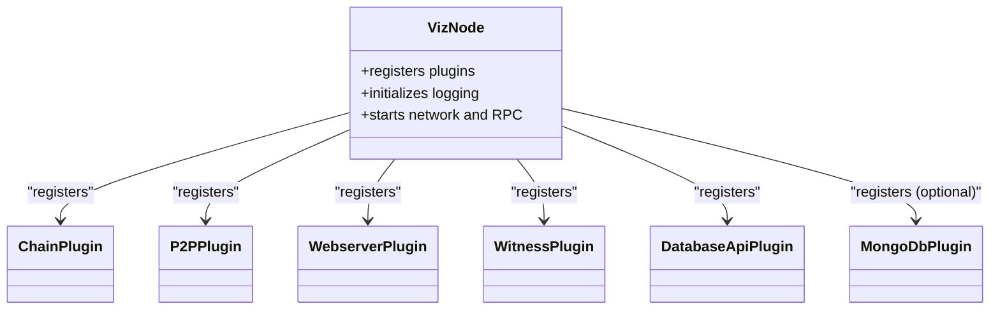
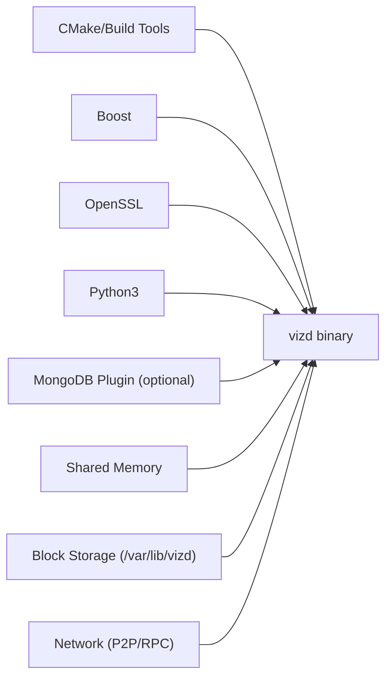

# Deployment and Operations

<cite>
**Referenced Files in This Document**
- [README.md](file://README.md)
- [building.md](file://documentation/building.md)
- [testnet.md](file://documentation/testnet.md)
- [debug_node_plugin.md](file://documentation/debug_node_plugin.md)
- [docker-main.yml](file://.github/workflows/docker-main.yml)
- [docker-pr-build.yml](file://.github/workflows/docker-pr-build.yml)
- [Dockerfile-production](file://share/vizd/docker/Dockerfile-production)
- [Dockerfile-testnet](file://share/vizd/docker/Dockerfile-testnet)
- [Dockerfile-lowmem](file://share/vizd/docker/Dockerfile-lowmem)
- [config.ini](file://share/vizd/config/config.ini)
- [config_testnet.ini](file://share/vizd/config/config_testnet.ini)
- [config_witness.ini](file://share/vizd/config/config_witness.ini)
- [config_mongo.ini](file://share/vizd/config/config_mongo.ini)
- [vizd.sh](file://share/vizd/vizd.sh)
- [main.cpp](file://programs/vizd/main.cpp)
</cite>

## Table of Contents
1. [Introduction](#introduction)
2. [Project Structure](#project-structure)
3. [Core Components](#core-components)
4. [Architecture Overview](#architecture-overview)
5. [Detailed Component Analysis](#detailed-component-analysis)
6. [Dependency Analysis](#dependency-analysis)
7. [Performance Considerations](#performance-considerations)
8. [Troubleshooting Guide](#troubleshooting-guide)
9. [Conclusion](#conclusion)
10. [Appendices](#appendices)

## Introduction
This document provides comprehensive deployment and operations guidance for the VIZ CPP Node. It covers production deployment strategies, hardware and security considerations, containerization with multiple image variants, orchestration options, cloud deployment, high availability, node types (full, witness, seed), monitoring and maintenance, security hardening, troubleshooting, and backup/disaster recovery.

## Project Structure
The repository organizes deployment assets and operational artifacts primarily under share/vizd, with configuration templates, Dockerfiles, and scripts for containerized deployments. Documentation for building and testnet operations resides under documentation/.

**Diagram sources**
- [README.md](file://README.md#L1-L53)
- [building.md](file://documentation/building.md#L1-L212)
- [testnet.md](file://documentation/testnet.md#L1-L54)
- [Dockerfile-production](file://share/vizd/docker/Dockerfile-production#L1-L88)
- [Dockerfile-testnet](file://share/vizd/docker/Dockerfile-testnet#L1-L88)
- [Dockerfile-lowmem](file://share/vizd/docker/Dockerfile-lowmem#L1-L82)
- [config.ini](file://share/vizd/config/config.ini#L1-L130)
- [config_testnet.ini](file://share/vizd/config/config_testnet.ini#L1-L132)
- [config_witness.ini](file://share/vizd/config/config_witness.ini#L1-L107)
- [config_mongo.ini](file://share/vizd/config/config_mongo.ini#L1-L135)
- [vizd.sh](file://share/vizd/vizd.sh#L1-L82)
- [main.cpp](file://programs/vizd/main.cpp#L1-L291)
- [docker-main.yml](file://.github/workflows/docker-main.yml#L1-L41)
- [docker-pr-build.yml](file://.github/workflows/docker-pr-build.yml#L1-L24)

**Section sources**
- [README.md](file://README.md#L1-L53)
- [building.md](file://documentation/building.md#L1-L212)
- [testnet.md](file://documentation/testnet.md#L1-L54)
- [Dockerfile-production](file://share/vizd/docker/Dockerfile-production#L1-L88)
- [Dockerfile-testnet](file://share/vizd/docker/Dockerfile-testnet#L1-L88)
- [Dockerfile-lowmem](file://share/vizd/docker/Dockerfile-lowmem#L1-L82)
- [config.ini](file://share/vizd/config/config.ini#L1-L130)
- [config_testnet.ini](file://share/vizd/config/config_testnet.ini#L1-L132)
- [config_witness.ini](file://share/vizd/config/config_witness.ini#L1-L107)
- [config_mongo.ini](file://share/vizd/config/config_mongo.ini#L1-L135)
- [vizd.sh](file://share/vizd/vizd.sh#L1-L82)
- [main.cpp](file://programs/vizd/main.cpp#L1-L291)
- [docker-main.yml](file://.github/workflows/docker-main.yml#L1-L41)
- [docker-pr-build.yml](file://.github/workflows/docker-pr-build.yml#L1-L24)

## Core Components
- Container images
  - Production image: Built from Dockerfile-production, intended for mainnet.
  - Testnet image: Built from Dockerfile-testnet, intended for test networks.
  - Low-memory image: Built from Dockerfile-lowmem, optimized for resource-constrained environments.
- Configuration templates
  - config.ini: General-purpose configuration for mainnet.
  - config_testnet.ini: Testnet-specific configuration with witness participation enabled.
  - config_witness.ini: Witness node configuration with RPC bound to localhost and virtual ops skipped.
  - config_mongo.ini: Extended configuration including MongoDB plugin for analytics.
- Entrypoint script
  - vizd.sh: Orchestrates seed node injection, RPC/P2P endpoints, replay initialization, and runtime arguments.
- Node binary
  - programs/vizd/main.cpp: Registers plugins and initializes the node runtime.

Key operational parameters and behaviors:
- P2P and RPC endpoints are configurable via environment variables and config files.
- Shared memory sizing and growth thresholds are tunable to manage memory pressure.
- Lock wait timeouts and retries are configurable to balance throughput and latency.
- Plugin selection determines node capabilities (e.g., witness, mongo, debug_node).

**Section sources**
- [Dockerfile-production](file://share/vizd/docker/Dockerfile-production#L1-L88)
- [Dockerfile-testnet](file://share/vizd/docker/Dockerfile-testnet#L1-L88)
- [Dockerfile-lowmem](file://share/vizd/docker/Dockerfile-lowmem#L1-L82)
- [config.ini](file://share/vizd/config/config.ini#L1-L130)
- [config_testnet.ini](file://share/vizd/config/config_testnet.ini#L1-L132)
- [config_witness.ini](file://share/vizd/config/config_witness.ini#L1-L107)
- [config_mongo.ini](file://share/vizd/config/config_mongo.ini#L1-L135)
- [vizd.sh](file://share/vizd/vizd.sh#L1-L82)
- [main.cpp](file://programs/vizd/main.cpp#L60-L91)

## Architecture Overview
The VIZ node is a modular application with pluggable subsystems for chain processing, P2P networking, webserver APIs, and optional plugins (e.g., witness, mongo, debug_node). Containerization encapsulates dependencies and exposes standardized ports for RPC (HTTP/WebSocket) and P2P communication.

**Diagram sources**
- [Dockerfile-production](file://share/vizd/docker/Dockerfile-production#L74-L87)
- [Dockerfile-testnet](file://share/vizd/docker/Dockerfile-testnet#L75-L87)
- [Dockerfile-lowmem](file://share/vizd/docker/Dockerfile-lowmem#L68-L79)
- [vizd.sh](file://share/vizd/vizd.sh#L74-L81)
- [config.ini](file://share/vizd/config/config.ini#L1-L20)
- [config_testnet.ini](file://share/vizd/config/config_testnet.ini#L1-L20)
- [config_witness.ini](file://share/vizd/config/config_witness.ini#L1-L20)

**Section sources**
- [Dockerfile-production](file://share/vizd/docker/Dockerfile-production#L66-L87)
- [Dockerfile-testnet](file://share/vizd/docker/Dockerfile-testnet#L67-L87)
- [Dockerfile-lowmem](file://share/vizd/docker/Dockerfile-lowmem#L60-L79)
- [vizd.sh](file://share/vizd/vizd.sh#L74-L81)
- [config.ini](file://share/vizd/config/config.ini#L1-L20)
- [config_testnet.ini](file://share/vizd/config/config_testnet.ini#L1-L20)
- [config_witness.ini](file://share/vizd/config/config_witness.ini#L1-L20)

## Detailed Component Analysis

### Container Images and Orchestration
- Production image
  - Purpose: Run mainnet nodes.
  - Build: Uses Dockerfile-production with Release build and standard plugins.
  - Ports exposed: 8090 (HTTP RPC), 8091 (WS RPC), 2001 (P2P).
  - Volumes: /var/lib/vizd (blockchain data), /etc/vizd (config).
- Testnet image
  - Purpose: Local testnet and development.
  - Build: Uses Dockerfile-testnet with BUILD_TESTNET enabled.
  - Ports and volumes same as production.
- Low-memory image
  - Purpose: Resource-constrained environments; consensus-only behavior.
  - Build: Uses Dockerfile-lowmem with LOW_MEMORY_NODE enabled.
- CI/CD
  - docker-main.yml builds and pushes latest and testnet tags.
  - docker-pr-build.yml builds testnet images for pull requests.

Operational notes:
- Environment overrides for endpoints and seed nodes are supported via vizd.sh.
- Snapshot caching enables fast startup when blocks are prepackaged.

**Section sources**
- [Dockerfile-production](file://share/vizd/docker/Dockerfile-production#L1-L88)
- [Dockerfile-testnet](file://share/vizd/docker/Dockerfile-testnet#L1-L88)
- [Dockerfile-lowmem](file://share/vizd/docker/Dockerfile-lowmem#L1-L82)
- [docker-main.yml](file://.github/workflows/docker-main.yml#L1-L41)
- [docker-pr-build.yml](file://.github/workflows/docker-pr-build.yml#L1-L24)
- [vizd.sh](file://share/vizd/vizd.sh#L1-L82)

### Configuration Templates and Node Types
- Full node (mainnet)
  - Use config.ini as baseline.
  - Typical plugins include chain, p2p, webserver, database_api, account_history, operation_history, and others.
- Full node (testnet)
  - Use config_testnet.ini; includes witness participation and a default witness identity.
- Witness node
  - Use config_witness.ini; RPC endpoints bound to localhost, skip virtual ops for reduced overhead.
  - Configure witness name and private key for block production.
- Analytics node (MongoDB)
  - Use config_mongo.ini; includes mongo_db plugin and market history settings.

Key tuning knobs:
- Shared memory sizing and growth thresholds.
- Read/write lock wait and retries.
- Single write thread for improved database contention handling.
- Plugin notifications on push_transaction can be disabled to improve performance.

**Section sources**
- [config.ini](file://share/vizd/config/config.ini#L1-L130)
- [config_testnet.ini](file://share/vizd/config/config_testnet.ini#L1-L132)
- [config_witness.ini](file://share/vizd/config/config_witness.ini#L1-L107)
- [config_mongo.ini](file://share/vizd/config/config_mongo.ini#L1-L135)

### Entrypoint Script Behavior
The entrypoint script sets ownership, injects seed nodes (from image or environment), optionally replays from cached snapshot, binds RPC/P2P endpoints, and launches the node with merged arguments.

**Diagram sources**
- [vizd.sh](file://share/vizd/vizd.sh#L1-L82)

**Section sources**
- [vizd.sh](file://share/vizd/vizd.sh#L1-L82)

### Node Binary and Plugin Registration
The node binary registers a comprehensive set of plugins, including chain, p2p, webserver, witness, database_api, social_network, account_history, private_message, tags, follow, and optional mongo_db plugin. This defines the node’s capabilities and API surface.

**Diagram sources**
- [main.cpp](file://programs/vizd/main.cpp#L60-L91)
- [main.cpp](file://programs/vizd/main.cpp#L106-L158)

**Section sources**
- [main.cpp](file://programs/vizd/main.cpp#L60-L91)
- [main.cpp](file://programs/vizd/main.cpp#L106-L158)

### API Workflows and Health Checks
- RPC endpoints
  - HTTP: 8090
  - WebSocket: 8091
- Health checks
  - Use HTTP RPC to query dynamic global properties or chain info.
  - Monitor P2P connectivity and sync progress.
- Witness operations
  - Configure witness name and private key for block production.
  - Bind RPC to localhost for witness nodes to minimize exposure.

**Section sources**
- [config.ini](file://share/vizd/config/config.ini#L16-L20)
- [config_testnet.ini](file://share/vizd/config/config_testnet.ini#L16-L20)
- [config_witness.ini](file://share/vizd/config/config_witness.ini#L17-L20)
- [config_mongo.ini](file://share/vizd/config/config_mongo.ini#L16-L20)

## Dependency Analysis
The node depends on:
- Build-time: CMake, compiler toolchain, Boost, OpenSSL, Python3, and optional MongoDB plugin support.
- Runtime: Shared memory for chain state, persistent storage for blockchain data, and network connectivity for P2P.

**Diagram sources**
- [building.md](file://documentation/building.md#L3-L16)
- [main.cpp](file://programs/vizd/main.cpp#L1-L31)

**Section sources**
- [building.md](file://documentation/building.md#L3-L16)
- [main.cpp](file://programs/vizd/main.cpp#L1-L31)

## Performance Considerations
- Shared memory sizing
  - Adjust initial size and increment thresholds to reduce allocation pressure during replay or rapid growth.
- Lock tuning
  - Increase single write thread to reduce database contention; tune read/write wait micros and retries to balance latency and throughput.
- Plugin overhead
  - Disable plugin notifications on push_transaction to reduce CPU usage.
  - Skip virtual operations for nodes not requiring them.
- Concurrency
  - Tune webserver thread pool size according to CPU cores.
- Disk I/O
  - Use SSD-backed storage for blockchain data and logs.
- Network
  - Limit inbound P2P connections and prefer stable peers for consistent sync.

**Section sources**
- [config.ini](file://share/vizd/config/config.ini#L49-L67)
- [config.ini](file://share/vizd/config/config.ini#L13-L14)
- [config.ini](file://share/vizd/config/config.ini#L42-L47)
- [config.ini](file://share/vizd/config/config.ini#L78-L79)

## Troubleshooting Guide
Common operational issues and remedies:
- Startup hangs or slow sync
  - Verify seed nodes and P2P connectivity; adjust p2p-max-connections.
  - Check shared memory thresholds and free space triggers.
- RPC lock errors
  - Increase write/read wait micros and retries; consider single-write-thread.
- Insufficient disk space
  - Monitor free space thresholds and ensure adequate headroom for shared memory growth.
- Witness node not producing blocks
  - Confirm witness name and private key are set; ensure required participation threshold is appropriate.
- Debugging state changes
  - Use debug_node plugin in isolated, localhost-bound RPC for controlled experiments.

Security hardening tips:
- Bind RPC to localhost for witness nodes; expose externally via reverse proxy with authentication.
- Use firewalls to restrict P2P ingress to trusted peers.
- Rotate private keys and restrict filesystem permissions on /var/lib/vizd.

Backup and recovery:
- Back up /var/lib/vizd regularly; maintain snapshots for quick recovery.
- For disaster scenarios, restore snapshot and replay minimal blocks to synchronize.

**Section sources**
- [config_witness.ini](file://share/vizd/config/config_witness.ini#L17-L20)
- [config_testnet.ini](file://share/vizd/config/config_testnet.ini#L100-L103)
- [config.ini](file://share/vizd/config/config.ini#L22-L34)
- [debug_node_plugin.md](file://documentation/debug_node_plugin.md#L1-L134)

## Conclusion
This guide consolidates deployment and operations practices for VIZ CPP Node across containerized, cloud, and bare-metal environments. By leveraging the provided Dockerfiles, configuration templates, and entrypoint script, operators can deploy production-grade nodes, optimize performance, harden security, and maintain reliability with robust monitoring and recovery procedures.

## Appendices

### Appendix A: Node Types and Operational Procedures
- Full node
  - Use config.ini; expose RPC publicly as needed; monitor P2P connectivity.
- Witness node
  - Use config_witness.ini; bind RPC to localhost; configure witness and private key.
- Seed node
  - Use config.ini; focus on stable connectivity and minimal external exposure; consider low-memory image for constrained environments.

**Section sources**
- [config.ini](file://share/vizd/config/config.ini#L1-L130)
- [config_witness.ini](file://share/vizd/config/config_witness.ini#L1-L107)
- [building.md](file://documentation/building.md#L11-L15)

### Appendix B: Monitoring and Maintenance
- Logs
  - Console and file appenders configured; ensure log rotation and retention policies.
- Health checks
  - Query dynamic global properties via HTTP RPC endpoint.
- Database maintenance
  - Monitor shared memory growth and free space thresholds; adjust increments and thresholds as needed.

**Section sources**
- [config.ini](file://share/vizd/config/config.ini#L111-L130)
- [config_testnet.ini](file://share/vizd/config/config_testnet.ini#L113-L132)
- [config_mongo.ini](file://share/vizd/config/config_mongo.ini#L116-L135)

### Appendix C: Security Hardening Checklist
- Network
  - Restrict P2P ingress; whitelist seed nodes; use reverse proxy for RPC.
- Credentials
  - Protect private keys; restrict filesystem permissions on data directory.
- Logging
  - Avoid verbose logs in production; rotate and retain logs securely.
- Updates
  - Pin container image tags; automate updates with CI/CD.

**Section sources**
- [config_witness.ini](file://share/vizd/config/config_witness.ini#L17-L20)
- [vizd.sh](file://share/vizd/vizd.sh#L62-L72)

### Appendix D: Cloud Deployment and High Availability
- Orchestration
  - Use Kubernetes or Docker Swarm to manage replicas and rolling updates.
- Load balancing
  - Place a reverse proxy in front of RPC endpoints; distribute P2P traffic across nodes.
- High availability
  - Run multiple full nodes behind a load balancer; maintain hot standby with snapshot-based recovery.

[No sources needed since this section provides general guidance]

### Appendix E: Backup and Disaster Recovery
- Snapshots
  - Package blockchain snapshot into image for fast startup; store offsite backups.
- Recovery
  - Restore snapshot and replay minimal blocks; validate chain integrity.

**Section sources**
- [vizd.sh](file://share/vizd/vizd.sh#L44-L53)