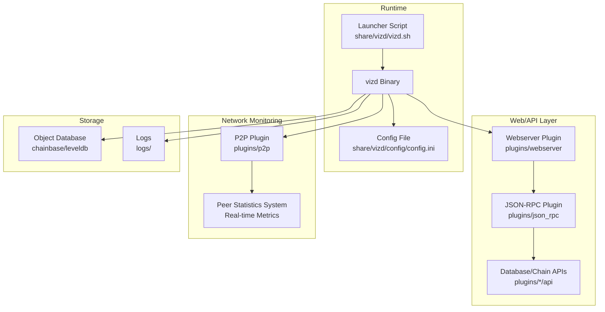
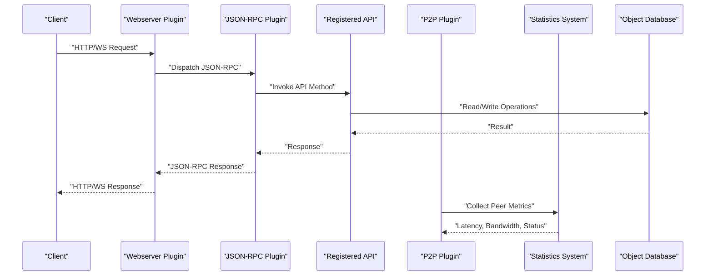
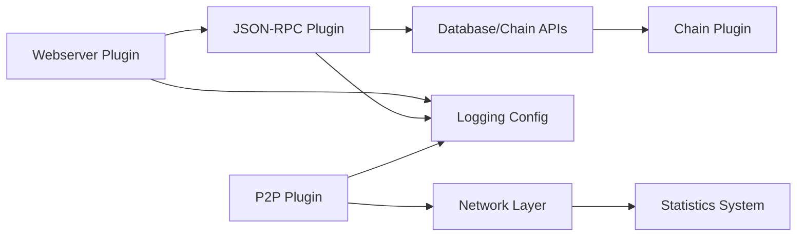

# Monitoring and Maintenance

<cite>
**Referenced Files in This Document**
- [README.md](file://README.md)
- [config.ini](file://share/vizd/config/config.ini)
- [vizd.sh](file://share/vizd/vizd.sh)
- [webserver_plugin.hpp](file://plugins/webserver/include/graphene/plugins/webserver/webserver_plugin.hpp)
- [json_rpc_plugin.hpp](file://plugins/json_rpc/include/graphene/plugins/json_rpc/plugin.hpp)
- [database_api_plugin.cpp](file://plugins/database_api/plugin.cpp)
- [account_history_plugin.cpp](file://plugins/account_history/plugin.cpp)
- [operation_history_plugin.cpp](file://plugins/operation_history/plugin.cpp)
- [mongo_db_plugin.cpp](file://plugins/mongo_db/mongo_db_plugin.cpp)
- [p2p_plugin.cpp](file://plugins/p2p/p2p_plugin.cpp)
- [p2p_plugin.hpp](file://plugins/p2p/include/graphene/plugins/p2p/p2p_plugin.hpp)
- [node.hpp](file://libraries/network/include/graphene/network/node.hpp)
- [peer_connection.hpp](file://libraries/network/include/graphene/network/peer_connection.hpp)
- [network_broadcast_api_plugin.cpp](file://plugins/network_broadcast_api/network_broadcast_api.cpp)
- [witness_api_plugin.cpp](file://plugins/witness_api/plugin.cpp)
- [block_info_plugin.cpp](file://plugins/block_info/plugin.cpp)
- [raw_block_plugin.cpp](file://plugins/raw_block/plugin.cpp)
- [debug_node_plugin.cpp](file://plugins/debug_node/plugin.cpp)
- [chain_plugin.cpp](file://plugins/chain/plugin.cpp)
- [building.md](file://documentation/building.md)
- [testnet.md](file://documentation/testnet.md)
- [debug_node_plugin.md](file://documentation/debug_node_plugin.md)
</cite>

## Update Summary
**Changes Made**
- Added new section on P2P Peer Statistics System for real-time network observability
- Updated Health Checks and Readiness section to include peer statistics monitoring
- Enhanced Performance Monitoring section with P2P network metrics
- Added P2P statistics configuration and operational procedures
- Updated troubleshooting guide with peer statistics diagnostics

## Table of Contents
1. [Introduction](#introduction)
2. [Project Structure](#project-structure)
3. [Core Components](#core-components)
4. [Architecture Overview](#architecture-overview)
5. [Detailed Component Analysis](#detailed-component-analysis)
6. [Dependency Analysis](#dependency-analysis)
7. [Performance Considerations](#performance-considerations)
8. [Troubleshooting Guide](#troubleshooting-guide)
9. [Conclusion](#conclusion)
10. [Appendices](#appendices)

## Introduction
This document provides comprehensive monitoring and maintenance guidance for VIZ CPP Node operations. It covers health checks, performance metrics collection, system monitoring integration with Prometheus, Grafana, and the ELK stack, log management and rotation, centralized logging, database maintenance (compaction, optimization, backup verification), performance monitoring (CPU, memory, disk I/O, network), proactive maintenance (updates, patches, configuration audits), incident response, capacity planning, and automation via scripts and dashboards.

**Updated** Added new monitoring capabilities through P2P peer statistics system providing real-time peer health monitoring, latency measurements, and blocking status reporting for improved network observability.

## Project Structure
The VIZ node is organized around a modular plugin architecture. The runtime is configured via a central configuration file and launched through a shell script wrapper. The webserver and JSON-RPC plugins expose HTTP and WebSocket endpoints for API access. Logging is configured via the configuration file's logging sections. Operational scripts support Docker-based deployments and seed node selection.



**Diagram sources**
- [config.ini:1-130](file://share/vizd/config/config.ini#L1-L130)
- [vizd.sh:1-82](file://share/vizd/vizd.sh#L1-L82)
- [webserver_plugin.hpp:1-62](file://plugins/webserver/include/graphene/plugins/webserver/webserver_plugin.hpp#L1-L62)
- [json_rpc_plugin.hpp:1-146](file://plugins/json_rpc/include/graphene/plugins/json_rpc/plugin.hpp#L1-L146)
- [p2p_plugin.cpp:489-560](file://plugins/p2p/p2p_plugin.cpp#L489-L560)

**Section sources**
- [README.md:1-53](file://README.md#L1-L53)
- [config.ini:1-130](file://share/vizd/config/config.ini#L1-L130)
- [vizd.sh:1-82](file://share/vizd/vizd.sh#L1-L82)

## Core Components
- Webserver and JSON-RPC: Provide HTTP and WebSocket endpoints for API access and dispatch JSON-RPC requests to registered APIs.
- Logging: Configured via file appenders and loggers in the configuration file.
- P2P Peer Statistics System: Real-time monitoring of peer connections, latency, bandwidth usage, and blocking status for network observability.
- Plugins: Chain, Account History, Operation History, Mongo DB, P2P, Network Broadcast API, Witness API, Block Info, Raw Block, Debug Node, and others.
- Runtime launcher: Sets endpoints, seed nodes, and replay options for Docker-based deployments.

Key configuration and runtime elements:
- Endpoints: P2P, HTTP, WebSocket, and RPC endpoints are defined in the configuration file and can be overridden by environment variables in the launcher script.
- Plugins: Enabled via plugin directives; database API and chain are enabled by default.
- Logging: Console and file appenders with configurable log levels.
- P2P Statistics: Configurable interval-based peer monitoring with latency and bandwidth metrics.

**Section sources**
- [webserver_plugin.hpp:19-31](file://plugins/webserver/include/graphene/plugins/webserver/webserver_plugin.hpp#L19-L31)
- [json_rpc_plugin.hpp:13-36](file://plugins/json_rpc/include/graphene/plugins/json_rpc/plugin.hpp#L13-L36)
- [config.ini:1-130](file://share/vizd/config/config.ini#L1-L130)
- [vizd.sh:62-81](file://share/vizd/vizd.sh#L62-L81)
- [p2p_plugin.cpp:570-589](file://plugins/p2p/p2p_plugin.cpp#L570-L589)

## Architecture Overview
The VIZ node exposes an HTTP and WebSocket interface backed by JSON-RPC. Requests are dispatched to registered API methods. Logging is handled centrally via appenders and loggers. Storage relies on an object database with shared memory sizing controls. Plugins extend functionality and integrate with the chain and APIs. The P2P peer statistics system provides real-time network observability through periodic peer health monitoring.



**Diagram sources**
- [webserver_plugin.hpp:19-31](file://plugins/webserver/include/graphene/plugins/webserver/webserver_plugin.hpp#L19-L31)
- [json_rpc_plugin.hpp:103-113](file://plugins/json_rpc/include/graphene/plugins/json_rpc/plugin.hpp#L103-L113)
- [database_api_plugin.cpp:1-200](file://plugins/database_api/plugin.cpp#L1-L200)
- [p2p_plugin.cpp:489-560](file://plugins/p2p/p2p_plugin.cpp#L489-L560)

## Detailed Component Analysis

### Health Checks and Readiness
- HTTP/WS endpoints: Configure readiness by ensuring the webserver plugin is active and reachable on the configured HTTP and WebSocket endpoints.
- JSON-RPC health: Use a lightweight method (e.g., a read-only chain property) to validate API responsiveness.
- P2P connectivity: Confirm peers are connected and block production is progressing (for witness nodes).
- **Updated** P2P peer statistics: Monitor peer health through the statistics system for real-time network observability.

Operational references:
- Endpoints: [config.ini:16-20](file://share/vizd/config/config.ini#L16-L20)
- Webserver lifecycle: [webserver_plugin.hpp:48-52](file://plugins/webserver/include/graphene/plugins/webserver/webserver_plugin.hpp#L48-L52)
- JSON-RPC lifecycle: [json_rpc_plugin.hpp:103-107](file://plugins/json_rpc/include/graphene/plugins/json_rpc/plugin.hpp#L103-L107)
- **Updated** P2P statistics configuration: [p2p_plugin.cpp:570-589](file://plugins/p2p/p2p_plugin.cpp#L570-L589)

**Section sources**
- [config.ini:16-20](file://share/vizd/config/config.ini#L16-L20)
- [webserver_plugin.hpp:48-52](file://plugins/webserver/include/graphene/plugins/webserver/webserver_plugin.hpp#L48-L52)
- [json_rpc_plugin.hpp:103-107](file://plugins/json_rpc/include/graphene/plugins/json_rpc/plugin.hpp#L103-L107)
- [p2p_plugin.cpp:570-589](file://plugins/p2p/p2p_plugin.cpp#L570-L589)

### P2P Peer Statistics System
**New Section** The P2P peer statistics system provides comprehensive real-time monitoring of network peer health and performance metrics.

#### Statistics Collection Features
- **Peer Connection Monitoring**: Tracks connected peers, IP addresses, and ports
- **Latency Measurements**: Real-time round-trip delay in milliseconds
- **Bandwidth Tracking**: Bytes received metrics with delta calculations
- **Blocking Status Reporting**: Identifies peers under soft-ban or inhibition
- **Reason Analysis**: Provides blocking reasons for network policy enforcement

#### Configuration Options
- `p2p-stats-enabled`: Enable/disable periodic peer statistics logging (default: true)
- `p2p-stats-interval`: Interval between statistics dumps in seconds (default: 300)

#### Statistics Fields
- **IP Address**: Peer's network address
- **Port**: Peer's listening port
- **Latency**: Round-trip delay in milliseconds
- **Bytes Received**: Delta bytes received since last measurement
- **Blocked Status**: Boolean indicating soft-ban/inhibition state
- **Blocked Reason**: Network policy reason for blocking

#### Implementation Details
The statistics system runs as a scheduled task that:
1. Queries connected peers from the network node
2. Extracts peer information from variant objects
3. Calculates byte delta values for bandwidth monitoring
4. Logs formatted peer statistics with ANSI color coding
5. Schedules next execution based on configured interval

**Section sources**
- [p2p_plugin.cpp:489-560](file://plugins/p2p/p2p_plugin.cpp#L489-L560)
- [p2p_plugin.cpp:570-589](file://plugins/p2p/p2p_plugin.cpp#L570-L589)
- [node.hpp:172-179](file://libraries/network/include/graphene/network/node.hpp#L172-L179)
- [peer_connection.hpp:320-342](file://libraries/network/include/graphene/network/peer_connection.hpp#L320-L342)

### Performance Metrics Collection
- Built-in metrics: The node does not expose Prometheus metrics endpoints by default. Metrics must be collected externally or via custom instrumentation.
- External collection: Use system-level collectors (e.g., Node Exporter) for CPU, memory, disk I/O, and network utilization.
- API latency: Instrument JSON-RPC endpoints to capture request durations and error rates.
- **Updated** P2P network metrics: Utilize peer statistics for network performance monitoring and bandwidth analysis.

Integration references:
- Endpoints: [config.ini:16-20](file://share/vizd/config/config.ini#L16-L20)
- Webserver threading model: [webserver_plugin.hpp:28-30](file://plugins/webserver/include/graphene/plugins/webserver/webserver_plugin.hpp#L28-L30)
- **Updated** P2P statistics scheduling: [p2p_plugin.cpp:685-692](file://plugins/p2p/p2p_plugin.cpp#L685-L692)

**Section sources**
- [config.ini:16-20](file://share/vizd/config/config.ini#L16-L20)
- [webserver_plugin.hpp:28-30](file://plugins/webserver/include/graphene/plugins/webserver/webserver_plugin.hpp#L28-L30)
- [p2p_plugin.cpp:685-692](file://plugins/p2p/p2p_plugin.cpp#L685-L692)

### System Monitoring Integration (Prometheus, Grafana, ELK)
- Prometheus: Scrape system metrics via Node Exporter; optionally scrape custom JSON-RPC metrics if instrumented.
- Grafana: Build dashboards for CPU, memory, disk I/O, network, and API latency.
- ELK: Ship logs to Logstash/Beats and visualize in Kibana for centralized log analysis.
- **Updated** Network monitoring: Integrate P2P statistics with monitoring systems for peer health visualization.

Operational references:
- Logging configuration: [config.ini:111-130](file://share/vizd/config/config.ini#L111-L130)
- Launcher script for endpoint overrides: [vizd.sh:62-72](file://share/vizd/vizd.sh#L62-L72)
- **Updated** P2P statistics configuration: [p2p_plugin.cpp:570-589](file://plugins/p2p/p2p_plugin.cpp#L570-L589)

**Section sources**
- [config.ini:111-130](file://share/vizd/config/config.ini#L111-L130)
- [vizd.sh:62-72](file://share/vizd/vizd.sh#L62-L72)
- [p2p_plugin.cpp:570-589](file://plugins/p2p/p2p_plugin.cpp#L570-L589)

### Log Management Strategies
- Console and file appenders: Configure loggers and appenders for different subsystems (e.g., default, p2p).
- Log levels: Adjust severity thresholds per logger.
- Log rotation: Use external log rotation tools (e.g., logrotate) to manage file sizes and retention.
- Centralized logging: Forward logs to a centralized collector (e.g., rsyslog, Fluent Bit) for aggregation.
- **Updated** P2P statistics logging: ANSI color-coded peer statistics with periodic dumps for network monitoring.

References:
- Appenders and loggers: [config.ini:111-130](file://share/vizd/config/config.ini#L111-L130)
- Docker-based deployment and seed nodes: [vizd.sh:1-82](file://share/vizd/vizd.sh#L1-L82)
- **Updated** P2P statistics color coding: [p2p_plugin.cpp:15-17](file://plugins/p2p/p2p_plugin.cpp#L15-L17)

**Section sources**
- [config.ini:111-130](file://share/vizd/config/config.ini#L111-L130)
- [vizd.sh:1-82](file://share/vizd/vizd.sh#L1-L82)
- [p2p_plugin.cpp:15-17](file://plugins/p2p/p2p_plugin.cpp#L15-L17)

### Database Maintenance Tasks
- Shared memory sizing: Tune shared file size, minimum free space, and increment steps to avoid allocation failures.
- Compaction and optimization: Rely on underlying storage engine defaults; monitor free space and adjust thresholds periodically.
- Backup verification: Periodically snapshot the blockchain database and verify replay integrity.

References:
- Shared memory settings: [config.ini:49-67](file://share/vizd/config/config.ini#L49-L67)
- Replay option in launcher: [vizd.sh:44-53](file://share/vizd/vizd.sh#L44-L53)

**Section sources**
- [config.ini:49-67](file://share/vizd/config/config.ini#L49-L67)
- [vizd.sh:44-53](file://share/vizd/vizd.sh#L44-L53)

### Performance Monitoring (CPU, Memory, Disk I/O, Network)
- CPU: Track utilization and context switches; correlate with API throughput.
- Memory: Monitor RSS, shared memory usage, and free space thresholds.
- Disk I/O: Observe read/write latencies and queue depths; ensure adequate free space.
- Network: Measure P2P and RPC traffic; watch connection counts and bandwidth.
- **Updated** P2P network performance: Monitor peer latency, bandwidth usage, and connection health through statistics system.

References:
- Endpoints and threading: [config.ini:13-47](file://share/vizd/config/config.ini#L13-L47)
- Webserver threading note: [webserver_plugin.hpp:28-30](file://plugins/webserver/include/graphene/plugins/webserver/webserver_plugin.hpp#L28-L30)
- **Updated** Peer statistics metrics: [p2p_plugin.cpp:510-530](file://plugins/p2p/p2p_plugin.cpp#L510-L530)

**Section sources**
- [config.ini:13-47](file://share/vizd/config/config.ini#L13-L47)
- [webserver_plugin.hpp:28-30](file://plugins/webserver/include/graphene/plugins/webserver/webserver_plugin.hpp#L28-L30)
- [p2p_plugin.cpp:510-530](file://plugins/p2p/p2p_plugin.cpp#L510-L530)

### Proactive Maintenance Procedures
- Regular updates: Rebuild from source or pull updated Docker images; validate against release notes.
- Security patches: Keep dependencies updated; scan for vulnerabilities.
- Configuration audits: Review enabled plugins, endpoints, and log levels; ensure least privilege exposure.
- **Updated** Network maintenance: Regularly review P2P statistics for peer health trends and network performance optimization.

References:
- Build instructions: [building.md:1-212](file://documentation/building.md#L1-L212)
- Docker usage: [README.md:12-29](file://README.md#L12-L29)

**Section sources**
- [building.md:1-212](file://documentation/building.md#L1-L212)
- [README.md:12-29](file://README.md#L12-L29)

### Incident Response Procedures
- Initial assessment: Verify health endpoints, P2P connectivity, and log levels.
- Isolation: Temporarily disable non-essential plugins to reduce load.
- Recovery: Trigger replay if necessary; restore from verified snapshots; recheck shared memory thresholds.
- **Updated** Network incident response: Analyze P2P statistics for peer blocking patterns, latency spikes, and bandwidth anomalies to identify network issues.

References:
- Replay option: [vizd.sh:47-48](file://share/vizd/vizd.sh#L47-L48)
- Shared memory tuning: [config.ini:49-67](file://share/vizd/config/config.ini#L49-L67)
- **Updated** P2P statistics monitoring: [p2p_plugin.cpp:489-560](file://plugins/p2p/p2p_plugin.cpp#L489-L560)

**Section sources**
- [vizd.sh:47-48](file://share/vizd/vizd.sh#L47-L48)
- [config.ini:49-67](file://share/vizd/config/config.ini#L49-L67)
- [p2p_plugin.cpp:489-560](file://plugins/p2p/p2p_plugin.cpp#L489-L560)

### Capacity Planning and Resource Optimization
- Forecasting: Track block production rate, transaction volume, and plugin indexing overhead.
- Resource optimization: Adjust shared memory increments, thread pools, and plugin sets based on observed load.
- **Updated** Network capacity planning: Monitor P2P statistics for peer distribution, latency trends, and bandwidth utilization to optimize network topology and peer selection.

References:
- Shared memory sizing: [config.ini:49-67](file://share/vizd/config/config.ini#L49-L67)
- Thread pool size: [config.ini:13-14](file://share/vizd/config/config.ini#L13-L14)

**Section sources**
- [config.ini:49-67](file://share/vizd/config/config.ini#L49-L67)
- [config.ini:13-14](file://share/vizd/config/config.ini#L13-L14)

### Automated Maintenance Scripts and Dashboards
- Maintenance scripts: Use the launcher script to initialize data directories, inject seed nodes, and set endpoints; extend for periodic checks and backups.
- Dashboards: Create Prometheus/Grafana dashboards for system metrics and API performance; integrate ELK for log analytics.
- **Updated** Network dashboards: Develop Grafana dashboards for P2P peer health, latency distributions, bandwidth utilization, and peer blocking status.

References:
- Launcher script: [vizd.sh:1-82](file://share/vizd/vizd.sh#L1-L82)
- Testnet guidance: [testnet.md:21-37](file://documentation/testnet.md#L21-L37)

**Section sources**
- [vizd.sh:1-82](file://share/vizd/vizd.sh#L1-L82)
- [testnet.md:21-37](file://documentation/testnet.md#L21-L37)

## Dependency Analysis
The webserver plugin depends on the JSON-RPC plugin, which registers API methods exposed by various plugins. The chain plugin integrates with the database and provides core state access. Logging is configured centrally via the configuration file. The P2P plugin provides network connectivity and statistics collection for network observability.



**Diagram sources**
- [webserver_plugin.hpp:38-38](file://plugins/webserver/include/graphene/plugins/webserver/webserver_plugin.hpp#L38-L38)
- [json_rpc_plugin.hpp:84-92](file://plugins/json_rpc/include/graphene/plugins/json_rpc/plugin.hpp#L84-L92)
- [database_api_plugin.cpp:1-200](file://plugins/database_api/plugin.cpp#L1-L200)
- [chain_plugin.cpp:1-200](file://plugins/chain/plugin.cpp#L1-L200)
- [config.ini:111-130](file://share/vizd/config/config.ini#L111-L130)
- [p2p_plugin.cpp:489-560](file://plugins/p2p/p2p_plugin.cpp#L489-L560)

**Section sources**
- [webserver_plugin.hpp:38-38](file://plugins/webserver/include/graphene/plugins/webserver/webserver_plugin.hpp#L38-L38)
- [json_rpc_plugin.hpp:84-92](file://plugins/json_rpc/include/graphene/plugins/json_rpc/plugin.hpp#L84-L92)
- [database_api_plugin.cpp:1-200](file://plugins/database_api/plugin.cpp#L1-L200)
- [chain_plugin.cpp:1-200](file://plugins/chain/plugin.cpp#L1-L200)
- [config.ini:111-130](file://share/vizd/config/config.ini#L111-L130)
- [p2p_plugin.cpp:489-560](file://plugins/p2p/p2p_plugin.cpp#L489-L560)

## Performance Considerations
- Single write thread: Writing operations are serialized to reduce contention; ensure adequate write lock retries and wait intervals.
- Read/write lock tuning: Adjust microsecond waits and retries to balance latency and throughput.
- Shared memory growth: Monitor free space thresholds and increment steps to prevent allocation failures.
- **Updated** P2P statistics overhead: Configure appropriate intervals to balance monitoring granularity with system performance impact.

References:
- Single write thread: [config.ini:36-40](file://share/vizd/config/config.ini#L36-L40)
- Read/write waits: [config.ini:22-34](file://share/vizd/config/config.ini#L22-L34)
- Shared memory sizing: [config.ini:49-67](file://share/vizd/config/config.ini#L49-L67)
- **Updated** P2P statistics scheduling: [p2p_plugin.cpp:685-692](file://plugins/p2p/p2p_plugin.cpp#L685-L692)

**Section sources**
- [config.ini:36-40](file://share/vizd/config/config.ini#L36-L40)
- [config.ini:22-34](file://share/vizd/config/config.ini#L22-L34)
- [config.ini:49-67](file://share/vizd/config/config.ini#L49-L67)
- [p2p_plugin.cpp:685-692](file://plugins/p2p/p2p_plugin.cpp#L685-L692)

## Troubleshooting Guide
- No connectivity: Verify P2P endpoint and seed nodes; confirm firewall rules and DNS resolution.
- API unresponsive: Check JSON-RPC registration and method availability; review log levels for errors.
- Lock contention: Increase read/write wait retries or tune single write thread behavior.
- Out-of-memory: Inspect shared memory free space thresholds and increments; consider reducing plugin sets or replay options.
- **Updated** Network connectivity issues: Analyze P2P statistics for peer blocking patterns, excessive latency, or bandwidth saturation; review peer connection states and reasons for blocking.

References:
- P2P and seed nodes: [config.ini:1-8](file://share/vizd/config/config.ini#L1-L8)
- Seed node injection: [vizd.sh:9-29](file://share/vizd/vizd.sh#L9-L29)
- Lock settings: [config.ini:22-40](file://share/vizd/config/config.ini#L22-L40)
- Shared memory: [config.ini:49-67](file://share/vizd/config/config.ini#L49-L67)
- **Updated** P2P statistics diagnostics: [p2p_plugin.cpp:508-552](file://plugins/p2p/p2p_plugin.cpp#L508-L552)

**Section sources**
- [config.ini:1-8](file://share/vizd/config/config.ini#L1-L8)
- [vizd.sh:9-29](file://share/vizd/vizd.sh#L9-L29)
- [config.ini:22-40](file://share/vizd/config/config.ini#L22-L40)
- [config.ini:49-67](file://share/vizd/config/config.ini#L49-L67)
- [p2p_plugin.cpp:508-552](file://plugins/p2p/p2p_plugin.cpp#L508-L552)

## Conclusion
This guide outlines how to operate, monitor, and maintain VIZ CPP Node instances effectively. By leveraging the configuration-driven logging and endpoints, integrating external monitoring stacks, utilizing the new P2P peer statistics system for network observability, and following the maintenance and troubleshooting procedures, operators can achieve reliable and scalable node operations with comprehensive network visibility.

## Appendices

### API Surface and Plugin Exposure
- Database API: Provides chain state queries and operations.
- Account History and Operation History: Index and expose historical data.
- P2P and Network Broadcast API: Manage peer connections and broadcast transactions.
- Witness API: Expose witness-specific operations.
- Block Info and Raw Block: Provide block-level insights.
- Debug Node: Simulate chain state for testing and development.

References:
- Database API plugin: [database_api_plugin.cpp:1-200](file://plugins/database_api/plugin.cpp#L1-L200)
- Account History plugin: [account_history_plugin.cpp:1-200](file://plugins/account_history/plugin.cpp#L1-L200)
- Operation History plugin: [operation_history_plugin.cpp:1-200](file://plugins/operation_history/plugin.cpp#L1-L200)
- P2P plugin: [p2p_plugin.cpp:1-200](file://plugins/p2p/p2p_plugin.cpp#L1-L200)
- Network Broadcast API plugin: [network_broadcast_api_plugin.cpp:1-200](file://plugins/network_broadcast_api/network_broadcast_api.cpp#L1-L200)
- Witness API plugin: [witness_api_plugin.cpp:1-200](file://plugins/witness_api/plugin.cpp#L1-L200)
- Block Info plugin: [block_info_plugin.cpp:1-200](file://plugins/block_info/plugin.cpp#L1-L200)
- Raw Block plugin: [raw_block_plugin.cpp:1-200](file://plugins/raw_block/plugin.cpp#L1-L200)
- Debug Node plugin: [debug_node_plugin.cpp:1-200](file://plugins/debug_node/plugin.cpp#L1-L200)
- Chain plugin: [chain_plugin.cpp:1-200](file://plugins/chain/plugin.cpp#L1-L200)

**Section sources**
- [database_api_plugin.cpp:1-200](file://plugins/database_api/plugin.cpp#L1-L200)
- [account_history_plugin.cpp:1-200](file://plugins/account_history/plugin.cpp#L1-L200)
- [operation_history_plugin.cpp:1-200](file://plugins/operation_history/plugin.cpp#L1-L200)
- [p2p_plugin.cpp:1-200](file://plugins/p2p/p2p_plugin.cpp#L1-L200)
- [network_broadcast_api_plugin.cpp:1-200](file://plugins/network_broadcast_api/network_broadcast_api.cpp#L1-L200)
- [witness_api_plugin.cpp:1-200](file://plugins/witness_api/plugin.cpp#L1-L200)
- [block_info_plugin.cpp:1-200](file://plugins/block_info/plugin.cpp#L1-L200)
- [raw_block_plugin.cpp:1-200](file://plugins/raw_block/plugin.cpp#L1-L200)
- [debug_node_plugin.cpp:1-200](file://plugins/debug_node/plugin.cpp#L1-L200)
- [chain_plugin.cpp:1-200](file://plugins/chain/plugin.cpp#L1-L200)

### Testnet and Snapshot Usage
- Testnet launch: Use Docker images or build locally; inspect logs for initialization.
- Snapshots: Initialize data directories with prebuilt snapshots to accelerate bootstrapping.

References:
- Testnet instructions: [testnet.md:21-37](file://documentation/testnet.md#L21-L37)
- Snapshot initialization: [vizd.sh:44-53](file://share/vizd/vizd.sh#L44-L53)

**Section sources**
- [testnet.md:21-37](file://documentation/testnet.md#L21-L37)
- [vizd.sh:44-53](file://share/vizd/vizd.sh#L44-L53)

### Debugging and Simulation
- Debug Node plugin: Simulate chain state changes and test features without affecting the live network.
- Example workflows: Push blocks, generate blocks, and update objects for experimentation.

References:
- Debug Node documentation: [debug_node_plugin.md:50-134](file://documentation/debug_node_plugin.md#L50-L134)

**Section sources**
- [debug_node_plugin.md:50-134](file://documentation/debug_node_plugin.md#L50-L134)

### P2P Statistics Configuration Reference
**New Section** Complete reference for P2P statistics configuration and monitoring.

#### Command Line Options
- `--p2p-stats-enabled`: Enable/disable peer statistics logging
- `--p2p-stats-interval`: Set statistics collection interval in seconds

#### Statistics Output Format
```
P2P peer | ip: 192.168.1.100 | port: 1776 | latency: 45ms | bytes_in: 12345 | blocked: false | reason: 
P2P peer | ip: 10.0.0.5 | port: 1776 | latency: 120ms | bytes_in: 8765 | blocked: true | reason: soft_ban
```

#### Peer Status Indicators
- **Latency**: Round-trip delay in milliseconds
- **Bytes Received**: Delta bytes since last measurement
- **Blocked**: Soft-ban or inhibition status
- **Reason**: Network policy enforcement reason

#### Monitoring Best Practices
- Set appropriate intervals based on network size and monitoring requirements
- Monitor for unusual latency spikes or bandwidth patterns
- Track peer blocking reasons for network policy analysis
- Correlate statistics with system performance metrics

**Section sources**
- [p2p_plugin.cpp:570-589](file://plugins/p2p/p2p_plugin.cpp#L570-L589)
- [p2p_plugin.cpp:508-552](file://plugins/p2p/p2p_plugin.cpp#L508-L552)
- [node.hpp:172-179](file://libraries/network/include/graphene/network/node.hpp#L172-L179)
- [peer_connection.hpp:320-342](file://libraries/network/include/graphene/network/peer_connection.hpp#L320-L342)