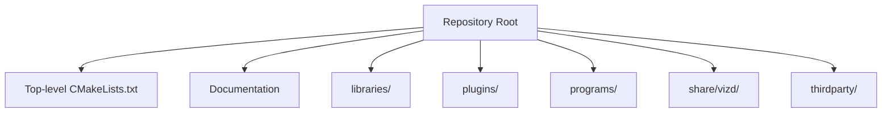
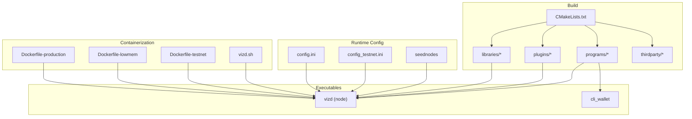
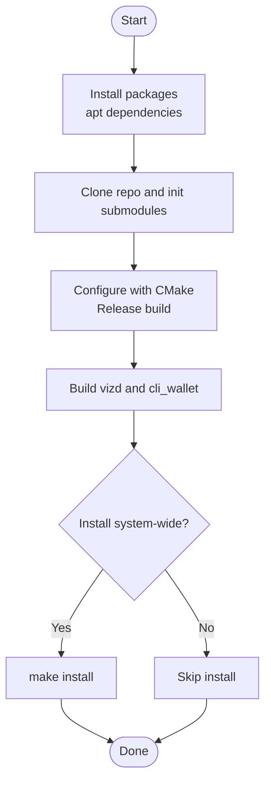
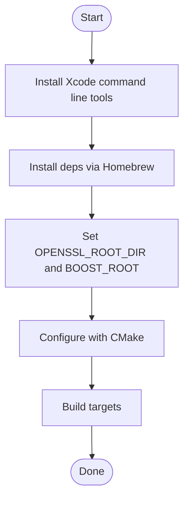
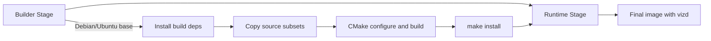
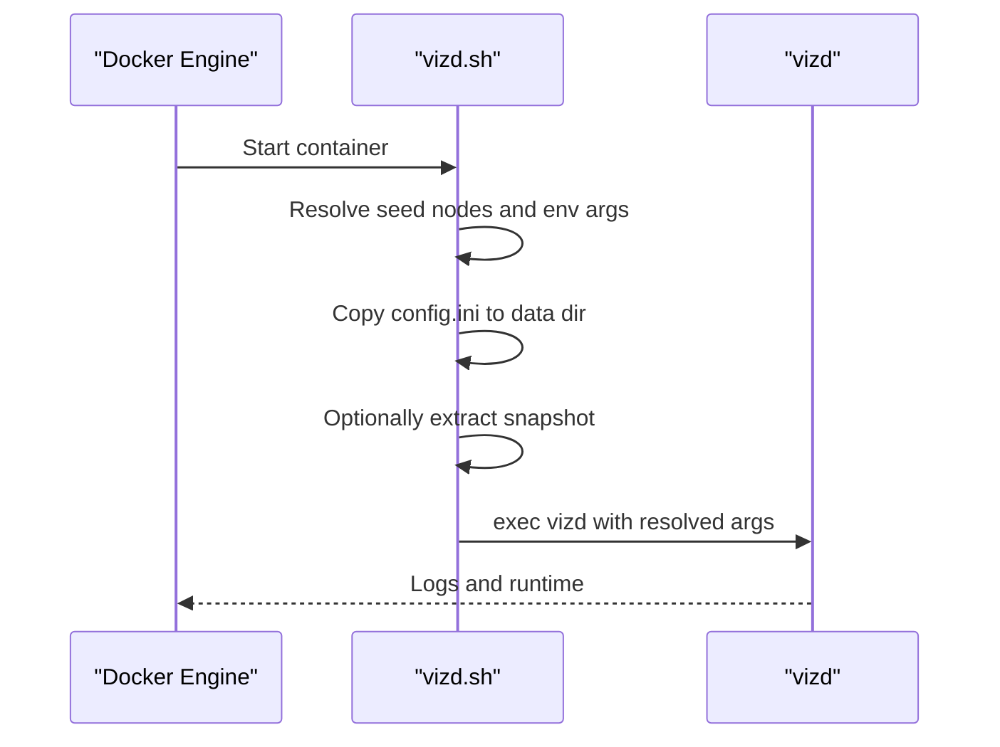
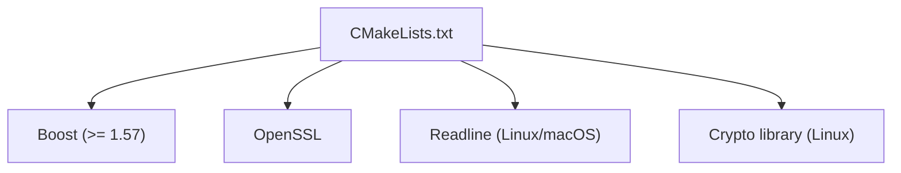

# Installation and Setup

<cite>
**Referenced Files in This Document**
- [README.md](file://README.md)
- [documentation/building.md](file://documentation/building.md)
- [CMakeLists.txt](file://CMakeLists.txt)
- [share/vizd/docker/Dockerfile-production](file://share/vizd/docker/Dockerfile-production)
- [share/vizd/docker/Dockerfile-lowmem](file://share/vizd/docker/Dockerfile-lowmem)
- [share/vizd/docker/Dockerfile-testnet](file://share/vizd/docker/Dockerfile-testnet)
- [share/vizd/vizd.sh](file://share/vizd/vizd.sh)
- [share/vizd/config/config.ini](file://share/vizd/config/config.ini)
- [share/vizd/config/config_testnet.ini](file://share/vizd/config/config_testnet.ini)
- [.travis.yml](file://.travis.yml)
- [documentation/testing.md](file://documentation/testing.md)
- [documentation/testnet.md](file://documentation/testnet.md)
</cite>

## Table of Contents
1. [Introduction](#introduction)
2. [Project Structure](#project-structure)
3. [Core Components](#core-components)
4. [Architecture Overview](#architecture-overview)
5. [Detailed Component Analysis](#detailed-component-analysis)
6. [Dependency Analysis](#dependency-analysis)
7. [Performance Considerations](#performance-considerations)
8. [Troubleshooting Guide](#troubleshooting-guide)
9. [Conclusion](#conclusion)
10. [Appendices](#appendices)

## Introduction
This document provides comprehensive installation and setup guidance for the VIZ CPP Node. It covers system requirements, platform-specific build instructions using CMake, dependency management, cross-compilation considerations, Docker containerization for production and development, verification procedures, and troubleshooting tips. The goal is to enable reliable installation and operation across Linux, macOS, and Windows environments, while also supporting containerized deployments.

## Project Structure
At a high level, the repository is organized into:
- Top-level build configuration and CI scripts
- Libraries implementing blockchain logic, networking, and utilities
- Plugins extending functionality
- Programs (executables) such as the node and CLI wallet
- Documentation and Docker configurations for deployment

**Section sources**
- [CMakeLists.txt](file://CMakeLists.txt#L1-L277)
- [README.md](file://README.md#L1-L53)

## Core Components
- Build system: CMake with configurable options for build type, memory profile, and plugin selection
- Executables: vizd (node), cli_wallet (command-line wallet)
- Plugins: modular extensions for APIs and services
- Docker images: prebuilt and multi-stage Dockerfiles for production, low-memory, testnet, and MongoDB variants
- Configuration templates: config.ini and config_testnet.ini for runtime behavior

Key build options and flags are defined in the top-level CMake configuration and documented in the building guide.

**Section sources**
- [CMakeLists.txt](file://CMakeLists.txt#L3-L104)
- [documentation/building.md](file://documentation/building.md#L3-L16)

## Architecture Overview
The build and runtime architecture integrates CMake-driven compilation of libraries and plugins into node and wallet executables, with Docker encapsulating dependencies and runtime configuration.

**Diagram sources**
- [CMakeLists.txt](file://CMakeLists.txt#L210-L213)
- [share/vizd/docker/Dockerfile-production](file://share/vizd/docker/Dockerfile-production#L1-L88)
- [share/vizd/docker/Dockerfile-lowmem](file://share/vizd/docker/Dockerfile-lowmem#L1-L82)
- [share/vizd/docker/Dockerfile-testnet](file://share/vizd/docker/Dockerfile-testnet#L1-L88)
- [share/vizd/vizd.sh](file://share/vizd/vizd.sh#L1-L82)
- [share/vizd/config/config.ini](file://share/vizd/config/config.ini#L1-L130)
- [share/vizd/config/config_testnet.ini](file://share/vizd/config/config_testnet.ini#L1-L132)

## Detailed Component Analysis

### System Requirements and Dependencies
- Compiler requirements:
  - GCC minimum version and Clang minimum version are enforced by the build system
- Operating systems:
  - Official guidance supports Linux and macOS; Windows build instructions are not provided in the repository
- Core dependencies:
  - Boost (minimum version requirement explicitly stated)
  - OpenSSL
  - CMake, compiler toolchain, and standard Unix utilities
- Optional dependencies:
  - Tools for documentation and development experience

Platform-specific package lists and notes are provided in the building guide.

**Section sources**
- [CMakeLists.txt](file://CMakeLists.txt#L12-L20)
- [CMakeLists.txt](file://CMakeLists.txt#L97-L104)
- [documentation/building.md](file://documentation/building.md#L25-L75)
- [documentation/building.md](file://documentation/building.md#L76-L137)
- [documentation/building.md](file://documentation/building.md#L138-L201)

### Platform-Specific Installation Procedures

#### Linux (Ubuntu LTS)
- Install required and optional packages via the package manager
- Clone the repository and initialize submodules
- Configure with CMake and build node and wallet targets
- Optional: install to system prefix

**Diagram sources**
- [documentation/building.md](file://documentation/building.md#L25-L75)

**Section sources**
- [documentation/building.md](file://documentation/building.md#L25-L75)

#### macOS
- Install Xcode command line tools and accept license
- Use Homebrew to install dependencies including a compatible Boost version
- Export OpenSSL and Boost prefixes for CMake discovery
- Configure and build

**Diagram sources**
- [documentation/building.md](file://documentation/building.md#L138-L189)

**Section sources**
- [documentation/building.md](file://documentation/building.md#L138-L189)

#### Windows
- No official build instructions are provided in the repository
- The build system includes Windows-specific logic, indicating potential support with appropriate toolchains and environment setup

**Section sources**
- [documentation/building.md](file://documentation/building.md#L202-L212)
- [CMakeLists.txt](file://CMakeLists.txt#L91-L157)

### CMake Build Options and Flags
Key options exposed by the build system:
- Build type: Release or Debug
- Low memory node: consensus-only mode
- Testnet build: compile-time switch for testnet configuration
- Chainbase locking checks: optional debug/validation
- MongoDB plugin: optional inclusion
- Shared/static libraries: choice of linkage

These options influence compilation flags and conditional compilation macros.

**Section sources**
- [CMakeLists.txt](file://CMakeLists.txt#L56-L89)
- [CMakeLists.txt](file://CMakeLists.txt#L264-L274)

### Cross-Compilation Considerations
- The repository does not include explicit cross-compilation instructions
- For cross-platform builds, ensure the target toolchain and SDKs are configured appropriately
- Respect compiler and dependency version constraints documented in the build system

**Section sources**
- [CMakeLists.txt](file://CMakeLists.txt#L12-L20)
- [CMakeLists.txt](file://CMakeLists.txt#L91-L157)

### Docker Containerization

#### Prebuilt Images
- Production image tag latest is available on Docker Hub
- Testnet image tag testnet is available on Docker Hub
- Example run commands and environment overrides are provided

**Section sources**
- [README.md](file://README.md#L12-L29)

#### Multi-Stage Dockerfiles
- Production: full-featured node with optimized runtime
- Low memory: consensus-only node for resource-constrained environments
- Testnet: preconfigured for local testnet with snapshot and default witness
- Each Dockerfile:
  - Installs build dependencies
  - Copies minimal source subsets
  - Builds with CMake and installs
  - Produces a runtime image with non-root user and volumes for persistent data

**Diagram sources**
- [share/vizd/docker/Dockerfile-production](file://share/vizd/docker/Dockerfile-production#L1-L88)
- [share/vizd/docker/Dockerfile-lowmem](file://share/vizd/docker/Dockerfile-lowmem#L1-L82)
- [share/vizd/docker/Dockerfile-testnet](file://share/vizd/docker/Dockerfile-testnet#L1-L88)

**Section sources**
- [share/vizd/docker/Dockerfile-production](file://share/vizd/docker/Dockerfile-production#L1-L88)
- [share/vizd/docker/Dockerfile-lowmem](file://share/vizd/docker/Dockerfile-lowmem#L1-L82)
- [share/vizd/docker/Dockerfile-testnet](file://share/vizd/docker/Dockerfile-testnet#L1-L88)

#### Container Entrypoint and Environment
- The container entrypoint script sets up seed nodes, optional witness configuration, copies configuration, initializes blockchain cache if present, and launches the node with environment-provided endpoints and arguments.

**Diagram sources**
- [share/vizd/vizd.sh](file://share/vizd/vizd.sh#L1-L82)

**Section sources**
- [share/vizd/vizd.sh](file://share/vizd/vizd.sh#L1-L82)

#### Manual Docker Builds
- CI matrix defines multiple Dockerfiles and tags for automated builds and pushes
- Local builds can mirror the CI stages

**Section sources**
- [.travis.yml](file://.travis.yml#L12-L42)

### Configuration Management
- Production configuration template defines P2P endpoints, RPC endpoints, threading, shared memory sizing, plugin list, and logging
- Testnet configuration template adds witness-related settings and enables stale production for local testing

**Section sources**
- [share/vizd/config/config.ini](file://share/vizd/config/config.ini#L1-L130)
- [share/vizd/config/config_testnet.ini](file://share/vizd/config/config_testnet.ini#L1-L132)

## Dependency Analysis
The build system declares and locates required libraries and sets compiler/linker flags per platform. The Dockerfiles enumerate runtime dependencies.

**Diagram sources**
- [CMakeLists.txt](file://CMakeLists.txt#L97-L104)
- [CMakeLists.txt](file://CMakeLists.txt#L160-L184)

**Section sources**
- [CMakeLists.txt](file://CMakeLists.txt#L97-L104)
- [CMakeLists.txt](file://CMakeLists.txt#L160-L184)
- [share/vizd/docker/Dockerfile-production](file://share/vizd/docker/Dockerfile-production#L9-L30)

## Performance Considerations
- Build type: Use Release for production to enable optimizations
- Low memory node: Recommended for consensus roles to reduce memory footprint
- Plugin selection: Disable unused plugins to minimize overhead
- Shared memory sizing: Adjust shared file size and increments according to expected load
- Threading: Tune RPC thread pool and consider single-write-thread for reduced contention

**Section sources**
- [documentation/building.md](file://documentation/building.md#L3-L16)
- [share/vizd/config/config.ini](file://share/vizd/config/config.ini#L49-L67)
- [share/vizd/config/config.ini](file://share/vizd/config/config.ini#L13-L14)

## Troubleshooting Guide
Common issues and remedies:
- Boost version mismatch:
  - Ensure Boost meets the minimum version requirement; on older distributions, manual installation of a compatible version may be necessary
- OpenSSL discovery failures:
  - On macOS, export the OpenSSL prefix for CMake to locate headers and libraries
- Missing readline on Linux/macOS:
  - Install readline development packages if linking fails
- Windows build:
  - No official instructions exist; consult Windows-specific CMake and toolchain setup if attempting unsupported builds
- Docker runtime:
  - Verify exposed ports and mounted volumes
  - Override seed nodes via environment variable
  - Confirm configuration file is copied into the data directory

Verification steps:
- Build artifacts:
  - Confirm successful generation of vizd and cli_wallet
- Docker:
  - Tail container logs to observe startup and synchronization progress
  - Connect to RPC endpoints and query node status
- Testnet:
  - Use provided testnet image and configuration for quick local validation

**Section sources**
- [documentation/building.md](file://documentation/building.md#L103-L112)
- [documentation/building.md](file://documentation/building.md#L176-L184)
- [share/vizd/vizd.sh](file://share/vizd/vizd.sh#L62-L72)
- [README.md](file://README.md#L21-L29)
- [documentation/testnet.md](file://documentation/testnet.md#L21-L37)

## Conclusion
With the provided instructions, you can build and run the VIZ CPP Node on Linux and macOS, and optionally use Docker for streamlined deployment. Ensure dependencies meet the minimum requirements, select appropriate build options for your role (full node vs. low-memory), and leverage Docker for repeatable production and development setups. Use the verification procedures to confirm successful installation and basic functionality.

## Appendices

### A. Build Targets Reference
- vizd: primary node executable
- cli_wallet: command-line wallet
- chain_test: unit test suite

**Section sources**
- [documentation/building.md](file://documentation/building.md#L190-L200)
- [documentation/testing.md](file://documentation/testing.md#L1-L43)

### B. Testnet Quickstart
- Use the provided Dockerfile-testnet to build and run a local testnet node
- Predefined users and keys are available for immediate testing

**Section sources**
- [documentation/testnet.md](file://documentation/testnet.md#L21-L54)