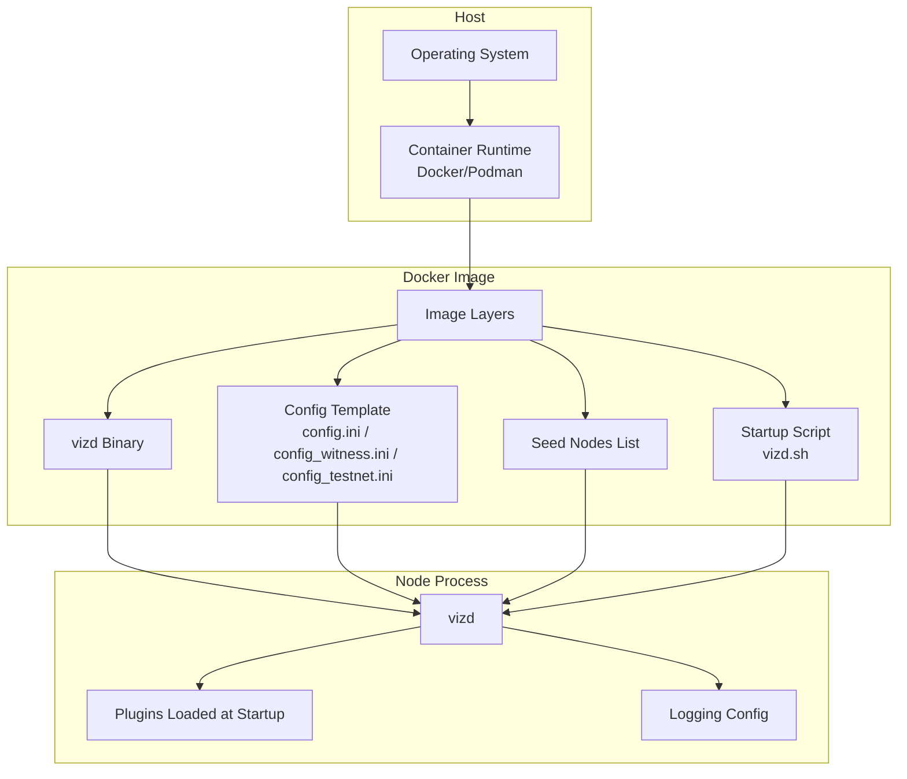
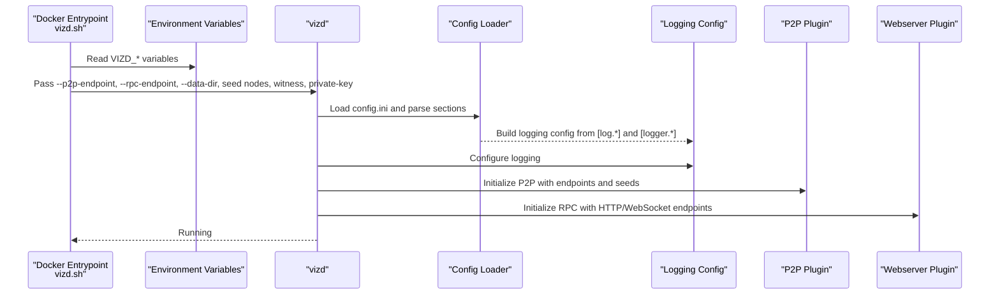
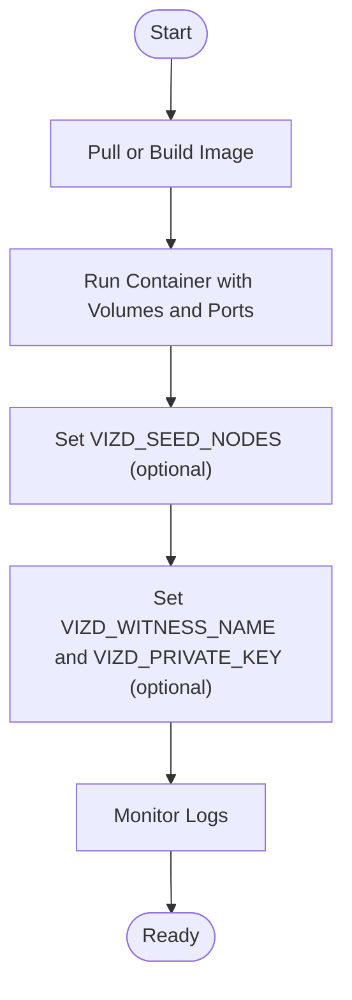
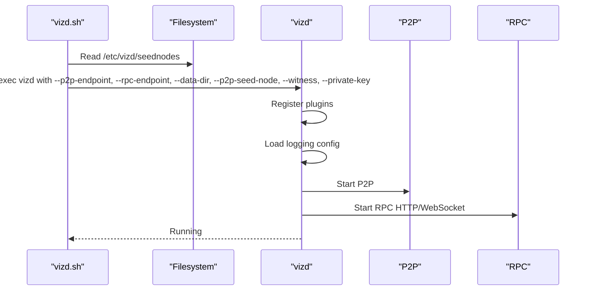
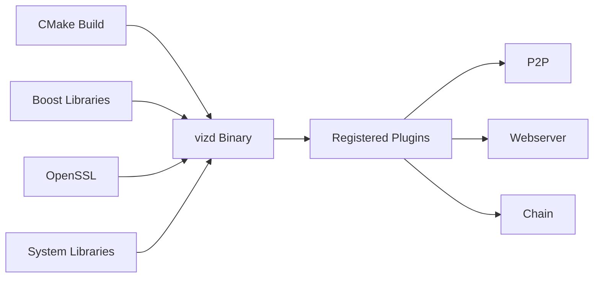

# Node Deployment

<cite>
**Referenced Files in This Document**
- [README.md](file://README.md)
- [documentation/building.md](file://documentation/building.md)
- [documentation/testnet.md](file://documentation/testnet.md)
- [documentation/debug_node_plugin.md](file://documentation/debug_node_plugin.md)
- [programs/vizd/main.cpp](file://programs/vizd/main.cpp)
- [share/vizd/config/config.ini](file://share/vizd/config/config.ini)
- [share/vizd/config/config_witness.ini](file://share/vizd/config/config_witness.ini)
- [share/vizd/config/config_testnet.ini](file://share/vizd/config/config_testnet.ini)
- [share/vizd/vizd.sh](file://share/vizd/vizd.sh)
- [share/vizd/docker/Dockerfile-production](file://share/vizd/docker/Dockerfile-production)
- [share/vizd/docker/Dockerfile-testnet](file://share/vizd/docker/Dockerfile-testnet)
- [share/vizd/docker/Dockerfile-lowmem](file://share/vizd/docker/Dockerfile-lowmem)
- [share/vizd/seednodes](file://share/vizd/seednodes)
</cite>

## Table of Contents
1. [Introduction](#introduction)
2. [Project Structure](#project-structure)
3. [Core Components](#core-components)
4. [Architecture Overview](#architecture-overview)
5. [Detailed Component Analysis](#detailed-component-analysis)
6. [Dependency Analysis](#dependency-analysis)
7. [Performance Considerations](#performance-considerations)
8. [Security Hardening](#security-hardening)
9. [Troubleshooting Guide](#troubleshooting-guide)
10. [Conclusion](#conclusion)
11. [Appendices](#appendices)

## Introduction
This document provides comprehensive deployment guidance for VIZ CPP Node across production, testnet, and specialized configurations. It covers hardware and system prerequisites, installation procedures for multiple operating systems, Docker-based deployments, node types (full, witness, seed), configuration management, service integration, performance tuning, capacity planning, security hardening, and troubleshooting.

## Project Structure
At a high level, the repository provides:
- A production-ready node binary (vizd) with extensive plugin support
- Multiple configuration templates for different node roles and networks
- Docker images for production, testnet, and low-memory deployments
- Scripts to bootstrap and run the node with seed nodes and optional snapshot replay

**Diagram sources**
- [share/vizd/docker/Dockerfile-production](file://share/vizd/docker/Dockerfile-production#L66-L88)
- [share/vizd/docker/Dockerfile-testnet](file://share/vizd/docker/Dockerfile-testnet#L67-L88)
- [share/vizd/docker/Dockerfile-lowmem](file://share/vizd/docker/Dockerfile-lowmem#L60-L82)
- [programs/vizd/main.cpp](file://programs/vizd/main.cpp#L106-L158)
- [share/vizd/vizd.sh](file://share/vizd/vizd.sh#L1-L82)

**Section sources**
- [README.md](file://README.md#L1-L53)
- [documentation/building.md](file://documentation/building.md#L1-L212)
- [share/vizd/docker/Dockerfile-production](file://share/vizd/docker/Dockerfile-production#L1-L88)
- [share/vizd/docker/Dockerfile-testnet](file://share/vizd/docker/Dockerfile-testnet#L1-L88)
- [share/vizd/docker/Dockerfile-lowmem](file://share/vizd/docker/Dockerfile-lowmem#L1-L82)

## Core Components
- Node binary: vizd, which initializes plugins and starts the P2P and RPC services
- Configuration: INI-style configuration files for endpoints, plugins, logging, and runtime behavior
- Docker images: production, testnet, and low-memory variants with preconfigured volumes and ports
- Bootstrap script: sets up seed nodes, optional snapshot replay, and passes environment overrides to vizd

Key behaviors:
- Plugin registration and initialization occur at startup
- Logging configuration is parsed from the config file sections
- Docker entrypoint supports environment-driven customization (RPC, P2P, witness identity, private key)

**Section sources**
- [programs/vizd/main.cpp](file://programs/vizd/main.cpp#L62-L91)
- [programs/vizd/main.cpp](file://programs/vizd/main.cpp#L117-L140)
- [programs/vizd/main.cpp](file://programs/vizd/main.cpp#L167-L191)
- [programs/vizd/main.cpp](file://programs/vizd/main.cpp#L194-L289)
- [share/vizd/vizd.sh](file://share/vizd/vizd.sh#L1-L82)

## Architecture Overview
The node startup flow integrates CLI arguments, configuration files, and environment variables to initialize plugins and services.

**Diagram sources**
- [share/vizd/vizd.sh](file://share/vizd/vizd.sh#L13-L81)
- [programs/vizd/main.cpp](file://programs/vizd/main.cpp#L117-L140)
- [programs/vizd/main.cpp](file://programs/vizd/main.cpp#L167-L191)
- [programs/vizd/main.cpp](file://programs/vizd/main.cpp#L194-L289)

## Detailed Component Analysis

### Node Types and Roles
- Full node: Participates in P2P gossip, serves RPC APIs, optionally tracks history and feeds
- Witness node: Produces blocks; requires a configured witness name and private key
- Seed node: Minimal footprint, connects peers and advertises connectivity; recommended low-memory build

Configuration templates:
- Production template: [config.ini](file://share/vizd/config/config.ini#L1-L130)
- Witness template: [config_witness.ini](file://share/vizd/config/config_witness.ini#L1-L107)
- Testnet template: [config_testnet.ini](file://share/vizd/config/config_testnet.ini#L1-L132)

Operational differences:
- Witness nodes enable block production and require private keys
- Seed nodes typically bind RPC to localhost and disable verbose plugins
- Testnet enables special participation rules and snapshot-based initialization

**Section sources**
- [share/vizd/config/config.ini](file://share/vizd/config/config.ini#L1-L130)
- [share/vizd/config/config_witness.ini](file://share/vizd/config/config_witness.ini#L1-L107)
- [share/vizd/config/config_testnet.ini](file://share/vizd/config/config_testnet.ini#L1-L132)
- [documentation/testnet.md](file://documentation/testnet.md#L1-L54)

### Configuration Management
- Endpoints: P2P, HTTP RPC, WebSocket RPC
- Locking and threading: Read/write wait limits and single-write-thread behavior
- Shared memory sizing: Initial size, minimum free space, increment step, and periodic checks
- Plugins: Enabled via plugin directives; witness and API plugins commonly enabled
- Logging: Console and file appenders, logger levels, and appender routing

Environment overrides:
- Docker entrypoint supports VIZD_RPC_ENDPOINT, VIZD_P2P_ENDPOINT, VIZD_SEED_NODES, VIZD_WITNESS_NAME, VIZD_PRIVATE_KEY, and VIZD_EXTRA_OPTS

**Section sources**
- [share/vizd/config/config.ini](file://share/vizd/config/config.ini#L1-L130)
- [share/vizd/vizd.sh](file://share/vizd/vizd.sh#L13-L81)
- [programs/vizd/main.cpp](file://programs/vizd/main.cpp#L167-L191)
- [programs/vizd/main.cpp](file://programs/vizd/main.cpp#L194-L289)

### Service Integration
- Docker volumes:
  - /var/lib/vizd: persistent data directory (blockchain, logs, config)
  - /etc/vizd: read-only config and seednodes
- Exposed ports:
  - 2001: P2P
  - 8090: HTTP RPC
  - 8091: WebSocket RPC

Dockerfiles:
- Production: [Dockerfile-production](file://share/vizd/docker/Dockerfile-production#L66-L88)
- Testnet: [Dockerfile-testnet](file://share/vizd/docker/Dockerfile-testnet#L67-L88)
- Low-memory: [Dockerfile-lowmem](file://share/vizd/docker/Dockerfile-lowmem#L60-L82)

**Section sources**
- [share/vizd/docker/Dockerfile-production](file://share/vizd/docker/Dockerfile-production#L66-L88)
- [share/vizd/docker/Dockerfile-testnet](file://share/vizd/docker/Dockerfile-testnet#L67-L88)
- [share/vizd/docker/Dockerfile-lowmem](file://share/vizd/docker/Dockerfile-lowmem#L60-L82)

### Installation Procedures

#### Docker (Recommended for Production)
- Pull or build the production image and run with mapped volumes and exposed ports
- Optionally override seed nodes via environment variable

**Diagram sources**
- [README.md](file://README.md#L12-L29)
- [share/vizd/vizd.sh](file://share/vizd/vizd.sh#L17-L37)

**Section sources**
- [README.md](file://README.md#L12-L29)
- [share/vizd/docker/Dockerfile-production](file://share/vizd/docker/Dockerfile-production#L66-L88)

#### Ubuntu (Native Build)
- Install dependencies, clone repository, initialize submodules, configure with CMake, build, and optionally install

**Section sources**
- [documentation/building.md](file://documentation/building.md#L25-L75)

#### macOS (Native Build)
- Install dependencies via Homebrew, export OpenSSL and Boost paths, configure with CMake, and build

**Section sources**
- [documentation/building.md](file://documentation/building.md#L138-L189)

#### Low-Memory Builds
- Use the low-memory Dockerfile or build with LOW_MEMORY_NODE enabled to reduce memory footprint

**Section sources**
- [documentation/building.md](file://documentation/building.md#L11-L16)
- [share/vizd/docker/Dockerfile-lowmem](file://share/vizd/docker/Dockerfile-lowmem#L45-L51)

### Node Startup Process
- The entrypoint script prepares seed nodes, optionally replays a cached snapshot, and executes vizd with environment-derived arguments
- The binary registers plugins, loads logging configuration, and starts P2P and RPC services

**Diagram sources**
- [share/vizd/vizd.sh](file://share/vizd/vizd.sh#L11-L81)
- [programs/vizd/main.cpp](file://programs/vizd/main.cpp#L106-L158)

**Section sources**
- [share/vizd/vizd.sh](file://share/vizd/vizd.sh#L1-L82)
- [programs/vizd/main.cpp](file://programs/vizd/main.cpp#L106-L158)

### Testnet Deployment
- Use the testnet Dockerfile or image to spin up a local test network
- Snapshot-based initialization is supported for quick bootstrapping

**Section sources**
- [documentation/testnet.md](file://documentation/testnet.md#L21-L37)
- [share/vizd/docker/Dockerfile-testnet](file://share/vizd/docker/Dockerfile-testnet#L67-L88)

### Debugging and Simulation
- The debug_node plugin allows loading historical blocks and generating synthetic blocks for development and testing

**Section sources**
- [documentation/debug_node_plugin.md](file://documentation/debug_node_plugin.md#L50-L134)

## Dependency Analysis
- Build-time dependencies: CMake, compiler toolchain, Boost, OpenSSL, and related libraries
- Runtime dependencies: Shared libraries linked at build time; Docker images package all required runtime libraries
- Plugin ecosystem: Extensible via the appbase framework; plugins are registered at startup

**Diagram sources**
- [documentation/building.md](file://documentation/building.md#L30-L63)
- [programs/vizd/main.cpp](file://programs/vizd/main.cpp#L62-L91)

**Section sources**
- [documentation/building.md](file://documentation/building.md#L30-L63)
- [programs/vizd/main.cpp](file://programs/vizd/main.cpp#L62-L91)

## Performance Considerations
- Thread pool sizing: Tune webserver-thread-pool-size to match CPU cores minus one for optimal throughput
- Locking behavior: Single-write-thread reduces contention; adjust read-wait-micro and max-read-wait-retries to balance latency and reliability
- Shared memory: Configure shared-file-size, min-free-shared-file-size, and inc-shared-file-size to avoid frequent resizing during replay or growth
- Plugin selection: Disable unused plugins to reduce memory and CPU overhead
- Network: Limit inbound connections via p2p-max-connections and leverage seednodes for faster bootstrapping

**Section sources**
- [share/vizd/config/config.ini](file://share/vizd/config/config.ini#L13-L67)
- [share/vizd/config/config_witness.ini](file://share/vizd/config/config_witness.ini#L13-L66)
- [share/vizd/config/config_testnet.ini](file://share/vizd/config/config_testnet.ini#L13-L67)

## Security Hardening
- Bind RPC to localhost for witness nodes to prevent external exposure
- Use environment variables to inject secrets (private keys) and restrict filesystem access
- Restrict P2P exposure to trusted networks; consider firewall rules to allow only necessary ports
- Monitor logs and set appropriate logger levels to detect anomalies early

**Section sources**
- [share/vizd/config/config_witness.ini](file://share/vizd/config/config_witness.ini#L16-L20)
- [share/vizd/vizd.sh](file://share/vizd/vizd.sh#L62-L72)
- [programs/vizd/main.cpp](file://programs/vizd/main.cpp#L167-L191)

## Troubleshooting Guide
Common issues and resolutions:
- Startup failures due to missing configuration or invalid endpoints
  - Verify config.ini presence and correctness; ensure endpoints are reachable
- Insufficient shared memory during replay
  - Increase shared-file-size and min-free-shared-file-size
- Excessive lock wait timeouts
  - Adjust read-wait-micro and max-read-wait-retries; consider single-write-thread
- No peers or slow bootstrapping
  - Confirm p2p-seed-node entries; validate network accessibility on port 2001
- Witness node not producing blocks
  - Ensure witness name and private key are set; verify required-participation and enable-stale-production as appropriate
- Testnet initialization problems
  - Confirm snapshot availability and permissions; check testnet-specific configuration

**Section sources**
- [share/vizd/config/config.ini](file://share/vizd/config/config.ini#L1-L130)
- [share/vizd/config/config_witness.ini](file://share/vizd/config/config_witness.ini#L76-L86)
- [share/vizd/config/config_testnet.ini](file://share/vizd/config/config_testnet.ini#L99-L111)
- [share/vizd/vizd.sh](file://share/vizd/vizd.sh#L44-L53)
- [share/vizd/seednodes](file://share/vizd/seednodes#L1-L6)

## Conclusion
Deploying a VIZ CPP Node involves selecting the appropriate configuration template, preparing the environment (native or Docker), and integrating with monitoring and security controls. Use the provided Docker images for production, leverage witness and testnet configurations for specialized roles, and tune performance parameters according to workload profiles.

## Appendices

### Appendix A: Node Type Reference
- Full node: General-purpose node with comprehensive plugins
- Witness node: Block producer with configured witness and private key
- Seed node: Minimal footprint, focused on peer connectivity

**Section sources**
- [share/vizd/config/config.ini](file://share/vizd/config/config.ini#L69-L73)
- [share/vizd/config/config_witness.ini](file://share/vizd/config/config_witness.ini#L68-L86)
- [share/vizd/config/config_testnet.ini](file://share/vizd/config/config_testnet.ini#L69-L73)

### Appendix B: Environment Variables (Docker)
- VIZD_RPC_ENDPOINT: Override RPC endpoint
- VIZD_P2P_ENDPOINT: Override P2P endpoint
- VIZD_SEED_NODES: Comma-separated seed nodes
- VIZD_WITNESS_NAME: Witness name for block production
- VIZD_PRIVATE_KEY: Private key for witness signing
- VIZD_EXTRA_OPTS: Additional arguments to pass to vizd

**Section sources**
- [share/vizd/vizd.sh](file://share/vizd/vizd.sh#L17-L37)
- [share/vizd/vizd.sh](file://share/vizd/vizd.sh#L62-L81)