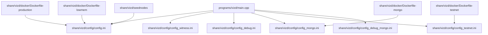
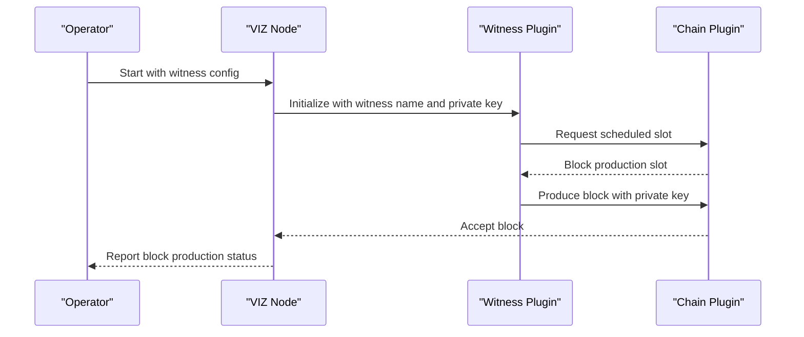
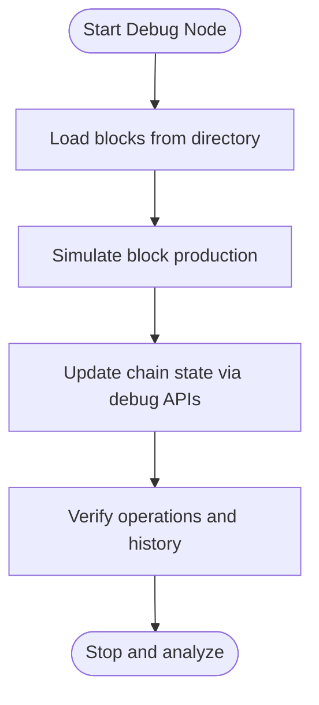
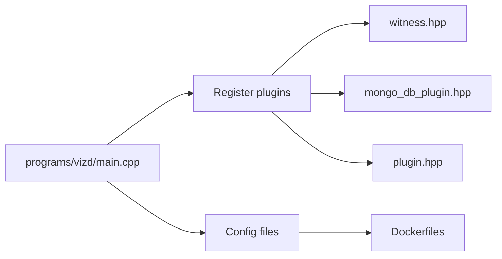

# Node Types and Configurations

<cite>
**Referenced Files in This Document**
- [main.cpp](file://programs/vizd/main.cpp)
- [config.ini](file://share/vizd/config/config.ini)
- [config_witness.ini](file://share/vizd/config/config_witness.ini)
- [config_debug.ini](file://share/vizd/config/config_debug.ini)
- [config_mongo.ini](file://share/vizd/config/config_mongo.ini)
- [config_testnet.ini](file://share/vizd/config/config_testnet.ini)
- [config_debug_mongo.ini](file://share/vizd/config/config_debug_mongo.ini)
- [Dockerfile-production](file://share/vizd/docker/Dockerfile-production)
- [Dockerfile-testnet](file://share/vizd/docker/Dockerfile-testnet)
- [Dockerfile-mongo](file://share/vizd/docker/Dockerfile-mongo)
- [Dockerfile-lowmem](file://share/vizd/docker/Dockerfile-lowmem)
- [seednodes](file://share/vizd/seednodes)
- [seednodes_empty](file://share/vizd/seednodes_empty)
- [testnet.md](file://documentation/testnet.md)
- [debug_node_plugin.md](file://documentation/debug_node_plugin.md)
- [witness.hpp](file://plugins/witness/include/graphene/plugins/witness/witness.hpp)
- [mongo_db_plugin.hpp](file://plugins/mongo_db/include/graphene/plugins/mongo_db/mongo_db_plugin.hpp)
- [plugin.hpp](file://plugins/debug_node/include/graphene/plugins/debug_node/plugin.hpp)
</cite>

## Table of Contents
1. [Introduction](#introduction)
2. [Project Structure](#project-structure)
3. [Core Components](#core-components)
4. [Architecture Overview](#architecture-overview)
5. [Detailed Component Analysis](#detailed-component-analysis)
6. [Dependency Analysis](#dependency-analysis)
7. [Performance Considerations](#performance-considerations)
8. [Troubleshooting Guide](#troubleshooting-guide)
9. [Conclusion](#conclusion)
10. [Appendices](#appendices)

## Introduction
This document explains the different VIZ node types and their specific configurations. It covers full node setup with blockchain synchronization and API exposure, witness node configuration for block production and key management, seed node configuration for network bootstrap, and specialized configurations for testnet, debug, and MongoDB-integrated nodes. It also provides configuration file templates, parameter explanations, operational differences, performance tuning, resource allocation recommendations, monitoring requirements, and a comparison matrix across node configurations.

## Project Structure
The repository organizes node configuration templates under share/vizd/config, Dockerfiles for different deployment modes under share/vizd/docker, and documentation under documentation. The main executable initializes plugins and loads configuration.

**Diagram sources**
- [main.cpp](file://programs/vizd/main.cpp#L106-L158)
- [config.ini](file://share/vizd/config/config.ini#L1-L130)
- [config_witness.ini](file://share/vizd/config/config_witness.ini#L1-L107)
- [config_debug.ini](file://share/vizd/config/config_debug.ini#L1-L126)
- [config_mongo.ini](file://share/vizd/config/config_mongo.ini#L1-L135)
- [config_testnet.ini](file://share/vizd/config/config_testnet.ini#L1-L132)
- [config_debug_mongo.ini](file://share/vizd/config/config_debug_mongo.ini#L1-L135)
- [Dockerfile-production](file://share/vizd/docker/Dockerfile-production#L74-L87)
- [Dockerfile-testnet](file://share/vizd/docker/Dockerfile-testnet#L75-L87)
- [Dockerfile-mongo](file://share/vizd/docker/Dockerfile-mongo#L97-L110)
- [Dockerfile-lowmem](file://share/vizd/docker/Dockerfile-lowmem#L68-L81)
- [seednodes](file://share/vizd/seednodes#L1-L6)

**Section sources**
- [main.cpp](file://programs/vizd/main.cpp#L106-L158)
- [config.ini](file://share/vizd/config/config.ini#L1-L130)
- [Dockerfile-production](file://share/vizd/docker/Dockerfile-production#L74-L87)
- [Dockerfile-testnet](file://share/vizd/docker/Dockerfile-testnet#L75-L87)
- [Dockerfile-mongo](file://share/vizd/docker/Dockerfile-mongo#L97-L110)
- [Dockerfile-lowmem](file://share/vizd/docker/Dockerfile-lowmem#L68-L81)
- [seednodes](file://share/vizd/seednodes#L1-L6)

## Core Components
- Full node: default configuration with broad plugin set for general-purpose operation and API exposure.
- Witness node: enables block production with witness and witness_api plugins, requires witness name and private key.
- Debug node: specialized configuration for simulation and experimentation with debug_node plugin.
- Testnet node: minimal configuration optimized for testnet operation with enabled stale production.
- MongoDB-integrated node: includes mongo_db plugin for external database indexing and analytics.
- Seed node: bootstrap configuration with predefined seed peers for network discovery.

Key configuration parameters:
- P2P endpoint and seed nodes for connectivity.
- Webserver endpoints for HTTP and WebSocket APIs.
- Plugin selection for functional capabilities.
- Shared memory sizing and growth thresholds for database performance.
- Lock wait timeouts and retries for RPC concurrency.
- Witness participation and block production controls.
- Logging configuration via appenders and loggers.

**Section sources**
- [config.ini](file://share/vizd/config/config.ini#L1-L130)
- [config_witness.ini](file://share/vizd/config/config_witness.ini#L68-L107)
- [config_debug.ini](file://share/vizd/config/config_debug.ini#L69-L126)
- [config_mongo.ini](file://share/vizd/config/config_mongo.ini#L69-L135)
- [config_testnet.ini](file://share/vizd/config/config_testnet.ini#L69-L132)
- [config_debug_mongo.ini](file://share/vizd/config/config_debug_mongo.ini#L69-L135)

## Architecture Overview
The VIZ node is a modular application built on appbase with a plugin architecture. The main program registers and initializes plugins, loads configuration, and starts the server loop. Different node types are achieved by selecting different plugins and configuration files.

```mermaid
graph TB
subgraph "Executable"
MAIN["programs/vizd/main.cpp<br/>Registers plugins and starts app"]
end
subgraph "Plugins"
CHAIN["chain"]
P2P["p2p"]
WEBSERVER["webserver"]
NB["network_broadcast_api"]
DBAPI["database_api"]
ACC_HIST["account_history"]
OP_HIST["operation_history"]
WIT["witness"]
WIT_API["witness_api"]
DEBUG["debug_node"]
MONGO["mongo_db"]
TESTAPI["test_api"]
TAGS["tags"]
FOLLOW["follow"]
SOCIAL["social_network"]
PRIVATE_MSG["private_message"]
COMMITTEE["committee_api"]
INVITE["invite_api"]
PAID_SUB["paid_subscription_api"]
CUSTOM["custom_protocol_api"]
end
MAIN --> CHAIN
MAIN --> P2P
MAIN --> WEBSERVER
MAIN --> NB
MAIN --> DBAPI
MAIN --> ACC_HIST
MAIN --> OP_HIST
MAIN --> WIT
MAIN --> WIT_API
MAIN --> DEBUG
MAIN --> MONGO
MAIN --> TESTAPI
MAIN --> TAGS
MAIN --> FOLLOW
MAIN --> SOCIAL
MAIN --> PRIVATE_MSG
MAIN --> COMMITTEE
MAIN --> INVITE
MAIN --> PAID_SUB
MAIN --> CUSTOM
```

**Diagram sources**
- [main.cpp](file://programs/vizd/main.cpp#L62-L91)
- [witness.hpp](file://plugins/witness/include/graphene/plugins/witness/witness.hpp#L34-L65)
- [mongo_db_plugin.hpp](file://plugins/mongo_db/include/graphene/plugins/mongo_db/mongo_db_plugin.hpp#L14-L47)
- [plugin.hpp](file://plugins/debug_node/include/graphene/plugins/debug_node/plugin.hpp#L38-L108)

**Section sources**
- [main.cpp](file://programs/vizd/main.cpp#L62-L91)
- [witness.hpp](file://plugins/witness/include/graphene/plugins/witness/witness.hpp#L34-L65)
- [mongo_db_plugin.hpp](file://plugins/mongo_db/include/graphene/plugins/mongo_db/mongo_db_plugin.hpp#L14-L47)
- [plugin.hpp](file://plugins/debug_node/include/graphene/plugins/debug_node/plugin.hpp#L38-L108)

## Detailed Component Analysis

### Full Node Configuration
- Purpose: General-purpose node with comprehensive API coverage and history tracking.
- Key parameters:
  - P2P endpoint and optional seed nodes for connectivity.
  - HTTP and WebSocket webserver endpoints for API access.
  - Broad plugin set including chain, p2p, json_rpc, webserver, network_broadcast_api, database_api, account_history, operation_history, committee_api, invite_api, paid_subscription_api, custom_protocol_api, account_by_key, block_info, raw_block.
  - Shared memory sizing and growth thresholds to manage database capacity.
  - Lock wait and retry settings for RPC client concurrency.
  - Optional virtual operations skipping and vote clearing to optimize performance.
- Operational differences:
  - Exposes APIs publicly by default.
  - Tracks extensive operation history.
  - Suitable for production and public API services.

**Section sources**
- [config.ini](file://share/vizd/config/config.ini#L1-L130)

### Witness Node Configuration
- Purpose: Block production node with witness and witness_api plugins.
- Key parameters:
  - P2P endpoint and seed nodes.
  - Local webserver endpoints for internal access.
  - Plugins: chain, p2p, json_rpc, webserver, network_broadcast_api, database_api, witness, witness_api.
  - Witness participation and stale production controls.
  - Required witness name and private key for block signing.
  - Optimized logging configuration.
- Operational differences:
  - Requires valid witness credentials.
  - Can operate with stricter network isolation (local webserver endpoints).
  - Enables witness-specific APIs.

**Diagram sources**
- [config_witness.ini](file://share/vizd/config/config_witness.ini#L82-L86)
- [witness.hpp](file://plugins/witness/include/graphene/plugins/witness/witness.hpp#L20-L32)

**Section sources**
- [config_witness.ini](file://share/vizd/config/config_witness.ini#L68-L107)
- [witness.hpp](file://plugins/witness/include/graphene/plugins/witness/witness.hpp#L34-L65)

### Debug Node Configuration
- Purpose: Simulation and experimentation with debug_node plugin for “what-if” scenarios.
- Key parameters:
  - Minimal plugin set including chain, p2p, json_rpc, webserver, network_broadcast_api, database_api, debug_node, test_api, and others for deep inspection.
  - Shared memory tuned for smaller footprint during development.
  - Stale production enabled for accelerated simulation.
  - Local webserver endpoints for secure access.
- Operational differences:
  - Designed for local-only access.
  - Provides APIs to push blocks, generate blocks, and update objects for simulation.
  - Useful for hardfork testing and state experimentation.

**Diagram sources**
- [config_debug.ini](file://share/vizd/config/config_debug.ini#L69-L126)
- [plugin.hpp](file://plugins/debug_node/include/graphene/plugins/debug_node/plugin.hpp#L62-L90)

**Section sources**
- [config_debug.ini](file://share/vizd/config/config_debug.ini#L69-L126)
- [debug_node_plugin.md](file://documentation/debug_node_plugin.md#L50-L134)
- [plugin.hpp](file://plugins/debug_node/include/graphene/plugins/debug_node/plugin.hpp#L38-L108)

### Testnet Node Configuration
- Purpose: Lightweight testnet node with stale production enabled for rapid iteration.
- Key parameters:
  - P2P endpoint and seed nodes.
  - HTTP and WebSocket endpoints.
  - Minimal plugin set focused on chain, p2p, json_rpc, webserver, network_broadcast_api, database_api, witness, witness_api.
  - Stale production enabled and witness participation set to minimal.
  - Predefined testnet witness and private key.
- Operational differences:
  - Optimized for testnet with snapshot support.
  - Simplified plugin set reduces overhead.
  - Suitable for CI and automated testing.

**Section sources**
- [config_testnet.ini](file://share/vizd/config/config_testnet.ini#L69-L132)
- [testnet.md](file://documentation/testnet.md#L21-L37)

### MongoDB-Integrated Node Configuration
- Purpose: Node with mongo_db plugin for external analytics and off-chain indexing.
- Key parameters:
  - P2P endpoint and seed nodes.
  - HTTP and WebSocket endpoints.
  - Plugin set including mongo_db alongside standard plugins.
  - MongoDB connection URI for external database.
  - Market history bucket sizes and retention.
- Operational differences:
  - Requires MongoDB instance and drivers.
  - Adds significant I/O overhead; monitor storage and network.
  - Enables advanced analytics and historical reporting.

**Section sources**
- [config_mongo.ini](file://share/vizd/config/config_mongo.ini#L69-L135)

### Seed Node Configuration
- Purpose: Bootstrap and peer discovery for network formation.
- Key parameters:
  - P2P endpoint bound to standard port.
  - No seed nodes configured to avoid automatic peer connections.
  - Minimal plugin set to reduce resource usage.
- Operational differences:
  - Does not synchronize the chain automatically.
  - Serves as a discovery anchor for other nodes.
  - Useful for private networks or isolated environments.

**Section sources**
- [seednodes_empty](file://share/vizd/seednodes_empty#L1-L1)
- [seednodes](file://share/vizd/seednodes#L1-L6)

## Dependency Analysis
The main executable registers and initializes plugins. Witness and MongoDB plugins depend on the chain plugin. The debug node plugin depends on the chain plugin for state manipulation. Dockerfiles embed configuration templates and expose ports for RPC and P2P.

**Diagram sources**
- [main.cpp](file://programs/vizd/main.cpp#L62-L91)
- [witness.hpp](file://plugins/witness/include/graphene/plugins/witness/witness.hpp#L34-L65)
- [mongo_db_plugin.hpp](file://plugins/mongo_db/include/graphene/plugins/mongo_db/mongo_db_plugin.hpp#L14-L47)
- [plugin.hpp](file://plugins/debug_node/include/graphene/plugins/debug_node/plugin.hpp#L38-L108)

**Section sources**
- [main.cpp](file://programs/vizd/main.cpp#L62-L91)
- [witness.hpp](file://plugins/witness/include/graphene/plugins/witness/witness.hpp#L34-L65)
- [mongo_db_plugin.hpp](file://plugins/mongo_db/include/graphene/plugins/mongo_db/mongo_db_plugin.hpp#L14-L47)
- [plugin.hpp](file://plugins/debug_node/include/graphene/plugins/debug_node/plugin.hpp#L38-L108)

## Performance Considerations
- Shared memory sizing:
  - Increase shared-file-size and adjust min-free-shared-file-size and inc-shared-file-size to accommodate larger histories and reduce resizing pressure.
  - Monitor free space checks via block-num-check-free-size to balance safety and performance.
- Concurrency and locks:
  - single-write-thread reduces contention on database writes.
  - Tune read-wait-micro and max-read-wait-retries, write-wait-micro and max-write-wait-retries to match workload patterns.
- Plugin selection:
  - Disable unused plugins to reduce memory and CPU overhead.
  - Skip virtual operations and clear old votes to improve performance on full nodes.
- Witness node specifics:
  - Keep participation thresholds low for testnet; raise for production.
  - Ensure private key availability and secure storage.
- Debug node specifics:
  - Use local-only endpoints and smaller shared memory for development.
  - Enable stale production for fast simulation.
- MongoDB node specifics:
  - Provision adequate disk IOPS and network bandwidth for MongoDB.
  - Monitor write amplification and index maintenance costs.
- Resource allocation recommendations:
  - Full node: moderate CPU, substantial RAM for shared memory, fast SSD for block log and database.
  - Witness node: dedicated CPU cores, reliable network, secure key management.
  - Debug node: modest resources, local SSD, restricted network access.
  - Testnet node: minimal resources, ephemeral data.
  - MongoDB node: high IOPS storage, separate MongoDB cluster, network isolation.

[No sources needed since this section provides general guidance]

## Troubleshooting Guide
- RPC lock errors:
  - Adjust read-wait-micro/read-wait-retries and write-wait-micro/write-wait-retries.
  - Consider enabling single-write-thread to reduce lock contention.
- Insufficient shared memory:
  - Increase shared-file-size and tune min-free-shared-file-size and inc-shared-file-size.
  - Monitor block-num-check-free-size frequency.
- Witness production issues:
  - Verify witness name and private key.
  - Check participation thresholds and network synchronization.
- Debug node anomalies:
  - Confirm local-only endpoints and secure access.
  - Validate block pushing and generation commands.
- MongoDB integration:
  - Verify mongodb-uri and connectivity.
  - Monitor MongoDB performance and replica set health.

**Section sources**
- [config.ini](file://share/vizd/config/config.ini#L22-L67)
- [config_witness.ini](file://share/vizd/config/config_witness.ini#L76-L86)
- [config_debug.ini](file://share/vizd/config/config_debug.ini#L95-L105)
- [config_mongo.ini](file://share/vizd/config/config_mongo.ini#L71-L72)

## Conclusion
Different VIZ node types serve distinct operational needs. Full nodes provide broad API coverage, witness nodes enable consensus participation, debug nodes support experimentation, testnet nodes accelerate development, and MongoDB-integrated nodes enable advanced analytics. Proper configuration, performance tuning, and monitoring are essential for each type to achieve reliable operation.

[No sources needed since this section summarizes without analyzing specific files]

## Appendices

### Configuration Templates and Parameters
- Full node template: [config.ini](file://share/vizd/config/config.ini#L1-L130)
- Witness node template: [config_witness.ini](file://share/vizd/config/config_witness.ini#L1-L107)
- Debug node template: [config_debug.ini](file://share/vizd/config/config_debug.ini#L1-L126)
- MongoDB node template: [config_mongo.ini](file://share/vizd/config/config_mongo.ini#L1-L135)
- Testnet template: [config_testnet.ini](file://share/vizd/config/config_testnet.ini#L1-L132)
- Debug + MongoDB template: [config_debug_mongo.ini](file://share/vizd/config/config_debug_mongo.ini#L1-L135)

### Node Type Comparison Matrix

| Feature | Full Node | Witness Node | Debug Node | Testnet Node | MongoDB Node | Seed Node |
|---|---|---|---|---|---|---|
| P2P endpoint | Public | Public/Local | Local | Public | Public | Local |
| Seed nodes | Optional | Optional | None | Optional | Optional | None |
| Webserver endpoints | Public | Local | Local | Public | Public | N/A |
| Plugins | Broad | Essential + witness | Debug + test | Minimal | Mongo + essentials | Minimal |
| Shared memory | Large | Large | Small | Large | Large | Small |
| Stale production | Off | On (configurable) | On | On | Off | N/A |
| Witness participation | N/A | Configurable | N/A | Configurable | N/A | N/A |
| Private key | N/A | Required | N/A | N/A | N/A | N/A |
| MongoDB integration | No | No | No | No | Yes | No |
| Typical use | Production API | Consensus | Dev/Test | CI/Testing | Analytics | Network bootstrap |

**Section sources**
- [config.ini](file://share/vizd/config/config.ini#L1-L130)
- [config_witness.ini](file://share/vizd/config/config_witness.ini#L68-L107)
- [config_debug.ini](file://share/vizd/config/config_debug.ini#L69-L126)
- [config_testnet.ini](file://share/vizd/config/config_testnet.ini#L69-L132)
- [config_mongo.ini](file://share/vizd/config/config_mongo.ini#L69-L135)
- [seednodes](file://share/vizd/seednodes#L1-L6)